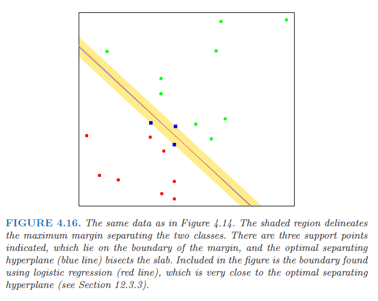

# Resolução do Exercício 4.5

## Caso unidimensional ($x \in \mathbb{R}$)

Considere um problema de regressão logística com duas classes em que os dados $x_i$ das duas classes são completamente separados por um ponto $x_0 \in \mathbb{R}$. Sem perda de generalidade, podemos assumir que:

- Todas as observações da classe 1 satisfazem $x_i < x_0$
- Todas as observações da classe 2 satisfazem $x_i > x_0$

O modelo de regressão logística para duas classes é dado por: $$P(G=2|X=x) = \frac{1}{1 + e^{-(\beta_0 + \beta_1 x)}}$$

onde $\beta_0$ é o intercepto e $\beta_1$ é o coeficiente angular.

A log-verossimilhança para $N$ observações é: $$\ell(\beta_0, \beta_1) = \sum_{i=1}^N \left[ y_i \log p(x_i) + (1-y_i) \log (1-p(x_i)) \right]$$

onde $y_i = 1$ para observações da classe 2 e $y_i = 0$ para observações da classe 1, e $p(x_i) = P(G=2|X=x_i)$.

Para dados perfeitamente separáveis, queremos que:

- $P(G=2|X=x_i) \approx 0$ para todos os pontos da classe 1 ($x_i < x_0$)
- $P(G=2|X=x_i) \approx 1$ para todos os pontos da classe 2 ($x_i > x_0$)

Estas probabilidades se aproximam de 0 ou 1 quando $|\beta_0 + \beta_1 x_i|$ se torna muito grande, com o sinal apropriado.

**Caracterização das estimativas MLE:**

1. O sinal de $\beta_1$ deve ser positivo, pois precisamos que $\beta_0 + \beta_1 x_i$ seja:
   - Muito negativo para $x_i < x_0$ (classe 1)
   - Muito positivo para $x_i > x_0$ (classe 2)
2. Quando os dados são separáveis, a log-verossimilhança aumenta monotonicamente à medida que $|\beta_1| \to \infty$, mantendo $\beta_0 = -\beta_1 x_0$. Esta relação entre $\beta_0$ e $\beta_1$ garante que a fronteira de decisão (onde $P(G=2|X=x) = 0.5$) ocorra exatamente em $x = x_0$.
3. Portanto, as estimativas de máxima verossimilhança são:
   - $\hat{\beta}_1 \to +\infty$
   - $\hat{\beta}_0 \to -\infty$ com $\hat{\beta}_0 = -\hat{\beta}_1 x_0$

Ou seja, as estimativas MLE não são finitas quando os dados são perfeitamente separáveis, mas tendem a infinito com uma relação específica entre si.

## (a) Generalização para $x \in \mathbb{R}^p$

Para $x \in \mathbb{R}^p$, o modelo de regressão logística é: $$P(G=2|X=x) = \frac{1}{1 + e^{-(\beta_0 + \beta^T x)}}$$

onde $\beta = (\beta_1, \beta_2, ..., \beta_p)^T$ é o vetor de coeficientes.

Se os dados são perfeitamente separáveis no espaço $p$-dimensional, então existe um hiperplano $\beta_0 + \beta^T x = 0$ que separa completamente as duas classes. Como mostrado na Figura 4.16 mencionada no enunciado, esse hiperplano não é único.

**Caracterização das estimativas MLE:**

1. A direção do vetor $\beta$ aponta da classe 1 para a classe 2, perpendicularmente ao hiperplano separador.
2. As estimativas de máxima verossimilhança satisfazem:
   - $|\hat{\beta}| \to \infty$ (a magnitude do vetor tende ao infinito)
   - $\hat{\beta}/|\hat{\beta}|$ converge para uma direção fixa que é perpendicular ao hiperplano separador ótimo
   - $\hat{\beta}_0 \to -\infty$ de tal forma que o hiperplano $\hat{\beta}_0 + \hat{\beta}^T x = 0$ mantém-se entre as classes
3. Neste caso, a fronteira de decisão converge para um hiperplano específico, que é o hiperplano separador que maximiza a margem entre as classes (semelhante ao que seria encontrado pelo algoritmo de perceptron ou SVM).

## (b) Generalização para mais de duas classes

Para um problema com $K > 2$ classes, o modelo de regressão logística multinomial é:

$$P(G=k|X=x) = \frac{e^{\beta_{k0} + \beta_k^T x}}{1 + \sum_{l=1}^{K-1} e^{\beta_{l0} + \beta_l^T x}}, \quad k=1,...,K-1$$

$$P(G=K|X=x) = \frac{1}{1 + \sum_{l=1}^{K-1} e^{\beta_{l0} + \beta_l^T x}}$$

Se as $K$ classes são perfeitamente separáveis (cada classe pode ser separada de todas as outras por hiperplanos), então:

1. Para cada par de classes $(j,k)$, os respectivos coeficientes $\beta_j - \beta_k$ e interceptos $\beta_{j0} - \beta_{k0}$ tendem a infinito em magnitude, de modo que:
   - As probabilidades previstas $P(G=k|X=x_i)$ tendem a 1 para observações da classe $k$
   - As probabilidades previstas $P(G=k|X=x_i)$ tendem a 0 para observações de outras classes
2. A separação perfeita em um problema multiclasse ocorre quando cada classe pode ser separada de todas as demais por uma combinação de hiperplanos.
3. As estimativas MLE não são finitas, e a log-verossimilhança pode ser aumentada arbitrariamente fazendo com que os vetores $\beta_k$ tendam ao infinito em direções apropriadas.

Em todos estes casos (uni, multi-dimensional e multiclasse), as estimativas de máxima verossimilhança da regressão logística são indefinidas (tendem ao infinito) quando os dados são perfeitamente separáveis, corroborando a observação feita no texto principal sobre a necessidade de regularização ou a vantagem da abordagem de verossimilhança conjunta da LDA, que não sofre desta degenerescência.