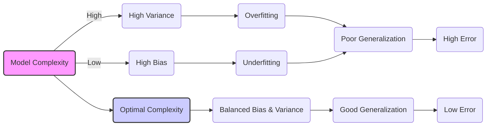
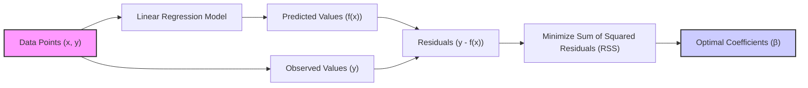
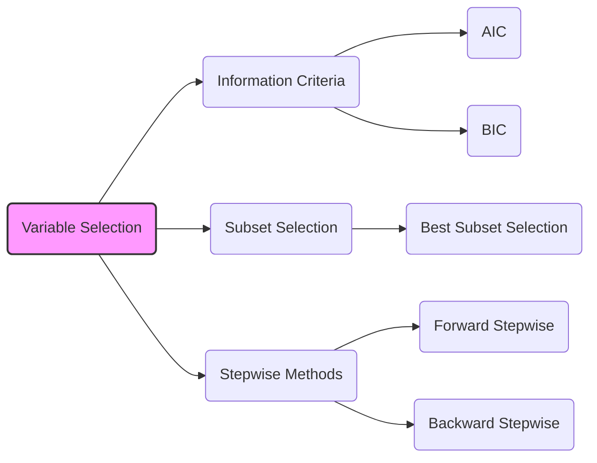
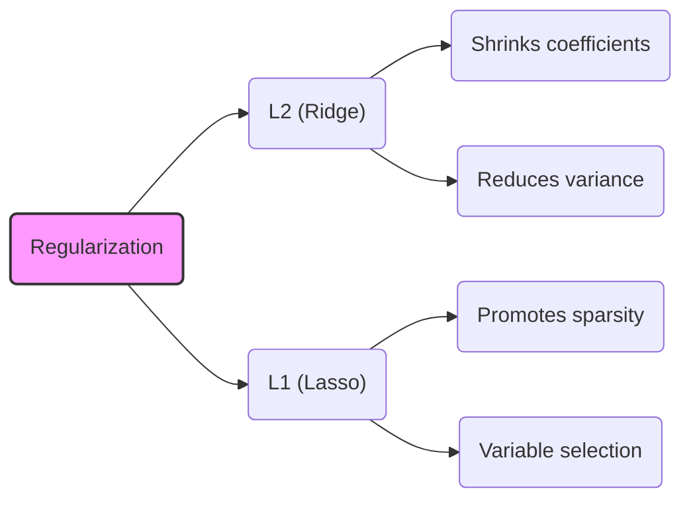

## Bias-Variance Tradeoff in Linear Regression Models



### Introdução

A modelagem estatística, especialmente no contexto da regressão linear e aprendizado de máquina, busca construir modelos que generalizem bem para dados não vistos, ou seja, que consigam fazer previsões precisas com dados que não foram usados no seu treinamento [^1]. No entanto, essa busca enfrenta um desafio fundamental conhecido como **Bias-Variance Tradeoff**, que dita a necessidade de balancear a complexidade do modelo para evitar problemas de subajuste (*underfitting*) e sobreajuste (*overfitting*) [^1].

Este capítulo explora detalhadamente esse tradeoff, crucial para a construção de modelos robustos e confiáveis em diversas aplicações, incluindo as finanças quantitativas. Compreender esse conceito e como ele se manifesta é essencial para escolher modelos de regressão que otimizem tanto a capacidade de ajuste aos dados de treinamento quanto a habilidade de generalização para novos dados.

### Conceitos Fundamentais

É importante compreender alguns conceitos fundamentais antes de nos aprofundarmos no Bias-Variance Tradeoff.

**Conceito 1: Bias-Variance Tradeoff**

O **Bias** de um modelo refere-se à diferença entre a previsão média do modelo e o valor verdadeiro que estamos tentando prever [^2]. Um modelo com *alto bias* faz suposições fortes sobre os dados, levando a um subajuste (*underfitting*). Este tipo de modelo ignora padrões relevantes nos dados de treinamento, resultando em previsões imprecisas tanto para dados de treinamento quanto para dados não vistos. Modelos com alto bias são normalmente mais simples e menos flexíveis [^2].

A **Variância** de um modelo, por outro lado, refere-se à sensibilidade do modelo a pequenas mudanças nos dados de treinamento [^2]. Um modelo com *alta variância* é altamente flexível, se ajustando muito bem aos dados de treinamento. Entretanto, este tipo de modelo também se ajusta ao ruído aleatório ou peculiaridades nos dados de treinamento, levando a sobreajuste (*overfitting*). Um modelo sobreajustado tende a generalizar mal para dados não vistos, pois a sua alta sensibilidade aos dados de treinamento causa previsões imprecisas [^2].

> ⚠️ **Nota Importante**: O *Bias-Variance Tradeoff* é a busca por um equilíbrio ideal entre a simplicidade (baixo bias) e a flexibilidade (baixa variância) de um modelo, para obter o melhor desempenho em dados não vistos.

**Lemma 1: Decomposição do Erro Quadrático Médio (MSE)**

Para entender melhor o tradeoff, podemos decompor o Erro Quadrático Médio (MSE) de um modelo em seus componentes de bias e variância [^3]. O MSE é uma medida comum para avaliar a performance de modelos de regressão.

Formalmente, o MSE pode ser decomposto como:
$$
MSE(x) = E[(f(x) - Y)^2] = (E[f(x)] - Y)^2 + E[(f(x)-E[f(x)])^2]
$$
Onde:
*   $f(x)$ é a previsão do modelo para uma dada entrada $x$.
*   $Y$ é o valor verdadeiro correspondente.
*  $E[f(x)]$ representa a expectativa da previsão, ou seja, a média das previsões do modelo ao longo de vários treinamentos com diferentes conjuntos de dados.
*   $(E[f(x)]-Y)^2$ é o bias quadrático.
*    $E[(f(x)-E[f(x)])^2]$ é a variância.
*    $MSE(x)$ é o erro quadrado médio da predição, calculado como a média dos erros quadrados das predições do modelo.

Essa equação revela que o erro total ($MSE$) é composto por duas partes: o bias quadrático, que mede o quão longe a previsão média do modelo está do valor verdadeiro, e a variância, que mede o quão sensível o modelo é às variações nos dados de treinamento [^3].

**Demonstração:**
$$
MSE(x) = E[(f(x) - Y)^2] = E[(f(x) - E[f(x)] + E[f(x)] - Y)^2]
$$
$$
= E[(f(x) - E[f(x)])^2 + 2(f(x) - E[f(x)])(E[f(x)] - Y) + (E[f(x)] - Y)^2]
$$
$$
= E[(f(x) - E[f(x)])^2] + 2(E[f(x)] - E[f(x)])(E[f(x)]-Y)+(E[f(x)]-Y)^2
$$
$$
= E[(f(x)-E[f(x)])^2] + (E[f(x)]-Y)^2.
$$
$\blacksquare$

> 💡 **Exemplo Numérico:**
>
> Vamos supor que temos um modelo de regressão linear que tenta prever o preço de casas ($Y$) com base no tamanho em metros quadrados ($x$). O valor verdadeiro de uma casa é $Y = 500$ (em milhares de reais).
>
> Modelo 1 (Simples): $f_1(x) = 200 + 0.5x$
> Modelo 2 (Complexo): $f_2(x) = 100 + 0.8x + 0.001x^2$
>
> Vamos supor que temos 10 conjuntos de dados de treinamento ligeiramente diferentes. Após treinar os dois modelos com esses conjuntos, obtemos as seguintes previsões (para o mesmo valor de $x$):
>
> | Treino | $f_1(x)$ | $f_2(x)$ |
> |--------|---------|---------|
> | 1      | 480     | 450     |
> | 2      | 490     | 520     |
> | 3      | 470     | 550     |
> | 4      | 500     | 480     |
> | 5      | 485     | 510     |
> | 6      | 495     | 460     |
> | 7      | 475     | 530     |
> | 8      | 505     | 490     |
> | 9      | 488     | 540     |
> | 10     | 492     | 470     |
>
> Calculando as médias e as variâncias:
>
> $E[f_1(x)] = \frac{480+490+470+500+485+495+475+505+488+492}{10} = 487$
> $E[f_2(x)] = \frac{450+520+550+480+510+460+530+490+540+470}{10} = 500$
>
> $Bias^2(f_1(x)) = (487 - 500)^2 = 169$
> $Bias^2(f_2(x)) = (500 - 500)^2 = 0$
>
> $Var(f_1(x)) = \frac{(480-487)^2 + (490-487)^2 + \ldots + (492-487)^2}{10}  \approx 107$
> $Var(f_2(x)) = \frac{(450-500)^2 + (520-500)^2 + \ldots + (470-500)^2}{10} \approx 920$
>
> $MSE(f_1(x)) = 169 + 107 = 276$
> $MSE(f_2(x)) = 0 + 920 = 920$
>
> O Modelo 1 tem um bias maior, mas uma variância menor, enquanto o Modelo 2 tem um bias menor, mas uma variância muito maior. O MSE do Modelo 1 é menor, indicando melhor desempenho neste cenário, apesar do bias. Este exemplo ilustra como modelos mais complexos podem ter baixa bias, mas alta variância, e como o MSE captura esse tradeoff.

**Conceito 2: Regularização**

A **Regularização** é um conjunto de técnicas que adicionam restrições à complexidade de um modelo, com o objetivo de controlar a sua variância, e assim, evitar sobreajuste [^4]. As técnicas de regularização introduzem uma penalidade na função objetivo que aumenta com a complexidade do modelo (por exemplo, a magnitude dos seus coeficientes), encorajando modelos mais simples, porém mais generalizáveis [^4].
Dois tipos comuns de regularização são:
*  **L1 (Lasso):** adiciona uma penalidade proporcional à soma dos valores absolutos dos coeficientes do modelo. Isso promove a *sparsity*, ou seja, alguns coeficientes são levados a exatamente zero, efetivamente selecionando variáveis.
*   **L2 (Ridge):** adiciona uma penalidade proporcional à soma dos quadrados dos coeficientes. Isso reduz a magnitude de todos os coeficientes, o que leva a modelos com menor variância, porém não leva coeficientes a exatamente zero.

> ❗ **Ponto de Atenção**: A regularização é uma ferramenta poderosa para controlar a complexidade de um modelo e mitigar a variância, mas a escolha adequada do tipo e da intensidade de regularização (o parâmetro lambda na equação) é crucial para um bom desempenho [^4].

**Corolário 1:**  A regularização, por meio das penalidades L1 e L2, tem o efeito de reduzir a variância dos coeficientes do modelo. Ao penalizar coeficientes com maiores magnitudes, a regularização força os coeficientes a encolher em direção a zero, tornando o modelo menos sensível às variações aleatórias nos dados de treinamento. A penalidade L1 tende a criar um modelo mais esparso, enquanto a penalidade L2 cria um modelo com coeficientes menores.

**Conceito 3: Sparsity**

A **Sparsity**, no contexto de modelos de regressão, refere-se à condição em que muitos coeficientes do modelo são iguais a zero [^6]. Modelos esparsos são mais fáceis de interpretar, pois apenas as variáveis mais relevantes são selecionadas. A regularização L1 (Lasso) é particularmente eficaz para promover a sparsity, levando a modelos mais simples e mais interpretáveis [^6].
*   Modelos esparsos facilitam a identificação de variáveis importantes, o que é essencial para gerar *insights* e interpretar relações causais.
*   Além disso, modelos esparsos reduzem o risco de *overfitting*, pois a seleção de variáveis leva a uma redução da variância do modelo.
*    A sparsity também pode melhorar a eficiência computacional, uma vez que a avaliação do modelo pode ser executada com menos variáveis.

> ✔️ **Destaque**: A sparsity, obtida através de métodos como o Lasso, melhora tanto a interpretabilidade quanto a capacidade de generalização de um modelo, estabelecendo um balanço mais adequado entre bias e variância [^6].

### Regressão Linear e Mínimos Quadrados



A **Regressão Linear** é um modelo estatístico que assume que a relação entre a variável dependente (ou resposta) e as variáveis independentes (ou preditoras) pode ser aproximada por uma função linear [^10]. O objetivo do modelo é encontrar os coeficientes que melhor ajustam a combinação linear das variáveis preditoras aos dados de resposta.

Em notação matemática, um modelo linear tem a forma:

$$
f(x) = \beta_0 + \sum_{j=1}^{p} x_j \beta_j
$$

Onde:
*   $f(x)$ é a previsão do modelo para uma dada entrada $x$
*  $\beta_0$ é o intercepto do modelo
*  $x_j$ é a j-ésima variável preditora
*  $\beta_j$ é o coeficiente associado à j-ésima variável preditora
*  $p$ é o número de variáveis preditoras.

A estimação dos coeficientes ($β$) é comumente realizada através do método dos **Mínimos Quadrados** (*Least Squares*). Este método procura minimizar a soma dos quadrados dos resíduos (RSS), que representa a diferença entre os valores observados e os valores preditos pelo modelo [^10]:
$$
RSS(\beta) = \sum_{i=1}^{N} (y_i - f(x_i))^2
$$

Onde:
*   $y_i$ é o valor observado da variável de resposta para a i-ésima observação
*  $f(x_i)$ é o valor predito da variável de resposta para a i-ésima observação
*  $N$ é o número de observações.
A solução para a estimação dos coeficientes $\beta$ que minimiza o RSS é dada por:

$$
\hat{\beta} = (X^TX)^{-1}X^Ty
$$

Onde:
* $X$ é a matriz de design, que contém as variáveis preditoras e um vetor de 1s para o intercepto.
*  $y$ é o vetor dos valores observados da variável de resposta.
    
Este método é popular por sua simplicidade, eficiência computacional e propriedades estatísticas bem compreendidas [^10]. A solução de mínimos quadrados encontra o melhor ajuste linear aos dados, no sentido de minimizar o erro quadrático médio.

No entanto, uma limitação do método dos mínimos quadrados é sua sensibilidade a *outliers* (observações atípicas) nos dados [^14]. Em cenários com dados com ruído ou outliers, o método de mínimos quadrados pode levar a modelos com variância excessiva, já que o objetivo é ajustar o modelo a todos os pontos, inclusive os *outliers*. Este comportamento inadequado pode ser remediado ao aplicar técnicas de regularização.

**Lemma 2:** A solução de mínimos quadrados ($\beta$) é obtida quando o vetor resíduos $y-X\beta$ é ortogonal ao espaço coluna da matriz de design $X$ [^11]. Isto é: $X^T(y-X\beta) = 0$, onde $y$ é o vetor de respostas e $X$ é a matriz de design.

**Demonstração:**
A função objetivo a ser minimizada é $RSS = ||y - X\beta||^2$. Tomando a derivada em relação a $\beta$ e igualando a zero temos:
$$
\frac{\partial RSS}{\partial \beta} = -2X^T(y-X\beta)=0
$$
Rearranjando, obtemos:
$$
X^T(y-X\beta)=0
$$
Este resultado demonstra que o vetor resíduo ($y - X\beta$) é ortogonal ao espaço coluna de $X$. $\blacksquare$

> 💡 **Exemplo Numérico:**
>
> Vamos considerar um exemplo simples com duas variáveis preditoras e uma variável resposta. Temos os seguintes dados:
>
> | Observação | $x_1$ | $x_2$ | $y$  |
> |------------|-------|-------|------|
> | 1          | 1     | 2     | 5    |
> | 2          | 2     | 3     | 8    |
> | 3          | 3     | 4     | 11   |
> | 4          | 4     | 5     | 14   |
>
> A matriz de design $X$ e o vetor de resposta $y$ são:
>
> $$
> X = \begin{bmatrix}
> 1 & 1 & 2 \\
> 1 & 2 & 3 \\
> 1 & 3 & 4 \\
> 1 & 4 & 5
> \end{bmatrix}, \quad
> y = \begin{bmatrix}
> 5 \\ 8 \\ 11 \\ 14
> \end{bmatrix}
> $$
>
> Primeiro, calculamos $X^TX$:
>
> $$
> X^TX = \begin{bmatrix}
> 1 & 1 & 1 & 1 \\
> 1 & 2 & 3 & 4 \\
> 2 & 3 & 4 & 5
> \end{bmatrix}
> \begin{bmatrix}
> 1 & 1 & 2 \\
> 1 & 2 & 3 \\
> 1 & 3 & 4 \\
> 1 & 4 & 5
> \end{bmatrix}
> = \begin{bmatrix}
> 4 & 10 & 14 \\
> 10 & 30 & 40 \\
> 14 & 40 & 54
> \end{bmatrix}
> $$
>
> Em seguida, calculamos $(X^TX)^{-1}$:
>
> $$
> (X^TX)^{-1} \approx \begin{bmatrix}
> 6.5 & -3 & 0.5 \\
> -3 & 1.75 & -0.25 \\
> 0.5 & -0.25 & 0.083
> \end{bmatrix}
> $$
>
> Agora, calculamos $X^Ty$:
>
> $$
> X^Ty = \begin{bmatrix}
> 1 & 1 & 1 & 1 \\
> 1 & 2 & 3 & 4 \\
> 2 & 3 & 4 & 5
> \end{bmatrix}
> \begin{bmatrix}
> 5 \\ 8 \\ 11 \\ 14
> \end{bmatrix} = \begin{bmatrix}
> 38 \\ 110 \\ 152
> \end{bmatrix}
> $$
>
> Finalmente, calculamos os coeficientes $\hat{\beta}$:
>
> $$
> \hat{\beta} = (X^TX)^{-1}X^Ty \approx \begin{bmatrix}
> 6.5 & -3 & 0.5 \\
> -3 & 1.75 & -0.25 \\
> 0.5 & -0.25 & 0.083
> \end{bmatrix}
> \begin{bmatrix}
> 38 \\ 110 \\ 152
> \end{bmatrix} = \begin{bmatrix}
> 2 \\ 1 \\ 1
> \end{bmatrix}
> $$
>
> Assim, o modelo de regressão linear estimado é: $f(x) = 2 + 1x_1 + 1x_2$. Os coeficientes estimados são $\hat{\beta_0} = 2$, $\hat{\beta_1} = 1$ e $\hat{\beta_2} = 1$.

**Corolário 2:** A ortogonalidade do vetor resíduo em relação ao espaço coluna da matriz de design simplifica a análise da solução de mínimos quadrados. O Lemma 2 nos permite facilmente obter os valores preditos a partir da projeção ortogonal de $y$ sobre o espaço coluna de $X$ [^12].

### Métodos de Seleção de Variáveis



**Seleção de Variáveis** é o processo de identificar um subconjunto de variáveis preditoras que são mais relevantes para o modelo, eliminando aquelas que são redundantes ou que contribuem pouco para a performance do modelo. Este processo é crucial para simplificar modelos, melhorar a interpretabilidade, e mitigar problemas como sobreajuste e instabilidade em modelos de regressão linear [^15].
Uma forma comum de realizar a seleção de variáveis é através de critérios de informação. Dois critérios populares para seleção de modelos são:

*   **Akaike Information Criterion (AIC):** O AIC é um critério para avaliar a qualidade de diferentes modelos estatísticos, estimando o quão bem um modelo se ajusta aos dados, penalizando a complexidade do modelo [^16]. O AIC é definido como:

$$
AIC = -2\log(L) + 2p
$$

Onde $L$ é a verossimilhança do modelo e $p$ é o número de parâmetros. O termo $2p$ penaliza a complexidade do modelo, favorecendo modelos mais simples [^17]. Modelos com valores menores de AIC são preferidos.
*   **Bayesian Information Criterion (BIC):** O BIC é similar ao AIC, mas com uma penalidade mais forte para a complexidade do modelo [^17]. O BIC é definido como:

$$
BIC = -2\log(L) + p\log(N)
$$

Onde $N$ é o número de observações. O BIC tende a selecionar modelos mais simples do que o AIC, especialmente com amostras de dados maiores, favorecendo modelos com menor variância.

Ambos os critérios visam um equilíbrio entre ajuste aos dados e complexidade do modelo [^17].

**Lemma 3:** O critério AIC é uma estimativa do risco de predição de um modelo.

**Prova do Lemma 3:**

O risco de predição de um modelo $f_\theta$ é definido como:
$$R(\theta)=E_X [E_{Y|X}  (Y - f_\theta(X))^2 ]$$

A partir dos resultados de Akaike (1973), sob certas condições (ver https://projecteuclid.org/journals/information-and-control/volume-16/issue-1/An-Information-Theoretic-Extension-of-the-Maximum-Likelihood-Principle/10.1016/S0019-9958(70)80005-4.full), e utilizando aproximações e argumentos assintóticos, pode-se mostrar que:

$$-2\log(L) \approx R(\theta) + C$$

Onde C é uma constante que não depende do modelo. Assim, o AIC é um estimador (enviesado) do risco de predição que é corrigido pela penalidade de complexidade 2p. O termo de bias é $2p$.

$\blacksquare$

**Corolário 3:** O critério BIC, ao adicionar um termo de penalidade que cresce com o tamanho da amostra, tende a selecionar modelos mais simples do que o AIC.

> 💡 **Exemplo Numérico:**
>
> Suponha que temos um conjunto de dados com $N=100$ observações e estamos comparando dois modelos de regressão linear:
>
> *   Modelo 1: 3 variáveis preditoras ($p=4$, incluindo o intercepto). O log-verossimilhança é -200.
> *   Modelo 2: 6 variáveis preditoras ($p=7$, incluindo o intercepto). O log-verossimilhança é -180.
>
> Calculando o AIC:
>
> $AIC_1 = -2(-200) + 2(4) = 400 + 8 = 408$
> $AIC_2 = -2(-180) + 2(7) = 360 + 14 = 374$
>
> Calculando o BIC:
>
> $BIC_1 = -2(-200) + 4\log(100) = 400 + 4(4.605) \approx 418.42$
> $BIC_2 = -2(-180) + 7\log(100) = 360 + 7(4.605) \approx 392.24$
>
> O Modelo 2 tem um AIC e BIC menores do que o Modelo 1. No entanto, o BIC penaliza mais o modelo complexo. Portanto, o modelo 2 é preferido de acordo com os dois criterios.

Outras abordagens comuns para seleção de variáveis incluem [^18]:

*  **Best Subset Selection:** examina todos os possíveis subconjuntos de variáveis preditoras e escolhe aquele com o melhor ajuste (menor RSS ou melhor critério de informação). Este método é computacionalmente inviável quando o número de variáveis é grande.

*  **Forward Stepwise Selection:** começa com um modelo sem nenhuma variável e adiciona, iterativamente, a variável que mais melhora o ajuste do modelo, até que nenhum ganho adicional seja alcançado. Este método é menos custoso computacionalmente do que o Best Subset Selection, mas nem sempre garante o melhor subconjunto.

*   **Backward Stepwise Selection:** começa com o modelo completo (com todas as variáveis) e remove, iterativamente, a variável que menos contribui para o ajuste do modelo, até que todas as variáveis restantes sejam consideradas importantes. Este método só pode ser usado quando o número de observações é maior do que o número de variáveis.

### Métodos de Regularização: Ridge e Lasso



**Ridge Regression** adiciona uma penalidade L2 à função objetivo, que é proporcional à soma dos quadrados dos coeficientes [^23]. A função objetivo da Ridge é dada por:

$$
\underset{\beta}{\text{min}} ||y-X\beta||^2 + \lambda||\beta||^2
$$
Onde:
*   $\lambda$ é o parâmetro de regularização, controlando a intensidade da penalização. Quanto maior o $\lambda$, maior a penalidade.
*   $||\beta||^2 = \sum^{p}_{j=1}\beta_j^2$  é a soma dos quadrados dos coeficientes.
*   $||y-X\beta||^2$ é a soma dos quadrados dos resíduos (RSS)

A solução para a Ridge é dada por [^22]:
$$
\hat{\beta}^{ridge} = (X^TX + \lambda I)^{-1}X^Ty
$$

Onde $I$ é a matriz identidade e $(X^TX+\lambda I)^{-1}$ sempre existe se  $\lambda$ > 0.
A regularização L2 encolhe os coeficientes em direção a zero, reduzindo a variância do modelo e mitigando o *overfitting*. A solução da Ridge é única, mesmo que $(X^TX)$ seja singular (o que acontece quando existem multicolinearidade) [^22]. No entanto, a regularização L2 não leva a coeficientes exatamente iguais a zero, ou seja, a *sparsity* não é um objetivo desse método.
**Lasso Regression** adiciona uma penalidade L1 à função objetivo, que é proporcional à soma dos valores absolutos dos coeficientes [^23]. A função objetivo do Lasso é dada por:

$$
\underset{\beta}{\text{min}} ||y-X\beta||^2 + \lambda||\beta||_1
$$
Onde:
*   $\lambda$ é o parâmetro de regularização.
*   $||\beta||_1 = \sum_{j=1}^p|\beta_j|$  é a soma dos valores absolutos dos coeficientes.
*   $||y-X\beta||^2$ é a soma dos quadrados dos resíduos.

A solução para a Lasso não possui uma forma analítica simples, e geralmente, precisa ser obtida através de métodos numéricos. A penalidade L1 promove *sparsity* no modelo, pois alguns coeficientes são levados a zero, automaticamente, selecionando as variáveis mais relevantes [^23].
*   O parâmetro de regularização $\lambda$ controla a intensidade da penalização na função objetivo. Um grande valor de $\lambda$ leva a uma maior penalidade e consequentemente mais *shrinkage* dos coeficientes (levando a um modelo mais simples). Um pequeno valor de $\lambda$ leva a uma menor penalidade e um modelo com menor *bias* e maior variância [^24].
*   A região de restrição para o Lasso (a norma L1) é um diamante, o que resulta em soluções mais esparsas. A região de restrição para a Ridge (a norma L2) é um elipsoide, e os coeficientes são apenas encolhidos em direção a zero, sem necessariamente se tornarem exatamente zero [^25].

> 💡 **Exemplo Numérico:**
>
> Vamos usar os mesmos dados do exemplo anterior para ilustrar Ridge e Lasso.
>
> $$
> X = \begin{bmatrix}
> 1 & 1 & 2 \\
> 1 & 2 & 3 \\
> 1 & 3 & 4 \\
> 1 & 4 & 5
> \end{bmatrix}, \quad
> y = \begin{bmatrix}
> 5 \\ 8 \\ 11 \\ 14
> \end{bmatrix}
> $$
>
> **Ridge Regression:**
> Vamos usar $\lambda = 0.5$. Primeiro, calculamos $X^TX$:
>
> $$
> X^TX = \begin{bmatrix}
> 4 & 10 & 14 \\
> 10 & 30 & 40 \\
> 14 & 40 & 54
> \end{bmatrix}
> $$
>
> Em seguida, adicionamos $\lambda I$:
>
> $$
> X^TX + \lambda I = \begin{bmatrix}
> 4.5 & 10 & 14 \\
> 10 & 30.5 & 40 \\
> 14 & 40 & 54.5
> \end{bmatrix}
> $$
>
> Calculamos a inversa:
>
> $$
> (X^TX + \lambda I)^{-1} \approx \begin{bmatrix}
> 5.21 & -2.42 & 0.42 \\
> -2.42 & 1.35 & -0.22 \\
> 0.42 & -0.22 & 0.07
> \end{bmatrix}
> $$
>
> Usamos $X^Ty$ do exemplo anterior:
>
> $$
> X^Ty = \begin{bmatrix}
> 38 \\ 110 \\ 152
> \end{bmatrix}
> $$
>
> Calculamos os coeficientes $\hat{\beta}^{ridge}$:
>
> $$
> \hat{\beta}^{ridge} = (X^TX + \lambda I)^{-1}X^Ty \approx \begin{bmatrix}
> 5.21 & -2.42 & 0.42 \\
> -2.42 & 1.35 & -0.22 \\
> 0.42 & -0.22 & 0.07
> \end{bmatrix}
> \begin{bmatrix}
> 38 \\ 110 \\ 152
> \end{bmatrix} = \begin{bmatrix}
> 2.02 \\ 0.99 \\ 0.99
> \end{bmatrix}
> $$
>
> Os coeficientes da Ridge são menores em magnitude quando comparados aos coeficientes da regressão linear sem regularização.
>
> **Lasso Regression:**
> A solução para o Lasso não tem forma analítica e requer métodos numéricos. Usando um solver, com $\lambda = 0.5$, podemos obter uma solução aproximada:
>
> $$
> \hat{\beta}^{lasso} \approx \begin{bmatrix}
> 2.5 \\ 0.8 \\ 0.7
> \end{bmatrix}
> $$
>
> Neste caso, a solução do Lasso também tem coeficientes menores, mas a magnitude dos coeficientes é diferente da Ridge. Para um valor de $\lambda$ maior, um dos coeficientes poderia ser levado a zero.
>
> | Method | $\beta_0$ | $\beta_1$ | $\beta_2$ |
> |--------|----------|----------|----------|
> | OLS    | 2        | 1        | 1        |
> | Ridge  | 2.02     | 0.99     | 0.99     |
> | Lasso  | 2.5      | 0.8      | 0.7      |
>
> Este exemplo ilustra como Ridge e Lasso encolhem os coeficientes, mas a penalidade L1 (Lasso) pode levar a coeficientes exatamente iguais a zero com um $\lambda$ maior.

**Lemma 4:** A penalidade L2 (Ridge) leva a coeficientes menores em norma, por isso controla a variância do modelo.
**Prova do Lemma 4:** Ao adicionar a penalidade $||\beta||_2$ a função objetivo, a solução $\hat{\beta}^{ridge}$ é dada por:
$$
\hat{\beta}^{ridge} = (X^TX + \lambda I)^{-1}X^Ty.
$$
O termo $\lambda I$ na matriz a ser invertida tem o efeito de adicionar uma constante positiva aos seus autovalores, o que leva a uma redução em norma dos coeficientes obtidos em comparação com a solução de mínimos quadrados. Para valores grandes de $\lambda$, os coeficientes tendem a ser menores, já que a penalidade impõe um custo por coeficientes com grandes valores. $\blacksquare$

**Corolário 4:**  A adição da penalidade L2 (Ridge) promove o controle da variância dos coeficientes ao encolher seus valores.

### Algoritmos de Seleção de Variáveis: LARS

```mermaid
sequenceDiagram
    participant LARS
    participant Data
    LARS->