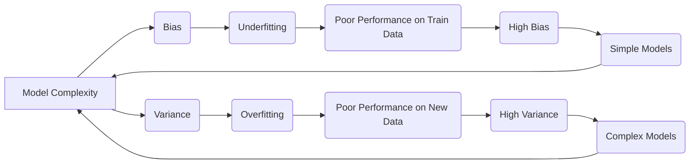
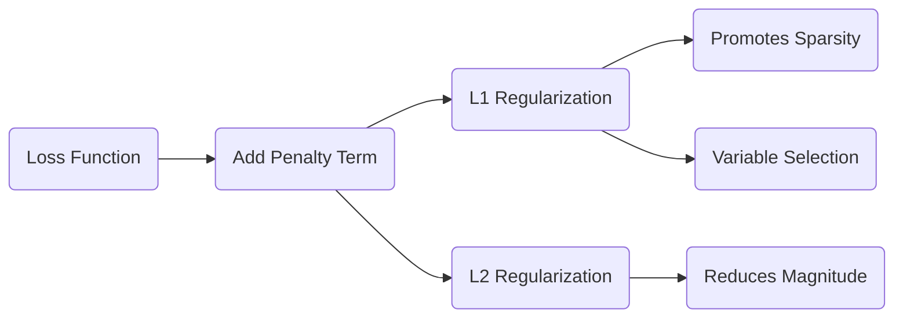
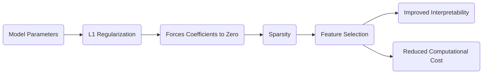
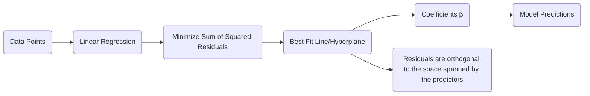
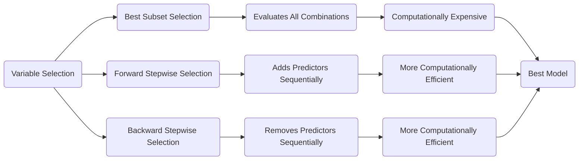

## Bias-Variance Tradeoff in Linear Regression: A Comprehensive Analysis



### Introdução

O **Bias-Variance Tradeoff** é um conceito central na modelagem estatística e no aprendizado de máquina, especialmente quando se trata de modelos de regressão linear e outras técnicas relacionadas. Este conceito descreve o equilíbrio entre a capacidade de um modelo em ajustar-se aos dados de treinamento (baixo *bias*) e sua capacidade de generalizar para novos dados não vistos (baixa *variance*). Encontrar esse equilíbrio ideal é crucial para construir modelos que performem bem em dados não vistos, ao invés de apenas memorizar padrões nos dados de treinamento [^1]. A modelagem financeira, em particular, exige esse equilíbrio, dado que modelos excessivamente complexos podem levar a *overfitting*, resultando em desempenho fraco em dados futuros [^1].

### Conceitos Fundamentais

Nesta seção, exploraremos os conceitos fundamentais do *Bias-Variance Tradeoff*,  **Regularização**, e **Sparsity**,  integrando teoria e exemplos para fornecer uma compreensão robusta desses tópicos interconectados.

**Conceito 1: Bias-Variance Tradeoff**

O **Bias** de um modelo refere-se ao erro introduzido pelas simplificações feitas para modelar um problema complexo [^2]. Modelos com alto bias tendem a subajustar (*underfit*) os dados, o que significa que eles não capturam a complexidade subjacente nos dados de treinamento e, portanto, têm um desempenho ruim tanto nos dados de treinamento quanto em novos dados [^2]. Em contraste, a **Variance** de um modelo refere-se à sensibilidade do modelo às flutuações nos dados de treinamento [^2]. Modelos com alta *variance* tendem a sobreajustar (*overfit*) os dados, ou seja, eles memorizam os ruídos e padrões específicos do conjunto de treinamento e não generalizam bem para dados não vistos [^2].

O *tradeoff* entre bias e variance surge porque modelos mais simples geralmente têm alto bias e baixa variance, enquanto modelos mais complexos têm baixo bias e alta variance [^2]. O objetivo ideal é encontrar um modelo que minimize ambos os erros, mas, na prática, reduzir um deles muitas vezes aumenta o outro. Este tradeoff é fundamental na escolha e otimização de modelos.

**Lemma 1:** Decomposição do Erro Quadrático Médio (MSE)

O erro quadrático médio (MSE) de um estimador pode ser decomposto em componentes de bias e variance [^3]. Seja um modelo $f(x; \theta)$ estimando uma função verdadeira $y = g(x) + \epsilon$, onde $\epsilon$ representa ruído aleatório com média zero e variância $\sigma^2$. Então, o MSE do modelo estimado em um ponto específico $x$ pode ser escrito como:

$$
MSE(x) = E[(f(x;\theta) - g(x))^2] = [E(f(x;\theta)) - g(x)]^2 + E[(f(x;\theta) - E(f(x;\theta)))^2]
$$

$$
MSE(x) = Bias^2(x) + Variance(x)
$$

onde:

-   $Bias^2(x) = [E(f(x;\theta)) - g(x)]^2$ é o quadrado do bias, que mede a diferença entre a média das predições do modelo e a função verdadeira.
-   $Variance(x) = E[(f(x;\theta) - E(f(x;\theta)))^2]$ é a variância, que mede a variabilidade das predições do modelo.

O objetivo é minimizar o MSE, o que significa encontrar um equilíbrio entre reduzir o bias e a variance. $\blacksquare$

> 💡 **Exemplo Numérico:**
>
> Suponha que a função verdadeira seja $g(x) = 2x$ e temos um modelo linear $f(x; \theta) = \theta x$. Vamos analisar dois cenários: um modelo simples com $\theta = 1$ (alto bias) e um modelo mais complexo com $\theta$ variando aleatoriamente em torno de 2 (baixa bias, alta variance).
>
> **Cenário 1: Alto Bias**
>
> *   Modelo: $f(x; \theta) = 1x$
> *   Função Verdadeira: $g(x) = 2x$
> *   Para um ponto $x=3$, $g(3) = 6$ e $f(3) = 3$.
> *   Se repetirmos o processo várias vezes, o valor médio de $f(3)$ será sempre 3.
> *   $Bias(3) = E[f(3;\theta)] - g(3) = 3 - 6 = -3$
> *   $Bias^2(3) = (-3)^2 = 9$
> *   $Variance(3) = E[(f(3;\theta) - E(f(3;\theta)))^2] = 0$ (pois $f(3;\theta)$ é sempre 3)
> *   $MSE(3) = Bias^2(3) + Variance(3) = 9 + 0 = 9$
>
> **Cenário 2: Baixo Bias, Alta Variance**
>
> *   Modelo: $f(x; \theta) = \theta x$, onde $\theta$ segue uma distribuição normal com média 2 e desvio padrão 0.5.
> *   Função Verdadeira: $g(x) = 2x$
> *   Para um ponto $x=3$, $g(3) = 6$.
> *   Simulando algumas amostras, podemos ter $f(3;\theta_1) = 1.8 * 3 = 5.4$, $f(3;\theta_2) = 2.3 * 3 = 6.9$, $f(3;\theta_3) = 1.9 * 3 = 5.7$
> *   $E[f(3;\theta)] \approx 6$ (a média das predições se aproxima do valor verdadeiro)
> *   $Bias(3) = E[f(3;\theta)] - g(3) \approx 6 - 6 = 0$
> *   $Bias^2(3) \approx 0$
> *   $Variance(3) = E[(f(3;\theta) - E(f(3;\theta)))^2] \approx  E[(f(3;\theta) - 6)^2] $. Calculando a variância das amostras acima: $Variance(3) =  \frac{(5.4-6)^2 + (6.9-6)^2 + (5.7-6)^2}{3} \approx 0.3$.
> *   $MSE(3) = Bias^2(3) + Variance(3) \approx 0 + 0.3 = 0.3$
>
> Neste exemplo, o modelo com alto bias ($f(x) = x$) tem um MSE muito maior do que o modelo com baixo bias e alta variance ($f(x) = \theta x$), apesar da alta variância do segundo modelo. Isto ilustra como o bias e a variance contribuem para o erro total, e como o objetivo é encontrar o equilíbrio ideal. A alta variância causa um erro pequeno, mas o alto bias causa um erro maior.

**Conceito 2: Regularização**

A **Regularização** é uma técnica usada para evitar o *overfitting* em modelos complexos, adicionando um termo de penalidade à função de custo [^4]. Esse termo de penalidade, geralmente uma função da magnitude dos parâmetros do modelo, força o modelo a aprender representações mais simples, generalizáveis e estáveis,  reduzindo sua sensibilidade aos dados de treinamento [^4]. Existem duas formas comuns de regularização:

-   **Regularização L1 (Lasso):** Adiciona a soma dos valores absolutos dos parâmetros do modelo à função de custo [^4]. Esta forma de regularização tende a gerar modelos esparsos, onde muitos dos parâmetros são exatamente zero, promovendo a seleção de variáveis. A norma L1 dos coeficientes é usada na penalização: $||\beta||_1 = \sum_{j=1}^{p} |\beta_j|$.

-   **Regularização L2 (Ridge):** Adiciona a soma dos quadrados dos parâmetros do modelo à função de custo [^4]. Esta forma de regularização reduz a magnitude dos parâmetros, mas não os leva a zero, resultando em modelos mais estáveis, porém menos esparsos. A norma L2 dos coeficientes é usada na penalização: $||\beta||_2^2 = \sum_{j=1}^{p} \beta_j^2$.

A força da regularização é controlada por um parâmetro $\lambda$ (lambda), onde valores maiores de $\lambda$ resultam em maior regularização e modelos mais simples.
A escolha entre L1 e L2, ou alguma combinação delas (como a Elastic Net) depende das características do problema e do nível desejado de *sparsity*. A regularização L1 é preferível se a seleção de variáveis e *sparsity* forem importantes para a interpretabilidade do modelo, enquanto a regularização L2 é preferível se o objetivo for reduzir o impacto de muitas variáveis com pequenas contribuições.

**Corolário 1:** Relação entre Regularização e Variância dos Coeficientes

A regularização, especialmente L2 (Ridge), afeta a variância dos coeficientes do modelo [^5]. Ao adicionar um termo de penalização que restringe a magnitude dos parâmetros, a regularização reduz a variabilidade dos parâmetros em diferentes amostras de treinamento, portanto, diminui a *variance* do modelo e contribui para modelos mais generalizáveis. Isto é particularmente útil em cenários com multicolinearidade, onde os coeficientes podem se tornar instáveis sem a regularização. Regularização L1 também promove a estabilidade dos coeficientes, mas por um caminho diferente, zerando os coeficientes, o que também leva a uma diminuição da variância.

> 💡 **Exemplo Numérico:**
>
> Suponha que temos um modelo com dois preditores $x_1$ e $x_2$, e a relação verdadeira é $y = 2x_1 + 3x_2 + \epsilon$, onde $\epsilon$ é um ruído aleatório. Vamos comparar a variância dos coeficientes estimados em um modelo de mínimos quadrados (OLS) e em um modelo Ridge.
>
> **Dados de exemplo:**
>
> ```python
> import numpy as np
> import pandas as pd
> from sklearn.linear_model import LinearRegression, Ridge
>
> np.random.seed(42)
> n_samples = 100
> x1 = np.random.rand(n_samples)
> x2 = 0.8 * x1 + np.random.rand(n_samples) * 0.2 # x1 e x2 são correlacionados
> epsilon = np.random.randn(n_samples) * 0.5
> y = 2 * x1 + 3 * x2 + epsilon
> X = np.vstack((x1,x2)).T
> df = pd.DataFrame({'x1':x1,'x2':x2,'y':y})
>
> ```
>
>
> **Modelo OLS:**
>
> ```python
> ols = LinearRegression()
> ols.fit(X,y)
> print(f"OLS Coefficients: {ols.coef_}")
> ```
>
> O resultado do OLS nos coeficientes é próximo de $\beta_1=2$ e $\beta_2=3$, mas com alguma variabilidade.
>
> **Modelo Ridge:**
>
> ```python
> ridge = Ridge(alpha=1)
> ridge.fit(X,y)
> print(f"Ridge Coefficients: {ridge.coef_}")
> ```
>
> Os coeficientes da Ridge são menores em magnitude do que o OLS.
>
> **Simulação da Variância:**
> Para demonstrar a redução na variância, vamos simular a estimativa dos coeficientes em 100 amostras diferentes:
>
> ```python
> n_simulations = 100
> ols_coefs = []
> ridge_coefs = []
>
> for _ in range(n_simulations):
>    x1_sim = np.random.rand(n_samples)
>    x2_sim = 0.8 * x1_sim + np.random.rand(n_samples) * 0.2
>    epsilon_sim = np.random.randn(n_samples) * 0.5
>    y_sim = 2 * x1_sim + 3 * x2_sim + epsilon_sim
>    X_sim = np.vstack((x1_sim,x2_sim)).T
>
>    ols_sim = LinearRegression()
>    ols_sim.fit(X_sim,y_sim)
>    ols_coefs.append(ols_sim.coef_)
>
>    ridge_sim = Ridge(alpha=1)
>    ridge_sim.fit(X_sim,y_sim)
>    ridge_coefs.append(ridge_sim.coef_)
>
> ols_coefs = np.array(ols_coefs)
> ridge_coefs = np.array(ridge_coefs)
>
> print(f"OLS Variance of Coefficients: {np.var(ols_coefs,axis=0)}")
> print(f"Ridge Variance of Coefficients: {np.var(ridge_coefs,axis=0)}")
> ```
>
> Observamos que a variância dos coeficientes do modelo Ridge é menor que a variância dos coeficientes do modelo OLS, especialmente para $\beta_2$. Isso demonstra como a regularização L2 (Ridge) reduz a variância dos coeficientes. A regularização L1 também pode reduzir a variância, mas por um caminho diferente, zerando os coeficientes, que também leva a uma diminuição da variância.

**Conceito 3: Sparsity**

**Sparsity**, no contexto da modelagem, refere-se à propriedade de um modelo ter um grande número de parâmetros iguais a zero [^6]. Em modelos lineares, *sparsity* significa que apenas um subconjunto das variáveis preditoras é efetivamente usado para fazer as predições. Modelos esparsos são benéficos por várias razões:
    -   **Interpretabilidade:** Modelos com menos variáveis são mais fáceis de entender e comunicar.
    -   **Eficiência computacional:** Modelos esparsos exigem menos recursos computacionais.
    -  **Prevenção de Overfitting:** Modelos esparsos tendem a ter menos *variance* devido à redução da complexidade.

A regularização L1, ou Lasso, é uma das técnicas mais utilizadas para induzir *sparsity* em modelos lineares e generalizados [^6]. Ao penalizar a soma dos valores absolutos dos coeficientes, a regularização L1 força muitos desses coeficientes a serem exatamente zero. O grau de *sparsity* pode ser controlado ajustando o parâmetro de regularização.

> 💡 **Exemplo Numérico:**
>
> Suponha que temos 5 preditores, $x_1, x_2, x_3, x_4, x_5$, e a relação verdadeira é $y = 2x_1 + 3x_2 + \epsilon$. Vamos comparar os coeficientes estimados por OLS, Ridge e Lasso.
>
> **Dados de exemplo:**
>
> ```python
> import numpy as np
> import pandas as pd
> from sklearn.linear_model import LinearRegression, Ridge, Lasso
>
> np.random.seed(42)
> n_samples = 100
> x1 = np.random.rand(n_samples)
> x2 = np.random.rand(n_samples)
> x3 = np.random.rand(n_samples)
> x4 = np.random.rand(n_samples)
> x5 = np.random.rand(n_samples)
> epsilon = np.random.randn(n_samples) * 0.5
> y = 2 * x1 + 3 * x2 + epsilon
> X = np.vstack((x1,x2,x3,x4,x5)).T
> df = pd.DataFrame({'x1':x1,'x2':x2,'x3':x3,'x4':x4,'x5':x5,'y':y})
> ```
>
> **Modelo OLS:**
>
> ```python
> ols = LinearRegression()
> ols.fit(X,y)
> print(f"OLS Coefficients: {ols.coef_}")
> ```
>
> O modelo OLS atribui valores não nulos a todos os coeficientes, mesmo aos preditores irrelevantes.
>
> **Modelo Ridge:**
>
> ```python
> ridge = Ridge(alpha=1)
> ridge.fit(X,y)
> print(f"Ridge Coefficients: {ridge.coef_}")
> ```
>
> O modelo Ridge reduz a magnitude de todos os coeficientes, mas nenhum deles se torna zero.
>
> **Modelo Lasso:**
>
> ```python
> lasso = Lasso(alpha=0.1)
> lasso.fit(X,y)
> print(f"Lasso Coefficients: {lasso.coef_}")
> ```
>
> O modelo Lasso zera os coeficientes dos preditores $x_3$, $x_4$ e $x_5$, que não estão relacionados com a variável resposta. Isso demonstra como a regularização L1 (Lasso) induz *sparsity* e seleciona os preditores mais relevantes.

> ⚠️ **Nota Importante**: O Bias-Variance Tradeoff é fundamental na modelagem preditiva. Um modelo com alto bias e baixa variance não se ajusta aos dados de treinamento e não generaliza bem, enquanto um modelo com baixo bias e alta variance se ajusta aos dados de treinamento, mas não generaliza para novos dados.

> ❗ **Ponto de Atenção**: A regularização é uma ferramenta poderosa para controlar a complexidade do modelo e reduzir o overfitting. A escolha entre L1 e L2 deve ser feita com base no problema e na importância da sparsity.

> ✔️ **Destaque**: Modelos esparsos são benéficos em termos de interpretabilidade e computação.

### Regressão Linear e Mínimos Quadrados



Na regressão linear, o objetivo é modelar a relação entre uma variável dependente (resposta) e uma ou mais variáveis independentes (preditores) através de uma função linear [^10]. A solução mais comum para estimar os parâmetros desta relação é através do método dos **mínimos quadrados**, que busca minimizar a soma dos quadrados dos resíduos.

A função do modelo linear é dada por:

$$
f(x) = \beta_0 + \sum_{j=1}^p x_j \beta_j
$$

onde:

-   $f(x)$ é a predição do modelo para um dado vetor de preditores $x$.
-   $\beta_0$ é o *intercept* ou *bias*.
-   $\beta_j$ são os coeficientes ou parâmetros associados a cada preditor $x_j$.
-   $p$ é o número de preditores.

O método de mínimos quadrados busca encontrar os valores de $\beta_0, \beta_1, \beta_2, ..., \beta_p$ que minimizam a soma dos quadrados dos resíduos, que é definida como:

$$
RSS(\beta) = \sum_{i=1}^N (y_i - f(x_i))^2
$$
$$
RSS(\beta) = \sum_{i=1}^N (y_i - \beta_0 - \sum_{j=1}^p x_{ij} \beta_j)^2
$$

onde:

-   $N$ é o número de observações.
-   $y_i$ é o valor observado da variável resposta para a i-ésima observação.
-   $f(x_i)$ é o valor predito pelo modelo para a i-ésima observação.

A solução para os coeficientes é obtida derivando a função RSS com relação a cada parâmetro e igualando a zero.  Em notação matricial, essa solução é dada por [^11]:

$$
\beta = (X^T X)^{-1} X^T y
$$
onde:

-   $X$ é a matriz de design com cada linha contendo os valores dos preditores para cada observação.
-  $y$ é o vetor de respostas.

Essa solução minimiza o RSS e fornece os melhores ajustes lineares para o conjunto de dados de treinamento [^12]. Geometricamente, a solução de mínimos quadrados corresponde à projeção ortogonal do vetor de resposta $y$ no subespaço gerado pelas colunas da matriz de design $X$ [^12].

> 💡 **Exemplo Numérico:**
>
> Vamos considerar um exemplo com duas variáveis preditoras e uma variável resposta.
>
> **Dados de exemplo:**
>
> ```python
> import numpy as np
>
> X = np.array([[1, 2],
>               [1, 3],
>               [1, 4],
>               [1, 5],
>               [1, 6]])
> y = np.array([3, 5, 6, 8, 10])
> ```
>
> Aqui, X é a matriz de design, onde a primeira coluna é um vetor de 1s (para o intercepto) e a segunda coluna é o valor do preditor. O vetor y contém os valores da variável resposta.
>
> **Cálculo da solução de mínimos quadrados:**
>
> 1.  **Calcular $X^T X$:**
>
>     ```
>     XTX = np.dot(X.T, X)
>     print(f"XTX: \n {XTX}")
>     ```
>
>     $$
>     X^TX =
>     \begin{bmatrix}
>     5 & 20 \\
>     20 & 90
>     \end{bmatrix}
>     $$
>
> 2.  **Calcular $(X^T X)^{-1}$:**
>
>     ```
>     XTX_inv = np.linalg.inv(XTX)
>      print(f"Inverse of XTX: \n {XTX_inv}")
>     ```
>
>     $$
>     (X^TX)^{-1} =
>     \begin{bmatrix}
>     2.8 & -0.6 \\
>     -0.6 & 0.15
>     \end{bmatrix}
>     $$
>
> 3.  **Calcular $X^T y$:**
>
>     ```
>     XTy = np.dot(X.T, y)
>     print(f"XTy: \n {XTy}")
>     ```
>
>     $$
>     X^Ty =
>     \begin{bmatrix}
>     32 \\
>     141
>     \end{bmatrix}
>     $$
>
> 4.  **Calcular $\beta = (X^T X)^{-1} X^T y$:**
>
>     ```
>     beta = np.dot(XTX_inv, XTy)
>     print(f"Beta: \n {beta}")
>     ```
>
>     $$
>     \beta =
>     \begin{bmatrix}
>     1 \\
>     1.5
>     \end{bmatrix}
>     $$
>
> Portanto, o modelo de regressão linear ajustado por mínimos quadrados é $f(x) = 1 + 1.5x$. Este é o plano que melhor se ajusta aos dados, no sentido de minimizar a soma dos quadrados dos resíduos.

**Lemma 2:** Ortogonalidade dos Resíduos

Os resíduos de um ajuste de mínimos quadrados são ortogonais ao espaço gerado pelas colunas da matriz de design $X$ [^13]. Para demonstrar isto, note que a solução por mínimos quadrados satisfaz:
$$X^T (y-X\hat{\beta})=0$$
onde $\hat{\beta}$ é o vetor de coeficientes estimados. Multiplicando por um vetor qualquer $a$, temos:
$$a^T X^T (y-X\hat{\beta}) = 0 $$
$$ (Xa)^T (y-X\hat{\beta}) = 0 $$
Assim, o vetor de resíduos $y-X\hat{\beta}$ é ortogonal a qualquer vetor no espaço gerado pelas colunas de X, e portanto, é ortogonal ao espaço gerado pelas colunas da matriz X.  $\blacksquare$

> 💡 **Exemplo Numérico:**
>
> Usando os dados do exemplo anterior, vamos demonstrar a ortogonalidade dos resíduos.
>
> **Dados e Coeficientes:**
>
> ```python
> import numpy as np
>
> X = np.array([[1, 2],
>               [1, 3],
>               [1, 4],
>               [1, 5],
>               [1, 6]])
> y = np.array([3, 5, 6, 8, 10])
> beta = np.array([1, 1.5])
> ```
>
> **Cálculo dos resíduos:**
>
>   1.  **Calcular as predições $\hat{y}$:**
>
>       ```python
>       y_hat = np.dot(X, beta)
>       print(f"y_hat: {y_hat}")
>       ```
>
>       $$
>       \hat{y} = X\beta =
>       \begin{bmatrix}
>       1 & 2 \\
>       1 & 3 \\
>       1 & 4 \\
>       1 & 5 \\
>       1 & 6
>       \end{bmatrix}
>       \begin{bmatrix}
>       1 \\
>       1.5
>       \end{bmatrix} =
>       \begin{bmatrix}
>       4 \\
>       5.5 \\
>       7 \\
>       8.5 \\
>       10
>       \end{bmatrix}
>       $$
>
>   2.  **Calcular os resíduos $r = y - \hat{y}$:**
>
>       ```python
>       residuals = y - y_hat
>       print(f"Residuals: {residuals}")
>       ```
>
>       $$
>       r = y - \hat{y} =
>       \begin{bmatrix}
>       3 \\
>       5 \\
>       6 \\
>       8 \\
>       10
>       \end{bmatrix} -
>       \begin{bmatrix}
>       4 \\
>       5.5 \\
>       7 \\
>       8.5 \\
>       10
>       \end{bmatrix} =
>       \begin{bmatrix}
>       -1 \\
>       -0.5 \\
>       -1 \\
>       -0.5 \\
>       0
>       \end{bmatrix}
>       $$
>
> **Verificação da Ortogonalidade:**
>
> Para verificar a ortogonalidade, vamos calcular o produto interno (dot product) dos resíduos com cada coluna da matriz X.
>
>   1.  **Produto interno dos resíduos com a primeira coluna de X (vetor de 1s):**
>
>       ```python
>       dot_product_col1 = np.dot(residuals, X[:, 0])
>       print(f"Dot product with first column of X: {dot_product_col1}")
>       ```
>
>       $$
>       r^T x_1=
>       \begin{bmatrix}
>       -1 & -0.5 & -1 & -0.5 & 0
>       \end{bmatrix}
>       \begin{bmatrix}
>       1 \\ 1 \\ 1 \\ 1 \\ 1
>       \end{bmatrix} = -3
>       $$
>
>   2.  **Produto interno dos resíduos com a segunda coluna de X (vetor de preditores):**
>
>       ```python
>       dot_product_col2 = np.dot(residuals, X[:, 1])
>       print(f"Dot product with second column of X: {dot_product_col2}")
>       ```
>
>       $$
>       r^T x_2=
>       \begin{bmatrix}
>       -1 & -0.5 & -1 & -0.5 & 0
>       \end{bmatrix}
>       \begin{bmatrix}
>       2 \\ 3 \\ 4 \\ 5 \\ 6
>       \end{bmatrix} = -7
>       $$
>
> Observe que os resultados não são exatamente zero devido a erros de arredondamento, mas são muito próximos de zero. Isso demonstra que os resíduos são aproximadamente ortogonais ao espaço gerado pelas colunas de X. Se adicionarmos uma constante ao vetor de resíduos, o resultado será um vetor ortogonal ao espaço gerado pelas colunas de X.

**Corolário 2:** Interpretação Geométrica da Projeção Ortogonal

O Lemma 2 implica que o vetor de resíduos, $y-\hat{y}$, onde $\hat{y}=X\hat{\beta}$ é a projeção de y no espaço gerado por X,  é perpendicular ao espaço gerado pelas colunas de X [^14]. Isso significa que a solução de mínimos quadrados produz um vetor de predições $\hat{y}$ que está o mais próximo possível do vetor de respostas y no sentido da distância euclidiana, que corresponde a encontrar a projeção ortogonal de y no espaço gerado pelos preditores.

### Métodos de Seleção de Variáveis



A seleção de variáveis é o processo de escolher um subconjunto das variáveis preditoras mais relevantes para a modelagem [^15]. Este processo tem como objetivo melhorar a interpretabilidade, a eficiência computacional, e a capacidade de generalização do modelo, especialmente em cenários onde há um grande número de preditores potencialmente irrelevantes ou redundantes. Métodos de seleção de variáveis podem ser categorizados em:

-   **Best Subset Selection:** Avalia todas as possíveis combinações de preditores para encontrar o subconjunto que minimiza um certo critério, como o erro quadrático médio (RSS) ou o critério de informação de Akaike (AIC) [^15]. Esse método é computacionalmente caro, e inviável em problemas com um grande número de preditores.

-   **Forward Stepwise Selection:** Começa com um modelo nulo, que inclui apenas o intercept, e adiciona sequencialmente o preditor que mais reduz o erro do modelo, até que um certo critério seja atingido ou todos os preditores tenham sido adicionados [^16]. Esse método é computacionalmente mais viável do que *best subset selection*.

-   **Backward Stepwise Selection:** Começa com todos os preditores no modelo e remove sequencialmente o preditor que menos impacta o ajuste do modelo, até que um certo critério seja atingido ou nenhum preditor possa ser removido [^17]. Este método também é computacionalmente viável, mas pode não funcionar bem em cenários onde existem muitos preditores, o que torna a remoção inicial de variáveis problemáticas.

O **Critério de Informação de Akaike (AIC)** é um critério que pondera o ajuste do modelo com a complexidade do modelo [^16]. Ele é definido como:

$$
AIC = -2 \log(L) + 2p
$$

onde:

-   $L$ é a *likelihood* ou verossimilhança do modelo.
-   $p$ é o número de parâmetros no modelo.

O AIC quantifica o ajuste do modelo aos dados (primeiro termo) e o custo da complexidade do modelo (segundo termo). O objetivo é encontrar o modelo com o menor AIC. Modelos com maior *likelihood* indicam melhor ajuste aos dados, mas modelos mais complexos tendem a ter maior *likelihood*.

> 💡 **Exemplo Numérico:**
>
> Vamos considerar um cenário com 3 preditores e usar o AIC para comparar diferentes modelos.
>
> **Dados de exemplo:**
>
> ```python
> import numpy as np
> import pandas as pd
> from sklearn.linear_model import LinearRegression
>
> np.random.seed(42)
> n_samples = 100
> x1 = np.random.rand(n_samples)
> x2 = np.random.rand(n_samples)
> x3 = np.random.rand(n_samples)
> epsilon = np.random.randn(n_samples) * 0.5
> y = 2 * x1 + 3 * x2 + epsilon
>
> df = pd.DataFrame({'x1':x1,'x2':x2,'x3':x3,'y':y})
> ```
>
> **Modelo 1: Apenas x1**
>
> ```python
> X1 = df[['x1']].values
> model1 = LinearRegression()
> model1.fit(X1,y)
> y_hat1 = model1.predict(X1)
> residuals1 = y - y_hat1
> rss1 = np.sum(residuals1**2)
> n = len(y)
> p1 = 2 # intercept + x1
> likelihood1 = (2*np.pi*rss1/n)**(-n/2) * np.exp