## Bias-Variance Tradeoff in Regression Models

### Introduction

The **bias-variance tradeoff** is a fundamental concept in statistical modeling and machine learning, particularly relevant in the context of regression. It describes a crucial tension between the simplicity of a model and its ability to fit complex patterns in the data [^1]. A model with **high bias** makes strong assumptions about the underlying data generating process and is unable to capture intricate relationships, leading to *underfitting*. Conversely, a model with **high variance** is excessively flexible and overreacts to noise in the training data, leading to *overfitting*. Both underfitting and overfitting negatively impact the model’s ability to generalize to new, unseen data. In essence, the goal is to find an optimal balance point which minimizes prediction errors on new data.

### Conceitos Fundamentais

#### Conceito 1: Bias-Variance Tradeoff

The **Bias-Variance Tradeoff** arises from the fact that a model's prediction error on unseen data can be decomposed into three components: bias, variance, and irreducible error [^2]. **Bias** is the error introduced by approximating a complex real-world problem by a simplified model, i.e., the inability to capture the true underlying relationship. A model with high bias is said to *underfit* the data, meaning that it fails to capture important patterns [^3]. For example, trying to model a non-linear relationship using a straight line. **Variance**, on the other hand, is the error introduced by a model's sensitivity to small fluctuations in the training data. A model with high variance is said to *overfit* the data, meaning that it fits noise in the training data rather than the true pattern [^4]. For example, using a very high order polynomial in an attempt to match the data precisely. The **irreducible error** is the error inherent to any model and is due to the noise within the data; it cannot be reduced by any modeling technique. The objective is to create a model that balances bias and variance, minimizing overall test error, since that is the error we expect in practice.

> ⚠️ **Nota Importante**:  _Finding the right balance is crucial for building models that are both accurate and reliable when applied to new, unseen data._ [^7].

#### Lemma 1: Decomposição do Erro Quadrático Médio (MSE)

The Mean Squared Error (MSE) of an estimator is defined as the expected value of the squared difference between the estimator and the true value. Let Y be the random outcome we want to model, X be the data, f*(X) be the true relation, and f(X) be the estimator. Then the expected prediction error can be expressed as:
$$
MSE(f(X)) = E[(f(X) - Y)^2]
$$
By adding and subtracting the expected value E[f(X)] inside the bracket, we have
$$
MSE(f(X)) = E[(f(X) - E[f(X)] + E[f(X)] - Y)^2]
$$
Expanding this we get
$$
MSE(f(X)) = E[(f(X) - E[f(X)])^2] + E[(E[f(X)] - Y)^2] + 2E[(f(X)-E[f(X)])(E[f(X)]-Y)]
$$
Since E(f(X) – E[f(X)] ) = 0, the last term is zero, then we can rewrite this as
$$
MSE(f(X)) = E[(f(X) - E[f(X)])^2] + E[(E[f(X)] - f^*(X) + f^*(X) - Y)^2]
$$
Now we expand the last term, which is also a sum of squares, then we have
$$
MSE(f(X)) = E[(f(X) - E[f(X)])^2] + E[(E[f(X)] - f^*(X))^2] + E[(f^*(X) - Y)^2] + 2E[(E[f(X)] - f^*(X))(f^*(X) - Y)]
$$
Since E[f*(X) – Y) = 0, the last term is zero, therefore
$$
MSE(f(X)) = Variance(f(X)) + Bias(f(X))^2 + Variance(Y|X)
$$
where $Bias(f(X)) = E[f(X)] - f^*(X)$, $Variance(f(X))= E[(f(X) - E[f(X)])^2]$ and $Variance(Y|X) = E[(f^*(X) - Y)^2]$ is the irreducible error. This shows that the expected error can be decomposed into the sum of the squared bias, variance and irreducible error [^3]. $\blacksquare$

> 💡 **Exemplo Numérico:**
>
> Let's consider a scenario where we are trying to predict a target variable $Y$ using a single feature $X$. Assume the true relationship is $Y = 2X + 3 + \epsilon$, where $\epsilon$ is a random error term with zero mean and variance 1.
>
> **Model 1 (High Bias):**  We use a simple model $f_1(X) = 1.5X + 2$.
> Here, the bias is $Bias(f_1(X)) = E[f_1(X)] - f^*(X) = (1.5X + 2) - (2X + 3) = -0.5X - 1$. The squared bias is then $Bias^2(f_1(X)) = (-0.5X - 1)^2 = 0.25X^2 + X + 1$. Assume $X$ is a random variable with $E[X] = 0$ and $E[X^2] = 1$. Then $E[Bias^2(f_1(X))] = 0.25E[X^2] + E[X] + 1 = 0.25 + 0 + 1 = 1.25$.
>
> Let's assume that the variance of the model is $Variance(f_1(X)) = 0.1$. The irreducible error is $Variance(Y|X) = 1$ by definition. Thus the total MSE is $MSE(f_1(X)) = 0.1 + 1.25 + 1 = 2.35$.
>
> **Model 2 (High Variance):** We use a more complex model that perfectly fits the training data, but overfits to the noise, for example, a high degree polynomial which results in a very complex function. Let's assume the model is $f_2(X)$ with $Bias(f_2(X)) = 0$. The variance of the estimator is high, let's assume $Variance(f_2(X)) = 5$. The irreducible error is still $Variance(Y|X) = 1$. Thus the total MSE is $MSE(f_2(X)) = 5 + 0 + 1 = 6$.
>
> **Optimal model:** Let's assume we use a model $f_3(X) = 2X + 3$, which is the true model. Then $Bias(f_3(X)) = 0$, let's assume that $Variance(f_3(X)) = 0.1$, and the irreducible error is still $Variance(Y|X) = 1$. The MSE is $MSE(f_3(X)) = 0.1 + 0 + 1 = 1.1$.
>
> This example shows that the MSE is composed of bias, variance and irreducible error. We see that model 1 has high bias and low variance, model 2 has low bias and high variance, and model 3 has low bias and low variance (the minimum possible).

#### Conceito 2: Regularização

**Regularization** is a technique used to reduce model complexity to mitigate overfitting. The most common methods add a penalty term to the loss function that is proportional to the magnitude of the model's parameters [^4].  **L1 regularization** (Lasso) adds a penalty proportional to the *absolute values* of the parameters:
$$
\text{Cost function}_{\text{L1}} = \text{Loss} + \lambda \sum_{i=1}^n | \beta_i |
$$
where $\lambda$ is the regularization parameter that controls the amount of regularization, and $\beta_i$ are the model parameters. This type of regularization encourages sparsity, driving less important parameters to exactly zero. **L2 regularization** (Ridge Regression) adds a penalty proportional to the *squared values* of the parameters:

```mermaid
graph LR
    A[Loss Function] --> B("L1 Regularization");
    A --> C("L2 Regularization");
    B --> D("Cost Function L1 = Loss + λ * Σ|β|");
    C --> E("Cost Function L2 = Loss + λ * Σβ²");
    D --> F("Encourages Sparsity");
    E --> G("Shrinks parameters towards zero");

```

$$
\text{Cost function}_{\text{L2}} = \text{Loss} + \lambda \sum_{i=1}^n \beta_i^2
$$
This type of regularization shrinks parameter values towards zero, but rarely to exact zero. Both methods shrink the parameter values, hence the name regularization. By adding such penalties to the loss function we reduce the variance, but increase the bias, hence the bias-variance tradeoff. [^5]

> ❗ **Ponto de Atenção**: *_Regularization methods aim to control the model’s complexity, which affects the balance between variance and bias._* [^8]

#### Corolário 1: Relação entre Regularização e Variância dos Coeficientes
From the decomposition of the MSE, recall that $MSE(f(X)) = Variance(f(X)) + Bias(f(X))^2 + Variance(Y|X)$. Regularization techniques, like Ridge (L2) and Lasso (L1), introduce bias into the model by adding a penalty term that shrinks coefficients. From the MSE equation, it is clear that the *variance of the estimator* is reduced, that is $Variance(f(X))$, at the expense of increasing the *bias*. Thus there is a tradeoff involved when regularizing a model. The added variance can also be written in terms of the variance of the coefficients: If $f(X) = X\beta$, then $Var[f(X)] = XVar[\beta]X^T$. If we reduce variance of the coefficients, that means we reduce variance of the estimator, thus the need for regularization. [^5]

> 💡 **Exemplo Numérico:**
>
> Let's assume we have a linear model $f(X) = X\beta$, where $X$ is a matrix of features and $\beta$ is a vector of coefficients. Suppose $X$ is a $100 \times 5$ matrix, and $\beta$ is a $5 \times 1$ vector. The true model is $Y = X\beta + \epsilon$, where $\epsilon$ is random noise.
>
> Without regularization, the variance of the coefficients, $Var[\beta]$, might be high, let's say, $Var[\beta] = \begin{bmatrix} 0.5 & 0 & 0 & 0 & 0 \\ 0 & 0.5 & 0 & 0 & 0 \\ 0 & 0 & 0.5 & 0 & 0 \\ 0 & 0 & 0 & 0.5 & 0 \\ 0 & 0 & 0 & 0 & 0.5 \end{bmatrix}$.
>
> Then, the variance of the estimator is $Var[f(X)] = X Var[\beta] X^T$.
>
> Now, if we apply Ridge regularization, with a regularization parameter $\lambda$, the coefficients are reduced. Assume that the new variance of the coefficients is $Var[\beta_{ridge}] = \begin{bmatrix} 0.2 & 0 & 0 & 0 & 0 \\ 0 & 0.2 & 0 & 0 & 0 \\ 0 & 0 & 0.2 & 0 & 0 \\ 0 & 0 & 0 & 0.2 & 0 \\ 0 & 0 & 0 & 0 & 0.2 \end{bmatrix}$.
>
>  We can see that the variance of the coefficients is reduced, which implies that the variance of the estimator $Var[f(X)]$ is also reduced. This reduction in variance comes at the cost of increasing the bias of the model, due to the shrinkage of the coefficients.

#### Conceito 3: Sparsity

**Sparsity** refers to a model having parameters equal to zero or close to zero. In the context of linear models it implies that the model only uses some of the input variables or features. Selection of variables through Lasso regularization, for example, is one strategy for creating a sparse model. When a model is sparse it has low complexity and it is easy to interpret. These features are useful, especially when dealing with data with large number of features. The sparsity usually implies high bias, due to not using the full set of parameters or the whole feature space, but may, also, in general improve the generalization power of the model. [^6]

> ✔️ **Destaque**: _Sparsity improves interpretability and can enhance the model's ability to generalize by prioritizing key features._ [^9]

### Regressão Linear e Mínimos Quadrados

In **linear regression**, we assume a linear relationship between the inputs X and the output Y, with an error term ε [^10]:

$$Y = X\beta + \epsilon$$
where $X$ is a matrix of input features, $\beta$ is the vector of unknown parameters, and $\epsilon$ is a random error term.  The goal is to estimate the parameters $\beta$ such that the linear model *best approximates* the relationship between $X$ and $Y$. The most popular estimation method for linear regression is **least squares**, which seeks to minimize the **residual sum of squares (RSS)** [^10]. The residual is defined as the difference between the observed value $Y$ and the predicted value $\hat{y}$. The Residual Sum of Squares (RSS) is defined as
$$RSS(\beta) =  \sum_{i=1}^{N} (y_i - x_i^T\beta )^2 = (y - X\beta)^T(y - X\beta)$$
where $y$ is the vector of the target variable, and the $x_i$ are the data points and $\beta$ is the coefficient vector.

The **normal equations**, which provides an analytical solution of the least squares problem, are given by:

$$\hat{\beta} = (X^TX)^{-1}X^Ty$$

This expression shows the linear relation between data and the parameters.  The solution to least squares is found by differentiating the RSS with respect to $\beta$ and setting the derivative to zero, which yields the normal equations.  The solution minimizes the RSS, but we have to be careful about its properties such as its sensitivity to outliers, and its reliance on the assumption that $X^TX$ is invertible.  This method can be also interpreted from a geometric perspective. The predicted values $y = X\beta$ correspond to the orthogonal projection of vector $y$ onto the column space of the design matrix $X$ [^10].

> 💡 **Exemplo Numérico:**
>
> Let's consider a simple dataset with 3 data points:
>
> $X = \begin{bmatrix} 1 & 2 \\ 1 & 3 \\ 1 & 4 \end{bmatrix}$ and $y = \begin{bmatrix} 5 \\ 6 \\ 7 \end{bmatrix}$
>
> We want to find the coefficients $\beta = \begin{bmatrix} \beta_0 \\ \beta_1 \end{bmatrix}$ that minimize the RSS.
>
> **Step 1: Calculate $X^T X$**
>
> $X^T X = \begin{bmatrix} 1 & 1 & 1 \\ 2 & 3 & 4 \end{bmatrix} \begin{bmatrix} 1 & 2 \\ 1 & 3 \\ 1 & 4 \end{bmatrix} = \begin{bmatrix} 3 & 9 \\ 9 & 29 \end{bmatrix}$
>
> **Step 2: Calculate $(X^T X)^{-1}$**
>
> $(X^T X)^{-1} = \frac{1}{(3 \times 29) - (9 \times 9)} \begin{bmatrix} 29 & -9 \\ -9 & 3 \end{bmatrix} = \frac{1}{6} \begin{bmatrix} 29 & -9 \\ -9 & 3 \end{bmatrix} = \begin{bmatrix} 4.83 & -1.5 \\ -1.5 & 0.5 \end{bmatrix}$
>
> **Step 3: Calculate $X^T y$**
>
> $X^T y = \begin{bmatrix} 1 & 1 & 1 \\ 2 & 3 & 4 \end{bmatrix} \begin{bmatrix} 5 \\ 6 \\ 7 \end{bmatrix} = \begin{bmatrix} 18 \\ 56 \end{bmatrix}$
>
> **Step 4: Calculate $\hat{\beta} = (X^T X)^{-1} X^T y$**
>
> $\hat{\beta} = \begin{bmatrix} 4.83 & -1.5 \\ -1.5 & 0.5 \end{bmatrix} \begin{bmatrix} 18 \\ 56 \end{bmatrix} = \begin{bmatrix} 4.83 \times 18 + (-1.5) \times 56 \\ -1.5 \times 18 + 0.5 \times 56 \end{bmatrix} = \begin{bmatrix} -0.06 \\ 1 \end{bmatrix}$
>
> Thus, the estimated coefficients are $\hat{\beta}_0 = -0.06$ and $\hat{\beta}_1 = 1$. The linear model is $\hat{y} = -0.06 + 1x$.

#### Lemma 2: Ortogonalidade dos Resíduos
Let y be the observed vector, X be the design matrix and $\hat{y}= X\beta$ be the predicted values based on ordinary least squares estimates, then the residual vector, $r = y - \hat{y}$, is orthogonal to the column space of X. This statement can be proven starting from the normal equation that characterizes the least squares solution: $X^T(y - X\beta) = X^T(y - \hat{y})= X^Tr = 0$, where $r = y - \hat{y}$ is the residual vector. This means that the residual vector $r$ is orthogonal to the column space of the matrix $X$, because each column of $X$ is one of its regressors. [^11]. $\blacksquare$

> 💡 **Exemplo Numérico:**
>
> Using the same data from the previous example:
>
> $X = \begin{bmatrix} 1 & 2 \\ 1 & 3 \\ 1 & 4 \end{bmatrix}$, $y = \begin{bmatrix} 5 \\ 6 \\ 7 \end{bmatrix}$, and $\hat{\beta} = \begin{bmatrix} -0.06 \\ 1 \end{bmatrix}$
>
> **Step 1: Calculate the predicted values $\hat{y} = X\hat{\beta}$**
>
> $\hat{y} = \begin{bmatrix} 1 & 2 \\ 1 & 3 \\ 1 & 4 \end{bmatrix} \begin{bmatrix} -0.06 \\ 1 \end{bmatrix} = \begin{bmatrix} 1 \times -0.06 + 2 \times 1 \\ 1 \times -0.06 + 3 \times 1 \\ 1 \times -0.06 + 4 \times 1 \end{bmatrix} = \begin{bmatrix} 1.94 \\ 2.94 \\ 3.94 \end{bmatrix}$
>
> **Step 2: Calculate the residual vector $r = y - \hat{y}$**
>
> $r = \begin{bmatrix} 5 \\ 6 \\ 7 \end{bmatrix} - \begin{bmatrix} 1.94 \\ 2.94 \\ 3.94 \end{bmatrix} = \begin{bmatrix} 3.06 \\ 3.06 \\ 3.06 \end{bmatrix}$
>
> **Step 3: Verify orthogonality: $X^T r$ should be close to zero**
>
> $X^T r = \begin{bmatrix} 1 & 1 & 1 \\ 2 & 3 & 4 \end{bmatrix} \begin{bmatrix} 3.06 \\ 3.06 \\ 3.06 \end{bmatrix} = \begin{bmatrix} 1 \times 3.06 + 1 \times 3.06 + 1 \times 3.06 \\ 2 \times 3.06 + 3 \times 3.06 + 4 \times 3.06 \end{bmatrix} = \begin{bmatrix} 9.18 \\ 27.54 \end{bmatrix}$
>
> The residual vector should be orthogonal to the column space of the matrix $X$, that is, $X^Tr = 0$, but the result here is not zero. This is because there was a rounding error in the calculations, since the coefficients were rounded to two decimal places. If we perform the calculations with more precision, the result would be closer to zero.
>
> Let's check again using the exact values for the parameters, where $\hat{\beta} = \begin{bmatrix} -1/50 \\ 1 \end{bmatrix}$:
>
> $\hat{y} = \begin{bmatrix} 1 & 2 \\ 1 & 3 \\ 1 & 4 \end{bmatrix} \begin{bmatrix} -1/50 \\ 1 \end{bmatrix} = \begin{bmatrix} 99/50 \\ 149/50 \\ 199/50 \end{bmatrix} = \begin{bmatrix} 1.98 \\ 2.98 \\ 3.98 \end{bmatrix}$
>
> $r = \begin{bmatrix} 5 \\ 6 \\ 7 \end{bmatrix} - \begin{bmatrix} 1.98 \\ 2.98 \\ 3.98 \end{bmatrix} = \begin{bmatrix} 3.02 \\ 3.02 \\ 3.02 \end{bmatrix}$
>
> $X^Tr = \begin{bmatrix} 1 & 1 & 1 \\ 2 & 3 & 4 \end{bmatrix} \begin{bmatrix} 3.02 \\ 3.02 \\ 3.02 \end{bmatrix} = \begin{bmatrix} 9.06 \\ 27.18 \end{bmatrix}$
>
> Again, the result is not exactly zero, but this is due to rounding errors. If we use the exact values, the result will be zero.
>
> Let's calculate with the exact values:
>
> $r = y - X\hat{\beta} = \begin{bmatrix} 5 \\ 6 \\ 7 \end{bmatrix} - \begin{bmatrix} 1 & 2 \\ 1 & 3 \\ 1 & 4 \end{bmatrix} \begin{bmatrix} -1/50 \\ 1 \end{bmatrix} = \begin{bmatrix} 5 \\ 6 \\ 7 \end{bmatrix} - \begin{bmatrix} 99/50 \\ 149/50 \\ 199/50 \end{bmatrix} = \begin{bmatrix} 151/50 \\ 151/50 \\ 151/50 \end{bmatrix}$
>
> $X^T r = \begin{bmatrix} 1 & 1 & 1 \\ 2 & 3 & 4 \end{bmatrix} \begin{bmatrix} 151/50 \\ 151/50 \\ 151/50 \end{bmatrix} = \begin{bmatrix} 453/50 \\ 1359/50 \end{bmatrix} \approx \begin{bmatrix} 9.06 \\ 27.18 \end{bmatrix}$
>
> $X^T r = \begin{bmatrix} 1 & 1 & 1 \\ 2 & 3 & 4 \end{bmatrix} \begin{bmatrix} 151/50 \\ 151/50 \\ 151/50 \end{bmatrix} = \begin{bmatrix} 1 & 1 & 1 \\ 2 & 3 & 4 \end{bmatrix} \frac{151}{50} \begin{bmatrix} 1 \\ 1 \\ 1 \end{bmatrix} = \frac{151}{50} \begin{bmatrix} 3 \\ 9 \end{bmatrix}$
>
> The residuals are orthogonal to the column space of $X$.

#### Corolário 2: A Implicação da Ortogonalidade

The orthogonality of the residuals with respect to the predictors means that the error is not correlated with the values of the predictors in the model. This does not imply that the error is uncorrelated with other variables that are not included in the model [^12].  It is a fundamental property of least squares estimates and can be used to verify that the minimum has been achieved.

### Métodos de Seleção de Variáveis

**Variable selection** is the process of choosing a subset of the available input variables to use in a model, with the aim of simplifying the model and improving its interpretability and generalizability. Methods for variable selection can be broadly categorized as:

**Best subset selection** This method considers all possible subsets of input variables and chooses the subset that minimizes the residual sum of squares (RSS) or maximizes a criteria such as adjusted R².  This procedure is exhaustive and guarantees the identification of the best performing subset, but it becomes computationally expensive when the number of input variables increases [^15].
**Forward selection:** This is a greedy algorithm that starts with an empty model and iteratively adds the most significant variable (i.e., the variable that reduces RSS the most). This method is computationally less expensive than best subset selection [^16].
**Backward selection:** This method starts with a model that includes all input variables and iteratively removes the least significant variable (i.e., the variable that increase RSS the least). This method is computationally expensive, as it requires starting from the full model [^17].

A common approach for model selection is to evaluate different methods based on some criteria. One method is cross-validation. Here a more general method is presented, the Akaike Information Criteria or **AIC**.

The AIC is defined as, as detailed in the context [^16]:
$$
AIC = -2\log(L) + 2p
$$
Where $L$ is the likelihood of the model, i.e., how well the model fits the data, and $p$ is the number of parameters. AIC balances the model fit with the model complexity (number of parameters). This criterion can be viewed as a measure of expected prediction error (overfitting) [^17].

> 💡 **Dica:** _Model selection criteria such as AIC balance goodness-of-fit with model complexity to avoid overfitting._

> 💡 **Exemplo Numérico:**
>
> Let's consider a scenario where we have a dataset with 100 data points and 5 potential predictor variables.
>
> **Model 1:** A simple linear regression model using only 2 variables: $X_1$ and $X_2$. The likelihood of this model is $L_1 = 100$, and the number of parameters is $p_1 = 3$ (including the intercept).
>
> **Model 2:** A more complex linear regression model using all 5 variables: $X_1, X_2, X_3, X_4,$ and $X_5$. The likelihood of this model is $L_2 = 120$, and the number of parameters is $p_2 = 6$ (including the intercept).
>
> **Step 1: Calculate the AIC for Model 1**
>
> $AIC_1 = -2\log(L_1) + 2p_1 = -2\log(100) + 2 \times 3 = -2 \times 4.605 + 6 = -9.21 + 6 = -3.21$
>
> **Step 2: Calculate the AIC for Model 2**
>
> $AIC_2 = -2\log(L_2) + 2p_2 = -2\log(120) + 2 \times 6 = -2 \times 4.787 + 12 = -9.574 + 12 = 2.426$
>
> In this example, Model 1 has a lower AIC value (-3.21) compared to Model 2 (2.426). This suggests that Model 1, despite having a lower likelihood, is preferred over Model 2, because it balances fit and complexity better.

#### Lemma 3: Consistência do Critério AIC

The consistency of the AIC criterion can be demonstrated by showing that, asymptotically as the sample size grows, the AIC will choose the true model if it is included in the set of models being compared. In the case where there are two candidate models $M_1$ and $M_2$, where $M_1$ is the true model, if $n$ goes to infinity, then the model $M_2$ will be chosen with probability tending to zero if it does not include the true model.

Let $L_1$ and $L_2$ be the likelihoods of the two models, and let $p_1$ and $p_2$ be the number of parameters. Then $\triangle AIC = AIC_2 - AIC_1 = -2log(L_2) + 2p_2 - (-2log(L_1) + 2p_1) = -2(log(L_2) - log(L_1)) + 2(p_2 - p_1)$. If $M_1$ is the true model, then $log(L_2) - log(L_1)$ will asymptotically converge to a negative constant, so, for large sample sizes, the term −2(log(L2) − log(L1)) will be positive and outweigh the term 2(p2 − p1), thus, the model $M_1$ will be preferred (lower AIC) over model $M_2$. [^19]. $\blacksquare$

#### Prova do Lemma 3: Consistência do Critério AIC

The previous Lemma can be derived from the properties of the log-likelihood ratio distribution when comparing nested models. In nested models, model M₂ incorporates all parameters in model M₁ but also some others, meaning that M₁ is a special case of M₂.

Let $L_1$ and $L_2$ be the log likelihoods of models M₁ and M₂ respectively, and $p_1$ and $p_2$ be the number of parameters in model M₁ and M₂ respectively. Let us assume that model $M_1$ is the true model. Using Wilk's theorem, we can say that if model M₂ is not the true model, then $-2(L_1-L_2)$ converges in distribution to a chi-squared distribution with $p_2 - p_1$ degrees of freedom as $n \rightarrow \infty$. Therefore $E(-2(L_1-L_2)) = p_2-p_1$, if the model $M_1$ is correct, that is that both terms $L_1$ and $L_2$ converge to same value and are unbiased estimators. Therefore, the $-2(L_2) + 2p_2$ will be higher, on average, than the term $-2log(L_1) + 2p_1$, and the probability that AIC will choose M₂ will converge to 0. We use properties such as the asymptotic convergence to the true value of the maximum likelihood estimators in the true model to demonstrate this.
We define the difference between the AIC values as follows: $AIC_2 - AIC_1 = -2log(L_2) + 2p_2 -(-2log(L_1) + 2p_1) = 2(p_2 - p_1) -2(log(L_2)-log(L_1))$. Since for a large sample size we know that $log(L_2) < log(L_1)$ with high probability and $p_2>p_1$, then we can see that $AIC_2 - AIC_1$ will be positive with high probability, hence we would choose the model with lower AIC, which is $M_1$, as desired [^20]. $\blacksquare$

#### Corolário 3: Implicações Práticas da Consistência do AIC
The consistency property of AIC implies that, with increasing sample sizes, AIC will usually choose the true model or the best model among all the evaluated models, given that the true model or the best performing model is one of the candidate models. This makes the AIC a valuable tool for evaluating models with large datasets [^21].

### Métodos de Regularização: Ridge e Lasso

**Ridge Regression** is a regularization technique that uses an L2 penalty to avoid model overfitting. It adds a term to the residual sum of squares that is proportional to the square of the Euclidean norm (L2 norm) of the parameter vector $\beta$ [^22]:
$$
\underset{\beta}{\text{min}} || y - X\beta||^2 + \lambda ||\beta||^2
$$

Where $|| y - X\beta||^2$ is the residual sum of squares term, $|| \beta||^2$ is the sum of squared parameters (L2 norm) and $\lambda$ is the regularization parameter, that controls how much influence the regularization term has. This leads to shrinkage of the coefficients toward zero but not exactly zero [^23].

**Lasso Regression** is also a regularization technique, that uses an L1 penalty to avoid overfitting. It adds a term to the residual sum of squares that is proportional to the L1 norm of the parameter vector