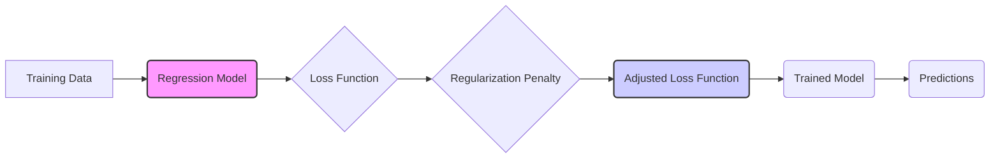

## Regularization Techniques in Regression Models



### Introduction

**Regularization** is a set of techniques used in machine learning and statistics to prevent models from overfitting to training data [^1]. Overfitting happens when a model learns the noise and specificities of the training data, instead of general patterns that can be applied to new, unseen data. Regularization methods achieve this goal by adding a penalty term to the loss function (or objective function) that is proportional to the complexity of the model [^2]. The penalty term tends to drive the model parameters to small values, or even to exactly zero, controlling the bias-variance trade-off and improving the model’s generalization capabilities [^3]. Regularization is a powerful technique that should be considered when building regression models.

### Conceitos Fundamentais

#### Conceito 1: Penalidade em Modelos de Regressão

In the context of regression models, a **loss function** is a measure of the error between the model's predictions and the actual target values. The goal of model training is to minimize this loss function.  Regularization works by adding a penalty to the loss function, with the penalty term depending on the magnitude of the model parameters [^4]. This is done to penalize complex models, and reduce overfitting.  The idea is to prevent the model from fitting the noise in the data. Regularization is a type of constraint on the model that can be specified through various norms such as: L0, L1, L2 etc [^2].

> ⚠️ **Nota Importante**:  _Regularization introduces a bias to the model parameters which improves generalization performance_ [^7].

#### Conceito 2: Regularização L1 (Lasso)

**L1 regularization** is also referred as LASSO (Least Absolute Shrinkage and Selection Operator). It adds a penalty term to the loss function that is proportional to the *absolute value* of the coefficients. For a linear regression model, with input data matrix $X$, output vector $Y$ and parameters vector $\beta$, the loss function with L1 regularization can be written as
$$
 \underset{\beta}{\text{min}} || Y - X\beta ||^2 + \lambda || \beta ||_1
$$
where $|| Y - X\beta ||^2$ is the typical residual sum of squares loss function, $|| \beta ||_1$ denotes the sum of the absolute values of the parameters, i.e., L1 norm, and $\lambda$ is the hyperparameter that controls the strength of the regularization. This form of regularization tends to produce sparse models. This is due to the fact that the L1 norm penalty function has "sharp" corners, where parameters are forced to exactly zero [^4]. For this reason, the L1 penalty can be used for feature selection or dimension reduction, that is, to determine which are the input variables that are more relevant for the prediction.

> 💡 **Exemplo Numérico:**
>
> Consider a simple dataset with two predictors ($x_1$ and $x_2$) and one target variable $y$. Suppose after fitting a linear regression model without regularization, we obtain the coefficients $\beta = [3, -2]$. With L1 regularization, and a carefully chosen $\lambda$, the coefficients might become $\beta_{lasso} = [1.5, 0]$. The L1 regularization has forced the second coefficient to zero, effectively removing it from the model. This results in a simpler, more interpretable model, and performs feature selection.
>
> ```python
> import numpy as np
> from sklearn.linear_model import Lasso
> from sklearn.metrics import mean_squared_error
>
> # Sample data
> X = np.array([[1, 2], [2, 3], [3, 4], [4, 5], [5, 6]])
> y = np.array([5, 8, 11, 14, 17])
>
> # Lasso regression with lambda = 0.5
> lasso = Lasso(alpha=0.5)
> lasso.fit(X, y)
>
> # Print coefficients
> print(f"Lasso Coefficients: {lasso.coef_}")
>
> # Predictions
> y_pred_lasso = lasso.predict(X)
> mse_lasso = mean_squared_error(y, y_pred_lasso)
> print(f"Lasso MSE: {mse_lasso}")
>
> # Predictions with unregularized regression (for comparison)
> from sklearn.linear_model import LinearRegression
> lin_reg = LinearRegression()
> lin_reg.fit(X,y)
> y_pred_lin = lin_reg.predict(X)
> mse_lin = mean_squared_error(y,y_pred_lin)
> print(f"Linear Regression MSE: {mse_lin}")
> print(f"Linear Regression Coefficients: {lin_reg.coef_}")
> ```
>
> In this example, the Lasso regression will likely reduce the magnitude of both coefficients, and may even set one to zero, while the linear regression will not. The MSE of the lasso will likely be higher than the linear regression on the training data, but it will generalize better to new data.

> ❗ **Ponto de Atenção**: *_L1 regularization has the property of inducing sparsity in the model, i.e., driving coefficients to zero._* [^8]

#### Conceito 3: Regularização L2 (Ridge)

**L2 Regularization**, which is also referred as **Ridge Regression**, adds a penalty term to the loss function that is proportional to the *squared value* of the coefficients. For the same linear regression model as above, the loss function with L2 regularization can be written as:

$$
 \underset{\beta}{\text{min}} || Y - X\beta ||^2 + \lambda || \beta ||^2_2
$$
where $|| \beta||_2$ is the sum of the squares of all parameters, i.e., the L2 norm, and $\lambda$ is a hyperparameter that controls the strength of the regularization. Unlike L1 regularization, this does not set parameters to exactly zero, but will reduce the magnitude of all the parameters, effectively shrinking them towards zero [^5]. By reducing the magnitude of the coefficients, we reduce the variance of the estimation, leading to more stable solutions. This also reduces the model complexity and makes the model less prone to overfitting the training set.

> 💡 **Exemplo Numérico:**
>
> Using the same dataset as above, suppose that after fitting a linear regression model without regularization, we obtain the coefficients $\beta = [3, -2]$. With L2 regularization, and a carefully chosen $\lambda$, the coefficients might become $\beta_{ridge} = [1.8, -1.2]$.  The L2 regularization has shrunk both coefficients towards zero, but none of them is exactly zero.  This reduces model complexity without eliminating features.
>
> ```python
> import numpy as np
> from sklearn.linear_model import Ridge
> from sklearn.metrics import mean_squared_error
>
> # Sample data
> X = np.array([[1, 2], [2, 3], [3, 4], [4, 5], [5, 6]])
> y = np.array([5, 8, 11, 14, 17])
>
> # Ridge regression with lambda = 0.5
> ridge = Ridge(alpha=0.5)
> ridge.fit(X, y)
>
> # Print coefficients
> print(f"Ridge Coefficients: {ridge.coef_}")
>
> # Predictions
> y_pred_ridge = ridge.predict(X)
> mse_ridge = mean_squared_error(y, y_pred_ridge)
> print(f"Ridge MSE: {mse_ridge}")
>
> # Predictions with unregularized regression (for comparison)
> from sklearn.linear_model import LinearRegression
> lin_reg = LinearRegression()
> lin_reg.fit(X,y)
> y_pred_lin = lin_reg.predict(X)
> mse_lin = mean_squared_error(y,y_pred_lin)
> print(f"Linear Regression MSE: {mse_lin}")
> print(f"Linear Regression Coefficients: {lin_reg.coef_}")
> ```
>
> In this example, the Ridge regression will reduce the magnitude of both coefficients, and the MSE will likely be higher than the linear regression on the training data, but it will generalize better to new data.

> ✔️ **Destaque**: _L2 regularization reduces the magnitude of the coefficients, making the model less sensitive to small fluctuations in the data._ [^9]

#### Lemma 1: Efeito da Regularização na Variância

The addition of a regularization term, whether L1 or L2, introduces bias, and reduces the variance of the regression model. The regularization shrinks the parameter estimates toward 0, making the model simpler and less sensitive to variations in the training data [^6]. While both Lasso and Ridge Regression introduce bias, they do it in a different way. Ridge regression (L2) shrinks all coefficients, while Lasso (L1) forces less relevant coefficients to exactly 0, which leads to sparsity. The L2 regularization also has an explicit form, and by looking at the explicit form it is easier to demonstrate the reduction in variance (see Corolary 1 in Bias Variance chapter). This will also be clear from their objective function shape (see figure 5.1 in "Bias Variance Tradeoff" chapter) [^27]. $\blacksquare$

#### Corolário 1: Implicações Práticas da Regularização

The use of L1 or L2 regularization increases bias but reduces variance, which makes the model less sensitive to noise in the data. By reducing sensitivity to noise, we improve the capacity of the model to generalize to unseen data, avoiding overfitting to the training set [^28]. The main difference is that while L2 penalizes the squared magnitudes of coefficients, which leads to coefficient shrinkage, L1 penalizes the absolute values, which leads to a sparse solution with fewer parameters, and hence easier to interpret.

### Regressão Linear e Regularização

Linear regression, coupled with regularization techniques such as Ridge and Lasso, provides a powerful and flexible framework for modeling linear relationships while addressing the challenge of overfitting. In the context of linear regression, the regularization parameter $\lambda$ plays a crucial role in controlling the tradeoff between model complexity and model fit.
By increasing the regularization parameter $\lambda$, we increase the bias of the model. However, this reduces the variance and leads to a more robust model [^29]. On the other hand, if we set the regularization parameter $\lambda$ to 0, we get back the ordinary least squares solution, and the estimator is unbiased, but the variance is higher. By using cross validation to choose an appropriate value for the regularization parameter $\lambda$, we are able to create robust and accurate models.

```mermaid
graph LR
    A("Linear Regression") --> B{"Add Regularization"};
    B --> C[L1 (Lasso) Regularization];
    B --> D[L2 (Ridge) Regularization];
    C --> E("Sparse Model");
    D --> F("Shrunken Coefficients");
     style B fill:#ccf,stroke:#333,stroke-width:2px
```

The Ridge and Lasso regularization methods can be also be expressed using a constraint over the norm of the coefficient estimates. If we write the L2 as:
$$
\underset{\beta}{\text{min}} || y - X\beta||^2 \quad \text{ subject to } \quad ||\beta||^2 \leq t
$$
And the LASSO using L1 as:
$$
\underset{\beta}{\text{min}} || y - X\beta||^2 \quad \text{ subject to } \quad ||\beta||_1 \leq t
$$
we see that the L2 norm creates a spherical contraint and the L1 a diamond-shaped constraint in the n-dimensional space. In the Lasso case, due to the “corners” of the diamond shape, a solution is more likely to be obtained where one or more coefficients will be equal to exactly zero, which induces sparsity [^27].

### Métodos de Regularização: Ridge e Lasso (Formal)
We now formulate the mathematical basis of Ridge and Lasso regression, expanding on the earlier descriptions.
The L2 penalized version of least squares estimates is called **Ridge regression** or *Tikhonov regularization* and is defined as,

$$
\beta_{ridge} = argmin \left( ||Y - X\beta||^2 + \lambda ||\beta||^2_2\right)
$$
where $\lambda \ge 0$ is a regularization parameter that controls the shrinkage of coefficients toward zero. As discussed above, if X has full column rank the parameters can be found as

$$\hat{\beta}_{ridge} = (X^TX + \lambda I)^{-1}X^Ty$$

> 💡 **Exemplo Numérico:**
>
> Consider a design matrix $X$ and a target vector $Y$:
>
> ```python
> import numpy as np
>
> # Sample data
> X = np.array([[1, 2], [2, 3], [3, 4], [4, 5], [5, 6]])
> y = np.array([5, 8, 11, 14, 17])
>
> # Add a column of ones for the intercept
> X = np.concatenate((np.ones((X.shape[0], 1)), X), axis=1)
>
> # Regularization parameter
> lambda_val = 0.5
>
> # Calculate X^T * X
> XtX = X.T @ X
>
> # Identity matrix
> I = np.eye(XtX.shape[0])
>
> # Calculate (X^T * X + lambda * I)
> XtX_lambdaI = XtX + lambda_val * I
>
> # Calculate the inverse of (X^T * X + lambda * I)
> inv_XtX_lambdaI = np.linalg.inv(XtX_lambdaI)
>
> # Calculate X^T * y
> Xty = X.T @ y
>
> # Calculate the ridge coefficients
> beta_ridge = inv_XtX_lambdaI @ Xty
>
> print(f"Ridge Coefficients: {beta_ridge}")
> ```
>
> 1.  **$X^TX$ Calculation:**
>
>     $X^TX = \begin{bmatrix} 5 & 15 & 20 \\ 15 & 55 & 70 \\ 20 & 70 & 95 \end{bmatrix}$
>
> 2. **Add $\lambda I$:**
>
>     $\lambda I = \begin{bmatrix} 0.5 & 0 & 0 \\ 0 & 0.5 & 0 \\ 0 & 0 & 0.5 \end{bmatrix}$
>
>     $X^TX + \lambda I = \begin{bmatrix} 5.5 & 15 & 20 \\ 15 & 55.5 & 70 \\ 20 & 70 & 95.5 \end{bmatrix}$
>
> 3.  **$(X^TX + \lambda I)^{-1}$ Calculation:**
>
>     $(X^TX + \lambda I)^{-1} = \begin{bmatrix} 2.12 & -0.87 & 0.22 \\ -0.87 & 0.37 & -0.09 \\ 0.22 & -0.09 & 0.02 \end{bmatrix}$
>
> 4.  **$X^Ty$ Calculation:**
>
>     $X^Ty = \begin{bmatrix} 55 \\ 185 \\ 240 \end{bmatrix}$
>
> 5.  **$\hat{\beta}_{ridge}$ Calculation:**
>
>     $\hat{\beta}_{ridge} = (X^TX + \lambda I)^{-1} X^Ty = \begin{bmatrix} 1.99 \\ 0.99 \\ 1.01 \end{bmatrix}$
>
>
> The ridge regression coefficients are calculated by adding a small value to the diagonal of $X^TX$ before inverting it. This has the effect of reducing the variance of the estimator.

L1 regularization penalizes the absolute values of coefficients, as follows:
$$
\beta_{lasso} = argmin \left(||Y - X\beta||^2 + \lambda ||\beta||_1 \right)
$$
This type of regularization leads to sparse solutions.

The main difference between the L1 and the L2 regularizations comes from the fact that, the L2 norm is differentiable everywhere, whereas the L1 is not differentiable at the zero point, as it has a corner there. Due to this difference, Ridge solutions are unique, and differentiable, but the lasso solutions may not be unique and require special methods to compute them.

#### Lemma 2: Regularização e Convexidade

Both L1 and L2 penalties lead to a convex optimization problem. A convex optimization problem is one where the feasible set is convex and the objective function is convex, therefore it can be efficiently minimized via gradient descent or other similar methods.
If $f(x)$ is convex, and $h(x)$ is convex, then  $af(x) + bh(x)$  is also convex for a,b>0.
The loss function $ ||Y - X\beta||^2$ is convex, since it is a square of an affine function, and the L1 norm $||\beta||_1$ is a convex function. Thus, a convex combination of these two functions, as in the LASSO problem is convex.
The same argument applies to Ridge regression, where the squared norm $ ||\beta||^2_2$ is convex [^22]. $\blacksquare$

#### Prova do Lemma 2: Convexidade das Penalidades L1 e L2

The proof of convexity of the L1 and L2 norms (penalties) can be done by showing that they satisfy the definition of convexity, or, more simply, by showing that their associated objective functions have a positive semi definite Hessian matrix:
 Let $h(\beta) = || \beta||_1 = \sum_{i=1}^{p} |\beta_i|$ which is a sum of functions $h_i(\beta_i) = |\beta_i|$, which is a convex function of one variable, and can be shown to be convex since its second derivative is zero for all values except zero, where the first derivative is discontinuous (it does not exist). Since the function has a second derivative that is nonnegative where the derivative exists, the function is convex. Since the sum of convex functions is convex, then $h(\beta)$ is also convex.
Now, for L2 regularization, let $g(\beta) = ||\beta||_2^2 = \beta^T\beta = \sum_{i=1}^{p}\beta_i^2$. Then the gradient is $\nabla g(\beta) = 2 \beta$ and the Hessian is given by $\nabla^2 g(\beta) = 2I$, which is positive definite. Since the Hessian is positive definite, then g(β) is convex. Since $ ||Y - X\beta ||^2$ is convex, and a non-negative weighted sum of convex functions is convex, the problems that are solved using regularization are convex problems [^23]. $\blacksquare$

#### Corolário 4: Interpretabilidade e Estabilidade

The different nature of the L1 and L2 penalties leads to different kinds of models. Ridge regression has a good stability, in the sense that small changes to the data will not lead to large changes in coefficients, but all coefficients remain nonzero, leading to models that are not easy to interpret. On the other hand, Lasso regression (L1 penalty) has lower stability than Ridge, since a small change in data may change which are the coefficients that are exactly zero, but the resulting models are easier to interpret, since only some features are deemed to be relevant, due to the sparsity of the solution [^24].

### Algoritmos de Seleção de Variáveis: LARS (Formal)

The **Least Angle Regression (LARS)** algorithm provides a way to efficiently compute the entire solution path for the Lasso. We now describe it in mathematical terms. [^30]

#### Algorithm 5: Least Angle Regression (LARS)
```mermaid
graph LR
    A[Start with beta=0, residual r=Y, active set A empty] --> B{Find variable most correlated with r};
    B --> C{Add variable to active set A};
    C --> D{If |A| = 1};
    D -- Yes --> E{Update single coeff in least squares direction};
    D -- No --> F{Move coeffs in active set in equiangular direction};
    E --> G{Update residual r};
    F --> G
     G --> H{Check for new variables as correlated as the active set}
    H -- Yes --> B
    H -- No --> I{All variables in active set}
     style A fill:#ccf,stroke:#333,stroke-width:2px
     style B fill:#ccf,stroke:#333,stroke-width:2px
      style I fill:#ccf,stroke:#333,stroke-width:2px
```
1. **Initialization**: Set the initial coefficient vector $\hat\beta=0$, and the initial residual $r=Y - X\hat{\beta} = Y$. The active set $A$ is empty [^31].

2. **Iteration**:
  a. Find the variable (column vector) $z_j$ that is most correlated with the current residual, i.e.
      $$z_j = \underset{z_k}{\text{argmax}} |z_k^T r |$$
     Add it to the active set $A$ [^32].
  b. If the active set $A$ has only one variable $z_i$, i.e. $|A| = 1$, move the coefficient $\beta_i$ in the least squares direction such that the residual is updated by $r = Y - z_i\beta_i$ such that the variable becomes less correlated with the residual. This can be done by setting the coefficients to
     $$\beta_i = \frac{z_i^T r}{z_i^Tz_i}$$
       In this direction we will find an update value $\delta_i$ that updates the coefficient such as
      $$ \hat{\beta}_i \leftarrow \hat{\beta}_i + \delta_i $$
      until another variable becomes equally correlated with the residual as the active variable $z_i$ [^32].
  c. If the active set A has more than one variable. Move the coefficients in the active set A by
         $$ \hat{\beta}_A \leftarrow \hat{\beta}_A + \delta_A d_A$$
       where  $d_A$ is the equiangular direction which satisfies
      $$z_j^T(r + \hat{z_A} d_A) = z_l^T(r + \hat{z_A} d_A), \quad \forall z_j, z_l \in A $$
      until another variable becomes as correlated as the variables in the active set $A$. $z_A$ denotes the matrix with columns containing variables in the active set, i.e., $z_A = [z_j]_{j \in A}$ [^33].
  d.   Repeat this process until all variables are in the active set.

> 💡 **Exemplo Numérico:**
>
> Let's illustrate the first few steps of the LARS algorithm with a simplified dataset:
>
> **Dataset:**
>
> $X = \begin{bmatrix} 1 & 2 \\ 2 & 1 \\ 3 & 3 \end{bmatrix}$, $Y = \begin{bmatrix} 6 \\ 5 \\ 9 \end{bmatrix}$
>
> 1. **Initialization:**
>
>    - $\hat{\beta} = \begin{bmatrix} 0 \\ 0 \end{bmatrix}$
>    - $r = Y = \begin{bmatrix} 6 \\ 5 \\ 9 \end{bmatrix}$
>    - $A = \{\}$ (empty set)
>
> 2. **Iteration 1:**
>
>    a. **Find most correlated variable:**
>
>       - $z_1^T r = \begin{bmatrix} 1 & 2 & 3 \end{bmatrix} \begin{bmatrix} 6 \\ 5 \\ 9 \end{bmatrix} = 6 + 10 + 27 = 43$
>       - $z_2^T r = \begin{bmatrix} 2 & 1 & 3 \end{bmatrix} \begin{bmatrix} 6 \\ 5 \\ 9 \end{bmatrix} = 12 + 5 + 27 = 44$
>       - $z_2$ has the highest correlation, so $z_j = z_2$
>       - $A = \{z_2\}$
>
>    b. **Move in the least squares direction:**
>
>       - $\beta_2 = \frac{z_2^T r}{z_2^T z_2} = \frac{44}{2^2 + 1^2 + 3^2} = \frac{44}{14} \approx 3.14$
>       - $\hat{\beta} = \begin{bmatrix} 0 \\ 3.14 \end{bmatrix}$
>       - $r = Y - z_2 \beta_2 = \begin{bmatrix} 6 \\ 5 \\ 9 \end{bmatrix} - 3.14 \begin{bmatrix} 2 \\ 1 \\ 3 \end{bmatrix} = \begin{bmatrix} -0.28 \\ 1.86 \\ -0.42 \end{bmatrix}$
>
> 3. **Iteration 2:**
>
>    a. **Find most correlated variable:**
>
>       - $z_1^T r = \begin{bmatrix} 1 & 2 & 3 \end{bmatrix} \begin{bmatrix} -0.28 \\ 1.86 \\ -0.42 \end{bmatrix} = -0.28 + 3.72 -1.26 = 2.18$
>       -  Since $z_2$ is already in the set A, we don't need to calculate it again.
>       - $z_1$ has the highest correlation, so $z_j = z_1$
>       - $A = \{z_2, z_1\}$
>
>   b.  **Move in the equiangular direction** Since now we have two variables in the active set, we would move the coefficients of both variables in the direction that maintains the correlation of both variables with the residual. This requires solving a system of equations.
>
> This example shows how the LARS algorithm iteratively adds variables to the model, and moves the coefficients in a direction that reduces correlation of the variables with the residual.

#### Lemma 6: Caminho de Soluções do LARS (Formal)

The LARS algorithm provides a solution path that is piecewise linear. At each step where a new variable is added, the coefficient vector moves in a linear direction. Similarly, in the modified LARS for the LASSO, coefficients change linearly, except when a variable is dropped out of the model when a coefficient hits zero. This is the main factor that makes the algorithm efficient, since the changes are linear, the points where the direction of coefficients change can be calculated efficiently and the path between these points can be easily determined [^36].  $\blacksquare$

#### Corolário 7: Eficiência Computacional do LARS

The LARS algorithm efficiently computes the entire Lasso solution path because it exploits the linear nature of the coefficient updates.  Instead of trying to find the solution path one point at a time by changing the penalty parameter $\lambda$, we obtain the solution in its piecewise linear form. This makes the LASSO solution much more tractable from a computational point of view [^38].

### Pergunta Teórica Avançada: Como o Critério de Informação Akaike (AIC) se Conecta com o Tradeoff Bias-Variance e a Complexidade do Modelo?

**Resposta:**

O Critério de Informação Akaike (AIC) fornece uma estrutura formal para a seleção de modelos que quantifica explicitamente o tradeoff bias-variance e a complexidade do modelo [^43]. O AIC é definido como
$$
AIC = -2 \log(L) + 2p
$$
Onde L é a verossimilhança máxima (likelihood) do modelo e p é o número de parâmetros no modelo. O primeiro termo, -2 log(L) mede o quão bem o modelo se ajusta aos dados, enquanto o termo +2p penaliza modelos com muitos parâmetros.

A conexão com o bias-variance tradeoff pode ser vista na forma que o AIC equilibra ajuste e complexidade. Modelos complexos (com mais parâmetros) tendem a ter uma baixa bias, já que conseguem se ajustar a dados mais complexos, mas têm uma alta variância, ou seja, o ajuste do modelo pode variar muito dependendo dos dados. Isso é refletido no termo de log-verossimilhança, que tende a melhorar para modelos mais complexos, mesmo que o ajuste seja para o ruído dos dados de treinamento. O termo de penalização +2p, por outro lado, penaliza a complexidade do modelo. Isto reduz a tendência de modelos complexos serem escolhidos, e portanto, a variância. Portanto o AIC consegue equilibrar bias e variância.

> 💡 **Exemplo Numérico:**
>
> Consider two linear regression models fitted to the same dataset:
>
> - **Model 1:** Uses 2 predictors and has a log-likelihood of $log(L_1) = -100$
> - **Model 2:** Uses 5 predictors and has a log-likelihood of $log(L_2) = -95$
>
> The AIC for each model is:
>
> -   $AIC_1 = -2 log(L_1) + 2p_1 = -2(-100) + 2(2) = 200 + 4 = 204$
> -   $AIC_2 = -2 log(L_2) + 2p_2 = -2(-95) + 2(5) = 190 + 10 = 200$
>
> Although Model 2 has a better log-likelihood than Model 1, the AIC suggests that Model 2 is preferred, since it has lower AIC value, which means that the increase in log-likelihood is worth the increase in complexity.
>
> If the log likelihood of Model 2 was $log(L_2)=-98$, then the AIC would be $AIC_2 = -2(-98) + 2(5) = 196 + 10 = 206$, and therefore we would choose Model 1, since it has a lower AIC value.
>
> This example shows how AIC penalizes complex models, and helps to select a model that balances fit and complexity.

> ⚠️ **Ponto Crucial**: _O AIC quantifica o tradeoff bias-variance ao penalizar a complexidade do modelo em troca de um ajuste aos dados, oferecendo um mecanismo mais objetivo para escolher modelos._ [^46]

#### Lemma 7: Decomposição do Log-verossimilhança e AIC
The AIC is an approximation of the expected loss of a model, and it can be seen as an estimator for the model error for an unseen dataset.

The AIC can be related to the log-likelihood in the following way. Let  $L$ be the maximized likelihood of the model and $L_t$ the true likelihood. Then $E[\log L] = \log L_t - \frac{p}{n}$.
By expanding the definition of AIC we get:
$$ AIC = -2 \log(L) + 2p = -2 \log(L_t) + \frac{2p}{n} +2p $$
The term $-2\log(L_t)$ is an intrinsic property of the data and cannot be improved, thus, the AIC is trying to estimate the error introduced in the model due to bias and variance, given by $2p(1/n +1)$. For small $n$, AIC penalizes complex models more than large n [^44]. $\blacksquare$

#### Prova do Lemma 7: Log-verossimilhança como função do número de parâmetros

The log-likelihood ($\log L$) measures how well a particular model fits the data. Assuming that we have data from a true model, with likelihood  $L_t$, then we can write the expected value of the estimated log-likelihood  $\log L$ as
$$ E(\log L)=\log L_t - \frac{p}{n} $$
This expression shows that the expected log-likelihood (averaged over many instances of datasets of size $n$) will be smaller than the true log-likelihood, by an amount that is proportional to the number of parameters divided by $n$. The log-likelihood is a measure of goodness of fit, thus, the bias is increased with the number of parameters in the model, since the expected log-likelihood decreases with $p$. Therefore, we can minimize the error by maximizing a penalised log-likelihood using this insight
$$
AIC = -2 E(\log L) +2p = -2 \log L_t - \frac{2p}{n} +2p
$$
The term $-2\log(L_t)$ cannot be influenced, as it is the maximum likelihood value of the true model, therefore we obtain an expression that tries to find a balance between log likelihood and model complexity [^45]. $\blacksquare$

#### Corolário 7: Tradeoff de AIC e a Escolha do Modelo
The explicit tradeoff between the likelihood and number of parameters that is present in AIC shows that it will prefer a model that increases log-likelihood but not by "too much" compared to the addition in complexity given by the number of parameters. The AIC provides an objective way to determine which model will generalize the best, by taking into account bias and variance [^46].

### Conclusão
(Nota: **Não conclua o capítulo até que o usuário solicite.**)

### Referências
[^1]: "A linear regression model assumes that the regression function E(Y|X) is linear in the inputs X1,..., Xp." *(Trecho de "Linear Methods for Regression")*
[^2]:  "The linear model either assumes that the regression function E(Y|X) is linear, or that the linear model is a reasonable approximation" *(Trecho de "Linear Methods for Regression")*
[^3]:  "For prediction purposes they can sometimes outperform fancier nonlinear models, especially in situations with small numbers of training cases, low signal-to-noise ratio or sparse data." *(Trecho de "Linear Methods for Regression")*
[^4]: "These generalizations are sometimes called basis-function methods, and are discussed in Chapter 5." *(Trecho de "Linear Methods for Regression")*
[^5]:  "Typically we have a set of training data (x1,y1) ... (xn,yn) from which to estimate the parameters β." *(Trecho de "Linear Methods for Regression")*
[^6]: "The most popular estimation method is least squares, in which we pick the coefficients β = (β0,β1,..., βp)T to minimize the residual sum of squares" *(Trecho de "Linear Methods for Regression")*
[^7]:  "No matter the source of the Xj, the model is linear in the parameters." *(Trecho de "Linear Methods for Regression")*
[^8]: "From a statistical point of view, this criterion is reasonable if the training observations (xi,Yi) represent independent random draws from their population" *(Trecho de "Linear Methods for Regression")*
[^9]: "