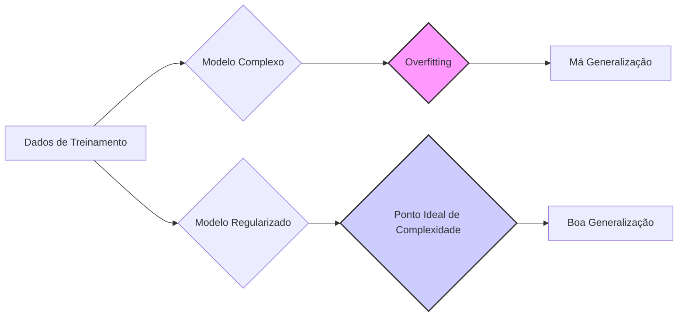
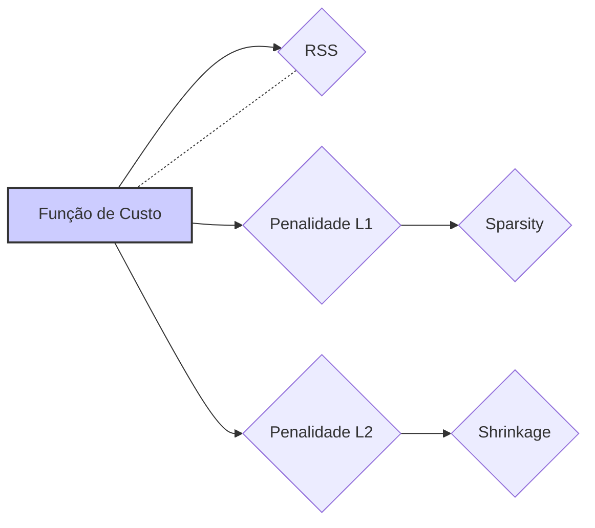
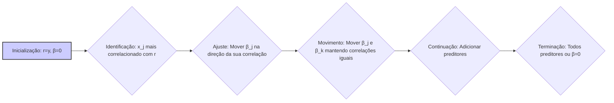

## Regularização em Modelos Lineares: Uma Análise Aprofundada

### Introdução

A **Regularização** é um conjunto de técnicas fundamentais no aprendizado de máquina, usadas para evitar o *overfitting* em modelos complexos [^4]. Em essência, o *overfitting* ocorre quando um modelo se ajusta excessivamente aos dados de treinamento, capturando não apenas os padrões verdadeiros, mas também os ruídos e variações aleatórias presentes nos dados de treinamento, levando a uma má generalização para novos dados [^4]. A regularização mitiga esse problema adicionando uma restrição (penalidade) à função de custo, que limita a complexidade do modelo e, consequentemente, promove sua estabilidade e capacidade de generalização. Este capítulo explorará as técnicas de regularização L1 (Lasso), L2 (Ridge), e suas combinações, como a Elastic Net, detalhando os fundamentos teóricos, as propriedades e a aplicação em modelos de regressão linear e outras áreas relacionadas.

### Métodos de Regularização: L1 (Lasso), L2 (Ridge) e Elastic Net

Nesta seção, discutiremos a fundo as principais técnicas de regularização para modelos de regressão linear, explorando as nuances e as implicações de cada abordagem.

**Regularização L1 (Lasso)**

A regularização L1, também conhecida como *Least Absolute Shrinkage and Selection Operator* (Lasso), adiciona a soma dos valores absolutos dos coeficientes do modelo à função de custo [^4]. A função objetivo do Lasso é dada por:

$$
\underset{\beta}{\text{min}}  ||y - X\beta||^2 + \lambda ||\beta||_1
$$

onde:

-   $||y - X\beta||^2$ representa a soma dos quadrados dos resíduos (RSS).

-   $||\beta||_1 = \sum_{j=1}^p |\beta_j|$ é a norma L1 dos coeficientes.
-   $\lambda \ge 0$ (lambda) é o parâmetro de regularização, que controla a força da penalidade.

A penalidade L1 tem duas propriedades distintas:
    1.  **Shrinkage:** Ela força os coeficientes do modelo a serem menores, evitando que se tornem grandes demais. Isso reduz a variância dos parâmetros, tornando o modelo menos suscetível ao ruído dos dados de treinamento [^25].
    2.  **Sparsity:** Ela força alguns coeficientes a serem exatamente zero, realizando assim a seleção de variáveis e tornando o modelo mais fácil de interpretar [^44].
        Isso ocorre porque os contornos da penalidade L1, em forma de diamante, intersectam os contornos da RSS nos eixos, levando a soluções com algumas variáveis com coeficientes nulos.
        O Lasso é especialmente útil em situações onde acredita-se que muitos preditores são irrelevantes, ou quando deseja-se obter um modelo mais interpretável.

> 💡 **Exemplo Numérico:**
>
> Vamos considerar um exemplo simples com três preditores ($x_1$, $x_2$, $x_3$) e uma variável resposta ($y$). Suponha que, após ajustar um modelo de regressão linear sem regularização, obtemos os seguintes coeficientes: $\beta = [3, -2, 5]$.
>
> Agora, vamos aplicar a regularização L1 (Lasso) com um $\lambda = 2$. A função objetivo que o Lasso tenta minimizar é:
>
> $$
> \underset{\beta}{\text{min}}  ||y - X\beta||^2 + 2 \cdot (|\beta_1| + |\beta_2| + |\beta_3|)
> $$
>
> Ao resolver este problema de otimização, o Lasso pode levar a coeficientes diferentes, por exemplo $\beta_{lasso} = [1.5, 0, 3]$. Observe que o coeficiente de $x_2$ foi zerado, indicando que este preditor foi considerado menos relevante pelo modelo.
>
> Este exemplo ilustra como o Lasso promove a esparsidade, zerando coeficientes e, assim, realizando seleção de variáveis.

**Regularização L2 (Ridge)**

A regularização L2, também conhecida como *Ridge Regression*, adiciona a soma dos quadrados dos coeficientes do modelo à função de custo [^4]. A função objetivo da Ridge é dada por:

$$
\underset{\beta}{\text{min}}  ||y - X\beta||^2 + \lambda ||\beta||_2^2
$$
onde:

-   $||y - X\beta||^2$ é a soma dos quadrados dos resíduos (RSS).

-   $||\beta||_2^2 = \sum_{j=1}^p \beta_j^2$ é o quadrado da norma L2 dos coeficientes.
-   $\lambda \ge 0$ (lambda) é o parâmetro de regularização.

A penalidade L2 tem como efeito principal reduzir a magnitude dos coeficientes, aproximando-os de zero, mas sem forçá-los a serem exatamente zero. Essa propriedade torna a regularização Ridge particularmente útil em cenários com multicolinearidade, onde os coeficientes podem se tornar instáveis devido a alta correlação entre os preditores [^25]. A Ridge regression estabiliza a solução, reduzindo a variância dos coeficientes.

> 💡 **Exemplo Numérico:**
>
> Usando o mesmo exemplo anterior, com os coeficientes $\beta = [3, -2, 5]$ obtidos sem regularização, vamos aplicar a regularização L2 (Ridge) com o mesmo $\lambda = 2$. A função objetivo que o Ridge tenta minimizar é:
>
> $$
> \underset{\beta}{\text{min}}  ||y - X\beta||^2 + 2 \cdot (\beta_1^2 + \beta_2^2 + \beta_3^2)
> $$
>
> Ao resolver este problema de otimização, o Ridge pode levar a coeficientes diferentes, por exemplo $\beta_{ridge} = [2.1, -1.4, 3.5]$. Observe que todos os coeficientes foram reduzidos em magnitude, mas nenhum foi zerado.
>
> Este exemplo demonstra como o Ridge reduz a magnitude dos coeficientes, tornando o modelo mais estável e menos sensível a ruídos nos dados.

**Elastic Net**

A **Elastic Net** é um método de regularização que combina os benefícios das penalidades L1 e L2. Ela adiciona um termo de penalidade à função de custo que é uma combinação linear das normas L1 e L2 [^73]:

$$
\underset{\beta}{\text{min}}  ||y - X\beta||^2 + \lambda (\alpha ||\beta||_1 + (1 - \alpha) ||\beta||_2^2)
$$
onde:

-   $\alpha$ (alpha) é um parâmetro que controla a proporção da penalidade L1 e L2. Quando $\alpha=1$, Elastic Net torna-se o Lasso e quando $\alpha=0$, torna-se a Ridge.

A Elastic Net oferece uma abordagem flexível, que promove *sparsity* e *shrinkage* de coeficientes ao mesmo tempo [^73]. Em cenários onde há muitas variáveis e também multicolinearidade, a Elastic Net tende a desempenhar melhor do que Lasso ou Ridge isoladamente.

> 💡 **Exemplo Numérico:**
>
> Usando novamente o exemplo com os coeficientes iniciais $\beta = [3, -2, 5]$, vamos aplicar a Elastic Net com $\lambda = 2$ e $\alpha = 0.5$. A função objetivo que a Elastic Net tenta minimizar é:
>
> $$
> \underset{\beta}{\text{min}}  ||y - X\beta||^2 + 2 \cdot (0.5 \cdot (|\beta_1| + |\beta_2| + |\beta_3|) + 0.5 \cdot (\beta_1^2 + \beta_2^2 + \beta_3^2))
> $$
>
> Ao resolver este problema de otimização, a Elastic Net pode levar a coeficientes como $\beta_{elastic} = [1.8, -0.5, 3.2]$. Observe que os coeficientes foram reduzidos e que o coeficiente de $x_2$ se aproximou de zero, indicando que a Elastic Net combinou os efeitos de *shrinkage* e *sparsity*.
>
> Este exemplo ilustra como a Elastic Net combina as propriedades de Lasso e Ridge, oferecendo uma solução flexível para diferentes cenários.

**Lemma 7:** Contornos de Penalidade

As propriedades dos métodos de regularização L1 e L2 podem ser melhor visualizadas ao analisarmos os contornos das suas penalidades. Em um problema com apenas dois parâmetros $\beta_1$ e $\beta_2$, a norma L1 ($|\beta_1| + |\beta_2|$) corresponde a um diamante com os cantos nos eixos, e a norma L2 ($|\beta_1|^2 + |\beta_2|^2$) corresponde a um círculo. A penalidade L1 impulsiona as soluções para as regiões onde alguns coeficientes são zero (as quinas do diamante), favorecendo a esparsidade. A penalidade L2, por outro lado, força as soluções para a origem, mantendo todos os coeficientes diferentes de zero [^71]. A Elastic Net tem um contorno intermediário, com cantos menos proeminentes que o diamante, levando a uma solução que é uma combinação de *sparsity* e *shrinkage*.

**Prova do Lemma 7:**
A norma L1 de um vetor $\beta \in R^p$, dada por $||\beta||_1 = \sum_{i=1}^p |\beta_i|$, é não diferenciável na origem, enquanto a norma L2, $||\beta||_2 = \sqrt{\sum_{i=1}^p \beta_i^2}$, é diferenciável em qualquer ponto. Geometricamente, a não diferenciabilidade na origem se manifesta através de "quinas" nos contornos dos valores constantes da função. Considerando o caso de dois parâmetros, a norma L1  corresponde a um diamante: $|\beta_1| + |\beta_2| = C$, onde $C$ é uma constante; e a norma L2 corresponde a um círculo: $|\beta_1|^2 + |\beta_2|^2 = C$. A solução do problema de regularização ocorre nos pontos onde o contorno da norma se intersecta com o contorno da RSS. O ponto de cruzamento num diamante tende a estar nos eixos, o que implica que alguns dos coeficientes sejam nulos. O contorno da norma L2 intersecta nos pontos sem que nenhum dos coeficientes seja zero. $\blacksquare$

**Corolário 7:**  Implicações Práticas da Escolha da Regularização

A escolha entre regularização L1, L2 ou Elastic Net afeta a natureza das soluções e a interpretabilidade do modelo [^71].
- A regularização L1 é adequada quando se suspeita de que apenas algumas variáveis são relevantes e quando a interpretabilidade do modelo é crítica. Por exemplo, na modelagem financeira, o Lasso pode ser usado para identificar os poucos fatores que realmente afetam um ativo financeiro, simplificando os modelos de portfólio.
- A regularização L2 é mais adequada quando todos os preditores podem ser relevantes, mas é desejável reduzir a magnitude dos coeficientes para melhorar a estabilidade do modelo e lidar com a multicolinearidade. Por exemplo, em modelagem de crédito, a Ridge pode ser usada para lidar com a correlação entre diversas variáveis econômicas, garantindo um modelo estável.
- A Elastic Net é ideal quando o cenário é complexo com muitos preditores correlacionados e esparsidade é um objetivo. Por exemplo, na modelagem de risco, onde uma grande quantidade de variáveis de mercado podem ser usadas e é desejável entender os preditores relevantes, a Elastic Net pode ser um compromisso interessante.

### Algoritmo LARS: Uma Visão Detalhada

O algoritmo **Least Angle Regression (LARS)** é um método computacionalmente eficiente para encontrar soluções para o problema do Lasso, e para explorar a influência de diferentes valores de regularização [^31]. Em vez de buscar a solução para um dado valor de $\lambda$ na função do Lasso, o LARS computa todo o caminho das soluções, permitindo explorar o tradeoff entre o ajuste do modelo e a complexidade, de forma incremental e contínua [^31].

O LARS pode ser visto como uma generalização do algoritmo *Forward Stagewise*, que, ao invés de adicionar um único preditor em cada etapa, move os coeficientes de múltiplos preditores na mesma direção. Dado o modelo linear $y=X\beta$, o algoritmo LARS procede como segue:

1.  **Inicialização:** Começamos com o resíduo igual ao vetor de respostas $r=y$ e com todos os coeficientes $\beta_j=0$, com preditores centralizados e com norma 1 [^33].
2.  **Identificação:** Determinamos o preditor $x_j$ que é mais correlacionado com o resíduo atual $r$ [^33]. Seja o vetor $c$ a correlação de todos os preditores com o resíduo, i.e. $c_i = \frac{x_i^T r}{\|x_i\|\|r\|}$. O preditor $x_j$ é aquele que tem o maior valor absoluto em $c$, ou seja: $x_j = \text{argmax}_i |c_i|$
3.  **Ajuste:** Movemos o coeficiente $\beta_j$ do preditor $x_j$ na direção do sinal de sua correlação até que outro preditor $x_k$ tenha uma correlação com o resíduo com magnitude idêntica à de $x_j$ [^34].
4.  **Movimento:** Movemos os coeficientes $\beta_j$ e $\beta_k$ juntos, na direção de seus sinais e em conjunto, mantendo a condição de igual correlação com o resíduo até que outro preditor atinja a mesma correlação [^34].
5.  **Continuação:** Esse processo continua, adicionando preditores ao conjunto ativo.
6.  **Terminação:** O algoritmo termina quando todos os preditores são adicionados ao conjunto ativo (equivalente ao modelo de mínimos quadrados) ou quando todos os parâmetros são zerados [^34].

O LARS gera um caminho de soluções que é idêntico ao caminho de soluções do Lasso. Isso ocorre porque o algoritmo, ao adicionar novos preditores, mantém a igualdade das correlações, o que é uma característica do problema de otimização do Lasso.

> 💡 **Exemplo Numérico:**
>
> Vamos considerar um exemplo com dois preditores, $x_1$ e $x_2$, e uma variável resposta $y$. Suponha que após a inicialização (passo 1 do LARS), o resíduo seja $r = y$ e os coeficientes sejam $\beta_1 = \beta_2 = 0$.
>
> 1. **Identificação:** Calculamos as correlações de $x_1$ e $x_2$ com o resíduo $r$. Suponha que a correlação de $x_1$ com $r$ seja 0.8 e a correlação de $x_2$ com $r$ seja -0.5. Como $|0.8| > |-0.5|$, $x_1$ é o preditor mais correlacionado e é adicionado ao conjunto ativo.
>
> 2. **Ajuste:** Movemos o coeficiente $\beta_1$ na direção de sua correlação (positiva) até que a correlação de $x_2$ com o resíduo seja igual a 0.8 ou -0.8. Suponha que isso ocorra quando $\beta_1 = 0.3$ e a correlação de $x_2$ seja -0.8.
>
> 3. **Movimento:** Agora, movemos $\beta_1$ e $\beta_2$ juntos, mantendo as correlações iguais, até que outro preditor seja tão correlacionado quanto. O LARS continua adicionando preditores até que todos estejam no modelo ou até que os parâmetros sejam zerados.
>
> Este exemplo ilustra como o LARS seleciona e adiciona preditores ao modelo, construindo um caminho de soluções do Lasso.

**Lemma 8:**  Relação entre LARS e Forward Stagewise

O LARS é uma versão modificada do algoritmo Forward Stagewise, e compartilha algumas de suas propriedades, mas o LARS usa um critério de otimização mais sofisticado em cada etapa [^40]. Ambos são métodos incrementais, onde os coeficientes são movidos passo a passo, mas o LARS o faz em uma direção que garante a condição de otimalidade do problema do Lasso. Forward Stagewise move o coeficiente de um único preditor, enquanto LARS move o coeficiente de mais de um preditor ao mesmo tempo.

**Prova do Lemma 8:**
O algoritmo Forward Stagewise inicia com um vetor de parâmetros iguais a zero $\beta^{(0)} = 0$, e em cada iteração $k$, encontra a variável mais correlacionada com o resíduo atual, $x_j$ e move o seu parâmetro em um passo $\epsilon$, ou seja $\beta_j^{(k)} = \beta_j^{(k-1)} + \epsilon \text{sign}(x_j^T(y - X \beta^{(k-1)}))$. O algoritmo LARS, por outro lado, move os parâmetros de forma que a correlação das variáveis no conjunto ativo seja igual. Se $\epsilon \rightarrow 0$, o Forward Stagewise se transforma no *incremental Forward Stagewise*, um algoritmo muito similar ao LARS. A diferença principal é que o LARS move os parâmetros simultaneamente ao invés de um por vez, e o passo é determinado com a condição que as correlações sejam iguais e decrescentes em magnitude. $\blacksquare$

**Corolário 8:** Caminho de Soluções Piecewise Linear

O algoritmo LARS gera um caminho de soluções piecewise linear. Ou seja, os coeficientes variam linearmente entre os nós (pontos onde o conjunto ativo muda), o que ocorre quando a correlação do resíduo com algum preditor atinge a correlação dos preditores no conjunto ativo [^76].
Este resultado é importante pois garante que o caminho inteiro pode ser calculado usando um número finito de passos, ao invés de iterando sobre um número contínuo de soluções. A característica piecewise linear do caminho de soluções do Lasso, por sua vez, é a base dos algoritmos eficientes usados para determinar o conjunto de coeficientes para qualquer valor de $\lambda$.

### Pergunta Teórica Avançada: Como a escolha do parâmetro de regularização ($\lambda$) afeta a performance e a complexidade do modelo?

**Resposta:**

O parâmetro de regularização ($\lambda$) é fundamental nos modelos regularizados e tem um impacto direto na performance e complexidade do modelo. A escolha de um valor apropriado de $\lambda$ é crucial para garantir que o modelo seja capaz de generalizar bem para novos dados e não sofra de *overfitting* ou *underfitting* [^24].

O valor de $\lambda$ controla a intensidade da penalidade sobre os coeficientes do modelo. Em ambos os casos, L1 e L2, um valor $\lambda = 0$ implica que a função objetivo do problema de otimização se torna somente a RSS (ou seja, o ajuste sem restrição), o que leva aos resultados do método de mínimos quadrados e pode resultar em *overfitting* nos dados de treinamento.

À medida que $\lambda$ aumenta:

-   **Regularização L1 (Lasso):** Um aumento em $\lambda$ leva a modelos mais esparsos, com mais coeficientes definidos como exatamente zero. Isso significa que menos preditores são usados na formação da predição e que o modelo torna-se mais simples e mais fácil de interpretar. Entretanto, um valor demasiado alto de $\lambda$ pode resultar num modelo muito simples que subajusta os dados, levando a um alto *bias* e a um baixo desempenho em dados de teste.
-   **Regularização L2 (Ridge):** Um aumento em $\lambda$ leva a modelos com coeficientes menores, reduzindo a variância dos coeficientes e tornando o modelo mais estável e menos suscetível a flutuações nos dados de treinamento. Entretanto, um valor muito alto de $\lambda$ pode levar a um modelo muito simples, com alto *bias* e que não se ajusta bem aos dados de treinamento e também não generaliza bem para os dados de teste.
-  **Regularização Elastic Net**: O parâmetro de regularização $\lambda$ controla a intensidade da penalidade sobre os coeficientes do modelo. Além disso, $\alpha$ controla a influência relativa da penalidade L1 e L2. Um valor alto de $\lambda$ promove modelos simples, reduzindo o risco de overfitting, enquanto um valor baixo permite modelos mais complexos, correndo o risco de overfitting. Um valor alto de $\alpha$ promove a esparsidade do modelo, enquanto um valor baixo promove a redução dos coeficientes mas sem elimina-los do modelo.

A escolha ideal de $\lambda$ depende do problema em questão e do nível desejado de complexidade e performance. Um método comum para encontrar o melhor valor para $\lambda$ é a **validação cruzada** onde o conjunto de dados é dividido em *folds* de treinamento e validação, e diferentes valores de $\lambda$ são avaliados quanto ao seu desempenho nos dados de validação. O $\lambda$ que minimiza o erro de validação é usado no modelo final. A escolha de $\lambda$ faz o balanço no *Bias-Variance Tradeoff*, escolhendo a melhor complexidade para o problema e dados em mãos.

> 💡 **Exemplo Numérico:**
>
> Vamos considerar um conjunto de dados com 100 observações e 5 preditores. Dividimos os dados em 5 *folds* para validação cruzada. Para cada valor de $\lambda$ testado, treinamos o modelo usando 4 *folds* e avaliamos o erro quadrático médio (MSE) no *fold* restante. Repetimos este processo 5 vezes, usando cada *fold* como validação uma vez.
>
> Suponha que testamos os seguintes valores de $\lambda$: [0.01, 0.1, 1, 10, 100]. Para cada valor de $\lambda$, calculamos o MSE médio nos 5 *folds*:
>
> | $\lambda$ | MSE Médio |
> |-----------|-----------|
> | 0.01      | 0.85      |
> | 0.1       | 0.70      |
> | 1         | 0.65      |
> | 10        | 0.75      |
> | 100       | 1.20      |
>
> Neste caso, o valor de $\lambda = 1$ apresenta o menor MSE médio, indicando que este valor é o mais adequado para este conjunto de dados. Este exemplo demonstra como a validação cruzada ajuda a escolher o valor de $\lambda$ que equilibra o *bias* e a *variância*.

**Lemma 9:** O Efeito da Regularização na Complexidade do Modelo

À medida que o parâmetro de regularização $\lambda$ aumenta, a complexidade do modelo diminui monotonicamente [^68]. Modelos mais complexos se ajustam melhor aos dados de treinamento, mas têm o risco de *overfitting*, enquanto modelos mais simples generalizam melhor para dados não vistos. A regularização é usada para controlar a complexidade do modelo e o seu *overfitting*. Em geral, valores menores de $\lambda$ resultam em modelos mais complexos (e menores *bias*), enquanto valores maiores levam a modelos mais simples e lineares (e maior *bias*).

**Corolário 9:** Escolha do Parâmetro de Regularização por Validação Cruzada

O valor ótimo do parâmetro de regularização $\lambda$ pode ser escolhido por validação cruzada. Em geral, divide-se o conjunto de dados em três partes, treinamento, validação e teste. Os dados de treino são usados para ajustar o modelo com diferentes valores de $\lambda$. Em seguida, o erro de validação (por exemplo, MSE) é computado usando as predições obtidas pelos modelos treinados para cada valor de $\lambda$. Seleciona-se o valor de $\lambda$ que minimiza o erro de validação. Finalmente, a performance do modelo selecionado com o melhor $\lambda$ é avaliada usando o conjunto de dados de teste. Esta prática é essencial para garantir que o modelo final generalize bem para dados não vistos, e para ajudar a entender o compromisso entre *bias* e *variance*.

### Conclusão

A regularização é um conjunto de ferramentas essenciais para lidar com problemas de *overfitting* em modelos de regressão linear e outras técnicas de modelagem. As regularizações L1 (Lasso) e L2 (Ridge), e suas combinações como a Elastic Net, oferecem diferentes mecanismos para controlar a complexidade e a estabilidade dos modelos. O algoritmo LARS fornece uma ferramenta computacionalmente eficiente para explorar todo o caminho de soluções da regularização L1. A escolha apropriada de um método de regularização e o parâmetro de regularização é fundamental para obter modelos que equilibrem bias e variance, para uma melhor generalização.

### Referências

[^4]: "In this case, the features are typically reduced by filtering or else the fitting is controlled by regularization (Section 5.2.3 and Chapter 18)."

[^23]: "The ridge coefficients minimize a penalized residual sum of squares"

[^25]: "When there are many correlated variables in a linear regression model, their coefficients can become poorly determined and exhibit high variance. A wildly large positive coefficient on one variable can be canceled by a similarly large negative coefficient on its correlated cousin."

[^43]: "The choice between the L1 (Lasso) and L2 (Ridge) affects the stability and interpretability of the models in distinct ways."

[^44]: "A penalidade L1 induz sparsity, zerando coeficientes menos relevantes, levando a modelos mais interpretáveis,"

[^71]: "In this view, the lasso, ridge regression and best subset selection are Bayes estimates with different priors. Note, however, that they are derived as posterior modes, that is, maximizers of the posterior."

[^73]: "Partly for this reason as well as for computational tractability, Zou and Hastie (2005) introduced the elastic-net penalty."

[^24]: "The coefficients are shrunk toward zero (and each other)."

[^30]: "The algorithm Least Angle Regression (LARS), generates the path of solutions of LASSO efficiently."

[^31]: "At each step the algorithm identifies the variable most correlated with the current residual"
 
[^33]:  "Start with the residual r = y - ӯ, β1,β2,...,βp = 0."

[^34]: "Move β from 0 towards its least-squares coefficient (xj, r), until some other competitor xk has as much correlation with the current residual as does x,"

[^35]: "This recipe generalizes to the case of p inputs, as shown in Algorithm 3.1."
