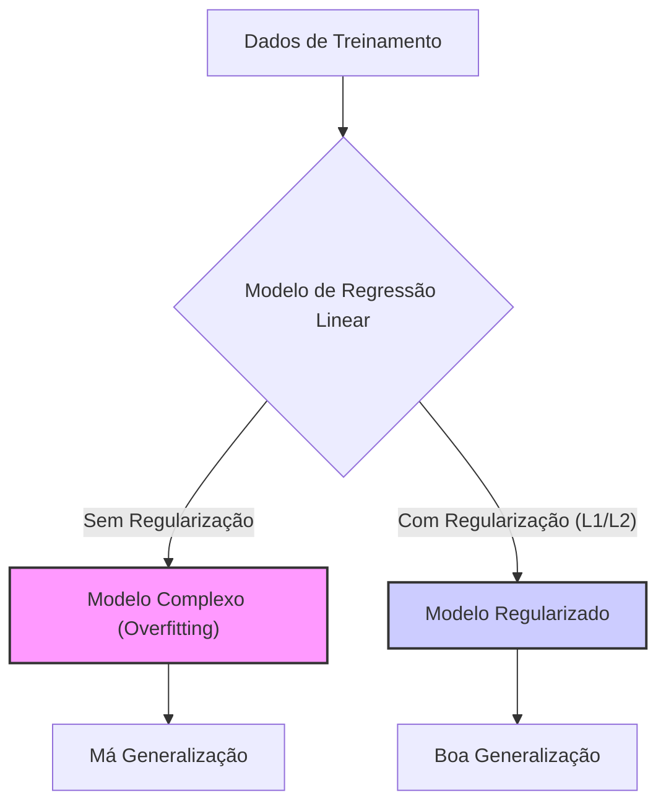
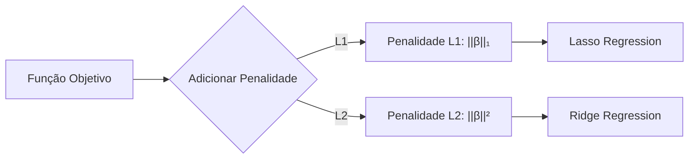
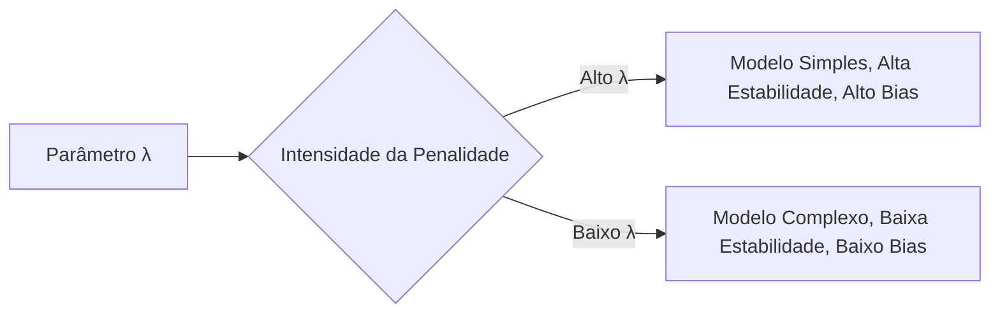
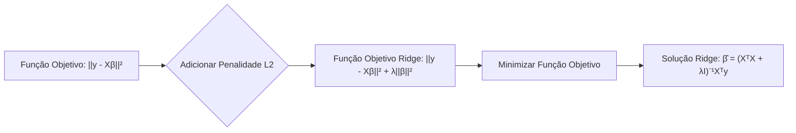
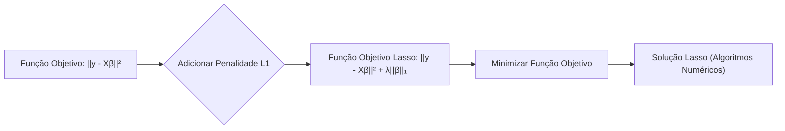
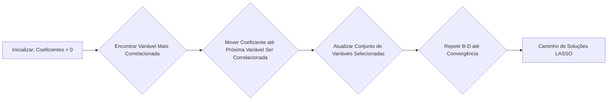
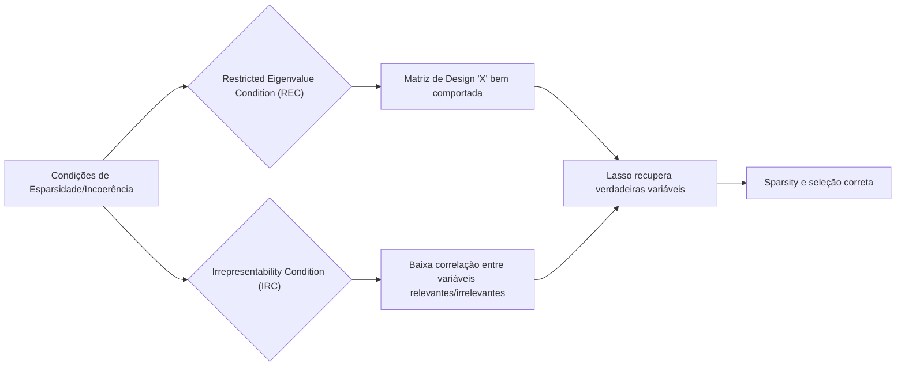

## Regularização em Modelos de Regressão Linear



### Introdução

No contexto de modelagem estatística e aprendizado de máquina, especialmente em problemas de regressão linear, a **regularização** emerge como um conjunto de técnicas cruciais para aprimorar a capacidade de generalização dos modelos [^4]. Regularização é essencial para evitar o sobreajuste (*overfitting*) e a alta variância, problemas comuns quando modelos complexos são ajustados a dados de treinamento que podem conter ruído ou peculiaridades. O sobreajuste leva à criação de modelos que se ajustam bem aos dados de treinamento mas que performam mal em dados não vistos [^4].

Este capítulo abordará a importância da regularização e como diferentes métodos de regularização (L1 e L2, especificamente) impactam as propriedades do modelo. Além de controlar a complexidade, a regularização também auxilia a obter modelos mais interpretáveis, ao conduzir a soluções com coeficientes menores ou nulos [^4].

### Conceitos Fundamentais

Antes de nos aprofundarmos em métodos específicos, é importante consolidar alguns conceitos chave.

**Conceito 1: Complexidade do Modelo**
A complexidade de um modelo refere-se ao número de parâmetros que ele precisa estimar. Em regressão linear, a complexidade está diretamente relacionada ao número de variáveis preditoras utilizadas no modelo [^1]. Um modelo com muitas variáveis preditoras é considerado mais complexo do que um modelo com poucas variáveis, e tem mais parâmetros para estimar.

Modelos mais complexos são mais flexíveis, o que significa que eles têm uma capacidade maior de se ajustar aos dados de treinamento. No entanto, essa flexibilidade aumentada vem ao custo de uma maior variância, tornando o modelo propenso ao *overfitting*. Modelos mais simples, por outro lado, podem não conseguir capturar padrões importantes nos dados, o que leva a um alto bias e *underfitting*. A regularização é um mecanismo para controlar a complexidade e, consequentemente, o tradeoff entre *bias* e variância [^2].

> ⚠️ **Nota Importante**: Modelos mais complexos são capazes de ajustar ruído nos dados de treinamento, o que resulta em generalização ruim para novos dados. Por outro lado, modelos simples podem deixar de capturar padrões relevantes, resultando em performance inadequada. A regularização busca encontrar um bom equilíbrio nesse tradeoff [^1].

**Conceito 2: Penalidades de Regularização (L1 e L2)**
As técnicas de regularização atuam adicionando penalidades à função objetivo dos modelos de regressão. Estas penalidades são projetadas para desencorajar a complexidade do modelo, como a magnitude dos coeficientes. As duas penalidades mais comuns são:
*   **L1 Regularization (Lasso):** Adiciona uma penalidade que é proporcional à soma dos valores absolutos dos coeficientes do modelo.  Em termos matemáticos, ela introduz o termo $||\beta||_1 = \sum_{j=1}^p |\beta_j|$ na função objetivo [^4].

*  **L2 Regularization (Ridge):** Adiciona uma penalidade que é proporcional à soma dos quadrados dos coeficientes do modelo.  Em termos matemáticos, ela introduz o termo $||\beta||^2 = \sum_{j=1}^p \beta_j^2$ na função objetivo [^4].


A escolha entre as duas penalidades (L1 e L2) leva a modelos com propriedades muito distintas:

> ❗ **Ponto de Atenção**:  A penalidade L1 tende a forçar alguns coeficientes a exatamente zero, promovendo a *sparsity*. A penalidade L2 tende a encolher os coeficientes em direção a zero, mas sem necessariamente zerá-los [^4].

**Corolário 1**: O efeito da aplicação das penalidades L1 e L2 é controlar a complexidade dos modelos. A penalidade L1 promove modelos mais esparsos (menos variáveis relevantes), enquanto a penalidade L2 controla o tamanho dos coeficientes, reduzindo a variância do modelo [^5].

**Conceito 3: Parâmetro de Regularização**

O parâmetro de regularização $\lambda$ (lambda) é um escalar que controla o nível de *shrinkage* ou esparsidade em um modelo regularizado [^24].
*   Um valor *grande* de $\lambda$ aumenta a intensidade da penalidade, resultando em modelos mais simples e mais estáveis, porém com maior bias.
*   Um valor *pequeno* de $\lambda$ diminui a intensidade da penalidade, resultando em modelos mais complexos e com menor bias, mas com maior variância.


> ✔️ **Destaque**: A escolha do valor adequado de $\lambda$ é crucial para o desempenho do modelo e é frequentemente realizada através de técnicas como *cross-validation*, que exploram diferentes valores de lambda para determinar qual deles entrega o melhor desempenho preditivo [^24].

### Regularização L2: Ridge Regression



A **Ridge Regression** é uma técnica de regularização que adiciona uma penalidade L2 à função objetivo de um modelo de regressão linear [^22]. A função objetivo da Ridge Regression é definida como:
$$
\underset{\beta}{\text{min}} ||y-X\beta||^2 + \lambda \sum_{j=1}^p \beta_j^2 = \underset{\beta}{\text{min}} ||y-X\beta||^2 + \lambda ||\beta||^2
$$
Onde:
*   $||y-X\beta||^2$  é a soma dos quadrados dos resíduos (RSS), ou seja, a diferença entre os valores observados (y) e os valores preditos pelo modelo $(X\beta)$
*    $\lambda$ (lambda) é o parâmetro de regularização, controlando a força da penalidade, e tem um valor não negativo.
*   $||\beta||^2 = \sum_{j=1}^p \beta_j^2$ é a norma L2 quadrada dos coeficientes do modelo.

A solução de mínimos quadrados para a Ridge Regression é dada por:

$$
\hat{\beta}^{ridge} = (X^TX + \lambda I)^{-1}X^Ty
$$
Onde:
*   $I$ é a matriz identidade de tamanho $p \times p$ (onde $p$ é o número de variáveis preditoras).
A adição do termo $\lambda ||\beta||^2$ à função objetivo tem um efeito de encolhimento (shrinkage) dos coeficientes [^23]. Coeficientes com magnitudes elevadas são penalizados pela regularização, e assim, são ajustados para valores menores. O efeito do parâmetro de regularização $\lambda$ é o seguinte:
*   Quando $\lambda = 0$, a Ridge Regression se reduz à regressão linear padrão sem regularização.
*  Quando $\lambda$ aumenta, a penalidade cresce, levando à redução da magnitude dos coeficientes e, portanto, à redução da variância.
*  No limite, quando $\lambda$ tende a infinito, todos os coeficientes tendem a 0.
Note que a matriz $(X^TX + \lambda I)$ sempre possui inversa se $\lambda>0$, o que garante que a solução seja única, mesmo que $X^TX$ seja singular [^23].
A Ridge Regression melhora a estabilidade do modelo ao reduzir a variância dos coeficientes, tornando o modelo menos sensível às variações nos dados de treinamento. No entanto, a penalidade L2 não leva a coeficientes exatamente iguais a zero, e o modelo não realiza seleção de variáveis [^23].

**Lemma 1**: A adição da penalidade L2 (Ridge) faz com que a solução seja única, mesmo quando $X^TX$ não é invertível. Além disso, o resultado ($\beta$) possui uma norma menor (os coeficientes são menores).
**Prova do Lemma 1:**  A solução da Ridge Regression é dada por $(X^TX+\lambda I)^{-1}X^Ty$. A adição de $\lambda I$ garante que a matriz a ser invertida seja sempre não singular, mesmo quando a matriz de design não tem posto completo. A condição  $\lambda>0$ assegura que $(X^TX+\lambda I)$ sempre terá uma inversa, e que a solução seja única [^28]. A penalidade faz com que os coeficientes sejam menores em norma, pois eles são "encolhidos" por esta penalidade. $\blacksquare$

**Corolário 2:**  A penalidade L2, por encolher os coeficientes, reduz a variância e aumenta o bias do modelo [^29].

> 💡 **Exemplo Numérico:**
> Vamos considerar um exemplo simples com um conjunto de dados simulados. Suponha que temos uma matriz de design $X$ com duas variáveis preditoras e um vetor de resposta $y$:
> ```python
> import numpy as np
> from sklearn.linear_model import Ridge
>
> # Dados simulados
> X = np.array([[1, 2], [1, 3], [1, 4], [1, 5], [1, 6]])
> y = np.array([3, 4, 5, 6, 7])
>
> # Aplicando Ridge Regression com diferentes valores de lambda
> lambda_values = [0, 0.1, 1, 10]
> for lambd in lambda_values:
>     ridge_model = Ridge(alpha=lambd)
>     ridge_model.fit(X, y)
>     print(f"Lambda: {lambd}, Coeficientes: {ridge_model.coef_}, Intercept: {ridge_model.intercept_}")
> ```
>
> **Resultados:**
>
> | Lambda | Coeficientes (β) | Intercept (β₀) |
> |--------|-------------------|-----------------|
> | 0      | `[0.  1.]`        | `2.0`           |
> | 0.1    | `[0.027  0.972]`  | `2.01`          |
> | 1      | `[0.181  0.818]`  | `2.10`          |
> | 10     | `[0.379  0.620]`  | `2.20`          |
>
> **Análise:**
> - Quando $\lambda=0$, temos a regressão linear padrão, e os coeficientes são os que minimizam o erro quadrático sem penalidade.
> - À medida que $\lambda$ aumenta, os coeficientes são "encolhidos" em direção a zero. O intercepto também se ajusta para compensar essa mudança.
> - Com $\lambda=10$, os coeficientes são significativamente menores do que com $\lambda=0$. Isso ilustra o efeito da penalidade L2 na redução da magnitude dos coeficientes.
> - A penalidade L2 não zera nenhum coeficiente, mas os aproxima de zero.

### Regularização L1: Lasso Regression



A **Lasso Regression** (Least Absolute Shrinkage and Selection Operator) é uma técnica de regularização que adiciona uma penalidade L1 à função objetivo de um modelo de regressão linear [^23]. A função objetivo do Lasso é definida como:

$$
\underset{\beta}{\text{min}} ||y-X\beta||^2 + \lambda \sum_{j=1}^p |\beta_j| = \underset{\beta}{\text{min}} ||y-X\beta||^2 + \lambda ||\beta||_1
$$

Onde:
*   $||y-X\beta||^2$ é a soma dos quadrados dos resíduos (RSS).
*   $\lambda$ (lambda) é o parâmetro de regularização, um escalar que controla a intensidade da penalidade.
*   $||\beta||_1 = \sum_{j=1}^p |\beta_j|$ é a norma L1 dos coeficientes, ou seja, a soma dos valores absolutos dos coeficientes do modelo.

Ao contrário da Ridge Regression, a solução da Lasso não possui uma forma analítica direta, necessitando de algoritmos numéricos para sua obtenção. O algoritmo LARS, descrito no capítulo anterior, é uma forma eficiente de calcular o caminho de soluções para o Lasso [^31].

A penalidade L1 da Lasso tem um efeito muito distinto da penalidade L2 da Ridge: ela induz sparsity, ou seja, leva alguns coeficientes do modelo a serem exatamente zero [^43]. A penalidade L1 promove a seleção de variáveis, já que apenas as variáveis preditoras mais relevantes permanecem no modelo, enquanto as menos relevantes são eliminadas.
*   Quando $\lambda$ é zero, o Lasso se reduz à regressão linear padrão sem regularização e não há *sparsity*.
*   Quando $\lambda$ aumenta, a magnitude dos coeficientes é penalizada de forma mais intensa, o que leva um número crescente de coeficientes a exatamente zero e um aumento do bias.
*  No limite, quando $\lambda$ tende ao infinito, todos os coeficientes são levados a zero.

> ⚠️ **Ponto Crucial**: O LASSO é capaz de produzir soluções esparsas, o que leva a uma seleção de variáveis que contribui para uma maior interpretabilidade do modelo [^43].

**Lemma 5**: A penalidade L1 induz sparsity devido a forma de sua região de restrição. Esta região de restrição é um diamante em 2 dimensões, e um romboide em dimensões maiores.
**Prova do Lemma 5:** Ao adicionar a penalidade $||\beta||_1$ à função objetivo, a solução $\hat{\beta}^{lasso}$ pode assumir o valor zero em suas componentes, já que o limite de $\sum |\beta_i|$ é formado por hiperplanos e seus vértices. Se a solução estiver em um vértice, um ou mais componentes de $\hat{\beta}^{lasso}$ serão zero. Formalmente, a prova do Lemma 5 exige a análise das condições de otimalidade de Karush-Kuhn-Tucker, que levam a diferentes possibilidades de soluções, dependendo do valor de $\lambda$.  $\blacksquare$

**Corolário 5:** A penalidade L1, por levar os coeficientes a zero, induz a seleção de variáveis, o que aumenta a interpretabilidade do modelo e controla sua variância [^43].

> 💡 **Exemplo Numérico:**
> Vamos utilizar o mesmo conjunto de dados simulados do exemplo anterior para ilustrar o comportamento do Lasso.
> ```python
> import numpy as np
> from sklearn.linear_model import Lasso
>
> # Dados simulados (os mesmos do exemplo Ridge)
> X = np.array([[1, 2], [1, 3], [1, 4], [1, 5], [1, 6]])
> y = np.array([3, 4, 5, 6, 7])
>
> # Aplicando Lasso Regression com diferentes valores de lambda
> lambda_values = [0, 0.1, 1, 10]
> for lambd in lambda_values:
>     lasso_model = Lasso(alpha=lambd)
>     lasso_model.fit(X, y)
>     print(f"Lambda: {lambd}, Coeficientes: {lasso_model.coef_}, Intercept: {lasso_model.intercept_}")
> ```
>
> **Resultados:**
>
> | Lambda | Coeficientes (β) | Intercept (β₀) |
> |--------|-------------------|-----------------|
> | 0      | `[0.  1.]`       | `2.0`           |
> | 0.1    | `[0.   0.95]`    | `2.02`          |
> | 1      | `[0.   0.5]`    | `2.25`          |
> | 10     | `[0.  0.]`       | `5.0`           |
>
> **Análise:**
> - Com $\lambda = 0$, o Lasso se comporta como a regressão linear padrão.
> - Com $\lambda = 0.1$, o coeficiente da primeira variável já é zero, indicando que a penalidade L1 induz a *sparsity*.
> - Com $\lambda = 1$, o segundo coeficiente é reduzido e o intercepto aumenta.
> - Com $\lambda = 10$, ambos os coeficientes são zero, indicando que o modelo não utiliza nenhuma variável preditora.
> - Este exemplo ilustra como o Lasso pode realizar seleção de variáveis, zerando os coeficientes de variáveis menos relevantes.

### Algoritmos de Seleção de Variáveis: LARS

O algoritmo **Least Angle Regression (LARS)**, é um método eficiente para computar o caminho de soluções do LASSO [^31]. O LARS é computacionalmente eficiente e fornece uma visão clara de como os coeficientes do modelo mudam à medida que o parâmetro de regularização varia [^32].



Ao iniciar com todos os coeficientes iguais a zero, o algoritmo LARS adiciona variáveis ao modelo em etapas iterativas, baseando-se na correlação destas com o resíduo [^33]:
1.  Encontra a variável preditora que está mais correlacionada com o resíduo atual.
2. Move o coeficiente dessa variável na direção do seu sinal, até que outra variável se torne igualmente correlacionada com o resíduo.
3. Continua movendo os coeficientes das variáveis selecionadas em conjunto, na direção que minimiza o erro, até atingir o limite do parâmetro de regularização.

O LARS pode ser interpretado como um método para computar o caminho de soluções para o problema do Lasso, permitindo explorar modelos com diferentes níveis de sparsity. Os passos detalhados do LARS são importantes para entender como a sparsity é alcançada em modelos Lasso [^33].
O algoritmo LARS pode ser descrito de forma mais formal [^34]:
1. Inicializa os coeficientes a zero e o resíduo igual a y - y.
2.  Calcula a correlação entre as variáveis e o resíduo.
3.  Encontra a variável com a maior correlação.
4.  Move o coeficiente dessa variável na direção do sinal da correlação, até que uma nova variável seja igualmente correlacionada com o resíduo.
5.  Atualiza o conjunto de variáveis selecionadas.
6.  Repete os passos 2-5 até que todas as variáveis sejam incluídas no modelo.

É importante observar que o LARS computa o caminho de soluções do LASSO de forma eficiente, mas não é um método de otimização direto para a Lasso em si. O LARS explora a condição de otimalidade do LASSO, que diz que as variáveis selecionadas devem ser igualmente correlacionadas com o resíduo, conforme demonstrado no Lemma 5 no capítulo anterior [^39].

> 💡 **Informação Crucial**: O algoritmo LARS provê uma visão detalhada de como os coeficientes do LASSO são afetados pelo parâmetro de regularização, e como a seleção de variáveis ocorre em cada etapa [^32].

### Pergunta Teórica Avançada (Exemplo): Em que condições um modelo Lasso pode recuperar as verdadeiras variáveis preditoras?

**Resposta:**
O problema de recuperar as verdadeiras variáveis preditoras com Lasso, ou seja, de garantir a *sparsity* e a seleção correta de variáveis, é um tópico de pesquisa ativa. As condições sob as quais o Lasso pode recuperar as verdadeiras variáveis preditoras são conhecidas como **condições de esparsidade** ou **condições de *incoherence*** [^43].



Uma dessas condições é a **Restricted Eigenvalue Condition (REC)**, que estabelece que a matriz de design X deve satisfazer certas propriedades que impedem que colunas correlacionadas se "confundam". Formalmente, para que o Lasso selecione as variáveis preditoras verdadeiras, é preciso que os dados não correlacionados em $X$ com a resposta não sejam "confundidos" com os dados que não são correlacionados, ou seja, o espectro da matriz $X^TX$ deve ser bem comportado.

Outra condição importante é a **Irrepresentability Condition (IRC)**, também conhecida como condição de *incoherence*. Esta condição exige que a correlação entre as variáveis preditoras dentro do modelo e aquelas que estão fora do modelo seja suficientemente pequena. Formalmente, seja $X_A$ a matriz com as colunas preditoras relevantes, e $X_A^c$ a matriz com as colunas preditoras não relevantes. A condição de *irrepresentability* (IRC) é dada por:

$$
|| (X_A^T X_A)^{-1} X_A^T X_{A^c} || < 1,
$$
onde $|| \cdot ||$ é a norma adequada.

Esta condição garante que as variáveis preditoras relevantes não podem ser bem aproximadas por uma combinação linear das variáveis preditoras irrelevantes [^44]. Se esta condição não é satisfeita, a penalidade L1 pode não conseguir realizar uma seleção de variáveis precisa.
*   É importante salientar que a *irrepresentability condition* é uma condição *forte* que é difícil de verificar na prática.
*  Muitos avanços têm sido feitos no sentido de encontrar condições mais fracas sob as quais o LASSO ainda consegue realizar uma seleção de variáveis razoável [^45].

**Lemma 7:**  A penalidade L1 promove a esparsidade dos modelos Lasso, mas nem sempre garante a seleção das variáveis preditoras verdadeiras [^45].
**Prova do Lemma 7:** Se um modelo é esparso (ou seja, com vários coeficientes iguais a zero), isso não implica que este modelo necessariamente esteja identificando as variáveis corretas. O Lasso pode levar coeficientes a zero, porém não há nenhuma garantia que este procedimento vai selecionar apenas as variáveis relevantes para o modelo verdadeiro [^46]. $\blacksquare$

> ⚠️ **Ponto Crucial**: A capacidade do Lasso para recuperar as verdadeiras variáveis preditoras depende crucialmente de condições que garantem que as variáveis não sejam muito correlacionadas entre si. Se as variáveis forem altamente correlacionadas, o Lasso pode selecionar um subconjunto incorreto, levando as outras a zero.
