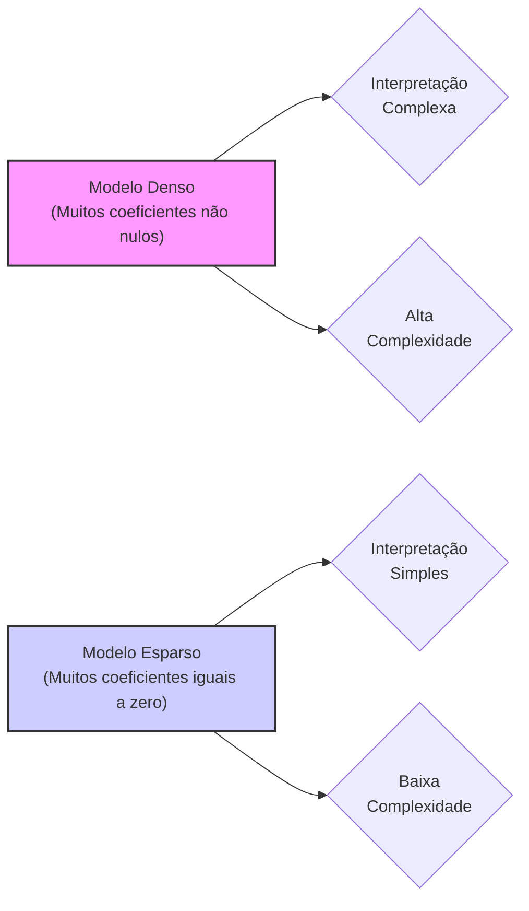
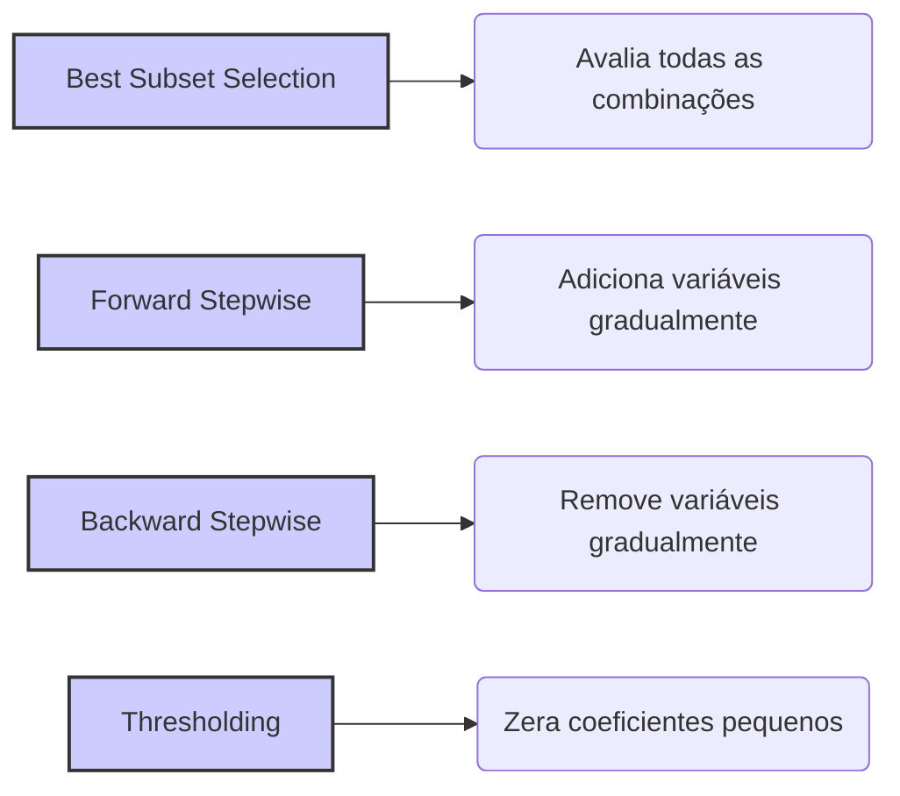
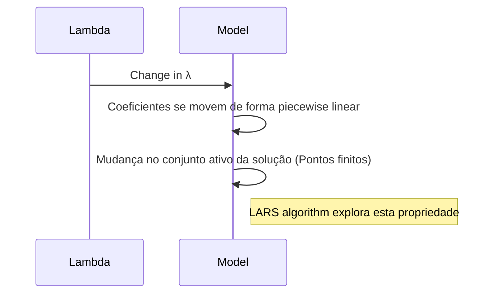

## Sparsity em Modelos de Regressão Linear: Uma Análise Detalhada



### Introdução

A **Sparsity**, ou esparsidade, é um conceito crucial na modelagem estatística e no aprendizado de máquina, particularmente em modelos de regressão linear e suas extensões. Um modelo é considerado **esparso** quando uma grande parte dos seus parâmetros (coeficientes) é igual a zero [^6]. A esparsidade não é apenas uma propriedade matemática, mas uma ferramenta poderosa que contribui para a construção de modelos mais simples, mais interpretáveis, computacionalmente eficientes e robustos [^6]. Em contextos de alta dimensionalidade, onde o número de preditores é grande comparado ao número de observações, a esparsidade torna-se fundamental para lidar com o problema do *overfitting*. Neste capítulo, exploraremos os fundamentos teóricos, as implicações práticas e os métodos para induzir a esparsidade em modelos de regressão.

### Conceitos Fundamentais e Motivações

Nesta seção, exploraremos os conceitos e as motivações por trás da esparsidade em modelos de regressão linear.

**Definição de Sparsity**

Em termos mais formais, um vetor ou matriz é esparso se a maior parte de suas entradas for igual a zero. Em modelos de regressão linear, um modelo é esparso quando muitos dos seus coeficientes $\beta_j$ são exatamente iguais a zero [^6]. Isso implica que apenas um subconjunto das variáveis preditoras é utilizado para fazer as predições. Se temos um modelo da forma:

$$
y = \beta_0 + \beta_1x_1 + \beta_2x_2 + \ldots + \beta_p x_p
$$

um modelo esparso seria um onde um subconjunto dos coeficientes fosse igual a zero, por exemplo:
$$
y = \beta_0 + \beta_1x_1 + \beta_3x_3 + \beta_7 x_7
$$

onde todos os outros coeficientes $\beta_j$ seriam iguais a zero.

> 💡 **Exemplo Numérico:**
>
> Considere um modelo de regressão linear com 5 preditores ($x_1, x_2, x_3, x_4, x_5$). Um modelo denso poderia ter coeficientes como $\beta = [2.5, 1.2, -0.8, 3.1, 0.5]$. Um modelo esparso, por outro lado, poderia ter $\beta = [2.7, 0, -1.1, 0, 0]$. Neste caso, apenas $x_1$ e $x_3$ são considerados relevantes para o modelo. Isso simplifica o modelo e facilita a interpretação: o impacto de $x_2$, $x_4$ e $x_5$ na variável resposta é considerado nulo.

**Motivações para Sparsity**

Existem diversas motivações para buscar modelos esparsos:

1.  **Interpretabilidade:** Modelos com poucos preditores são mais fáceis de entender e comunicar [^6]. Modelos com *sparsity* ajudam a identificar os preditores mais importantes e a descartar aqueles que não contribuem significativamente para a predição da variável resposta.
2.  **Eficiência Computacional:** Modelos esparsos exigem menos recursos computacionais e menos memória para serem armazenados, por conterem menos parâmetros diferentes de zero [^6]. Isso é crucial quando lidamos com um grande número de preditores.
3.  **Generalização e Prevenção de Overfitting**: Modelos esparsos tendem a ter menos *variance* devido à redução da complexidade. Modelos com muitos preditores podem memorizar padrões específicos no conjunto de dados de treinamento, o que resulta em *overfitting*. A *sparsity* ajuda a criar modelos mais generalizáveis, que são menos suscetíveis ao *overfitting* em dados não vistos [^6].

**Sparsity e o Cenário de Alta Dimensão**

A esparsidade é especialmente importante em problemas de alta dimensionalidade, onde o número de preditores ($p$) é comparável ou maior do que o número de observações ($N$). Em tais cenários, modelos lineares podem sofrer de *overfitting*, e a seleção de variáveis se torna crucial. A esparsidade induzida por regularização L1 ou por outros métodos semelhantes auxilia a mitigar esse problema.
Em finanças quantitativas, problemas de alta dimensionalidade são comuns, como por exemplo na modelagem de portfólios com milhares de ativos, onde um modelo esparso ajuda a identificar o número mais pequeno possível de ativos relevantes para a modelagem do portfólio.

**Lemma 10:**  Condições para Sparsity em Regressão Linear

Para que a *sparsity* seja obtida em regressão linear através de regularização, é necessário que a penalidade imposta aos coeficientes do modelo promova soluções com alguns coeficientes iguais a zero. A regularização L1 satisfaz esta condição, enquanto a regularização L2 não o faz. A penalização L1 corresponde à norma L1 dos parâmetros e pode ser escrita como $||\beta||_1 = \sum_{j=1}^p |\beta_j|$, e a penalização L2 corresponde à norma L2, $||\beta||_2^2 = \sum_{j=1}^p \beta_j^2$. Os contornos da norma L1 são em formato de diamante com os cantos nos eixos, o que promove que as soluções ocorram nos eixos, com coeficientes iguais a zero [^71].

**Prova do Lemma 10:**
O modelo de regressão linear penalizado por L1 é escrito como
$$ \min_{\beta} ||y-X\beta||^2 + \lambda ||\beta||_1$$
onde $\lambda \ge 0$. O primeiro termo da equação representa a soma do quadrado dos resíduos, que corresponde à função objetivo da regressão por mínimos quadrados, enquanto o segundo termo é a penalização L1 que promove esparsidade. A solução deste problema de otimização ocorre no ponto onde a elipse da RSS se cruza com o diamante do contorno da norma L1. Geometricamente, para a penalidade L1, os cantos (onde pelo menos um coeficiente é zero) são pontos mais prováveis onde ocorre a interseção, em comparação com a penalidade L2 (um círculo), onde os pontos de interseção não apresentam nenhum padrão específico.
Além disso, a penalização L1 torna o problema não linear, com pontos de não diferenciabilidade na origem, e não é possível estabelecer uma solução analítica como na Ridge. O efeito da não-diferenciabilidade é que alguns coeficientes são “forçados” a zero. $\blacksquare$

> 💡 **Exemplo Numérico:**
>
> Considere um problema de regressão com dois preditores. A função de custo (RSS) sem regularização pode ser representada por elipses concêntricas.
>
> - **Regularização L2 (Ridge):** A penalidade L2 é um círculo. A solução é encontrada no ponto onde o círculo intercepta a elipse da RSS. Este ponto geralmente não está nos eixos, o que significa que ambos os coeficientes serão diferentes de zero, portanto, não há esparsidade.
>
> - **Regularização L1 (Lasso):** A penalidade L1 é um diamante. A solução é encontrada no ponto onde o diamante intercepta a elipse da RSS. Devido à geometria do diamante, a interseção é mais provável de ocorrer em um dos vértices, que corresponde a um dos coeficientes ser zero (esparsidade).
>
> ```mermaid
>  graph LR
>      A[RSS Ellipse] --> B(L2 Circle);
>      A --> C(L1 Diamond);
>      B --> D{Non Sparse Solution};
>      C --> E{Sparse Solution};
> ```
>
> Este exemplo ilustra como a forma da penalidade influencia a esparsidade da solução.

**Corolário 10:** Contínuo vs. Discreto na Seleção de Variáveis

A regularização L1 promove a seleção de variáveis de forma contínua, ou seja, os coeficientes variam continuamente conforme o parâmetro de regularização $\lambda$ varia, e isso é em contraste com outros métodos de seleção de variáveis, como *Best Subset Selection*, que são discretos, selecionando ou eliminando cada variável como um todo [^71]. A continuidade da regularização L1 permite explorar um contínuo de modelos desde o modelo mais simples (com todos os coeficientes iguais a zero), passando por modelos mais esparsos, até o modelo completo (sem restrição nenhuma). Esta propriedade contínua é vantajosa por permitir um melhor controle sobre a complexidade do modelo, e por tornar os modelos esparsos mais acessíveis. A continuidade no método Lasso, entretanto, é somente no caminho da solução, o que é diferente da continuidade da solução em função da variável resposta.

> ⚠️ **Nota Importante**: Sparsity, em modelos de regressão linear, é a propriedade de alguns parâmetros (coeficientes) serem iguais a zero. Essa propriedade leva a modelos mais interpretáveis, mais computacionalmente eficientes e com melhor capacidade de generalização. **Referência ao contexto [^6]**.

> ❗ **Ponto de Atenção**: A regularização L1 (Lasso) é uma técnica eficaz para induzir a esparsidade, levando a modelos lineares que selecionam as variáveis mais relevantes. **Conforme indicado no contexto [^44]**.

> ✔️ **Destaque**: Em modelos de alta dimensionalidade, a esparsidade é um mecanismo fundamental para evitar o overfitting e melhorar a generalização. **Baseado no contexto [^6]**.

### Implementação da Sparsity

Nesta seção, exploraremos os métodos práticos para implementar a *sparsity* em modelos de regressão linear.

**Regularização L1 (Lasso) para Sparsity**

Como discutido anteriormente, a regularização L1 é um dos métodos mais populares para induzir esparsidade em modelos lineares [^44]. A função objetivo do Lasso é:

$$
\underset{\beta}{\text{min}}  ||y - X\beta||^2 + \lambda ||\beta||_1
$$

O parâmetro $\lambda$ controla a força da regularização e, portanto, o grau de *sparsity* obtido. Para $\lambda=0$, temos a solução de mínimos quadrados sem regularização. Conforme $\lambda$ aumenta, mais coeficientes são forçados a zero, aumentando a *sparsity* do modelo [^24]. O algoritmo LARS fornece uma solução eficiente para gerar todo o caminho de soluções do Lasso.

> 💡 **Exemplo Numérico:**
>
> Vamos considerar um exemplo com um dataset sintético onde temos 100 observações e 10 preditores. Vamos usar o `sklearn` para ilustrar o efeito do $\lambda$ no modelo Lasso:
>
> ```python
> import numpy as np
> import matplotlib.pyplot as plt
> from sklearn.linear_model import Lasso
> from sklearn.model_selection import train_test_split
> from sklearn.metrics import mean_squared_error
>
> # Generate synthetic data
> np.random.seed(42)
> X = np.random.randn(100, 10)
> true_beta = np.array([2, -1, 0.5, 0, 0, 0, -0.2, 0, 0, 0.1])
> y = np.dot(X, true_beta) + np.random.randn(100) * 0.5
>
> # Split data
> X_train, X_test, y_train, y_test = train_test_split(X, y, test_size=0.3, random_state=42)
>
> # Lambda values to test
> lambda_values = [0.01, 0.1, 0.5, 1, 2]
>
> # Store results
> results = []
>
> for lambda_val in lambda_values:
>    lasso = Lasso(alpha=lambda_val)
>    lasso.fit(X_train, y_train)
>    y_pred = lasso.predict(X_test)
>    mse = mean_squared_error(y_test, y_pred)
>    results.append({
>        'lambda': lambda_val,
>        'coef': lasso.coef_,
>        'mse': mse
>    })
>
> # Display results
> for result in results:
>    print(f"Lambda: {result['lambda']:.2f}, Coef: {np.round(result['coef'], 2)}, MSE: {result['mse']:.2f}")
>
> # Visualize coefficients
> plt.figure(figsize=(10, 6))
> for result in results:
>    plt.plot(result['coef'], label=f"λ={result['lambda']:.2f}")
> plt.xlabel("Coefficient Index")
> plt.ylabel("Coefficient Value")
> plt.title("Lasso Coefficients for Different Lambda Values")
> plt.legend()
> plt.grid(True)
> plt.show()
> ```
>
> Neste exemplo, vemos que com $\lambda=0.01$, os coeficientes se aproximam dos valores verdadeiros, com $\lambda=0.1$, alguns coeficientes já são zero, e com $\lambda=2$, a maioria dos coeficientes é zero. O MSE também aumenta com o aumento de $\lambda$. O gráfico mostra como a esparsidade aumenta com o valor de $\lambda$.

**Regularização Elastic Net para Sparsity**

A Elastic Net combina a regularização L1 com a regularização L2, oferecendo uma abordagem mais flexível para lidar com problemas de *sparsity* e multicolinearidade [^73]. A função objetivo da Elastic Net é:

$$
\underset{\beta}{\text{min}}  ||y - X\beta||^2 + \lambda (\alpha ||\beta||_1 + (1 - \alpha) ||\beta||_2^2)
$$

O parâmetro $\alpha$ controla o peso da penalidade L1 em relação à penalidade L2. Com $\alpha=1$ temos o Lasso e com $\alpha=0$ temos a Ridge. A escolha de $\alpha$ permite controlar o grau de *sparsity* induzido pela penalização L1, e o controle da variância dos parâmetros devido à penalização L2.

> 💡 **Exemplo Numérico:**
>
>  Continuando com o exemplo anterior, vamos ver como o parâmetro $\alpha$ da Elastic Net afeta a esparsidade:
>
> ```python
> import numpy as np
> import matplotlib.pyplot as plt
> from sklearn.linear_model import ElasticNet
> from sklearn.model_selection import train_test_split
> from sklearn.metrics import mean_squared_error
>
> # Generate synthetic data (same as before)
> np.random.seed(42)
> X = np.random.randn(100, 10)
> true_beta = np.array([2, -1, 0.5, 0, 0, 0, -0.2, 0, 0, 0.1])
> y = np.dot(X, true_beta) + np.random.randn(100) * 0.5
>
> # Split data
> X_train, X_test, y_train, y_test = train_test_split(X, y, test_size=0.3, random_state=42)
>
> # Alpha values to test (lambda fixed)
> alpha_values = [0, 0.25, 0.5, 0.75, 1]
> lambda_val = 0.5
>
> # Store results
> results = []
>
> for alpha_val in alpha_values:
>    elastic_net = ElasticNet(alpha=lambda_val, l1_ratio=alpha_val)
>    elastic_net.fit(X_train, y_train)
>    y_pred = elastic_net.predict(X_test)
>    mse = mean_squared_error(y_test, y_pred)
>    results.append({
>        'alpha': alpha_val,
>        'coef': elastic_net.coef_,
>        'mse': mse
>    })
>
> # Display results
> for result in results:
>    print(f"Alpha: {result['alpha']:.2f}, Coef: {np.round(result['coef'], 2)}, MSE: {result['mse']:.2f}")
>
> # Visualize coefficients
> plt.figure(figsize=(10, 6))
> for result in results:
>    plt.plot(result['coef'], label=f"α={result['alpha']:.2f}")
> plt.xlabel("Coefficient Index")
> plt.ylabel("Coefficient Value")
> plt.title("Elastic Net Coefficients for Different Alpha Values")
> plt.legend()
> plt.grid(True)
> plt.show()
> ```
>
> Observamos que quando $\alpha=0$ (Ridge), a maioria dos coeficientes são diferentes de zero. Quando $\alpha=1$ (Lasso), alguns coeficientes são zero. Valores intermediários de $\alpha$ levam a modelos com esparsidade controlada, combinando as vantagens da regularização L1 e L2.

**Outros métodos de seleção de variáveis para *sparsity***

Outras abordagens para induzir *sparsity* são:

-   **Best Subset Selection:** Este método avalia todas as possíveis combinações de preditores, selecionando um subconjunto que otimiza um certo critério de desempenho, como o critério de informação de Akaike (AIC) [^15]. Embora possa selecionar um subconjunto de variáveis, ele é computacionalmente custoso e não necessariamente promove esparsidade no sentido de que os coeficientes associados aos preditores selecionados são zero.
-   **Forward Stepwise Selection:** Este método constrói o modelo adcionando gradualmente as variáveis mais importantes. Ao usar um critério de seleção de variáveis como o AIC, o método pode resultar num modelo esparso, eliminando as variáveis menos relevantes [^16].
-  **Backward Stepwise Selection:** Este método começa com um modelo que inclui todas as variáveis e remove as menos importantes em cada etapa, e pode também produzir um modelo esparso eliminando os preditores menos relevantes [^17].
- **Thresholding**: Uma técnica que também leva a modelos esparsos é a de thresholding. Neste método, os coeficientes menores que uma certa magnitude são reduzidos a zero. Thresholding pode ser aplicado após uma regressão linear com penalização L1 ou L2, como por exemplo, depois de aplicar a Ridge, ou também como uma opção direta no problema de otimização.



### Análise Matemática da Sparsity

A análise matemática da *sparsity* é essencial para compreender como os diferentes métodos afetam a seleção de variáveis e a complexidade do modelo.

**Lemma 11:**  Otimização com Penalidade L1

A otimização com penalidade L1, como no Lasso, leva a soluções esparsas devido à natureza não-diferenciável da norma L1 na origem. A função objetivo do Lasso é não-convexa, devido à penalização L1, o que dificulta a otimização, já que a solução não pode ser encontrada de forma analítica. As condições de otimalidade de Kuhn-Tucker para o Lasso implicam que:

- $|\frac{\partial ||y - X\beta||^2}{\partial \beta_i}| \leq \lambda$ quando $\beta_i = 0$.
-  $\frac{\partial ||y - X\beta||^2}{\partial \beta_i} = - \lambda \text{sign}(\beta_i)$ quando $\beta_i \neq 0$.

Estas condições demonstram como o valor de $\lambda$ regula o quão perto de zero o gradiente da função RSS deve estar para que o coeficiente $\beta_i$ seja zero [^71].

**Prova do Lemma 11:**
A função objetivo do Lasso é dada por
$$ \min_{\beta} ||y - X\beta||^2 + \lambda ||\beta||_1$$
onde $||y - X\beta||^2 = \sum_{i=1}^N(y_i - X_i\beta)^2$ é diferenciável e $ ||\beta||_1=\sum_{i=1}^p|\beta_i|$ é não diferenciável na origem. Para o mínimo da função objetivo, o gradiente em relação a $\beta$ deve ser zero, e como ela é não diferenciável, usamos as condições de Kuhn-Tucker. Seja $ \nabla f$ o gradiente da RSS e $g(\beta) = ||\beta||_1$. Temos então que, na solução, os seguintes casos podem ocorrer:
\begin{enumerate}
    \item $\beta_i = 0$ e $|\nabla f_i| < \lambda$
    \item $\beta_i > 0$ e $\nabla f_i = -\lambda$
    \item $\beta_i < 0$ e $\nabla f_i = \lambda$
\end{enumerate}
A primeira condição implica que se o valor absoluto do gradiente na origem é menor que $\lambda$, então o coeficiente é zero. As duas últimas condições implicam que quando o coeficiente não é nulo, então o seu gradiente está relacionado a $\lambda$. $\blacksquare$

> 💡 **Exemplo Numérico:**
>
> Vamos ilustrar as condições de Kuhn-Tucker para um caso simples com um único preditor. Suponha que temos o seguinte modelo:
>
> $$y = \beta_0 + \beta_1 x$$
>
> E a função objetivo do Lasso é:
>
> $$ \min_{\beta_0, \beta_1} \sum_{i=1}^N(y_i - \beta_0 - \beta_1 x_i)^2 + \lambda |\beta_1|$$
>
> A derivada da RSS em relação a $\beta_1$ é:
>
> $$ \frac{\partial RSS}{\partial \beta_1} = -2\sum_{i=1}^N x_i (y_i - \beta_0 - \beta_1 x_i)$$
>
> As condições de Kuhn-Tucker para $\beta_1$ são:
>
> 1. Se $\beta_1 = 0$, então $|\frac{\partial RSS}{\partial \beta_1}| \leq \lambda$.
> 2. Se $\beta_1 \neq 0$, então $\frac{\partial RSS}{\partial \beta_1} = -\lambda \text{sign}(\beta_1)$.
>
> Suponha que, após calcular a derivada, temos que a derivada da RSS em relação a $\beta_1$ é igual a 0.7. Se $\lambda=1$, então a primeira condição é satisfeita, e $\beta_1=0$. Se $\lambda=0.5$, então a primeira condição não é satisfeita e $\beta_1$ será diferente de zero. O valor exato de $\beta_1$ pode ser encontrado pela segunda condição, que é uma função de $\lambda$.
>
> Este exemplo mostra como o valor de $\lambda$ influencia se o coeficiente é zero ou não, e como as condições de Kuhn-Tucker formalizam essa relação.

**Corolário 11:**  Caminho de soluções piecewise linear do Lasso

Os resultados do Lemma 11 implicam que o caminho da solução do Lasso é piecewise linear e que a complexidade do modelo varia ao longo desse caminho [^76]. Especificamente, se o valor do parâmetro de regularização $\lambda$ muda, então os coeficientes irão se mover de acordo com a sua relação com o resíduo, mas os pontos onde há mudança no conjunto ativo da solução são finitos e piecewise linear.
O algoritmo LARS explora essa propriedade para computar todo o caminho das soluções do Lasso de forma eficiente.



### Pergunta Teórica Avançada:  Em que tipo de problemas a esparsidade é mais benéfica e por quê?

**Resposta:**

A *sparsity* em modelos de regressão linear é particularmente benéfica em problemas que compartilham algumas características, incluindo problemas de alta dimensionalidade, onde o número de preditores é alto, e modelos com muitas variáveis irrelevantes ou redundantes. Nesses casos, a *sparsity* pode melhorar a performance preditiva, a interpretabilidade, e a eficiência computacional.

Em cenários com **alta dimensionalidade**, onde $p >> N$, modelos com muitos parâmetros podem sofrer de *overfitting*, ou seja, memorizar ruídos e padrões específicos do conjunto de dados de treinamento e não generalizar bem para novos dados. A *sparsity* ajuda a selecionar apenas os preditores mais relevantes, criando modelos mais simples e mais robustos, que se adequam melhor aos dados disponíveis e que também generalizam bem.
A *sparsity* é particularmente benéfica quando se suspeita que o número de preditores relevantes é bem menor que o número de preditores totais. Nesses casos, a regularização L1, ou Lasso, força muitos dos coeficientes a zero, eliminando preditores não relevantes e revelando a estrutura subjacente do problema [^44]. Isso é particularmente útil em cenários como *feature selection*, ou identificação de fatores relevantes.
A *sparsity* também reduz a variância dos coeficientes e, portanto, torna o modelo menos sensível às flutuações do conjunto de dados de treinamento. Isso ocorre porque a *sparsity* seleciona um subconjunto de parâmetros, evitando o uso de preditores que trazem pouco valor informativo, além de instabilidade. Essa redução da variância leva a um modelo mais estável que generaliza melhor para dados não vistos.
A *sparsity* também melhora a **interpretabilidade** do modelo [^6]. Em muitos casos, é crucial entender quais preditores estão relacionados com a variável resposta. Modelos com muitos preditores não nulos podem ser difíceis de entender, enquanto modelos esparsos fornecem uma representação simplificada do problema. Por exemplo, na medicina, a identificação de poucos genes que estão relacionados a uma determinada doença, obtida através de modelagem esparsa, facilita a pesquisa e o desenvolvimento de novas terapias.
Em termos de **eficiência computacional**, modelos com poucos parâmetros não nulos exigem menos recursos computacionais para serem armazenados e computados. Isso é importante em problemas com um grande número de preditores e também para modelos que serão usados em tempo real, onde a eficiência computacional é essencial [^6].
A *sparsity* é benéfica em modelos de regressão em aplicações onde a precisão e interpretabilidade são simultaneamente importantes. A escolha de um método de regularização que promove *sparsity*, como L1 ou Elastic Net, deve estar guiada pelas necessidades da aplicação em mãos, buscando sempre o melhor compromisso entre complexidade, interpretabilidade e generalização.

### Conclusão

A *sparsity* é um conceito essencial na modelagem estatística e no aprendizado de máquina, com um impacto significativo na interpretabilidade, na eficiência computacional e na performance dos modelos. Técnicas como o Lasso e o Elastic Net, juntamente com o algoritmo LARS, são ferramentas importantes para induzir a *sparsity* em modelos lineares e lidar com problemas de alta dimensionalidade. Compreender a teoria e a prática da *sparsity* é crucial para criar modelos robustos e aplicáveis a uma variedade de problemas no mundo real.

### Referências

[^6]: "The idea of penalizing by the sum-of-squares of the parameters is also used in neural networks, where it is known as weight decay (Chapter 11)." *(Trecho de Linear Methods for Regression)*

[^44]: "A penalidade L1 induz sparsity, zerando coeficientes menos relevantes, levando a modelos mais interpretáveis, "*(Trecho de Linear Methods for Regression)*

[^71]: "In this view, the lasso, ridge regression and best subset selection are Bayes estimates with different priors. Note, however, that they are derived as posterior modes, that is, maximizers of the posterior." *(Trecho de Linear Methods for Regression)*

[^15]: "Best subset regression finds for each k \in \{0,1, 2, \ldots, p\} the subset of size k that gives smallest residual sum of squares (3.2)." *(Trecho de Linear Methods for Regression)*

[^16]: "Forward-stepwise selection starts with the intercept, and then sequentially adds into the model the predictor that most improves the fit." *(Trecho de Linear Methods for Regression)*

[^17]: "Backward-stepwise selection starts with the full model, and sequentially deletes the predictor that has the least impact on the fit." *(Trecho de Linear Methods for Regression)*

[^24]: "The coefficients are shrunk toward zero (and each other)." *(Trecho de Linear Methods for Regression)*

[^40]: "Unlike forward-stepwise regression, none of the other variables are adjusted when a term is added to the model. As a consequence, forward stagewise can take many more than p steps to reach the least squares fit," *(Trecho de Linear Methods for Regression)*

[^76]: "By construction the coefficients in LAR change in a piecewise linear fashion." *(Trecho de Linear Methods for Regression)*
