## Sparsity in Regression Models

### Introduction

**Sparsity**, in the context of regression models, refers to the property where many of the model parameters are equal to zero or are very close to zero [^1]. This implies that the model uses only a small number of features or input variables in order to make predictions. Sparse models are desirable due to their simplicity, interpretability, and computational efficiency. This chapter delves into the concept of sparsity, its implications, and techniques to achieve it.

### Conceitos Fundamentais

#### Conceito 1: Sparsity in Parameters and Feature Selection

In regression models, sparsity means that only a subset of input features are deemed important by the model [^2]. When a model has many parameters, it is difficult to interpret which are the features that are effectively contributing to the prediction. When a model is sparse, we reduce the number of effective input variables, allowing the relevant variables to be identified. This, in turn, greatly increases the interpretability of the models and facilitates feature selection, where we can focus only on the key variables that are responsible for the observed behavior [^3]. In simple terms, a sparse model means we are using less input information, since many coefficients are zero, leading to a simpler model.

> ⚠️ **Nota Importante**: _Sparsity enables a model to achieve the same level of performance using a smaller number of features, which increases understanding of the underlying relationships._ [^7]

> 💡 **Exemplo Numérico:**
> Imagine we are predicting house prices based on 100 features (e.g., number of rooms, distance to the city center, age of the house, etc.). A dense model might use all 100 features, assigning a non-zero coefficient to each. However, a sparse model might find that only 10 features are truly important, setting the coefficients of the other 90 features to zero. For instance, a sparse model might indicate that the number of bedrooms, the size of the living room, and the location are the most important factors, while the number of bathrooms, the presence of a garage, or the age of the house are irrelevant. This simplification not only makes the model easier to understand but also avoids overfitting by reducing the number of parameters.

#### Conceito 2: L1 Regularization and Sparsity
**L1 regularization**, often known as the Lasso method, is the main technique to induce sparsity in linear models [^4]. This technique adds a penalty to the loss function proportional to the L1 norm of the coefficient vector $\beta$, which is defined as the sum of the absolute values of the parameters:
$$
 \text{Cost function} = \text{Loss} + \lambda || \beta ||_1
$$
where $\lambda > 0$ is the regularization parameter, the $Loss$ term is usually the sum of squared residuals, and  $||\beta||_1$ denotes the sum of the absolute values of the model coefficients. The effect of adding this penalty term is to shrink the coefficient values, and more importantly, set many of them to exactly zero, generating a sparse model. This feature arises from the fact that the L1 norm is not differentiable at zero and has sharp "corners". [^5].

> ❗ **Ponto de Atenção**: *_The L1 norm has the property of inducing sparsity by driving coefficients to exactly zero._* [^8]

> 💡 **Exemplo Numérico:**
> Let's consider a regression problem with two features and a target variable. The loss function (without regularization) is given by $||y - X\beta||^2$. Suppose we have the following:
>
>  $X = \begin{bmatrix} 1 & 2 \\ 3 & 4 \\ 5 & 6 \end{bmatrix}$,  $y = \begin{bmatrix} 5 \\ 9 \\ 13 \end{bmatrix}$
>
> Without regularization, we might find $\beta = \begin{bmatrix} 1 \\ 2 \end{bmatrix}$ by solving the normal equations.
>
> Now, let's apply L1 regularization with $\lambda = 0.5$. The cost function becomes:
>
> $ \text{Cost} = ||y - X\beta||^2 + 0.5 * (|\beta_1| + |\beta_2|)$
>
>  After optimization, we might find that the optimal coefficients are, for example,  $\beta = \begin{bmatrix} 0 \\ 2.2 \end{bmatrix}$. Notice that the L1 norm has forced the first coefficient to be exactly zero. This is a characteristic of L1 regularization.
>
> If we increase $\lambda$, we would have a larger penalty, and the second coefficient would also be driven towards zero. For example, with $\lambda = 2$, we might find $\beta = \begin{bmatrix} 0 \\ 0 \end{bmatrix}$.
>
> This shows how L1 regularization can induce sparsity by setting coefficients to zero.

#### Conceito 3: L0 Regularization and Sparsity
Although L1 regularization is the most common method to induce sparsity, we could also consider the L0 norm, which directly counts the number of nonzero parameters in the model. The penalty term would then be the number of non-zero elements in vector $\beta$, or $||\beta||_0$. The loss function in this case will be
$$
 \text{Cost function} = \text{Loss} + \lambda ||\beta||_0
$$
This would directly lead to sparse models. However, the L0 norm is not a true norm, and this regularization strategy has the drawback of making the cost function non-convex. It is an NP-hard problem, and generally is not implemented in practice, even if in theory it is more effective at producing sparse models than the L1 norm. The L1 is therefore a convex surrogate for L0 norm, that produces models that are still sparse, although not as sparse as the L0 norm could [^6].

> ✔️ **Destaque**: _The L0 norm is a direct measure of the sparsity of a model, but it is non-convex and hard to optimize. The L1 norm is a convex surrogate for it, and serves a similar purpose while being more efficient computationally._ [^9]

> 💡 **Exemplo Numérico:**
> Let's revisit the previous example, and consider the L0 regularization instead.
>  $X = \begin{bmatrix} 1 & 2 \\ 3 & 4 \\ 5 & 6 \end{bmatrix}$,  $y = \begin{bmatrix} 5 \\ 9 \\ 13 \end{bmatrix}$
> The cost function would be:
>
> $ \text{Cost} = ||y - X\beta||^2 + \lambda ||\beta||_0 $
>
>  If, for example, $\beta = \begin{bmatrix} 0 \\ 2 \end{bmatrix}$, then $||\beta||_0 = 1$ because only one coefficient is non-zero. If $\beta = \begin{bmatrix} 1 \\ 2 \end{bmatrix}$, then $||\beta||_0 = 2$.
>
> The L0 norm directly counts the number of non-zero parameters.  The optimization problem of minimizing the cost function with the L0 norm is a combinatorial problem, which is NP-Hard, meaning that it is very difficult to find the optimal solution.  The L1 norm is used instead, as a convex relaxation of the L0 norm, since it achieves a similar effect while being computationally feasible.

#### Lemma 1: Propriedades da Norma L1 e Sparsity
The L1 norm promotes sparsity because its geometry forces solutions towards the axes of the coordinate system, which results in parameters with value zero. Consider, as an example,  a two-dimensional case, with  $\beta = (\beta_1, \beta_2)$ and consider that we are trying to minimize a loss function subjected to a constraint $||\beta||_1 < t$ for a given t. Then, in the bi-dimensional space we would be constrained to a diamond-shaped area. Geometrically, a solution is found where the level curves of the loss function, in the absence of the constraint, touches the diamond surface. The "corners" of the diamond create many locations where one of the variables will be exactly zero. This is what happens with Lasso. [^27]. $\blacksquare$

> 💡 **Exemplo Numérico:**
> Consider a simple loss function $L(\beta) = (\beta_1 - 2)^2 + (\beta_2 - 3)^2$. This represents a bowl-shaped function centered at $\beta = (2, 3)$.
>
>  If we add an L1 constraint $||\beta||_1 = |\beta_1| + |\beta_2| \leq t$ for some value $t$, we are now constrained to a diamond shape.
>
> 1. **Without constraint:** The minimum is at $\beta = (2, 3)$.
> 2. **With L1 constraint (small t):**  For a small value of  $t$, the diamond is small, and the solution is found at a corner, for example, $\beta = (0, t)$ or $\beta = (t, 0)$. This means that one of the coefficients will be exactly zero.
> 3. **With L1 constraint (larger t):** For a larger value of $t$, the diamond becomes larger, and the solution may be on one of the sides of the diamond. However, for some values of $t$, a solution will be at one of the corners.
>
> This geometrical explanation shows why the L1 norm induces sparsity.

#### Corolário 1: Implicações da Sparsity na Interpretabilidade

Sparsity not only simplifies a model by reducing the number of input variables, but also enhances its interpretability. By identifying a subset of features that significantly contribute to the prediction, we obtain insights into the underlying data generating process and find what are the most relevant variables. This can also greatly improve the predictive power of the model, since it reduces model complexity by not using all possible features, effectively avoiding overfitting. [^28]

> 💡 **Exemplo Numérico:**
> Let’s say we’re trying to predict customer churn using a dataset with 50 features. A dense model might use all 50 features to make predictions, making it hard to understand which factors are most important for churn. However, if we apply L1 regularization, we might find a sparse model that uses only 5 features, for example: the number of calls to customer service, the duration of the contract, the number of complaints, the monthly fee, and the user's location.
>
> This sparse model is much easier to interpret. We can now focus on these five key features to understand what causes churn and design better strategies to retain customers. This is the power of sparsity in improving interpretability.

### Regressão Linear e Sparsity

Sparsity is especially relevant in the context of linear models. The main goal of a linear regression is to understand which factors influence the output variables. However, a linear regression model with too many features may give a complex result that is hard to interpret.
L1 regularization methods like the LASSO, can provide a simple framework where only a few input variables are deemed to be important, and will be associated with non-zero parameters, while the parameters associated with the less important variables will be zero.   This makes the model more interpretable because the number of variables is reduced. Another advantage of L1 regularization is that it is computationally tractable. The LARS algorithm efficiently finds all the solutions of LASSO in a piecewise linear fashion [^30].

#### Lemma 2: Relação entre LARS e Sparsity

The LARS algorithm, by design, generates solutions in which coefficients are zero, thus inducing sparsity in the model [^30]. By starting with all coefficients equal to 0 and adding new variables as necessary, or dropping variables that become zero, LARS generates a sparse model. This is especially relevant since the LARS algorithm is numerically efficient, meaning that we can find sparse solutions in problems with many variables in an efficient way, without resorting to computationally expensive techniques such as best subset selection or other iterative minimization routines [^29].  $\blacksquare$

> 💡 **Exemplo Numérico:**
> Let’s consider a dataset with 10 features and a target variable. The LARS algorithm starts with all coefficients equal to zero.
>
> 1. **Step 1:** The algorithm finds the feature most correlated with the residuals (e.g., feature 3). The coefficient for feature 3 is increased in the direction of the least squares estimate.
> 2. **Step 2:** The algorithm continues increasing the coefficient of feature 3 until another feature (e.g., feature 7) becomes equally correlated with the residuals. The coefficients of both features 3 and 7 are updated together.
> 3. **Step 3:** The process continues, and at some point, the coefficient of a feature may hit zero. If this happens, the variable is removed from the active set. Let's say that the coefficient of feature 3 hits zero.
> 4.  The LARS algorithm continues, adding or removing features in this manner, creating a sequence of models with different levels of sparsity.
>
> The key idea is that, at each step, only a subset of features has non-zero coefficients, meaning that the LARS algorithm, by design, produces sparse solutions.

#### Prova do Lemma 2: Sparsity in LARS
The LARS algorithm's mechanism for updating coefficients directly contributes to sparsity. The LARS algorithm identifies the most correlated features with the residuals at each iteration and moves their coefficients toward the least-squares direction, until another variable becomes as correlated. Therefore, as coefficients become irrelevant or its correlation to the residual is small, their coefficients become exactly zero. The modified version of LARS for LASSO will also drop variables from the model when the coefficients hits exactly zero. These rules mean that, as the algorithm progresses, many coefficients will be exactly zero, leading to a sparse solution for a given value of $\lambda$. [^32]  $\blacksquare$

#### Corolário 2: Interpretabilidade de Modelos LASSO

The properties of the L1 penalty and the LARS algorithm generate interpretable models, with coefficients associated with irrelevant variables being equal to zero. This implies that the model relies only on a subset of the input features, which are deemed to be the most relevant according to the data used to fit the model. As such, the LARS algorithm provides not only a good prediction, but also an explanation, of which features are important [^33]. This helps in understanding the relationships between the input data and the output.

> 💡 **Exemplo Numérico:**
> Suppose we are using the LASSO regression to predict customer satisfaction scores based on 20 different features, such as website usage, product reviews, and customer support interactions. After running the LASSO, we observe that only 4 features have non-zero coefficients.
>
> This sparse model tells us that, according to the data, only these 4 features are truly important for predicting customer satisfaction. The other 16 features do not significantly contribute to the outcome, and we can ignore them. This greatly simplifies the problem and allows us to focus our attention on the most important factors. This is why LASSO is so powerful for feature selection and model interpretation.

### Regularização e Sparsity: Ridge e Lasso (Formal)

The explicit mathematical form of L1 and L2 regularization reveal that both L1 and L2 penalties provide ways to balance the loss with the complexity of the model. However, their geometry promotes very different types of solutions.
The Ridge regression minimizes the following problem
$$
\underset{\beta}{\text{min}} || y - X\beta||^2 + \lambda ||\beta||^2
$$
which can be interpreted as the following constrained problem (see bias-variance chapter):
$$
\underset{\beta}{\text{min}} || y - X\beta||^2 \quad \text{ subject to } \quad ||\beta||^2 \leq t
$$
which means that we try to minimize the loss, while the norm of the coefficients is forced to remain inside a sphere, whose radius is given by the parameter t. Due to this spherical constraint region, solutions tend not to have coefficients of zero.

On the other hand, the Lasso regression minimizes the following problem
$$
\underset{\beta}{\text{min}} || y - X\beta||^2 + \lambda ||\beta||_1
$$
which can be expressed as the following constrained problem
$$
\underset{\beta}{\text{min}} || y - X\beta||^2 \quad \text{ subject to } \quad ||\beta||_1 \leq t
$$
The L1 norm creates a diamond shape (in two dimensions), or a hyper-diamond in higher dimensions. As discussed in previous section, the corners in the hyper-diamond promote solutions where coefficients are exactly zero [^24].

#### Lemma 3: Relação Geométrica entre L1 e L2 e Sparsity
The level curves of the L2 and L1 regularizers represent different shapes in the parameter space. For L2 the constraint is a hypersphere, and it is everywhere differentiable. For L1 the constraint is a hyperdiamond (or a cross polytope) with "corners", where the function is not differentiable. In the minimization process, if a level curve of the loss function meets one of the corners, the solution may be a sparse solution, with one or more coefficient becoming zero [^25]. This feature leads to the sparsity property of L1 regularization [^26]. $\blacksquare$

> 💡 **Exemplo Numérico:**
> Let's consider a simple loss function  $L(\beta) = (\beta_1 - 2)^2 + (\beta_2 - 3)^2$, which has level curves that are circles centered at $\beta = (2, 3)$.
>
> 1. **Ridge (L2) constraint:** If we apply a constraint  $||\beta||_2 \leq t$, the constraint region is a circle. The solution will be the point where the circle is tangent to the level curves of the loss function. This usually leads to both $\beta_1$ and $\beta_2$ being non-zero.
> 2. **Lasso (L1) constraint:** If we apply a constraint $||\beta||_1 \leq t$, the constraint region is a diamond. The solution will be the point where the diamond is tangent to the level curves of the loss function. If the tangency occurs at one of the diamond's corners, one of the coefficients will be exactly zero, leading to a sparse solution.
>
> This illustrates why L1 regularization promotes sparsity due to its geometry, while L2 regularization does not.

#### Prova do Lemma 3: Propriedades da Norma L1
To show why the corners in L1 norm promotes sparsity, consider the unconstrained loss function that we want to minimize to a function where we have a linear combination of the data and coefficients as given by $||y-X\beta||^2$. If we consider the optimization problem without the constraint, the optimal coefficients will be a vector $\hat{\beta}$ in the coefficient space.  For simplicity, consider the two dimensional case, where the level curves form a family of elliptical shapes centered at $\hat{\beta}$. The constrained problem, i.e. Lasso or Ridge, will look for the optimal solution on a restricted area defined by $||\beta||_1 \leq t$ or $||\beta||_2 \leq t$, with some value of $t$.

The L2 constrained region, $||\beta||_2 \leq t$ is a sphere, and as we increase the value of $t$ (reducing regularization) we move the solutions outwards, in the parameter space. Due to the spherical shape, it is unlikely that we will have solutions where any given component is 0. However, due to the corners of the diamond shape of the L1 norm, we are more likely to find solutions that lie at an axes where one of the components are zero [^24]. $\blacksquare$

#### Corolário 3: Conexão entre L1, Sparsity e Interpretabilidade
The L1 norm, through the LASSO, tends to force parameters to be exactly zero, leading to a sparse solution. The sparsity directly implies that the model uses only some of the variables for prediction, ignoring other variables that are considered less relevant. As a result, this model is easier to interpret. Thus, LASSO is used not only as a regularization technique, but also as a feature selection method [^27].

> 💡 **Exemplo Numérico:**
>
> Let's say we are predicting the sales of a product using 10 different marketing features. After applying LASSO, we find that only 3 features have non-zero coefficients: advertising spend on social media, the number of promotional emails sent, and the number of online ads. The other 7 features, such as advertising on TV, radio, or newspapers, have coefficients of exactly zero.
>
> This sparse model tells us that only social media, emails, and online ads are effective in driving sales. The other marketing channels are not contributing significantly. The interpretability is greatly improved because we can now focus on the marketing channels that actually work.

### Algoritmos de Seleção de Variáveis: LARS e Sparsity

The LARS algorithm by its nature provides sparse models. The algorithm proceeds iteratively, at every step adding or removing coefficients. This creates a solution path with piecewise linear components, where variables enter or are removed from the model in a certain order. At every step the solution is sparse, in the sense that some coefficients are exactly equal to 0. This can also be seen in the coefficient paths, which tend to reach zero for many of the input variables [^30].

#### Lemma 4: LARS e Sparsity

The LARS algorithm induces sparsity by strategically moving coefficients in the direction of their least squares estimates such that many coefficients can be equal to zero. The algorithm will move one (or more) coefficients in the least squares direction, until another variable becomes equally correlated, and then continues the process by updating all those coefficients together. As the algorithm proceeds, some coefficients never become relevant and remain at zero [^35].  $\blacksquare$

> 💡 **Exemplo Numérico:**
> Consider we have 5 features and we are using LARS to find the LASSO path.
>
>  1.  **Initial Step:** All coefficients are zero.
>  2.  **Step 1:** The algorithm selects feature 2, as it has the highest correlation with the residuals. The coefficient of feature 2 starts to grow.
>  3.  **Step 2:** The algorithm reaches a point where feature 4 has the same correlation as feature 2. The coefficients of features 2 and 4 start to grow together.
>  4.  **Step 3:** The algorithm continues, and the coefficient of feature 2 becomes zero. This variable is removed from the active set.
>  5.  **Step 4:** The algorithm continues, and at some point feature 1 enters the active set and so on.
>
> At every step, the LARS algorithm keeps a subset of features with non-zero coefficients, and this subset changes as the algorithm proceeds, but at any step the solution is sparse.

#### Prova do Lemma 4: LARS e Coeficientes Zero

The LARS algorithm adds variables to the active set and moves coefficients in a linear manner along a path until the next variable becomes active or is dropped from the model (if the coefficients hit 0). It has been shown that LARS is similar to the forward-stagewise algorithm (see Chapter 3 of the textbook) and when a coefficient hits zero the variable will be dropped. In the case where a variable was not correlated with the current residuals, its coefficient will remain at zero until that variable becomes relevant.  The LARS algorithm uses the structure of the solution path to generate sparse models by making some parameters to be equal to zero [^36]. $\blacksquare$

#### Corolário 4: Sparsity como Componente Essencial da LARS

The LARS algorithm can be viewed as a method for constructing sparse solutions. While it computes all points in the solution paths of LASSO, many of the coefficient estimates are zero for a given parameter value. As we increase the path parameter (e.g. the L1 norm of the coefficients) we tend to see variables entering and leaving the model, which creates a sparse model at every step. This sparsity makes the LARS solutions more tractable and interpretable [^37].

> 💡 **Exemplo Numérico:**
> Imagine we are using LARS to perform LASSO on a dataset with 20 features. As the L1 norm of the coefficients increases, we can observe how the coefficient path evolves:
>
> 1. **L1 norm = 0:** All coefficients are zero.
> 2. **L1 norm = 0.1:** Only feature 5 has a non-zero coefficient.
> 3. **L1 norm = 0.5:** Features 5, 12, and 18 have non-zero coefficients.
> 4. **L1 norm = 1.0:** Feature 5 has a coefficient of zero, and now features 1, 12, and 18 have non-zero coefficients.
> 5. **L1 norm = 2.0:** Features 1, 12, 18, and 20 have non-zero coefficients.
>
> This example shows that the LARS algorithm generates a sequence of sparse models. As we increase the L1 norm, variables enter and leave the model, and this is how we can find the optimal level of sparsity.

### Pergunta Teórica Avançada: Quais são as vantagens e as desvantagens do uso de técnicas de regularização L1 e L2 simultaneamente (Elastic Net)?
**Resposta:**
A técnica Elastic Net surge como um híbrido da regularização L1 e L2. O objetivo da Elastic Net é minimizar:
$$ \text{Cost function} = || y - X\beta||^2 + \lambda_1 || \beta||_1 + \lambda_2 ||\beta||^2 $$
Onde $\lambda_1$ e $\lambda_2$ são parâmetros de regularização que controlam o impacto da norma L1 e L2 respectivamente.
Esta técnica tenta combinar os benefícios de ambas as penalidades: a capacidade de gerar modelos esparsos do Lasso, através da norma L1, e a estabilidade e redução de variância do Ridge, através da norma L2 [^44].
A principal vantagem da Elastic Net é que ela consegue lidar com situações em que as variáveis de entrada estão muito correlacionadas. A penalidade L2 consegue reduzir o efeito de multicolinearidade entre variáveis correlacionadas, que leva a coeficientes muito grandes e instáveis na regressão linear. Por outro lado, a penalidade L1 permite a seleção de variáveis relevantes, mesmo quando há correlação entre algumas variáveis [^45].
A principal desvantagem é que possui dois parâmetros de regularização que devem ser escolhidos e otimizados, o que aumenta a dificuldade na escolha dos hiperparâmetros apropriados.

> ⚠️ **Ponto Crucial**: _O Elastic Net combina as vantagens das penalidades L1 e L2,  tornando-se uma opção versátil, especialmente para dados com multicolinearidade._

> 💡 **Exemplo Numérico:**
> Suppose we are predicting house prices using a dataset with highly correlated features (e.g., house size in square meters and house size in square feet).
>
> - **LASSO:** LASSO might randomly select one of the correlated features and set the coefficients of the others to zero. This may not lead to a stable model.
> - **Ridge:** Ridge regression shrinks all coefficients but does not set any to zero. This can lead to a complex model with many features.
> - **Elastic Net:** Elastic Net combines both approaches. The L2 penalty (Ridge) handles the multicollinearity by shrinking the coefficients of correlated features, while the L1 penalty (LASSO) performs feature selection, setting some of the less important coefficients to zero.
>
> By adjusting the parameters $\lambda_1$ and $\lambda_2$, we can find a model that is both sparse and stable, which is a key advantage of Elastic Net.

#### Lemma 5: Estabilidade e Interpretabilidade do Elastic Net
By using both penalties at the same time, the Elastic Net, improves the stability and interpretability of the model. The L1 penalty still performs feature selection, by setting some coefficients to zero, while the L2 penalty controls the variance and the magnitudes of non-zero coefficients, avoiding overfitting [^46]. $\blacksquare$

#### Prova do Lemma 5: Elastic Net como Interpolação

It is possible to show that the solution of Elastic Net is an interpolation between the solution of LASSO and Ridge regression. To prove this, we define a new penalty
$$\lambda((1-\alpha) \beta +  \alpha \beta^2)$$ where we can vary the parameter $0\leq \alpha \leq1$. If $\alpha = 0$ we have LASSO, and if $\alpha=1$ we have Ridge. When $0 < \alpha < 1$ we have the Elastic Net, which therefore is a smooth interpolation between these two methods. [^47].
If we consider the Lagrangian form of the Elastic Net, as given by
$$\underset{\beta}{\text{min}} || y - X\beta||^2 + \lambda_1 || \beta||_1 + \lambda_2 ||\beta||^2$$
and rewrite as
$$
\underset{\beta}{\text{min}} || y - X\beta||^2 + \lambda (\alpha||\beta||_1 + (1-\alpha)||\beta||^2)
$$
Then by changing $\alpha$ from 0 to 1 we can interpolate between LASSO and Ridge regression. [^48].  $\blacksquare$

#### Corolário 5: Flexibilidade e Ajuste do Elastic Net
The Elastic Net can be adapted by tuning the two regularization parameters $\lambda_1$ and $\lambda_2$ to provide a good balance between sparsity and stability, and allowing a larger flexibility to the modeling process [^49]. The use of the two parameters gives us the ability to choose among different types of models with respect to the tradeoff between sparsity and coefficient shrinkage, as dictated by the nature of the dataset or the modeling process.

```mermaid
graph LR
    A("Elastic Net") --> B("Two Regularization Parameters (λ₁, λ₂)");
     B --> C("Flexibility in Model Tuning");
    C --> D("Trade-off between Sparsity and Stability");
     style A fill:#ccf,stroke:#333,stroke-width:2px
```

> 💡 **Exemplo Numérico:**
>
> Let's say we are using Elastic Net on a dataset with 30 features, and we are trying to predict some outcome. By adjusting $\lambda_1$ and $\lambda_2$ we can observe the following behavior:
>
> 1.