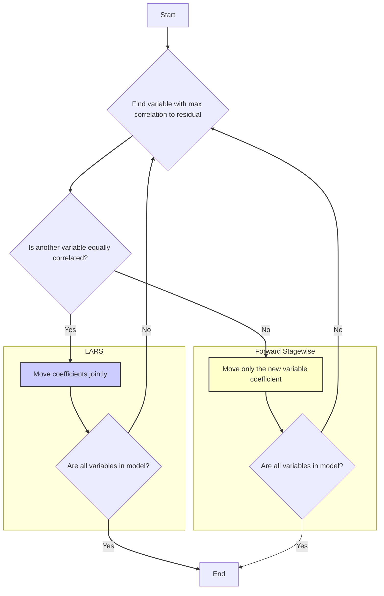
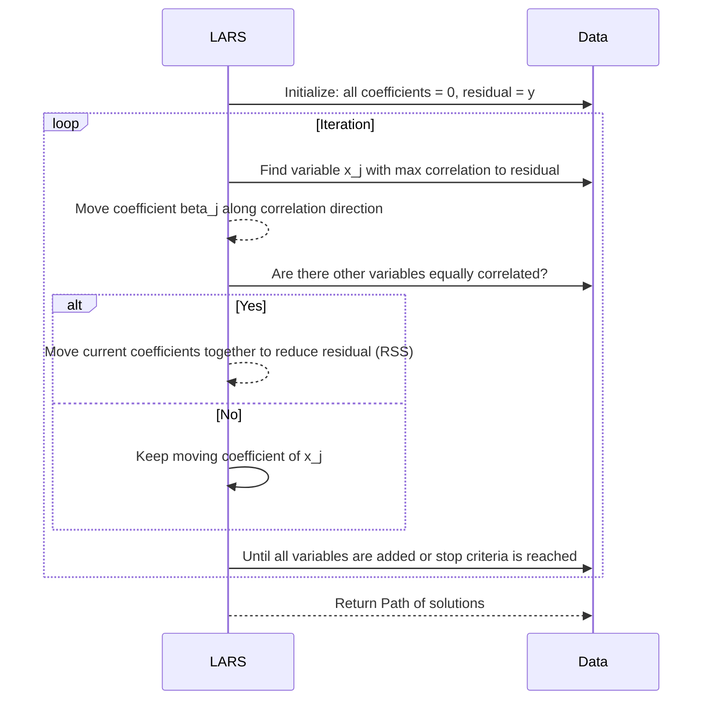
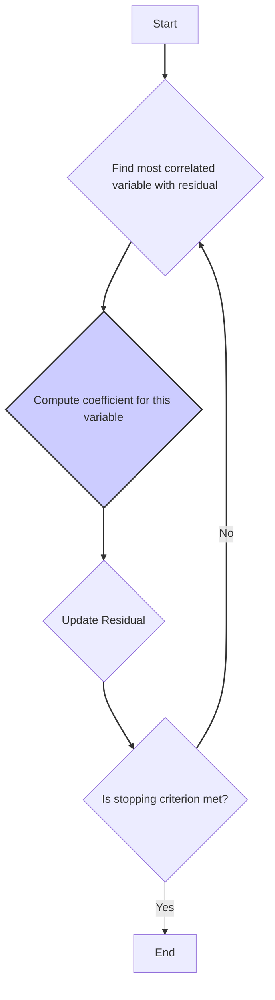

## Path Algorithms em Regressão Linear: LARS e suas Variações

### Introdução
Em modelos de regressão linear, especialmente quando se busca soluções esparsas através de métodos como o Lasso, os **path algorithms** (algoritmos de caminho) são ferramentas valiosas para explorar um espectro de soluções ao longo de diferentes níveis de regularização. Em vez de encontrar apenas uma solução ótima para um valor fixo do parâmetro de regularização, esses algoritmos traçam todo o caminho de soluções possíveis para diferentes valores do parâmetro, oferecendo uma visão detalhada de como o modelo se comporta em diferentes níveis de complexidade [^30].

Este capítulo explorará o algoritmo **Least Angle Regression (LARS)** e suas variações, que computam eficientemente as trajetórias de soluções para modelos regularizados, como o Lasso. Compreender esses algoritmos é fundamental para explorar e analisar modelos que envolvem seleção de variáveis e para realizar o ajuste do nível de *sparsity* desejado para cada aplicação [^31].

### Conceitos Fundamentais

Antes de detalharmos o funcionamento do LARS e suas variações, vamos definir alguns conceitos chave.

**Conceito 1: Caminho de Soluções**
O caminho de soluções em um modelo regularizado se refere à sequência de modelos obtidos ao variar o parâmetro de regularização. Em cada valor deste parâmetro, um modelo diferente é gerado, com uma diferente configuração de coeficientes [^31].
*   O caminho de soluções é útil para entender como a regularização afeta os coeficientes do modelo e a sua complexidade.
*   Explorar o caminho de soluções permite identificar as variáveis preditoras que têm mais impacto no modelo e aquelas que são redundantes.
*   Algoritmos de caminho computam eficientemente a trajetória de soluções, sem a necessidade de recalcular todo o modelo para cada valor do parâmetro de regularização.

> 💡 **Exemplo Numérico:**
> Imagine que estamos modelando o preço de casas usando duas variáveis preditoras: área (em metros quadrados) e número de quartos. Ao aplicar a regularização Lasso e variar o parâmetro $\lambda$, o caminho de soluções poderia mostrar que, para valores altos de $\lambda$, ambos os coeficientes são levados a zero. À medida que $\lambda$ diminui, o coeficiente da área começa a crescer primeiro, indicando que é um preditor mais forte, enquanto o coeficiente do número de quartos só começa a crescer para valores menores de $\lambda$. Isso nos ajuda a entender a importância relativa de cada variável na predição do preço das casas.

> ⚠️ **Nota Importante**: O conceito de caminho de soluções permite uma análise mais abrangente da regularização, revelando o trade-off entre a complexidade do modelo e a sua capacidade de ajuste [^30].

**Conceito 2: Forward Stepwise Regression e suas limitações**
O Forward Stepwise Regression (FSR) é um algoritmo iterativo para seleção de variáveis que começa com um modelo sem nenhuma variável preditora e, em cada passo, adiciona a variável que mais reduz o erro quadrático médio (RSS) do modelo [^15]. O FSR tem uma natureza "gulosa", uma vez que, a cada passo, seleciona a variável que parece mais promissora no momento, sem levar em consideração as variáveis futuras.
*   O Forward Stepwise Regression tem baixo custo computacional, mas pode perder soluções ótimas, já que ele não revisita as escolhas feitas em etapas anteriores [^15].
*   Ele também pode gerar modelos instáveis na presença de variáveis altamente correlacionadas.
*   O Forward Stepwise Regression gera um caminho de modelos, indexado pelo número de variáveis selecionadas, similar ao que é gerado pelos métodos de regularização [^16].

> 💡 **Exemplo Numérico:**
> Suponha que temos três variáveis preditoras: $x_1$, $x_2$ e $x_3$. O FSR primeiro avalia qual delas tem a maior correlação com a variável resposta $y$. Se $x_1$ for a mais correlacionada, ele a adiciona ao modelo. No próximo passo, ele avalia qual das variáveis restantes ($x_2$ ou $x_3$) tem a maior correlação com o resíduo atual (a diferença entre $y$ e as predições feitas usando $x_1$). Se $x_2$ for a mais correlacionada, ele a adiciona ao modelo, e assim por diante. Se $x_1$ e $x_2$ forem altamente correlacionadas entre si, o FSR pode adicionar $x_1$ primeiro e depois $x_2$, mesmo que a combinação de $x_1$ e $x_3$ fosse uma opção melhor, ilustrando sua natureza "gulosa".

> ❗ **Ponto de Atenção**:  O Forward Stepwise Regression é um método simples para seleção de variáveis, mas sua natureza "gulosa" pode impedir a obtenção de resultados ótimos [^16].
**Conceito 3: Algoritmos de Caminho**
Algoritmos de caminho, ou *path algorithms*, são procedimentos que computam, eficientemente, as soluções de um modelo regularizado em uma sequência de valores para o parâmetro de regularização. Esses algoritmos são otimizados para explorar eficientemente o caminho de soluções, evitando o recálculo do modelo para cada valor individual do parâmetro [^30].
*   Algoritmos de caminho são importantes em problemas de *sparsity* pois eles permitem rastrear o comportamento dos coeficientes e identificar quando as variáveis se tornam irrelevantes (ou seja, seus coeficientes são levados a zero) [^31].
*   Eles permitem obter uma visão completa do comportamento do modelo em função da intensidade da regularização.
*   Um exemplo importante de algoritmo de caminho é o LARS (Least Angle Regression) [^30].

> 💡 **Exemplo Numérico:**
> Em vez de treinar modelos Lasso separadamente para $\lambda$ = 0.1, 0.2, 0.3, etc., um algoritmo de caminho como o LARS calcula o caminho de soluções, que nos mostra como os coeficientes mudam continuamente à medida que $\lambda$ diminui. Isso é muito mais eficiente do que treinar vários modelos independentemente.

> ✔️ **Destaque**: Algoritmos de caminho computam o caminho de soluções eficientemente, revelando como os coeficientes do modelo se comportam à medida que variamos a intensidade da regularização.

### Least Angle Regression (LARS)

O algoritmo **Least Angle Regression (LARS)** é um método iterativo para computar o caminho completo de soluções do Lasso, ou seja, uma sequência de modelos com diferentes níveis de *sparsity* ao longo de diferentes valores de $\lambda$ [^31]. O LARS, ao contrário do Forward Stepwise Regression, realiza as atualizações dos coeficientes de maneira incremental, e não de forma abrupta [^60].

O algoritmo LARS começa com todos os coeficientes do modelo iguais a zero e, iterativamente, adiciona variáveis ao modelo, seguindo os seguintes passos [^32]:
1.  Identifica a variável preditora $x_j$ que está mais correlacionada com o resíduo atual. Ou seja, encontra o índice $j$ que maximiza a correlação:
    $$
    j = \arg \max_{i} |x_i^T r|.
    $$
2.   Move o coeficiente $\beta_j$ (da variável $x_j$) na direção do sinal dessa correlação, até que outra variável preditora ($x_k$) se torne igualmente correlacionada com o resíduo. Formalmente, o coeficiente é atualizado de forma incremental $\beta_j := \beta_j + \alpha \, sign(x_j^Tr)$.
3.  Move os coeficientes das variáveis selecionadas ($x_j$ e $x_k$) de forma conjunta, na direção que minimiza o resíduo (RSS), até que uma nova variável preditora se torne igualmente correlacionada com o resíduo.
4.  O algoritmo prossegue dessa forma, adicionando variáveis ao modelo e movendo seus coeficientes em conjunto, até que todas as variáveis tenham sido adicionadas ou a condição de parada (correlação nula) seja satisfeita.

Uma característica fundamental do LARS é que as variáveis são incluídas ao modelo de forma gradual, e os seus coeficientes são movidos em conjunto, o que é distinto de um método guloso como o Forward Stepwise. O algoritmo LARS também permite uma interpretação geométrica que demonstra que ele sempre move os coeficientes na direção que mantém as variáveis selecionadas igualmente correlacionadas com o resíduo [^32].

> 💡 **Exemplo Numérico:**
> Vamos considerar um exemplo com três variáveis preditoras ($x_1$, $x_2$, e $x_3$) e uma variável resposta $y$. Inicialmente, todos os coeficientes são zero, e o resíduo é $r = y$.
>
> **Passo 1:** Suponha que $x_1$ tenha a maior correlação com $r$. Então, $\beta_1$ começa a crescer na direção do sinal da correlação.
>
> **Passo 2:** À medida que $\beta_1$ cresce, a correlação de $x_1$ com o resíduo diminui. Suponha que, em algum ponto, a correlação de $x_2$ com o resíduo se iguale à de $x_1$.
>
> **Passo 3:** Agora, LARS move $\beta_1$ e $\beta_2$ juntos, de forma que ambas as variáveis permaneçam igualmente correlacionadas com o resíduo.
>
> **Passo 4:** Se em algum momento, a correlação de $x_3$ com o resíduo se iguala a de $x_1$ e $x_2$, os três coeficientes são movidos juntos, e assim por diante.
>
> Este processo continua até que todas as variáveis tenham sido adicionadas ao modelo ou a condição de parada seja alcançada.

**Lemma 1:** O algoritmo LARS gera o caminho de soluções do LASSO movendo os coeficientes de forma incremental, de modo que a correlação das variáveis selecionadas com o resíduo seja igual em cada etapa do algoritmo [^36].
**Prova do Lemma 1:** Durante o algoritmo LARS, a direção dos coeficientes é escolhida para manter as variáveis preditoras no conjunto ativo igualmente correlacionadas com o resíduo atual. Formalmente, o movimento dos coeficientes segue uma direção $\delta = (X_A^T X_A)^{-1} X_A^T r$, que é a direção que faz com que o resíduo se torne ortogonal as variáveis selecionadas. $\blacksquare$

**Corolário 1:** O algoritmo LARS fornece um caminho completo de soluções para a regressão Lasso, onde cada ponto do caminho corresponde a uma solução diferente do Lasso, conforme o parâmetro de regularização $\lambda$ é variado. Ao longo do caminho, os coeficientes são movidos de forma gradual e novas variáveis são incluídas no modelo [^38].

O algoritmo LARS possui uma conexão direta com o problema do LASSO [^31]. As soluções computadas através do algoritmo LARS correspondem às soluções ótimas do problema LASSO para valores específicos do parâmetro de regularização $\lambda$. O algoritmo fornece o caminho completo das soluções do LASSO sem a necessidade de resolver o problema de otimização para cada valor de $\lambda$. O método LARS também é um método eficiente para identificar o ponto em que os coeficientes do Lasso atingem o valor zero, o que não é direto na definição da penalidade L1 [^32].

> 💡 **Exemplo Numérico:**
> Suponha que, ao aplicar o LARS, a primeira variável a entrar no modelo seja $x_1$, com um coeficiente $\beta_1$ que cresce até um certo ponto. Depois, $x_2$ entra e $\beta_1$ e $\beta_2$ crescem juntos. Em algum ponto, $\beta_2$ atinge zero, o que significa que, para um certo valor de $\lambda$, $x_2$ deixa de ser relevante. O LARS nos mostra exatamente em qual valor de $\lambda$ isso acontece, permitindo que selecionemos o modelo LASSO com a complexidade desejada.

### Variações do LARS: Forward Stagewise Regression

O **Forward Stagewise Regression (FS)** é uma versão ainda mais restrita do Forward Stepwise [^59]. Ele também começa com um modelo sem variáveis e adiciona uma variável preditora por vez, baseando-se na maior correlação com o resíduo, como no LARS [^60].
A diferença crucial entre o LARS e o Forward Stagewise é que no LARS os coeficientes das variáveis são movidos em conjunto, enquanto no Forward Stagewise apenas o coeficiente da variável recém-selecionada é movido, enquanto os outros coeficientes são mantidos fixos em sua iteração anterior [^60]. Este comportamento mais cauteloso e incremental no Forward Stagewise o torna menos eficiente do que o LARS, necessitando de um maior número de iterações para atingir o mesmo nível de ajuste aos dados [^60].

De maneira mais formal, o Forward Stagewise Regression pode ser descrito como [^60]:
1.  Começa com um modelo com todos os coeficientes iguais a zero e um resíduo igual a y - y.
2.  Encontra a variável preditora mais correlacionada com o resíduo atual.
3.  Calcula o coeficiente da variável escolhida através de uma regressão linear simples do resíduo sobre a variável escolhida.
4. Atualiza o resíduo de acordo com o novo coeficiente.
5. Repete os passos 2-4 até atingir a condição de parada.

Em comparação com o LARS, o Forward Stagewise é um procedimento mais lento, pois ele ajusta apenas um coeficiente por vez, e o processo de busca pelas variáveis mais correlacionadas com o resíduo atual precisa ser repetido em cada iteração, sem levar em consideração a informação obtida nas iterações anteriores [^32]. No entanto, o Forward Stagewise também possui uma propriedade importante: ele gera um caminho de soluções que se aproxima da solução de mínimos quadrados de maneira gradual, o que pode ser interessante em situações com muitas variáveis preditoras [^60].
*  A principal diferença entre LARS e Forward Stagewise é que o LARS move o coeficiente e a direção de busca de forma conjunta, enquanto o Forward Stagewise só move o coeficiente da variável recém adicionada [^59].
* A inclusão de uma variável no Forward Stagewise não considera, a influência das outras variáveis selecionadas nas iterações anteriores. Isto o torna computacionalmente mais simples, mas menos eficiente na escolha da melhor direção de busca [^32].

> 💡 **Exemplo Numérico:**
> Consideremos novamente as variáveis $x_1$, $x_2$ e $x_3$.
>
> **Passo 1:** O FS encontra a variável mais correlacionada com o resíduo inicial (digamos, $x_1$) e calcula seu coeficiente $\beta_1$ por regressão linear simples.
>
> **Passo 2:** O resíduo é atualizado, mas o FS mantém $\beta_1$ fixo. Ele então encontra a próxima variável mais correlacionada com o novo resíduo (digamos, $x_2$) e calcula seu coeficiente $\beta_2$.
>
> **Passo 3:** O processo continua, adicionando uma variável e ajustando apenas seu coeficiente a cada passo, sem ajustar os coeficientes de variáveis previamente adicionadas.
>
> Este processo é mais lento porque não ajusta todos os coeficientes em conjunto, mas pode ser mais estável em algumas situações.

> ⚠️ **Ponto Crucial**: O Forward Stagewise Regression é menos eficiente do que o LARS, já que cada etapa ajusta apenas uma variável, levando a um caminho de solução mais lento, mas também mais cauteloso e menos propenso a sobreajuste [^60].

**Lemma 2**: O Forward Stagewise Regression converge para a solução de mínimos quadrados, mas o faz por meio de etapas incrementais e em número de iterações que podem ser muito maiores do que o número de variáveis preditoras [^60].
**Prova do Lemma 2:** Na abordagem Forward Stagewise, os coeficientes são atualizados de forma incremental, o que garante a convergência ao ótimo. No entanto, as variáveis são movidas em etapas isoladas. A cada etapa, somente o coeficiente da variável mais correlacionada com o resíduo é movido, o que pode levar a uma convergência mais lenta em direção à solução de mínimos quadrados [^60]. $\blacksquare$

**Corolário 2:** Embora menos eficiente computacionalmente, o Forward Stagewise Regression pode ser útil em situações em que a suavidade e a controlabilidade da trajetória de soluções são mais importantes que a velocidade da convergência, ou em problemas de alta dimensionalidade [^60].

### Pergunta Teórica Avançada (Exemplo): Como a conexão entre LARS e LASSO é explorada na prática para otimização e seleção de modelos?
**Resposta:**

A conexão entre o algoritmo LARS e o problema de otimização do LASSO é fundamental para a compreensão da sua importância prática. O LARS [^31], não é um algoritmo de otimização direta para o LASSO; ele não encontra a solução para um valor específico de $\lambda$. Em vez disso, o LARS calcula o caminho completo de soluções para o LASSO, ou seja, encontra um conjunto de modelos que correspondem a diferentes valores de $\lambda$.

Na prática, o LARS permite uma exploração eficiente e completa do espaço de parâmetros do LASSO. Este caminho de soluções, calculado pelo algoritmo LARS, permite selecionar o valor de $\lambda$ que fornece o modelo com o melhor desempenho preditivo através de *cross-validation* ou outros critérios [^60]. Ou seja, usando o LARS computamos todo o conjunto de modelos correspondente a diferentes valores de lambda e depois escolhemos aquele com melhor performance. O LARS não computa o valor correto de $\lambda$ que otimiza o modelo para cada situação.

Além disso, a eficiência computacional do algoritmo LARS permite que ele seja usado na prática para problemas de alta dimensionalidade [^60]. A combinação de LARS e métodos de avaliação como o *cross-validation* oferece uma forma robusta para seleção de variáveis, ao mesmo tempo em que explora o tradeoff entre bias e variância.
*   O LARS não apenas calcula a solução para um determinado $\lambda$, mas também oferece um caminho completo de soluções para todos os valores possíveis de $\lambda$.

* A conexão com o LASSO torna o LARS útil para problemas que exigem soluções esparsas e a identificação das variáveis mais relevantes.

* O caminho de soluções permite ao praticante avaliar a sensibilidade do modelo a diferentes intensidades de regularização.

> 💡 **Exemplo Numérico:**
> Suponha que aplicamos o LARS em um conjunto de dados e obtemos o caminho de soluções. Para cada ponto nesse caminho (que corresponde a um valor diferente de $\lambda$), podemos calcular o erro de validação cruzada. Podemos então selecionar o valor de $\lambda$ que minimiza o erro de validação cruzada, que nos dará um modelo LASSO com bom desempenho de generalização. O LARS torna essa busca muito mais eficiente, pois calcula todos os modelos ao longo do caminho em vez de treinar modelos Lasso separados para cada valor de $\lambda$.

**Lemma 3:** O algoritmo LARS, por produzir o caminho de soluções do LASSO, permite uma seleção do parâmetro $\lambda$  e a exploração do tradeoff bias-variância através de métodos como *cross-validation*
**Prova do Lemma 3:** O algoritmo LARS produz uma sequência de modelos Lasso para diferentes valores do parâmetro de regularização $\lambda$, a partir do conhecimento das correlações entre as variáveis preditoras e o resíduo. Estes modelos variam em sua complexidade (número de coeficientes não zero), o que permite avaliar e comparar seu desempenho através de métricas como o MSE (erro quadrático médio). Através da *cross-validation*, o desempenho desses modelos é estimado em conjuntos de dados não usados para treinamento, o que permite determinar o valor de $\lambda$ (e, portanto, o modelo) que fornece melhor generalização, e também balanceamento entre *bias* e variância. $\blacksquare$

**Corolário 3:**  A eficiência do LARS permite selecionar o modelo adequado em um amplo conjunto de modelos obtidos pela variação do parâmetro de regularização, explorando o tradeoff entre ajuste aos dados e complexidade do modelo [^60].
