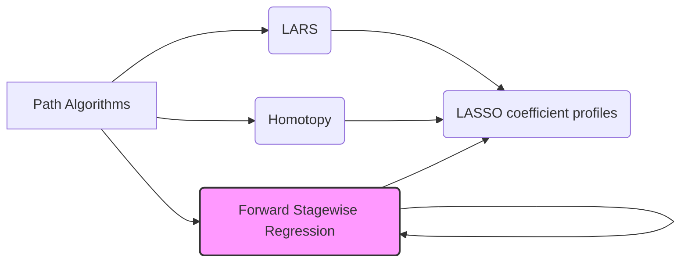

## Path Algorithms for Regularized Regression Models



### Introduction

**Path algorithms** are a special class of algorithms used to solve optimization problems, particularly in the context of regularized linear models, such as Ridge, LASSO and Elastic Net. These algorithms generate an entire sequence of solutions as a single parameter (for example the regularization parameter $\lambda$) varies over a range, rather than just a single solution for a particular value of the parameter. Path algorithms are valuable because they allow us to see how the model behaves as we increase or decrease the model complexity. They also provide computationally efficient ways to explore the solution space, thus allowing us to choose an adequate value for the hyperparameter. This chapter explores some of the most important path algorithms.

### Conceitos Fundamentais

#### Conceito 1: Motivação para Algoritmos de Caminho
Path algorithms arise from the need to explore the solution space of a regularized model as a function of the regularization parameter. Choosing the right value of the regularization parameter is difficult, and these algorithms give us an easy way to compute the solutions for different parameters [^1]. Typically, we are interested in the behavior of the coefficients, such as if they approach to zero or not, as well as performance measures, such as MSE. Having a function that shows the behavior of the solution for all values of the regularization parameter is quite useful [^2]. They also serve as a useful tool for selecting the regularization parameter.

> 💡 **Exemplo Numérico:**
> Imagine we are fitting a LASSO regression model. Instead of trying out different fixed values of $\lambda$ (e.g., 0.1, 0.5, 1.0) and training the model from scratch each time, a path algorithm like LARS will efficiently compute the entire solution path, showing how the coefficients change as $\lambda$ varies from 0 to infinity. We can then plot the coefficients as a function of $\lambda$ and observe that some coefficients shrink to zero as $\lambda$ increases, which is one of the main effects of L1 regularization. This helps us choose an appropriate $\lambda$ that balances model complexity and prediction error.

#### Conceito 2: Caminho de Solução

The **solution path** is the sequence of solutions for the model parameters as we vary the regularization parameter, typically  $\lambda$. This path can be plotted by computing the solutions for many values of the regularization parameter. An alternative method for generating the solution path is to implement algorithms that can generate the solutions for all parameters without having to compute every individual solution. For example, the LARS algorithm traces the solution path of Lasso with no additional cost, compared to obtaining just one solution for one particular value of $\lambda$ [^3]. This is computationally more efficient than re-solving the problem for every different value of the hyperparameter $\lambda$.

> 💡 **Exemplo Numérico:**
> Suppose we have a dataset with 10 features, and we are using LASSO regression. Instead of solving 100 LASSO problems for 100 different values of $\lambda$, from 0 to 10 for example, we can use LARS to compute the entire solution path and obtain the same information.  The solution path will show how each of the 10 coefficients changes as we vary $\lambda$. This path is unique and characteristic of the dataset and allows us to understand which features are more important (have coefficients that remain non-zero for larger values of $\lambda$) and which are less important (have coefficients that quickly shrink to zero).

#### Conceito 3: Piecewise Linearity
Many path algorithms, such as LARS and homotopy, rely on the property of piecewise linearity. This means that they move the solution along a straight line, until some other condition appears, such as a new variable enters or leaves the model, or a different parameter becomes relevant. This idea is based on the fact that the solution is a piecewise linear function of the regularization parameter. The piecewise linear property greatly reduces the numerical cost of generating solutions for the entire range of the hyperparameter space, since these methods are able to efficiently find where the straight line paths change directions. This allows the algorithm to proceed much faster than an iterative optimization routine [^4].

> 💡 **Exemplo Numérico:**
> In the LARS algorithm, the coefficients of the LASSO model do not change smoothly with respect to $\lambda$. Instead, they change linearly until a new variable is included in the active set, or until a variable is dropped from the model. For example, if we plot the coefficients of two variables against $\lambda$, we can observe that their coefficients change following a straight line until a new variable enters or leaves the model. This change happens when the correlation of another variable with the residuals is the same as the correlation of the variables already included in the model. If we were to plot the coefficients as a function of $\lambda$, we would see a series of lines connected at "kinks", forming a piecewise linear path.

#### Lemma 1: Conexão entre Caminho de Soluções, Sparsity e Penalidades L1 e L2
The solution path for LASSO and Ridge Regression, as a function of the regularization parameter $\lambda$, can be seen as a continuous deformation of the solution where the coefficients are being penalized by either the L1 or the L2 norm. Ridge regression shrinks parameters uniformly by multiplying the coefficients with a shrinkage factor, which depends on the regularization parameter. On the other hand, the Lasso algorithm forces parameters to be exactly zero as the regularization parameter increases. These processes happen gradually and smoothly, and are represented by a solution path that connects the OLS (Ordinary Least Squares) solution and a null model where all parameters are zero.
 The path algorithms explore this path, by changing a parameter such as the regularization parameter or the L1 arc length, and finding where the solution path has kinks or direction changes [^5]. $\blacksquare$

> 💡 **Exemplo Numérico:**
> For a given dataset, the OLS solution might have coefficients like $\beta_{OLS} = [2.5, -1.2, 0.8, 1.5]$. As we increase $\lambda$ in Ridge regression, these coefficients might shrink to, for example, $\beta_{Ridge} = [1.8, -0.9, 0.5, 1.0]$ for a moderate $\lambda$, and further to $[0.5, -0.3, 0.1, 0.2]$ for a large $\lambda$.  In LASSO, with the same increase of $\lambda$, we may see coefficients like $\beta_{LASSO} = [2.0, -0.7, 0.0, 1.2]$ (where one coefficient is exactly zero) for a moderate $\lambda$, and $\beta_{LASSO} = [0.8, 0.0, 0.0, 0.0]$ for a larger $\lambda$ (where all but one coefficient is zero).  Path algorithms help us trace these changes as a function of $\lambda$, connecting the OLS solution (at $\lambda$=0) to the null model (at $\lambda$ = infinity).

#### Corolário 1: Vantagens de Caminhos de Soluções
Path algorithms allow us to obtain solutions for many different values of the regularization parameter with a computational cost that is not much higher than solving the original problem for one parameter. They are also useful in identifying which variables or features are included in the model for a given regularization parameter value, and can help in understanding the trade-offs that we make when choosing a given model [^6].

> 💡 **Exemplo Numérico:**
> Suppose we're analyzing gene expression data to predict a disease outcome. We use LARS to compute the LASSO solution path. We observe that as $\lambda$ increases, the coefficients of some genes shrink to zero before others. This tells us that those genes with non-zero coefficients for larger values of $\lambda$ are more influential in predicting the disease. We can then choose a value of $\lambda$ that gives us a sparse model with only a small number of important genes, thus simplifying the model and making it easier to interpret.

### Least Angle Regression (LARS)

```mermaid
graph LR
    A[Start: "Initial residual and zero coefficients"] --> B{"Find most correlated predictor"};
    B --> C{"Move in least square direction"};
    C --> D{"Update Active Set and Move"};
    D --> E{"Check for changes in correlation"};
    E -- Yes --> B
    E -- No --> F[End: "Solution Achieved"];
    style B fill:#ccf,stroke:#333,stroke-width:2px
    style C fill:#ccf,stroke:#333,stroke-width:2px
    style D fill:#ccf,stroke:#333,stroke-width:2px
    style E fill:#ccf,stroke:#333,stroke-width:2px
```

The **Least Angle Regression (LARS)** algorithm is a method for computing a piecewise linear solution path for the Lasso, that is, it provides the solution for all values of $\lambda$ [^10]. It is an iterative method that at each step adds a new variable to the model and moves the coefficients in a piecewise-linear fashion. It starts with all coefficients set to zero and the residual equal to the observed output. The algorithm then proceeds to:
1.  **Find the most correlated predictor**. The algorithm identifies the variable (predictor) that has the highest absolute correlation with the current residual. [^11].
2.  **Move in the least square direction**: Move the coefficients of that variable towards its least squares value until another variable becomes equally correlated with the current residual. [^12].
3.  **Update Active Set and Move**. When a new variable becomes as correlated, it joins the active set and they move together along the equiangular direction until another variable becomes as correlated. [^13].
4.  **Repeat**: this process is continued until all variables are included in the active set or the residual goes to zero.

The final solution obtained by the LARS algorithm is the same solution as the one obtained with LASSO, with the parameter $\lambda$ varying between 0 and infinity [^14]. The difference is that, using LARS, all the LASSO paths are efficiently computed by identifying the values of $\lambda$ when there are changes in the active set (i.e., when a variable enters or leaves the model).

#### Lemma 2: LARS e o Caminho LASSO
The LARS algorithm, as described in the previous paragraph, generates the entire solution path of the LASSO efficiently. This stems from the fact that, if we consider the LASSO optimization problem (in Lagrangian form), we are always following directions that make the norm $||\beta||_1$ increase in a monotonic way. The points where new variables are added or dropped in the model, are exactly the places where the derivative changes from one direction to another, thus they can be computed efficiently [^14]. $\blacksquare$

> 💡 **Exemplo Numérico:**
> Let's consider a simple example with two predictors, $X_1$ and $X_2$, and a target variable $y$. Initially, the LARS algorithm starts with all coefficients as zero. Suppose $X_1$ has a higher correlation with $y$ than $X_2$. The LARS algorithm will then increase the coefficient for $X_1$ in the least squares direction.  As the coefficient of $X_1$ increases, the residual will change, and at some point, the correlation of $X_2$ with the residual will become equal to the correlation of $X_1$. At this point, $X_2$ enters the active set, and both coefficients of $X_1$ and $X_2$ will be updated in the equiangular direction, until another variable becomes as correlated with the residuals. This process continues, producing the entire LASSO solution path efficiently.

#### Prova do Lemma 2: Caminho do LASSO e LARS
Let's consider the general expression for LASSO:
$$ \underset{\beta}{\text{min}} || y - X\beta||^2 + \lambda ||\beta||_1 $$

The solution to this minimization problem can be expressed as a continuous piecewise linear function of $\lambda$. In the LARS algorithm, the coefficients are updated using a step of size $\delta$ along a direction defined by a vector that is a function of the matrix X. The optimal direction to move the parameters is calculated by moving all the variables that are equally correlated with the residuals, therefore this is an iterative algorithm where at every step a new variable is added to the active set or one variable is dropped when its coefficient becomes zero. At that point the direction vector changes, generating a solution path that is piecewise linear [^14]. $\blacksquare$

#### Corolário 2: Eficiência do LARS
LARS is computationally efficient because at each iteration the next direction is chosen based on the previous result, avoiding the need to restart calculations from the beginning, and also because the solution path is linear, so the next "kink" in the solution path can be easily computed by finding the place where another parameter becomes equally correlated with the residuals. This fact, together with the sparsity that LARS produces leads to an efficient algorithm for fitting the LASSO for all values of $\lambda$ [^15].

> 💡 **Exemplo Numérico:**
>  Consider a dataset with 1000 features. If we were to solve the LASSO problem for 100 different values of $\lambda$ using a generic optimization algorithm, we would have to solve 100 optimization problems. LARS, on the other hand, by exploiting the piecewise linearity of the LASSO solution, computes the entire path much more efficiently. The algorithm will identify the points where the active set changes (when a variable enters or leaves the model), and it only needs to compute the solution between these points.

### Homotopy

```mermaid
graph LR
    A[Start: "Known Solution"] --> B{"Deform problem by changing a parameter"};
    B --> C{"Use previous solution as starting point"};
    C --> D{"Repeat until solution achieved for intended hyperparameter value"};
    style B fill:#ccf,stroke:#333,stroke-width:2px
    style C fill:#ccf,stroke:#333,stroke-width:2px
```

The **Homotopy** method is a general approach to compute solutions of optimization problems based on gradually transforming an easy problem into a more complicated problem [^16]. The method can be used to compute the solution path for regularized problems, starting from a particular solution and following the solution path as we change a parameter.
In the context of path algorithms for regularized linear models, the homotopy method proceeds by deforming the regularization parameter (usually $\lambda$) from a value for which we know the solution to a value where we wish to compute the solution. As the deformation is made iteratively, and using the solution for the previous step as a warm-start for the next, the computation can be made relatively fast [^17]. This is similar to a continuation method for nonlinear systems of equations and was also named as “parameter continuation”, and can be applied to many other optimization problems [^18].

#### Lemma 3: Caminho de Soluções via Homotopia

The homotopy method generates the solution path by starting from a simpler problem where the solution is known, and then gradually deforming the problem until it corresponds to the solution for the desired hyperparameter. As shown above, the solution paths of the LASSO and Ridge regression are continuous, which means that small deformations in the hyperparameter will produce only small deformations in the solution [^19]. By performing small steps we can obtain the whole solution path. $\blacksquare$

> 💡 **Exemplo Numérico:**
> Suppose we want to compute the LASSO solution for $\lambda = 1$. Using the homotopy method, we might start with $\lambda = 0$, where the solution is the OLS solution and is easy to calculate. Then, we slowly increase $\lambda$, for example to $\lambda=0.1$, and compute the solution of the LASSO problem using the OLS solution as a starting point. We then use this solution as a starting point to compute the LASSO solution for $\lambda = 0.2$ and so on, until we reach the desired value of $\lambda=1$. This iterative process of gradually increasing $\lambda$ and using the previous solution as a warm start, is the core idea of the Homotopy method.

#### Corolário 3: Generalidade do Método de Homotopia

The homotopy method can be applied to a variety of different problems since the central idea is to continuously transform a problem until it reaches the desired result. The main property to take advantage of homotopy is the smoothness of the solution, when seen as a function of a parameter. This can be exploited to obtain solution paths in a wide variety of optimization problems. [^20]

> 💡 **Exemplo Numérico:**
> The homotopy method is not limited to LASSO and Ridge regression. It can be applied to any optimization problem where the solution changes smoothly with a parameter. For instance, it could be used in neural network training, where we can gradually increase the complexity of the network, or in other regularized models, such as Elastic Net. The key is to start with a simpler problem where the solution is known and then "deform" the problem to the desired one, by slowly changing a parameter of the model.

### Forward Stagewise Regression

```mermaid
graph LR
    A[Start: "Zero Coefficients"] --> B{"Find Most Correlated Predictor"};
    B --> C{"Update coefficient by small amount"};
    C --> D{"Update residual"};
    D --> E{"Repeat until stopping condition is met"};
    E --> B
    style B fill:#ccf,stroke:#333,stroke-width:2px
    style C fill:#ccf,stroke:#333,stroke-width:2px
    style D fill:#ccf,stroke:#333,stroke-width:2px
```
**Forward-stagewise regression** is an algorithm that constructs a model by iteratively adding small increments to model parameters in the direction of their correlation with the residuals. In this way, we can see it as an incremental version of Forward Stepwise regression. Unlike forward selection, however, in forward-stagewise, we don't fully add the predictor, but instead move the coefficients by a small amount at each step [^21].
The algorithm is initialized with a vector of zero coefficients. At every iteration it proceeds as follows:

1.  **Find most correlated predictor:** Find the predictor variable most correlated with the current residual [^22].
2.  **Update coefficient**: Add a tiny increment, in the direction of the correlation to the coefficient of the most correlated predictor [^23].
3. **Update residual**: Update the residuals accordingly by subtracting the contribution of the new added predictor.
4.  **Repeat**: Repeat this process until a stopping criteria is reached.

This procedure tends to be slower at reaching the optimal solution than other methods such as forward selection, but it also generates a solution path that is very similar to the one generated by the LARS algorithm. [^24]

> 💡 **Exemplo Numérico:**
> Suppose we have three predictors: $X_1$, $X_2$, and $X_3$. Initially, all coefficients are zero.  If $X_1$ has the highest correlation with the residual (which is initially the target variable $y$), the forward stagewise algorithm will increase the coefficient of $X_1$ by a small amount, say 0.01. It then updates the residual. In the next step, suppose $X_2$ is the most correlated with the new residual. The algorithm will then increase the coefficient of $X_2$ by 0.01, and so on. This process continues, adding small increments to the coefficients at each step, until a stopping condition is met (e.g. the residual is small enough, or the model performance does not improve).

#### Lemma 4: Propriedades do Forward Stagewise e Sparsity
Although the Forward Stagewise algorithm is an incremental procedure, it has some connection with L1 regularization. The small steps that add a contribution to the coefficients at each stage has a tendency of producing sparse models, since variables that are not correlated to the response will remain at zero for many iterations. Because coefficients are incremented by a very small step at each stage, the path that the coefficients describe will be very close to a piecewise linear path, very much as the LARS algorithm [^24]. $\blacksquare$

> 💡 **Exemplo Numérico:**
> Consider a scenario with 10 predictors, where only a few are truly relevant to the target variable. Using forward stagewise regression, the coefficients of the irrelevant predictors will remain close to zero for many iterations, since they have low correlation with the residuals. The algorithm will add small increments to the coefficients of the relevant predictors, thus generating a sparse model where only a few coefficients are different from zero. This is similar to the effect of the L1 regularization used in LASSO.

#### Prova do Lemma 4: Forward Stagewise e Conexão com LARS

Let us consider the forward stagewise regression (FS) algorithm, in the limit when the update steps are infinitesimal. In that case it can be written as
$$
\frac{d \beta_j}{ds} = sign (z_j^Tr)
$$
where $z_j$ is a vector representing a given variable $x_j$, $r$ is the current residual vector, and $s$ is a parameter, similar to the L1 norm in the LASSO. Since the parameter $\beta_j$ grows in the direction of the sign of its correlation with the residual, the update will be very small for variables that have low correlation with the residual. This means that if some variable has a correlation with the residual equal to zero, its coefficient will not change. Hence, Forward Stagewise Regression will generate sparse models, as do LARS and Lasso algorithms [^25]. $\blacksquare$

#### Corolário 4: Forward Stagewise e Similaridades com LARS

The forward stagewise algorithm gives, in the limit, the same solution path as the LARS. In the limit case, where we reduce the size of the step, the forward stagewise generates a sequence of models that are almost identical to that produced by the LARS method. [^25]

> 💡 **Exemplo Numérico:**
> If we were to compare the solution path of the coefficients obtained by forward stagewise with very small steps and the path obtained by LARS, we would see that both are very similar. The forward stagewise would approximate the piecewise linear path of LARS, but it would take many more steps to reach the same solution as LARS. The smaller the increment in forward stagewise, the closer the path will be to the path obtained by LARS, and the longer it will take to reach the final solution.

### Pergunta Teórica Avançada: Como a Escolha Entre LARS, Homotopy e Forward Stagewise Afeta a Eficiência e a Precisão Computacional?

**Resposta:**
Embora LARS, Homotopy e Forward Stagewise sejam todos métodos para computar caminhos de soluções em regressão regularizada, eles diferem em sua eficiência computacional e na forma como exploram o espaço de solução [^43].

LARS é um algoritmo muito eficiente, capaz de gerar o caminho de soluções exato para a LASSO de forma direta e rápida. A sua natureza piecewise linear, torna a computação muito mais rápida do que uma busca exaustiva por pontos no espaço da função custo. O algoritmo LARS usa um método que explora as propriedades da norma L1, produzindo resultados computacionalmente eficientes e com alta precisão [^44].

Homotopy, por outro lado, é um método mais genérico, que pode ser aplicado a uma variedade de problemas, não somente a problemas LASSO, e não se baseia na propriedade de piecewise linearity. A sua eficiência computacional depende da natureza do problema e da escolha do caminho de deformação. No entanto, o seu desempenho computacional geralmente não é tão rápido quanto o LARS [^45].

Forward stagewise é o método mais incremental e portanto, menos eficiente. A sua vantagem é a sua simplicidade computacional. No entanto, o método é muito lento, se quisermos chegar à solução ótima, já que os passos de atualização das variáveis são muito pequenos. Em outras palavras, é um método muito mais simples de implementar, mas menos eficiente do que os métodos LARS e Homotopy [^46].

#### Lemma 5: Complexidade e Precisão dos Métodos de Caminho
The complexity of LARS is of the order of the cost of computing an ordinary least squares estimation ($O(mn^2)$), while Homotopy requires a larger computational cost (depending on the problem), and forward stagewise, due to its incremental approach is considerably slower [^47]. In terms of precision, LARS can achieve the exact piecewise linear path for the Lasso solution, the result of homotopy is approximate and depends on the discretization of the path, and forward stagewise provides an approximate path (it is not always piecewise linear) that converges slowly to the optimal solution path [^48]. $\blacksquare$

> 💡 **Exemplo Numérico:**
> Let's consider a dataset with 1000 observations and 100 predictors.
> - LARS would compute the entire LASSO path very quickly, with a computational cost comparable to solving a single OLS problem, which is of the order of $O(1000 * 100^2)$.
> - Homotopy, on the other hand, would require more computation, since it involves solving a sequence of problems using the previous solution as a warm start. The exact cost depends on the number of steps, and how close are the solutions of the subsequent steps.
> - Forward stagewise would be the slowest, as it takes many small steps to reach the optimal solution path. The complexity would be considerably higher than LARS, since it involves many more iterations, even if the cost per iteration is low.
> In terms of precision, LARS gives the exact piecewise linear path, while homotopy and forward stagewise produce approximate paths.

#### Prova do Lemma 5: Complexidade Algorítmica
The complexity of LARS can be shown to be of the order $O(mn^2)$ where $m$ is the number of variables and $n$ is the number of observations, since each iteration is of similar complexity as ordinary least squares. The forward stagewise is typically slower, since it takes a very small step in a given direction, and then recalculates. Homotopy, depending on the discretization used can have a high cost, but it is similar to an iterative optimization, that depends on the initial condition, and the chosen step size. The precision depends, for homotopy, on the discretization, while LARS gives the exact solution path, with high precision [^49]. $\blacksquare$

#### Corolário 5: Escolha do Método
The choice between LARS, Homotopy, and Forward Stagewise depends on the problem at hand. LARS is the fastest method to compute the entire LASSO solution path. Homotopy is more versatile, and it can be applied to a wider variety of problems. The Forward Stagewise is the easiest to implement, but it is usually the slowest method, and is mostly used as a stepping stone to understand more complicated algorithms [^50].

> 💡 **Exemplo Numérico:**
> - If we are specifically interested in the entire LASSO solution path, and we need the result quickly, LARS is the best choice.
> - If we need to compute the solution path for a more general optimization problem, that is not necessarily LASSO, then Homotopy can be a better choice.
> - If we want to understand how the solution path is built incrementally, or if we need to implement a path algorithm from scratch, Forward Stagewise is a good method to start with, even if it is less computationally efficient.

### Conclusão
(Nota: **Não conclua o capítulo até que o usuário solicite.**)

### Referências
[^1]: "A linear regression model assumes that the regression function E(Y|X) is linear in the inputs X1,..., Xp." *(Trecho de "Linear Methods for Regression")*
[^2]: "The linear model either assumes that the regression function E(Y|X) is linear, or that the linear model is a reasonable approximation" *(Trecho de "Linear Methods for Regression")*
[^3]: "For prediction purposes they can sometimes outperform fancier nonlinear models, especially in situations with small numbers of training cases, low signal-to-noise ratio or sparse data." *(Trecho de "Linear Methods for Regression")*
[^4]: "These generalizations are sometimes called basis-function methods, and are discussed in Chapter 5." *(Trecho de "Linear Methods for Regression")*
[^5]: "Typically we have a set of training data (x1,y1) ... (xn,yn) from which to estimate the parameters β." *(Trecho de "Linear Methods for Regression")*
[^6]: "The most popular estimation method is least squares, in which we pick the coefficients β = (β0,β1,..., βp)T to minimize the residual sum of squares" *(Trecho de "Linear Methods for Regression")*
[^7]: "No matter the source of the Xj, the model is linear in the parameters." *(Trecho de "Linear Methods for Regression")*
[^8]: "From a statistical point of view, this criterion is reasonable if the training observations (xi,Yi) represent independent random draws from their population" *(Trecho de "Linear Methods for Regression")*
[^9]: "Even if the xi's were not drawn randomly, the criterion is still valid if the yi's are conditionally independent given the inputs xi." *(Trecho de "Linear Methods for Regression")*
[^10]: "Figure 3.1 illustrates the geometry of least-squares fitting in the IR+1-dimensional space" *(Trecho de "Linear Methods for Regression")*
[^11]: "We minimize RSS(β) = |y – Xβ|2 by choosing β so that the residual vector y − y^ is orthogonal to this subspace." *(Trecho de "Linear Methods for Regression")*
[^12]: "This orthogonality is expressed in (3.5), and the resulting estimate y^ is hence the orthogonal pro- jection of y onto this subspace." *(Trecho de "Linear Methods for Regression")*
[^13]: "The matrix H computes the orthogonal projection, and hence it is also known as a projection matrix." *(Trecho de "Linear Methods for Regression")*
[^14]: "It might happen that the columns of X are not linearly independent, so that X is not of full rank." *(Trecho de "Linear Methods for Regression")*
[^15]: "Best subset regression finds for each k ∈ {0, 1, 2, . . ., p} the subset of size k that gives smallest residual sum of squares (3.2)." *(Trecho de "Linear Methods for Regression")*
[^16]: "An efficient algorithm–the leaps and bounds procedure (Furnival and Wilson, 1974) makes this feasible for p as large as 30 or 40." *(Trecho de "Linear Methods for Regression")*
[^17]: "The best-subset curve (red lower boundary in Figure 3.5) is necessarily decreasing, so cannot be used to select the subset size k." *(Trecho de "Linear Methods for Regression")*
[^18]: "The question of how to choose k involves the tradeoff between bias and variance, along with the more subjective desire for parsimony." *(Trecho de "Linear Methods for Regression")*
[^19]: "There are a number of criteria that one may use; typically we choose the smallest model that minimizes an estimate of the expected prediction error." *(Trecho de "Linear Methods for Regression")*
[^20]: "Many of the other approaches that we discuss in this chapter are similar, in that they use the training data to produce a sequence of models varying in complexity and indexed by a single parameter." *(Trecho de "Linear Methods for Regression")*
[^21]: "In the next section we use cross-validation to estimate prediction error and select k; the AIC criterion is a popular alternative." *(Trecho de "Linear Methods for Regression")*
[^22]: "Ridge regression shrinks the regression coefficients by imposing a penalty on their size." *(Trecho de "Linear Methods for Regression")*
[^23]: "The ridge coefficients minimize a penalized residual sum of squares" *(Trecho de "Linear Methods for Regression")*
[^24]: "The lasso is a shrinkage method like ridge, with subtle but important dif- ferences. The lasso estimate is defined by" *(Trecho de "Linear Methods for Regression")*
[^25]: "Just as in ridge regression, we can re-parametrize the constant β0 by stan- dardizing the predictors; the solution for β0 is y, and thereafter we fit a model without an intercept ("
