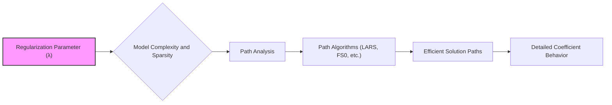
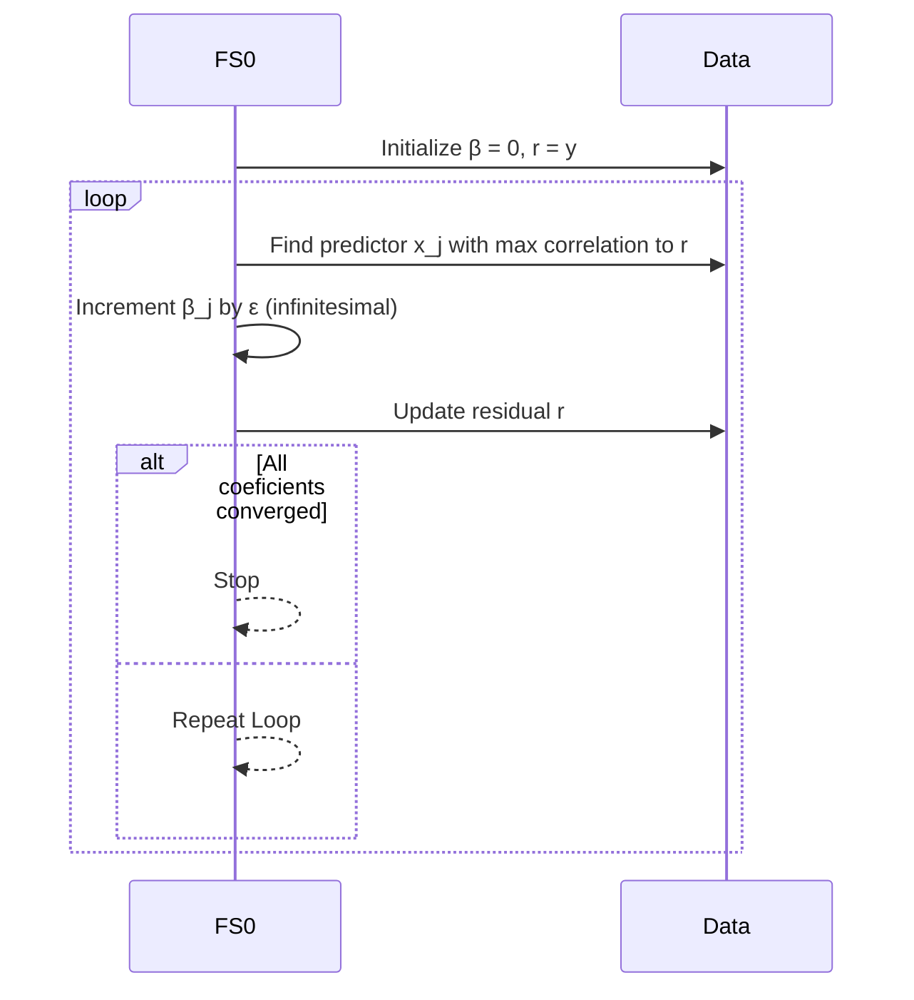
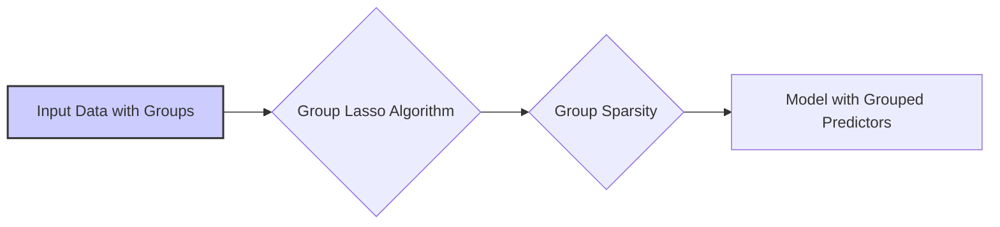

## Path Algorithms em Modelos de Regressão Linear Regularizada

### Introdução

Em modelos de regressão linear regularizada, o parâmetro de regularização ($\lambda$) controla a complexidade e a esparsidade do modelo. A escolha do valor de $\lambda$ é um problema crucial, e uma forma de abordar este problema é através da análise do **caminho de regularização** (ou *path*), que corresponde à evolução dos coeficientes do modelo conforme $\lambda$ varia. Os **Path Algorithms**, ou algoritmos de caminho, são métodos computacionais que geram eficientemente todo o caminho de soluções, permitindo uma análise detalhada do comportamento dos coeficientes em função de $\lambda$. Este capítulo explorará os algoritmos de caminho mais relevantes, como o LARS, o incremental forward stagewise e as generalizações do algoritmo do Lasso para diferentes tipos de problemas.

### Algoritmos de Caminho: LARS e Incremental Forward Stagewise

Nesta seção, vamos analisar detalhadamente os algoritmos LARS (Least Angle Regression) e Incremental Forward Stagewise (FS0), destacando suas características e importância.

**Least Angle Regression (LARS)**

Como discutido anteriormente, o algoritmo **LARS (Least Angle Regression)** é um método eficiente para calcular todo o caminho de soluções para problemas de regressão linear regularizados com penalidade L1, e que é idêntico ao caminho do Lasso.
O algoritmo LARS, ao invés de determinar a solução para um dado valor de $\lambda$, computa a solução para todos os valores de $\lambda$, ou seja, o caminho das soluções, desde o modelo nulo (com todos os coeficientes iguais a zero) até ao modelo de mínimos quadrados (sem penalidade). O algoritmo LARS pode ser caracterizado como um algoritmo de seleção de variáveis incremental, onde os coeficientes dos preditores relevantes são movidos em direção à sua estimativa de mínimos quadrados, de forma gradual [^30].
Os principais passos do algoritmo LARS podem ser descritos da seguinte forma:
    1.  **Inicialização:** Começamos com todos os coeficientes $\beta_j = 0$ e o resíduo $r = y$
    2.  **Identificação:** Identificamos o preditor $x_j$ que tem a maior correlação em valor absoluto com o resíduo atual.
    3.  **Ajuste:** Movemos o coeficiente $\beta_j$ na direção do sinal da correlação com o resíduo atual até que outro preditor $x_k$ tenha a mesma correlação com o resíduo.
    4.  **Movimento:** Movemos os coeficientes de $x_j$ e $x_k$ juntos até que um novo preditor atinja a mesma correlação com o resíduo.
    5.  **Continuação:** Este processo se repete, adicionando preditores ao conjunto ativo e movendo seus coeficientes na direção de sua estimativa de mínimos quadrados.
    6.  **Terminação:** O algoritmo termina quando todos os preditores estão no modelo ou quando todos os parâmetros são zerados [^32].

Ao longo do processo, LARS garante que os preditores no conjunto ativo tenham correlações idênticas (em valor absoluto) com o resíduo, e move os coeficientes de forma a garantir que esta condição se mantenha, movendo os parâmetros em direção à sua solução de mínimos quadrados.

> 💡 **Exemplo Numérico:**
>
> Vamos considerar um exemplo simplificado com três preditores ($x_1, x_2, x_3$) e uma resposta $y$. Suponha que após a inicialização (todos $\beta_j = 0$), o preditor $x_1$ tenha a maior correlação com o resíduo ($r=y$).
>
> 1.  **Inicialização:** $\beta_1 = 0, \beta_2 = 0, \beta_3 = 0$, $r = y$.
> 2.  **Identificação:** $x_1$ tem a maior correlação com $r$.
> 3.  **Ajuste:** $\beta_1$ começa a aumentar (se a correlação for positiva) ou diminuir (se a correlação for negativa) até que, por exemplo, $x_2$ tenha a mesma correlação com $r$.
> 4.  **Movimento:** $\beta_1$ e $\beta_2$ são ajustados juntos, mantendo suas correlações iguais com $r$. Este processo continua, adicionando mais preditores até que a condição de parada seja atingida.
>
> Vamos supor que, após algumas iterações, os coeficientes evoluíram para:
>
> | Iteração | $\beta_1$ | $\beta_2$ | $\beta_3$ |
> |----------|-----------|-----------|-----------|
> | 0        | 0         | 0         | 0         |
> | 1        | 0.2       | 0         | 0         |
> | 2        | 0.5       | 0.1       | 0         |
> | 3        | 0.7       | 0.3       | -0.2      |
>
> Este exemplo ilustra como os coeficientes são ajustados incrementalmente, e como o algoritmo LARS seleciona os preditores mais relevantes para o modelo. O caminho de regularização é obtido ao rastrear a evolução dos coeficientes em função do valor de $\lambda$, que neste exemplo não foi explicitamente definido, mas que está implícito na ordem em que os preditores são adicionados ao modelo.

**Incremental Forward Stagewise Regression (FS0)**

O **Incremental Forward Stagewise Regression (FS0)** é uma versão limite do algoritmo *Forward Stagewise* com o passo tendendo a zero. É um método para calcular o caminho de soluções de uma maneira mais simples, que também pode ser visto como um precursor do LARS [^87].
O algoritmo FS0 começa com o mesmo passo de inicialização do LARS, e em cada etapa seleciona um preditor, e move o seu coeficiente infinitesimalmente no sentido do seu sinal, tal como no LARS, com a condição que as correlações entre as variáveis no conjunto ativo sejam sempre iguais e decrescentes em valor absoluto. A diferença fundamental em relação ao LARS é que o FS0 usa um passo infinitesimal (tende a zero) para o incremento dos parâmetros, em contraste com os passos adaptativos do LARS, que variam de forma a garantir a condição de igualdade das correlações.

Os principais passos do algoritmo FS0 são:
    1. **Inicialização:** Começamos com todos os coeficientes $\beta_j = 0$ e com o resíduo $r = y$.
    2.  **Identificação:** Encontramos o preditor $x_j$ mais correlacionado com o resíduo atual $r$.
    3.  **Ajuste:** Movemos o coeficiente $\beta_j$ com o sinal da sua correlação com o resíduo e um passo infinitesimal $\epsilon$.
    4.  **Repetição:** Repetimos os passos 2 e 3 muitas vezes, até que todos os coeficientes tenham convergido para uma solução.
Como o passo é infinitesimal, o resultado é um caminho contínuo de soluções, onde a esparsidade do modelo aumenta gradualmente com o aumento do parâmetro de regularização [^87]. O algoritmo FS0 é computacionalmente menos eficiente que o LARS, mas tem uma estrutura matemática mais simples que o LARS, e é particularmente útil como elo com modelos não-lineares, como o *boosting* [^87].

> 💡 **Exemplo Numérico:**
>
> Usando o mesmo conjunto de dados com três preditores e uma resposta, vamos ilustrar o funcionamento do FS0.
>
> 1.  **Inicialização:** $\beta_1 = 0, \beta_2 = 0, \beta_3 = 0$, $r = y$.
> 2.  **Identificação:** $x_1$ tem a maior correlação com $r$.
> 3.  **Ajuste:** $\beta_1$ é ajustado por um pequeno valor $\epsilon$ na direção da correlação. Por exemplo, se a correlação for positiva, $\beta_1 = \epsilon$.
> 4.  **Repetição:** O processo se repete, adicionando um pequeno ajuste a cada passo, com a garantia de que as correlações entre as variáveis no conjunto ativo sejam sempre iguais e decrescentes em valor absoluto.
>
> Suponha que após várias iterações, os coeficientes evoluíram da seguinte forma (considerando $\epsilon=0.01$):
>
> | Iteração | $\beta_1$ | $\beta_2$ | $\beta_3$ |
> |----------|-----------|-----------|-----------|
> | 0        | 0         | 0         | 0         |
> | 10       | 0.1       | 0         | 0         |
> | 50       | 0.5       | 0.05       | 0        |
> | 100      | 1.0       | 0.25       | -0.1      |
>
> Observe que o ajuste é mais gradual em comparação com o LARS, devido ao passo infinitesimal. O FS0, embora mais lento, também gera o caminho de regularização, mostrando como os coeficientes evoluem em função do parâmetro de regularização.

**Relação entre LARS e FS0**
O LARS e o FS0 são algoritmos que calculam o mesmo caminho de soluções, e diferem na forma como cada passo é realizado [^87]. O LARS faz um ajuste mais direto para atingir as soluções, movendo os coeficientes de maneira adaptativa, enquanto o FS0 usa um passo fixo infinitesimal, o que garante que o algoritmo também encontre as soluções no caminho correto, mas de forma mais lenta. A relação entre o LARS e o Lasso é dada pelo facto do LARS computar o caminho de soluções do Lasso, enquanto que o FS0, na prática, computa também o mesmo caminho, mas de uma maneira incremental.

**Lemma 12:** Condição de Caminho Linear do LARS

O caminho de soluções gerado pelo LARS é piecewise linear, implicando que os coeficientes variam linearmente ao longo do caminho. A piecewise linearidade é um resultado da propriedade de que o algoritmo mantém a mesma magnitude de correlação com o resíduo para os preditores no conjunto ativo, movendo os parâmetros simultaneamente. A solução de mínimos quadrados, por outro lado, não apresenta esta propriedade.

**Corolário 12:**  Eficiência Computacional do LARS

A propriedade piecewise linear do caminho do LARS permite que o caminho inteiro de soluções seja computado de forma eficiente, sem a necessidade de computar as soluções passo a passo [^76]. O número de passos no algoritmo LARS é no máximo o número de preditores, e um passo do LARS corresponde a uma solução para um valor de $\lambda$ no Lasso, o que permite computar as soluções para qualquer valor de $\lambda$ de forma eficiente.

> ⚠️ **Nota Importante**: O algoritmo LARS fornece um caminho piecewise linear que contém a solução do Lasso para todos os valores do parâmetro de regularização λ.
 
> ❗ **Ponto de Atenção**: A diferença principal entre o LARS e o Forward Stagewise é que o LARS usa um passo adaptativo, o que leva a uma solução mais rápida, enquanto o Forward Stagewise usa um passo infinitesimal e pode ser visto como um precursor do LARS.

### Generalizações do Algoritmo do Lasso

Nesta seção, vamos explorar generalizações do problema do Lasso, incluindo o **Elastic Net**, o **Dantzig Selector**, e o **Group Lasso**, e como as ideias de algoritmos de caminho se aplicam também a estes problemas.

**Elastic Net Path Algorithm**

O Elastic Net, combina penalidades L1 e L2, permitindo criar um caminho de soluções que permite ajustar o compromisso entre esparsidade e estabilidade. O caminho de soluções do Elastic Net também é piecewise linear, e o caminho pode ser gerado de forma similar ao LARS, adicionando e removendo preditores do conjunto ativo [^73]. É importante notar que uma vez que a penalidade L2 é diferenciável, a condição de igual correlação não é estrita, e o método para cálculo do caminho é um pouco mais complexo.
O algoritmo do Elastic Net, ao contrário do Lasso e do LARS, não resulta na exata solução do problema de otimização, mas em uma aproximação bastante precisa com um custo computacional baixo. A solução pode ser computada usando métodos de otimização por coordenada ou algoritmos de caminho similares ao LARS.

> 💡 **Exemplo Numérico:**
>
> Considere um problema de regressão com dois preditores ($x_1, x_2$) e uma resposta $y$. O Elastic Net adiciona uma penalidade combinada L1 e L2 à função de custo, dada por:
>
> $$\text{min}_{\beta} ||y - X\beta||^2 + \lambda_1||\beta||_1 + \lambda_2||\beta||_2^2$$
>
> Onde $\lambda_1$ controla a penalidade L1 e $\lambda_2$ controla a penalidade L2.
>
> Vamos supor que, ao longo do caminho de regularização, os coeficientes evoluem da seguinte forma:
>
> | $\lambda_1$ | $\lambda_2$ | $\beta_1$ | $\beta_2$ |
> |-------------|-------------|-----------|-----------|
> | 1.0         | 0.1         | 0.1       | 0         |
> | 0.5         | 0.1         | 0.4       | 0.2       |
> | 0.1         | 0.1         | 0.8       | 0.5       |
>
> Inicialmente, com um $\lambda_1$ alto, o modelo é esparso, com $\beta_2$ igual a zero. Conforme $\lambda_1$ diminui, ambos os coeficientes aumentam, e $\beta_2$ também entra no modelo. O $\lambda_2$ ajuda a estabilizar as estimativas, evitando que o modelo se torne excessivamente sensível a pequenas mudanças nos dados.
>
> A escolha de $\lambda_1$ e $\lambda_2$ é crucial, e o caminho de regularização do Elastic Net permite visualizar o efeito de cada parâmetro nos coeficientes do modelo.

**Dantzig Selector Path**

O **Dantzig Selector** é um método alternativo para problemas de seleção de variáveis que usa a norma L∞ para definir uma região de viabilidade do problema [^78]. A função objetivo do Dantzig Selector é dada por:

$$
\text{min}_{\beta} ||\beta||_1 \quad \text{sujeito a} \quad ||X^T(y - X\beta)||_\infty \leq s
$$

onde $s$ é um parâmetro que define o raio da região de viabilidade do problema. O Dantzig Selector busca por soluções com esparsidade, e com uma propriedade diferente do Lasso. Enquanto o Lasso restringe a norma L1 do vetor dos parâmetros, o Dantzig Selector restringe a norma L∞ do gradiente da função RSS. O caminho das soluções do Dantzig selector é piecewise linear e pode ser calculado usando métodos de programação linear.  A escolha de $s$ para um dado problema é um problema difícil, e que necessita de análise dos dados.
O Dantzig Selector também tenta balancear o ajuste do modelo e a sua complexidade, embora de uma forma diferente do Lasso.

> 💡 **Exemplo Numérico:**
>
> Suponha que temos um problema com dois preditores ($x_1, x_2$) e uma resposta $y$. A condição do Dantzig Selector é:
>
> $$||\mathbf{X}^T(\mathbf{y} - \mathbf{X}\beta)||_\infty \leq s$$
>
> Isso significa que o maior valor absoluto do vetor $\mathbf{X}^T(\mathbf{y} - \mathbf{X}\beta)$ não deve exceder $s$. Ao variar $s$, obtemos um caminho de soluções.
>
> Por exemplo, para um valor grande de $s$, a solução pode ser equivalente a um modelo de mínimos quadrados, com ambos os coeficientes diferentes de zero. Conforme $s$ diminui, a solução se torna mais esparsa, e um dos coeficientes pode ser zerado.
>
> Suponha que o caminho de soluções seja:
>
> |  s  | $\beta_1$ | $\beta_2$ |
> |-----|-----------|-----------|
> | 1.0 | 0.8       | 0.5       |
> | 0.5 | 0.6       | 0.0       |
> | 0.1 | 0.0       | 0.0       |
>
> Inicialmente, ambos os coeficientes são não nulos. Conforme $s$ diminui, $\beta_2$ é zerado, e para um valor ainda menor de $s$, $\beta_1$ também é zerado. O Dantzig Selector, ao restringir a norma L∞ do gradiente, seleciona variáveis de forma diferente do Lasso.

**Group Lasso Path**

Em muitos casos práticos, os preditores podem ser agrupados naturalmente, como variáveis *dummy* que representam categorias, ou grupos de genes que pertencem à mesma via metabólica. O **Group Lasso** é uma técnica de regularização que promove *sparsity* em nível de grupo, ou seja, força alguns grupos de preditores a terem todos os seus coeficientes iguais a zero [^80].
A função objetivo do Group Lasso é dada por:

$$
\underset{\beta}{\text{min}}  ||y - X\beta||^2 + \lambda \sum_{g=1}^G \sqrt{p_g} ||\beta_g||_2
$$
onde:

-   $G$ é o número de grupos.
-   $\beta_g$ é o vetor de coeficientes para o grupo $g$.
-   $p_g$ é o tamanho do grupo $g$.

O Group Lasso promove modelos esparsos em nível de grupo, o que significa que grupos inteiros de preditores são eliminados do modelo, enquanto os preditores em grupos relevantes são selecionados. O caminho de soluções do Group Lasso é piecewise linear, e pode ser computado usando algoritmos adaptados para este problema [^80].

> 💡 **Exemplo Numérico:**
>
> Suponha que temos 6 preditores, agrupados em 3 grupos ($G=3$). Grupo 1: $x_1, x_2$; Grupo 2: $x_3, x_4$; Grupo 3: $x_5, x_6$. A função objetivo do Group Lasso é:
>
> $$\text{min}_{\beta} ||y - X\beta||^2 + \lambda (\sqrt{2}||\beta_{1,2}||_2 + \sqrt{2}||\beta_{3,4}||_2 + \sqrt{2}||\beta_{5,6}||_2)$$
>
> Onde $\beta_{1,2}$ representa os coeficientes do grupo 1, $\beta_{3,4}$ do grupo 2 e $\beta_{5,6}$ do grupo 3.
>
> Ao variar $\lambda$, podemos ver como diferentes grupos entram ou saem do modelo. Por exemplo:
>
> | $\lambda$ | $\beta_1$ | $\beta_2$ | $\beta_3$ | $\beta_4$ | $\beta_5$ | $\beta_6$ |
> |-----------|-----------|-----------|-----------|-----------|-----------|-----------|
> | 1.0       | 0         | 0         | 0         | 0         | 0         | 0         |
> | 0.5       | 0.4       | 0.2       | 0         | 0         | 0         | 0         |
> | 0.1       | 0.8       | 0.5       | 0.6       | 0.3       | 0         | 0         |
>
> Inicialmente, com $\lambda$ alto, todos os grupos são zerados. Conforme $\lambda$ diminui, o grupo 1 entra no modelo, seguido pelo grupo 2. O grupo 3 permanece zerado, indicando que os preditores nesse grupo não são relevantes. O Group Lasso realiza a seleção de variáveis em nível de grupo, o que pode ser útil em muitos problemas práticos.

> ⚠️ **Ponto Crucial**: Os algoritmos de caminho são úteis não apenas para modelos lineares com penalização L1, mas também para problemas como o Elastic Net, o Dantzig Selector, e o Group Lasso.

###  Análise Matemática dos Algoritmos de Caminho

Nesta seção vamos analisar as propriedades matemáticas que suportam os algoritmos de caminho.

**Lemma 13:** Piecewise Linearity do Caminho das Soluções

Em geral, a propriedade de piecewise linearity do caminho de soluções do Lasso e outros métodos regularizados baseia-se nas condições de otimalidade dos problemas de otimização [^77]. Essas condições podem ser expressas através de desigualdades que devem ser satisfeitas na solução, e quando a solução do problema varia, há uma mudança finita nos conjuntos de coeficientes que são ou não iguais a zero. Essas mudanças na estrutura dos conjuntos ativos das variáveis levam a um caminho piecewise linear, o que também é útil do ponto de vista computacional.
A relação entre o LARS e o Lasso também se dá através da peça-wise linearidade de ambos. No LARS, a piecewise linearidade surge da necessidade de balancear o avanço dos coeficientes no sentido das suas estimativas de mínimos quadrados. No caso do Lasso, a piecewise linearidade é garantida pela condição de otimalidade, dada pela desigualdade da derivada na origem da norma L1.

**Prova do Lemma 13:**
A condição de otimalidade do Lasso em relação à norma L1 implica que, no ótimo,  o gradiente da RSS é igual a $\lambda$, com o sinal do coeficiente. Para os coeficientes que estão em zero, esta condição também implica que o gradiente da RSS  é, em valor absoluto, menor ou igual a $\lambda$. Quando a magnitude da correlação de um novo preditor atinge o limite de outras variáveis no conjunto ativo, essa variável entra no conjunto, e o gradiente do resíduo passa a ser ortogonal ao espaço gerado por todas as variáveis no conjunto ativo. Este ponto é chamado de um nó, e o caminho da solução é linear entre nós consecutivos. $\blacksquare$

**Corolário 13:** A importância de algoritmos que computem os caminhos de solução

Em vez de resolver o problema do Lasso para um valor particular de $\lambda$, é mais informativo calcular o caminho inteiro da solução, já que ele fornece informações valiosas sobre como os coeficientes do modelo se comportam conforme a complexidade do modelo varia [^78]. Além disso, ao se obter o caminho inteiro, a solução para qualquer valor de $\lambda$ pode ser computada de forma eficiente.
Outros problemas, como os com penalidades combinadas (Elastic Net) ou como o Dantzig Selector, também tem caminhos de soluções, que não necessariamente coincidem com o caminho de soluções do Lasso, e que são importantes para a escolha do modelo apropriado.

> ⚠️ **Ponto Crucial**: A piecewise linearidade do caminho das soluções do Lasso (e outras penalidades) são a base dos algoritmos de caminho eficientes, já que ao invés de encontrar a solução para um dado valor do parâmetro de regularização, o caminho inteiro é computado.

### Pergunta Teórica Avançada:  Comparação de Complexidade Computacional entre LARS e outros Algoritmos de Caminho.

**Resposta:**

A complexidade computacional dos algoritmos de caminho é uma consideração prática importante, dado que esses algoritmos podem ser usados para problemas de alta dimensionalidade com muitos parâmetros. Em geral, algoritmos como LARS e suas variações, são mais rápidos que algoritmos que usam métodos de força bruta.

O algoritmo LARS, por exemplo, realiza o cálculo de todo o caminho de soluções do Lasso em um número de passos que é, no máximo, igual ao número de preditores ($p$). Em cada passo, o algoritmo precisa encontrar o preditor que tem a maior correlação com o resíduo atual, e move os coeficientes com uma certa complexidade (devido ao balanceamento das correlações). O custo total do LARS é da mesma ordem de um ajuste de mínimos quadrados usando todos os preditores, $O(np^2)$, onde $n$ é o número de observações.
O Incremental Forward Stagewise (FS0), que também computa o caminho inteiro de soluções do Lasso, tem uma complexidade computacional maior que o LARS. O FS0, em vez de computar o passo adaptativamente, incrementa os parâmetros em passos infinitesimais, de tal forma que os cálculos se tornam mais demorados. Entretanto, o FS0 pode ser visto como a base para desenvolver algoritmos similares em cenários onde o problema não é o Lasso, e onde os detalhes dos cálculos podem ser bem mais complexos. O FS0 pode ser útil em modelos não lineares e métodos de *boosting*, onde a condição de piecewise linearidade do caminho da solução não é garantida.

Em contrapartida, um método computacionalmente muito mais custoso é o *Best Subset Selection*, que avalia todos os subconjuntos possíveis de preditores. Como o número de subconjuntos cresce exponencialmente com o número de preditores (2p), este método é adequado apenas para problemas com poucos preditores.

Algoritmos para problemas mais gerais, como o Elastic Net e o Group Lasso, podem ser construídos usando as ideias por trás do LARS e FS0. As propriedades de piecewise linearidade das soluções desses problemas, permitem que o caminho inteiro seja computado em número de passos que é da ordem da dimensão do problema, e a complexidade computacional é da mesma ordem do LARS, ou seja $O(np^2)$.

> ⚠️ **Ponto Crucial**:  Algoritmos como o LARS, devido à sua natureza incremental, computam todo o caminho de soluções de forma muito eficiente, com complexidade comparável aos de métodos de regressão linear sem regularização.

### Conclusão

Os Path Algorithms são ferramentas poderosas no contexto da regressão linear regularizada, permitindo um estudo detalhado do comportamento dos modelos em função dos parâmetros de regularização. Algoritmos como LARS e FS0, e suas generalizações para o Elastic Net, Dantzig Selector, e Group Lasso, fornecem meios para construir modelos mais robustos e adequados aos problemas específicos. Compreender as propriedades de piecewise linearidade do caminho de soluções é fundamental para o desenvolvimento e a implementação de algoritmos eficientes em cenários de alta dimensão.

### Referências

[^30]: "The algorithm Least Angle Regression (LARS), generates the path of solutions of LASSO efficiently." *(Trecho de Linear Methods for Regression)*
[^31]: "At each step the algorithm identifies the variable most correlated with the current residual" *(Trecho de Linear Methods for Regression)*
[^32]: "Move β from 0 towards its least-squares coefficient (xj, r), until some other competitor xk has as much correlation with the current residual as does x," *(Trecho de Linear Methods for Regression)*
[^33]:  "Start with the residual r = y - ӯ, β1,β2,...,βp = 0." *(Trecho de Linear Methods for Regression)*
[^34]: "Move βj from 0 towards its least-squares coefficient (xj, r), until some other competitor xk has as much correlation with the current residual as does xj" *(Trecho de Linear Methods for Regression)*
[^73]: "Partly for this reason as well as for computational tractability, Zou and Hastie (2005) introduced the elastic-net penalty." *(Trecho de Linear Methods for Regression)*
[^78]: "In Figure 3.7 we have plotted the estimated prediction error versus the quantity..." *(Trecho de Linear Methods for Regression)*
[^87]: "Here we present another LAR-like algorithm, this time focused on forward stepwise regression." *(Trecho de Linear Methods for Regression)*
[^71]: "In this view, the lasso, ridge regression and best subset selection are Bayes estimates with different priors. Note, however, that they are derived as posterior modes, that is, maximizers of the posterior." *(Trecho de Linear Methods for Regression)*
[^40]: "Unlike forward-stepwise regression, none of the other variables are adjusted when a term is added to the model. As a consequence, forward stagewise can take many more than p steps to reach the least squares fit," *(Trecho de Linear Methods for Regression)*
[^76]: "By construction the coefficients in LAR change in a piecewise linear fashion." *(Trecho de Linear Methods for Regression)*
