## Orthogonalização em Modelos de Regressão Linear: Uma Análise Avançada

```mermaid
flowchart LR
    A["Espaço Vetorial"] --> B("Base Ortogonal");
    B --> C("Projeção Ortogonal");
    C --> D("Regressão Linear");
    style A fill:#f9f,stroke:#333,stroke-width:2px
    style D fill:#ccf,stroke:#333,stroke-width:2px
```



### Introdução

A **Ortogonalização** é um conceito fundamental em álgebra linear e em análise numérica, com um papel crucial em muitos algoritmos de aprendizado de máquina e análise de dados, especialmente em modelos de regressão linear [^206]. No contexto da regressão linear, a ortogonalização é usada principalmente para construir bases ortonormais para espaços vetoriais, simplificando cálculos, aumentando a estabilidade numérica e proporcionando *insights* importantes sobre a estrutura dos dados [^206]. Este capítulo explorará os fundamentos teóricos da ortogonalização, os métodos mais relevantes, como as matrizes de Householder e Givens, o processo de fatoração QR, e suas aplicações na resolução de problemas de regressão linear, incluindo as soluções de mínimos quadrados.

### Matrizes de Householder e Givens: Fundamentos da Ortogonalização

Nesta seção, vamos apresentar os conceitos de matrizes de Householder e de Givens, que são a base de diversos algoritmos de ortogonalização.

**Matrizes de Householder**

Uma **matriz de Householder**, também conhecida como reflexão de Householder, é uma matriz ortogonal que representa uma reflexão em relação a um hiperplano que passa pela origem [^209]. Uma matriz de Householder é definida por:

$$
P = I - 2\frac{vv^T}{v^T v}
$$

onde:

-   $I$ é a matriz identidade de tamanho $n \times n$.
-   $v$ é um vetor não nulo em $\mathbb{R}^n$.
-   $vv^T$ é o produto externo de $v$ por si mesmo.
-   $v^T v$ é o produto interno de $v$ por si mesmo, que representa a norma ao quadrado do vetor $v$.

As matrizes de Householder possuem as seguintes propriedades:

1.  **Simetria:** $P = P^T$.

2.  **Ortogonalidade:** $P^T P = P P^T = I$, o que implica que $P = P^{-1}$.

3.  **Reflexão:** Uma multiplicação por uma matriz de Householder espelha o vetor em relação ao hiperplano ortogonal ao vetor $v$.

O vetor $v$ é chamado de **vetor de Householder** e define a direção da reflexão. Uma propriedade chave das matrizes de Householder é que elas podem ser usadas para introduzir zeros seletivamente em um vetor ou matriz [^209].

> 💡 **Exemplo Numérico:**
>
> Vamos criar uma matriz de Householder para refletir um vetor. Considere o vetor $x = \begin{bmatrix} 1 \\ 2 \\ 3 \end{bmatrix}$. Queremos refletir $x$ de forma que a primeira coordenada fique inalterada, enquanto as outras coordenadas sejam transformadas. Para isso, vamos construir um vetor $v$ tal que $v = x - \|x\|e_1$, onde $e_1 = \begin{bmatrix} 1 \\ 0 \\ 0 \end{bmatrix}$ e $\|x\| = \sqrt{1^2 + 2^2 + 3^2} = \sqrt{14}$.
>
> 1.  Calculamos $\|x\|$:
>     $\|x\| = \sqrt{1^2 + 2^2 + 3^2} = \sqrt{14} \approx 3.74$
>
> 2.  Calculamos $v$:
>     $v = x - \|x\|e_1 = \begin{bmatrix} 1 \\ 2 \\ 3 \end{bmatrix} - 3.74 \begin{bmatrix} 1 \\ 0 \\ 0 \end{bmatrix} = \begin{bmatrix} -2.74 \\ 2 \\ 3 \end{bmatrix}$
>
> 3.  Calculamos $vv^T$:
>     $vv^T = \begin{bmatrix} -2.74 \\ 2 \\ 3 \end{bmatrix} \begin{bmatrix} -2.74 & 2 & 3 \end{bmatrix} = \begin{bmatrix} 7.5076 & -5.48 & -8.22 \\ -5.48 & 4 & 6 \\ -8.22 & 6 & 9 \end{bmatrix}$
>
> 4.  Calculamos $v^Tv$:
>     $v^Tv = (-2.74)^2 + 2^2 + 3^2 = 7.5076 + 4 + 9 = 20.5076$
>
> 5.  Calculamos $P$:
>     $P = I - 2\frac{vv^T}{v^T v} = \begin{bmatrix} 1 & 0 & 0 \\ 0 & 1 & 0 \\ 0 & 0 & 1 \end{bmatrix} - 2 \frac{1}{20.5076} \begin{bmatrix} 7.5076 & -5.48 & -8.22 \\ -5.48 & 4 & 6 \\ -8.22 & 6 & 9 \end{bmatrix} = \begin{bmatrix} 0.268 & 0.535 & 0.803 \\ 0.535 & 0.609 & -0.585 \\ 0.803 & -0.585 & 0.122 \end{bmatrix}$
>
> 6.  Aplicamos $P$ em $x$:
>     $Px = \begin{bmatrix} 0.268 & 0.535 & 0.803 \\ 0.535 & 0.609 & -0.585 \\ 0.803 & -0.585 & 0.122 \end{bmatrix} \begin{bmatrix} 1 \\ 2 \\ 3 \end{bmatrix} = \begin{bmatrix} 3.74 \\ 0 \\ 0 \end{bmatrix}$
>
>   O resultado mostra que o vetor $x$ foi refletido, tendo as suas duas últimas componentes zeradas.

**Matrizes de Givens**

Uma **matriz de Givens**, também conhecida como rotação de Givens, é uma matriz ortogonal que representa uma rotação em um plano bidimensional. Uma matriz de Givens é definida por:


$$
G(i, k, \theta) =
\begin{bmatrix}
    1 & \cdots & 0 & \cdots & 0 & \cdots & 0 \\
    \vdots & \ddots & \vdots & & \vdots & & \vdots \\
    0 & \cdots & c & \cdots & s & \cdots & 0 \\
    \vdots & & \vdots & \ddots & \vdots & & \vdots \\
    0 & \cdots & -s & \cdots & c & \cdots & 0 \\
    \vdots & & \vdots & & \vdots & \ddots & \vdots \\
    0 & \cdots & 0 & \cdots & 0 & \cdots & 1
\end{bmatrix}
$$

onde:

-   $c = \cos(\theta)$ e $s = \sin(\theta)$
-   $i$ e $k$ são os índices das linhas e colunas que são afetadas pela rotação.

As matrizes de Givens possuem as seguintes propriedades:
    1. **Ortogonalidade:** $G(i, k, \theta)^T G(i, k, \theta) = G(i, k, \theta)G(i, k, \theta)^T = I$.
    2.  **Rotação:** A multiplicação por uma matriz de Givens representa uma rotação no plano definido pelas dimensões $i$ e $k$.
    3. **Seletividade:** As matrizes de Givens são utilizadas para introduzir zeros de forma seletiva numa matriz ou vetor, afetando apenas duas linhas ou colunas de cada vez.

A escolha do ângulo $\theta$ permite zerar um elemento específico num vetor ou matriz [^215].

> 💡 **Exemplo Numérico:**
>
> Vamos criar uma matriz de Givens para zerar um elemento de um vetor. Considere o vetor $x = \begin{bmatrix} 3 \\ 4 \end{bmatrix}$. Queremos zerar o segundo elemento utilizando uma rotação.
>
> 1.  Calculamos o raio $r = \sqrt{3^2+4^2} = 5$
> 2.  Calculamos $c = \frac{3}{5} = 0.6$ e $s = \frac{4}{5} = 0.8$.
> 3.  A matriz de Givens é então:
>     $G(1,2,\theta) = \begin{bmatrix} 0.6 & 0.8 \\ -0.8 & 0.6 \end{bmatrix}$
> 4.  Aplicamos $G$ em $x$:
>    $Gx = \begin{bmatrix} 0.6 & 0.8 \\ -0.8 & 0.6 \end{bmatrix} \begin{bmatrix} 3 \\ 4 \end{bmatrix} = \begin{bmatrix} 0.6*3 + 0.8*4 \\ -0.8*3 + 0.6*4 \end{bmatrix} = \begin{bmatrix} 5 \\ 0 \end{bmatrix}$
>
>    O resultado mostra que o segundo elemento do vetor foi zerado.

**Lemma 14:** Condições para a Ortogonalidade de Householder e Givens

Tanto as matrizes de Householder quanto as de Givens preservam a norma de qualquer vetor ao qual são aplicadas, o que garante a sua estabilidade numérica. Para demonstrar isso, vamos assumir que $P$ é uma matriz de Householder e $G$ é uma matriz de Givens.
A matriz de Householder é ortogonal por definição:
$$ P^T P = (I - 2\frac{vv^T}{v^T v}) (I - 2\frac{vv^T}{v^T v}) = I - 4 \frac{vv^T}{v^T v} + 4 \frac{vv^Tvv^T}{(v^T v)^2} $$
Como $v^T v$ é um escalar, então:
$$ P^T P = I - 4 \frac{vv^T}{v^T v} + 4 \frac{vv^T}{v^T v} = I $$
e o mesmo pode ser demonstrado que $P P^T = I$, e assim $P$ é ortogonal.

A matriz de Givens também é ortogonal por definição:

$$
G(i, k, \theta)^T G(i, k, \theta) =
\begin{bmatrix}
    1 & \cdots & 0 & \cdots & 0 & \cdots & 0 \\
    \vdots & \ddots & \vdots & & \vdots & & \vdots \\
    0 & \cdots & c & \cdots & -s & \cdots & 0 \\
    \vdots & & \vdots & \ddots & \vdots & & \vdots \\
    0 & \cdots & s & \cdots & c & \cdots & 0 \\
    \vdots & & \vdots & & \vdots & \ddots & \vdots \\
    0 & \cdots & 0 & \cdots & 0 & \cdots & 1
\end{bmatrix}
\begin{bmatrix}
    1 & \cdots & 0 & \cdots & 0 & \cdots & 0 \\
    \vdots & \ddots & \vdots & & \vdots & & \vdots \\
    0 & \cdots & c & \cdots & s & \cdots & 0 \\
    \vdots & & \vdots & \ddots & \vdots & & \vdots \\
    0 & \cdots & -s & \cdots & c & \cdots & 0 \\
    \vdots & & \vdots & & \vdots & \ddots & \vdots \\
    0 & \cdots & 0 & \cdots & 0 & \cdots & 1
\end{bmatrix}
$$

Realizando a multiplicação, vemos que ela resulta na matriz identidade. $\blacksquare$

**Corolário 14:** Preservação da Norma

A ortogonalidade das matrizes de Householder e Givens implica que elas preservam a norma de qualquer vetor ao qual são aplicadas. Isto significa que para uma matriz de Householder $P$, e um vetor $x$ qualquer, temos $\|Px\|_2 = \|x\|_2$, e o mesmo ocorre para uma matriz de Givens $G$, ou seja $\|Gx\|_2 = \|x\|_2$.

### A Fatorização QR: Uma Ferramenta Fundamental

```mermaid
flowchart LR
    A["Matriz A"] --> B("Matriz Ortogonal Q")
    A --> C("Matriz Triangular Superior R")
    B -.->|Multiplicação| C
    style A fill:#f9f,stroke:#333,stroke-width:2px
    style B fill:#ccf,stroke:#333,stroke-width:2px
    style C fill:#ccf,stroke:#333,stroke-width:2px
```



A **Fatorização QR** é uma técnica fundamental na álgebra linear e em diversas aplicações, como a solução de sistemas lineares e problemas de mínimos quadrados [^223]. Dado uma matriz $A$ com $m \ge n$, a fatorização QR decompõe $A$ em um produto de uma matriz ortogonal $Q \in \mathbb{R}^{m \times m}$ e uma matriz triangular superior $R \in \mathbb{R}^{m \times n}$, tal que:

$$
A = QR
$$

Onde $Q^T Q = I$.

Em muitas aplicações, estamos interessados na forma reduzida do fatorização QR. Se a matriz $A$ tem posto completo, ou seja $rank(A) = n$, podemos escrever:

$$
A = Q_1R_1
$$

onde $Q_1 \in \mathbb{R}^{m \times n}$ é uma matriz com colunas ortonormais (as primeiras $n$ colunas de $Q$) e $R_1 \in \mathbb{R}^{n \times n}$ é uma matriz triangular superior.
O processo de fatorização QR pode ser implementado utilizando as matrizes de Householder e Givens.

**Fatoração QR utilizando Householder**

A fatorização QR utilizando Householder envolve a aplicação de uma sequência de matrizes de Householder à matriz $A$, com o objetivo de transformá-la numa matriz triangular superior. Os passos do algoritmo são:

1.  **Inicialização:** Define-se $A_0 = A$ e $Q_0 = I$, onde $I$ é a matriz identidade.
2.  **Iteração:** Em cada iteração $j$, determinamos um vetor de Householder $v_j$ para zerar todos os elementos abaixo da diagonal na j-ésima coluna da matriz $A_{j-1}$. Construimos a matriz de Householder
$$H_j = I - 2\frac{v_j v_j^T}{v_j^T v_j}$$
e atualizamos $A_j$ e $Q_j$:
$$ A_j=H_jA_{j-1} $$
$$ Q_j = Q_{j-1}H_j$$
3.  **Repetição:** Repetimos o processo iterativo até que a matriz $A_n$ seja triangular superior.
4.  **Resultado:** No final, a matriz original $A$ é decomposta em um produto de uma matriz ortogonal $Q = Q_n$ e uma matriz triangular superior $R = A_n$, de tal forma que $A=QR$.

O procedimento da fatorização QR por Householder é mais eficiente computacionalmente quando se usa uma representação compacta do produto de matrizes de Householder, utilizando o facto que $Q = H_1 H_2 \ldots H_n$ onde $H_i$ é uma matriz de Householder.

> 💡 **Exemplo Numérico:**
>
> Vamos fatorar uma matriz $A$ usando Householder. Considere a matriz $A = \begin{bmatrix} 1 & 2 \\ 1 & 3 \\ 1 & 1 \end{bmatrix}$.
>
> 1.  **Inicialização:** $A_0 = A$ e $Q_0 = I_3$.
>
> 2.  **Iteração 1:**
>     -   Para a primeira coluna de $A_0$, $a_1 = \begin{bmatrix} 1 \\ 1 \\ 1 \end{bmatrix}$, calculamos o vetor de Householder $v_1 = a_1 - \|a_1\| e_1 = \begin{bmatrix} 1 \\ 1 \\ 1 \end{bmatrix} - \sqrt{3} \begin{bmatrix} 1 \\ 0 \\ 0 \end{bmatrix} = \begin{bmatrix} 1 - \sqrt{3} \\ 1 \\ 1 \end{bmatrix} \approx \begin{bmatrix} -0.732 \\ 1 \\ 1 \end{bmatrix}$.
>     -   Calculamos a matriz de Householder $H_1 = I - 2\frac{v_1v_1^T}{v_1^Tv_1} \approx \begin{bmatrix} -0.577 & 0.577 & 0.577 \\ 0.577 & 0.816 & -0.408 \\ 0.577 & -0.408 & 0.816 \end{bmatrix}$
>     -   Atualizamos $A_1 = H_1A_0 \approx \begin{bmatrix} -1.732 & -2.887 \\ 0 & 1.155 \\ 0 & -0.577 \end{bmatrix}$ e $Q_1 = Q_0H_1 = H_1$.
>
> 3.  **Iteração 2:**
>     -   Consideramos a segunda coluna de $A_1$ a partir da segunda linha $a_2 = \begin{bmatrix} 1.155 \\ -0.577 \end{bmatrix}$.
>     -   Calculamos o vetor de Householder $v_2 = a_2 - \|a_2\| e_1 = \begin{bmatrix} 1.155 \\ -0.577 \end{bmatrix} - \sqrt{1.666} \begin{bmatrix} 1 \\ 0 \end{bmatrix} \approx \begin{bmatrix} -0.134 \\ -0.577 \end{bmatrix}$.
>     -   Calculamos a matriz de Householder $H_2 = I - 2\frac{v_2v_2^T}{v_2^Tv_2} \approx \begin{bmatrix} -0.833 & -0.555 \\ -0.555 & 0.833 \end{bmatrix}$.
>     -   Expandimos $H_2$ para $3x3$: $H_2' = \begin{bmatrix} 1 & 0 & 0 \\ 0 & -0.833 & -0.555 \\ 0 & -0.555 & 0.833 \end{bmatrix}$
>     -   Atualizamos $A_2 = H_2'A_1 \approx \begin{bmatrix} -1.732 & -2.887 \\ 0 & -1.333 \\ 0 & 0 \end{bmatrix}$ e $Q_2 = Q_1H_2' \approx \begin{bmatrix} -0.577 & -0.667 & -0.408 \\ 0.577 & -0.333 & -0.784 \\ 0.577 & -0.667 & 0.408 \end{bmatrix}$.
>
> 4.  **Resultado:** $Q = Q_2$ e $R = A_2$. Assim $A \approx QR$.
>
> ```python
> import numpy as np
> from scipy.linalg import qr
>
> A = np.array([[1, 2], [1, 3], [1, 1]], dtype=float)
> Q, R = qr(A)
>
> print("Q:\n", Q)
> print("R:\n", R)
> print("Q @ R:\n", Q @ R)
> ```
>
> Este exemplo demonstra como a fatorização QR usando Householder transforma a matriz original $A$ numa matriz ortogonal $Q$ e uma matriz triangular superior $R$.

**Fatoração QR utilizando Givens**

A fatorização QR utilizando Givens envolve a aplicação de uma sequência de matrizes de rotação de Givens à matriz $A$, com o objetivo de transformá-la numa matriz triangular superior [^227]. Os passos do algoritmo são:

1. **Inicialização**: Começamos com a matriz original $A$.
2.  **Iteração**: Percorremos as entradas da matriz $A$ da diagonal para baixo, zerando cada entrada abaixo da diagonal com uma matriz de Givens apropriada. Para zerar a entrada $a_{i,j}$, construimos uma matriz de Givens, $G(i,j, \theta)$ que ao ser aplicada na esquerda, zera a entrada desejada. Ao aplicar uma matriz de Givens, somente duas linhas são modificadas.
3.  **Repetição**: Repetimos a aplicação das matrizes de Givens até que a matriz $A$ seja triangular superior.
4.  **Resultado:** No final, a matriz original $A$ é transformada em um produto de matrizes ortogonais $Q = G_t \ldots G_1$ e uma matriz triangular superior $R$, de forma que $A=QR$.

O processo de fatorização QR por Givens pode ser implementado usando diferentes padrões de zero, como a introdução de zeros por linha, coluna ou diagonal, e a escolha depende do problema particular em questão.
A principal vantagem da fatorização por Givens é que ela é mais flexível para lidar com problemas de *sparsity*.

> 💡 **Exemplo Numérico:**
>
> Vamos fatorar a mesma matriz $A = \begin{bmatrix} 1 & 2 \\ 1 & 3 \\ 1 & 1 \end{bmatrix}$ usando Givens rotations.
>
> 1. **Inicialização:** Começamos com $A_0 = A$.
> 2. **Iteração 1:**
>    - Queremos zerar $a_{21} = 1$. Usamos uma rotação de Givens $G_1$ entre as linhas 1 e 2.
>    - $r = \sqrt{1^2 + 1^2} = \sqrt{2}$, $c = 1/\sqrt{2}$, $s = -1/\sqrt{2}$.
>    - $G_1 = \begin{bmatrix} 1/\sqrt{2} & -1/\sqrt{2} & 0 \\ 1/\sqrt{2} & 1/\sqrt{2} & 0 \\ 0 & 0 & 1 \end{bmatrix} \approx \begin{bmatrix} 0.707 & -0.707 & 0 \\ 0.707 & 0.707 & 0 \\ 0 & 0 & 1 \end{bmatrix}$.
>    - $A_1 = G_1 A_0 \approx \begin{bmatrix} 1.414 & 3.535 \\ 0 & 0.707 \\ 1 & 1 \end{bmatrix}$.
> 3. **Iteração 2:**
>    - Queremos zerar $a_{31} = 1$. Usamos uma rotação de Givens $G_2$ entre as linhas 1 e 3.
>    - $r = \sqrt{1.414^2 + 1^2} = \sqrt{3}$, $c = 1.414/\sqrt{3}$, $s = -1/\sqrt{3}$.
>   - $G_2 = \begin{bmatrix} 1.154 & 0 & -0.577 \\ 0 & 1 & 0 \\ 0.577 & 0 & 1.154 \end{bmatrix} \approx \begin{bmatrix} 0.816 & 0 & -0.577 \\ 0 & 1 & 0 \\ 0.577 & 0 & 0.816 \end{bmatrix}$.
>    - $A_2 = G_2 A_1 \approx \begin{bmatrix} 1.732 & 2.887 \\ 0 & 0.707 \\ 0 & -0.577 \end{bmatrix}$.
> 4. **Iteração 3:**
>    - Queremos zerar $a_{32} = -0.577$. Usamos uma rotação de Givens $G_3$ entre as linhas 2 e 3.
>    - $r = \sqrt{0.707^2 + (-0.577)^2} = 1$, $c = 0.707$, $s = 0.577$.
>    - $G_3 = \begin{bmatrix} 1 & 0 & 0 \\ 0 & 0.707 & 0.577 \\ 0 & -0.577 & 0.707 \end{bmatrix}$.
>    - $A_3 = G_3 A_2 \approx \begin{bmatrix} 1.732 & 2.887 \\ 0 & 0.999 \\ 0 & 0 \end{bmatrix}$.
> 5. **Resultado:** $R = A_3$ e $Q = G_1^T G_2^T G_3^T$. Assim $A \approx QR$.
>
> ```python
> import numpy as np
> from scipy.linalg import qr
>
> A = np.array([[1, 2], [1, 3], [1, 1]], dtype=float)
> Q, R = qr(A)
>
> print("Q:\n", Q)
> print("R:\n", R)
> print("Q @ R:\n", Q @ R)
> ```
>
> Este exemplo mostra como a fatorização QR usando Givens transforma a matriz $A$ em uma matriz ortogonal $Q$ e uma matriz triangular superior $R$.

**Lemma 15:**  O Subespaço Gerado pela Fatorização QR

O subespaço gerado pelas colunas da matriz original $A$ é o mesmo subespaço gerado pelas colunas da matriz $Q_1$ da fatorização QR [^225]. Isto é, se $A = Q_1R_1$ então $ran(A) = ran(Q_1)$.

**Prova do Lemma 15:**
Sabemos que $A=Q_1 R_1$ o que implica que todas as colunas de $A$ são combinações lineares das colunas de $Q_1$, o que implica que $ran(A) \subseteq ran(Q_1)$. Dado que $R_1$ é uma matriz invertível, temos que $Q_1 = A R_1^{-1}$, e assim todas as colunas de $Q_1$ são combinações lineares das colunas de $A$, o que implica que $ran(Q_1) \subseteq ran(A)$. Juntando os dois resultados, temos que $ran(A) = ran(Q_1)$. $\blacksquare$

**Corolário 15:** Bases Ortonormais e Projeção Ortogonal

O Lemma 15 implica que a fatorização QR é útil para encontrar uma base ortonormal para um subespaço gerado por um conjunto de vetores (as colunas de A), que, por sua vez, permite realizar a projeção ortogonal de qualquer vetor neste subespaço. A projeção ortogonal de um vetor $b$ sobre o subespaço gerado pelas colunas de $A$ é dada por $P_A b = Q_1Q_1^Tb$, onde $Q_1$ é o fator ortogonal da fatorização QR de A.

> 💡 **Exemplo Numérico:**
>
> Vamos projetar um vetor $b$ no subespaço gerado pelas colunas de $A$. Considere $A = \begin{bmatrix} 1 & 2 \\ 1 & 3 \\ 1 & 1 \end{bmatrix}$ e $b = \begin{bmatrix} 4 \\ 5 \\ 6 \end{bmatrix}$.
>
> 1.  Calculamos a fatorização QR de $A$: $A = Q_1R_1$, onde $Q_1$ são as primeiras duas colunas de $Q$ obtidas no exemplo anterior com Householder, $Q_1 \approx \begin{bmatrix} -0.577 & -0.816 \\ 0.577 & -0.408 \\ 0.577 & 0.408 \end{bmatrix}$.
> 2.  Calculamos a projeção de $b$ no espaço gerado por $A$:
>     $P_A b = Q_1Q_1^T b = \begin{bmatrix} -0.577 & -0.816 \\ 0.577 & -0.408 \\ 0.577 & 0.408 \end{bmatrix} \begin{bmatrix} -0.577 & 0.577 & 0.577 \\ -0.816 & -0.408 & 0.408 \end{bmatrix} \begin{bmatrix} 4 \\ 5 \\ 6 \end{bmatrix} \approx \begin{bmatrix} 4.666 \\ 4.333 \\ 6.000 \end{bmatrix}$.
>
> A projeção de $b$ no subespaço gerado pelas colunas de $A$ é aproximadamente $\begin{bmatrix} 4.666 \\ 4.333 \\ 6.000 \end{bmatrix}$.

###  Aplicações da Ortogonalização em Regressão Linear

Nesta seção vamos descrever o papel da ortogonalização no contexto da resolução de problemas de regressão linear por mínimos quadrados.

**Mínimos Quadrados com Fatorização QR**

A fatorização QR pode ser usada para resolver o problema de mínimos quadrados de forma mais estável e eficiente em relação à solução obtida através das equações normais [^237]. Dado um problema de mínimos quadrados $\min_{\beta}||y-X\beta||_2^2$, calculamos a fatorização QR da matriz de design $X$, o que resulta em $X = QR$. O problema de otimização se torna:

```mermaid
flowchart LR
    A["Minimização"] --> B("Fatorização QR de X")
    B --> C("Resolução do Sistema Rβ=Q^Ty")
    style A fill:#f9f,stroke:#333,stroke-width:2px
    style B fill:#ccf,stroke:#333,stroke-width:2px
```



$$
\min_{\beta} ||y - QR\beta||_2^2
$$

Como $Q$ é ortogonal, o que implica que $\| Qz \| = \|z\|$, temos que:
$$
\min_{\beta} || Q^T y - Q^TQR\beta||_2^2 = \min_{\beta} ||Q^T y - R\beta||_2^2
$$

A solução pode ser encontrada resolvendo o sistema triangular superior $R\beta = Q^Ty$, o que tem uma solução mais estável que a solução das equações normais [^237].

> 💡 **Exemplo Numérico:**
>
> Vamos resolver um problema de mínimos quadrados usando a fatorização QR. Considere o modelo de regressão linear $y = X\beta + \epsilon$, onde $X = \begin{bmatrix} 1 & 2 \\ 1 & 3 \\ 1 & 1 \end{bmatrix}$ e $y = \begin{bmatrix} 7 \\ 8 \\ 5 \end{bmatrix}$.
>
> 1.  Calculamos a fatorização QR de $X$: $X = QR$, onde $Q \approx \begin{bmatrix} -0.577 & -0.816 & 0 \\ 0.577 & -0.408 & -0.707 \\ 0.577 & 0.408 & 0.707 \end{bmatrix}$ e $R \approx \begin{bmatrix} -1.732 & -2.886 \\ 0 & -1.224 \\ 0 & 0 \end{bmatrix}$
> 2.  Calculamos $Q^Ty$:
>     $Q^Ty \approx \begin{bmatrix} -0.577 & 0.577 & 0.577 \\ -0.816 & -0.408 & 0.408 \\ 0 & -0.707 & 0.707 \end{bmatrix} \begin{bmatrix} 7 \\ 8 \\ 5 \end{bmatrix} = \begin{bmatrix} 3.464 \\ -1.224 \\ -2.121 \end{bmatrix}$
> 3. Resolvemos $R\beta = Q^Ty$:
>     $\begin{bmatrix} -1.732 & -2.886 \\ 0 & -1.224 \end{bmatrix} \begin{bmatrix} \beta_1 \\ \beta_2 \end{bmatrix} = \begin{bmatrix} 3.464 \\ -1.224 \end{bmatrix}$
>     Resolvendo o sistema, obtemos $\beta_2 = 1$ e $\beta_1 = -3.464/1.732 - 2.886/1.732 = -2 - 1.666 = -3.666$
>     $\beta \approx \begin{bmatrix} -3.666 \\ 1 \end{bmatrix}$
>
> ```python
> import numpy as np
> from scipy.linalg import qr
>
> X = np.array([[1, 2], [1, 3], [1, 1