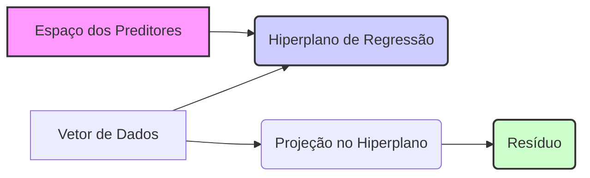
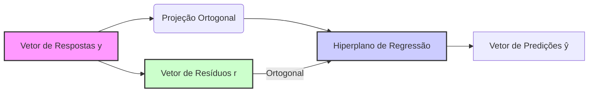
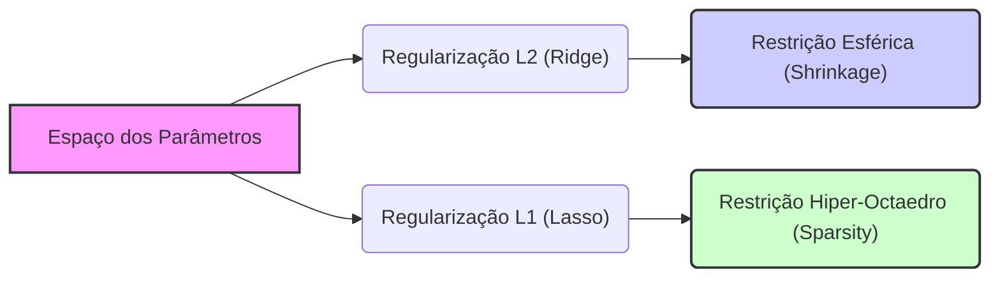
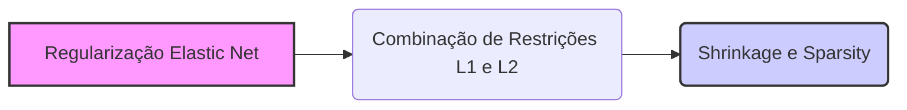
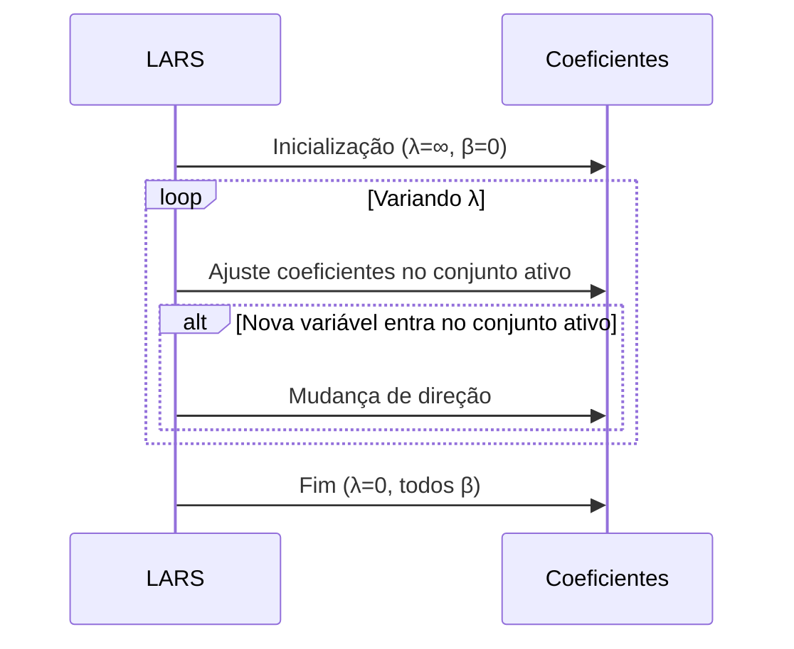

## Interpretações Geométricas em Modelos de Regressão Linear

<imagem: Diagrama mostrando um espaço vetorial tridimensional com um hiperplano representando o modelo linear, vetores de dados, projeções dos dados no hiperplano, e resíduos, ilustrando a interpretação geométrica dos conceitos de regressão>


### Introdução

A compreensão geométrica dos modelos de regressão linear fornece *insights* valiosos e complementares às interpretações algébricas e estatísticas. Ao visualizarmos os dados, o espaço dos preditores e o modelo de regressão como objetos geométricos, podemos entender a fundo o significado das operações de mínimos quadrados, o papel da ortogonalidade, a natureza das regularizações, e os algoritmos de seleção de variáveis. Este capítulo explora as interpretações geométricas mais importantes dos modelos de regressão linear, fornecendo uma base sólida para a compreensão e utilização das técnicas abordadas.

### Interpretação Geométrica da Regressão Linear

Nesta seção, exploraremos as interpretações geométricas dos principais conceitos da regressão linear, que incluem:

**Espaço dos Preditores e o Hiperplano de Regressão**
O espaço dos preditores em um modelo de regressão linear pode ser visualizado como um espaço vetorial [^46]. Cada preditor $x_j$ é um eixo nesse espaço, e cada observação pode ser representada como um ponto nesse espaço, descrito por um vetor de preditores, $x_i = (x_{i1}, x_{i2}, \ldots, x_{ip})$. O modelo de regressão linear define uma relação linear entre esses preditores e a variável resposta $y$, que geometricamente corresponde a um hiperplano nesse espaço [^46].
Este hiperplano, também conhecido como o plano de regressão, representa as predições do modelo para todos os valores possíveis dos preditores, dado pelos parâmetros $\beta_0, \beta_1, \ldots, \beta_p$, definidos pela equação:
$$
\hat{y} = \beta_0 + \sum_{j=1}^p \beta_j x_j.
$$
> 💡 **Exemplo Numérico:**
> Considere um modelo de regressão linear com dois preditores, $x_1$ e $x_2$, e um intercepto $\beta_0$. O modelo é dado por $\hat{y} = \beta_0 + \beta_1 x_1 + \beta_2 x_2$. Geometricamente, cada observação $(x_{i1}, x_{i2})$ pode ser vista como um ponto no plano $x_1$-$x_2$. O modelo de regressão define um plano nesse espaço tridimensional (incluindo o eixo $\hat{y}$). Por exemplo, se $\beta_0 = 1$, $\beta_1 = 2$, e $\beta_2 = -1$, a predição para um ponto $(x_1 = 2, x_2 = 3)$ seria $\hat{y} = 1 + 2(2) - 1(3) = 2$. Este ponto $(2, 3, 2)$ reside no plano de regressão.
> ```mermaid
>  graph LR
>      A[Eixo x1] --> C(Plano x1-x2);
>      B[Eixo x2] --> C;
>      C --> D[Hiperplano de Regressão];
>      E[Ponto de Dado (x1,x2,y)] --> D;
> ```

**Mínimos Quadrados como Projeção Ortogonal**
O método de mínimos quadrados, utilizado para ajustar os modelos lineares, tem uma interpretação geométrica muito clara: a solução de mínimos quadrados corresponde à projeção ortogonal do vetor de respostas $y$ no hiperplano definido pelos preditores [^12]. Seja $X$ a matriz de design e $\hat{y}$ o vetor de predições obtido pelo modelo de regressão linear, o vetor de resíduos,  $r = y - \hat{y}$,  é ortogonal ao espaço gerado pelas colunas da matriz X. Em termos geométricos, isso significa que a solução de mínimos quadrados $\hat{\beta}$ é tal que o vetor de predições $\hat{y}$ é o ponto mais próximo do vetor de respostas $y$ no espaço gerado pelas colunas de X, no sentido da distância euclidiana. O vetor de resíduos $r$, representa a diferença entre o vetor de resposta y e a sua projeção $\hat{y}$, e portanto é ortogonal ao hiperplano de regressão.


> 💡 **Exemplo Numérico:**
> Suponha que temos um vetor de respostas $y = \begin{bmatrix} 5 \\ 8 \\ 10 \end{bmatrix}$ e uma matriz de design $X = \begin{bmatrix} 1 & 2 \\ 1 & 3 \\ 1 & 4 \end{bmatrix}$. O vetor $\hat{y}$ é a projeção ortogonal de $y$ no espaço gerado pelas colunas de $X$. Calculando $\hat{\beta} = (X^T X)^{-1} X^T y$:
>
> $X^T = \begin{bmatrix} 1 & 1 & 1 \\ 2 & 3 & 4 \end{bmatrix}$
>
> $X^T X = \begin{bmatrix} 1 & 1 & 1 \\ 2 & 3 & 4 \end{bmatrix} \begin{bmatrix} 1 & 2 \\ 1 & 3 \\ 1 & 4 \end{bmatrix} = \begin{bmatrix} 3 & 9 \\ 9 & 29 \end{bmatrix}$
>
> $(X^T X)^{-1} = \frac{1}{3 \cdot 29 - 9 \cdot 9} \begin{bmatrix} 29 & -9 \\ -9 & 3 \end{bmatrix} = \frac{1}{6} \begin{bmatrix} 29 & -9 \\ -9 & 3 \end{bmatrix}$
>
> $X^T y = \begin{bmatrix} 1 & 1 & 1 \\ 2 & 3 & 4 \end{bmatrix} \begin{bmatrix} 5 \\ 8 \\ 10 \end{bmatrix} = \begin{bmatrix} 23 \\ 74 \end{bmatrix}$
>
> $\hat{\beta} = \frac{1}{6} \begin{bmatrix} 29 & -9 \\ -9 & 3 \end{bmatrix} \begin{bmatrix} 23 \\ 74 \end{bmatrix} = \frac{1}{6} \begin{bmatrix} 667 - 666 \\ -207 + 222 \end{bmatrix} = \frac{1}{6} \begin{bmatrix} 1 \\ 15 \end{bmatrix} = \begin{bmatrix} 1/6 \\ 15/6 \end{bmatrix} = \begin{bmatrix} 0.1667 \\ 2.5 \end{bmatrix}$
>
> $\hat{y} = X\hat{\beta} = \begin{bmatrix} 1 & 2 \\ 1 & 3 \\ 1 & 4 \end{bmatrix} \begin{bmatrix} 0.1667 \\ 2.5 \end{bmatrix} = \begin{bmatrix} 5.1667 \\ 7.6667 \\ 10.1667 \end{bmatrix}$
>
> O vetor de resíduos é $r = y - \hat{y} = \begin{bmatrix} 5 \\ 8 \\ 10 \end{bmatrix} - \begin{bmatrix} 5.1667 \\ 7.6667 \\ 10.1667 \end{bmatrix} = \begin{bmatrix} -0.1667 \\ 0.3333 \\ -0.1667 \end{bmatrix}$.
>
> O produto escalar entre os resíduos e as colunas de $X$ será aproximadamente zero, confirmando a ortogonalidade:
> $X^T r = \begin{bmatrix} 1 & 1 & 1 \\ 2 & 3 & 4 \end{bmatrix} \begin{bmatrix} -0.1667 \\ 0.3333 \\ -0.1667 \end{bmatrix} = \begin{bmatrix} -0.1667 + 0.3333 - 0.1667 \\ -0.3334 + 0.9999 - 0.6668 \end{bmatrix} = \begin{bmatrix} -0.0001 \\ -0.0003 \end{bmatrix} \approx \begin{bmatrix} 0 \\ 0 \end{bmatrix}$.
>
> Isso demonstra que os resíduos são ortogonais ao espaço gerado pelas colunas de $X$, e que $\hat{y}$ é a projeção ortogonal de $y$ nesse espaço.

**Resíduos como Vetores Ortogonais**
Na regressão linear, os resíduos $r_i = y_i - \hat{y}_i$ representam a diferença entre os valores observados e os valores preditos do modelo. Geometricamente, cada resíduo $r_i$ corresponde à distância vertical entre um ponto de dado e o hiperplano de regressão [^13].
A condição de ortogonalidade dos resíduos com o espaço dos preditores é fundamental na solução de mínimos quadrados:
$$ X^T(y - X\hat{\beta}) = 0 $$
Esta equação, em termos geométricos, significa que o vetor de resíduos $(y-X\hat{\beta})$ é ortogonal ao espaço gerado pelas colunas de $X$, garantindo que o vetor das predições $\hat{y}=X\hat{\beta}$ é o ponto mais próximo do vetor $y$.

> 💡 **Exemplo Numérico:**
> Usando o exemplo anterior, o vetor de resíduos foi calculado como $r = \begin{bmatrix} -0.1667 \\ 0.3333 \\ -0.1667 \end{bmatrix}$. Cada componente desse vetor representa a distância vertical entre um ponto de dado $y_i$ e o ponto correspondente no hiperplano de regressão $\hat{y}_i$. A ortogonalidade de $r$ com as colunas de $X$ (demonstrada no exemplo anterior) é a garantia de que $\hat{y}$ é a melhor aproximação de $y$ no espaço linear gerado pelas colunas de $X$.

**Lemma 16:** O Subespaço da Matriz de Design

As colunas da matriz de design X formam uma base para o subespaço de preditores, ou seja, os diferentes vetores que contém os valores das variáveis preditoras para as observações formam uma base para o espaço de predições. O processo de mínimos quadrados define uma projeção ortogonal do vetor resposta nesse espaço, resultando na predição $\hat{y} = X\beta$, onde $\beta$ é o vetor de parâmetros estimados. O vetor de resíduos $r = y-\hat{y}$ é ortogonal ao espaço gerado pelas colunas da matriz X.

**Corolário 16:** Projeção em um subespaço

As predições da regressão linear resultam de uma projeção ortogonal da variável resposta num subespaço definido pelos preditores, onde o resíduo é a menor distância possível entre o vetor resposta e o subespaço dos preditores. O modelo de regressão linear tenta construir um subespaço onde a predição seja o mais próximo possível do vetor resposta.

### Interpretação Geométrica da Regularização

<imagem: Diagrama comparando o efeito das penalidades L1 e L2 no espaço dos parâmetros, mostrando como elas levam a soluções com diferentes propriedades de esparsidade e *shrinkage*>


As técnicas de regularização em modelos lineares podem ser interpretadas geometricamente, elucidando como elas promovem soluções mais simples e generalizáveis.

**Regularização L2 (Ridge) como Restrição Esférica**

Na regularização L2 (Ridge), a função objetivo adiciona uma penalidade proporcional à soma dos quadrados dos coeficientes, $||\beta||_2^2$, à função de custo. Geometricamente, essa penalidade corresponde a uma restrição esférica no espaço dos parâmetros, onde a solução deve pertencer ao interior ou ao contorno de uma hiperesfera centrada na origem. Esta restrição tende a encolher os coeficientes, aproximando-os de zero, o que reduz a *variance* do modelo.
A solução do problema de Ridge, $\hat{\beta}_{ridge} = (X^T X + \lambda I)^{-1} X^T y$, encontra o ponto onde a elipse da função RSS intersecta a hiperesfera definida pela restrição L2. Os contornos das soluções do método de mínimos quadrados são elipses, e estas elipses intersectam os contornos da norma L2 na solução. As soluções de Ridge, portanto, correspondem a projeções da solução de mínimos quadrados na região de restrição definida por $||\beta||_2^2 \le t$.
Para valores maiores de $\lambda$, a restrição se torna mais forte, e o raio da hiperesfera é reduzido, levando a uma maior redução dos coeficientes e mais estabilidade.

> 💡 **Exemplo Numérico:**
> Considere o mesmo conjunto de dados anterior, $X$ e $y$. Vamos aplicar a regularização Ridge com $\lambda = 0.5$. A solução de Ridge é dada por $\hat{\beta}_{ridge} = (X^T X + \lambda I)^{-1} X^T y$.
>
> $X^T X = \begin{bmatrix} 3 & 9 \\ 9 & 29 \end{bmatrix}$ (calculado anteriormente).
>
> $\lambda I = 0.5 \begin{bmatrix} 1 & 0 \\ 0 & 1 \end{bmatrix} = \begin{bmatrix} 0.5 & 0 \\ 0 & 0.5 \end{bmatrix}$
>
> $X^T X + \lambda I = \begin{bmatrix} 3.5 & 9 \\ 9 & 29.5 \end{bmatrix}$
>
> $(X^T X + \lambda I)^{-1} = \frac{1}{3.5 \cdot 29.5 - 9 \cdot 9} \begin{bmatrix} 29.5 & -9 \\ -9 & 3.5 \end{bmatrix} = \frac{1}{24.25} \begin{bmatrix} 29.5 & -9 \\ -9 & 3.5 \end{bmatrix}$
>
> $\hat{\beta}_{ridge} = \frac{1}{24.25} \begin{bmatrix} 29.5 & -9 \\ -9 & 3.5 \end{bmatrix} \begin{bmatrix} 23 \\ 74 \end{bmatrix} = \frac{1}{24.25} \begin{bmatrix} 678.5 - 666 \\ -207 + 259 \end{bmatrix} = \frac{1}{24.25} \begin{bmatrix} 12.5 \\ 52 \end{bmatrix} = \begin{bmatrix} 0.515 \\ 2.144 \end{bmatrix}$
>
> Comparando com $\hat{\beta} = \begin{bmatrix} 0.1667 \\ 2.5 \end{bmatrix}$ (OLS), vemos que os coeficientes foram reduzidos em magnitude.  A restrição esférica da regularização L2 "encolhe" os coeficientes em direção à origem.

**Regularização L1 (Lasso) como Restrição em um Hiper-Octaedro**

Na regularização L1 (Lasso), a função objetivo adiciona uma penalidade proporcional à soma dos valores absolutos dos coeficientes, $||\beta||_1$, à função de custo. Geometricamente, essa penalidade corresponde a uma restrição em forma de hiper-octaedro no espaço dos parâmetros, onde a solução deve pertencer ao interior ou ao contorno deste objeto. Esta restrição tende a gerar soluções esparsas, já que o contorno do hiper-octaedro tem quinas, e muitas vezes intersecta a região definida pela RSS nos eixos, forçando alguns coeficientes a serem exatamente zero [^71].
A solução do Lasso corresponde a um ponto onde a elipse da função RSS intersecta o hiper-octaedro da penalidade L1, $\lambda ||\beta||_1 \le t$. A solução do Lasso pode ser vista como uma projeção da solução de mínimos quadrados na região de restrição definida por $||\beta||_1 \le t$, mas a geometria não-suave do hiper-octaedro favorece soluções com alguns coeficientes iguais a zero, o que significa que o modelo final depende de um subconjunto pequeno de parâmetros.

> 💡 **Exemplo Numérico:**
> Para o mesmo conjunto de dados, vamos demonstrar o efeito do Lasso. O cálculo exato da solução do Lasso é mais complexo e requer métodos iterativos, mas para fins ilustrativos, vamos supor que a solução do Lasso com um $\lambda$ específico resultou em $\hat{\beta}_{lasso} = \begin{bmatrix} 0 \\ 2.3 \end{bmatrix}$. Note que o primeiro coeficiente foi definido como zero. Isso ilustra como a penalidade L1 leva à esparsidade do modelo, selecionando apenas os preditores mais relevantes. A restrição em forma de hiper-octaedro favorece que a solução seja encontrada em um dos eixos, forçando alguns coeficientes a zero.

**Elastic Net como uma Combinação de Restrições**

Na Elastic Net, a função objetivo combina penalidades L1 e L2. Geometricamente, a restrição correspondente é uma combinação das regiões definidas por ambas as penalidades, com cantos mais suaves do que o diamante definido pelo Lasso, e com encolhimento dos parâmetros, como no Ridge. A solução do Elastic Net corresponde a uma combinação das soluções do Lasso e Ridge, gerando modelos que promovem tanto *sparsity* como *shrinkage* nos coeficientes.


> 💡 **Exemplo Numérico:**
> Suponha que, para um dado $\lambda$ e uma proporção entre as penalidades L1 e L2, a solução do Elastic Net seja $\hat{\beta}_{elastic} = \begin{bmatrix} 0.2 \\ 2.2 \end{bmatrix}$. Este exemplo mostra que a Elastic Net combina a propriedade de *shrinkage* do Ridge (coeficientes não exatamente zero) e a tendência à esparsidade do Lasso (coeficientes menores do que os estimados por OLS).

**Lemma 17:** Interpretação da Restrição nos Coeficientes

As penalizações L1 e L2 podem ser entendidas como restrições no espaço dos parâmetros, sendo o objetivo minimizar a função de custo sujeita a essa restrição.
- A restrição L1 é dada pela região $||\beta||_1 \leq t$, onde $t$ é um parâmetro relacionado com $\lambda$. Esta região corresponde a um hiper-octaedro, que tem cantos nos eixos. A interseção entre este hiper-octaedro e as curvas de nível da função de custo resulta em soluções onde os coeficientes tendem a ser zero, induzindo *sparsity*.
- A restrição L2 é dada pela região $||\beta||_2^2 \leq t$, onde $t$ também é um parâmetro relacionado com $\lambda$. Esta região corresponde a uma hiperesfera, que não tem quinas, e induz os coeficientes a se tornarem menores em módulo, mas nunca totalmente iguais a zero, levando a uma solução mais estável que o Lasso.
- A restrição da Elastic Net corresponde a uma combinação linear das normas L1 e L2, e a região correspondente tem cantos menos pronunciados que a norma L1 e a forma mais arredondada que a norma L2.

**Corolário 17:**  Efeito Geométrico de Lambda

O parâmetro de regularização, $\lambda$, controla o tamanho da região de restrição imposta pelo modelo de regularização. Um $\lambda$ maior impõe restrições mais fortes, com uma região de restrição menor, enquanto um $\lambda$ menor impõe restrições mais fracas, com uma região maior. A escolha de $\lambda$ define o equilíbrio entre o ajuste dos dados e a estabilidade do modelo, e a sua interpretação geométrica ajuda a entender o impacto da regularização nas propriedades da solução final.

### Algoritmos de Caminho e a Geometria do Lasso

<imagem: Descrição detalhada da imagem: Gráfico da trajetória de coeficientes ao longo de um caminho de regularização, mostrando como as direções dos coeficientes mudam à medida que o parâmetro de regularização varia. Os coeficientes se movem em linha reta entre mudanças no conjunto ativo.>

A interpretação geométrica do algoritmo LARS nos ajuda a entender o significado de como o caminho de solução do Lasso é construído.

**LARS: um Caminho de Soluções Piecewise Linear**

O algoritmo LARS computa todo o caminho de soluções do Lasso, variando o parâmetro de regularização $\lambda$ desde zero até um ponto onde todos os coeficientes são nulos. A interpretação geométrica desse caminho é que ele é *piecewise linear*, ou seja, consiste em uma série de segmentos de linha reta [^76]. Cada mudança na direção da solução corresponde à entrada ou saída de uma variável no conjunto ativo.
Ao longo do caminho do LARS, todos os coeficientes no conjunto ativo, que corresponde às variáveis com maiores correlações com o resíduo atual, se movem juntos até que uma nova variável tenha uma correlação igual, momento em que ela também é incluida no conjunto ativo e o processo de movimentos dos parâmetros continua, alterando a direção no caminho.
A piecewise linearidade garante que o número de passos no LARS seja finito, no máximo igual ao número de preditores, e também simplifica a computação do caminho inteiro, evitando a necessidade de iterar por todo o espaço de parâmetros.


> 💡 **Exemplo Numérico:**
> Vamos simular um exemplo simplificado do caminho do LARS. Imagine que temos três preditores $x_1, x_2, x_3$. Inicialmente, $x_1$ é o mais correlacionado com $y$, e seu coeficiente $\beta_1$ começa a crescer linearmente enquanto os outros são 0. Em um certo ponto, $x_2$ se torna igualmente correlacionado com o resíduo, e então $\beta_2$ também começa a crescer, enquanto $\beta_1$ continua, mas com uma taxa de crescimento menor. O caminho da solução do Lasso no espaço dos coeficientes ($\beta_1, \beta_2, \beta_3$) seria uma série de segmentos de linha reta, onde as direções mudam quando novas variáveis entram no conjunto ativo.
> ```mermaid
> graph LR
>     A[Início (λ=∞)] --> B(β1 cresce);
>     B --> C(β1 e β2 crescem);
>     C --> D(β1, β2 e β3 crescem);
>     D --> E[Fim (λ=0)];
>     style A fill:#f9f,stroke:#333,stroke-width:2px
>     style E fill:#ccf,stroke:#333,stroke-width:2px
> ```

**Interpretação da Condição de Otimalidade**

A condição de otimalidade do Lasso requer que o gradiente da RSS (que define a elipse dos mínimos quadrados) seja ortogonal ao hiperplano gerado pelas variáveis selecionadas, e que a norma L∞ da correlação com os preditores que estão fora do conjunto ativo seja menor que um certo valor ($\lambda$). O algoritmo LARS garante essa condição ao manter a igualdade das correlações com o resíduo para todas as variáveis no conjunto ativo, definindo o caminho da solução.

**Lemma 18:** Relação entre a Geometria e o LARS

A construção geométrica do algoritmo LARS e a piecewise linearidade do caminho de soluções do Lasso são uma consequência direta da forma da penalidade L1 e sua condição de otimalidade. Ao encontrar o preditor mais correlacionado com o resíduo e ao mover seus coeficientes até que outro preditor se torne igualmente correlacionado, o algoritmo segue um caminho que é garantido de ser piecewise linear [^76].

**Corolário 18:** A Geometria e a Eficiência do LARS

A interpretação geométrica do caminho de soluções do LARS, que se baseia na condição de ortogonalidade, permite computar todo o caminho das soluções do Lasso de maneira eficiente, sem a necessidade de computar as soluções para cada valor de $\lambda$ em separado.

### Conclusão

A interpretação geométrica dos modelos de regressão linear e suas extensões fornecem uma intuição importante para a compreensão do funcionamento dos modelos e da sua relação com os dados. Ao visualizarmos o espaço dos preditores, o hiperplano da regressão, a projeção ortogonal dos resíduos, e as regiões de restrição da regularização, somos capazes de entender de forma mais profunda os fundamentos das técnicas de modelagem, incluindo os métodos de seleção de variáveis e de regularização. A interpretação geométrica também é essencial para entender as propriedades e características dos algoritmos de caminho.

### Referências

[^46]: "The predicted values at an input vector xo are given by f(xo) = (1 : xo)Tẞ"
[^12]: "Least squares fitting is intuitively satisfying no matter how the data arise; the criterion measures the average lack of fit."
[^13]: "We minimize RSS(3) = ||y – Xβ||2 by choosing ẞ so that the residual vector y - ŷ is orthogonal to this subspace"
[^71]: "In this view, the lasso, ridge regression and best subset selection are Bayes estimates with different priors. Note, however, that they are derived as posterior modes, that is, maximizers of the posterior."
[^25]: "When there are many correlated variables in a linear regression model, their coefficients can become poorly determined and exhibit high variance."
[^76]: "By construction the coefficients in LAR change in a piecewise linear fashion."
[^30]: "The algorithm Least Angle Regression (LARS), generates the path of solutions of LASSO efficiently."
[^78]: "In Figure 3.7 we have plotted the estimated prediction error versus the quantity..."
