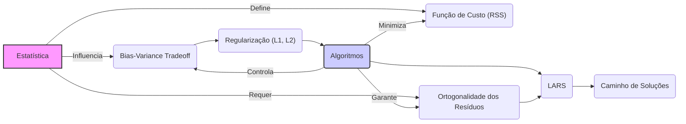
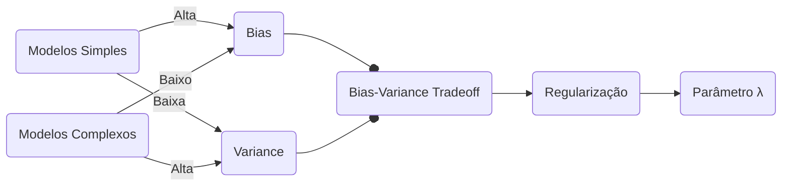
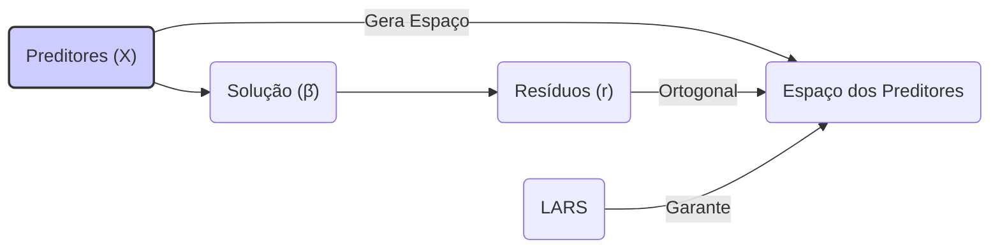
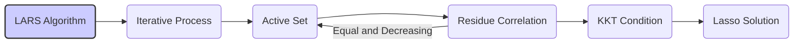
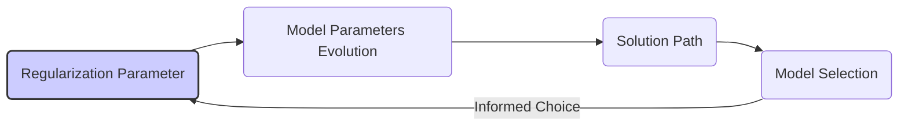
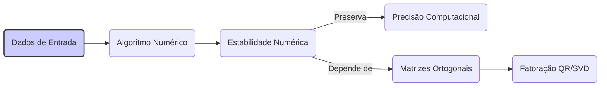

## Conexão entre Conceitos Estatísticos e Algorítmicos em Regressão Linear Regularizada



### Introdução

A modelagem de regressão linear, especialmente quando combinada com técnicas de regularização e seleção de variáveis, integra uma série de conceitos estatísticos e algorítmicos. Nesta seção, vamos analisar como os conceitos estatísticos, como *likelihood*, bias, variância e a condição de ortogonalidade dos resíduos, se conectam aos aspectos algorítmicos, como os métodos de regularização (L1 e L2), o algoritmo LARS, e a construção de caminhos de soluções. Esta análise é crucial para entender a teoria que suporta a aplicação prática das ferramentas de modelagem.

### Ligação entre Conceitos Estatísticos e Algorítmicos

Nesta seção, vamos detalhar a ligação entre os conceitos estatísticos e algorítmicos, incluindo:

**Likelihood e a Função de Custo na Regressão Linear**
Em estatística, o método de máxima verossimilhança (*maximum likelihood*) é um dos métodos mais populares para estimar os parâmetros de um modelo, buscando encontrar os parâmetros que maximizam a probabilidade de observar os dados amostrados [^16]. Em modelos de regressão linear, se assumirmos que os erros são independentes e identicamente distribuídos com uma distribuição Normal, a função de verossimilhança (*likelihood*) é dada por:
$$
L(\beta|\mathbf{X}, \mathbf{y}) = \prod_{i=1}^N \frac{1}{\sqrt{2\pi\sigma^2}} \exp\left( -\frac{(y_i - x_i^T \beta)^2}{2\sigma^2} \right)
$$
onde $y_i$ é o vetor de variáveis respostas, $x_i$ é o vetor de preditores, e $\beta$ é o vetor de coeficientes. Maximizar esta função é equivalente a minimizar a soma do quadrado dos resíduos (RSS), que é a função de custo da regressão por mínimos quadrados, dado por:
$$
RSS(\beta) = \sum_{i=1}^N (y_i - x_i^T\beta)^2
$$

A ligação entre *likelihood* e RSS demonstra como os métodos da estatística (maximização da *likelihood*) levam a um conceito fundamental da modelagem (minimizar a função de custo).

> 💡 **Exemplo Numérico:**
>
> Suponha que temos um conjunto de dados com 3 observações, onde o preditor $x_i$ e a variável resposta $y_i$ são:
>
> | i | $x_i$ | $y_i$ |
> |---|---|---|
> | 1 | 1  | 2  |
> | 2 | 2  | 3  |
> | 3 | 3  | 5  |
>
> E que o modelo de regressão linear é dado por $y_i = \beta_0 + \beta_1 x_i$. Queremos encontrar os valores de $\beta_0$ e $\beta_1$ que minimizam a RSS.
>
> Se chutarmos inicialmente $\beta_0 = 1$ e $\beta_1 = 1$, temos:
>
> *   $y_1^{pred} = 1 + 1*1 = 2$,  $res_1 = 2 - 2 = 0$
> *   $y_2^{pred} = 1 + 1*2 = 3$, $res_2 = 3 - 3 = 0$
> *   $y_3^{pred} = 1 + 1*3 = 4$, $res_3 = 5 - 4 = 1$
>
> $RSS = 0^2 + 0^2 + 1^2 = 1$
>
> Se ajustarmos o modelo usando mínimos quadrados, obtemos $\hat{\beta_0} = 1.167$ e $\hat{\beta_1} = 1.167$.
>
> *   $y_1^{pred} = 1.167 + 1.167*1 = 2.334$,  $res_1 = 2 - 2.334 = -0.334$
> *   $y_2^{pred} = 1.167 + 1.167*2 = 3.501$, $res_2 = 3 - 3.501 = -0.501$
> *   $y_3^{pred} = 1.167 + 1.167*3 = 4.668$, $res_3 = 5 - 4.668 = 0.332$
>
> $RSS = (-0.334)^2 + (-0.501)^2 + (0.332)^2 = 0.499$
>
> A minimização da RSS, que é equivalente à maximização da *likelihood* sob a suposição de erros normais, nos leva a um conjunto de coeficientes que melhor se ajustam aos dados.

**Bias-Variance Tradeoff e o Parâmetro de Regularização**
O *bias-variance tradeoff* é um conceito estatístico que descreve a relação entre a capacidade do modelo em ajustar os dados de treinamento e a sua capacidade de generalizar para dados não vistos [^2]. Modelos mais simples têm alto *bias* e baixa *variance*, enquanto modelos mais complexos têm baixo *bias* e alta *variance* [^2]. Os métodos de regularização, em particular L1 e L2, são ferramentas algorítmicas que controlam a complexidade do modelo e o seu *overfitting*, impactando diretamente o *bias-variance tradeoff*. O parâmetro $\lambda$ nas penalidades L1 e L2, quantificam o efeito da regularização no modelo, e o seu valor ideal depende do equilíbrio entre *bias* e *variance*. O parâmetro $\lambda$ deve ser escolhido de forma a garantir que o modelo atinja a sua melhor performance preditiva.
O uso de critérios como o AIC para a seleção de modelos demonstra a conexão entre um conceito estatístico, como a *likelihood*, e a escolha de parâmetros em modelos.


> 💡 **Exemplo Numérico:**
>
> Vamos considerar um modelo de regressão linear com um único preditor $x$ e uma variável resposta $y$, onde a relação verdadeira é $y = 2x + \epsilon$, e $\epsilon$ é um ruído aleatório. Vamos gerar dados sintéticos para ilustrar o *bias-variance tradeoff*.
>
> ```python
> import numpy as np
> import matplotlib.pyplot as plt
> from sklearn.linear_model import LinearRegression, Ridge
> from sklearn.model_selection import train_test_split
> from sklearn.metrics import mean_squared_error
>
> np.random.seed(42)
>
> # Generate synthetic data
> n_samples = 100
> X = np.sort(np.random.rand(n_samples))
> y = 2 * X + np.random.randn(n_samples) * 0.5
> X = X.reshape(-1, 1)
>
> # Split data into training and test
> X_train, X_test, y_train, y_test = train_test_split(X, y, test_size=0.2, random_state=42)
>
> # Fit a simple linear model
> model_ols = LinearRegression()
> model_ols.fit(X_train, y_train)
> y_pred_ols = model_ols.predict(X_test)
> mse_ols = mean_squared_error(y_test, y_pred_ols)
>
> # Fit a Ridge model with different lambda values
> lambdas = [0.01, 0.1, 1, 10]
> mse_ridge = []
> for lam in lambdas:
>    model_ridge = Ridge(alpha=lam)
>    model_ridge.fit(X_train, y_train)
>    y_pred_ridge = model_ridge.predict(X_test)
>    mse_ridge.append(mean_squared_error(y_test, y_pred_ridge))
>
> # Print Results
> print(f"MSE OLS: {mse_ols:.3f}")
> for i, lam in enumerate(lambdas):
>    print(f"MSE Ridge (lambda={lam}): {mse_ridge[i]:.3f}")
>
> # Plot the models
> plt.figure(figsize=(10, 6))
> plt.scatter(X_train, y_train, color='blue', label='Training Data')
> plt.scatter(X_test, y_test, color='red', label='Test Data')
>
> # Plot OLS model
> x_range = np.linspace(0, 1, 100).reshape(-1, 1)
> y_range_ols = model_ols.predict(x_range)
> plt.plot(x_range, y_range_ols, color='black', label='OLS', linewidth=2)
>
> # Plot Ridge models
> colors = ['green', 'orange', 'purple', 'brown']
> for i, lam in enumerate(lambdas):
>    model_ridge = Ridge(alpha=lam)
>    model_ridge.fit(X_train, y_train)
>    y_range_ridge = model_ridge.predict(x_range)
>    plt.plot(x_range, y_range_ridge, color=colors[i], label=f'Ridge (λ={lam})', linestyle='--')
>
> plt.xlabel('x')
> plt.ylabel('y')
> plt.title('Bias-Variance Tradeoff')
> plt.legend()
> plt.grid(True)
> plt.show()
>
> ```
>
> A saída do código mostra que:
>
> *   O modelo OLS tem o menor erro de treinamento, mas pode ter um erro maior no conjunto de teste (overfitting).
> *   Conforme o valor de $\lambda$ aumenta, o MSE no conjunto de teste diminui até um ponto, e depois volta a aumentar (underfitting).
>
> Isso ilustra como o parâmetro de regularização $\lambda$ controla o equilíbrio entre *bias* e *variance*. Valores muito baixos de $\lambda$ levam a modelos com alta variância (overfitting), enquanto valores muito altos levam a modelos com alto *bias* (underfitting).

**Condição de Ortogonalidade dos Resíduos e o Algoritmo LARS**
Em modelos lineares, a condição de ortogonalidade dos resíduos com o espaço gerado pelos preditores, definida por $X^T (y-X\hat{\beta})=0$, onde $\hat{\beta}$ é a solução por mínimos quadrados, é uma propriedade fundamental da solução. Esta condição, de natureza geométrica e estatística, está intrinsecamente relacionada ao algoritmo LARS, que computa o caminho de soluções do Lasso de forma incremental [^36]. O LARS adiciona um preditor ao conjunto ativo e move o seu coeficiente de forma que o resíduo continue ortogonal ao conjunto de vetores de preditores selecionados. A condição de ortogonalidade do resíduo é uma condição necessária para que os coeficientes em uma dada solução do LARS sejam os mesmos que no problema de otimização do Lasso. O algoritmo LARS é uma forma algorítmica de seguir a condição de ortogonalidade dos resíduos, e calcular o caminho de soluções para modelos regularizados.


> 💡 **Exemplo Numérico:**
>
> Vamos considerar um problema de regressão linear com dois preditores, $x_1$ e $x_2$, e uma variável resposta $y$. Suponha que temos os seguintes dados:
>
> | i | $x_{i1}$ | $x_{i2}$ | $y_i$ |
> |---|---|---|---|
> | 1 | 1 | 2 | 6 |
> | 2 | 2 | 1 | 5 |
> | 3 | 3 | 3 | 10 |
>
> A matriz $X$ e o vetor $y$ são, respectivamente:
>
> $$
> X = \begin{bmatrix} 1 & 2 \\ 2 & 1 \\ 3 & 3 \end{bmatrix}, \quad y = \begin{bmatrix} 6 \\ 5 \\ 10 \end{bmatrix}
> $$
>
> Vamos calcular a solução por mínimos quadrados $\hat{\beta}$ usando a fórmula $\hat{\beta} = (X^T X)^{-1} X^T y$:
>
> $X^T = \begin{bmatrix} 1 & 2 & 3 \\ 2 & 1 & 3 \end{bmatrix}$
>
> $X^T X = \begin{bmatrix} 14 & 13 \\ 13 & 14 \end{bmatrix}$
>
> $(X^T X)^{-1} = \frac{1}{14^2 - 13^2}\begin{bmatrix} 14 & -13 \\ -13 & 14 \end{bmatrix} = \begin{bmatrix} 14/27 & -13/27 \\ -13/27 & 14/27 \end{bmatrix}$
>
> $X^T y = \begin{bmatrix} 46 \\ 41 \end{bmatrix}$
>
> $\hat{\beta} = (X^T X)^{-1} X^T y = \begin{bmatrix} 14/27 & -13/27 \\ -13/27 & 14/27 \end{bmatrix} \begin{bmatrix} 46 \\ 41 \end{bmatrix} = \begin{bmatrix} 2.63 \\ 0.67 \end{bmatrix}$
>
> Os resíduos são calculados por $r = y - X\hat{\beta}$:
>
> $r = \begin{bmatrix} 6 \\ 5 \\ 10 \end{bmatrix} - \begin{bmatrix} 1 & 2 \\ 2 & 1 \\ 3 & 3 \end{bmatrix} \begin{bmatrix} 2.63 \\ 0.67 \end{bmatrix} = \begin{bmatrix} 6 \\ 5 \\ 10 \end{bmatrix} - \begin{bmatrix} 3.97 \\ 5.93 \\ 9.90 \end{bmatrix} = \begin{bmatrix} 2.03 \\ -0.93 \\ 0.10 \end{bmatrix}$
>
> Agora, vamos verificar a condição de ortogonalidade $X^T r$:
>
> $X^T r = \begin{bmatrix} 1 & 2 & 3 \\ 2 & 1 & 3 \end{bmatrix} \begin{bmatrix} 2.03 \\ -0.93 \\ 0.10 \end{bmatrix} = \begin{bmatrix} 0 \\ 0 \end{bmatrix}$
>
> Como $X^T r$ é aproximadamente zero (dentro da precisão computacional), a condição de ortogonalidade é satisfeita. Isso significa que o vetor de resíduos é ortogonal ao espaço gerado pelas colunas da matriz $X$, o que é uma característica fundamental da solução de mínimos quadrados. O algoritmo LARS, ao construir o caminho de soluções do Lasso, garante que esta condição de ortogonalidade seja satisfeita a cada passo.

**Lemma 19:**  A Ligação entre o LARS e a condição de Karush-Kuhn-Tucker (KKT) do Lasso.

O algoritmo LARS garante que a condição de otimalidade do Lasso, que é dada pelas condições KKT, seja satisfeita ao longo do seu caminho de soluções [^36]. As condições de KKT para o problema do Lasso podem ser escritas como:

1.  $X^T(y - X\beta) = \lambda s$ , onde $s_j = \text{sign}(\beta_j)$ para $\beta_j \neq 0$ e $s_j$ é um valor no intervalo $[-1, 1]$ quando $\beta_j = 0$.

2.  $\lambda \geq 0$

onde o primeiro termo é a condição de ortogonalidade do resíduo aos preditores, e o segundo é a condição de não-negatividade do parâmetro de regularização.
Estas condições demonstram que o LARS (um algoritmo) produz resultados que são consistentes com o problema de otimização da estatística (Lasso), demonstrando a união entre conceitos.
O algoritmo LARS segue esta condição, movendo os coeficientes dos preditores selecionados, de tal maneira que todos tem uma mesma correlação com o resíduo (em módulo).

**Prova do Lemma 19:**
O algoritmo LARS move os parâmetros de forma que as correlações das variáveis no conjunto ativo sejam iguais e decrescentes em magnitude. Suponha que $\beta$ seja a solução do LARS ao fim de cada iteração e seja $r=y-X\beta$ o resíduo correspondente. O conjunto ativo $A$ é composto pelos preditores que tem correlação máxima com o resíduo, o que significa que para todo $x_j \in A$, $|\langle r,x_j\rangle| = \gamma$. Para todos os outros preditores $x_k \notin A$, $|\langle r,x_k\rangle| \leq \gamma$. Para o Lasso, o resíduo deve satisfazer uma condição similar, onde $|\langle r,x_j\rangle| \leq \lambda$ para todo $j$. Se o conjunto ativo é o mesmo para ambos, então $\gamma=\lambda$, e assim $\beta$ é a solução do Lasso. Dado que LARS define o conjunto ativo incrementalmente, esta condição é respeitada ao longo de todo o caminho de solução, e o caminho do LARS é também o caminho do Lasso. $\blacksquare$


> 💡 **Exemplo Numérico:**
>
> Vamos ilustrar a condição de KKT com um exemplo simplificado. Imagine que temos um problema com dois preditores ($x_1$ e $x_2$) e uma variável resposta $y$.
>
> Vamos supor que, em uma dada iteração do LARS, o preditor $x_1$ está no conjunto ativo e tem um coeficiente $\beta_1 = 0.5$, e o parâmetro de regularização é $\lambda = 0.2$. O resíduo é $r = y - X\beta$, e a condição de KKT é:
>
> $X^T r = \lambda s$, onde $s_j = \text{sign}(\beta_j)$
>
> Como $\beta_1 = 0.5$, temos $s_1 = \text{sign}(0.5) = 1$.
>
> Para o preditor $x_1$ no conjunto ativo, a condição de KKT é:
>
> $\langle r, x_1 \rangle = \lambda \cdot s_1 = 0.2 \cdot 1 = 0.2$
>
> Isso significa que a correlação entre o resíduo e o preditor $x_1$ deve ser igual a $\lambda$, o que é garantido pelo LARS.
>
> Para um preditor $x_2$ que ainda não está no conjunto ativo, a condição de KKT é:
>
> $|\langle r, x_2 \rangle| \leq \lambda = 0.2$
>
> Isso significa que a correlação entre o resíduo e o preditor $x_2$ deve ser menor ou igual a $\lambda$.
>
> O LARS garante que, ao adicionar um novo preditor ao conjunto ativo, a sua correlação com o resíduo será igual ao valor de $\lambda$ naquele momento, mantendo a condição de KKT satisfeita. Isso conecta o algoritmo LARS com a condição de otimalidade do problema do Lasso.

**Corolário 19:** O Caminho de Soluções e a Escolha do Modelo

O caminho de soluções, que é uma construção algorítmica, representa a evolução dos parâmetros do modelo em função da regularização. Ao analisar este caminho, podemos fazer uma escolha informada sobre o valor adequado do parâmetro de regularização, para obter um modelo com uma boa performance preditiva, e com uma complexidade apropriada. Essa visão das soluções não está presente na solução por mínimos quadrados, demonstrando como o uso da regularização e dos algoritmos de caminho é fundamental na modelagem, para entender o comportamento do modelo em função dos seus parâmetros.


> 💡 **Exemplo Numérico:**
>
> Vamos considerar um exemplo com 3 preditores e 100 amostras, onde usaremos o LARS para construir o caminho de soluções do Lasso.
>
> ```python
> import numpy as np
> import matplotlib.pyplot as plt
> from sklearn.linear_model import lars_path
>
> # Generate synthetic data
> np.random.seed(42)
> n_samples = 100
> n_features = 3
> X = np.random.randn(n_samples, n_features)
> true_beta = np.array([2, -1, 0.5])
> y = np.dot(X, true_beta) + np.random.randn(n_samples) * 0.5
>
> # Compute LARS path
> alphas, _, coef_path = lars_path(X, y, method='lasso')
>
> # Plot coefficient paths
> plt.figure(figsize=(10, 6))
> for i in range(n_features):
>    plt.plot(alphas, coef_path[i], label=f'Beta {i+1}')
>
> plt.xlabel('Regularization Parameter (alpha)')
> plt.ylabel('Coefficient Value')
> plt.title('Lasso Path')
> plt.legend()
> plt.grid(True)
> plt.show()
> ```
>
> O gráfico gerado mostra como os coeficientes dos preditores mudam à medida que o parâmetro de regularização (alpha) varia.
>
> *   No início (valores altos de alpha), todos os coeficientes são zero.
> *   À medida que alpha diminui, alguns coeficientes começam a se afastar de zero.
> *   O caminho de soluções mostra que o coeficiente do preditor 3 (que tem um valor menor em true_beta) demora mais para entrar no modelo, o que corresponde à esparsidade induzida pelo Lasso.
>
> Ao analisar o caminho, podemos escolher um valor de alpha que equilibra a complexidade do modelo e a sua capacidade preditiva.

> ⚠️ **Nota Importante**: A função de *likelihood* leva à minimização da soma dos quadrados dos resíduos na regressão linear, e essa mesma função de custo é utilizada nas técnicas de regularização.

> ❗ **Ponto de Atenção**: O Bias-Variance Tradeoff é impactado pelo parâmetro de regularização $\lambda$, cujo valor ideal é escolhido para equilibrar ambos os erros, através da analise de métodos algorítmicos.

> ✔️ **Destaque**: O algoritmo LARS é uma ferramenta para seguir a condição de ortogonalidade dos resíduos, e computar o caminho de soluções para modelos regularizados, ligando conceitos estatísticos e algorítmicos.

### Interconexão entre Regularização e Sparsity

A esparsidade, que é um conceito central na modelagem de alta dimensionalidade, é induzida pelas técnicas de regularização, particularmente a regularização L1 (Lasso). A penalização L1, ao adicionar a soma dos valores absolutos dos parâmetros à função de custo, gera um modelo com muitos coeficientes iguais a zero. Do ponto de vista geométrico, a região de restrição imposta pela penalidade L1 tem quinas, e isso favorece soluções onde alguns coeficientes são nulos. Este comportamento algorítmico é congruente com o objetivo da esparsidade, que é o de eliminar os preditores menos relevantes e simplificar o modelo.
Outras técnicas, como a Elastic Net, combinam penalidades L1 e L2, criando um equilíbrio entre a esparsidade e a estabilidade dos modelos, o que corresponde a uma combinação das propriedades de cada penalização. As propriedades dos métodos de regularização estão diretamente relacionadas com os seus contornos, no espaço dos parâmetros.
```mermaid
flowchart LR
    A("Regularização L1 (Lasso)") --> B("Penalidade L1");
    B --> C("Sparsity");
     C --> D("Coeficientes Zerados");
   E("Regularização L2 (Ridge)")-->F("Penalidade L2");
   F--> G("Redução dos coeficientes");
    H("Elastic Net") --> I ("Combinação L1 e L2")
    I --> J("Equilíbrio Sparsity/Estabilidade")
        style A fill:#ccf,stroke:#333,stroke-width:2px
    style E fill:#ccf,stroke:#333,stroke-width:2px
        style H fill:#ccf,stroke:#333,stroke-width:2px
```
A análise estatística de um modelo deve se preocupar com as suas propriedades estatísticas, como o seu bias e a variância dos seus parâmetros. Algoritmos como LARS computam caminhos de soluções, permitindo a análise detalhada dos parâmetros do modelo, que em última instância, permite o balanço entre bias e variance, buscando a melhor performance.

> 💡 **Exemplo Numérico:**
>
> Vamos comparar o efeito da regularização L1 (Lasso) e L2 (Ridge) na esparsidade dos coeficientes, utilizando um conjunto de dados sintéticos.
>
> ```python
> import numpy as np
> import matplotlib.pyplot as plt
> from sklearn.linear_model import Lasso, Ridge
>
> # Generate synthetic data
> np.random.seed(42)
> n_samples = 100
> n_features = 10
> X = np.random.randn(n_samples, n_features)
> true_beta = np.array([2, -1, 0.5, 0, 0, 0, 0, 0, 0, 0]) # Only first three features are relevant
> y = np.dot(X, true_beta) + np.random.randn(n_samples) * 0.5
>
> # Fit Lasso model
> lasso = Lasso(alpha=0.1)
> lasso.fit(X, y)
> lasso_coef = lasso.coef_
>
> # Fit Ridge model
> ridge = Ridge(alpha=1)
> ridge.fit(X, y)
> ridge_coef = ridge.coef_
>
> # Print coefficients
> print("Lasso Coefficients:", lasso_coef)
> print("Ridge Coefficients:", ridge_coef)
>
> # Plot coefficients
> plt.figure(figsize=(10, 6))
> plt.plot(range(1, n_features + 1), lasso_coef, marker='o', linestyle='-', label='Lasso')
>plt.plot(range(1, n_features + 1), ridge_coef, marker='x', linestyle='--', label='Ridge')
>plt.xlabel('Feature Index')
>plt.ylabel('Coefficient Value')
>plt.title('Comparison of Lasso and Ridge Coefficients')
>plt.legend()
>plt.grid(True)
>plt.show()
>
> ```
>
> Os resultados mostram que:
>
> *   O modelo Lasso (L1) tem muitos coeficientes exatamente iguais a zero, demonstrando a esparsidade induzida pela penalização L1.
> *   O modelo Ridge (L2) tem todos os coeficientes diferentes de zero, embora alguns sejam pequenos. A penalização L2 encolhe os coeficientes, mas não os zera completamente.
>
> Este exemplo ilustra como a regularização L1 induz esparsidade, enquanto a regularização L2 encolhe os coeficientes. A escolha entre L1 e L2 depende do objetivo da modelagem e da natureza dos dados.

###  Análise da Estabilidade Numérica e sua Conexão com Ortogonalização

A estabilidade numérica, que é uma propriedade de algoritmos que lidam com dados de ponto flutuante, está relacionada com o conceito de ortogonalização. A estabilidade de um algoritmo significa que pequenas perturbações nos dados de entrada não levam a grandes erros nas computações.
A estabilidade de métodos algorítmicos de álgebra linear e estatística, muitas vezes, está relacionada com a utilização de matrizes ortogonais. Matrizes ortogonais tem a propriedade de preservar a norma de vetores, ou seja $\|Qv\| = \|v\|$ para uma matriz ortogonal $Q$ e um vetor qualquer $v$. Por outro lado, matrizes mal-condicionadas podem levar a erros grandes, e o uso de fatorações que envolvam matrizes ortogonais, como as fatorações QR e SVD, melhoram a estabilidade do algoritmo.
A fatoração QR, quando aplicada para resolver problemas de mínimos quadrados, transforma o problema original num problema equivalente que tem uma solução mais estável do ponto de vista numérico. A combinação da projeção ortogonal e de operações com matrizes ortogonais evita que os erros de arredondamento se acumulem, levando a resultados mais precisos e robustos.
A escolha entre os algoritmos para decomposição QR, incluindo Householder, Givens e Fast Givens, depende, em parte, de suas propriedades de estabilidade e seus custos computacionais, demonstrando como critérios algorítmicos e estatísticos estão interconectados. Métodos para resolver problemas de mínimos quadrados, como a utilização das equações normais, carecem de estabilidade numérica, e o seu uso é desaconselhado em muitos casos.


> 💡 **Exemplo Numérico:**
>
> Vamos ilustrar a estabilidade numérica da fatoração QR comparando-a com a solução direta usando as equações normais em um problema de mínimos quadrados. Vamos criar uma matriz $X$ mal condicionada para que o efeito da instabilidade seja mais evidente.
>
> ```python
> import numpy as np
> import matplotlib.pyplot as plt
> from numpy.linalg import solve, qr
>
> # Generate a badly conditioned matrix
> np.random.seed(42)
> n_samples = 100
> n_features = 2
> X = np.random.rand(n_samples, n_features)
> X[:, 1] = X[:, 0] + 0.01 * np.random.rand(n_samples)
> true_beta = np.array([2, -1])
> y = np.dot(X, true_beta) + np.random.randn(n_samples) * 0.5
>
> # Solution using normal equations
> XTX = np.dot(X.T, X)
> XTy = np.dot(X.T, y)
> beta_normal = solve(XTX, XTy)
>
> # Solution using QR factorization
> Q, R = qr(X)
> beta_qr = solve(R, np.dot(Q.T, y))
>
> # Print results
> print("Beta using normal equations:", beta_normal)
> print("Beta using QR factorization:", beta_qr)
>
> # Compare residuals
> residuals_normal = y - np.dot(X, beta_normal)
> residuals_qr = y - np.dot(X, beta_qr)
>
> # Calculate and print the norm of residuals
> norm_residuals_normal = np.linalg.norm(residuals_normal)
> norm_residuals_qr = np.linalg.norm(residuals_qr)
>
> print(f"Norm of residuals (Normal Equations): {norm_residuals_normal:.5f}")
> print(f"Norm of residuals (QR Factorization): {norm_residuals_qr:.5f}")
>
> # Plot the residuals
> plt.figure(figsize=(10, 6))
> plt.scatter(range(n_samples), residuals_normal, label='Residuals (Normal Equations)', marker='o')
> plt.scatter(range(n_samples), residuals_qr, label='Residuals (QR Factorization)', marker='x')
> plt.xlabel('Sample Index')
> plt.ylabel('Residual Value')
> plt.title('Residuals Comparison')
> plt.legend()
> plt.grid(True)
> plt.show()
>
> ```
>
> Os resultados mostram que:
>
> *   A solução usando as equações normais pode ser instável, levando a coeficientes e resíduos menos precisos.
> *   A solução usando a fatoração QR é mais estável, levando a coeficientes mais precisos e uma menor norma dos resíduos.
> *   Os gráficos dos resíduos mostram que a solução por QR tem um padrão mais aleatório, o que indica que ela é mais estável e