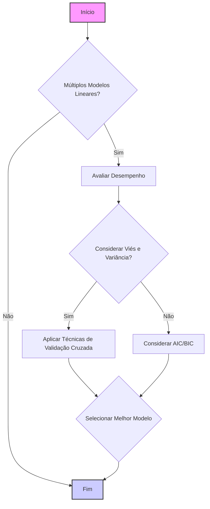
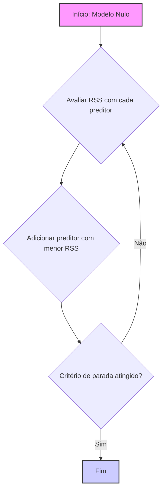
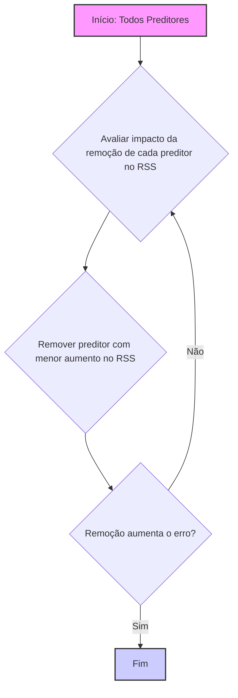
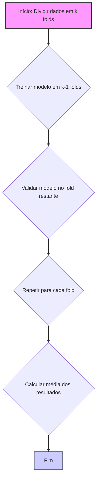

## Seleção de Modelos em Regressão Linear: Abordagens e Critérios



### Introdução

A **Seleção de Modelos** é um aspecto fundamental da modelagem estatística e do aprendizado de máquina, incluindo o contexto da regressão linear [^57]. Dada uma variedade de modelos possíveis, o objetivo da seleção de modelos é encontrar o que melhor equilibra o ajuste aos dados, sua complexidade e sua capacidade de generalização [^57]. Este capítulo explorará os principais métodos para seleção de modelos, tanto aqueles com abordagens de seleção de variáveis, como *best subset selection*, *forward* e *backward stepwise*, como aqueles baseados em regularização, como Ridge, Lasso e Elastic Net. Também vamos apresentar critérios para avaliar o desempenho de modelos, incluindo *cross-validation* e os critérios de informação de Akaike (AIC) e Bayesiano (BIC).

### Métodos de Seleção de Modelos

Nesta seção, exploraremos diversos métodos de seleção de modelos, incluindo aqueles com estratégias de seleção de variáveis e outros com penalização ou regularização.

**Best Subset Selection**
A *Best Subset Selection* avalia todas as possíveis combinações de preditores e seleciona o subconjunto que minimiza uma função de custo específica, como o Residual Sum of Squares (RSS) ou o critério de informação de Akaike (AIC) [^57]. Este método garante que a solução seja, de fato, a melhor possível (dado o critério utilizado), mas se torna inviável para problemas com um número grande de preditores devido à sua complexidade computacional que escala exponencialmente com o número de preditores.
Em geral, para cada tamanho de subconjunto, a *Best Subset Selection* avalia todos os modelos possíveis, retornando o melhor modelo para um dado número de preditores.

> 💡 **Exemplo Numérico:**
>
> Suponha que temos um conjunto de dados com uma variável resposta ($y$) e 3 preditores ($x_1$, $x_2$, $x_3$). A *Best Subset Selection* avaliaria os seguintes modelos:
>
> - Modelo 1: Apenas o intercepto.
> - Modelos com 1 preditor: $x_1$, $x_2$, $x_3$.
> - Modelos com 2 preditores: ($x_1$, $x_2$), ($x_1$, $x_3$), ($x_2$, $x_3$).
> - Modelo com 3 preditores: ($x_1$, $x_2$, $x_3$).
>
> Para cada um desses modelos, calcularíamos o RSS (Residual Sum of Squares) ou outro critério de avaliação. O modelo com o menor RSS (ou o melhor valor de outro critério) seria selecionado para cada número de preditores.
>
> Para ilustrar, vamos gerar dados aleatórios e calcular o RSS para alguns modelos usando Python:
>
> ```python
> import numpy as np
> from sklearn.linear_model import LinearRegression
> from sklearn.metrics import mean_squared_error
>
> # Generate random data
> np.random.seed(42)
> X = np.random.rand(100, 3)
> y = 2*X[:, 0] + 3*X[:, 1] - 1.5*X[:, 2] + np.random.randn(100)
>
> # Function to calculate RSS
> def calculate_rss(X, y, predictors):
>     model = LinearRegression()
>     model.fit(X[:, predictors], y)
>     y_pred = model.predict(X[:, predictors])
>     rss = np.sum((y - y_pred)**2)
>     return rss
>
> # Calculate RSS for models with different predictors
> rss_1 = calculate_rss(X, y, [0]) # Only x1
> rss_2 = calculate_rss(X, y, [1]) # Only x2
> rss_3 = calculate_rss(X, y, [2]) # Only x3
> rss_12 = calculate_rss(X, y, [0, 1]) # x1 and x2
> rss_13 = calculate_rss(X, y, [0, 2]) # x1 and x3
> rss_23 = calculate_rss(X, y, [1, 2]) # x2 and x3
> rss_123 = calculate_rss(X, y, [0, 1, 2]) # All predictors
>
> print(f"RSS with x1: {rss_1:.2f}")
> print(f"RSS with x2: {rss_2:.2f}")
> print(f"RSS with x3: {rss_3:.2f}")
> print(f"RSS with x1 and x2: {rss_12:.2f}")
> print(f"RSS with x1 and x3: {rss_13:.2f}")
> print(f"RSS with x2 and x3: {rss_23:.2f}")
> print(f"RSS with x1, x2 and x3: {rss_123:.2f}")
> ```
>
> A saída do código acima mostra os valores de RSS para cada modelo.  O modelo com menor RSS para cada número de preditores seria selecionado. Este exemplo numérico ilustra como o *Best Subset Selection* funciona na prática, buscando a melhor combinação de preditores, mas a complexidade computacional aumenta rapidamente com o número de preditores.

**Forward Stepwise Selection**
A *Forward Stepwise Selection* é um método incremental para construir modelos, que começa com um modelo nulo (apenas o *intercept*), e em cada passo adiciona o preditor que mais reduz o erro do modelo [^58]. Este processo é repetido até que um determinado critério seja atingido, como por exemplo um limite no número de preditores ou quando o erro do modelo para de diminuir. Embora este método não avalie todas as combinações de preditores, ele é computacionalmente menos custoso que o *Best Subset Selection*.



> 💡 **Exemplo Numérico:**
>
> Usando os mesmos dados do exemplo anterior, vamos ilustrar o *Forward Stepwise Selection*.
>
> 1.  **Passo 1:** Começamos com um modelo nulo (apenas o intercepto). Calculamos o RSS com cada preditor individualmente ($x_1$, $x_2$ e $x_3$) e adicionamos o preditor que fornece o menor RSS. Suponha que $x_2$ resulte no menor RSS neste passo.
> 2.  **Passo 2:**  Mantemos $x_2$ no modelo e calculamos o RSS com os modelos que adicionam $x_1$ e $x_3$ (i.e. ($x_2$, $x_1$) e ($x_2$, $x_3$)). Suponha que adicionar $x_1$ resulte no menor RSS.
> 3. **Passo 3:** Mantemos $x_1$ e $x_2$ no modelo e adicionamos $x_3$. Calculamos o RSS com o modelo ($x_1$, $x_2$, $x_3$).
>
> O processo termina quando um critério de parada é atingido, como um número máximo de preditores ou quando o erro não diminui significativamente.
>
> Em Python:
>
> ```python
> import numpy as np
> from sklearn.linear_model import LinearRegression
>
> # Generate random data (same as before)
> np.random.seed(42)
> X = np.random.rand(100, 3)
> y = 2*X[:, 0] + 3*X[:, 1] - 1.5*X[:, 2] + np.random.randn(100)
>
> def forward_stepwise_selection(X, y, max_predictors=3):
>    selected_predictors = []
>    remaining_predictors = list(range(X.shape[1]))
>    
>    while remaining_predictors and len(selected_predictors) < max_predictors:
>        best_rss = float('inf')
>        best_predictor = None
>        
>        for predictor in remaining_predictors:
>            current_predictors = selected_predictors + [predictor]
>            model = LinearRegression()
>            model.fit(X[:, current_predictors], y)
>            y_pred = model.predict(X[:, current_predictors])
>            rss = np.sum((y - y_pred)**2)
>            
>            if rss < best_rss:
>                best_rss = rss
>                best_predictor = predictor
>        
>        selected_predictors.append(best_predictor)
>        remaining_predictors.remove(best_predictor)
>        print(f"Selected predictors: {selected_predictors}, RSS: {best_rss:.2f}")
>
> forward_stepwise_selection(X, y)
> ```
>
> O código acima ilustra a seleção de variáveis utilizando o método *Forward Stepwise*, mostrando como os preditores são adicionados ao modelo em cada passo.

**Backward Stepwise Selection**
A *Backward Stepwise Selection* é um método que começa com todos os preditores no modelo e, em cada passo, remove o preditor que menos impacta o ajuste do modelo [^59]. O processo é repetido até que a remoção de qualquer preditor aumente o erro do modelo. Como o *Forward Stepwise*, esse método é mais eficiente computacionalmente que o *Best Subset Selection*, mas pode apresentar problemas em situações onde há muitos preditores correlacionados.



> 💡 **Exemplo Numérico:**
>
> Usando os mesmos dados dos exemplos anteriores, vamos ilustrar o *Backward Stepwise Selection*.
>
> 1.  **Passo 1:** Começamos com todos os preditores ($x_1$, $x_2$, $x_3$) no modelo. Removemos cada preditor individualmente e calculamos o RSS. Suponha que remover $x_3$ resulte no menor aumento no RSS.
> 2.  **Passo 2:**  Removemos $x_3$ do modelo, e agora temos ($x_1$, $x_2$). Removemos cada um dos preditores restantes e calculamos o RSS. Suponha que remover $x_1$ resulte no menor aumento no RSS.
> 3.  **Passo 3:** Removemos $x_1$ do modelo, e agora temos apenas $x_2$.
>
> O processo termina quando remover qualquer preditor aumenta o erro.
>
> Em Python:
>
> ```python
> import numpy as np
> from sklearn.linear_model import LinearRegression
>
> # Generate random data (same as before)
> np.random.seed(42)
> X = np.random.rand(100, 3)
> y = 2*X[:, 0] + 3*X[:, 1] - 1.5*X[:, 2] + np.random.randn(100)
>
> def backward_stepwise_selection(X, y):
>    selected_predictors = list(range(X.shape[1]))
>
>    while len(selected_predictors) > 0:
>        best_rss = float('inf')
>        best_predictor_to_remove = None
>
>        for predictor in selected_predictors:
>            current_predictors = [p for p in selected_predictors if p != predictor]
>            model = LinearRegression()
>            model.fit(X[:, current_predictors], y)
>            y_pred = model.predict(X[:, current_predictors])
>            rss = np.sum((y - y_pred)**2)
>
>            if rss < best_rss:
>                best_rss = rss
>                best_predictor_to_remove = predictor
>
>        if best_predictor_to_remove is not None:
>            selected_predictors.remove(best_predictor_to_remove)
>            print(f"Selected predictors: {selected_predictors}, RSS: {best_rss:.2f}")
>        else:
>            break
>
> backward_stepwise_selection(X,y)
> ```
>
> O código acima ilustra a seleção de variáveis utilizando o método *Backward Stepwise*, mostrando como os preditores são removidos do modelo em cada passo.

**Regularização L1 (Lasso) para Seleção de Modelos**

A regularização L1, ou Lasso, realiza a seleção de variáveis ao adicionar uma penalidade proporcional à norma L1 dos coeficientes à função de custo [^6]. O efeito da regularização L1 é que ela força alguns coeficientes a serem exatamente zero, criando assim modelos esparsos. Modelos mais esparsos indicam que apenas um subconjunto dos preditores é relevante, realizando assim a seleção de variáveis.
A magnitude do parâmetro de regularização, $\lambda$, controla o grau de *sparsity*, e o algoritmo LARS fornece uma forma eficiente de computar o caminho de soluções e a esparsidade associada a cada valor de $\lambda$. O método Lasso, em comparação com *Best Subset Selection*, é computacionalmente mais viável, e também induz estabilidade no modelo final.

> 💡 **Exemplo Numérico:**
>
> Vamos usar um exemplo com dados simulados para demonstrar o efeito da regularização L1 (Lasso).
>
> ```python
> import numpy as np
> import matplotlib.pyplot as plt
> from sklearn.linear_model import Lasso
> from sklearn.model_selection import train_test_split
> from sklearn.metrics import mean_squared_error
>
> # Generate simulated data with some irrelevant features
> np.random.seed(42)
> n_samples = 100
> n_features = 10
> X = np.random.randn(n_samples, n_features)
> true_coef = np.array([2, -3, 1.5, 0, 0, 0, 0, 0, 0, 0]) # Only the first three features are relevant
> y = np.dot(X, true_coef) + np.random.randn(n_samples)
>
> # Split data into training and test sets
> X_train, X_test, y_train, y_test = train_test_split(X, y, test_size=0.3, random_state=42)
>
> # Train Lasso model with different lambda values
> lambda_values = [0.01, 0.1, 1, 10]
> coefs = []
> mse_values = []
>
> for alpha in lambda_values:
>    lasso = Lasso(alpha=alpha, max_iter=1000)
>    lasso.fit(X_train, y_train)
>    coefs.append(lasso.coef_)
>    y_pred = lasso.predict(X_test)
>    mse = mean_squared_error(y_test, y_pred)
>    mse_values.append(mse)
>
> # Plot coefficients for different lambda values
> plt.figure(figsize=(10, 6))
> for i, coef in enumerate(coefs):
>    plt.plot(range(n_features), coef, marker='o', label=f'λ={lambda_values[i]}')
> plt.xlabel('Feature Index')
> plt.ylabel('Coefficient Value')
> plt.title('Lasso Coefficients for Different λ Values')
> plt.legend()
> plt.grid(True)
> plt.show()
>
> # Print MSE for different lambda values
> for i, mse in enumerate(mse_values):
>    print(f"MSE for λ = {lambda_values[i]}: {mse:.2f}")
> ```
>
> Este código gera dados com 10 preditores, onde apenas os três primeiros são relevantes. O gráfico mostra como os coeficientes variam conforme o valor de $\lambda$ aumenta. Para $\lambda$ pequenos, os coeficientes são similares aos valores verdadeiros, e a medida que $\lambda$ aumenta, os coeficientes dos preditores irrelevantes são forçados a zero, demonstrando a capacidade do Lasso de realizar seleção de variáveis.  O MSE também é impresso para cada valor de $\lambda$.

**Regularização L2 (Ridge) para Seleção de Modelos**
A regularização L2 (Ridge) não gera modelos esparsos, já que os coeficientes são reduzidos em magnitude, mas não forçados a zero. A regularização L2, entretanto, estabiliza o modelo, reduzindo o impacto da multicolinearidade e controlando o *overfitting*. Os modelos com regularização L2 são preferíveis quando todos os preditores tem alguma relevância e para reduzir a variância dos coeficientes.

> 💡 **Exemplo Numérico:**
>
> Vamos usar um exemplo com dados simulados para demonstrar o efeito da regularização L2 (Ridge).
>
> ```python
> import numpy as np
> import matplotlib.pyplot as plt
> from sklearn.linear_model import Ridge
> from sklearn.model_selection import train_test_split
> from sklearn.metrics import mean_squared_error
>
> # Generate simulated data with some multicollinearity
> np.random.seed(42)
> n_samples = 100
> n_features = 5
> X = np.random.randn(n_samples, n_features)
> X[:, 1] = 0.8 * X[:, 0] + np.random.randn(n_samples) * 0.2 # Introduce multicollinearity
> true_coef = np.array([2, -3, 1.5, -1, 0.5])
> y = np.dot(X, true_coef) + np.random.randn(n_samples)
>
> # Split data into training and test sets
> X_train, X_test, y_train, y_test = train_test_split(X, y, test_size=0.3, random_state=42)
>
> # Train Ridge model with different lambda values
> lambda_values = [0.01, 0.1, 1, 10]
> coefs = []
> mse_values = []
>
> for alpha in lambda_values:
>    ridge = Ridge(alpha=alpha, max_iter=1000)
>    ridge.fit(X_train, y_train)
>    coefs.append(ridge.coef_)
>    y_pred = ridge.predict(X_test)
>    mse = mean_squared_error(y_test, y_pred)
>    mse_values.append(mse)
>
> # Plot coefficients for different lambda values
> plt.figure(figsize=(10, 6))
> for i, coef in enumerate(coefs):
>    plt.plot(range(n_features), coef, marker='o', label=f'λ={lambda_values[i]}')
> plt.xlabel('Feature Index')
> plt.ylabel('Coefficient Value')
> plt.title('Ridge Coefficients for Different λ Values')
> plt.legend()
> plt.grid(True)
> plt.show()
>
> # Print MSE for different lambda values
> for i, mse in enumerate(mse_values):
>    print(f"MSE for λ = {lambda_values[i]}: {mse:.2f}")
> ```
>
> Este código gera dados com 5 preditores, onde os dois primeiros são correlacionados. O gráfico mostra como os coeficientes são reduzidos em magnitude conforme $\lambda$ aumenta, mas não são forçados a zero. O MSE também é impresso para cada valor de $\lambda$. A regularização Ridge ajuda a lidar com a multicolinearidade, estabilizando os coeficientes e reduzindo a variância.

**Elastic Net para Seleção de Modelos**
A Elastic Net combina a regularização L1 e L2, produzindo modelos que são ambos esparsos e estáveis. O parâmetro $\alpha$ controla a proporção da penalidade L1 e L2. O caminho de soluções da Elastic Net pode ser computado usando algoritmos similares ao LARS, e pode ser usado para selecionar o melhor compromisso entre *sparsity* e estabilidade, ajustando os parâmetros $\lambda$ e $\alpha$.

> 💡 **Exemplo Numérico:**
>
> Vamos usar um exemplo com dados simulados para demonstrar o efeito da Elastic Net.
>
> ```python
> import numpy as np
> import matplotlib.pyplot as plt
> from sklearn.linear_model import ElasticNet
> from sklearn.model_selection import train_test_split
> from sklearn.metrics import mean_squared_error
>
> # Generate simulated data with multicollinearity and irrelevant features
> np.random.seed(42)
> n_samples = 100
> n_features = 10
> X = np.random.randn(n_samples, n_features)
> X[:, 1] = 0.8 * X[:, 0] + np.random.randn(n_samples) * 0.2 # Introduce multicollinearity
> true_coef = np.array([2, -3, 1.5, 0, 0, 0, 0, 0, 0, 0]) # Only the first three features are relevant
> y = np.dot(X, true_coef) + np.random.randn(n_samples)
>
> # Split data into training and test sets
> X_train, X_test, y_train, y_test = train_test_split(X, y, test_size=0.3, random_state=42)
>
> # Train Elastic Net model with different lambda and alpha values
> lambda_values = [0.01, 0.1, 1]
> alpha_values = [0.2, 0.5, 0.8]
>
> results = []
>
> for alpha in alpha_values:
>  for l1_ratio in lambda_values:
>    elastic_net = ElasticNet(alpha = l1_ratio, l1_ratio=alpha, max_iter=1000)
>    elastic_net.fit(X_train, y_train)
>    y_pred = elastic_net.predict(X_test)
>    mse = mean_squared_error(y_test, y_pred)
>    results.append({
>       'alpha': alpha,
>       'l1_ratio': l1_ratio,
>       'coef': elastic_net.coef_,
>       'mse': mse
>    })
>
> # Plot coefficients for different lambda and alpha values
> fig, axes = plt.subplots(len(alpha_values), len(lambda_values), figsize=(15, 10), sharey=True)
>
> for i, alpha in enumerate(alpha_values):
>   for j, l1_ratio in enumerate(lambda_values):
>    ax = axes[i,j]
>    result = next(res for res in results if res['alpha'] == alpha and res['l1_ratio'] == l1_ratio)
>    ax.plot(range(n_features), result['coef'], marker='o')
>    ax.set_title(f'α={alpha}, λ={l1_ratio:.2f}')
>    ax.set_xlabel('Feature Index')
>    if j==0:
>      ax.set_ylabel('Coefficient Value')
>
> plt.tight_layout()
> plt.show()
>
> # Print MSE values
> for result in results:
>    print(f"MSE for α = {result['alpha']}, λ = {result['l1_ratio']}: {result['mse']:.2f}")
> ```
>
> Este código gera dados com 10 preditores, onde os dois primeiros são correlacionados e apenas os três primeiros são relevantes. O gráfico mostra como os coeficientes variam conforme os valores de $\lambda$ e $\alpha$ são ajustados. A Elastic Net combina a capacidade do Lasso de realizar seleção de variáveis com a estabilidade da Ridge, controlada por $\alpha$ e $\lambda$. O MSE também é impresso para cada combinação dos parâmetros.

**Lemma 20:** A Relação entre os Métodos de Seleção de Variáveis e a Regularização

Os métodos de seleção de variáveis e a regularização podem ser vistos como abordagens diferentes para controlar a complexidade do modelo. Métodos de seleção de variáveis, como *best subset selection* removem alguns dos preditores do modelo, gerando modelos esparsos. Já a regularização, através do uso de penalidades, altera o custo associado ao uso de parâmetros do modelo.
As abordagens de seleção de variáveis geralmente removem preditores de uma vez só, e o resultado final depende da ordem em que os preditores são incluídos ou removidos, que não necessariamente tem relação com a magnitude dos seus coeficientes. Métodos de regularização penalizam a magnitude dos coeficientes, promovendo a seleção de modelos com menor variância e que são mais robustos e generalizáveis.
Ao combinar diferentes métodos, é possível utilizar o melhor de cada um, por exemplo usando regularização para reduzir a variância e um método de seleção de variáveis para obter *sparsity*.

**Corolário 20:** Interpretabilidade e Sparsity

A interpretabilidade, que está relacionada à compreensão de um modelo pelos humanos, está ligada a modelos com *sparsity*. Modelos com muitos parâmetros, embora mais flexíveis, são difíceis de entender e comunicar, enquanto modelos esparsos, que são o resultado de métodos de seleção de variáveis e regularização L1, fornecem representações simples e fáceis de entender.

### Critérios para Avaliar Modelos

Para fazer uma seleção adequada de modelos, são necessários critérios quantitativos para avaliar os diferentes modelos disponíveis. Existem vários métodos, incluindo:

**Cross-Validation**

A **Cross-Validation**, ou validação cruzada, é uma técnica usada para estimar a capacidade de generalização de um modelo para dados não vistos. A ideia principal é dividir os dados em diferentes conjuntos, usar parte para treinar o modelo e a outra parte para validar o seu desempenho. Existem diversas variantes de *cross-validation*, incluindo:

-   **k-fold Cross-Validation:** Os dados são divididos em *k* partes ou *folds*. O modelo é treinado em *k-1* partes, e o desempenho é avaliado no *fold* restante. O processo é repetido *k* vezes, usando um *fold* diferente para validação em cada iteração, e os resultados são calculados pela média [^61].
-   **Leave-One-Out Cross-Validation (LOOCV):** Similar à *k-fold*, mas em cada iteração um único ponto de dado é usado para validação, e o restante para treino.

O objetivo da *cross-validation* é estimar o desempenho do modelo nos dados de teste, fornecendo uma forma de escolher o melhor modelo, bem como selecionar o valor apropriado de parâmetros de regularização.



> 💡 **Exemplo Numérico:**
>
> Vamos demonstrar a *k-fold cross-validation* com um exemplo numérico usando dados simulados e o scikit-learn.
>
> ```python
> import numpy as np
> from sklearn.model_selection import KFold
> from sklearn.linear_model import LinearRegression
> from sklearn.metrics import mean_squared_error
>
> # Generate random data
> np.random.seed(42)
> X = np.random.rand(100, 3)
> y = 2*X[:, 0] + 3*X[:, 1] - 1.5*X[:, 2] + np.random.randn(100)
>
> # Define k-fold cross-validation
> k = 5
> kf = KFold(n_splits=k, shuffle=True, random_state=42)
>
> mse_scores = []
>
> # Perform cross-validation
> for train_index, test_index in kf.split(X):
>    X_train, X_test = X[train_index], X[test_index]
>    y_train, y_test = y[train_index], y[test_index]
>
>    model = LinearRegression()
>    model.fit(X_train, y_train)
>    y_pred = model.predict(X_test)
>    mse = mean_squared_error(y_test, y_pred)
>    mse_scores.append(mse)
>
> # Calculate mean and standard deviation of MSE
> mean_mse = np.mean(mse_scores)
> std_mse = np.std(mse_scores)
>
> print(f"Mean MSE: {mean_mse:.2f}")
> print(f"Standard Deviation of MSE: {std_mse:.2f}")
> ```
>
> Este código divide os dados em 5 *folds*, treina um modelo em 4 *folds* e avalia o modelo no *fold* restante. O processo é repetido para cada *fold*, e o erro médio quadrático (MSE) é calculado para cada iteração. A média e o desvio padrão dos MSEs são impressos, fornecendo uma estimativa da performance do modelo em dados não vistos.

**Critério de Informação de Akaike (AIC)**

O **Critério de Informação de Akaike (AIC)** é um critério baseado na informação, que pondera o ajuste do modelo com a sua complexidade [^16]. O AIC é definido como:

$$
AIC = -2 \log(L) + 2p
$$
onde:

-   $L$ é o valor máximo da função de verossimilhança do modelo ajustado aos dados (ou o likelihood).
-   $p$ é o número de parâmetros no modelo.

O AIC procura balancear a complexidade do modelo (número de parâmetros) com o seu ajuste aos dados. Modelos com menor AIC são preferidos. Modelos com alto *likelihood* se ajustam melhor aos dados, mas modelos com muitos parâmetros são mais complexos e apresentam maior risco de *overfitting*.

> 💡 **Exemplo Numérico:**
>
> Vamos calcular o AIC para dois modelos diferentes usando dados simulados.
>
> ```python
> import numpy as np
> from sklearn.linear_model import LinearRegression
> from scipy.stats import norm
>
> # Generate random data
> np.random.seed(42)
> X = np.random.rand(100, 3)
> y = 2*X[:, 0] + 3*X[:, 1] + np.random.randn(100)
>
> # Fit two linear regression models
> model1 = LinearRegression()
> model1.fit(X[:, :2], y) # Model with 2 predictors
> y_pred1 = model1.predict(X[:, :2])
>
> model2 = LinearRegression()
> model2.fit(X, y)  # Model with 3 predictors
> y_pred2 = model2.predict(X)
>
> # Calculate log-likelihood for each model assuming Gaussian errors
> def log_likelihood(y_true, y_pred):
>    residuals = y_true - y_pred
>    sigma_squared = np.var(residuals)
>    n = len(y_true)
>    ll = np.sum(norm.logpdf(residuals, loc=0, scale=np.sqrt(sigma_squared)))
>    return ll
>
> ll1 = log_likelihood(y, y_pred1)
> ll2 = log_likelihood(y, y_pred2)
>
> # Calculate AIC for each model
> p1 = 3 # 2 predictors + 1 intercept
> p2 = 4 # 3 predictors + 1 intercept
>
> aic1 = -2 * ll1 + 2 * p1
> aic2 = -2 * ll2 + 2 * p2
>
> print(f"AIC for model with 2 predictors: {aic1:.2f}")
> print(f"AIC for model with 3 predictors: {aic2:.2f}")
>
> if aic1 < aic2:
>   print("Model with 2 predictors is preferred according to AIC.")
> else:
>  print("Model with 3 predictors is preferred according to AIC.")
> ```
>
> Este código ajusta dois modelos lineares, um com 2 preditores e outro com 3. A função *log_likelihood* calcula a verossimilhança dos dados dado o modelo, assumindo erros Gaussianos. O AIC é calculado para cada modelo. O modelo com o menor AIC é preferido. Este exemplo mostra como o AIC leva em conta o ajuste do modelo e a sua complexidade, penalizando modelos com mais parâmetros.

**Critério de Informação Bayesiano (BIC)**

O **Critério de Informação Bayesiano (BIC)** é um outro critério para avaliação de modelos, que também busca um equilíbrio entre complexidade e ajuste, mas que penaliza modelos mais complexos de forma mais severa que o AIC [^21]. O BIC é definido como:

$$
BIC = -2 \log(L) + p \log(N)
$$
onde:
- $L$ é o valor máximo da função de verossimilhança do modelo
-