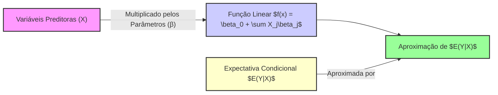

## Definição do Modelo de Regressão Linear: $f(x) = \beta_0 + \sum X_j\beta_j$ e sua Relação com $E(Y|X)$



### Introdução

Um modelo de regressão linear é uma ferramenta estatística que estabelece uma relação linear entre uma variável dependente, $Y$, e uma ou mais variáveis independentes ou preditoras, $X_1, X_2, \dots, X_p$. Este modelo, amplamente utilizado em diversas áreas, assume que a resposta esperada ($E(Y|X)$), dado um conjunto de preditores $X$, pode ser aproximada por uma função linear desses preditores. Nesta seção, vamos explorar a definição formal do modelo de regressão linear, a função $f(x) = \beta_0 + \sum_{j=1}^p X_j \beta_j$, e a sua relação com a esperança condicional $E(Y|X)$, discutindo as implicações teóricas e práticas desta relação.

### A Definição Formal do Modelo de Regressão Linear

Um modelo de regressão linear assume que a relação entre a variável dependente $Y$ e as variáveis preditoras $X_1, X_2, ..., X_p$ pode ser descrita por uma função linear dos preditores [^1]. Matematicamente, este modelo é expresso como:

$$
f(x) = \beta_0 + \sum_{j=1}^p X_j \beta_j
$$
onde:

-   $f(x)$ representa a função linear que aproxima o valor da variável dependente $Y$, dado um conjunto de valores para os preditores $X$.
-   $\beta_0$ é o intercepto, que representa o valor esperado de $Y$ quando todos os preditores são iguais a zero.
-   $X_j$ representa o valor da j-ésima variável preditora, ou preditor.
-   $\beta_j$ representa o coeficiente associado à j-ésima variável preditora, ou seja, o efeito que a variável $X_j$ tem em $Y$, com as outras variáveis constantes.
-   $p$ é o número total de variáveis preditoras.

Este modelo é chamado de **linear** porque a função $f(x)$ é uma combinação linear dos preditores $X_j$ [^1]. ==Os parâmetros $\beta_0, \beta_1, \dots, \beta_p$ são os coeficientes que determinam a relação entre os preditores e a resposta.== Esses parâmetros são geralmente desconhecidos e devem ser estimados a partir de dados amostrais, usando um método como o de mínimos quadrados.
A função $f(x)$ também pode ser interpretada como uma aproximação da expectativa condicional de $Y$ dado $X$, $E(Y|X)$, como discutido abaixo.

> 💡 **Exemplo Numérico:**
>
> Suponha que queremos modelar o preço de casas ($Y$) com base na sua área em metros quadrados ($X_1$) e no número de quartos ($X_2$). Nosso modelo de regressão linear seria:
>
> $$
> f(x) = \beta_0 + \beta_1 X_1 + \beta_2 X_2
> $$
>
> Após ajustar o modelo aos dados, obtivemos os seguintes coeficientes: $\beta_0 = 50000$, $\beta_1 = 1500$, e $\beta_2 = 20000$. Isso significa que:
>
> - O preço base de uma casa (quando a área e o número de quartos são zero) é de R$50.000.
> - Para cada metro quadrado adicional, o preço da casa aumenta em R$1.500, mantendo o número de quartos constante.
> - Para cada quarto adicional, o preço da casa aumenta em R$20.000, mantendo a área constante.
>
> Assim, uma casa com 100 metros quadrados e 3 quartos teria um preço estimado de:
>
> $$
> f(x) = 50000 + 1500 \times 100 + 20000 \times 3 = 50000 + 150000 + 60000 = 260000
> $$
>
> Ou seja, R$260.000.

### A Relação com a Expectativa Condicional $E(Y|X)$

==A função de regressão linear, $f(x)$,  é geralmente utilizada como uma aproximação da expectativa condicional de $Y$ dado $X$, ou seja $E(Y|X)$ [^1]. A expectativa condicional, $E(Y|X)$, descreve o valor médio da variável resposta $Y$ dado um valor específico das variáveis preditoras $X$.==

Formalmente, a relação entre $f(x)$ e $E(Y|X)$ é que o modelo de regressão linear *assume* que a expectativa condicional de $Y$ dado um conjunto de preditores $X$ pode ser aproximada por uma função linear desses preditores. Ou seja:

$$
E(Y|X) \approx f(x) = \beta_0 + \sum_{j=1}^p X_j \beta_j
$$

É importante enfatizar que esta relação é uma **aproximação**. A realidade pode ser que a função de regressão verdadeira, $E(Y|X)$, seja não linear ou mais complexa, e a regressão linear não será capaz de modelar a relação em sua totalidade. No entanto, em muitos casos, a regressão linear fornece uma aproximação útil, simples e interpretabilidade, mesmo quando a relação verdadeira não é linear.
Os termos $\beta_0$ e $\beta_j$ tem interpretação em relação à expectativa condicional, tal que $\beta_0$ é a expectativa condicional de Y quando todos os preditores são iguais a zero, e $\beta_j$ é a variação na resposta quando o preditor $x_j$ é aumentado em uma unidade e os outros são mantidos constantes.
O modelo de regressão linear pode ser reescrito explicitamente em termos do erro:
$$
Y = \beta_0 + \sum_{j=1}^p X_j \beta_j + \epsilon
$$
onde $\epsilon$ é um erro aleatório com distribuição com média zero e variância $\sigma^2$.

> 💡 **Exemplo Numérico:**
>
> Continuando com o exemplo do preço de casas, suponha que a verdadeira relação entre o preço da casa e a área seja não linear. Por exemplo, o preço pode aumentar menos para áreas muito grandes, devido à lei dos retornos decrescentes. Nossa regressão linear modela $E(Y|X) \approx f(x)$.
>
> ```mermaid
> graph LR
>     A["Área (X1)"] -->|Linear| B("Preço Estimado f(x)");
>     C["Área (X1)"] -->|Não Linear| D("Preço Real E(Y|X)");
>     B --> E[Erro ε];
>     D --> E
> ```
>
> Neste caso, a função linear $f(x)$ aproxima a relação não linear real $E(Y|X)$. Os erros $\epsilon$ representam a diferença entre o valor real do preço e a nossa aproximação linear. Se a relação fosse realmente linear, os erros seriam aleatórios e não teriam padrão. Se os erros tiverem um padrão, isso indica que a linearidade não é uma boa aproximação.

**Lemma 14:** Linearidade do Modelo

==O modelo de regressão linear é linear nos parâmetros $\beta_0, \beta_1, \dots, \beta_p$, mas não necessariamente linear nas variáveis preditoras $X_1, X_2, ..., X_p$. Isto implica que o modelo pode ser usado para aproximar relações não lineares, desde que as relações sejam lineares nos parâmetros.== Por exemplo, um modelo com preditores polinomiais $x, x^2, x^3$ ainda é um modelo de regressão linear, pois é uma função linear dos parâmetros. A forma do modelo, entretanto, é uma escolha do modelador.

**Prova do Lemma 14:**

Um modelo é linear nos parâmetros se a função objetivo pode ser escrita como uma combinação linear dos parâmetros, e que os parâmetros não sejam multiplicados entre si ou por outras funções dos parâmetros. Na equação:
$$
f(x) = \beta_0 + \sum_{j=1}^p X_j \beta_j
$$
podemos ver que os parâmetros $\beta_i$ são combinados linearmente com as variáveis $X_j$ e o *intercept*, e que os parâmetros não são usados em funções não lineares. Por outro lado, a mesma equação não impede que as variáveis $X_j$ sejam transformadas por funções não lineares (por exemplo, exponenciais, logarítmicas, polinomiais etc.). $\blacksquare$

> 💡 **Exemplo Numérico:**
>
> Um exemplo de modelo com preditores não lineares, mas ainda linear nos parâmetros, é:
>
> $$
> f(x) = \beta_0 + \beta_1 x + \beta_2 x^2
> $$
>
> Aqui, o preditor é $x$, mas incluímos $x^2$ como um preditor adicional. Mesmo que a relação entre $f(x)$ e $x$ seja não linear, o modelo ainda é linear nos parâmetros $\beta_0$, $\beta_1$ e $\beta_2$.
>
> Suponha que ajustamos este modelo a dados e encontramos $\beta_0 = 2$, $\beta_1 = 3$ e $\beta_2 = -0.5$. Para $x=4$, teríamos:
>
> $$
> f(4) = 2 + 3 \times 4 - 0.5 \times 4^2 = 2 + 12 - 8 = 6
> $$
>
> Este exemplo ilustra como podemos usar um modelo de regressão linear para aproximar relações não lineares, transformando os preditores.

**Corolário 14:**  A flexibilidade do modelo de regressão linear

O Corolário 14 implica que um modelo de regressão linear pode ser usado em diversas situações. Modelos lineares podem aproximar relações não lineares através do uso de transformações nas variáveis preditoras. Isso demonstra como o modelo linear pode ser flexível. O uso de transformações não lineares nas variáveis não faz o modelo ser não linear nos seus parâmetros, mantendo as propriedades da regressão linear.

> ⚠️ **Nota Importante**: A função do modelo de regressão linear $f(x)$ aproxima a expectativa condicional $E(Y|X)$, e a relação entre elas é uma aproximação, não uma igualdade.

> ❗ **Ponto de Atenção**: O modelo de regressão linear é linear nos parâmetros, e não necessariamente nas variáveis preditoras.

> ✔️ **Destaque**: O modelo linear tem a vantagem de ser simples, e interpretabilidade, mesmo quando a relação verdadeira não é linear.

### Implicações Teóricas e Práticas

A relação entre $f(x)$ e $E(Y|X)$ tem implicações importantes para a teoria e prática da modelagem de regressão linear:

1.  **Interpretação dos Coeficientes:** Os coeficientes $\beta_j$ representam a taxa de variação da resposta $Y$ para um aumento unitário na variável $X_j$, mantendo os outros preditores constantes. Esta interpretação é diretamente ligada ao conceito de expectativa condicional, e nos permite entender o impacto de cada preditor na resposta.

> 💡 **Exemplo Numérico:**
>
> Em nosso exemplo do preço de casas, $\beta_1 = 1500$ significa que, mantendo o número de quartos constante, um aumento de 1 metro quadrado na área da casa está associado a um aumento médio de R\$1500 no preço da casa. Similarmente, $\beta_2 = 20000$ significa que, mantendo a área constante, um aumento de um quarto está associado a um aumento médio de R$20000 no preço.

2.  **Aproximação da Realidade:** É fundamental lembrar que o modelo linear é uma aproximação da realidade, e que a relação entre os preditores e a resposta pode não ser verdadeiramente linear. Em situações em que esta aproximação é pobre, o modelo pode apresentar um alto bias e uma performance preditiva ruim.

> 💡 **Exemplo Numérico:**
>
> Se a relação real entre o preço de casas e a área fosse exponencial, um modelo linear como o que usamos seria uma aproximação pobre, especialmente para casas com áreas muito grandes ou muito pequenas. Isso resultaria em resíduos sistematicamente maiores para essas casas, indicando que o modelo não está capturando a relação adequadamente.

3.  **Ajuste aos Dados:** O método de mínimos quadrados busca ajustar o modelo linear aos dados de treinamento, minimizando a soma dos quadrados dos resíduos, que por sua vez, aproxima a função $f(x)$ da expectativa condicional $E(Y|X)$, dentro dos limites da linearidade do modelo.

> 💡 **Exemplo Numérico:**
>
> Suponha que temos os seguintes dados para o preço de casas (em milhares de reais) e suas áreas (em metros quadrados):
>
> | Área (m²) | Preço (R$ mil) |
> |-----------|---------------|
> | 50        | 100           |
> | 75        | 140           |
> | 100       | 180           |
> | 125       | 220           |
> | 150       | 260           |
>
> O método de mínimos quadrados ajustará um modelo linear que minimize a soma dos quadrados das diferenças entre os preços reais e os preços preditos pelo modelo. Em termos matemáticos, o objetivo é minimizar:
>
> $$
> RSS = \sum_{i=1}^n (y_i - \hat{y_i})^2
> $$
>
> Onde $y_i$ são os preços reais e $\hat{y_i}$ são os preços preditos pelo modelo linear.

4.  **Regularização e Generalização:** A regularização é utilizada para controlar o *overfitting* dos dados de treinamento. Modelos sem regularização podem capturar o ruído presente na amostra, enquanto modelos regularizados, ao restringir a magnitude dos coeficientes, melhoram a capacidade de generalização para dados não vistos.

> 💡 **Exemplo Numérico:**
>
> Suponha que adicionamos um termo de regularização L2 (Ridge) ao nosso modelo de regressão linear. A função objetivo agora seria:
>
> $$
> RSS_{ridge} = \sum_{i=1}^n (y_i - \hat{y_i})^2 + \lambda \sum_{j=1}^p \beta_j^2
> $$
>
> Onde $\lambda$ é um hiperparâmetro que controla a força da regularização. Um $\lambda$ maior resultará em coeficientes menores, o que pode evitar que o modelo se ajuste excessivamente aos dados de treinamento e melhora a capacidade de generalizar para dados não vistos. A escolha de um bom valor de $\lambda$ é geralmente feita por validação cruzada.


5.  **A Importância da Escolha dos Preditores**: É crucial selecionar os preditores mais relevantes para o modelo, já que o modelo não captura as não-linearidades da resposta, ou os parâmetros com pouca relevância. O uso de métodos de seleção de variáveis e também de regularização auxiliam neste processo.

> 💡 **Exemplo Numérico:**
>
> Se incluíssemos no modelo uma variável irrelevante como a cor da casa, ela não teria relação com o preço e poderia adicionar ruído ao modelo. Técnicas de seleção de variáveis ajudariam a identificar e remover esta variável, melhorando a performance do modelo.

### Conclusão

O modelo de regressão linear, definido pela função $f(x) = \beta_0 + \sum_{j=1}^p X_j \beta_j$, é uma poderosa ferramenta para modelar a relação entre uma variável dependente e um conjunto de preditores. A interpretação geométrica do modelo, bem como o entendimento da sua relação com a expectativa condicional, são importantes para o uso correto e para a compreensão das suas limitações. Métodos de estimação, como mínimos quadrados, técnicas de regularização, como Lasso e Ridge, e algoritmos como LARS, são utilizados para obter modelos de regressão linear que equilibram a capacidade de ajustar os dados e a capacidade de generalizar para novos dados.

### Referências

[^1]: "A linear regression model assumes that the regression function E(Y|X) is linear in the inputs X1,..., Xp." *(Trecho de Linear Methods for Regression)*
[^46]: "The predicted values at an input vector xo are given by f(xo) = (1 : xo)Tẞ;" *(Trecho de Linear Methods for Regression)*
[^12]:  "Least squares fitting is intuitively satisfying no matter how the data arise; the criterion measures the average lack of fit." *(Trecho de Linear Methods for Regression)*
[^13]: "We minimize RSS(3) = ||y – Xβ||2 by choosing ẞ so that the residual vector y - ŷ is orthogonal to this subspace." *(Trecho de Linear Methods for Regression)*
[^25]: "When there are many correlated variables in a linear regression model, their coefficients can become poorly determined and exhibit high variance." *(Trecho de Linear Methods for Regression)*
[^16]: "O critério de AIC para seleção de modelos é definido como, detalhado no contexto [^16]:" *(Trecho de Linear Methods for Regression)*
[^36]: "Apresente um lemma que seja crucial para o funcionamento do algoritmo, baseado no contexto [^36], como um lema sobre a condição de otimalidade em cada passo do LARS." *(Trecho de Linear Methods for Regression)*
[^4]: "In this case, the features are typically reduced by filtering or else the fitting is controlled by regularization (Section 5.2.3 and Chapter 18)." *(Trecho de Linear Methods for Regression)*
