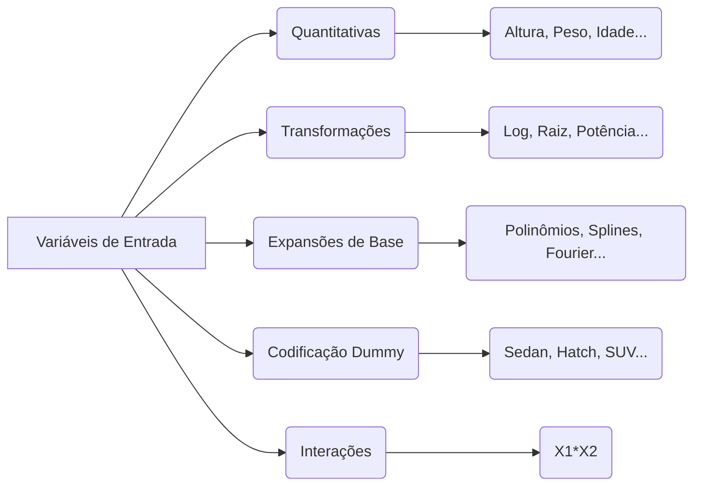
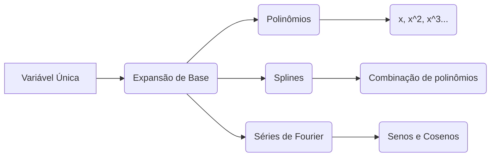

## Fontes de Variáveis de Entrada em Modelos de Regressão Linear: Uma Análise Detalhada

### Introdução

A construção de um modelo de regressão linear eficaz depende da escolha e representação adequadas das variáveis preditoras ou de entrada. As variáveis de entrada podem ter diversas naturezas, incluindo variáveis quantitativas, variáveis transformadas, expansões de base, codificações *dummy* para entradas qualitativas e interações entre variáveis. A compreensão dessas fontes de dados, e como elas se conectam à regressão linear, é essencial para a criação de modelos capazes de capturar padrões complexos nos dados e produzir previsões precisas e úteis [^44]. Este capítulo explorará em detalhes as diversas fontes de variáveis de entrada, como elas são construídas e como se relacionam com a modelagem de regressão linear.

### Fontes de Variáveis de Entrada

Vamos explorar as diferentes fontes de variáveis preditoras que podem ser utilizadas em modelos de regressão linear.

**Variáveis Quantitativas**
As **variáveis quantitativas** são aquelas que representam medidas numéricas, que podem ser expressas numa escala contínua ou discreta. Exemplos típicos de variáveis quantitativas incluem altura, peso, idade, renda, preços de ações, taxas de juro e índices de mercado [^44]. Essas variáveis são diretamente utilizáveis nos modelos de regressão linear, e podem representar medidas diretas do fenômeno que se está tentando modelar. No entanto, muitas vezes é vantajoso transformar variáveis quantitativas de forma a melhorar o desempenho do modelo.

> 💡 **Exemplo Numérico:**
> Suponha que temos um conjunto de dados com a idade de pessoas e seus respectivos níveis de colesterol. A idade (em anos) é uma variável quantitativa que pode ser usada diretamente em um modelo de regressão linear para prever o nível de colesterol. Por exemplo, se temos os seguintes dados:
>
> | Idade (anos) | Colesterol (mg/dL) |
> |--------------|--------------------|
> | 30           | 180                |
> | 40           | 200                |
> | 50           | 220                |
> | 60           | 240                |
> | 70           | 260                |
>
> Poderíamos usar um modelo de regressão linear simples para tentar prever o colesterol baseado na idade.

**Transformações de Variáveis Quantitativas**
As **transformações de variáveis quantitativas** consistem na aplicação de funções matemáticas a variáveis quantitativas com o objetivo de melhorar a relação com a variável resposta e/ou atenuar a influência de *outliers* [^44]. As transformações são uma forma de tornar as relações entre preditores e respostas mais lineares, ou mais facilmente expressas em modelos lineares. Transformações comuns incluem:

1.  **Logaritmo:** A transformação logarítmica,  $\log(x)$, comprime a escala de variáveis com distribuições enviesadas para a direita, e também ajuda a linearizar relações exponenciais.  Essa transformação é útil para variáveis como renda ou preços de ativos, onde a distribuição original é muito enviesada, com valores muito maiores sendo menos prováveis.
> 💡 **Exemplo Numérico:**
> Suponha que estamos modelando o preço de casas em função da sua área. Se a relação entre área e preço for exponencial, a transformação logarítmica pode ajudar. Se a área de uma casa for 100m², e seu preço for R\$ 200.000, e uma casa com 200m² custar R\$ 400.000, a relação é aproximadamente linear. No entanto, se uma casa com 400m² custar R\$ 1.000.000, a relação é exponencial. Aplicando o logaritmo, a relação entre $\log(\text{area})$ e $\log(\text{preço})$ pode se tornar mais linear. Usando logaritmo na base 10, teríamos:
>
> | Área (m²) | Preço (R$) | Log10(Área) | Log10(Preço) |
> |-----------|-----------|------------|-------------|
> | 100       | 200.000   | 2          | 5.30        |
> | 200       | 400.000   | 2.30       | 5.60        |
> | 400       | 1.000.000 | 2.60       | 6           |
>
> A relação entre as variáveis transformadas parece mais linear.
2. **Raiz Quadrada:** A transformação da raiz quadrada, $\sqrt{x}$, é uma transformação útil para diminuir o impacto de valores altos, comprimindo a escala original, e é útil em cenários onde há a necessidade de balancear a importância de valores maiores e menores.
> 💡 **Exemplo Numérico:**
> Considere o número de vendas de um produto em diferentes dias. Se alguns dias têm um número de vendas muito alto (outliers), a raiz quadrada pode reduzir o impacto desses dias. Se as vendas forem 100, 225, 400, as raízes quadradas seriam 10, 15, 20, comprimindo a escala original.
3. **Potência:** A transformação de potência, $x^n$, com um valor inteiro de $n$, permite expandir ou comprimir a escala das variáveis, e também criar relações não lineares com a resposta através de um modelo linear.
> 💡 **Exemplo Numérico:**
> Se tivermos uma relação quadrática entre uma variável de entrada e a variável resposta, podemos usar a transformação $x^2$. Por exemplo, se a variável de entrada $x$ for 2, a transformação resultará em 4. Se $x$ for 3, a transformação resultará em 9, e assim por diante.
4. **Quadrado:** A transformação do quadrado $x^2$ é útil para modelos polinomiais de segundo grau e para melhorar a modelagem de relações curvas.

As transformações ajudam a melhorar a modelagem e o ajuste das relações através do uso de modelos lineares. A escolha da transformação apropriada depende do problema, e a sua escolha geralmente envolve experimentação e análise de *insights* dos dados, bem como conhecimento a *priori* da forma esperada da resposta em função do preditor.

**Expansões de Base**
As **expansões de base** são transformações que convertem uma única variável em um conjunto de novas variáveis, com o objetivo de modelar relações não lineares usando modelos lineares [^44]. As expansões de base transformam um único preditor em um conjunto de preditores, que podem ser usados num modelo linear. As mais comuns são:

1.  **Polinômios:**  Os polinômios são expansões de base que adicionam potências da variável original ($x, x^2, x^3, \ldots$) como preditores no modelo, permitindo modelar relações não lineares entre um preditor e a variável resposta. Um modelo com expansões de polinômios pode ser escrito como
$$
y = \beta_0 + \beta_1 x + \beta_2 x^2 + \beta_3 x^3 + \ldots + \beta_n x^n
$$
onde cada termo é um preditor diferente, mas as relações ainda são lineares nos coeficientes.
> 💡 **Exemplo Numérico:**
> Suponha que a relação entre a idade de uma pessoa e sua probabilidade de ter uma doença não seja linear. Podemos usar uma expansão polinomial para modelar essa relação. Se tivermos uma amostra de dados onde a probabilidade aumenta com a idade, mas com uma aceleração, podemos usar um modelo polinomial de segundo grau:
> $$ \text{Probabilidade} = \beta_0 + \beta_1 \text{Idade} + \beta_2 \text{Idade}^2 $$
> Aqui,  $\text{Idade}$ e $\text{Idade}^2$ são dois preditores diferentes, e o modelo ainda é linear nos parâmetros $\beta$.
2. **Splines:** Os *Splines* são expansões de base que combinam polinômios de baixa ordem em intervalos diferentes do domínio da variável. A ideia é combinar vários polinômios de baixa ordem para criar uma função não linear suave que aproxima bem os dados, e permite modelar não linearidades localizadas.
3. **Séries de Fourier:**  As séries de Fourier usam senos e cosenos de diferentes frequências como expansões de base, com a vantagem de modelar relações periódicas.
> 💡 **Exemplo Numérico:**
> Considere dados de vendas de sorvete ao longo de um ano. As vendas tendem a ter um padrão sazonal, aumentando no verão e diminuindo no inverno. Podemos usar séries de Fourier para modelar esse padrão. Um modelo simples poderia usar um seno e um cosseno:
> $$ \text{Vendas} = \beta_0 + \beta_1 \sin(2\pi t/365) + \beta_2 \cos(2\pi t/365) $$
> onde $t$ é o dia do ano.

Em geral, a escolha da expansão de base, bem como a sua ordem ou complexidade, dependem do problema em mãos, da relação esperada entre preditores e respostas, e do grau desejado de complexidade do modelo.
É importante notar que todas estas transformações resultam num modelo de regressão linear, uma vez que o modelo continua linear nos parâmetros $\beta_i$, mesmo que as variáveis $X$ sejam transformadas por funções não lineares.

**Codificação *Dummy* para Entradas Qualitativas**
As **entradas qualitativas**, também conhecidas como variáveis categóricas, são aquelas que representam categorias, como por exemplo cor de cabelo, tipos de produto, ou níveis de escolaridade. Para usar variáveis qualitativas em modelos de regressão linear, é necessário transformá-las em variáveis numéricas utilizando uma técnica conhecida como codificação *dummy* [^44].
O método de codificação *dummy* cria uma nova variável para cada categoria da variável qualitativa original. Para um fator categórico com $k$ níveis, o modelo de regressão cria $k$ variáveis *dummy*, onde o valor de cada variável é 1 para as observações que pertencem a categoria correspondente, e 0 para as observações que não pertencem a categoria.  A codificação *dummy* introduz a informação das categorias no modelo linear.
Com $k$ categorias, a codificação cria $k$ variáveis, mas apenas $k-1$ podem ser usadas no modelo, dado que uma delas é redundante. A variável omitida é chamada de categoria de referência.
A escolha da categoria de referência e a ordem das categorias não afeta a capacidade do modelo de ajustar os dados, mas afeta a interpretação dos coeficientes.
> 💡 **Exemplo Numérico:**
> Suponha que estamos modelando o preço de carros e temos uma variável categórica "tipo de carro" com três categorias: "sedan", "hatch" e "SUV". Criaremos duas variáveis *dummy*: $D_1$ que será 1 para "sedan" e 0 caso contrário, e $D_2$ que será 1 para "hatch" e 0 caso contrário. "SUV" será a categoria de referência. O modelo de regressão linear seria:
> $$ \text{Preço} = \beta_0 + \beta_1 D_1 + \beta_2 D_2 $$
> Se um carro for um sedan, $D_1$ será 1 e $D_2$ será 0, o preço será $\beta_0 + \beta_1$. Se o carro for um hatch, $D_1$ será 0 e $D_2$ será 1, o preço será $\beta_0 + \beta_2$. Se o carro for um SUV, $D_1$ e $D_2$ serão 0, o preço será $\beta_0$. Os coeficientes $\beta_1$ e $\beta_2$ representam a diferença no preço em relação ao SUV, que é a categoria de referência.

**Interações entre Variáveis**
As **interações entre variáveis** representam o efeito conjunto de duas ou mais variáveis na variável resposta. A inclusão de termos de interação permite modelar relações onde o efeito de uma variável sobre a resposta depende do valor de outras variáveis [^44].
Por exemplo, se $X_1$ e $X_2$ são duas variáveis preditoras, a interação entre elas pode ser expressa através do produto $X_1X_2$, que adiciona um novo preditor ao modelo. A função do modelo linear, neste caso, passaria a incluir um termo de interação:
$$
f(x) = \beta_0 + \beta_1 X_1 + \beta_2 X_2 + \beta_3 X_1X_2
$$
Os modelos com termos de interação podem representar fenômenos mais complexos, mas a sua interpretação pode ser mais difícil que modelos sem termos de interação.
O uso de modelos com interações deve ser bem ponderado para evitar *overfitting* e para não introduzir parâmetros excessivos, que são difíceis de interpretar.
> 💡 **Exemplo Numérico:**
> Suponha que estamos modelando a quantidade de vendas de um produto, e temos duas variáveis: o preço do produto ($X_1$) e o gasto em publicidade ($X_2$). Pode ser que o efeito da publicidade nas vendas seja maior quando o preço do produto é menor. Neste caso, a interação entre preço e publicidade pode ser relevante:
> $$ \text{Vendas} = \beta_0 + \beta_1 \text{Preço} + \beta_2 \text{Publicidade} + \beta_3 (\text{Preço} \times \text{Publicidade}) $$
> O coeficiente $\beta_3$ mede o efeito da interação. Se $\beta_3$ for negativo, significa que o efeito da publicidade é menor quando o preço é alto.

**Lemma 15:**  A Linearidade nos Parâmetros com Variáveis Transformadas e Interações
Mesmo com transformações não lineares das variáveis e inclusão de termos de interação, um modelo de regressão linear continua sendo linear nos parâmetros $\beta$ [^44]. Este resultado é fundamental para garantir que os métodos de estimação, como mínimos quadrados, podem ser aplicados sem grandes alterações.

**Prova do Lemma 15:**

Para um modelo com as expansões de base e termos de interação, a função de regressão linear pode ser escrita como:

$$ f(x) = \beta_0 + \sum_{j=1}^{p} \beta_j  \phi_j(x_j) + \sum_{j=1}^{p} \sum_{k=j+1}^{p} \beta_{jk} x_j x_k $$

onde $\phi_j(x_j)$ representa uma função qualquer que transforma o preditor $x_j$ , e os termos $x_j x_k$ representam as interações. Mesmo com estas transformações, a função $f(x)$ continua sendo linear em relação aos parâmetros $\beta$ e os métodos de mínimos quadrados podem ser aplicados. $\blacksquare$

**Corolário 15:**  A Flexibilidade da Regressão Linear

O Lemma 15 demonstra a flexibilidade e versatilidade do modelo de regressão linear. Este modelo, ao permitir diferentes tipos de transformações nas variáveis, e interações entre variáveis, pode ser usado para modelar uma vasta gama de problemas. A capacidade do modelo linear de ser expressa como uma combinação linear dos parâmetros é fundamental para o funcionamento dos algoritmos de otimização.

> ⚠️ **Nota Importante**: Variáveis quantitativas são usadas diretamente, variáveis qualitativas precisam de codificação *dummy*, transformações e expansões de base alteram o comportamento dos preditores, e interações capturam efeitos combinados de duas ou mais variáveis.  **Referência ao contexto [^44]**.

> ❗ **Ponto de Atenção**: A regressão linear é linear nos parâmetros, mesmo que os preditores sejam transformados ou combinados em termos de interação. **Conforme indicado no contexto [^44]**.

### Aplicações e Exemplos Práticos

A escolha das fontes de variáveis de entrada depende do problema e do fenômeno a ser modelado. Abaixo, alguns exemplos:

1.  **Modelagem de preços de imóveis:** Variáveis quantitativas como área, número de quartos, e distância do centro da cidade podem ser usadas diretamente. A transformação logarítmica no preço do imóvel pode ajudar a linearizar a relação. Variáveis qualitativas como bairro e tipo de imóvel precisam ser codificadas usando *dummy*. Interações entre área e número de quartos podem melhorar a performance do modelo.
2.  **Modelagem de séries temporais:** Variáveis quantitativas como o preço de um ativo em instantes temporais podem ser usadas. Transformações como o retorno logarítmico podem ser úteis. Expansões de base usando séries de Fourier podem ajudar a modelar o componente cíclico. Interações entre variáveis temporais e outras variáveis como indicadores de mercado podem ser relevantes.
3. **Modelagem em Biomedicina**: Variáveis quantitativas como pressão sanguínea, colesterol e nível de glicose podem ser combinadas. Transformações logarítmicas podem ser úteis para lidar com distribuições enviesadas. Variáveis qualitativas como etnia, sexo e status social precisam de codificação *dummy*. Interações entre os preditores são importantes para entender quais os efeitos conjuntos de diferentes fatores.
4.  **Modelagem em Marketing:** Variáveis quantitativas como gastos em anúncios, preço de produto e número de visitas em uma página da web podem ser usadas. Transformações logarítmicas de preços e gastos podem linearizar a relação com a resposta. Variáveis qualitativas como tipo de anúncio, região geográfica, idade, e sexo necessitam de codificação *dummy*. Interações entre os preditores ajudam a modelar o impacto conjunto de variáveis.

A escolha das variáveis de entrada é um processo iterativo, que envolve análise exploratória dos dados, conhecimento prévio sobre o problema, e avaliação do desempenho preditivo de diferentes conjuntos de preditores.

### Conclusão

As fontes de variáveis de entrada em modelos de regressão linear são diversas e abrangem variáveis quantitativas, suas transformações, expansões de base, codificação *dummy* para variáveis qualitativas, e interações entre variáveis. A combinação e transformação dessas fontes de variáveis de forma apropriada é fundamental para o sucesso de qualquer modelo de regressão. A escolha de quais variáveis usar deve estar guiada tanto pelo conhecimento do problema como também pela avaliação da performance do modelo e a interpretabilidade dos seus resultados.

### Referências

[^44]: "No matter the source of the Xj, the model is linear in the parameters. The most popular estimation method is least squares." *(Trecho de Linear Methods for Regression)*

[^1]: "A linear regression model assumes that the regression function E(Y|X) is linear in the inputs X1,..., Xp." *(Trecho de Linear Methods for Regression)*
