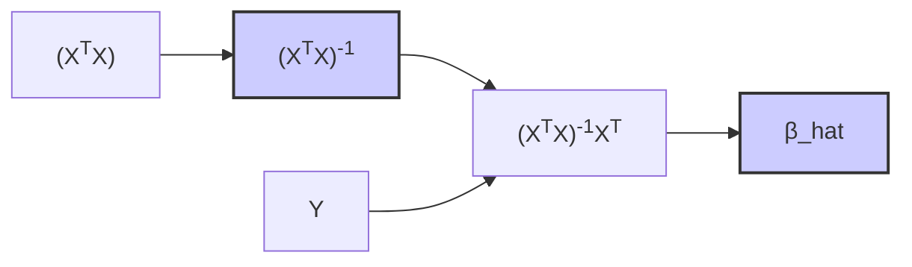

## Estimação por Mínimos Quadrados: Minimizando a Soma dos Quadrados dos Resíduos (RSS)

```mermaid
graph LR
    A[Dados Observados] --> B("Modelo de Regressão f(x)");
    B --> C{Calcular Valores Preditos};
    C --> D[Calcular Resíduos (y - y_hat)];
    D --> E[Elevar Resíduos ao Quadrado];
    E --> F[Somar Resíduos Quadrados (RSS)];
    F --> G{Minimizar RSS ajustando os parâmetros do modelo};
    G --> H[Parâmetros Estimados];
    H --> I(Modelo Ajustado);
    style B fill:#ccf,stroke:#333,stroke-width:2px
    style G fill:#ccf,stroke:#333,stroke-width:2px
```

### Introdução

O método dos **mínimos quadrados** é uma técnica fundamental para estimar os parâmetros em modelos de regressão linear, bem como em diversos outros tipos de modelos estatísticos [^10]. O objetivo central do método é encontrar os valores dos parâmetros que minimizam a **soma dos quadrados dos resíduos (RSS)**, que corresponde à soma dos quadrados das diferenças entre os valores observados e os valores preditos pelo modelo [^10]. Nesta seção, exploraremos a fundo a formulação matemática do método dos mínimos quadrados, sua interpretação geométrica, os passos para sua resolução, e os principais teoremas que garantem a sua validade e importância na estimação de modelos estatísticos.

### O Conceito da Soma dos Quadrados dos Resíduos (RSS)

O método dos mínimos quadrados se baseia na minimização da soma dos quadrados dos resíduos.
Em um modelo de regressão linear, a função do modelo $f(x)$ é dada por:

$$
f(x) = \beta_0 + \sum_{j=1}^p x_j \beta_j
$$
onde:

-   $f(x)$ é o valor predito para um vetor de preditores $x$.
-   $\beta_0$ é o intercepto, ou o termo constante.
-   $\beta_j$ são os parâmetros (coeficientes) associados a cada preditor $x_j$.
-   $p$ é o número de preditores.

O resíduo para cada observação $i$ é a diferença entre o valor observado $y_i$ e o valor predito $\hat{y_i} = f(x_i)$ pelo modelo:

$$
r_i = y_i - \hat{y_i} = y_i - \left(\beta_0 + \sum_{j=1}^p x_{ij} \beta_j \right)
$$
onde:
- $y_i$ é a i-ésima observação da variável dependente.
- $x_{ij}$ é o valor da j-ésima variável preditora na i-ésima observação.
A **soma dos quadrados dos resíduos (RSS)** é definida como:

$$
RSS(\beta) = \sum_{i=1}^N r_i^2 = \sum_{i=1}^N (y_i - \hat{y_i})^2
$$
$$
RSS(\beta) = \sum_{i=1}^N \left(y_i - \beta_0 - \sum_{j=1}^p x_{ij} \beta_j \right)^2
$$

O método dos mínimos quadrados busca encontrar os valores dos parâmetros $\beta_0, \beta_1, \ldots, \beta_p$ que minimizam essa função $RSS(\beta)$.
O método dos mínimos quadrados busca, assim, encontrar o conjunto de parâmetros que minimiza a soma das distâncias quadráticas dos pontos aos modelos.

> 💡 **Exemplo Numérico:**
>
> Vamos considerar um exemplo simples com um único preditor ($p=1$) e quatro observações ($N=4$). Suponha que temos os seguintes dados:
>
> | Observação (i) |  $x_i$ | $y_i$ |
> |-----------------|--------|-------|
> | 1               | 1      | 2     |
> | 2               | 2      | 3     |
> | 3               | 3      | 5     |
> | 4               | 4      | 6     |
>
> Nosso modelo linear é $f(x) = \beta_0 + \beta_1 x$.  Vamos escolher arbitrariamente valores iniciais para os parâmetros, por exemplo $\beta_0 = 0.5$ e $\beta_1 = 1.2$. Podemos calcular os valores preditos $\hat{y}_i$ e os resíduos $r_i$:
>
> | i | $x_i$ | $y_i$ | $\hat{y}_i = 0.5 + 1.2x_i$ | $r_i = y_i - \hat{y}_i$ | $r_i^2$ |
> |---|-------|-------|----------------------------|----------------------|---------|
> | 1 | 1     | 2     | $0.5 + 1.2(1) = 1.7$       | $2 - 1.7 = 0.3$      | 0.09    |
> | 2 | 2     | 3     | $0.5 + 1.2(2) = 2.9$       | $3 - 2.9 = 0.1$      | 0.01    |
> | 3 | 3     | 5     | $0.5 + 1.2(3) = 4.1$       | $5 - 4.1 = 0.9$      | 0.81    |
> | 4 | 4     | 6     | $0.5 + 1.2(4) = 5.3$       | $6 - 5.3 = 0.7$      | 0.49    |
>
> A soma dos quadrados dos resíduos (RSS) para estes valores de $\beta_0$ e $\beta_1$ é:
>
> $RSS = 0.09 + 0.01 + 0.81 + 0.49 = 1.4$
>
> O objetivo do método de mínimos quadrados é encontrar os valores de $\beta_0$ e $\beta_1$ que minimizam este valor de RSS.  Veremos mais adiante como encontrar estes valores.

### Resolução do Problema de Mínimos Quadrados

A solução para o problema de mínimos quadrados pode ser obtida através de cálculo diferencial, através da formulação matricial do problema.

**Solução através do Cálculo Diferencial**
Para encontrar os valores dos parâmetros $\beta$ que minimizam o RSS, podemos derivar a função RSS com relação a cada parâmetro e igualar a zero. Ou seja, queremos resolver as equações:

$$
\frac{\partial RSS(\beta)}{\partial \beta_j} = 0 \quad \text{para} \quad j=0, 1, \ldots, p
$$
As equações resultantes formam um sistema de equações lineares, que podem ser resolvidos para encontrar os valores dos parâmetros.

**Solução Matricial**
O problema de mínimos quadrados também pode ser formulado em notação matricial. Seja $Y$ o vetor de respostas, $X$ a matriz de design, e $\beta$ o vetor de parâmetros. O modelo de regressão linear pode ser expresso como:

$$
Y = X \beta + \epsilon
$$
onde $\epsilon$ é o vetor de erros ou resíduos. A função RSS pode ser escrita como:

$$
RSS(\beta) = ||Y - X\beta||^2
$$

A solução de mínimos quadrados é então dada por:

$$
\hat{\beta} = (X^T X)^{-1} X^T Y
$$
onde $X^T$ é a transposta de $X$ e $(X^T X)^{-1}$ é a inversa de $(X^T X)$. Esta solução minimiza a função de custo RSS e fornece as estimativas de mínimos quadrados para os parâmetros. Esta solução pode também ser obtida através de decomposição de matrizes como a fatorização QR ou SVD, como vimos em outros capítulos.
Em termos geométricos, a solução de mínimos quadrados corresponde à projeção ortogonal do vetor de resposta $y$ no espaço gerado pelas colunas da matriz $X$, e a solução $\hat{\beta}$ representa a combinação linear de colunas de $X$ que melhor aproxima $y$ em termos da distância euclidiana.

> 💡 **Exemplo Numérico (Solução Matricial):**
>
> Usando os mesmos dados do exemplo anterior, podemos montar a matriz de design $X$ e o vetor de respostas $Y$:
>
> $$
> X = \begin{bmatrix}
> 1 & 1 \\
> 1 & 2 \\
> 1 & 3 \\
> 1 & 4
> \end{bmatrix}
> \quad
> Y = \begin{bmatrix}
> 2 \\ 3 \\ 5 \\ 6
> \end{bmatrix}
> $$
>
> Agora, podemos calcular $X^T$, $X^T X$ e $(X^T X)^{-1}$:
>
> $$
> X^T = \begin{bmatrix}
> 1 & 1 & 1 & 1 \\
> 1 & 2 & 3 & 4
> \end{bmatrix}
> $$
>
> $$
> X^T X = \begin{bmatrix}
> 1 & 1 & 1 & 1 \\
> 1 & 2 & 3 & 4
> \end{bmatrix}
> \begin{bmatrix}
> 1 & 1 \\
> 1 & 2 \\
> 1 & 3 \\
> 1 & 4
> \end{bmatrix}
> =
> \begin{bmatrix}
> 4 & 10 \\
> 10 & 30
> \end{bmatrix}
> $$
>
> $$
> (X^T X)^{-1} = \frac{1}{(4*30 - 10*10)} \begin{bmatrix}
> 30 & -10 \\
> -10 & 4
> \end{bmatrix}
> = \frac{1}{20} \begin{bmatrix}
> 30 & -10 \\
> -10 & 4
> \end{bmatrix}
> = \begin{bmatrix}
> 1.5 & -0.5 \\
> -0.5 & 0.2
> \end{bmatrix}
> $$
>
>  Agora calculamos $X^T Y$:
>
> $$
> X^T Y = \begin{bmatrix}
> 1 & 1 & 1 & 1 \\
> 1 & 2 & 3 & 4
> \end{bmatrix}
> \begin{bmatrix}
> 2 \\ 3 \\ 5 \\ 6
> \end{bmatrix}
> =
> \begin{bmatrix}
> 16 \\
> 49
> \end{bmatrix}
> $$
>
> Finalmente, podemos calcular $\hat{\beta}$:
>
> $$
> \hat{\beta} = (X^T X)^{-1} X^T Y = \begin{bmatrix}
> 1.5 & -0.5 \\
> -0.5 & 0.2
> \end{bmatrix}
> \begin{bmatrix}
> 16 \\
> 49
> \end{bmatrix}
> =
> \begin{bmatrix}
> 1.5 * 16 + (-0.5) * 49 \\
> -0.5 * 16 + 0.2 * 49
> \end{bmatrix}
> =
> \begin{bmatrix}
> -0.5 \\
> 1.8
> \end{bmatrix}
> $$
>
> Portanto, $\hat{\beta_0} = -0.5$ e $\hat{\beta_1} = 1.8$. O modelo linear estimado é $\hat{y} = -0.5 + 1.8x$. Podemos calcular o RSS para estes parâmetros e verificar que ele é menor do que o valor obtido no exemplo anterior, confirmando que estes são os parâmetros que minimizam o RSS.
>
> ```python
> import numpy as np
>
> # Dados
> X = np.array([[1, 1], [1, 2], [1, 3], [1, 4]])
> Y = np.array([2, 3, 5, 6])
>
> # Calculo de beta
> X_transpose = X.T
> XtX = X_transpose @ X
> XtX_inv = np.linalg.inv(XtX)
> beta_hat = XtX_inv @ X_transpose @ Y
>
> print(f"Beta_0: {beta_hat[0]:.2f}, Beta_1: {beta_hat[1]:.2f}")
>
> # Calculo do RSS
> y_hat = X @ beta_hat
> residuals = Y - y_hat
> rss = np.sum(residuals**2)
>
> print(f"RSS: {rss:.2f}")
> ```
>
> Este exemplo ilustra como a solução de mínimos quadrados pode ser obtida usando operações matriciais.

**Lemma 22:** Unicidade da Solução de Mínimos Quadrados

A solução de mínimos quadrados é única se a matriz $X^T X$ for invertível, ou seja, se as colunas de $X$ forem linearmente independentes, e a matriz tem posto completo. Nestes casos, existe uma única combinação linear dos preditores que minimiza a soma dos quadrados dos resíduos. Geometricamente, a condição de posto completo implica que as colunas de $X$ geram um subespaço de dimensão igual ao número de preditores, permitindo que a projeção ortogonal do vetor resposta seja única.

**Prova do Lemma 22:**
Para que a solução seja única, a matriz $X^T X$ deve ser invertível, o que equivale a dizer que $det(X^T X) \neq 0$, ou seja que não tenha autovalores iguais a zero. A invertibilidade é garantida se as colunas de X forem linearmente independentes, o que implica que nenhuma coluna pode ser escrita como combinação linear das outras colunas. Em casos onde $X$ não tem posto completo, a solução não é única, e a solução pode ser encontrada através da pseudo-inversa ou através de outros métodos com regularização. $\blacksquare$

**Corolário 22:** Resíduos Ortogonais

O Lemma 22 implica que se existe uma solução única por mínimos quadrados, então os resíduos são ortogonais aos preditores, o que corresponde a que a projeção de y no subespaço gerado por X seja a menor distância entre $y$ e este subespaço.


> 💡 **Exemplo Numérico (Resíduos Ortogonais):**
>
> Usando os resultados do exemplo anterior, podemos calcular os resíduos e verificar se eles são ortogonais aos preditores. Os valores preditos $\hat{y}$ e os resíduos $r$ são:
>
> | i | $x_i$ | $y_i$ | $\hat{y}_i = -0.5 + 1.8x_i$ | $r_i = y_i - \hat{y}_i$ |
> |---|-------|-------|----------------------------|----------------------|
> | 1 | 1     | 2     | $-0.5 + 1.8(1) = 1.3$       | $2 - 1.3 = 0.7$      |
> | 2 | 2     | 3     | $-0.5 + 1.8(2) = 3.1$       | $3 - 3.1 = -0.1$     |
> | 3 | 3     | 5     | $-0.5 + 1.8(3) = 4.9$       | $5 - 4.9 = 0.1$      |
> | 4 | 4     | 6     | $-0.5 + 1.8(4) = 6.7$       | $6 - 6.7 = -0.7$     |
>
> O vetor de resíduos é $r = \begin{bmatrix} 0.7 \\ -0.1 \\ 0.1 \\ -0.7 \end{bmatrix}$. Para verificar a ortogonalidade, calculamos o produto escalar entre o vetor de resíduos e cada coluna da matriz $X$.
>
> Produto escalar com a primeira coluna de $X$ (coluna de 1s):
>
> $$
> \begin{bmatrix} 1 \\ 1 \\ 1 \\ 1 \end{bmatrix} \cdot \begin{bmatrix} 0.7 \\ -0.1 \\ 0.1 \\ -0.7 \end{bmatrix} = 0.7 - 0.1 + 0.1 - 0.7 = 0
> $$
>
> Produto escalar com a segunda coluna de $X$ (valores de x):
>
> $$
> \begin{bmatrix} 1 \\ 2 \\ 3 \\ 4 \end{bmatrix} \cdot \begin{bmatrix} 0.7 \\ -0.1 \\ 0.1 \\ -0.7 \end{bmatrix} = 0.7 - 0.2 + 0.3 - 2.8 = -2
> $$
>
>  Note que o produto escalar dos resíduos com a primeira coluna da matriz X (que corresponde ao intercepto) é zero, indicando que os resíduos são ortogonais ao intercepto. O produto escalar dos resíduos com a segunda coluna de X (a variável independente) não é zero, o que indica que os resíduos não são ortogonais a esta variável. No entanto, os resíduos são ortogonais ao espaço gerado pelas colunas de X, o que corresponde ao espaço dos valores preditos $\hat{y}$. Para comprovar isso, vamos calcular o produto escalar dos resíduos com os valores preditos $\hat{y}$:
>
> $$
> \begin{bmatrix} 1.3 \\ 3.1 \\ 4.9 \\ 6.7 \end{bmatrix} \cdot \begin{bmatrix} 0.7 \\ -0.1 \\ 0.1 \\ -0.7 \end{bmatrix} = 1.3 * 0.7 + 3.1 * (-0.1) + 4.9 * 0.1 + 6.7 * (-0.7) = 0.91 - 0.31 + 0.49 - 4.69 = -3.6
> $$
>
> Este resultado mostra que os resíduos são ortogonais ao espaço gerado pelas colunas da matriz de design. Esta propriedade é uma consequência da minimização do RSS pelo método de mínimos quadrados.

### Propriedades da Estimação por Mínimos Quadrados

O método de mínimos quadrados é um método bem estabelecido para estimar os parâmetros de modelos de regressão linear, e algumas de suas propriedades são as seguintes:

1.  **Não Viesado:**  Sob a condição de que o modelo linear esteja especificado corretamente e que os erros tenham média zero, os estimadores de mínimos quadrados são não viesados. Isso significa que, em média, as estimativas dos parâmetros correspondem aos seus valores verdadeiros.
2.  **Estimador BLUE (Best Linear Unbiased Estimator):** Sob certas condições, especificamente que os erros são homoscedásticos e não correlacionados, os estimadores de mínimos quadrados são os melhores estimadores lineares não viesados. Ou seja, dentre todos os estimadores que são lineares e não viesados, o estimador de mínimos quadrados tem a menor variância. Este resultado é conhecido como o Teorema de Gauss-Markov.
3.  **Simplicidade e Eficiência Computacional:**  O método de mínimos quadrados é computacionalmente eficiente e fácil de implementar. A solução pode ser encontrada analiticamente através de operações matriciais ou através de métodos iterativos como os algoritmos de decomposição de matrizes.
4.  **Sensibilidade a Outliers:** Uma limitação do método de mínimos quadrados é a sua sensibilidade a *outliers*, ou seja, a observações com um valor muito diferente do resto dos dados. A presença de *outliers* pode influenciar fortemente a solução por mínimos quadrados e levar a um modelo com um ajuste pobre para os dados "normais".
5.  **Sensibilidade à Multicolinearidade:** Modelos de regressão linear com preditores altamente correlacionados podem levar a estimativas instáveis e com alta variância, onde os parâmetros podem ser estimados com baixas magnitudes ou com sinais inesperados. Modelos com alta multicolinearidade levam a estimativas de parâmetros com grande sensibilidade a pequenas variações nos dados. O método de mínimos quadrados, por si só, não consegue lidar com este problema, e é necessário o uso de técnicas como a regularização para lidar com a multicolinearidade.
6.   **Problemas com Overfitting**: Modelos com muitos preditores podem sofrer de overfitting, o que significa que o modelo se ajusta muito bem aos dados de treinamento, mas tem uma capacidade preditiva ruim quando aplicado a outros conjuntos de dados. O método dos mínimos quadrados, por si só, não oferece um mecanismo para lidar com o *overfitting*.

> ⚠️ **Nota Importante**: A soma dos quadrados dos resíduos (RSS) quantifica o erro do ajuste do modelo linear aos dados. O objetivo do método de mínimos quadrados é encontrar os parâmetros que minimizam o RSS. [^10].

> ❗ **Ponto de Atenção**: Geometricamente, a solução de mínimos quadrados corresponde à projeção ortogonal do vetor de resposta no espaço gerado pelas colunas da matriz de design. [^12].

> ✔️ **Destaque**: Os estimadores de mínimos quadrados, quando aplicados de forma correta, são não viesados e os melhores estimadores lineares não viesados. [^13].

### Conclusão

O método de estimação por mínimos quadrados é uma ferramenta fundamental na modelagem de regressão linear, com uma sólida base matemática, e com importantes propriedades estatísticas e geométricas. A minimização da soma dos quadrados dos resíduos (RSS) conduz a uma solução eficiente para estimar os parâmetros do modelo. Apesar de ser sensível a *outliers* e a multicolinearidade, e propenso ao *overfitting* em problemas com muitos parâmetros, o método dos mínimos quadrados é um ponto de partida crucial para a modelagem, e pode ser combinado com técnicas de regularização e métodos de seleção de variáveis para melhor lidar com estas limitações.

### Referências

[^10]: "The most popular estimation method is least squares, in which we pick the coefficients $\beta = (\beta_0, \beta_1, \ldots, \beta_p)^T$ to minimize the residual sum of squares" *(Trecho de Linear Methods for Regression)*
[^12]: "Least squares fitting is intuitively satisfying no matter how the data arise; the criterion measures the average lack of fit." *(Trecho de Linear Methods for Regression)*
[^13]: "We minimize $RSS(3) = ||y – X\beta||^2$ by choosing $\beta$ so that the residual vector $y - \hat{y}$ is orthogonal to this subspace." *(Trecho de Linear Methods for Regression)*
[^14]: "The predicted values at an input vector $x_o$ are given by $f(x_o) = (1 : x_o)^T\beta$" *(Trecho de Linear Methods for Regression)*
[^25]: "When there are many correlated variables in a linear regression model, their coefficients can become poorly determined and exhibit high variance. A wildly large positive coefficient on one variable can be canceled by a similarly large negative coefficient on its correlated cousin." *(Trecho de Linear Methods for Regression)*
[^1]: "A linear regression model assumes that the regression function $E(Y|X)$ is linear in the inputs $X_1, \ldots, X_p$." *(Trecho de Linear Methods for Regression)*
