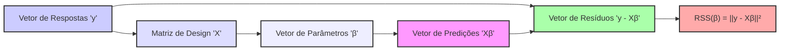
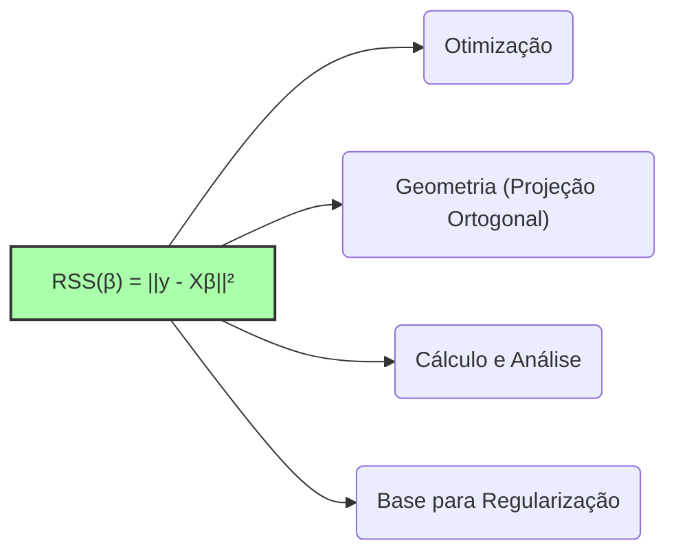

## Formulação Matemática: RSS(β) = ||y - Xβ||² em Modelos de Regressão Linear



### Introdução

A formulação matemática da **Soma dos Quadrados dos Resíduos (RSS)** como $RSS(\beta) = ||y - X\beta||^2$ é fundamental na teoria e prática da regressão linear. Esta formulação expressa o objetivo central da regressão linear por mínimos quadrados, que consiste em encontrar os parâmetros $\beta$ que minimizam a norma euclidiana do vetor de resíduos. Esta expressão resume os conceitos matemáticos da regressão linear, usando os conceitos de álgebra linear. Nesta seção, vamos explorar cada um dos componentes dessa formulação, sua interpretação geométrica, e o porquê dela ser a base do método dos mínimos quadrados.

### Componentes da Formulação RSS(β) = ||y - Xβ||²

A formulação $RSS(\beta) = ||y - X\beta||^2$ é uma representação concisa da função de custo utilizada na regressão linear. Para entendê-la por completo, precisamos detalhar cada um dos seus componentes:

1.  **y:** O vetor $y \in \mathbb{R}^N$ representa o vetor de respostas ou valores observados da variável dependente. Cada elemento $y_i$ do vetor corresponde ao valor observado da variável resposta para a $i$-ésima observação [^10]. A dimensão $N$ do vetor é o número de observações.

> 💡 **Exemplo Numérico:**
> Suponha que temos um conjunto de dados com 4 observações da variável dependente, onde os valores observados são $y_1 = 5$, $y_2 = 8$, $y_3 = 12$, e $y_4 = 15$. O vetor $y$ seria representado como:
>
> $y = \begin{bmatrix} 5 \\ 8 \\ 12 \\ 15 \end{bmatrix}$

2.  **X:** A matriz $X \in \mathbb{R}^{N \times (p+1)}$ é a matriz de design, que contém as informações sobre os preditores para cada observação [^11]. A matriz X é organizada da seguinte forma:
$$
X=
\begin{bmatrix}
    1 & x_{11} & x_{12} & \ldots & x_{1p} \\
    1 & x_{21} & x_{22} & \ldots & x_{2p} \\
    \vdots & \vdots & \vdots & \ddots & \vdots \\
    1 & x_{N1} & x_{N2} & \ldots & x_{Np}
\end{bmatrix}
$$

- A primeira coluna é composta por 1, que representam o *intercepto* do modelo, e servem para modelar uma média na resposta.
- As colunas seguintes contém os valores dos preditores $x_j$, onde $x_{ij}$ é o valor do j-ésimo preditor para a i-ésima observação.
- A dimensão da matriz X é $N \times (p+1)$, onde $N$ é o número de observações e $p$ é o número de preditores.

> 💡 **Exemplo Numérico:**
> Considere que temos duas variáveis preditoras ($p=2$) e as mesmas 4 observações do exemplo anterior. Suponha que os valores dos preditores sejam:
>  - Para a primeira observação: $x_{11} = 2$ e $x_{12} = 3$
>  - Para a segunda observação: $x_{21} = 4$ e $x_{22} = 5$
>  - Para a terceira observação: $x_{31} = 6$ e $x_{32} = 7$
>  - Para a quarta observação: $x_{41} = 8$ e $x_{42} = 9$
> A matriz $X$ seria:
>
> $X = \begin{bmatrix} 1 & 2 & 3 \\ 1 & 4 & 5 \\ 1 & 6 & 7 \\ 1 & 8 & 9 \end{bmatrix}$

3.  **β:** O vetor $\beta \in \mathbb{R}^{p+1}$ representa o vetor de parâmetros ou coeficientes do modelo linear [^11]. O vetor de parâmetros, que deve ser determinado, é da forma:

$$
\beta=
\begin{bmatrix}
    \beta_0 \\
    \beta_1 \\
    \vdots \\
    \beta_p
\end{bmatrix}
$$

   - $\beta_0$ é o coeficiente do *intercept* do modelo, e $\beta_j$ são os coeficientes dos preditores $x_j$.

> 💡 **Exemplo Numérico:**
> No nosso exemplo com dois preditores, o vetor $\beta$ teria três elementos: $\beta_0$ (intercepto), $\beta_1$ (coeficiente para o primeiro preditor), e $\beta_2$ (coeficiente para o segundo preditor). Suponha que, após a regressão, encontramos:
>
> $\beta = \begin{bmatrix} 1 \\ 0.5 \\ 1.2 \end{bmatrix}$
> Isso significa que o modelo linear ajustado é $\hat{y} = 1 + 0.5x_1 + 1.2x_2$

4.  **Xβ:** O produto $X\beta$ representa o vetor de predições do modelo, ou seja, os valores preditos da variável dependente. O resultado do produto é um vetor em $\mathbb{R}^N$, obtido por:

$$
X\beta=
\begin{bmatrix}
    \beta_0 + \sum_{j=1}^p x_{1j} \beta_j\\
    \beta_0 + \sum_{j=1}^p x_{2j} \beta_j\\
    \vdots\\
     \beta_0 + \sum_{j=1}^p x_{Nj} \beta_j
\end{bmatrix}
$$

onde cada elemento corresponde ao valor predito $\hat{y_i}$ para cada observação $i$.

> 💡 **Exemplo Numérico:**
> Usando os valores de $X$ e $\beta$ dos exemplos anteriores, podemos calcular o vetor de predições $X\beta$:
>
> $X\beta = \begin{bmatrix} 1 & 2 & 3 \\ 1 & 4 & 5 \\ 1 & 6 & 7 \\ 1 & 8 & 9 \end{bmatrix} \begin{bmatrix} 1 \\ 0.5 \\ 1.2 \end{bmatrix} = \begin{bmatrix} 1 + 2(0.5) + 3(1.2) \\ 1 + 4(0.5) + 5(1.2) \\ 1 + 6(0.5) + 7(1.2) \\ 1 + 8(0.5) + 9(1.2) \end{bmatrix} = \begin{bmatrix} 5.6 \\ 9 \\ 12.4 \\ 15.8 \end{bmatrix}$
>
> Portanto, os valores preditos são $\hat{y}_1 = 5.6$, $\hat{y}_2 = 9$, $\hat{y}_3 = 12.4$, e $\hat{y}_4 = 15.8$.

5. **y - Xβ:** O termo $(y - X\beta)$ representa o vetor de resíduos $r$, onde cada elemento $r_i$ corresponde ao resíduo (diferença entre valor observado e valor predito) para a i-ésima observação.
$$
r = y - X\beta =
\begin{bmatrix}
    y_1 - (\beta_0 + \sum_{j=1}^p x_{1j} \beta_j) \\
    y_2 - (\beta_0 + \sum_{j=1}^p x_{2j} \beta_j) \\
    \vdots \\
    y_N - (\beta_0 + \sum_{j=1}^p x_{Nj} \beta_j)
\end{bmatrix}
$$

> 💡 **Exemplo Numérico:**
> Calculando os resíduos usando o vetor $y$ original e o vetor de predições $X\beta$:
>
> $r = y - X\beta = \begin{bmatrix} 5 \\ 8 \\ 12 \\ 15 \end{bmatrix} - \begin{bmatrix} 5.6 \\ 9 \\ 12.4 \\ 15.8 \end{bmatrix} = \begin{bmatrix} -0.6 \\ -1 \\ -0.4 \\ -0.8 \end{bmatrix}$
>
> Os resíduos são $r_1 = -0.6$, $r_2 = -1$, $r_3 = -0.4$, e $r_4 = -0.8$.

6.  **||y - Xβ||²:** O termo $||y - X\beta||^2$ representa o quadrado da norma euclidiana (norma L2) do vetor de resíduos, que corresponde à soma dos quadrados dos resíduos. Esta norma é dada por:
$$
||y - X\beta||^2 =  \sum_{i=1}^N (y_i - x_i^T\beta)^2
$$

> 💡 **Exemplo Numérico:**
> Calculando a soma dos quadrados dos resíduos (RSS) usando os resíduos calculados anteriormente:
>
> $RSS(\beta) = ||y - X\beta||^2 = (-0.6)^2 + (-1)^2 + (-0.4)^2 + (-0.8)^2 = 0.36 + 1 + 0.16 + 0.64 = 2.16$
>
> O valor de RSS é 2.16 para este conjunto de dados e parâmetros $\beta$. O objetivo da regressão linear é encontrar os valores de $\beta$ que minimizam este valor.

A função de custo $RSS(\beta)$ é a soma dos quadrados dos resíduos, e o objetivo do método de mínimos quadrados é encontrar o vetor $\beta$ que minimize esta função de custo.

### Interpretação Geométrica da Formulação

A formulação $RSS(\beta) = ||y - X\beta||^2$ tem uma interpretação geométrica importante [^12]:

1.  **Espaço dos Dados:** O vetor de respostas $y$ e o vetor de predições $X\beta$ são pontos no espaço dos dados, onde cada dimensão corresponde a uma observação.
2.  **Projeção Ortogonal:** A solução de mínimos quadrados $\hat{\beta}$ minimiza a distância euclidiana (a norma L2) entre o vetor $y$ e o espaço gerado pelas colunas da matriz $X$. Geometricamente, isso corresponde a encontrar a projeção ortogonal do vetor $y$ no subespaço gerado pelas colunas de $X$.
3.  **Resíduos:** O vetor $y-X\hat{\beta}$ é o vetor de resíduos que representa a diferença entre o valor observado e a sua projeção no espaço dos preditores. Este vetor é ortogonal a todos os vetores neste espaço.
4.  **Distância Euclidiana:** Minimizar $||y - X\beta||^2$ equivale a minimizar o quadrado da distância euclidiana entre o vetor de respostas e o vetor de predições, que é a projeção de y no espaço de preditores.

> 💡 **Exemplo Numérico:**
> Imagine um espaço 2D onde o vetor $y$ é um ponto. As colunas da matriz $X$ definem um subespaço (uma linha, neste caso). A regressão linear busca o ponto nesse subespaço que está mais próximo de $y$. O vetor de resíduos é a linha que conecta o ponto $y$ à sua projeção no subespaço, e esse vetor é perpendicular (ortogonal) ao subespaço.
>
> ```mermaid
> graph LR
>     A(Espaço dos Preditores) --> B(Projeção de y);
>     C(y) --> B;
>     C --> D(Resíduos);
>     style D fill:#f9f,stroke:#333,stroke-width:2px
>     style B fill:#ccf,stroke:#333,stroke-width:2px
>     style A fill:#ddf,stroke:#333,stroke-width:2px
> ```

A interpretação geométrica nos ajuda a entender que o objetivo do método dos mínimos quadrados é encontrar o ponto mais próximo do vetor de respostas no espaço gerado pelos preditores, no sentido da distância euclidiana.

**Lemma 16:** Convexidade da Função RSS

A função de custo RSS é uma função convexa em relação aos parâmetros $\beta$. Esta propriedade implica que a solução do problema de otimização de mínimos quadrados (se ela existir) é um mínimo global, e não apenas um mínimo local.

**Prova do Lemma 16:**

A função RSS pode ser escrita como:

$$
RSS(\beta) = (y - X\beta)^T (y - X\beta)
$$
$$
RSS(\beta) = y^T y - 2 y^T X\beta + \beta^T X^T X \beta
$$

Para mostrar que a função é convexa, é necessário mostrar que a sua matriz Hessiana (matriz das segundas derivadas) é semi-definida positiva. A matriz Hessiana é dada por:
$$ H = \frac{\partial^2 RSS}{\partial \beta \partial \beta^T} = 2 X^T X $$
Dado que $X^T X$ é sempre semi-definida positiva, já que  $z^T X^T X z= ||Xz||^2 \ge 0$, para qualquer vetor $z$, a função RSS é convexa. $\blacksquare$

**Corolário 16:** Unicidade e Estabilidade da Solução

A convexidade da função de custo implica que a solução do problema de mínimos quadrados, se existir, é única, e também garante que a solução seja global e não um mínimo local. Além disso, em muitos casos, esta solução corresponde a uma matriz simétrica e positiva definida.
A garantia de que a solução de mínimos quadrados é um mínimo global, garante que a busca pela solução possa ser feita através de métodos iterativos ou diretos que levam à solução ótima.

### Implicações da Formulação RSS(β) = ||y - Xβ||²

A formulação matemática da RSS como o quadrado da norma euclidiana do vetor de resíduos tem implicações cruciais:

1.  **Otimização:** A formulação nos mostra que a regressão linear por mínimos quadrados é um problema de otimização onde o objetivo é encontrar os parâmetros que minimizam o erro quadrático.
2.  **Geometria:** A formulação nos permite visualizar a regressão linear como um problema geométrico de projeção ortogonal, onde o vetor de predições é a projeção do vetor de resposta no subespaço gerado pelos preditores.
3.  **Cálculo e Análise:**  A formulação matemática permite derivar uma solução analítica para o problema de mínimos quadrados. As propriedades dos métodos de estimação podem ser analisadas a partir das propriedades matemáticas dos parâmetros.
4.  **Penalização e Regularização:** A formulação da RSS é uma base para métodos de regularização, onde a função de custo é modificada ao incluir termos adicionais que penalizam a magnitude dos parâmetros ou a sua complexidade.

> 💡 **Exemplo Numérico:**
> Na regularização Ridge, por exemplo, adicionamos um termo à função RSS, que penaliza valores grandes para $\beta$. A nova função de custo seria $RSS_{ridge}(\beta) = ||y - X\beta||^2 + \lambda ||\beta||^2$, onde $\lambda$ é um parâmetro de ajuste. Isso ilustra como a formulação da RSS serve como base para outros métodos.
>
> O termo $\lambda ||\beta||^2$ adicionado penaliza a magnitude dos parâmetros, e induz um modelo com parâmetros menores, e que seja menos sensível a variações nos dados de treino.
>

A minimização da soma dos quadrados dos resíduos é uma prática que está enraizada na teoria da estatística, e também nos métodos da álgebra linear.

> ⚠️ **Nota Importante**: A formulação $RSS(\beta) = ||y - X\beta||^2$ expressa o objetivo de minimizar a norma euclidiana do vetor de resíduos.

> ❗ **Ponto de Atenção**: A solução de mínimos quadrados é obtida minimizando esta função de custo, e corresponde à projeção ortogonal do vetor de resposta no subespaço dos preditores.

> ✔️ **Destaque**: A função RSS é convexa, o que garante que a solução, se existir, seja um mínimo global.

### Conclusão

A formulação matemática da soma dos quadrados dos resíduos, $RSS(\beta) = ||y - X\beta||^2$, fornece uma base sólida e concisa para o estudo e compreensão da regressão linear. Esta formulação combina conceitos de álgebra linear e estatística, e tem diversas implicações práticas. O entendimento de cada um dos componentes da equação, a sua interpretação geométrica, e a convexidade da função são aspectos que ajudam a usar a regressão linear de forma eficaz e a aplicar técnicas de otimização e regularização.

### Referências

[^10]: "The most popular estimation method is least squares, in which we pick the coefficients β = (β0, β1, ..., βp)T to minimize the residual sum of squares" *(Trecho de Linear Methods for Regression)*
[^11]: "The linear model either assumes that the regression function E(Y|X) is linear, or that the linear model is a reasonable approximation." *(Trecho de Linear Methods for Regression)*
[^12]: "Least squares fitting is intuitively satisfying no matter how the data arise; the criterion measures the average lack of fit." *(Trecho de Linear Methods for Regression)*
