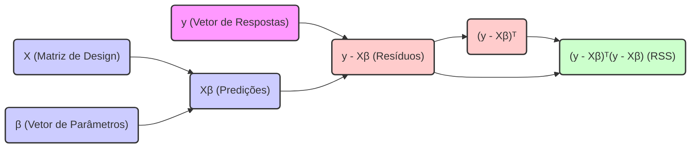

## Formulação Matricial da Soma dos Quadrados dos Resíduos: $RSS(\beta) = (y - X\beta)^T(y - X\beta)$



### Introdução

A formulação matemática da **Soma dos Quadrados dos Resíduos (RSS)** em notação matricial, dada por $RSS(\beta) = (y - X\beta)^T (y - X\beta)$, é uma representação concisa e poderosa que encapsula a essência do método dos mínimos quadrados na regressão linear. Essa formulação, além de ser elegante e compacta, facilita a análise matemática e a implementação computacional de algoritmos relacionados à regressão linear. Neste capítulo, vamos detalhar cada componente dessa expressão, analisar sua relevância e explorar sua relação com a solução de mínimos quadrados.

### Componentes da Formulação Matricial 

### $RSS(\beta) = (y - X\beta)^T(y - X\beta)$

A formulação matricial $RSS(\beta) = (y - X\beta)^T (y - X\beta)$ apresenta a função de custo da regressão linear de forma concisa e eficiente. Vamos analisar cada componente em detalhes:

1.  **y:** O vetor $y \in \mathbb{R}^N$ representa o vetor de respostas ou valores observados da variável dependente, onde cada componente $y_i$ representa a i-ésima observação [^10].
2.  **X:** A matriz $X \in \mathbb{R}^{N \times (p+1)}$ é a matriz de design, também conhecida como matriz de preditores ou matriz de características. Esta matriz tem $N$ linhas, representando as $N$ observações, e $p+1$ colunas, representando o intercepto (primeira coluna de 1) e os $p$ preditores [^11].
3. **β:** O vetor $\beta \in \mathbb{R}^{p+1}$ representa o vetor de parâmetros ou coeficientes do modelo linear. Ele inclui o intercepto e os coeficientes associados aos preditores [^11].
4.  **Xβ:** O produto matricial $X\beta$ representa o vetor de predições do modelo, onde cada elemento $(X\beta)_i$ corresponde à predição do modelo para a $i$-ésima observação. Em essência, o produto $X\beta$ transforma o vetor de parâmetros $\beta$ numa representação do espaço das observações.
5.  **(y - Xβ):** A diferença $(y - X\beta)$ resulta no vetor de resíduos, denotado por $r$, onde cada componente $r_i$ corresponde ao resíduo da i-ésima observação, que é a diferença entre o valor observado ($y_i$) e o valor predito pelo modelo ($(X\beta)_i$).
6. **(y - Xβ)ᵀ:** O termo $(y - X\beta)^T$ representa a transposta do vetor de resíduos. A transposição troca linhas por colunas e colunas por linhas, e tem a propriedade de transformar vetores coluna em vetores linha e vice-versa.
7.  **(y - Xβ)ᵀ(y - Xβ):** Finalmente, o produto $(y - X\beta)^T (y - X\beta)$ é o produto interno do vetor de resíduos consigo mesmo, que resulta na soma dos quadrados de cada componente do vetor de resíduos, que é a soma dos quadrados dos resíduos (RSS):
   $$
   (y - X\beta)^T (y - X\beta) = \sum_{i=1}^{N} (y_i - (X\beta)_i)^2 = \sum_{i=1}^N r_i^2
   $$
   onde:
       -  $N$ é o número de observações,
       -  $y_i$ é a i-ésima observação da variável dependente,
       - $(X\beta)_i$ é o valor predito para a i-ésima observação, e
        - $r_i$ é o resíduo da i-ésima observação.

O objetivo do método dos mínimos quadrados é encontrar o vetor de parâmetros $\beta$ que minimize o valor da soma dos quadrados dos resíduos, $RSS(\beta)$.

> 💡 **Exemplo Numérico:**
>
> Vamos considerar um exemplo simples com $N=3$ observações e um único preditor (além do intercepto), ou seja, $p=1$.
>
> Suponha que temos os seguintes dados:
>
> $$y = \begin{bmatrix} 5 \\ 8 \\ 10 \end{bmatrix}, \quad X = \begin{bmatrix} 1 & 2 \\ 1 & 3 \\ 1 & 4 \end{bmatrix}$$
>
> Aqui, a primeira coluna de $X$ é o intercepto (todos 1s), e a segunda coluna são os valores do preditor.
>
> Vamos assumir um vetor de parâmetros $\beta$ como:
>
> $$\beta = \begin{bmatrix} 1 \\ 2 \end{bmatrix}$$
>
> Agora, vamos calcular $X\beta$:
>
> $$X\beta = \begin{bmatrix} 1 & 2 \\ 1 & 3 \\ 1 & 4 \end{bmatrix} \begin{bmatrix} 1 \\ 2 \end{bmatrix} = \begin{bmatrix} 1*1 + 2*2 \\ 1*1 + 3*2 \\ 1*1 + 4*2 \end{bmatrix} = \begin{bmatrix} 5 \\ 7 \\ 9 \end{bmatrix}$$
>
> Em seguida, calculamos o vetor de resíduos $r = y - X\beta$:
>
> $$r = y - X\beta = \begin{bmatrix} 5 \\ 8 \\ 10 \end{bmatrix} - \begin{bmatrix} 5 \\ 7 \\ 9 \end{bmatrix} = \begin{bmatrix} 0 \\ 1 \\ 1 \end{bmatrix}$$
>
> Finalmente, calculamos a soma dos quadrados dos resíduos $RSS(\beta) = r^T r$:
>
> $$RSS(\beta) = r^T r = \begin{bmatrix} 0 & 1 & 1 \end{bmatrix} \begin{bmatrix} 0 \\ 1 \\ 1 \end{bmatrix} = 0^2 + 1^2 + 1^2 = 2$$
>
> Este valor de 2 representa a soma dos quadrados dos resíduos para o vetor de parâmetros $\beta = \begin{bmatrix} 1 \\ 2 \end{bmatrix}$. O objetivo da regressão linear é encontrar o vetor $\beta$ que minimize este valor.

### Interpretação Geométrica da Formulação Matricial

A formulação matricial da RSS tem uma clara interpretação geométrica [^12]:

1.  **Vetores no Espaço dos Dados:** O vetor $y$ e o vetor de predições $X\beta$ podem ser vistos como vetores no espaço das observações, $\mathbb{R}^N$. Cada componente desses vetores corresponde a uma observação.
2.  **Distância Euclidiana:** O termo $||y - X\beta||$ representa a distância euclidiana entre o vetor de respostas $y$ e o vetor de predições $X\beta$. Minimizar $||y - X\beta||^2$ é equivalente a minimizar o quadrado da distância entre esses dois vetores.
3.  **Projeção Ortogonal:** A solução de mínimos quadrados $\hat{\beta}$ faz com que o vetor de predições $X\hat{\beta}$ seja a projeção ortogonal do vetor de resposta $y$ no subespaço gerado pelas colunas da matriz $X$. A projeção ortogonal garante que a distância entre os vetores seja mínima.
4.  **Ortogonalidade dos Resíduos:** O vetor de resíduos, $y - X\hat{\beta}$, é ortogonal ao espaço gerado pelas colunas de $X$. Isso significa que o vetor de resíduos tem um ângulo de 90 graus com todos os vetores formados por combinações lineares das colunas de $X$.

A interpretação geométrica facilita a compreensão que a solução de mínimos quadrados busca o modelo linear que melhor se ajusta aos dados no sentido da distância euclidiana. O modelo minimiza a distância entre o valor observado e a sua projeção no espaço gerado pelos preditores.

> 💡 **Exemplo Numérico:**
>
> Vamos usar os dados do exemplo anterior para ilustrar a interpretação geométrica.
>
> Temos $y = \begin{bmatrix} 5 \\ 8 \\ 10 \end{bmatrix}$ e $X = \begin{bmatrix} 1 & 2 \\ 1 & 3 \\ 1 & 4 \end{bmatrix}$.
>
> No exemplo anterior, usamos $\beta = \begin{bmatrix} 1 \\ 2 \end{bmatrix}$ e obtivemos $X\beta = \begin{bmatrix} 5 \\ 7 \\ 9 \end{bmatrix}$ e $r = \begin{bmatrix} 0 \\ 1 \\ 1 \end{bmatrix}$.
>
>  Embora não seja a solução ótima, podemos visualizar que $X\beta$ é um vetor no espaço gerado pelas colunas de $X$. Geometricamente, o objetivo é encontrar o vetor $X\hat{\beta}$ que esteja o mais próximo possível de $y$. O resíduo $r$ representa o vetor que conecta $X\beta$ a $y$. Para a solução de mínimos quadrados, este vetor seria ortogonal ao espaço gerado pelas colunas de X.
>
> ```mermaid
> graph LR
>     y(y) --> r(r);
>     Xb(Xβ) --> r;
>     X(Subespaço de X) --> Xb;
>     style y fill:#f9f,stroke:#333,stroke-width:2px
>     style Xb fill:#ccf,stroke:#333,stroke-width:2px
>     style X fill:#cfc,stroke:#333,stroke-width:2px
>     style r fill:#fcc,stroke:#333,stroke-width:2px
>     linkStyle 0,1,2 stroke:#333,stroke-width:2px
> ```
>
> Neste diagrama, $y$ é o vetor de observações, $X\beta$ é o vetor de predições, e $r$ é o vetor de resíduos. A seta entre $X$ e $X\beta$ representa o espaço gerado pelas colunas de $X$. A solução de mínimos quadrados encontra o vetor $X\hat{\beta}$ neste espaço que minimiza a distância a $y$, tornando o resíduo $r$ ortogonal ao espaço $X$.

**Lemma 17:**  Propriedades da Transposição

A transposição de vetores e matrizes tem propriedades que são fundamentais na manipulação da função RSS:
    1.  $(A^T)^T = A$
    2.  $(AB)^T = B^T A^T$
    3. $(a^T b) = (b^T a)$, onde $a$ e $b$ são vetores.
Estas propriedades permitem simplificar expressões, manipular matrizes e vetores, e derivar resultados como a solução de mínimos quadrados.

**Corolário 17:** Solução de Mínimos Quadrados por Derivação Matricial

A solução de mínimos quadrados, $\hat{\beta} = (X^T X)^{-1} X^T y$, pode ser encontrada derivando a função RSS em termos matriciais [^11]. O processo de derivação utiliza as propriedades da transposição e as operações de matrizes. Este resultado permite obter uma solução de forma analítica e eficiente.
A transposta de um produto de matrizes, $(AB)^T = B^T A^T$, é usada na derivação para expandir a função $RSS(\beta)$. A transposta também é utilizada para garantir que o resultado do produto de matrizes seja um escalar, ou seja, para passar do produto interno de dois vetores à sua norma quadrada.

> 💡 **Exemplo Numérico:**
>
> Vamos demonstrar a derivação da solução de mínimos quadrados usando as propriedades da transposição.
>
> Partimos de $RSS(\beta) = (y - X\beta)^T (y - X\beta)$.
>
> **Passo 1:** Expandir a expressão usando a propriedade $(AB)^T = B^T A^T$:
>
> $$RSS(\beta) = (y^T - (X\beta)^T)(y - X\beta) = (y^T - \beta^T X^T)(y - X\beta)$$
>
> **Passo 2:** Distribuir os termos:
>
> $$RSS(\beta) = y^T y - y^T X\beta - \beta^T X^T y + \beta^T X^T X \beta$$
>
> **Passo 3:**  Usando a propriedade $a^T b = b^T a$, podemos reescrever o termo do meio:
>
> $$RSS(\beta) = y^T y - 2\beta^T X^T y + \beta^T X^T X \beta$$
>
> **Passo 4:** Para encontrar o mínimo, derivamos $RSS(\beta)$ em relação a $\beta$ e igualamos a zero:
>
> $$\frac{\partial RSS(\beta)}{\partial \beta} = -2X^T y + 2X^T X \beta = 0$$
>
> **Passo 5:** Resolver para $\beta$:
>
> $$2X^T X \beta = 2X^T y$$
>
> $$X^T X \beta = X^T y$$
>
> $$\beta = (X^T X)^{-1} X^T y$$
>
> Portanto, a solução de mínimos quadrados é $\hat{\beta} = (X^T X)^{-1} X^T y$.
>
> Este exemplo mostra como as propriedades da transposição são utilizadas para derivar a solução de mínimos quadrados de forma concisa e eficiente.

### Implicações da Formulação Matricial

A formulação $RSS(\beta) = (y - X\beta)^T (y - X\beta)$ tem implicações importantes na teoria e prática da regressão linear:

1.  **Derivação da Solução:** A formulação matricial simplifica a derivação da solução de mínimos quadrados. Ao derivar a função RSS com relação a $\beta$, chegamos à solução $\hat{\beta} = (X^T X)^{-1} X^T y$ de forma concisa e elegante.
2.  **Eficiência Computacional:** A representação matricial é facilmente implementável em computadores, usando bibliotecas de álgebra linear eficientes. O uso de bibliotecas de álgebra linear permite computar as soluções de mínimos quadrados com alta eficiência e precisão.
3.  **Generalizações:** A representação matricial da RSS se generaliza facilmente para modelos com várias variáveis dependentes, problemas de mínimos quadrados ponderados, e modelos com estruturas de erro mais complexas, permitindo o uso de métodos mais avançados de modelagem.
4.  **Conexão com Decomposição de Matrizes:** A formulação matricial da RSS tem uma conexão com métodos de decomposição de matrizes, como a fatorização QR e a decomposição em valores singulares (SVD). Estas decomposições podem ser usadas para calcular a solução de mínimos quadrados, especialmente em casos onde a matriz $X^T X$ é mal condicionada.

> 💡 **Exemplo Numérico:**
>
> Vamos usar os dados do exemplo inicial e calcular a solução de mínimos quadrados $\hat{\beta}$ utilizando a fórmula $\hat{\beta} = (X^T X)^{-1} X^T y$.
>
> Temos:
>
> $$y = \begin{bmatrix} 5 \\ 8 \\ 10 \end{bmatrix}, \quad X = \begin{bmatrix} 1 & 2 \\ 1 & 3 \\ 1 & 4 \end{bmatrix}$$
>
> **Passo 1:** Calcular $X^T$:
>
> $$X^T = \begin{bmatrix} 1 & 1 & 1 \\ 2 & 3 & 4 \end{bmatrix}$$
>
> **Passo 2:** Calcular $X^T X$:
>
> $$X^T X = \begin{bmatrix} 1 & 1 & 1 \\ 2 & 3 & 4 \end{bmatrix} \begin{bmatrix} 1 & 2 \\ 1 & 3 \\ 1 & 4 \end{bmatrix} = \begin{bmatrix} 3 & 9 \\ 9 & 29 \end{bmatrix}$$
>
> **Passo 3:** Calcular $(X^T X)^{-1}$:
>
> $$(X^T X)^{-1} = \frac{1}{(3*29 - 9*9)} \begin{bmatrix} 29 & -9 \\ -9 & 3 \end{bmatrix} = \frac{1}{6} \begin{bmatrix} 29 & -9 \\ -9 & 3 \end{bmatrix} = \begin{bmatrix} 29/6 & -3/2 \\ -3/2 & 1/2 \end{bmatrix}$$
>
> **Passo 4:** Calcular $X^T y$:
>
> $$X^T y = \begin{bmatrix} 1 & 1 & 1 \\ 2 & 3 & 4 \end{bmatrix} \begin{bmatrix} 5 \\ 8 \\ 10 \end{bmatrix} = \begin{bmatrix} 23 \\ 74 \end{bmatrix}$$
>
> **Passo 5:** Calcular $\hat{\beta} = (X^T X)^{-1} X^T y$:
>
> $$\hat{\beta} = \begin{bmatrix} 29/6 & -3/2 \\ -3/2 & 1/2 \end{bmatrix} \begin{bmatrix} 23 \\ 74 \end{bmatrix} = \begin{bmatrix} (29/6)*23 + (-3/2)*74 \\ (-3/2)*23 + (1/2)*74 \end{bmatrix} = \begin{bmatrix} -0.333 \\ 6.5 \end{bmatrix}$$
>
> Portanto, a solução de mínimos quadrados é $\hat{\beta} \approx \begin{bmatrix} -0.333 \\ 6.5 \end{bmatrix}$.
>
> Este exemplo demonstra como a formulação matricial permite calcular a solução de mínimos quadrados de forma direta, utilizando operações de álgebra linear. A solução obtida minimiza a soma dos quadrados dos resíduos para os dados fornecidos.

> ⚠️ **Nota Importante**: A formulação $RSS(\beta) = (y - X\beta)^T(y - X\beta)$ expressa a soma dos quadrados dos resíduos em notação matricial, onde $y$ é o vetor de respostas, $X$ a matriz de design e $\beta$ o vetor de parâmetros. **Referência ao contexto [^11]**.

> ❗ **Ponto de Atenção**: A minimização desta função de custo em relação a $\beta$ leva à solução de mínimos quadrados, que corresponde à projeção ortogonal de y no subespaço gerado pelas colunas de X. **Conforme indicado no contexto [^12]**.

> ✔️ **Destaque**: A notação matricial simplifica a derivação matemática da solução, sua implementação e permite uma conexão clara com o processo geométrico. **Baseado no contexto [^11]**.

### Conclusão

A formulação matricial da soma dos quadrados dos resíduos, $RSS(\beta) = (y - X\beta)^T(y - X\beta)$, é uma representação fundamental na regressão linear, com importantes implicações teóricas e práticas. A sua utilização na obtenção da solução de mínimos quadrados, bem como sua importância para métodos de regularização, a tornam um conceito essencial no aprendizado de máquina e análise estatística. Através da compreensão desta formulação e dos seus componentes, podemos entender o funcionamento interno dos métodos de regressão linear e a sua conexão com a álgebra linear.

### Referências

[^10]: "The most popular estimation method is least squares, in which we pick the coefficients $\beta = (\beta_0, \beta_1, \ldots, \beta_p)^T$ to minimize the residual sum of squares" *(Trecho de Linear Methods for Regression)*
[^11]: "The linear model either assumes that the regression function E(Y|X) is linear, or that the linear model is a reasonable approximation." *(Trecho de Linear Methods for Regression)*
[^12]: "Least squares fitting is intuitively satisfying no matter how the data arise; the criterion measures the average lack of fit." *(Trecho de Linear Methods for Regression)*
[^46]: "The predicted values at an input vector $x_o$ are given by $f(x_o) = (1 : x_o)^T\beta$;" *(Trecho de Linear Methods for Regression)*
