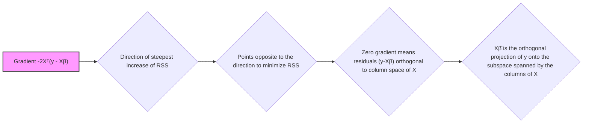

## Derivação da Soma dos Quadrados dos Resíduos em Relação a β: -2Xᵀ(y - Xβ)

```mermaid
flowchart LR
    A[Start] --> B{Define RSS(β) = $||y - X\beta||^2$};
    B --> C{Rewrite RSS(β) = $(y - X\beta)^T(y - X\beta)$};
    C --> D{Expand RSS(β) to $y^Ty - y^TX\beta - \beta^TX^Ty + \beta^TX^TX\beta$};
    D --> E{Simplify RSS(β) to $y^Ty - 2y^TX\beta + \beta^TX^TX\beta$};
    E --> F{Derive RSS(β) w.r.t. β};
    F --> G{Apply derivation rules};
    G --> H{Obtain $\frac{\partial RSS(\beta)}{\partial \beta} = -2X^Ty + 2X^TX\beta$};
    H --> I{Simplify to $-2X^T(y - X\beta)$};
    I --> J{Set derivative to zero: $-2X^T(y - X\beta) = 0$};
    J --> K{Solve for β: $\beta = (X^TX)^{-1}X^Ty$};
    K --> L[End];
    style A fill:#f9f,stroke:#333,stroke-width:2px
    style L fill:#f9f,stroke:#333,stroke-width:2px
```

### Introdução

A derivação da **Soma dos Quadrados dos Resíduos (RSS)** em relação aos parâmetros $\beta$, que resulta na expressão **-2Xᵀ(y - Xβ)**, é um passo fundamental para a compreensão e resolução do problema de regressão linear por mínimos quadrados. Esta derivada, também conhecida como o gradiente da função RSS, indica a direção do maior aumento do erro e serve como base para algoritmos de otimização, como o método de mínimos quadrados. Nesta seção, vamos detalhar o processo de derivação, usando notação matricial, e explorar o significado do resultado.

### O Processo de Derivação

A função da soma dos quadrados dos resíduos (RSS) é definida como:
$$
RSS(\beta) = ||y - X\beta||^2
$$
onde:
-   $y$ é o vetor de respostas.
-   $X$ é a matriz de design.
-   $\beta$ é o vetor de parâmetros.

Para encontrar o vetor $\beta$ que minimiza o RSS, é necessário encontrar o seu gradiente com relação a $\beta$ e igualar a zero. O gradiente, neste caso, corresponde a derivada de $RSS(\beta)$ em relação ao vetor $\beta$. Para realizar a derivada em notação matricial, reescrevemos a equação do RSS utilizando o produto interno de vetores:

$$
RSS(\beta) = (y - X\beta)^T (y - X\beta)
$$
Expandindo esta expressão, obtemos:
$$
RSS(\beta) = (y^T - (X\beta)^T) (y - X\beta) = y^Ty - y^TX\beta - \beta^T X^T y + \beta^T X^T X\beta
$$
Usando a propriedade de que $(AB)^T = B^TA^T$, temos que $y^T X\beta$ é um escalar, e a sua transposta também é um escalar igual, e portanto $y^T X\beta = \beta^T X^T y$. Então podemos escrever o RSS como:
$$
RSS(\beta) = y^T y - 2 y^TX\beta + \beta^T X^TX \beta
$$
Agora, precisamos derivar esta expressão com respeito a $\beta$. Usamos a seguinte propriedade da derivação matricial:
-   $\frac{\partial}{\partial x} a^Tx = a$
-    $\frac{\partial}{\partial x} x^T A x = (A+A^T)x$
onde $a$ é um vetor, $x$ é um vetor e $A$ é uma matriz.
Aplicando estas propriedades, temos:
$$
\frac{\partial RSS(\beta)}{\partial \beta} =  \frac{\partial}{\partial \beta} (y^T y - 2 y^TX\beta + \beta^T X^TX \beta)
$$
$$
\frac{\partial RSS(\beta)}{\partial \beta} =  -2 X^T y + 2 X^T X\beta
$$
$$
\frac{\partial RSS(\beta)}{\partial \beta} = 2 X^T (X\beta - y)
$$
A solução por mínimos quadrados se encontra onde esta derivada é zero:
$$
2 X^T (X\beta - y) = 0
$$
$$
X^T X\beta = X^T y
$$
```mermaid
flowchart LR
    A[RSS Derivative = 0] --> B{$X^T(X\beta - y) = 0$};
    B --> C{$X^TX\beta = X^Ty$};
    C --> D{Solve for β: $(X^TX)\beta = X^Ty$};
    D --> E{$\hat{\beta} = (X^TX)^{-1}X^Ty$};
    style A fill:#f9f,stroke:#333,stroke-width:2px
```
$$
\hat{\beta} = (X^T X)^{-1} X^T y
$$
Portanto, a derivada da função RSS com relação a $\beta$ é:

$$
\frac{\partial RSS(\beta)}{\partial \beta} = -2 X^T (y - X\beta)
$$

O resultado **-2Xᵀ(y - Xβ)** é o gradiente da função RSS em relação ao vetor de parâmetros $\beta$ [^3]. O sinal negativo indica que esta derivada aponta na direção oposta ao crescimento da função RSS, e o valor é duas vezes o produto da transposta da matriz de design com o vetor de resíduos, o que indica a direção de inclinação da função RSS.

> 💡 **Exemplo Numérico:**
>
> Vamos considerar um exemplo simples com 3 pontos de dados para ilustrar o cálculo do gradiente.
>
> Seja $X$ a matriz de design:
> $$
> X = \begin{bmatrix} 1 & 2 \\ 1 & 3 \\ 1 & 4 \end{bmatrix}
> $$
> e $y$ o vetor de respostas:
> $$
> y = \begin{bmatrix} 5 \\ 6 \\ 7 \end{bmatrix}
> $$
>
> Inicialmente, vamos escolher um vetor $\beta$ inicial, por exemplo:
> $$
> \beta = \begin{bmatrix} 1 \\ 1 \end{bmatrix}
> $$
>
> **Passo 1: Calcular $X\beta$**
> $$
> X\beta = \begin{bmatrix} 1 & 2 \\ 1 & 3 \\ 1 & 4 \end{bmatrix} \begin{bmatrix} 1 \\ 1 \end{bmatrix} = \begin{bmatrix} 3 \\ 4 \\ 5 \end{bmatrix}
> $$
>
> **Passo 2: Calcular o vetor de resíduos $(y - X\beta)$**
> $$
> y - X\beta = \begin{bmatrix} 5 \\ 6 \\ 7 \end{bmatrix} - \begin{bmatrix} 3 \\ 4 \\ 5 \end{bmatrix} = \begin{bmatrix} 2 \\ 2 \\ 2 \end{bmatrix}
> $$
>
> **Passo 3: Calcular $X^T$**
> $$
> X^T = \begin{bmatrix} 1 & 1 & 1 \\ 2 & 3 & 4 \end{bmatrix}
> $$
>
> **Passo 4: Calcular o gradiente $-2X^T(y - X\beta)$**
> $$
> -2X^T(y - X\beta) = -2 \begin{bmatrix} 1 & 1 & 1 \\ 2 & 3 & 4 \end{bmatrix} \begin{bmatrix} 2 \\ 2 \\ 2 \end{bmatrix} = -2 \begin{bmatrix} 6 \\ 18 \end{bmatrix} = \begin{bmatrix} -12 \\ -36 \end{bmatrix}
> $$
>
> O gradiente resultante é $\begin{bmatrix} -12 \\ -36 \end{bmatrix}$. Este vetor indica a direção de maior aumento da função RSS para o valor atual de $\beta$. Um algoritmo de otimização usaria este gradiente para ajustar $\beta$ em direção oposta, minimizando o RSS.

### Interpretação Geométrica do Gradiente


O gradiente $\frac{\partial RSS(\beta)}{\partial \beta} = -2 X^T (y - X\beta)$ tem uma interpretação geométrica importante no espaço dos parâmetros:
1. **Direção de Máximo Crescimento:** O gradiente -2Xᵀ(y - Xβ) aponta para a direção no espaço dos parâmetros onde o RSS cresce mais rapidamente.
2. **Perpendicularidade:** A condição para que a solução de mínimos quadrados seja encontrada é que o gradiente seja igual a zero, ou seja $X^T(y-X\beta)=0$. Essa condição corresponde a que o vetor de resíduos $(y-X\beta)$ seja ortogonal ao espaço gerado pelas colunas da matriz $X$, como já visto em outros capítulos.
3. **Projeção Ortogonal:** Geometricamente, o vetor $X\hat{\beta}$ é a projeção ortogonal do vetor de resposta $y$ no subespaço gerado pelas colunas da matriz de design $X$. A derivada da função RSS corresponde à direção de máxima inclinação no espaço dos parâmetros, e o ponto onde essa derivada é zero corresponde à projeção ortogonal do vetor de respostas no espaço gerado pelos preditores.
4. **Busca da solução:** Algoritmos de otimização usam a direção do gradiente para buscar o mínimo da função RSS, partindo de uma estimativa inicial e fazendo ajustes para chegar à solução ótima.
5. **Superfície RSS:**  A derivada -2Xᵀ(y - Xβ) pode ser vista como a inclinação da superfície do RSS em relação ao vetor de parâmetros β. Ao fazer a derivada igual a zero, encontramos o ponto no espaço dos parâmetros onde a superfície da RSS tem uma inclinação zero, o que corresponde a um ponto de mínimo (ou um ponto de sela).

**Lemma 18:**  Convexidade da Função RSS

A função RSS, dada por $RSS(\beta) = ||y - X\beta||^2$, é convexa em relação a $\beta$.  A convexidade da função de custo garante que a solução por mínimos quadrados, quando existir, seja um mínimo global.

**Prova do Lemma 18:**

Para mostrar que $RSS(\beta)$ é convexa, mostramos que a matriz Hessiana, que contém as derivadas de segunda ordem, é semi-definida positiva. A Hessiana é definida como:

$$
H = \frac{\partial^2 RSS(\beta)}{\partial \beta \partial \beta^T} = \frac{\partial}{\partial \beta} (-2 X^T(y - X\beta))^T
= 2X^TX
$$

A matriz $X^T X$ é sempre semi-definida positiva, pois, para qualquer vetor $z$, temos que $z^T (X^T X)z = (Xz)^T Xz = ||Xz||^2 \ge 0$. Como a matriz Hessiana é semi-definida positiva, a função $RSS(\beta)$ é convexa e o mínimo encontrado corresponde a um mínimo global. $\blacksquare$

```mermaid
flowchart LR
    A[RSS(β) = $||y - X\beta||^2$] --> B{Hessian of RSS = $2X^TX$};
    B --> C{$X^TX$ is always positive semi-definite};
    C --> D{Hessian is positive semi-definite};
    D --> E[RSS(β) is convex];
    E --> F[Global minimum is guaranteed];
    style A fill:#f9f,stroke:#333,stroke-width:2px
    style F fill:#f9f,stroke:#333,stroke-width:2px
```

> 💡 **Exemplo Numérico:**
>
> Continuando com o exemplo anterior, vamos calcular a matriz Hessiana $H = 2X^TX$:
>
> **Passo 1: Calcular $X^T X$**
> $$
> X^T X = \begin{bmatrix} 1 & 1 & 1 \\ 2 & 3 & 4 \end{bmatrix} \begin{bmatrix} 1 & 2 \\ 1 & 3 \\ 1 & 4 \end{bmatrix} = \begin{bmatrix} 3 & 9 \\ 9 & 29 \end{bmatrix}
> $$
>
> **Passo 2: Calcular $2X^TX$**
> $$
> H = 2X^TX = 2 \begin{bmatrix} 3 & 9 \\ 9 & 29 \end{bmatrix} = \begin{bmatrix} 6 & 18 \\ 18 & 58 \end{bmatrix}
> $$
>
> A matriz Hessiana é $\begin{bmatrix} 6 & 18 \\ 18 & 58 \end{bmatrix}$. Para verificar se é semi-definida positiva, podemos calcular seus autovalores ou verificar se todos os menores principais são não-negativos. Neste caso, ambos os autovalores são positivos, confirmando que a matriz é definida positiva e, portanto, a função RSS é convexa.

**Corolário 18:** Implicações da Convexidade

A convexidade da função RSS tem implicações importantes. Uma função convexa tem apenas um mínimo global, o que facilita a sua otimização, e garante que o método de mínimos quadrados chegue a uma solução única e estável, se ela existir.

###  Relevância da Derivada na Estimação de Mínimos Quadrados
```mermaid
flowchart LR
    A[Derivative -2Xᵀ(y - Xβ)] --> B{Defines the solution: $\hat{\beta} = (X^TX)^{-1}X^Ty$};
    B --> C{Used in optimization algorithms};
    C --> D{Gradient descent uses the gradient to approach optimal solution};
     D --> E{Links likelihood formulation and optimization};
     E --> F{Vector (y-Xβ) represents the model error};
      style A fill:#f9f,stroke:#333,stroke-width:2px
```

A derivada da função RSS, dada por -2Xᵀ(y - Xβ), é fundamental no método de mínimos quadrados porque:

1.  **Definição da Solução:** Igualar a derivada a zero leva à solução de mínimos quadrados, $\hat{\beta} = (X^T X)^{-1} X^T y$.
2.  **Algoritmos de Otimização:** A derivada é utilizada por algoritmos iterativos de otimização para buscar o mínimo da função RSS. Métodos como *Gradient Descent*, *Stochastic Gradient Descent*, e seus relacionados, se baseiam no gradiente para atualizar os parâmetros do modelo e aproximar a solução ótima.
3.  **Fundamentos da Estatística:** A derivada da função RSS é baseada na formulação da função de *likelihood* no modelo de regressão linear, e representa a conexão entre a estatística e a otimização.
4. **Compreensão do Erro:** O vetor $y - X\beta$, que aparece dentro da derivada, representa o erro do modelo, e a sua ortogonalidade com a matriz de design (quando a derivada é zero) é um requisito da solução de mínimos quadrados.

> ⚠️ **Nota Importante**: A derivada da RSS em relação a β, -2Xᵀ(y - Xβ), corresponde ao gradiente da função, indicando a direção do maior aumento do erro.
 
> ❗ **Ponto de Atenção**:  Igualar essa derivada a zero nos permite obter a solução de mínimos quadrados.

> ✔️ **Destaque**: A derivada -2Xᵀ(y - Xβ) é fundamental tanto na definição da solução de mínimos quadrados, como na construção de algoritmos de otimização.

### Conclusão

A derivação da Soma dos Quadrados dos Resíduos, RSS, em relação aos parâmetros $\beta$ é um passo essencial para encontrar a solução de mínimos quadrados. A expressão resultante, -2Xᵀ(y - Xβ), é o gradiente da função RSS e representa a direção do maior aumento do erro. A derivada permite derivar a solução analítica, bem como desenvolver algoritmos de otimização e permite entender a solução em termos de ortogonalidade. O resultado da derivação enfatiza a combinação de conceitos estatísticos, algébricos e geométricos utilizados na regressão linear.

### Referências

[^10]: "The most popular estimation method is least squares, in which we pick the coefficients β = (β0, β1, ..., βp)T to minimize the residual sum of squares" *(Trecho de Linear Methods for Regression)*
[^11]: "The linear model either assumes that the regression function E(Y|X) is linear, or that the linear model is a reasonable approximation." *(Trecho de Linear Methods for Regression)*
[^12]: "Least squares fitting is intuitively satisfying no matter how the data arise; the criterion measures the average lack of fit." *(Trecho de Linear Methods for Regression)*
[^13]: "We minimize RSS(3) = ||y – Xβ||2 by choosing ẞ so that the residual vector y - ŷ is orthogonal to this subspace" *(Trecho de Linear Methods for Regression)*
