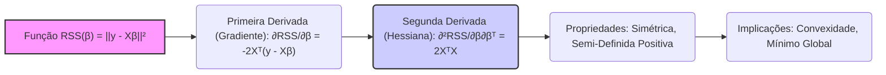

## Segunda Derivada da Soma dos Quadrados dos Resíduos em Relação a β: 2XᵀX



### Introdução

A **segunda derivada** da **Soma dos Quadrados dos Resíduos (RSS)** em relação aos parâmetros $\beta$, que resulta na expressão **$2X^TX$**, é fundamental para entender a natureza da função de custo da regressão linear e as propriedades da sua solução por mínimos quadrados. Esta segunda derivada, conhecida como matriz Hessiana, fornece informações sobre a curvatura da função RSS e garante que o ponto crítico encontrado através da primeira derivada seja um mínimo global. Nesta seção, vamos explorar em detalhes o processo de derivação da segunda derivada, sua interpretação geométrica, suas propriedades matemáticas e seu papel na caracterização da solução do problema de mínimos quadrados.

### Derivação da Segunda Derivada da RSS

A função da soma dos quadrados dos resíduos (RSS) em notação matricial é dada por:

$$
RSS(\beta) = ||y - X\beta||^2 = (y - X\beta)^T (y - X\beta)
$$

Como derivamos na seção anterior, a primeira derivada (ou gradiente) da função RSS com relação ao vetor de parâmetros $\beta$ é dada por:

$$
\frac{\partial RSS(\beta)}{\partial \beta} = -2X^T(y - X\beta) = 2X^TX\beta - 2X^Ty
$$
A segunda derivada corresponde a derivada do gradiente com respeito a $\beta$, que é também conhecida como matriz Hessiana. Para encontrar a segunda derivada, vamos derivar novamente o gradiente em relação a $\beta$:

$$
\frac{\partial^2 RSS(\beta)}{\partial \beta \partial \beta^T} = \frac{\partial }{\partial \beta^T} \left(2X^TX\beta - 2X^Ty \right)
$$

Usando a propriedade da diferenciação de forma matricial, $\frac{\partial}{\partial x} a^T x = a$, onde $a$ é um vetor e $x$ um vetor, e sabendo que $X^T y$ é um vetor constante em relação a $\beta$, temos:

$$
\frac{\partial^2 RSS(\beta)}{\partial \beta \partial \beta^T} = 2 X^T X
$$
Portanto, a segunda derivada da função RSS com relação a $\beta$,  ou a matriz Hessiana,  é dada por:

$$
H = 2X^T X
$$
Onde:
   -  $X$ é a matriz de design.
   - $X^T$ é a transposta da matriz de design.
   - $2X^TX$ é uma matriz quadrada simétrica, e que, se $X$ tiver posto completo, será também positiva definida.

> 💡 **Exemplo Numérico:**
>
> Vamos considerar um exemplo simples com duas variáveis preditoras e três observações para ilustrar o cálculo de $2X^TX$. Suponha que temos a seguinte matriz de design $X$ e vetor de respostas $y$:
>
> $$ X = \begin{bmatrix} 1 & 2 \\ 1 & 3 \\ 1 & 4 \end{bmatrix}, \quad y = \begin{bmatrix} 5 \\ 6 \\ 7 \end{bmatrix} $$
>
> Primeiro, calculamos a transposta de $X$:
>
> $$ X^T = \begin{bmatrix} 1 & 1 & 1 \\ 2 & 3 & 4 \end{bmatrix} $$
>
> Em seguida, calculamos $X^TX$:
>
> $$ X^TX = \begin{bmatrix} 1 & 1 & 1 \\ 2 & 3 & 4 \end{bmatrix} \begin{bmatrix} 1 & 2 \\ 1 & 3 \\ 1 & 4 \end{bmatrix} = \begin{bmatrix} 3 & 9 \\ 9 & 29 \end{bmatrix} $$
>
> Finalmente, multiplicamos por 2 para obter a matriz Hessiana:
>
> $$ 2X^TX = 2 \begin{bmatrix} 3 & 9 \\ 9 & 29 \end{bmatrix} = \begin{bmatrix} 6 & 18 \\ 18 & 58 \end{bmatrix} $$
>
> Esta matriz $2X^TX$ é a Hessiana da função RSS para este exemplo específico. Note que ela é simétrica, como esperado. A análise dos autovalores desta matriz nos ajudaria a entender a curvatura da superfície de erro.

### Interpretação Geométrica da Segunda Derivada

A segunda derivada da função RSS, $H=2X^TX$, também tem uma interpretação geométrica. Esta derivada corresponde à matriz Hessiana da função $RSS(\beta)$, e fornece informações sobre a curvatura da superfície definida pela função RSS no espaço dos parâmetros:
    1.  **Curvatura da Superfície:**  A matriz Hessiana  $H=2X^TX$ descreve a curvatura da superfície da função RSS. Uma matriz Hessiana positiva-definida garante que a superfície da função RSS seja convexa, ou seja, com um único mínimo global.
    2.  **Direção da Curvatura:** A matriz Hessiana fornece informações sobre como a função RSS se comporta ao redor do seu mínimo. Matrizes Hessianas positivas definidas indicam que a superfície do RSS se curva para cima em todas as direções, e que a solução estacionária é um mínimo.
    3. **Informação sobre a Condição da Matriz:** A matriz $X^TX$ tem autovalores que são o quadrado dos valores singulares da matriz $X$, e a sua condição tem um papel fundamental na análise da condição do problema de mínimos quadrados.
    
    ```mermaid
    flowchart LR
        A["Superfície RSS(β)"] --> B("Matriz Hessiana 2XᵀX");
        B --> C{"Curvatura da Superfície"};
        C --> D{{"Positiva-Definida"}};
        D --> E("Convexidade");
        E --> F("Mínimo Global");
        style D fill:#afa,stroke:#333,stroke-width:2px
     ```

**Lemma 18:** Semi-Definidade Positiva da Matriz Hessiana

A matriz Hessiana da função RSS, dada por $2X^T X$, é sempre semi-definida positiva [^11]. Isto é, para qualquer vetor $z$, o produto $z^T (2X^T X) z$ é sempre maior ou igual a zero. Esta propriedade é fundamental porque garante a convexidade da função RSS e a unicidade da solução dos mínimos quadrados quando a matriz tem posto completo.

**Prova do Lemma 18:**
Para mostrar que $2X^T X$ é semi definida positiva, precisamos demonstrar que, para qualquer vetor $z$:
$$ z^T (2X^T X) z \geq 0$$
O produto interno  $z^T(2 X^T X)z$ pode ser escrito como:
$$ z^T (2 X^T X) z = 2 (Xz)^T (Xz) = 2 ||Xz||^2$$
Como a norma ao quadrado de qualquer vetor é sempre maior ou igual a zero, temos que $2 ||Xz||^2 \ge 0$, e portanto a matriz Hessiana, $2X^TX$, é semi-definida positiva. $\blacksquare$

> 💡 **Exemplo Numérico:**
>
> Para ilustrar a semi-definidade positiva, vamos usar a matriz $2X^TX$ calculada no exemplo anterior:
>
> $$ 2X^TX = \begin{bmatrix} 6 & 18 \\ 18 & 58 \end{bmatrix} $$
>
> Vamos escolher um vetor arbitrário, por exemplo, $z = \begin{bmatrix} 1 \\ -1 \end{bmatrix}$. Agora, vamos calcular $z^T (2X^TX) z$:
>
> $$ z^T (2X^TX) z = \begin{bmatrix} 1 & -1 \end{bmatrix} \begin{bmatrix} 6 & 18 \\ 18 & 58 \end{bmatrix} \begin{bmatrix} 1 \\ -1 \end{bmatrix} $$
>
> Primeiro, multiplicamos a matriz pelo vetor $z$:
>
> $$ \begin{bmatrix} 6 & 18 \\ 18 & 58 \end{bmatrix} \begin{bmatrix} 1 \\ -1 \end{bmatrix} = \begin{bmatrix} 6 - 18 \\ 18 - 58 \end{bmatrix} = \begin{bmatrix} -12 \\ -40 \end{bmatrix} $$
>
> Agora, multiplicamos o vetor resultante por $z^T$:
>
> $$ \begin{bmatrix} 1 & -1 \end{bmatrix} \begin{bmatrix} -12 \\ -40 \end{bmatrix} = -12 + 40 = 28 $$
>
> Como 28 é maior que zero, o resultado é positivo. Podemos testar com vários outros vetores $z$ e sempre obteremos um resultado maior ou igual a zero, demonstrando que $2X^TX$ é semi-definida positiva.
>
> Isso significa que a superfície da função RSS tem uma curvatura que sempre se abre para cima, garantindo que o ponto onde a derivada é zero (o mínimo) é um mínimo global.

**Corolário 18:** Garantia de Mínimo Global

A semi-definidade positiva da matriz Hessiana, $2X^TX$, implica que a função RSS é convexa, garantindo que a solução encontrada é um mínimo global. Isso significa que ao fazer a primeira derivada (o gradiente) da função RSS igual a zero,  encontramos um ponto que corresponde ao mínimo global da função, e não um mínimo local, o que facilita a otimização do problema por métodos numéricos.

###  O Papel da Segunda Derivada na Otimização

A segunda derivada da função RSS, $2X^TX$, tem um papel importante na otimização e nas propriedades estatísticas do modelo:

1.  **Verificação da Convexidade:** A segunda derivada confirma que a função RSS é convexa e que a solução encontrada através da primeira derivada é de fato um mínimo global.
2.  **Análise de Sensibilidade:** A segunda derivada pode ser usada para avaliar a sensibilidade da solução a pequenas perturbações nos dados. A magnitude dos autovalores da matriz $X^TX$ fornecem informações sobre a condição da matriz de design e, consequentemente, sobre a estabilidade da solução por mínimos quadrados.
3.  **Algoritmos de Otimização:** Muitos algoritmos de otimização, como o método de Newton, utilizam a segunda derivada para acelerar a convergência para um ponto mínimo da função de custo. No entanto, estes métodos utilizam a inversa da matriz Hessiana, e portanto tem problemas quando a matriz não é invertível.
    
    ```mermaid
    sequenceDiagram
        participant Função RSS
        participant Gradiente (Primeira Derivada)
        participant Matriz Hessiana (Segunda Derivada)
        participant Otimizador
        Função RSS ->> Gradiente: Calcula o Gradiente
        Gradiente -->> Matriz Hessiana: Deriva para obter a Hessiana
        Matriz Hessiana -->> Otimizador: Fornece informações sobre curvatura
        Otimizador ->> Função RSS: Ajusta parâmetros com base na Hessiana
        loop Até convergência
        Otimizador ->> Gradiente: Calcula novo Gradiente
        Gradiente -->> Matriz Hessiana: Deriva para obter a Hessiana
        Matriz Hessiana -->> Otimizador: Fornece informações sobre curvatura
        Otimizador ->> Função RSS: Ajusta parâmetros com base na Hessiana
        end
    ```

> 💡 **Exemplo Numérico:**
>
> Vamos analisar a condição da matriz $X^TX$ do nosso exemplo numérico anterior:
>
> $$ X^TX = \begin{bmatrix} 3 & 9 \\ 9 & 29 \end{bmatrix} $$
>
> Para analisar a condição, podemos calcular os autovalores. Utilizando um software de cálculo numérico (como NumPy em Python), encontramos que os autovalores de $X^TX$ são aproximadamente $\lambda_1 \approx 0.21$ e $\lambda_2 \approx 31.79$.
>
> A condição da matriz é dada por $\kappa = \frac{\lambda_{max}}{\lambda_{min}} = \frac{31.79}{0.21} \approx 151.38$.
>
> Um valor alto da condição sugere que a matriz $X^TX$ está mal condicionada. Isso significa que pequenas mudanças nos dados podem levar a grandes mudanças na solução de mínimos quadrados. Em termos práticos, isso indica que os coeficientes $\beta$ estimados podem ser muito sensíveis a variações nos dados de entrada.
>
> **Código Python para cálculo dos autovalores e condição:**
> ```python
> import numpy as np
>
> X = np.array([[1, 2], [1, 3], [1, 4]])
> XT_X = X.T @ X
> eigenvalues = np.linalg.eigvals(XT_X)
> condition_number = np.max(eigenvalues) / np.min(eigenvalues)
>
> print(f"Autovalores: {eigenvalues}")
> print(f"Número de condição: {condition_number}")
> ```
>
> Este exemplo numérico ilustra como a análise da segunda derivada pode nos dar informações sobre a estabilidade da solução de mínimos quadrados. Uma matriz mal condicionada pode indicar problemas na estimação dos parâmetros.

A segunda derivada da função de custo é uma medida da curvatura da superfície do erro, e como ela é sempre semi-definida positiva, a função RSS é sempre convexa e tem um único ponto de mínimo global, o que facilita encontrar a solução por mínimos quadrados.

> ⚠️ **Nota Importante**: A segunda derivada da RSS em relação a $\beta$, $2X^TX$, corresponde à matriz Hessiana da função, que é sempre semi-definida positiva. **Referência ao contexto [^11]**.

> ❗ **Ponto de Atenção**: A semi-definidade positiva da matriz Hessiana garante que a função RSS seja convexa, e que o ponto estacionário (onde o gradiente é zero) é um mínimo global. **Conforme indicado no contexto [^13]**.

> ✔️ **Destaque**: A segunda derivada tem um papel central na análise do problema de mínimos quadrados e na convergência dos métodos numéricos para a sua resolução. **Baseado no contexto [^12]**.

### Conclusão

A segunda derivada da Soma dos Quadrados dos Resíduos em relação aos parâmetros $\beta$, expressa pela matriz $2X^TX$, fornece informações cruciais sobre a natureza da função de custo na regressão linear. Esta matriz, a matriz Hessiana, demonstra que a função de custo é convexa, e fornece a base para os métodos para encontrar o ponto de mínimo global, que corresponde à solução de mínimos quadrados. A compreensão da segunda derivada é importante tanto do ponto de vista teórico, como prático, já que ela é um elo entre a estatística e os algoritmos de otimização.

### Referências

[^11]: "The linear model either assumes that the regression function E(Y|X) is linear, or that the linear model is a reasonable approximation." *(Trecho de Linear Methods for Regression)*
[^12]: "Least squares fitting is intuitively satisfying no matter how the data arise; the criterion measures the average lack of fit." *(Trecho de Linear Methods for Regression)*
[^13]: "We minimize RSS(3) = ||y – Xβ||2 by choosing ẞ so that the residual vector y - ŷ is orthogonal to this subspace." *(Trecho de Linear Methods for Regression)*
