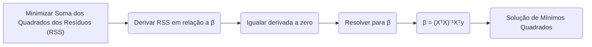
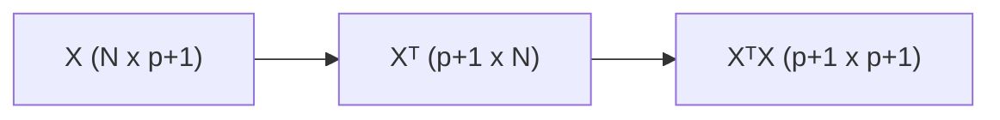
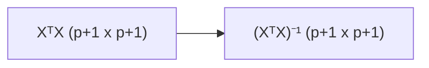
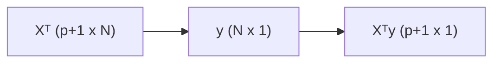
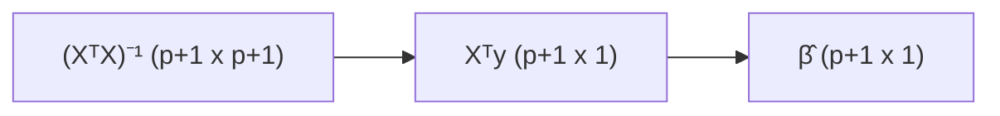
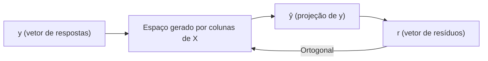

## A Solução de Mínimos Quadrados: $\beta = (X^TX)^{-1}X^Ty$



### Introdução
A expressão **$\beta = (X^TX)^{-1}X^Ty$** representa a solução analítica do problema de regressão linear por mínimos quadrados. Esta formulação, que é amplamente utilizada na estatística e no aprendizado de máquina, define o vetor de parâmetros $\beta$ que minimiza a soma dos quadrados dos resíduos, e estabelece a base para a estimação dos coeficientes em modelos lineares. Esta seção explorará cada componente dessa solução, sua derivação matemática e sua importância prática para o aprendizado de máquina e análise de dados.

### Componentes da Solução $\beta = (X^TX)^{-1}X^Ty$

Para entender a solução por mínimos quadrados, é importante detalhar cada componente da expressão $\beta = (X^T X)^{-1} X^T y$:

1.  **X:** A matriz $X \in \mathbb{R}^{N \times (p+1)}$ é a matriz de design, onde cada linha representa uma observação e as colunas representam as variáveis preditoras e um *intercept*. A primeira coluna da matriz $X$ é usualmente composta por valores iguais a 1, para o *intercept* do modelo, e as demais colunas correspondem aos valores dos $p$ preditores para cada observação, ou seja, $X = [1, x_1, x_2, ..., x_p]$ [^11].

> 💡 **Exemplo Numérico:**
> Suponha que temos um conjunto de dados com 3 observações e 2 preditores. A matriz de design $X$ seria:
> ```python
> import numpy as np
>
> X = np.array([[1, 2, 3],
>               [1, 4, 5],
>               [1, 6, 7]])
> print("Matriz X:\n", X)
> ```
> Aqui, a primeira coluna de 1's representa o intercepto, e as outras duas colunas representam os valores dos dois preditores para cada observação.

2.  **Xᵀ:** A matriz $X^T \in \mathbb{R}^{(p+1) \times N}$ é a transposta da matriz de design. A transposição troca as linhas e colunas da matriz, de forma que cada coluna de $X$ se torna uma linha de $X^T$, e vice-versa.

> 💡 **Exemplo Numérico:**
> Usando a matriz $X$ do exemplo anterior, a matriz transposta $X^T$ seria:
> ```python
> XT = X.T
> print("Matriz XT:\n", XT)
> ```
> Cada linha de $X$ tornou-se uma coluna em $X^T$.

3.  **XᵀX:** O produto matricial $X^TX \in \mathbb{R}^{(p+1) \times (p+1)}$ resulta em uma matriz simétrica e positiva semi-definida. Essa matriz é utilizada no cálculo da inversa, e no caso de posto completo, é uma matriz invertível.


> 💡 **Exemplo Numérico:**
> Calculando $X^TX$ usando a matriz $X$ do exemplo anterior:
> ```python
> XTX = np.dot(XT, X)
> print("Matriz XTX:\n", XTX)
> ```
> O resultado é uma matriz 3x3, simétrica.

4. **(XᵀX)⁻¹:** A matriz $(X^TX)^{-1} \in \mathbb{R}^{(p+1) \times (p+1)}$ é a inversa da matriz $X^TX$. A inversa de uma matriz existe se a matriz é não singular, o que significa que seu determinante é diferente de zero. A invertibilidade de $X^TX$ está diretamente ligada a independência linear das colunas de $X$.


> 💡 **Exemplo Numérico:**
> Calculando a inversa de $X^TX$:
> ```python
> try:
>     XTX_inv = np.linalg.inv(XTX)
>     print("Inversa de XTX:\n", XTX_inv)
> except np.linalg.LinAlgError:
>     print("A matriz XTX não é invertível.")
> ```
> É importante notar que nem sempre a matriz $X^TX$ é invertível, o que aconteceria se as colunas de X não fossem linearmente independentes.

5.  **Xᵀy:** O produto matricial $X^T y \in \mathbb{R}^{(p+1) \times 1}$ resulta num vetor, onde $y \in \mathbb{R}^N$ é o vetor de respostas da variável dependente. Cada componente do vetor resultante é um produto interno do vetor de resposta $y$ com cada uma das colunas da matriz $X$.


> 💡 **Exemplo Numérico:**
> Suponha que o vetor de respostas $y$ seja:
> ```python
> y = np.array([7, 10, 13])
> print("Vetor y:\n", y)
> ```
> Calculando $X^Ty$:
> ```python
> XTy = np.dot(XT, y)
> print("Vetor XTy:\n", XTy)
> ```

6.  **(XᵀX)⁻¹Xᵀy:** Finalmente, o produto matricial $(X^T X)^{-1} X^T y \in \mathbb{R}^{(p+1) \times 1}$ resulta no vetor $\hat{\beta}$, que contém os estimadores de mínimos quadrados para os parâmetros do modelo.


> 💡 **Exemplo Numérico:**
> Calculando $\hat{\beta}$:
> ```python
> beta_hat = np.dot(XTX_inv, XTy)
> print("Vetor beta_hat:\n", beta_hat)
> ```
> Este vetor $\hat{\beta}$ contém as estimativas dos parâmetros do modelo linear.

A expressão $\hat{\beta} = (X^T X)^{-1} X^T y$ representa a solução analítica do problema de mínimos quadrados, que minimiza a soma dos quadrados dos resíduos (RSS).

### Derivação da Solução de Mínimos Quadrados

A solução de mínimos quadrados pode ser obtida derivando a função RSS em relação ao vetor de parâmetros $\beta$, igualando o resultado a zero, e resolvendo a equação resultante [^11]:

A função RSS pode ser escrita como:
$$
RSS(\beta) = (y - X\beta)^T(y - X\beta)
$$
Derivando RSS com relação a $\beta$, temos:
$$
\frac{\partial RSS(\beta)}{\partial \beta} = -2X^T(y - X\beta)
$$
A solução de mínimos quadrados é obtida igualando esta derivada a zero:
$$
-2X^T(y - X\hat{\beta}) = 0
$$
Resolvendo para $\hat{\beta}$, obtemos a expressão para os estimadores de mínimos quadrados:
$$
X^T y - X^T X \hat{\beta} = 0
$$
$$
X^T X \hat{\beta} = X^T y
$$
$$
\hat{\beta} = (X^T X)^{-1} X^T y
$$

Este resultado é fundamental na teoria da regressão linear, e garante que, sob algumas condições (como o posto completo de X), a função RSS é minimizada no ponto $\hat{\beta}$.

### Interpretação Geométrica da Solução

A solução de mínimos quadrados tem uma interpretação geométrica importante. Ela representa a projeção ortogonal do vetor resposta $y$ no espaço gerado pelas colunas da matriz de design $X$ [^12]. A solução $\hat{\beta}$ é tal que o vetor de predições $\hat{y} = X\hat{\beta}$ corresponde ao ponto no espaço dos preditores que é mais próximo de $y$, no sentido da distância euclidiana.
O vetor de resíduos, $r = y - X\hat{\beta}$, é ortogonal a qualquer vetor que pertença ao espaço gerado pelas colunas de $X$, o que corresponde à condição de mínimo da RSS, e a solução $\hat{\beta}$ é a que faz o vetor de predições $\hat{y}$ ser mais próximo do vetor $y$ [^13].
The matrix $(X^TX)^{-1}X^T$ is, in essence, a matrix that projects the response vector $y$ into the space spanned by the columns of the matrix $X$, and the result of this projection is the prediction vector $\hat{y}$, and the difference $y-\hat{y}$ is orthogonal to this subspace.

> 💡 **Exemplo Numérico:**
> Para visualizar a interpretação geométrica, podemos calcular o vetor de predições $\hat{y}$ e o vetor de resíduos $r$ usando os valores dos exemplos anteriores.
> ```python
> y_hat = np.dot(X, beta_hat)
> print("Vetor y_hat:\n", y_hat)
>
> r = y - y_hat
> print("Vetor de Resíduos r:\n", r)
>
> # Verificação da ortogonalidade:
> orthogonality_check = np.dot(X.T, r)
> print("Verificação da ortogonalidade (X^T * r):\n", orthogonality_check)
> ```
> A ortogonalidade entre o espaço gerado pelas colunas de $X$ e o vetor de resíduos $r$ é verificada quando o produto interno de $X^T$ e $r$ é aproximadamente zero (devido a possíveis erros de arredondamento).


**Lemma 20:** A Invertibilidade da Matriz $X^TX$
A matriz $X^T X$ é invertível se, e somente se, as colunas da matriz $X$ forem linearmente independentes, ou seja, se a matriz $X$ tiver posto completo. Essa condição é necessária para garantir a unicidade da solução do problema de mínimos quadrados.

**Prova do Lemma 20:**

A matriz $X^TX$ é invertível se seu determinante for diferente de zero. Alternativamente, a matriz $X^T X$ é invertível se nenhum dos seus autovalores forem zero. A matriz $X^TX$ é semi-definida positiva, e para garantir que seja positiva definida é necessário garantir que todos os seus autovalores sejam positivos.
Se o posto da matriz $X$ é completo (todas as colunas linearmente independentes), então a matriz $X^T X$ é positiva definida e invertível, e podemos computar o inverso. Se as colunas de $X$ não forem linearmente independentes, então o posto de $X$ será menor do que o número de colunas, a matriz $X^TX$ não será invertível e teremos infinitas soluções para o problema de mínimos quadrados. Nestes casos, são necessárias outras técnicas como a pseudoinversa ou decomposições como o SVD. $\blacksquare$

**Corolário 20:** A Relação com a Projeção Ortogonal

O Lemma 20 implica que se a matriz X tem posto completo, então o produto $(X^TX)^{-1} X^T y$ é a projeção ortogonal de $y$ no subespaço definido pelas colunas da matriz $X$. Se a matriz não tiver posto completo, então é possível obter uma solução através da pseudo-inversa.
A interpretação geométrica do produto $(X^T X)^{-1} X^T y$ como a projeção ortogonal de y no espaço dos preditores é fundamental para entender o significado da solução por mínimos quadrados. A garantia da invertibilidade do produto $X^TX$ é também fundamental para garantir a existência de uma solução única.

### Implicações e Importância da Solução $\beta = (X^TX)^{-1}X^Ty$

A solução $\hat{\beta} = (X^T X)^{-1} X^T y$ tem implicações teóricas e práticas:

1.  **Base Teórica da Regressão Linear:** A solução demonstra como a álgebra linear é utilizada na solução de um problema de otimização para encontrar os parâmetros que melhor ajustam a função linear aos dados.
2.  **Estimativa dos Parâmetros:** A solução define de forma analítica como os parâmetros podem ser estimados, usando os dados da amostra. Isso permite analisar e comparar diferentes conjuntos de dados.
3.  **Fundamento para Algoritmos de Otimização:** A solução de mínimos quadrados fornece um ponto de partida para o desenvolvimento de métodos computacionais mais avançados, e para lidar com problemas onde há a necessidade de utilizar métodos iterativos.
4. **Conexão com Decomposição de Matrizes**: A solução por mínimos quadrados também pode ser obtida por decomposições de matrizes, como as fatorizações QR e SVD. Estas decomposições são úteis para lidar com problemas de multicolinearidade ou quando a matriz $X^TX$ não é invertível.

> 💡 **Exemplo Numérico:**
> Para ilustrar a conexão com a decomposição de matrizes, podemos usar a função `numpy.linalg.lstsq` para resolver o mesmo problema. Esta função usa a decomposição SVD para lidar com casos onde $X^TX$ não é invertível:
> ```python
> beta_hat_lstsq, residuals, rank, singular_values = np.linalg.lstsq(X, y, rcond=None)
> print("Beta hat usando lstsq:\n", beta_hat_lstsq)
> print("Resíduos:\n", residuals)
> print("Posto da matriz X:", rank)
> ```
> Comparando `beta_hat` obtido diretamente com `beta_hat_lstsq`, podemos verificar que os resultados são os mesmos (ou muito próximos), mesmo que a função `lstsq` use uma abordagem diferente (SVD) para resolver o sistema. Em casos de multicolinearidade ou quando $X^TX$ não é invertível, `lstsq` é mais robusto que o cálculo direto da inversa.

O entendimento da formulação matricial da solução por mínimos quadrados é fundamental para a compreensão dos modelos de regressão linear e para o uso de ferramentas e métodos mais sofisticados.

> ⚠️ **Nota Importante**:  A solução por mínimos quadrados é dada por $\hat{\beta} = (X^T X)^{-1} X^T y$, onde X é a matriz de design e y é o vetor de respostas. [^11].
 
> ❗ **Ponto de Atenção**:  A matriz $X^T X$ deve ser invertível para garantir a existência de uma solução única, o que requer que as colunas da matriz X sejam linearmente independentes. [^11].

> ✔️ **Destaque**:  A solução de mínimos quadrados pode ser interpretada geometricamente como a projeção ortogonal do vetor de respostas no subespaço gerado pelos preditores. [^12].

### Conclusão

A solução analítica $\hat{\beta} = (X^T X)^{-1} X^T y$ para o problema de mínimos quadrados é um dos pilares da regressão linear, que fornece um método eficiente e elegante para estimar os parâmetros de modelos lineares. A sua derivação, bem como as suas propriedades, são importantes para o entendimento da sua aplicação na modelagem estatística e aprendizado de máquina. Através da formulação matricial é possível derivar a solução de mínimos quadrados e entender a sua conexão com a álgebra linear e a geometria da projeção ortogonal.

### Referências
[^10]: "The most popular estimation method is least squares, in which we pick the coefficients $\beta = (\beta_0, \beta_1, ..., \beta_p)^T$ to minimize the residual sum of squares" *(Trecho de Linear Methods for Regression)*
[^11]: "The linear model either assumes that the regression function E(Y|X) is linear, or that the linear model is a reasonable approximation." *(Trecho de Linear Methods for Regression)*
[^12]: "Least squares fitting is intuitively satisfying no matter how the data arise; the criterion measures the average lack of fit." *(Trecho de Linear Methods for Regression)*
[^13]: "We minimize RSS(3) = ||y – Xβ||2 by choosing ẞ so that the residual vector y - ŷ is orthogonal to this subspace." *(Trecho de Linear Methods for Regression)*
