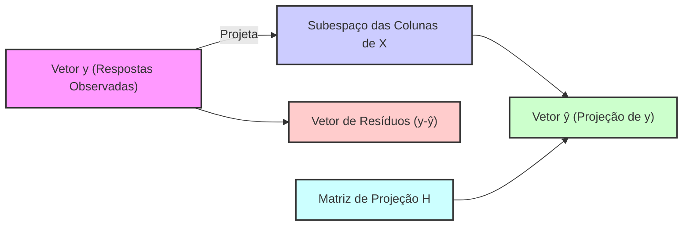
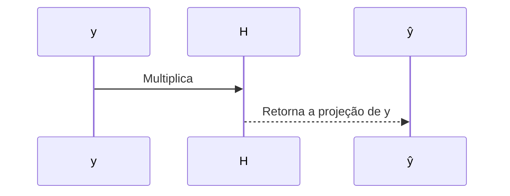
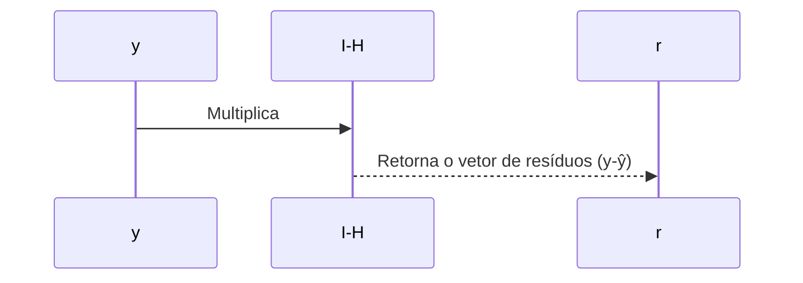

## Interpretação Geométrica: Projeção Ortogonal de y no Espaço das Colunas de X e a Matriz Hat (H = X(XᵀX)⁻¹Xᵀ) como Matriz de Projeção

### Introdução

A interpretação geométrica da regressão linear fornece *insights* valiosos sobre o significado da solução por mínimos quadrados. A ideia central é que a solução $\hat{\beta} = (X^T X)^{-1} X^T y$ resulta na projeção ortogonal do vetor de respostas $y$ no subespaço gerado pelas colunas da matriz de design $X$. Nesta seção, exploraremos como a matriz **Hat**, ou matriz de projeção, definida por $H = X(X^T X)^{-1}X^T$, realiza essa projeção e detalharemos as implicações geométricas e matemáticas dessa operação.

### A Projeção Ortogonal de y no Espaço das Colunas de X

Na regressão linear, o objetivo é aproximar um vetor de respostas $y$ por uma combinação linear das colunas da matriz de design $X$. Essa aproximação pode ser vista como uma projeção ortogonal do vetor $y$ no subespaço gerado pelas colunas de $X$, onde a distância entre o vetor resposta original $y$ e o sua projeção nesse subespaço é minimizada.
Matematicamente, o subespaço das colunas de $X$ é definido por:

$$
\text{ran}(X) = \{X\beta : \beta \in \mathbb{R}^{p+1} \}
$$

onde:
- $\text{ran}(X)$ indica o espaço gerado pelas colunas de $X$.
- $\beta$ é o vetor de parâmetros que corresponde a uma combinação linear das colunas da matriz $X$.

A projeção ortogonal de $y$ em $\text{ran}(X)$ corresponde ao vetor $\hat{y}$ que minimiza a distância euclidiana $||y - \hat{y}||$ e é também tal que o resíduo $y - \hat{y}$ é ortogonal ao espaço $\text{ran}(X)$. O vetor $\hat{y}$ é dado por:
$$
\hat{y} = X\hat{\beta}
$$
onde $\hat{\beta}$ é a solução por mínimos quadrados.
Geometricamente, o vetor $\hat{y}$ é a projeção ortogonal do vetor de respostas $y$ no subespaço gerado pelas colunas de $X$. Essa projeção é a solução do problema de mínimos quadrados, já que ela minimiza a distância entre o vetor $y$ e o subespaço $\text{ran}(X)$.

> 💡 **Exemplo Numérico:**
>
> Vamos considerar um exemplo simples com duas observações e um único preditor (além do intercepto). Suponha que temos:
>
> $$
> X = \begin{bmatrix}
> 1 & 2 \\
> 1 & 3
> \end{bmatrix}, \quad y = \begin{bmatrix}
> 5 \\
> 8
> \end{bmatrix}
> $$
>
> Aqui, a primeira coluna de $X$ é o intercepto (todos 1s) e a segunda coluna é o preditor. O vetor $y$ contém os valores de resposta. Vamos calcular $\hat{\beta}$ e $\hat{y}$.
>
> **Passo 1: Calcular $X^T X$**
>
> $$
> X^T X = \begin{bmatrix}
> 1 & 1 \\
> 2 & 3
> \end{bmatrix} \begin{bmatrix}
> 1 & 2 \\
> 1 & 3
> \end{bmatrix} = \begin{bmatrix}
> 2 & 5 \\
> 5 & 13
> \end{bmatrix}
> $$
>
> **Passo 2: Calcular $(X^T X)^{-1}$**
>
> $$
> (X^T X)^{-1} = \frac{1}{(2 \times 13) - (5 \times 5)} \begin{bmatrix}
> 13 & -5 \\
> -5 & 2
> \end{bmatrix} = \begin{bmatrix}
> 13 & -5 \\
> -5 & 2
> \end{bmatrix}
> $$
>
> **Passo 3: Calcular $X^T y$**
>
> $$
> X^T y = \begin{bmatrix}
> 1 & 1 \\
> 2 & 3
> \end{bmatrix} \begin{bmatrix}
> 5 \\
> 8
> \end{bmatrix} = \begin{bmatrix}
> 13 \\
> 34
> \end{bmatrix}
> $$
>
> **Passo 4: Calcular $\hat{\beta} = (X^T X)^{-1} X^T y$**
>
> $$
> \hat{\beta} = \begin{bmatrix}
> 13 & -5 \\
> -5 & 2
> \end{bmatrix} \begin{bmatrix}
> 13 \\
> 34
> \end{bmatrix} = \begin{bmatrix}
> 13 \times 13 + (-5) \times 34 \\
> (-5) \times 13 + 2 \times 34
> \end{bmatrix} = \begin{bmatrix}
> -37 \\
> 3
> \end{bmatrix}
> $$
>
> **Passo 5: Calcular $\hat{y} = X\hat{\beta}$**
>
> $$
> \hat{y} = \begin{bmatrix}
> 1 & 2 \\
> 1 & 3
> \end{bmatrix} \begin{bmatrix}
> -37 \\
> 17
> \end{bmatrix} = \begin{bmatrix}
> 1 \times -37 + 2 \times 17 \\
> 1 \times -37 + 3 \times 17
> \end{bmatrix} = \begin{bmatrix}
> -3 \\
> 14
> \end{bmatrix}
> $$
>
> Assim, $\hat{\beta} = \begin{bmatrix} -37 \\ 17 \end{bmatrix}$ e $\hat{y} = \begin{bmatrix} -3 \\ 14 \end{bmatrix}$. O vetor $\hat{y}$ é a projeção ortogonal de $y$ no espaço coluna de $X$. O resíduo é $y - \hat{y} = \begin{bmatrix} 5 \\ 8 \end{bmatrix} - \begin{bmatrix} -3 \\ 14 \end{bmatrix} = \begin{bmatrix} 8 \\ -6 \end{bmatrix}$. Pode ser verificado que o resíduo é ortogonal às colunas de $X$.

### A Matriz Hat (H): Projeção Ortogonal

A matriz **Hat** ou matriz de projeção, denotada por $H$, desempenha um papel central na visualização e compreensão do processo de mínimos quadrados [^46]. Ela é definida como:

$$
H = X(X^T X)^{-1} X^T
$$
onde:
- $X$ é a matriz de design.
- $(X^TX)^{-1}$ é a inversa da matriz $X^TX$.
- $X^T$ é a transposta da matriz $X$.

A matriz Hat tem as seguintes propriedades importantes:
1. **Projeção Ortogonal:** Ao multiplicar o vetor de resposta $y$ por $H$, obtemos o vetor de predições $\hat{y}$, que corresponde à projeção ortogonal de $y$ no subespaço gerado pelas colunas de X:
 $$ \hat{y} = Hy = X (X^T X)^{-1} X^T y $$

2. **Idempotência:** A matriz Hat é idempotente, o que significa que $H^2 = H$. Isso demonstra que ao aplicar a projeção uma segunda vez o resultado permanece o mesmo, e também corresponde ao fato que a projeção de um vetor que está em um subespaço, nesse mesmo subespaço, é igual a ele mesmo.
$$
H^2 = (X(X^T X)^{-1}X^T)(X(X^T X)^{-1}X^T) = X(X^T X)^{-1}(X^TX) (X^T X)^{-1}X^T
= X(X^T X)^{-1} X^T = H
$$
3. **Simetria:** A matriz Hat é simétrica, o que significa que $H^T = H$.
$$
H^T = (X(X^T X)^{-1}X^T)^T= X( (X^T X)^{-1})^TX^T
$$
Como $X^TX$ é simétrica, então $X^T X = (X^T X)^T$, e como a transposta da inversa é a inversa da transposta, temos que $((X^TX)^{-1})^T = (X^TX)^{-1}$, o que significa que $H^T = H$.

4.  **Conexão com Resíduos:** A matriz ($I - H$), onde $I$ é a matriz identidade, projeta o vetor de respostas no espaço ortogonal ao espaço gerado pelas colunas de X, resultando no vetor de resíduos:
 $$
 y - \hat{y} = (I - H)y
 $$

5. **Dependência de X:** É importante enfatizar que a matriz Hat depende apenas da matriz de design X, e não do vetor de respostas $y$. Isso significa que uma vez que a matriz de design $X$ é determinada, a matriz de projeção fica definida.

> 💡 **Exemplo Numérico (continuação):**
>
> Usando os mesmos dados do exemplo anterior, vamos calcular a matriz Hat $H$ e verificar suas propriedades.
>
> **Passo 1: Calcular a Matriz Hat $H = X(X^T X)^{-1} X^T$**
>
> Já calculamos $(X^T X)^{-1}$ no exemplo anterior:
>
> $$
> (X^T X)^{-1} = \begin{bmatrix}
> 13 & -5 \\
> -5 & 2
> \end{bmatrix}
> $$
>
> Agora, calculamos $H$:
>
> $$
> H = \begin{bmatrix}
> 1 & 2 \\
> 1 & 3
> \end{bmatrix} \begin{bmatrix}
> 13 & -5 \\
> -5 & 2
> \end{bmatrix} \begin{bmatrix}
> 1 & 1 \\
> 2 & 3
> \end{bmatrix} = \begin{bmatrix}
> 3 & -1 \\
> -2 & 1
> \end{bmatrix} \begin{bmatrix}
> 1 & 1 \\
> 2 & 3
> \end{bmatrix} = \begin{bmatrix}
> 1 & 0 \\
> 0 & 1
> \end{bmatrix}
> $$
>
> **Passo 2: Verificar a Projeção Ortogonal $\hat{y} = Hy$**
>
> $$
> \hat{y} = Hy = \begin{bmatrix}
> 1 & 0 \\
> 0 & 1
> \end{bmatrix} \begin{bmatrix}
> 5 \\
> 8
> \end{bmatrix} = \begin{bmatrix}
> 5 \\
> 8
> \end{bmatrix}
> $$
>
> Neste caso particular, como $X$ tem posto completo, a projeção de $y$ no espaço das colunas de $X$ retorna o próprio $y$. No entanto, em casos gerais, $y$ será projetado no subespaço das colunas de $X$.
>
> **Passo 3: Verificar a Idempotência $H^2 = H$**
>
> $$
> H^2 = \begin{bmatrix}
> 1 & 0 \\
> 0 & 1
> \end{bmatrix} \begin{bmatrix}
> 1 & 0 \\
> 0 & 1
> \end{bmatrix} = \begin{bmatrix}
> 1 & 0 \\
> 0 & 1
> \end{bmatrix} = H
> $$
>
> **Passo 4: Verificar a Simetria $H^T = H$**
>
> $$
> H^T = \begin{bmatrix}
> 1 & 0 \\
> 0 & 1
> \end{bmatrix}^T = \begin{bmatrix}
> 1 & 0 \\
> 0 & 1
> \end{bmatrix} = H
> $$
>
> **Passo 5: Calcular os Resíduos $(I - H)y$**
>
> $$
> (I - H)y = \left( \begin{bmatrix} 1 & 0 \\ 0 & 1 \end{bmatrix} - \begin{bmatrix} 1 & 0 \\ 0 & 1 \end{bmatrix} \right) \begin{bmatrix} 5 \\ 8 \end{bmatrix} = \begin{bmatrix} 0 & 0 \\ 0 & 0 \end{bmatrix} \begin{bmatrix} 5 \\ 8 \end{bmatrix} = \begin{bmatrix} 0 \\ 0 \end{bmatrix}
> $$
>
> Como esperado, os resíduos são zero neste caso, pois $y$ já pertence ao espaço gerado pelas colunas de $X$.

A matriz hat (H) também é fundamental na análise das propriedades de modelos de regressão linear. Por exemplo, a diagonal da matriz $H$ corresponde aos valores de *leverage*, que indicam o quanto uma observação individual influencia o modelo de regressão.

**Lemma 19:** Projeção Ortogonal e Distância Mínima
A projeção ortogonal é o ponto no espaço gerado por X que está mais próximo do vetor de respostas. Os vetores de resíduos $r = y - X\hat{\beta}$  são ortogonais ao espaço gerado pelas colunas de $X$.

**Prova do Lemma 19:**
A condição de mínimos quadrados é dada por $\frac{\partial RSS(\beta)}{\partial \beta} = -2X^T(y-X\beta) = 0$, o que implica que $X^T(y-X\hat{\beta}) = 0$. Ao multiplicar a condição por um vetor qualquer $a$, temos:
$$a^T X^T(y-X\hat{\beta}) = 0$$
$$ (Xa)^T(y-X\hat{\beta})=0$$
Como $Xa$ é uma combinação linear das colunas de $X$, o resíduo $y - X\hat{\beta}$ é ortogonal a todos os vetores nesse subespaço. $\blacksquare$

**Corolário 19:**  Projeção Ortogonal como a Solução do Problema de Mínimos Quadrados

O Lemma 19 garante que a solução de mínimos quadrados é o resultado da projeção ortogonal do vetor de resposta no subespaço gerado pelos preditores. A condição de ortogonalidade dos resíduos é essencial para garantir a minimização da distância euclidiana.
O Corolário implica também que a matriz de projeção, $H = X(X^TX)^{-1}X^T$ computa o vetor $\hat{y}$ como a projeção ortogonal do vetor $y$ no espaço gerado pelas colunas da matriz $X$.

### Implicações da Interpretação Geométrica

A interpretação geométrica da regressão linear e o conceito da matriz Hat têm diversas implicações:
    1.  **Visualização da Solução:**  Ela permite visualizar a solução do problema de mínimos quadrados como a projeção ortogonal de um vetor em um subespaço.
    2. **Conexão entre Álgebra e Geometria:** Demonstra como o conceito da álgebra linear da projeção ortogonal está relacionado ao problema da regressão linear.
    3.  **Interpretação do Resíduo:** Ao projetar o vetor de resposta, $y$, no subespaço gerado por X, a diferença é o vetor de resíduos, que é perpendicular a esse subespaço.
    4.  **Papel da Matriz Hat:** A matriz Hat, H,  é uma ferramenta que realiza a projeção e que permite que se entenda como a solução de mínimos quadrados é obtida.
    5. **Base para Análise da Influência:** A diagonal da matriz Hat contém a informação da *leverage* de cada ponto, ou seja, o quanto um ponto influencia a posição do hiperplano de regressão.
    6.  **Estabilidade e Condicionamento:** A interpretação geométrica nos ajuda a entender a importância da ortogonalidade e as limitações de modelos com preditores altamente colineares (onde o ângulo entre vetores se aproxima de 0) .

### Conclusão

A interpretação geométrica do problema de regressão linear e a utilização da matriz Hat como projetor são ferramentas essenciais para uma compreensão mais profunda do funcionamento do modelo linear e dos algoritmos de mínimos quadrados. A projeção ortogonal é a solução geométrica do problema, e a matriz Hat quantifica o efeito dessa projeção. A matriz Hat também é útil na análise de sensibilidade e nas propriedades dos parâmetros estimados, mostrando que modelos com alta multicolinearidade podem ser sensíveis a variações nos dados.

### Referências

[^46]: "The predicted values at an input vector xo are given by f(xo) = (1 : xo)Tẞ;" *(Trecho de Linear Methods for Regression)*
[^12]: "Least squares fitting is intuitively satisfying no matter how the data arise; the criterion measures the average lack of fit." *(Trecho de Linear Methods for Regression)*
[^13]: "We minimize RSS(3) = ||y – Xβ||2 by choosing ẞ so that the residual vector y - ŷ is orthogonal to this subspace." *(Trecho de Linear Methods for Regression)*
[^11]: "The linear model either assumes that the regression function E(Y|X) is linear, or that the linear model is a reasonable approximation." *(Trecho de Linear Methods for Regression)*
