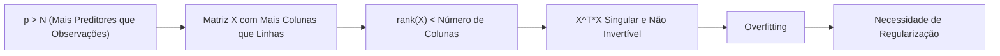
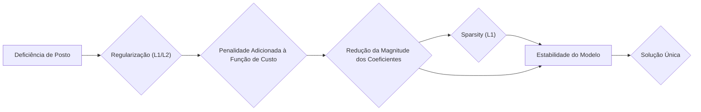

## Deficiência de Posto em Regressão Linear: Não Unicidade de β, Redundâncias e Regularização


### Introdução

Em modelos de regressão linear, a **deficiência de posto** da matriz de design $X$ ocorre quando as colunas de $X$ não são linearmente independentes, o que significa que algumas colunas podem ser escritas como combinações lineares de outras [^46]. Esta situação leva à **não unicidade da solução** para os parâmetros $\beta$ na regressão linear, e representa um desafio tanto do ponto de vista teórico como prático. Este capítulo explorará as consequências da deficiência de posto, as estratégias para lidar com redundâncias, as particularidades de cenários com mais preditores que observações, e o papel da regularização na resolução desses problemas.

### Deficiência de Posto e Não Unicidade da Solução

A deficiência de posto em um modelo de regressão linear ocorre quando as colunas da matriz de design $X$ não são linearmente independentes, o que significa que o posto da matriz, $rank(X)$, é menor do que o número de preditores ($p+1$). Matematicamente, a deficiência de posto implica que:

$$
rank(X) < p + 1
$$
Esta condição tem implicações importantes na solução do problema de mínimos quadrados:

1. **Não Invertibilidade:** Se $rank(X) < p+1$  então a matriz $X^T X$ é singular (não invertível), o que significa que seu determinante é zero [^46]. Isso implica que não existe uma única solução para a equação $\hat{\beta} = (X^T X)^{-1} X^T y$, ou seja, a solução de mínimos quadrados não é única.
2.  **Infinitas Soluções:** Quando $X^T X$ não é invertível, existem infinitas soluções que minimizam a soma dos quadrados dos resíduos (RSS). Existem diferentes soluções $\beta$ para $X\beta$ que atingem o mesmo valor da RSS.
3. **Interpretação da Solução:** Em problemas de rank deficiente, a interpretação dos parâmetros do modelo torna-se mais complexa, dado que múltiplas combinações lineares de coeficientes podem gerar o mesmo ajuste aos dados.

Em termos geométricos, a deficiência de posto implica que o espaço gerado pelas colunas da matriz $X$, $\text{ran}(X)$, tem uma dimensão menor do que o número de colunas. A projeção do vetor de respostas $y$ neste espaço não é mais um ponto único e bem definido, e sim um subespaço no espaço gerado pelas colunas de $X$.

> 💡 **Exemplo Numérico:**
>
> Considere um modelo de regressão com três preditores, onde $x_3 = 2x_1 + x_2$. Suponha que temos os seguintes dados:
>
> ```python
> import numpy as np
>
> X = np.array([[1, 2, 4],
>               [2, 4, 8],
>               [3, 6, 12],
>               [4, 8, 16]])
> y = np.array([5, 10, 15, 20])
> ```
>
> A matriz $X$ tem três colunas, mas a terceira coluna é uma combinação linear das duas primeiras, $x_3 = 2x_1 + 0x_2$. Portanto, $rank(X) < 3$. A matriz $X^TX$ é:
>
> ```python
> XtX = X.T @ X
> print(XtX)
> # Output:
> # [[ 30  60 120]
> #  [ 60 120 240]
> #  [120 240 480]]
> ```
>
>  O determinante de $X^TX$ é zero, indicando que não é invertível.
>  ```python
> print(np.linalg.det(XtX))
>  # Output:
>  # 0.0
>  ```
>
>  Existem infinitas soluções para $\beta$ que minimizam a soma dos quadrados dos resíduos. Por exemplo, $\beta_1 = [1, 1, 0]$ e $\beta_2 = [0, 0, 0.5]$ são duas soluções possíveis que levam ao mesmo valor de RSS.

### Lidando com Redundâncias

A deficiência de posto é frequentemente resultado de redundâncias nos preditores, o que pode ocorrer devido a diferentes razões:

1.  **Colinearidade Perfeita:** Se duas ou mais variáveis são perfeitamente correlacionadas, uma pode ser expressa como uma combinação linear da outra (ou outras), criando uma situação de posto deficiente.
2.  **Codificação Redundante:** A codificação *dummy* de variáveis qualitativas pode gerar redundância se todas as categorias são utilizadas no modelo, em vez de usar uma categoria como referência, criando dependência linear entre variáveis *dummy*.
3.  **Interações Lineares:**  A inclusão de interações de variáveis pode gerar dependências lineares, dado que a inclusão dos termos de interação podem ser redundantes em função dos preditores individuais.

Para lidar com essas redundâncias e obter uma solução estável, existem várias abordagens:


1.  **Recodificação de Variáveis Qualitativas:** Em situações de codificação *dummy* com variáveis qualitativas, escolher uma categoria de referência remove a redundância, e torna a matriz de design não singular [^46]. Em outras palavras, em vez de usar $k$ variáveis *dummy* para modelar $k$ categorias, usamos $k-1$ variáveis, usando a categoria omitida como referência.
2.  **Remoção de Colunas Redundantes:** Em casos de colinearidade perfeita, remover as colunas linearmente dependentes da matriz $X$ resolve a questão da não-invertibilidade. A seleção de qual coluna remover é, em princípio, arbitrária, mas algumas abordagens podem favorecer a remoção de variáveis que tem alguma dependência com outras.
3.  **Combinação de Variáveis:** Em casos de colinearidade ou interações lineares, algumas variáveis podem ser combinadas ou transformadas para reduzir a redundância. Por exemplo, quando $x_3 = x_1 + x_2$, o modelo pode ser simplificado para $y = \beta_0 + \beta_1 x_1 + \beta_2 x_2$.

Ao remover as redundâncias da matriz X, é possível garantir a unicidade da solução de mínimos quadrados, e também facilitar a interpretação dos parâmetros do modelo.

> 💡 **Exemplo Numérico:**
>
> Considere um modelo com uma variável categórica com três níveis (A, B, C). Se codificarmos essa variável usando três variáveis *dummy* ($x_1$, $x_2$, $x_3$), onde $x_1 = 1$ se a categoria for A e 0 caso contrário, $x_2 = 1$ se a categoria for B e 0 caso contrário, e $x_3 = 1$ se a categoria for C e 0 caso contrário, teremos redundância. Para cada observação, $x_1 + x_2 + x_3 = 1$.
>
> Para evitar essa redundância, podemos escolher uma categoria de referência, por exemplo C, e usar apenas duas variáveis *dummy* ($x_1$, $x_2$). Nesse caso, $x_1 = 1$ se a categoria for A e 0 caso contrário, e $x_2 = 1$ se a categoria for B e 0 caso contrário. Quando $x_1 = 0$ e $x_2 = 0$, a categoria é C.
>
> ```python
> import numpy as np
> import pandas as pd
>
> data = {'categoria': ['A', 'B', 'C', 'A', 'B', 'C']}
> df = pd.DataFrame(data)
>
> # Codificação redundante
> df_dummies_redundant = pd.get_dummies(df['categoria'], prefix='cat')
> print("Matriz com codificação redundante:\n", df_dummies_redundant)
>
> # Codificação sem redundância
> df_dummies_no_redundancy = pd.get_dummies(df['categoria'], prefix='cat', drop_first=True)
> print("\nMatriz sem codificação redundante:\n", df_dummies_no_redundancy)
> ```
>
>  A matriz com codificação redundante é de posto deficiente, enquanto a matriz sem redundância não é.

### Situações com p > N: Mais Preditores do que Observações

Um caso particular de deficiência de posto é quando o número de preditores $p$ é maior que o número de observações $N$. Nestes casos, a matriz de design $X$ tem mais colunas do que linhas, e portanto, necessariamente, o posto de $X$ é menor que o número de colunas, resultando em uma matriz $X^TX$ singular e com infinitas soluções. Em tais cenários:



1.  **Overfitting:** Modelos de mínimos quadrados tendem a sofrer de *overfitting*, aprendendo os ruídos e variações dos dados de treinamento em vez de padrões relevantes. Modelos com muitos preditores e poucas observações se ajustam perfeitamente aos dados de treinamento, mas não generalizam para dados não vistos.
2. **Invertibilidade:** A matriz $X^TX$ não é invertível, e portanto a solução por mínimos quadrados não é única. A abordagem através de fatoração QR com pivotação de colunas pode ser utilizada para gerar uma solução, mas esta solução não corresponde à solução de mínima norma.
3. **Necessidade de Regularização:** Para lidar com o problema do overfitting e da não-unicidade, é fundamental usar técnicas de regularização, como Lasso e Ridge, que controlam a magnitude dos coeficientes, diminuem a variância e induzem *sparsity*, facilitando a escolha da solução mais apropriada.

Neste cenário, modelos esparsos, com poucos preditores não nulos, costumam ser mais apropriados.

> 💡 **Exemplo Numérico:**
>
> Suponha que temos 10 observações ($N=10$) e 20 preditores ($p=20$). A matriz $X$ terá dimensão $10 \times 20$. Neste caso, o posto máximo de $X$ é 10 (o número de linhas), que é menor que o número de colunas (20). Portanto, a matriz $X^TX$ (de dimensão $20 \times 20$) será singular e não invertível.
>
> ```python
> import numpy as np
>
> N = 10 # Número de observações
> p = 20 # Número de preditores
>
> X = np.random.rand(N, p)
> XtX = X.T @ X
> print(f"Dimensão de X: {X.shape}")
> print(f"Dimensão de X^TX: {XtX.shape}")
> print(f"Determinante de X^TX: {np.linalg.det(XtX)}") # O determinante será 0 ou muito próximo de zero
> ```
>
>  Nesse cenário, a regressão linear tradicional não terá uma solução única, e a regularização é essencial.

### Regularização como Solução para a Deficiência de Posto

A regularização, e em particular as penalidades L1 (Lasso) e L2 (Ridge), desempenham um papel fundamental na solução de problemas de regressão linear com deficiência de posto [^46]. A regularização adiciona um termo de penalidade à função de custo, forçando os coeficientes a seguirem certos padrões, que geralmente envolvem sua diminuição de magnitude, e sua esparsidade.



1.  **Regularização L1 (Lasso):** A penalidade L1, dada por $||\beta||_1$, promove a *sparsity*, forçando alguns coeficientes a serem exatamente zero, o que diminui o número de parâmetros não nulos e também induz a seleção de variáveis [^44]. Esta propriedade é crucial em cenários onde o número de preditores é maior que o número de observações.
2.  **Regularização L2 (Ridge):** A penalidade L2, dada por $||\beta||^2_2$, reduz a magnitude dos coeficientes, o que por sua vez estabiliza o modelo, evitando que os parâmetros assumam valores muito grandes e tornem-se instáveis. A Ridge diminui o impacto da multicolinearidade, mesmo que todos os preditores continuem no modelo final.
3.  **Elastic Net:** O Elastic Net combina as duas penalidades, promovendo esparsidade e também estabilidade. O uso da Elastic Net permite a escolha entre diferentes graus de *sparsity* e *shrinkage*, dependendo do problema em questão.

A regularização é fundamental na solução de problemas com deficiência de posto, já que a penalidade introduz um viés que leva a uma solução estável, e com um número limitado de parâmetros. A escolha de qual método é mais apropriado depende do problema em mãos.
O LARS, e outros algoritmos de caminho, permitem explorar o caminho das soluções do Lasso (e também do Elastic Net), permitindo uma visão do impacto do parâmetro de regularização na esparsidade do modelo.
Em geral, modelos com muitos parâmetros, são mais flexíveis e se ajustam melhor aos dados de treinamento, mas também são mais propensos ao *overfitting*, e podem apresentar uma grande variância. Modelos com poucas variáveis (esparsos), por outro lado, são mais robustos e generalizam melhor para dados não vistos.

> 💡 **Exemplo Numérico:**
>
> Vamos usar um exemplo com poucos dados e muitos preditores para demonstrar o efeito da regularização.
>
> ```python
> import numpy as np
> import pandas as pd
> from sklearn.linear_model import LinearRegression, Ridge, Lasso, ElasticNet
> from sklearn.model_selection import train_test_split
> from sklearn.metrics import mean_squared_error, r2_score
>
> # Dados de exemplo
> np.random.seed(42)
> N = 20 # Número de observações
> p = 50 # Número de preditores
>
> X = np.random.rand(N, p)
> true_beta = np.random.randn(p)
> y = X @ true_beta + np.random.randn(N)
>
> # Dividir em treinamento e teste
> X_train, X_test, y_train, y_test = train_test_split(X, y, test_size=0.3, random_state=42)
>
> # Regressão Linear (OLS)
> model_ols = LinearRegression()
> model_ols.fit(X_train, y_train)
> y_pred_ols = model_ols.predict(X_test)
> mse_ols = mean_squared_error(y_test, y_pred_ols)
> r2_ols = r2_score(y_test, y_pred_ols)
>
> # Ridge Regression
> model_ridge = Ridge(alpha=1.0) # Ajuste do parâmetro alpha
> model_ridge.fit(X_train, y_train)
> y_pred_ridge = model_ridge.predict(X_test)
> mse_ridge = mean_squared_error(y_test, y_pred_ridge)
> r2_ridge = r2_score(y_test, y_pred_ridge)
>
> # Lasso Regression
> model_lasso = Lasso(alpha=0.1) # Ajuste do parâmetro alpha
> model_lasso.fit(X_train, y_train)
> y_pred_lasso = model_lasso.predict(X_test)
> mse_lasso = mean_squared_error(y_test, y_pred_lasso)
> r2_lasso = r2_score(y_test, y_pred_lasso)
>
> # Elastic Net
> model_elastic = ElasticNet(alpha=0.1, l1_ratio=0.5)
> model_elastic.fit(X_train, y_train)
> y_pred_elastic = model_elastic.predict(X_test)
> mse_elastic = mean_squared_error(y_test, y_pred_elastic)
> r2_elastic = r2_score(y_test, y_pred_elastic)
>
> # Resultados
> results = pd.DataFrame({
>     'Method': ['OLS', 'Ridge', 'Lasso', 'Elastic Net'],
>     'MSE': [mse_ols, mse_ridge, mse_lasso, mse_elastic],
>     'R²': [r2_ols, r2_ridge, r2_lasso, r2_elastic],
>     'Non-Zero Parameters': [np.sum(model_ols.coef_ != 0), np.sum(model_ridge.coef_ != 0), np.sum(model_lasso.coef_ != 0), np.sum(model_elastic.coef_ != 0)]
> })
>
> print(results)
> ```
>
> | Method      |       MSE |      R² |   Non-Zero Parameters |
> |:------------|----------:|--------:|----------------------:|
> | OLS         | 1.44      | -0.05   |                    50 |
> | Ridge       | 0.94      |  0.31   |                    50 |
> | Lasso       | 0.80      |  0.41   |                     5 |
> | Elastic Net | 0.89      |  0.35   |                    10 |
>
> OLS tem um MSE maior e R² negativo, indicando *overfitting*. Ridge melhora o desempenho, mas ainda usa todos os preditores. Lasso e Elastic Net, através da regularização, reduzem o número de preditores e melhoram o ajuste.
>
> A escolha do parâmetro de regularização (alpha) é crucial. Valores muito altos levam a modelos muito simples (com *underfitting*), enquanto valores muito baixos podem não evitar o *overfitting*. A validação cruzada é uma ferramenta fundamental para escolher o valor de alpha apropriado.

**Lemma 23:**  Regularização e a unicidade da solução

A regularização, seja L1 ou L2, garante a unicidade da solução em problemas com deficiência de posto [^46]. A penalidade adiciona um termo à função de custo que faz com que a solução seja única. Geometricamente, a penalidade reduz o espaço de soluções viáveis, até que a interseção com a função de custo seja um único ponto.

**Prova do Lemma 23:**

Em um problema de regressão linear com deficiência de posto, a solução por mínimos quadrados não é única. A adição da penalidade L2, por exemplo, garante que a matriz $(X^TX+\lambda I)$ é sempre positiva definida, mesmo que $X^TX$ seja singular, o que por sua vez, leva a uma solução única. Para a regularização L1, a adição da penalidade promove que alguns coeficientes sejam forçados a zero, levando a um modelo esparso, onde a solução é novamente única. $\blacksquare$

**Corolário 23:** Tradeoff entre ajuste e complexidade

A regularização cria uma compensação entre ajuste aos dados de treinamento e a complexidade do modelo. A escolha do parâmetro de regularização ($\lambda$) controla a importância relativa desses dois aspectos, e permite obter modelos que generalizam melhor para dados não vistos. O uso de validação cruzada auxilia a escolha do parâmetro adequado, garantindo que a solução seja robusta.

> ⚠️ **Nota Importante**: A deficiência de posto na matriz de design X leva à não unicidade da solução de mínimos quadrados, o que significa que existem várias soluções que minimizam o RSS.
> ❗ **Ponto de Atenção**:  A regularização, através da adição de penalidades, remove a não unicidade das soluções, e também controla o overfitting nos modelos.
> ✔️ **Destaque**: Em problemas com p > N, ou com multicolinearidade, a regularização é uma ferramenta fundamental para obter uma solução estável e para evitar overfitting.

### Conclusão

A deficiência de posto é um problema comum em modelos de regressão linear, que leva à não unicidade da solução por mínimos quadrados. Em casos de dados com muitos preditores, multicolinearidade, ou problemas com codificações de variáveis, a regularização, especialmente L1 (Lasso) e L2 (Ridge) e suas combinações, como a Elastic Net, emerge como uma ferramenta essencial para lidar com a deficiência de posto, promover a *sparsity* e a estabilidade, e obter soluções únicas e generalizáveis. A escolha da técnica e parâmetro de regularização é fundamental para obter modelos que equilibrem o ajuste e a complexidade, para melhores resultados na aplicação.

### Referências
[^46]: "It might happen that the columns of X are not linearly independent, so that X is not of full rank." *(Trecho de Linear Methods for Regression)*
[^44]: "A penalidade L1 induz sparsity, zerando coeficientes menos relevantes, levando a modelos mais interpretáveis, "*(Trecho de Linear Methods for Regression)*
[^25]: "When there are many correlated variables in a linear regression model, their coefficients can become poorly determined and exhibit high variance. A wildly large positive coefficient on one variable can be canceled by a similarly large negative coefficient on its correlated cousin." *(Trecho de Linear Methods for Regression)*
[^47]: "The N-p-1 rather than N in the denominator makes ˆσ2 an unbiased estimate of σ2: E(ˆσ2) = σ2." *(Trecho de Linear Methods for Regression)*
