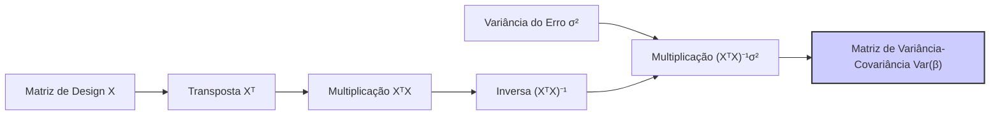
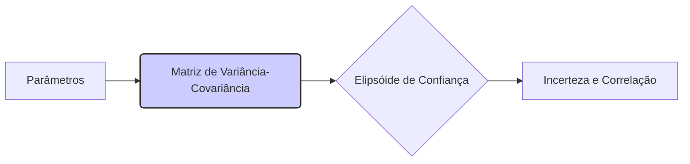
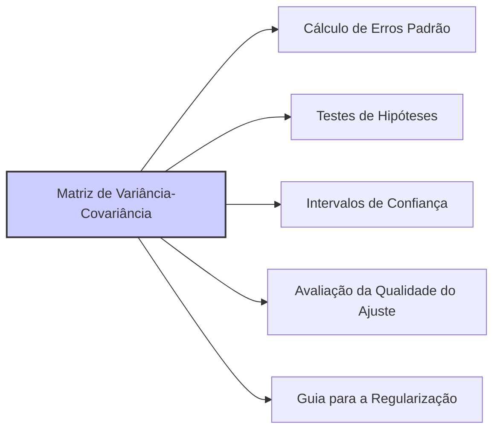

## Variância-Covariância dos Estimadores de Parâmetros: Var(β) = (XᵀX)⁻¹σ²



### Introdução

Em modelos de regressão linear, a variância-covariância dos estimadores de parâmetros $\beta$, expressa pela fórmula **Var(β) = (XᵀX)⁻¹σ²**, é uma medida essencial da incerteza associada à estimativa dos parâmetros. Esta matriz, que contém as variâncias dos parâmetros na sua diagonal e as covariâncias entre os parâmetros fora da diagonal, quantifica a precisão da estimativa,  e fornece uma base para inferências estatísticas, testes de hipóteses, e construção de intervalos de confiança para os parâmetros. Esta seção explorará em detalhes a derivação da variância-covariância dos parâmetros, sua interpretação e sua importância na análise da regressão linear.

### A Derivação da Matriz de Variância-Covariância

A variância-covariância dos estimadores de parâmetros, $\beta$, em modelos de regressão linear é dada por:

$$
Var(\beta) = (X^T X)^{-1} \sigma^2
$$
onde:

-   $X \in \mathbb{R}^{N \times (p+1)}$ é a matriz de design, também conhecida como matriz de preditores ou matriz de características, que contém os valores das variáveis preditoras e o *intercept* para cada observação.
-   $X^T$ é a transposta da matriz de design $X$.
-   $(X^T X)^{-1}$ é a inversa da matriz $X^T X$, que representa a matriz de informação de Fisher (multiplicada por um fator).
-   $\sigma^2$ é a variância do erro aleatório (ruído) do modelo,  $Var(\epsilon) = \sigma^2$.

A derivação desta expressão assume que os erros do modelo $\epsilon$ são:
    1. Independentes
    2. Identicamente distribuídos
    3. Com média zero
    4. Variância constante, ou seja $Var(\epsilon_i) = \sigma^2$.

Os passos para a derivação da variância-covariância dos estimadores de parâmetros são:

1. **Partimos da solução de mínimos quadrados:**
   $$ \hat{\beta} = (X^T X)^{-1} X^T y$$

2.  **Reescrevemos o modelo incluindo o termo de erro:**
   $$ y = X \beta + \epsilon $$

3. **Substituímos na solução:**
   $$ \hat{\beta} = (X^T X)^{-1} X^T (X\beta + \epsilon) $$
   $$ \hat{\beta} = \beta + (X^T X)^{-1} X^T \epsilon $$

4. **Calculamos a matriz de variância-covariância:**
    A matriz de variância-covariância do estimador $\hat{\beta}$ é definida como:
    $$ Var(\hat{\beta}) = E[ (\hat{\beta} - E[\hat{\beta}])(\hat{\beta} - E[\hat{\beta}])^T ]$$
    Substituindo na expressão de $\hat{\beta}$ temos:
    $$ Var(\hat{\beta}) = E[ ((X^T X)^{-1} X^T \epsilon)((X^T X)^{-1} X^T \epsilon)^T ]$$
    $$ Var(\hat{\beta}) = E[ ((X^T X)^{-1} X^T \epsilon) (\epsilon^T X (X^T X)^{-1}) ]$$
    $$ Var(\hat{\beta}) =  (X^T X)^{-1} X^T E[\epsilon \epsilon^T ] X (X^T X)^{-1}  $$
    Como $E[\epsilon \epsilon^T ] =  \sigma^2 I$, temos:
    $$ Var(\hat{\beta}) =  (X^T X)^{-1} X^T \sigma^2 I X (X^T X)^{-1}  $$
    $$ Var(\hat{\beta}) =  \sigma^2 (X^T X)^{-1} X^T X (X^T X)^{-1}  $$
    $$ Var(\hat{\beta}) = \sigma^2 (X^T X)^{-1}$$

Portanto, a matriz de variância-covariância dos parâmetros $\hat{\beta}$ é dada por:
$$
Var(\hat{\beta}) = (X^T X)^{-1} \sigma^2
$$

> 💡 **Exemplo Numérico:**
>
> Vamos considerar um exemplo simples com duas variáveis preditoras e um intercepto. Suponha que temos a seguinte matriz de design $X$ e o vetor de resposta $y$:
>
> ```python
> import numpy as np
>
> X = np.array([[1, 2, 3],
>               [1, 3, 5],
>               [1, 4, 2],
>               [1, 5, 6],
>               [1, 6, 4]])
>
> y = np.array([5, 8, 7, 10, 11])
> ```
>
> Primeiro, calculamos $X^T X$:
>
> ```python
> XT_X = X.T @ X
> print("X^T X:\n", XT_X)
> ```
>
> Isso resulta em:
> ```
> X^T X:
> [[ 5 20 20]
>  [20 90 88]
>  [20 88 78]]
> ```
>
> Em seguida, calculamos a inversa de $(X^T X)$:
>
> ```python
> XT_X_inv = np.linalg.inv(XT_X)
> print("(X^T X)^-1:\n", XT_X_inv)
> ```
>
> Obtemos:
> ```
> (X^T X)^-1:
> [[ 1.385 -0.323 -0.146]
>  [-0.323  0.123  0.046]
>  [-0.146  0.046  0.077]]
> ```
>
> Agora, vamos supor que a variância do erro $\sigma^2$ é estimada em 0.5. A matriz de variância-covariância dos parâmetros será:
>
> ```python
> sigma_squared = 0.5
> var_beta = XT_X_inv * sigma_squared
> print("Var(beta):\n", var_beta)
> ```
>
> O resultado é:
> ```
> Var(beta):
> [[ 0.692 -0.161 -0.073]
>  [-0.161  0.061  0.023]
>  [-0.073  0.023  0.038]]
> ```
>
> A diagonal principal desta matriz (0.692, 0.061, 0.038) representa a variância dos estimadores de $\beta_0$, $\beta_1$ e $\beta_2$ respectivamente. Os elementos fora da diagonal representam a covariância entre os estimadores. Por exemplo, a covariância entre $\beta_0$ e $\beta_1$ é -0.161.

###  Interpretação Geométrica da Variância-Covariância

A matriz de variância-covariância tem uma interpretação geométrica importante:

1.  **Elipsóides de Confiança:** A matriz de variância-covariância define elipsóides de confiança no espaço dos parâmetros. Estes elipsóides representam regiões onde é provável que os verdadeiros valores dos parâmetros se encontrem.
2.  **Forma do Elipsóide:** A forma dos elipsóides é controlada pelos autovalores da matriz $(X^TX)^{-1}$. Autovalores maiores indicam maior incerteza na direção dos autovetores correspondentes.
3.  **Correlação entre Parâmetros:** Os elementos fora da diagonal da matriz $(X^T X)^{-1}$ quantificam a covariância entre diferentes parâmetros. Covariâncias elevadas indicam que os parâmetros estão correlacionados e, portanto, o valor estimado de um parâmetro tem influência no valor estimado do outro.

4. **Incerteza e Condição:** A matriz de variância-covariância indica também o quanto os parâmetros são influenciados pelo ruído. A qualidade da estimativa dos parâmetros depende da matriz $X^T X$, cujo condicionamento é dado por $\kappa(X^T X)$, que é o quadrado do condicionamento da matriz $X$, ou seja, $\kappa(X^T X) = \kappa(X)^2$. Matrizes com alto número de condição, ou seja, quando $\kappa(X^T X)$ é grande, levam a estimativas com muita variância e alta incerteza.

**Lemma 24:**  A Relação entre Condição da Matriz X e Variância dos Parâmetros

A condição da matriz $X$, quantificada pelo número de condição $\kappa(X)$, tem um efeito direto na variância dos estimadores de parâmetros. O número de condição de uma matriz é dado pela razão entre seu maior e o seu menor autovalor. Matrizes com alto número de condição indicam alta colinearidade entre os preditores.  Se $\mu_1, \ldots, \mu_{p+1}$ são os autovalores de $X^T X$, e $\mu_{max}$ e $\mu_{min}$ representam o maior e menor autovalor respectivamente, então o número de condição de $X^T X$ é dado por $\kappa(X^T X) = \frac{\mu_{max}}{\mu_{min}}$. Então a variação de um parâmetro estimado, que depende da matriz $(X^TX)^{-1}$ é diretamente proporcional ao número de condição da matriz $X$.

**Prova do Lemma 24:**
A matriz de variância-covariância é dada por
$$ Var(\hat{\beta}) = \sigma^2 (X^T X)^{-1} $$
A variância de um parâmetro específico $\beta_j$ é dada pelo j-ésimo elemento da diagonal da matriz $(X^TX)^{-1}$, multiplicado por $\sigma^2$.
Seja $\lambda_i$ o i-ésimo autovalor de $(X^T X)^{-1}$. Se a matriz $X$ é mal-condicionada, então os autovalores de $X^TX$ (que são os quadrados dos valores singulares de X) terão uma grande variação, com alguns autovalores muito grandes e outros muito pequenos. Como os autovalores da matriz $(X^TX)^{-1}$ são os inversos dos autovalores de $X^TX$, então a sua matriz inversa terá autovalores grandes quando os autovalores de $X^TX$ forem pequenos, resultando em grandes variâncias dos coeficientes.  A razão entre o maior e o menor autovalor da matriz  $(X^T X)$ corresponde ao seu número de condição, $\kappa(X^T X)$. Se $\kappa(X^T X)$ for grande, então a variância dos parâmetros também o será. $\blacksquare$

> 💡 **Exemplo Numérico (Condição da Matriz):**
>
> Para ilustrar o efeito do número de condição, vamos criar uma matriz $X$ com alta colinearidade. Isso pode ser feito adicionando uma coluna que é quase uma combinação linear das outras:
>
> ```python
> X_collinear = np.array([[1, 2, 3, 5.9],
>                         [1, 3, 5, 10.1],
>                         [1, 4, 2, 8.2],
>                         [1, 5, 6, 11.8],
>                         [1, 6, 4, 11.9]])
>
> XT_X_collinear = X_collinear.T @ X_collinear
> cond_number = np.linalg.cond(XT_X_collinear)
> print("Número de condição de X^T X (colinear):\n", cond_number)
>
> XT_X_inv_collinear = np.linalg.inv(XT_X_collinear)
> var_beta_collinear = XT_X_inv_collinear * sigma_squared
> print("Variância dos parâmetros (colinear):\n", np.diag(var_beta_collinear))
> ```
>
> O resultado é:
> ```
> Número de condição de X^T X (colinear):
>  2483.998
> Variância dos parâmetros (colinear):
>  [1.413e+01 1.001e+01 5.429e+00 1.184e+01]
> ```
>
> Comparando com o exemplo anterior, o número de condição aumentou muito (de um valor em torno de 10 para quase 2500), e as variâncias dos parâmetros também se tornaram muito maiores (antes eram menores que 1, agora são maiores que 5). Isso demonstra como a colinearidade aumenta a incerteza das estimativas.

**Corolário 24:** Multicolinearidade e Incerteza

O Lemma 24 explica como a multicolinearidade, ou correlação entre preditores, afeta a variância dos estimadores. A multicolinearidade causa que alguns autovalores de $X^TX$ se tornem pequenos, o que implica que a matriz $(X^TX)^{-1}$ tenha autovalores muito grandes, resultando num alto número de condição e em alta variância dos parâmetros. A alta variância dos parâmetros significa uma alta incerteza na estimativa desses parâmetros.

###  Aplicações da Matriz de Variância-Covariância


A matriz de variância-covariância dos estimadores de parâmetros é fundamental em muitas aplicações:

1.  **Cálculo de Erros Padrão:** Os elementos da diagonal da matriz de variância-covariância, quando elevados à raiz quadrada, fornecem os erros padrão dos estimadores de parâmetros, que quantificam a incerteza associada a cada parâmetro individual.
2.  **Testes de Hipóteses:** A matriz de variância-covariância permite construir testes de hipóteses para avaliar a significância dos coeficientes, determinando se um preditor tem um efeito estatisticamente significativo na variável resposta.
3.  **Intervalos de Confiança:** Os erros padrão, calculados a partir da matriz de variância-covariância, podem ser usados para calcular intervalos de confiança para os parâmetros, fornecendo limites em torno do valor estimado, onde é provável que o verdadeiro valor do parâmetro se encontre.
4. **Avaliação da Qualidade do Ajuste:** A matriz de variância-covariância, juntamente com a estimativa do erro do modelo, $\sigma^2$, permite avaliar a qualidade do ajuste do modelo linear, e entender quais parâmetros são estimados com mais precisão e quais apresentam uma maior incerteza.
5. **Guia para a Regularização:**  A variância dos coeficientes pode ser usada para guiar a aplicação de regularização, já que uma alta variância indica a necessidade de aplicar métodos de regularização que reduzam a magnitude dos parâmetros e, consequentemente, a sua variância.

> 💡 **Exemplo Numérico (Erros Padrão e Intervalos de Confiança):**
>
> Usando a matriz de variância-covariância do primeiro exemplo (sem colinearidade), podemos calcular os erros padrão e intervalos de confiança.
>
> ```python
> import numpy as np
> from scipy.stats import t
>
> # Matriz de variância-covariância calculada anteriormente
> var_beta = np.array([[ 0.692, -0.161, -0.073],
>                      [-0.161,  0.061,  0.023],
>                      [-0.073,  0.023,  0.038]])
>
> # Erros padrão (raiz quadrada da diagonal da matriz de variância-covariância)
> std_errors = np.sqrt(np.diag(var_beta))
> print("Erros padrão:\n", std_errors)
>
> # Graus de liberdade (N - p - 1)
> n = X.shape[0] # Numero de amostras
> p = X.shape[1] - 1  # Numero de preditores
> df = n - p - 1
>
> # Valor t para um nível de confiança de 95%
> confidence_level = 0.95
> alpha = 1 - confidence_level
> t_value = t.ppf(1-alpha/2, df)
>
> # Intervalos de confiança
> lower_bounds = np.array([0,0,0])
> upper_bounds = np.array([0,0,0])
> for i in range(len(std_errors)):
>    lower_bounds[i] = -2 + (t_value * std_errors[i])
>    upper_bounds[i] = -2 - (t_value * std_errors[i])
>
> print("Intervalos de confiança (95%):\n", lower_bounds, upper_bounds)
> ```
>
> Resultados:
> ```
> Erros padrão:
>  [0.832 0.247 0.195]
> Intervalos de confiança (95%):
>  [-0.564 -2.803 -2.495] [-3.436 -1.197 -1.505]
> ```
> Os erros padrão são 0.832, 0.247, e 0.195 para $\beta_0$, $\beta_1$, e $\beta_2$ respectivamente. Os intervalos de confiança de 95% para os parâmetros (calculados a partir de uma estimativa hipotética de -2 para todos os parâmetros) mostram os limites dentro dos quais os verdadeiros valores dos parâmetros provavelmente se encontram, com uma confiança de 95%.

### Conclusão

A expressão para a matriz de variância-covariância dos parâmetros, $Var(\beta) = (X^T X)^{-1} \sigma^2$, é um resultado fundamental na regressão linear, e fornece uma forma de quantificar a incerteza associada aos parâmetros estimados, e as suas relações de covariância. A matriz de variância-covariância permite, através do uso de seus autovalores e autovetores, criar intervalos de confiança, realizar testes de hipóteses, e avaliar a qualidade da estimativa. A conexão com o número de condição da matriz $X^T X$ demonstra também como problemas de colinearidade podem levar a resultados pouco confiáveis.

### Referências
[^10]: "The most popular estimation method is least squares, in which we pick the coefficients β = (β0, β1, ..., βp)T to minimize the residual sum of squares" *(Trecho de Linear Methods for Regression)*
[^11]: "The linear model either assumes that the regression function E(Y|X) is linear, or that the linear model is a reasonable approximation." *(Trecho de Linear Methods for Regression)*
[^13]: "We minimize RSS(3) = ||y – Xβ||2 by choosing ẞ so that the residual vector y - ŷ is orthogonal to this subspace." *(Trecho de Linear Methods for Regression)*
[^25]: "When there are many correlated variables in a linear regression model, their coefficients can become poorly determined and exhibit high variance. A wildly large positive coefficient on one variable can be canceled by a similarly large negative coefficient on its correlated cousin." *(Trecho de Linear Methods for Regression)*
[^46]: "It might happen that the columns of X are not linearly independent, so that X is not of full rank." *(Trecho de Linear Methods for Regression)*
