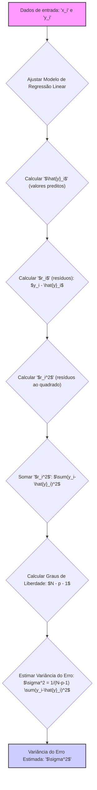
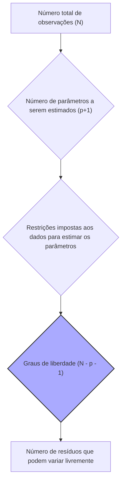
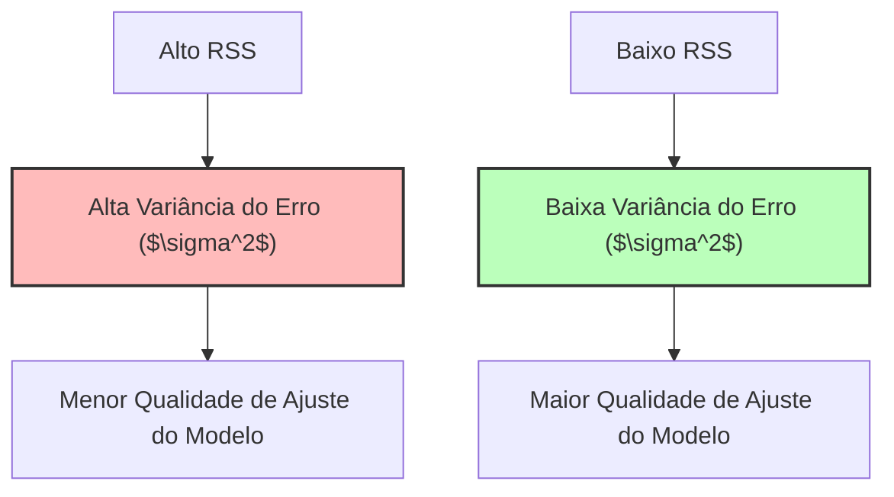

## Estimação da Variância do Erro: $\sigma^2 = 1/(N-p-1) \sum(y_i-\hat{y}_i)^2$ em Modelos de Regressão Linear

### Introdução
A estimativa da **variância do erro**, denotada por **$\sigma^2$**, é um componente essencial em modelos de regressão linear, pois quantifica a variabilidade do erro aleatório que não é explicado pelo modelo. A fórmula **$\sigma^2 = 1/(N-p-1) \sum(y_i-\hat{y}_i)^2$** fornece uma estimativa não viesada da variância do erro, onde a soma dos quadrados dos resíduos é dividida pelo grau de liberdade, $(N-p-1)$, ao invés de apenas $N$. Esta seção detalhará cada componente da formulação, seu significado estatístico, e o papel dos graus de liberdade na estimativa.

### Formulação Matemática da Variância do Erro

Em um modelo de regressão linear, a variável resposta $y_i$ é modelada como uma função linear dos preditores, mais um erro aleatório, $\epsilon_i$:
$$
y_i = \beta_0 + \sum_{j=1}^p x_{ij}\beta_j + \epsilon_i
$$
onde:

-  $y_i$ é o valor observado para a i-ésima observação.
-  $\beta_0$ é o *intercept*.
-   $x_{ij}$ é o valor da j-ésima variável preditora na i-ésima observação.
-   $\beta_j$ são os parâmetros do modelo linear.
-   $\epsilon_i$ é o erro aleatório para a i-ésima observação.

O método dos mínimos quadrados busca encontrar os parâmetros $\beta_j$ que minimizam a soma dos quadrados dos resíduos, que é dada por:

$$
RSS(\beta) = \sum_{i=1}^N (y_i - \hat{y_i})^2 = \sum_{i=1}^N r_i^2
$$

onde:
- $\hat{y_i}$ é o valor predito para a i-ésima observação, $\hat{y_i} = \beta_0 + \sum_{j=1}^p x_{ij}\beta_j$.
- $r_i$ é o resíduo, ou a diferença entre o valor observado e o predito, $y_i - \hat{y_i}$.

A estimativa da variância do erro, $\sigma^2$, é dada pela seguinte fórmula:
$$
\hat{\sigma}^2 = \frac{1}{N-p-1} \sum_{i=1}^N (y_i - \hat{y}_i)^2 = \frac{1}{N-p-1} \sum_{i=1}^N r_i^2
$$
onde:
-   $N$ é o número total de observações.
-   $p$ é o número de preditores no modelo.
-   $\hat{y}_i$ é o valor predito pelo modelo para a i-ésima observação.
-   $N-p-1$ é o número de graus de liberdade associados ao modelo.
O termo $1/(N-p-1)$ é usado no cálculo da estimativa para garantir que a estimativa da variância seja não viesada.

> 💡 **Exemplo Numérico:**
> Suponha que temos um modelo de regressão linear com uma variável preditora ($p=1$) e 5 observações ($N=5$). Os dados são:
>
> | Observação (i) | $x_i$ | $y_i$ |
> |-----------------|-------|-------|
> | 1               | 1     | 2     |
> | 2               | 2     | 3     |
> | 3               | 3     | 5     |
> | 4               | 4     | 6     |
> | 5               | 5     | 8     |
>
> Após ajustar o modelo de regressão linear, obtemos os seguintes valores preditos ($\hat{y}_i$):
>
> | Observação (i) | $x_i$ | $y_i$ | $\hat{y}_i$ | $r_i = y_i - \hat{y}_i$ | $r_i^2$ |
> |-----------------|-------|-------|-------------|------------------------|---------|
> | 1               | 1     | 2     | 2.0         | 0.0                    | 0.0     |
> | 2               | 2     | 3     | 3.2         | -0.2                   | 0.04    |
> | 3               | 3     | 5     | 4.4         | 0.6                    | 0.36    |
> | 4               | 4     | 6     | 5.6         | 0.4                    | 0.16    |
> | 5               | 5     | 8     | 6.8         | 1.2                    | 1.44    |
>
> A soma dos quadrados dos resíduos (RSS) é:
> $$
> RSS = \sum_{i=1}^5 r_i^2 = 0.0 + 0.04 + 0.36 + 0.16 + 1.44 = 2.0
> $$
>
> Os graus de liberdade são $N - p - 1 = 5 - 1 - 1 = 3$. Portanto, a estimativa da variância do erro é:
>
> $$
> \hat{\sigma}^2 = \frac{RSS}{N-p-1} = \frac{2.0}{3} \approx 0.667
> $$
>
> Este valor de $\hat{\sigma}^2$ representa a variabilidade dos erros em torno da linha de regressão ajustada.

### Importância dos Graus de Liberdade

O termo ($N - p - 1$) no denominador da estimativa de $\sigma^2$ representa os graus de liberdade do modelo. Os graus de liberdade correspondem ao número de observações independentes que estão disponíveis para estimar a variância do erro, após a estimação dos parâmetros do modelo.  A ideia é que os resíduos estão sujeitos a $N$ restrições, uma para cada parâmetro, e portanto a variância é calculada com $N-p-1$ graus de liberdade.

Em termos mais detalhados:
    -  $N$ representa o número total de observações,
    -  $p+1$ é o número de parâmetros a serem estimados (incluindo o *intercept*), que por sua vez, correspondem ao número de restrições impostas nos dados para estimar os parâmetros.
    - $N-p-1$ é o número de resíduos que podem variar livremente, dados os parâmetros do modelo.
A utilização de $N-p-1$ no denominador, ao invés de apenas $N$, garante que a estimativa de $\sigma^2$ seja **não viesada**, ou seja, que o valor esperado da estimativa corresponde ao verdadeiro valor da variância do erro [^47].

**Lemma 25:**  Não Viesamento da Estimativa da Variância do Erro
A estimativa da variância do erro $\hat{\sigma}^2 = \frac{1}{N-p-1} \sum_{i=1}^N (y_i - \hat{y}_i)^2$ é um estimador não viesado da variância do erro $\sigma^2$, ou seja, que $E[\hat{\sigma}^2] = \sigma^2$ , onde $E$ representa a expectativa.

**Prova do Lemma 25:**
Para mostrar o não viesamento da estimativa, vamos assumir que o modelo é:
$$
Y = X \beta + \epsilon
$$
onde $\epsilon \sim N(0,\sigma^2 I)$ e a solução por mínimos quadrados é dada por $\hat{\beta} = (X^T X)^{-1} X^T y$
O resíduo é então
$$
\hat{\epsilon} = y - X\hat{\beta} = y - X(X^TX)^{-1}X^T y= (I-H)y
$$
onde H é a matriz Hat.
Substituindo a expressão de $y$ temos
$$ \hat{\epsilon} = (I-H)(X\beta + \epsilon) = (I-H)\epsilon $$
Então, a soma dos quadrados dos resíduos pode ser escrita como:
$$ \hat{\epsilon}^T \hat{\epsilon} = \epsilon^T(I-H)^T(I-H)\epsilon=\epsilon^T(I-H)\epsilon$$
Usando a propriedade da traça de matrizes ( a traça é a soma dos elementos da diagonal de uma matriz),
$$E[\hat{\epsilon}^T \hat{\epsilon}] = E[\text{tr}(\epsilon^T(I-H)\epsilon)]=E[\text{tr}((I-H)\epsilon \epsilon^T)]=\text{tr}((I-H)E[\epsilon \epsilon^T])=\sigma^2\text{tr}(I-H)$$
Note que o traço da matriz identidade de $N$ dimensões é $N$. O traço da matriz H, também chamado de grau de liberdade, é dado pelo número de parâmetros do modelo, $p+1$. Assim, a esperança da soma dos resíduos é:
$$E[\hat{\epsilon}^T \hat{\epsilon}]=\sigma^2 (N - p - 1)$$
e dividindo pelo número de graus de liberdade, temos que:
$$E[\hat{\sigma}^2] = E\frac{\hat{\epsilon}^T \hat{\epsilon}}{N-p-1} = \sigma^2$$
o que demonstra que a estimativa da variância do erro é não viesada. $\blacksquare$

**Corolário 25:** Viesamento da Estimativa quando se usa N
Ao dividir a soma dos quadrados dos resíduos por $N$, em vez de $N-p-1$, obtemos um estimador da variância do erro que é viesado, e que tende a subestimar o valor da variância do erro, dado que $N>N-p-1$.

> 💡 **Exemplo Numérico:**
> Usando o mesmo exemplo anterior, se dividíssemos o RSS por $N$ em vez de $N-p-1$, obteríamos:
>
> $$
> \hat{\sigma}^2_{viesado} = \frac{RSS}{N} = \frac{2.0}{5} = 0.4
> $$
>
> Este valor de 0.4 é menor que a estimativa não viesada de 0.667. Isso ilustra como dividir por $N$ subestima a verdadeira variância do erro.

### Interpretação Estatística e Geométrica da Estimativa da Variância

A estimativa da variância do erro tem uma interpretação estatística e geométrica:

1.  **Variabilidade dos Erros:** A estimativa $\hat{\sigma}^2$ quantifica a dispersão do erro em torno da função de regressão, e representa a quantidade de variação na variável resposta que não é explicada pelos preditores [^10].
2.  **Distribuição do Erro:** Em muitos casos, o erro aleatório $\epsilon$ é assumido como tendo distribuição normal com média zero e variância $\sigma^2$. Essa hipótese permite inferências estatísticas e construir intervalos de confiança para os parâmetros.
3.  **Conexão com a Soma dos Quadrados dos Resíduos:** A estimativa da variância do erro é diretamente proporcional à soma dos quadrados dos resíduos, e um modelo com menor RSS tem menor variância do erro, o que significa que os pontos de dados estão mais próximos do hiperplano de regressão.
4.  **Incerteza da Estimativa:** A variância do erro, assim como a variância dos parâmetros, indica o quanto incerta é a estimativa do modelo. A estimativa da variância do erro pode ser combinada com os erros padrão dos parâmetros para obter intervalos de confiança e realizar testes de hipótese.

> 💡 **Exemplo Numérico:**
> Considere dois modelos de regressão ajustados aos mesmos dados. O Modelo A tem um RSS de 10 e o Modelo B tem um RSS de 5. Ambos têm 10 observações e 2 preditores.
>
> Para o Modelo A:
>   - $N = 10$, $p = 2$
>   - $RSS_A = 10$
>   - $\hat{\sigma}^2_A = \frac{10}{10 - 2 - 1} = \frac{10}{7} \approx 1.43$
>
> Para o Modelo B:
>   - $N = 10$, $p = 2$
>   - $RSS_B = 5$
>   - $\hat{\sigma}^2_B = \frac{5}{10 - 2 - 1} = \frac{5}{7} \approx 0.71$
>
> O Modelo B tem uma variância do erro estimada menor, indicando que ele se ajusta melhor aos dados do que o Modelo A. Isso significa que a variabilidade dos erros em torno da linha de regressão no Modelo B é menor do que no Modelo A.

A estimativa não viesada da variância do erro é um componente essencial para quantificar a incerteza do modelo, e é um elemento fundamental para a qualidade das previsões do modelo.

⚠️ **Nota Importante**:  A estimativa da variância do erro é dada por $\sigma^2 = 1/(N-p-1) \sum(y_i-\hat{y}_i)^2$, onde a divisão por $N-p-1$ garante que a estimativa seja não viesada.
 
❗ **Ponto de Atenção**: A estimação de parâmetros usa a soma dos quadrados dos resíduos, e a divisão pelos graus de liberdade resulta num estimador não viesado da variância do erro.
 
✔️ **Destaque**: O conceito dos graus de liberdade é essencial para a estimativa de $\sigma^2$, e a utilização do termo $N-p-1$ garante que a estimativa seja não viesada.

### Conclusão

A estimativa da variância do erro, expressa por $\hat{\sigma}^2 = \frac{1}{N-p-1} \sum_{i=1}^N (y_i - \hat{y}_i)^2$, é fundamental para a compreensão e a utilização de modelos de regressão linear. A utilização do termo de graus de liberdade no denominador garante que o estimador seja não viesado, fornecendo uma representação precisa da incerteza associada às previsões do modelo. O uso adequado desta estimativa é crucial para a validação e inferência nos modelos lineares.

### Referências

[^10]: "The most popular estimation method is least squares, in which we pick the coefficients β = (β0, β1, ..., βp)T to minimize the residual sum of squares" *(Trecho de Linear Methods for Regression)*
[^11]: "The linear model either assumes that the regression function E(Y|X) is linear, or that the linear model is a reasonable approximation." *(Trecho de Linear Methods for Regression)*
[^47]: "The N-p-1 rather than N in the denominator makes ˆσ2 an unbiased estimate of σ2: E(ˆσ2) = σ2." *(Trecho de Linear Methods for Regression)*
[^12]: "Least squares fitting is intuitively satisfying no matter how the data arise; the criterion measures the average lack of fit." *(Trecho de Linear Methods for Regression)*
