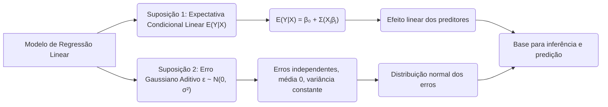
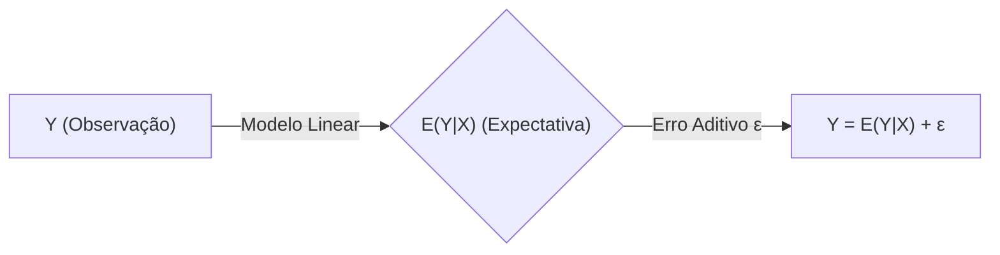

## Suposições Estatísticas em Modelos de Regressão Linear: Expectativa Condicional Linear e Erro Gaussiano Aditivo



### Introdução
Os modelos de regressão linear são construídos com base em um conjunto de suposições estatísticas, que garantem a validade teórica do modelo e as propriedades dos estimadores. As duas suposições mais importantes são: a linearidade da expectativa condicional de $Y$ dado $X$ e a natureza gaussiana e aditiva do erro, $\epsilon \sim \mathcal{N}(0, \sigma^2)$. Nesta seção, vamos explorar cada uma dessas suposições, discutir suas implicações, e como a violação dessas premissas afeta a validade e as propriedades do modelo.

### A Suposição da Linearidade da Expectativa Condicional

A primeira suposição fundamental em modelos de regressão linear é que a **expectativa condicional da variável resposta Y dado os preditores X é linear** [^1]. Matematicamente, esta suposição é expressa como:
$$
E(Y|X) = \beta_0 + \sum_{j=1}^p X_j \beta_j
$$
onde:
   -  $E(Y|X)$ representa a expectativa condicional da variável resposta $Y$ dado um conjunto de preditores $X$.
   -  $\beta_0$ é o intercepto.
   - $X_j$ são as variáveis preditoras.
   - $\beta_j$ são os coeficientes associados às variáveis preditoras.
   - $p$ é o número de preditores.
Esta suposição implica que o valor médio de $Y$ para um dado conjunto de preditores $X$ se encontra sobre um hiperplano definido pelos parâmetros $\beta$, e que o efeito de cada preditor na resposta é linear. Isso não quer dizer que a relação entre $Y$ e $X$ seja linear, e transformações nas variáveis podem ser utilizadas para ajustar o modelo a relações não lineares, mantendo a linearidade nos parâmetros.

A linearidade da expectativa condicional é crucial pois garante que a função de regressão linear $f(x) = \beta_0 + \sum_{j=1}^p X_j \beta_j$, seja uma aproximação razoável de $E(Y|X)$.  Quando esta suposição não se mantém, o modelo de regressão linear pode levar a estimativas enviesadas e predições incorretas, ou seja, pode apresentar alto *bias*.

> 💡 **Exemplo Numérico:**
>
> Suponha que temos um conjunto de dados onde a variável resposta $Y$ é o preço de uma casa e a variável preditora $X$ é a área da casa (em metros quadrados). A suposição de linearidade da expectativa condicional implica que o preço médio da casa aumenta linearmente com a área.
>
> Vamos assumir um modelo simples com apenas um preditor:
> $$E(Y|X) = \beta_0 + \beta_1 X$$
>
> Se após ajustar o modelo obtivermos $\beta_0 = 50000$ e $\beta_1 = 1500$, isso significa que:
>
>  -  O preço base de uma casa (quando a área é 0) é de R$50.000 (este valor não tem interpretação prática neste exemplo).
>  -  Para cada metro quadrado adicional, o preço médio da casa aumenta em R$1.500.
>
>  Se uma casa tem 100 metros quadrados, o preço médio estimado seria:
>  $$E(Y|X=100) = 50000 + 1500 * 100 = 200000$$
>
>  Agora, se a relação real fosse não linear, por exemplo, o preço aumentasse menos para áreas maiores (efeito de saturação), a suposição de linearidade seria violada. Nesse caso, poderíamos usar uma transformação nos dados como $\log(X)$ ou $X^2$ para modelar a não linearidade, mantendo a linearidade nos parâmetros do modelo transformado.

### A Suposição do Erro Gaussiano Aditivo

A segunda suposição fundamental em modelos de regressão linear é que os erros aleatórios $\epsilon_i$ são independentes e identicamente distribuídos com uma distribuição Gaussiana (normal) com média zero e variância constante $\sigma^2$. Essa suposição é expressa como:
$$
\epsilon_i \sim \mathcal{N}(0, \sigma^2)
$$
ou equivalentemente como
$$
\epsilon \sim \mathcal{N}(0, \sigma^2 I)
$$
onde:
   -  $\epsilon_i$ é o erro aleatório associado à i-ésima observação.
   -  $\mathcal{N}$ denota a distribuição normal (Gaussiana).
   -  $0$ é a média zero, ou seja, $E(\epsilon_i)=0$.
   -  $\sigma^2$ é a variância constante, que significa que a variância do erro é a mesma para todas as observações, ou seja $Var(\epsilon_i)=\sigma^2$.
        - $I$ é a matriz identidade.

Essa suposição implica que os erros são distribuídos simetricamente em torno da sua média (zero), com uma probabilidade que decai rapidamente com o aumento da distância a partir da média. Esta suposição não impõe que os dados, por si só, tenham distribuição normal.
O erro gaussiano também é denominado como **aditivo**, já que ele é somado ao valor esperado da resposta, como em:



$$
Y = \beta_0 + \sum_{j=1}^p X_j \beta_j + \epsilon
$$
Onde o erro $\epsilon$ é independente dos preditores.

As suposições sobre o erro garantem a validade de inferências estatísticas no modelo de regressão linear, além de justificar o uso da estimação por mínimos quadrados [^47].

> 💡 **Exemplo Numérico:**
>
> Imagine que estamos modelando a altura de plantas ($Y$) em função da quantidade de fertilizante ($X$). Após ajustar um modelo linear, obtemos os seguintes resultados para algumas observações:
>
> | Observação | Fertilizante (X) | Altura Observada (Y) | Altura Estimada (Ŷ) | Erro (ε = Y - Ŷ) |
> |------------|-------------------|---------------------|--------------------|-------------------|
> | 1          | 2                 | 10                  | 11                 | -1                |
> | 2          | 4                 | 15                  | 14                 | 1                 |
> | 3          | 6                 | 18                  | 19                 | -1                |
> | 4          | 8                 | 24                  | 23                 | 1                 |
> | 5          | 10                | 28                  | 29                 | -1                |
>
> A suposição de erro gaussiano aditivo implica que esses erros (-1, 1, -1, 1, -1) devem se comportar como amostras aleatórias de uma distribuição normal com média 0 e variância constante.
>
> Se calcularmos a média desses erros, obteremos 0, e a variância amostral será próxima a $\sigma^2$, que é a variância estimada dos erros. Idealmente, se plotarmos um histograma ou um gráfico de probabilidade normal dos erros, deveremos ver uma distribuição aproximadamente normal centrada em zero.
>
> A suposição de variância constante (homocedasticidade) significa que a dispersão dos erros deve ser similar para todos os níveis de fertilizante. Se, por exemplo, a variância dos erros aumentasse com a quantidade de fertilizante, teríamos uma violação da homocedasticidade (heterocedasticidade).

**Lemma 26:** O Teorema de Gauss-Markov

Sob as suposições de que $E(Y|X)$ é linear e que os erros $\epsilon_i$ têm média zero, variância constante, e são não correlacionados, os estimadores de mínimos quadrados são os melhores estimadores lineares não viesados (BLUE, *Best Linear Unbiased Estimators*). Este resultado, chamado de Teorema de Gauss-Markov, demonstra que a solução por mínimos quadrados tem um ótimo desempenho, na classe de estimadores lineares não viesados. A suposição da distribuição normal para os erros não é necessária para que este resultado se mantenha.

**Prova do Lemma 26:**
Para demonstrar o teorema de Gauss-Markov, seja $\hat{\beta} = (X^T X)^{-1} X^T y$ o estimador de mínimos quadrados e seja $\tilde{\beta} = Cy$ um outro estimador linear não viesado de $\beta$. Para que o estimador $\tilde{\beta}$ seja não viesado, é necessário que $E[\tilde{\beta}] = E[Cy] = \beta$, e usando $y = X\beta+\epsilon$ temos que $E[C(X\beta+\epsilon)] = CX\beta = \beta$, ou seja $CX = I$ onde $I$ é a matriz identidade. A variância do estimador $\tilde{\beta}$ é dada por:
$$
Var(\tilde{\beta}) = Var(Cy) = C Var(y) C^T = \sigma^2 C C^T
$$
Como $Var(\hat{\beta}) = \sigma^2 (X^T X)^{-1}$, e $CX=I$, podemos escrever:
$$
C C^T - (X^T X)^{-1} = (C - (X^TX)^{-1}X^T)(C - (X^TX)^{-1}X^T)^T + (X^TX)^{-1}
$$
Como $(C - (X^TX)^{-1}X^T)(C - (X^TX)^{-1}X^T)^T$ é uma matriz positiva semi definida, então
$$
C C^T \geq (X^T X)^{-1}
$$
e portanto,
$$
Var(\tilde{\beta}) \geq Var(\hat{\beta})
$$
o que demonstra que o estimador de mínimos quadrados é um estimador com menor variância em relação a um estimador genérico não viesado. $\blacksquare$

**Corolário 26:** Interpretação Geométrica da Projeção Ortogonal

O Lemma 26, combinado com a interpretação geométrica da solução por mínimos quadrados, mostra que a projeção ortogonal do vetor $y$ no espaço gerado por X fornece o estimador não viesado de menor variância quando $E(Y|X)$ é linear e os erros são homocedásticos e não correlacionados. O modelo linear é a "melhor" aproximação linear da expectativa condicional, e também do ponto de vista preditivo.

### Implicações das Suposições Estatísticas

As suposições de linearidade da expectativa condicional e do erro gaussiano aditivo têm diversas implicações:

1. **Validade da Estimação:** A linearidade da expectativa condicional garante que o método dos mínimos quadrados produz estimativas não viesadas para os parâmetros do modelo, quando o modelo é corretamente especificado, o que é fundamental para inferências estatísticas e predições confiáveis.
2.  **Teorema de Gauss-Markov:** A suposição do erro gaussiano garante que a estimação por mínimos quadrados seja BLUE (melhor estimador linear não viesado) e também garante a validade das inferências estatísticas, que se baseiam na distribuição normal dos erros.
3.  **Justificação para a Soma dos Quadrados dos Resíduos:** A hipótese de erro gaussiano aditivo é uma justificativa para o uso da função RSS como uma função de custo, já que a distribuição normal do erro é uma consequência de assumir que o modelo linear captura a estrutura principal dos dados, e as variações remanescentes são aleatórias.
4.  **Incerteza e Inferência:** As propriedades da distribuição normal do erro são utilizadas para realizar testes de hipóteses e construir intervalos de confiança para os parâmetros do modelo.
5. **Aproximações da Realidade:** É importante entender que ambas as suposições são aproximações da realidade, e que na maioria das situações práticas, as propriedades do modelo linear podem ser afetadas pela violação destas suposições. Técnicas como a regularização podem auxiliar a construir modelos mais robustos, independentemente da distribuição dos erros.

### Violação das Suposições e suas Consequências

É importante notar que nem sempre as suposições estatísticas são válidas. As violações dessas suposições podem levar a resultados enviesados e a um desempenho preditivo fraco.
    1. **Não Linearidade:** Se a verdadeira relação entre os preditores e a variável resposta é não linear, a suposição de que $E(Y|X)$ é uma função linear dos preditores será violada, o que pode resultar em um modelo com alto *bias* e com pobre performance preditiva. Nesses casos, transformações nos preditores, ou métodos não lineares, devem ser utilizados.
   2. **Heteroscedasticidade:** Se a variância do erro não é constante e varia com os níveis dos preditores, então as estimativas de mínimos quadrados serão menos eficientes do que outros modelos (que levam em consideração a heteroscedasticidade). Nestes casos, métodos de mínimos quadrados ponderados devem ser utilizados para obter estimativas mais precisas.
   3. **Erros Não Normais:** A hipótese de que os erros tem distribuição normal permite testes estatísticos e construção de intervalos de confiança. Quando esta hipótese é violada, outros testes devem ser utilizados, e as inferências estatísticas podem não ser válidas.

> 💡 **Exemplo Numérico (Violação da Normalidade):**
>
> Suponha que, ao analisar os resíduos de um modelo de regressão, observamos que a distribuição dos erros é fortemente assimétrica à direita, ou seja, há muitos erros pequenos e poucos erros grandes positivos. Isso indicaria uma violação da suposição de normalidade.
>
> Uma forma de visualizar isso seria através de um histograma dos resíduos:
>
> ```mermaid
>  graph LR
>      A[Resíduos] --> B(Histograma);
>      B --> C{Assimetria à Direita};
> ```
>
> Neste caso, testes de hipótese e intervalos de confiança baseados na distribuição normal podem ser inválidos, e devemos considerar outros métodos de inferência estatística ou transformar a variável resposta.
>
> 💡 **Exemplo Numérico (Heterocedasticidade):**
>
> Imagine que estamos modelando o tempo de conclusão de uma tarefa em função do número de participantes. Se a variabilidade dos tempos de conclusão aumentar conforme o número de participantes cresce, teremos heterocedasticidade. Isso pode ser visualizado em um gráfico dos resíduos contra os valores preditos:
>
> ```mermaid
>  graph LR
>      A[Valores Preditos] --> B(Gráfico de Resíduos);
>      B --> C{Dispersão Crescente};
> ```
>
> Neste caso, a variância dos erros não é constante, e a suposição de homocedasticidade é violada. Isso pode levar a estimativas de parâmetros menos precisas e intervalos de confiança inválidos. Podemos usar mínimos quadrados ponderados para levar em conta a heterocedasticidade.

É fundamental verificar as suposições estatísticas antes da aplicação dos modelos de regressão, e considerar métodos de correção caso as suposições não sejam válidas. A validade de um modelo está diretamente ligada a quão bem as suposições são respeitadas.
A regularização pode ser utilizada como uma ferramenta para lidar com a violação destas suposições, construindo modelos que são mais robustos, menos suscetíveis ao ruído dos dados e mais generalizáveis para dados não vistos.

> ⚠️ **Nota Importante**: A suposição da linearidade de E(Y|X) implica que a relação entre a resposta e os preditores é linear no espaço dos preditores, e que transformações dos preditores podem ser utilizadas para modelar relações não lineares.

> ❗ **Ponto de Atenção**: A suposição do erro gaussiano aditivo, com média zero e variância constante, garante que as estimativas de mínimos quadrados sejam os melhores estimadores lineares não viesados.

> ✔️ **Destaque**: A violação das suposições de linearidade da expectativa condicional e do erro gaussiano aditivo podem levar a resultados enviesados e modelos pouco preditivos, o que justifica a importância de verificar estas hipóteses.

### Conclusão

As suposições estatísticas de que a expectativa condicional de $Y$ dado $X$ é linear, e que os erros são Gaussianos, aditivos, independentes e identicamente distribuídos são fundamentais para o desenvolvimento e aplicação de modelos de regressão linear. Ao entender essas suposições e suas implicações, e ao utilizar abordagens como as transformações, a regularização, e o tratamento dos *outliers* e da multicolinearidade, podemos construir modelos mais robustos, generalizáveis e úteis para problemas do mundo real.

### Referências

[^1]: "A linear regression model assumes that the regression function E(Y|X) is linear in the inputs X1,..., Xp." *(Trecho de Linear Methods for Regression)*
[^47]: "The N-p-1 rather than N in the denominator makes 6 an unbiased estimate of σ2: E(62) = σ2." *(Trecho de Linear Methods for Regression)*
[^11]: "The linear model either assumes that the regression function E(Y|X) is linear, or that the linear model is a reasonable approximation." *(Trecho de Linear Methods for Regression)*
