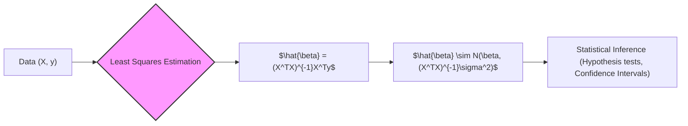

## Distribuição dos Estimadores de Parâmetros: $\beta \sim N(\beta, (X^TX)^{-1}\sigma^2)$ em Modelos de Regressão Linear



### Introdução

Em modelos de regressão linear, a distribuição dos estimadores de parâmetros, dada por $\beta \sim N(\beta, (X^TX)^{-1}\sigma^2)$, é uma propriedade fundamental que permite realizar inferências estatísticas sobre os coeficientes do modelo. Esta expressão descreve como os estimadores de parâmetros $\hat{\beta}$, obtidos por mínimos quadrados, se distribuem em torno dos seus valores verdadeiros $\beta$, e é a base para testes de hipóteses, construção de intervalos de confiança e avaliação da incerteza associada aos parâmetros do modelo. Nesta seção, exploraremos em detalhes cada componente dessa distribuição, sua derivação e sua importância na análise da regressão linear.

### A Distribuição dos Estimadores de Parâmetros

Em um modelo de regressão linear, a suposição de que os erros aleatórios $\epsilon_i$ seguem uma distribuição Normal com média zero e variância $\sigma^2$, ou seja, $\epsilon_i \sim \mathcal{N}(0, \sigma^2)$, implica que os estimadores de parâmetros, obtidos através do método de mínimos quadrados, seguem uma distribuição Normal multidimensional:

$$
\hat{\beta} \sim \mathcal{N}(\beta, (X^T X)^{-1}\sigma^2)
$$

onde:

-   $\hat{\beta} \in \mathbb{R}^{p+1}$ é o vetor dos estimadores de mínimos quadrados dos parâmetros.
-   $\beta \in \mathbb{R}^{p+1}$ é o vetor dos valores verdadeiros dos parâmetros do modelo (que usualmente são desconhecidos).
-   $X \in \mathbb{R}^{N \times (p+1)}$ é a matriz de design (com o intercepto e os preditores).
-   $(X^T X)^{-1}$ é a inversa da matriz $X^T X$.
-   $\sigma^2$ é a variância do erro aleatório.
-  $\mathcal{N}$ denota a distribuição normal multidimensional.

Esta expressão significa que o vetor de parâmetros $\hat{\beta}$, quando estimado por mínimos quadrados, tem uma distribuição normal com média no valor verdadeiro $\beta$ e uma matriz de variância-covariância dada por $(X^T X)^{-1}\sigma^2$. A distribuição dos parâmetros permite entender as propriedades dos parâmetros estimados.

> 💡 **Exemplo Numérico:**
> Suponha que temos um modelo de regressão linear com um preditor e um intercepto, onde o verdadeiro modelo é $y = 2 + 3x + \epsilon$, com $\epsilon \sim \mathcal{N}(0, 0.5^2)$. Vamos gerar um conjunto de dados para ilustrar:
>
> ```python
> import numpy as np
> import matplotlib.pyplot as plt
>
> np.random.seed(42)
> n_samples = 100
> X = np.column_stack((np.ones(n_samples), np.random.rand(n_samples) * 5))  # Add intercept
> true_beta = np.array([2, 3])
> sigma = 0.5
> epsilon = np.random.normal(0, sigma, n_samples)
> y = X @ true_beta + epsilon
>
> # Calculate beta_hat
> beta_hat = np.linalg.inv(X.T @ X) @ X.T @ y
>
> print("Estimated beta:", beta_hat)
> ```
>
> Neste exemplo, geramos dados a partir de um modelo linear com parâmetros verdadeiros $\beta = [2, 3]$. O código calcula $\hat{\beta}$ utilizando a fórmula de mínimos quadrados. Executando o código, podemos observar que os valores de $\hat{\beta}$ são próximos dos valores verdadeiros, e que eles variam de uma amostra para outra, seguindo uma distribuição normal multidimensional. A variância desta distribuição é dada por $(X^TX)^{-1}\sigma^2$, que pode ser estimada usando os dados.

### Derivação da Distribuição dos Estimadores de Parâmetros

A derivação da distribuição dos estimadores de parâmetros se baseia em dois resultados:

1. **Linearidade dos Estimadores de Mínimos Quadrados**:  Os estimadores de mínimos quadrados são uma combinação linear das variáveis respostas $y$, o que resulta em:

$$
\hat{\beta} = (X^T X)^{-1} X^T y
$$
Substituindo a forma do modelo $y = X\beta + \epsilon$ na expressão de $\hat{\beta}$ temos:
$$
\hat{\beta} = (X^T X)^{-1} X^T(X\beta+\epsilon)
$$
$$
\hat{\beta} = (X^T X)^{-1} X^T X\beta+(X^T X)^{-1}X^T\epsilon
$$
$$
\hat{\beta} = \beta+(X^T X)^{-1}X^T\epsilon
$$
2.  **Distribuição dos Erros:** A suposição de que os erros têm distribuição normal $\epsilon \sim \mathcal{N}(0, \sigma^2 I)$ e que os erros são independentes e identicamente distribuídos garante que as combinações lineares dos erros também terão uma distribuição normal.

Combinando esses dois resultados, temos que o estimador $\hat{\beta}$ segue uma distribuição normal multidimensional, com:

-   **Média (Esperança):**
    $$
    E[\hat{\beta}] = E[ \beta+(X^T X)^{-1}X^T\epsilon] = \beta + (X^T X)^{-1}X^TE[\epsilon] = \beta
    $$
  já que a média dos erros é zero, $E(\epsilon) = 0$.

-   **Matriz de Variância-Covariância:**

```mermaid
flowchart LR
    A[Var($\hat{\beta}$)] --> B[Var($\beta + (X^TX)^{-1}X^T\epsilon$)];
    B --> C[Var($(X^TX)^{-1}X^T\epsilon$)];
    C --> D[$(X^TX)^{-1}X^T Var(\epsilon) ((X^TX)^{-1}X^T)^T$];
    D --> E[$(X^TX)^{-1}X^T (\sigma^2I) X(X^TX)^{-1}$];
    E --> F[$\sigma^2(X^TX)^{-1}X^TX(X^TX)^{-1}$];
    F --> G[$\sigma^2(X^TX)^{-1}$];
    style A fill:#ccf,stroke:#333,stroke-width:2px
```

$$
\begin{aligned}
Var(\hat{\beta}) &= Var(\beta + (X^T X)^{-1} X^T \epsilon ) \\
&= Var((X^T X)^{-1} X^T \epsilon) \\
&= (X^T X)^{-1} X^T Var(\epsilon) ( (X^T X)^{-1} X^T )^T \\
&= (X^T X)^{-1} X^T (\sigma^2 I) X (X^T X)^{-1} \\
&=  \sigma^2 (X^T X)^{-1} X^T X (X^T X)^{-1} \\
&= \sigma^2 (X^T X)^{-1}
\end{aligned}
$$
o que confirma que $Var(\hat{\beta})=(X^TX)^{-1}\sigma^2$

Portanto, $\hat{\beta} \sim \mathcal{N}(\beta, (X^T X)^{-1}\sigma^2)$.

> 💡 **Exemplo Numérico (Continuação):**
>
> Podemos calcular a matriz de variância-covariância estimada para o exemplo anterior:
>
> ```python
> # Calculate (X^T X)^-1
> xtx_inv = np.linalg.inv(X.T @ X)
>
> # Estimate sigma^2 using residuals
> y_hat = X @ beta_hat
> residuals = y - y_hat
> sigma_sq_hat = np.sum(residuals**2) / (n_samples - X.shape[1])
>
> # Calculate estimated variance-covariance matrix
> var_cov_beta_hat = sigma_sq_hat * xtx_inv
>
> print("Estimated Variance-Covariance Matrix of beta_hat:\n", var_cov_beta_hat)
> ```
>
> Este código calcula $(X^TX)^{-1}$ e estima $\sigma^2$ a partir dos resíduos do modelo. A matriz de variância-covariância estimada é então calculada. Esta matriz mostra a variância de cada parâmetro ($\hat{\beta}_0$ e $\hat{\beta}_1$) na diagonal e a covariância entre eles fora da diagonal.
>
> A matriz de variância-covariância estimada pode ser usada para calcular os erros padrão dos coeficientes:
>
> ```python
> std_errors = np.sqrt(np.diag(var_cov_beta_hat))
> print("Standard errors:", std_errors)
> ```
>
> Os erros padrão são as raízes quadradas dos elementos diagonais da matriz de variância-covariância e podem ser usados para construir intervalos de confiança para os parâmetros.

**Lemma 27:** Propriedades da Normal Multidimensional

A distribuição normal multidimensional é uma generalização da distribuição normal univariada para múltiplos parâmetros [^10]. Se um vetor aleatório X segue uma distribuição normal multidimensional, então qualquer combinação linear de seus componentes também segue uma distribuição normal. Além disso, a distribuição é completamente definida pelo seu vetor médio e pela sua matriz de variância-covariância.

**Prova do Lemma 27:**
A distribuição normal multidimensional é definida pela função densidade:
$$ f(x) = \frac{1}{(2\pi)^{p/2} |\Sigma|^{1/2}} \exp(-\frac{1}{2}(x-\mu)^T\Sigma^{-1}(x-\mu)) $$
onde $\mu$ é o vetor da média, e $\Sigma$ é a matriz de covariância.
As propriedades básicas da distribuição normal são, em geral, conservadas na distribuição multidimensional.  Um resultado útil é o de que transformações lineares de vetores com distribuição normal multidimensional também seguem uma distribuição normal multidimensional. $\blacksquare$

**Corolário 27:** Utilização da distribuição Normal

A distribuição normal multidimensional é fundamental para inferência estatística. As propriedades da normal podem ser usadas para definir testes de hipóteses, e intervalos de confiança, além de outros procedimentos. Em particular, as margens de erro podem ser computadas utilizando a variância dos estimadores e propriedades da normal.

###  Interpretação Geométrica da Distribuição dos Parâmetros

```mermaid
flowchart LR
    A[Variance-Covariance Matrix $(X^TX)^{-1}\sigma^2$] --> B[Defines Ellipsoids];
    B --> C[Ellipsoid Shape (Eigenvalues/Vectors)];
    C --> D[Parameter Correlation (Off-diagonal elements)];
    D --> E[Collinearity Influence (Condition Number of $X^TX$)];
    E --> F[Parameter Uncertainty/Stability];
    style A fill:#aaf,stroke:#333,stroke-width:2px
```

A distribuição dos estimadores de parâmetros tem uma interpretação geométrica no espaço dos parâmetros:
    1.  **Elipsóides de Confiança:** A matriz de variância-covariância, $(X^T X)^{-1}\sigma^2$, define elipsóides de confiança no espaço dos parâmetros. Estes elipsóides representam regiões onde os verdadeiros valores dos parâmetros são prováveis de estarem, a um certo nível de confiança.
    2.  **Forma do Elipsóide:** A forma e o tamanho dos elipsóides são determinadas pelos autovalores e autovetores da matriz de variância-covariância, $(X^TX)^{-1}$, e pela variância do erro, $\sigma^2$. Autovalores maiores indicam maior incerteza na direção dos autovetores correspondentes.
    3.  **Correlação entre Parâmetros:** Os elementos fora da diagonal da matriz $(X^T X)^{-1}\sigma^2$ quantificam a correlação entre os parâmetros.
    4. **Influência da Colinearidade**: Se os preditores são colineares, a matriz $(X^T X)$ tem um número de condição alto, resultando em autovalores pequenos e grandes. Os autovalores da matriz inversa são o inverso dos autovalores de $(X^TX)$, e autovalores pequenos se tornam autovalores grandes na matriz inversa, resultando em alta variância dos coeficientes, em algumas direções do espaço dos parâmetros.
    5. **Incerteza e Estabilidade**: A geometria da matriz de variância-covariância fornece uma visão da incerteza dos parâmetros, e modelos com grande variação indicam a necessidade de aplicar algum tipo de regularização ou pré-processamento para lidar com a instabilidade dos parâmetros.

> 💡 **Exemplo Numérico (Visualização):**
>
> Para visualizar a interpretação geométrica, vamos gerar dados com colinearidade e observar como isso afeta a matriz de variância-covariância e os elipsóides de confiança:
>
> ```python
> import numpy as np
> import matplotlib.pyplot as plt
> import matplotlib.patches as patches
> from scipy.stats import chi2
>
> np.random.seed(42)
>
> # Generate colinear data
> n_samples = 100
> X1 = np.random.rand(n_samples) * 5
> X2 = X1 + np.random.normal(0, 0.2, n_samples) # X2 is highly correlated with X1
> X = np.column_stack((np.ones(n_samples), X1, X2))
> true_beta = np.array([1, 2, -1.5])
> sigma = 0.5
> epsilon = np.random.normal(0, sigma, n_samples)
> y = X @ true_beta + epsilon
>
> # Calculate beta_hat and variance-covariance matrix
> beta_hat = np.linalg.inv(X.T @ X) @ X.T @ y
> y_hat = X @ beta_hat
> residuals = y - y_hat
> sigma_sq_hat = np.sum(residuals**2) / (n_samples - X.shape[1])
> var_cov_beta_hat = sigma_sq_hat * np.linalg.inv(X.T @ X)
>
> # Plotting
> fig, ax = plt.subplots(figsize=(8, 8))
>
> # Plot the center of the ellipse
> ax.scatter(beta_hat[1], beta_hat[2], color='red', marker='x', s=100, label='Estimated Beta')
>
> # Get eigenvalues and eigenvectors
> eigenvals, eigenvecs = np.linalg.eig(var_cov_beta_hat[1:3, 1:3])
>
> # Calculate the angle of the ellipse
> angle = np.degrees(np.arctan2(eigenvecs[1, 0], eigenvecs[0, 0]))
>
> # Calculate the width and height of the ellipse based on the eigenvalues
> width = 2 * np.sqrt(chi2.ppf(0.95, 2) * eigenvals[0])
> height = 2 * np.sqrt(chi2.ppf(0.95, 2) * eigenvals[1])
>
> # Create an ellipse patch
> ellipse = patches.Ellipse((beta_hat[1], beta_hat[2]), width, height, angle=angle, fill=False, edgecolor='blue', label='95% Confidence Ellipse')
>
> ax.add_patch(ellipse)
> ax.set_xlabel(r'$\beta_1$')
> ax.set_ylabel(r'$\beta_2$')
> ax.set_title('Confidence Ellipse for Parameters')
> ax.legend()
> ax.grid(True)
> plt.show()
>
> print("Estimated beta:", beta_hat)
> print("Variance-Covariance Matrix of beta_hat:\n", var_cov_beta_hat)
> ```
>
> Este código gera dados com alta colinearidade entre os preditores X1 e X2. Ele calcula $\hat{\beta}$ e a matriz de variância-covariância. Em seguida, ele usa os autovalores e autovetores da matriz de variância-covariância para plotar um elipsóide de confiança, mostrando como a colinearidade afeta a forma e orientação do elipsóide.  Observe como o elipsóide é alongado na direção da colinearidade (uma linha diagonal), indicando alta incerteza na estimativa dos parâmetros naquela direção.

### Implicações Práticas

```mermaid
flowchart LR
    A[$\hat{\beta} \sim N(\beta, (X^TX)^{-1}\sigma^2)$] --> B[Hypothesis Tests (t-tests, F-tests)];
    A --> C[Confidence Intervals];
    A --> D[Analysis of Variance (ANOVA)];
    A --> E[Basis for Regularization Techniques];
     style A fill:#afa,stroke:#333,stroke-width:2px
```

A distribuição dos estimadores de parâmetros, $\hat{\beta} \sim \mathcal{N}(\beta, (X^T X)^{-1}\sigma^2)$, tem implicações práticas:
    1.  **Testes de Hipóteses:** Permite construir testes de hipóteses sobre a significância dos parâmetros, como os testes t e testes F.
    2.  **Intervalos de Confiança:** Permite calcular intervalos de confiança para os parâmetros, que fornecem uma estimativa da região em torno do valor médio que contém os parâmetros verdadeiros com uma dada probabilidade.
    3.  **Análise de Variância:** Permite calcular e comparar diferentes modelos através de análise da variância dos parâmetros e do modelo.
    4.  **Base para Regularização:** As propriedades da distribuição dos parâmetros também influenciam o desenvolvimento de técnicas de regularização, que reduzem a variância dos parâmetros e melhoram a capacidade de generalização dos modelos.

> 💡 **Exemplo Numérico (Testes de Hipóteses e Intervalos de Confiança):**
>
> Vamos usar os resultados do primeiro exemplo numérico para realizar um teste de hipóteses e construir intervalos de confiança:
>
> ```python
> from scipy.stats import t
>
> # Degrees of freedom
> df = n_samples - X.shape[1]
>
> # Calculate t-statistic and p-value for the first parameter
> t_stat_0 = beta_hat[0] / std_errors[0]
> p_value_0 = 2 * (1 - t.cdf(abs(t_stat_0), df))
>
> # Calculate t-statistic and p-value for the second parameter
> t_stat_1 = beta_hat[1] / std_errors[1]
> p_value_1 = 2 * (1 - t.cdf(abs(t_stat_1), df))
>
> # Confidence interval for the first parameter (95%)
> confidence_level = 0.95
> alpha = 1 - confidence_level
> t_critical = t.ppf(1 - alpha/2, df)
> lower_bound_0 = beta_hat[0] - t_critical * std_errors[0]
> upper_bound_0 = beta_hat[0] + t_critical * std_errors[0]
>
> # Confidence interval for the second parameter (95%)
> lower_bound_1 = beta_hat[1] - t_critical * std_errors[1]
> upper_bound_1 = beta_hat[1] + t_critical * std_errors[1]
>
> print(f"T-statistic for beta_0: {t_stat_0:.2f}, p-value: {p_value_0:.3f}")
> print(f"T-statistic for beta_1: {t_stat_1:.2f}, p-value: {p_value_1:.3f}")
> print(f"95% Confidence interval for beta_0: [{lower_bound_0:.2f}, {upper_bound_0:.2f}]")
> print(f"95% Confidence interval for beta_1: [{lower_bound_1:.2f}, {upper_bound_1:.2f}]")
> ```
> Este código calcula as estatísticas t e os valores p para testar a hipótese de que cada parâmetro é igual a zero. Ele também calcula os intervalos de confiança de 95% para cada parâmetro, mostrando a faixa em que os verdadeiros valores dos parâmetros provavelmente se encontram. Se o valor p for menor que um nível de significância (como 0.05), rejeitamos a hipótese nula de que o parâmetro é zero, indicando que ele é estatisticamente significativo.

A distribuição dos estimadores $\hat{\beta}$ é um resultado fundamental na estatística dos modelos lineares e serve de base para diferentes abordagens de análise.

> ⚠️ **Nota Importante**: A distribuição dos estimadores de parâmetros em regressão linear é dada por  $\beta \sim N(\beta, (X^TX)^{-1}\sigma^2)$, que assume que os erros são normalmente distribuídos com média zero e variância constante.
> ❗ **Ponto de Atenção**: A matriz de variância-covariância, $(X^TX)^{-1}\sigma^2$,  define a forma da distribuição normal multidimensional dos parâmetros,  controlando a sua variabilidade e correlação.

> ✔️ **Destaque**: Os erros padrão e intervalos de confiança, utilizados para realizar inferência, são calculados a partir da matriz de variância-covariância dos parâmetros.

### Conclusão
A distribuição dos estimadores de parâmetros, $\hat{\beta} \sim \mathcal{N}(\beta, (X^T X)^{-1}\sigma^2)$, é uma propriedade fundamental dos modelos de regressão linear, e fornece uma forma de quantificar a incerteza dos parâmetros e entender as suas relações. A interpretação geométrica dessa distribuição e a sua derivação matemática facilitam a construção de intervalos de confiança, a realização de testes de hipóteses, e a compreensão do comportamento dos parâmetros estimados.

### Referências

[^47]: "The N-p-1 rather than N in the denominator makes ˆσ2 an unbiased estimate of σ2: E(ˆσ2) = σ2." *(Trecho de Linear Methods for Regression)*
[^11]: "The linear model either assumes that the regression function E(Y|X) is linear, or that the linear model is a reasonable approximation." *(Trecho de Linear Methods for Regression)*
[^10]: "The most popular estimation method is least squares, in which we pick the coefficients β = (β0, β1, ..., βp)T to minimize the residual sum of squares" *(Trecho de Linear Methods for Regression)*
