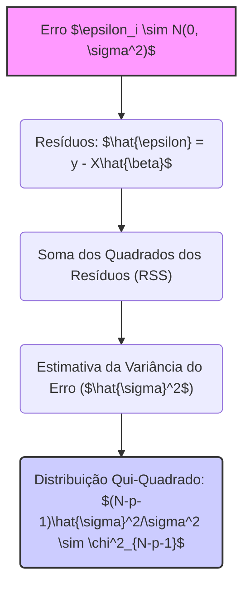
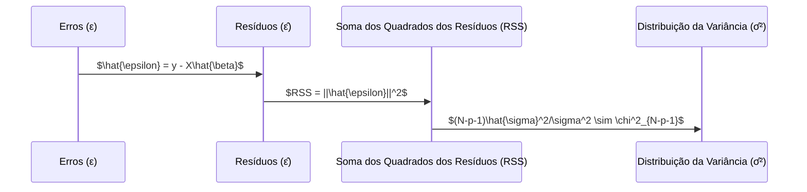

## Distribuição da Variância do Erro: $(N-p-1)\hat{\sigma}^2/\sigma^2 \sim \chi^2_{N-p-1}$ em Modelos de Regressão Linear



### Introdução
A distribuição da variância do erro, expressa pela fórmula $(N-p-1)\hat{\sigma}^2/\sigma^2 \sim \chi^2_{N-p-1}$, é um resultado crucial na teoria da regressão linear, que descreve o comportamento da estimativa da variância do erro ($\sigma^2$) quando a suposição dos erros serem normais é válida. Esta relação estabelece que a variância do erro estimada, multiplicada pelo seu grau de liberdade e dividida pela variância do erro verdadeira, segue uma distribuição qui-quadrado com $N-p-1$ graus de liberdade. Este resultado é fundamental para a construção de testes de hipóteses, intervalos de confiança e inferências estatísticas em modelos lineares. Nesta seção, exploraremos o significado desta fórmula, sua derivação e suas implicações práticas na modelagem.

### Formulação da Distribuição da Variância do Erro

Em um modelo de regressão linear, assumimos que os erros, $\epsilon_i$, seguem uma distribuição normal com média zero e variância constante $\sigma^2$, ou seja, $\epsilon_i \sim \mathcal{N}(0, \sigma^2)$.  A estimativa da variância do erro, denotada por $\hat{\sigma}^2$, é dada por:

$$
\hat{\sigma}^2 = \frac{1}{N-p-1} \sum_{i=1}^N (y_i - \hat{y}_i)^2 = \frac{RSS}{N-p-1}
$$
onde:
-  $N$ é o número de observações.
-  $p$ é o número de preditores.
-  $\hat{y_i}$ é o valor predito pelo modelo para a i-ésima observação.
-   $RSS = \sum_{i=1}^N (y_i - \hat{y}_i)^2$ é a soma dos quadrados dos resíduos.
-   $(N-p-1)$ é o número de graus de liberdade do modelo.

A distribuição da variância do erro é dada por:

$$
\frac{(N-p-1) \hat{\sigma}^2}{\sigma^2} \sim \chi^2_{N-p-1}
$$

onde:
- $\chi^2_{N-p-1}$ denota a distribuição qui-quadrado com $N-p-1$ graus de liberdade.

Esta formulação indica que a estimativa da variância do erro, multiplicada pelos graus de liberdade e dividida pela variância do erro verdadeira, segue uma distribuição qui-quadrado com $N-p-1$ graus de liberdade.

> 💡 **Exemplo Numérico:**
> Vamos considerar um modelo de regressão linear com $N=30$ observações e $p=2$ preditores. Suponha que, após ajustar o modelo aos dados, a soma dos quadrados dos resíduos (RSS) seja igual a 150.  
>
> **Passo 1: Calcular os graus de liberdade:**
> Os graus de liberdade são $N - p - 1 = 30 - 2 - 1 = 27$.
>
> **Passo 2: Calcular a estimativa da variância do erro:**
> $\hat{\sigma}^2 = \frac{RSS}{N-p-1} = \frac{150}{27} \approx 5.56$.
>
> **Passo 3: Interpretação:**
> Se a verdadeira variância do erro ($\sigma^2$) fosse, por exemplo, 5, então a quantidade $\frac{(N-p-1) \hat{\sigma}^2}{\sigma^2} = \frac{27 \times 5.56}{5} \approx 30$ seguiria uma distribuição qui-quadrado com 27 graus de liberdade ($\chi^2_{27}$). Isso nos permite verificar se nossa estimativa da variância do erro é razoável dado o modelo e os dados.

### Derivação da Distribuição Qui-Quadrado

A derivação da distribuição qui-quadrado para a variância do erro envolve os seguintes passos:

1. **Propriedades dos Resíduos:** Assumimos que os erros $\epsilon_i$ são independentes e normalmente distribuídos com média zero e variância $\sigma^2$. A distribuição dos resíduos, $\hat{\epsilon} = y - X\hat{\beta}$, onde $\hat{\beta}$ é a solução de mínimos quadrados,  também está relacionada com uma distribuição normal através da sua relação com o erro $\epsilon$, dado por $\hat{\epsilon} = (I-H)\epsilon$.

2. **Relação com a Soma dos Quadrados dos Resíduos:** A soma dos quadrados dos resíduos, $RSS$, pode ser escrita como:

$$
RSS = ||y - X\hat{\beta}||^2 = \hat{\epsilon}^T \hat{\epsilon}
$$
e pode ser demonstrado que ela está distribuída como uma distribuição qui-quadrado com $N-p-1$ graus de liberdade (veja demonstração abaixo).

3. **Distribuição do Estimador da Variância:** A partir da distribuição da RSS, obtemos que:
$$
\frac{RSS}{\sigma^2} = \frac{\sum_{i=1}^N (y_i - \hat{y}_i)^2}{\sigma^2} \sim \chi^2_{N-p-1}
$$
onde $N-p-1$ representa o grau de liberdade da distribuição.

4. **Distribuição da Variância:** Dividindo por $(N-p-1)$, temos que:
$$
\frac{\sum_{i=1}^N (y_i - \hat{y}_i)^2}{(N-p-1) \sigma^2} = \frac{\hat{\sigma}^2}{\sigma^2}
$$
e portanto
$$
\frac{(N-p-1) \hat{\sigma}^2}{\sigma^2} \sim \chi^2_{N-p-1}
$$
O que demonstra que a distribuição de $\frac{(N-p-1) \hat{\sigma}^2}{\sigma^2}$ segue uma distribuição qui-quadrado com $N-p-1$ graus de liberdade.

**Lemma 28:** Propriedades da Distribuição Qui-Quadrado

A distribuição qui-quadrado, denotada por $\chi^2_k$, é uma distribuição de probabilidade contínua, definida por um único parâmetro, o seu grau de liberdade $k$. As principais propriedades da distribuição qui-quadrado são:
     -  A distribuição qui-quadrado é assimétrica à direita e tem uma média igual a $k$ e variância igual a $2k$.
     - A soma de variáveis aleatórias independentes distribuídas como uma distribuição qui-quadrado, também segue uma distribuição qui-quadrado, com o grau de liberdade sendo a soma dos graus de liberdade.

**Corolário 28:**  O Uso da Distribuição Qui-Quadrado

O Lemma 28 demonstra porque a distribuição qui-quadrado surge na análise de modelos de regressão linear. Como o erro do modelo segue uma distribuição normal, as transformações que levam ao cálculo da variância resultam numa distribuição qui-quadrado com o grau de liberdade apropriado.

> 💡 **Exemplo Numérico:**
> Se tivermos uma distribuição $\chi^2$ com 5 graus de liberdade ($\chi^2_5$), o valor médio dessa distribuição é 5 e a variância é 10. Se tivermos duas variáveis aleatórias independentes $X_1 \sim \chi^2_3$ e $X_2 \sim \chi^2_7$, então a variável $X_1 + X_2$ segue uma distribuição $\chi^2_{10}$. Isto ilustra a propriedade de soma de distribuições qui-quadrado.

###  Interpretação Estatística da Distribuição da Variância
```mermaid
flowchart TD
    A[Estimativa da Variância ($\hat{\sigma}^2$)] --> B{Incerteza da Estimativa};
    B --> C[Intervalos de Confiança];
    B --> D[Testes de Hipóteses];
    B --> E[Análise de Variância (ANOVA)];
    B --> F[Distribuição t-student (Parâmetros)]
    style A fill:#f9f,stroke:#333,stroke-width:2px
    style B fill:#ccf,stroke:#333,stroke-width:2px
```
A distribuição qui-quadrado da variância do erro tem as seguintes implicações:

1.  **Estimativa da Variância:** A distribuição qui-quadrado permite avaliar a incerteza associada à estimativa da variância do erro $\sigma^2$. Ao conhecer a distribuição, podemos criar intervalos de confiança para o valor real de $\sigma^2$.
2.  **Testes de Hipóteses:** A distribuição qui-quadrado é fundamental para a construção de testes de hipóteses sobre a variância do erro, permitindo avaliar a significância da variância observada a partir de um modelo.
3.  **Análise de Variância (ANOVA):** A distribuição qui-quadrado é fundamental na Análise de Variância (ANOVA), onde é utilizada para comparar as variâncias dos resíduos entre diferentes modelos.
4.  **Distribuição t-student**: O erro padrão dos parâmetros é proporcional a $\sqrt{\hat{\sigma}^2}$, e, quando a distribuição do erro é normal, o quociente entre o estimador do parâmetro $\beta_j$ e seu erro padrão segue uma distribuição t-student com $N-p-1$ graus de liberdade. Isso é importante para a construção de testes de hipóteses, e intervalos de confiança para parâmetros.

> 💡 **Exemplo Numérico:**
> Suponha que, em um modelo de regressão com 25 observações e 3 preditores, obtivemos uma estimativa da variância do erro $\hat{\sigma}^2 = 4$. Assumindo que a verdadeira variância do erro $\sigma^2$ seja desconhecida, podemos usar a distribuição qui-quadrado para construir um intervalo de confiança para $\sigma^2$. Os graus de liberdade são $N - p - 1 = 25 - 3 - 1 = 21$. Usando uma tabela de distribuição qui-quadrado, podemos encontrar os valores críticos para um intervalo de confiança de 95%. Se esses valores forem, por exemplo, $\chi^2_{0.025, 21} = 10.28$ e $\chi^2_{0.975, 21} = 35.48$, então podemos construir o intervalo de confiança para $\sigma^2$ como:
>
> $$
> \frac{(N-p-1)\hat{\sigma}^2}{\chi^2_{0.975, 21}} \leq \sigma^2 \leq \frac{(N-p-1)\hat{\sigma}^2}{\chi^2_{0.025, 21}}
> $$
> $$
> \frac{21 \times 4}{35.48} \leq \sigma^2 \leq \frac{21 \times 4}{10.28}
> $$
> $$
> 2.37 \leq \sigma^2 \leq 8.17
> $$
>
> Isso significa que, com 95% de confiança, o valor real da variância do erro está entre 2.37 e 8.17.

A distribuição da variância do erro, juntamente com a distribuição normal dos estimadores dos parâmetros, formam a base da inferência estatística na regressão linear, e permitem avaliar a confiabilidade e estabilidade dos resultados.

> ⚠️ **Nota Importante**: A distribuição da variância do erro, $(N-p-1)\hat{\sigma}^2/\sigma^2$, segue uma distribuição qui-quadrado com $N-p-1$ graus de liberdade, uma consequência das hipóteses estatísticas sobre o erro. [^47].

> ❗ **Ponto de Atenção**: O termo N-p-1 no denominador garante que a estimativa da variância seja não viesada e tenha o grau de liberdade correto para a aplicação de testes estatísticos. [^47].
 
> ✔️ **Destaque**: A distribuição qui-quadrado do estimador da variância do erro é essencial para testes de hipóteses e intervalos de confiança, e para a avaliação estatística dos modelos. [^47].

### Conclusão
A distribuição qui-quadrado da estimativa da variância do erro, expressa como $\frac{(N-p-1) \hat{\sigma}^2}{\sigma^2} \sim \chi^2_{N-p-1}$, é um resultado central na inferência estatística de modelos de regressão linear. A distribuição qui-quadrado surge da suposição de erros aleatórios com distribuição normal, e permite a construção de intervalos de confiança para a variância do erro, o que é fundamental para a avaliação da qualidade e para a interpretação dos resultados de modelos lineares. A compreensão da derivação, bem como o significado prático da distribuição qui-quadrado, são importantes na modelagem estatística.

### Referências
[^47]: "The N-p-1 rather than N in the denominator makes 6 an unbiased estimate of σ2: E(2) = σ2." *(Trecho de Linear Methods for Regression)*
[^10]: "The most popular estimation method is least squares, in which we pick the coefficients β = (β0, β1, ..., βp)T to minimize the residual sum of squares" *(Trecho de Linear Methods for Regression)*
