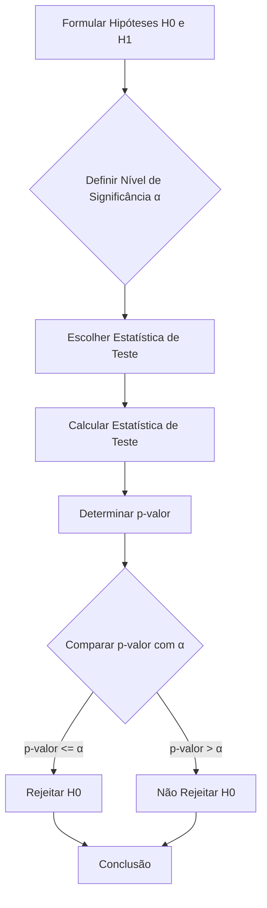
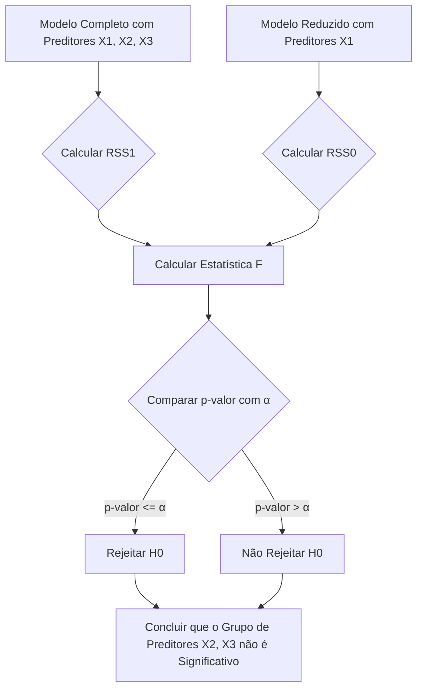

## Testes de Hipóteses em Modelos de Regressão Linear: Avaliando a Significância dos Parâmetros

### Introdução
Os **testes de hipóteses** são procedimentos estatísticos utilizados para avaliar a validade das suposições sobre os parâmetros em um modelo estatístico, através de dados amostrais. No contexto da regressão linear, os testes de hipóteses permitem avaliar a significância estatística de cada preditor, assim como a significância de conjuntos de preditores, indicando quais variáveis tem um efeito relevante na resposta. Nesta seção, exploraremos o processo geral de testes de hipóteses, os testes t para avaliar parâmetros individuais, o teste F para avaliar grupos de parâmetros, e a interpretação prática dos resultados no contexto da regressão linear.

### O Processo de Teste de Hipóteses
Os testes de hipóteses envolvem a formulação de uma hipótese nula ($H_0$), que é uma afirmação sobre o valor dos parâmetros que se pretende avaliar, e de uma hipótese alternativa ($H_1$), que representa a alternativa à hipótese nula. Os passos para um teste de hipóteses são:
    1.  **Formulação das Hipóteses:** Definição das hipóteses nula e alternativa, com o objetivo de testar a significância dos parâmetros do modelo, ou de grupos de parâmetros.
    2.  **Escolha de um Nível de Significância:** Definição do nível de significância $\alpha$, que representa a probabilidade de rejeitar a hipótese nula quando ela é verdadeira (erro Tipo I). Valores comuns para $\alpha$ são 0.05 ou 0.01.
    3.  **Escolha da Estatística de Teste:** Escolha da estatística de teste apropriada, que tem uma distribuição conhecida, e que permite avaliar o quão longe da hipótese nula estão as estimativas obtidas.
    4. **Cálculo da Estatística de Teste:** Cálculo da estatística de teste usando os dados amostrais.
    5. **Determinação do p-valor:** Cálculo do p-valor, que representa a probabilidade de observar um valor da estatística de teste tão ou mais extremo que o observado, assumindo que a hipótese nula seja verdadeira.
    6. **Decisão:** Comparação do p-valor com o nível de significância $\alpha$. Se o p-valor for menor ou igual a $\alpha$, a hipótese nula é rejeitada. Caso contrário, não há evidência estatística para rejeitar a hipótese nula.

### Testes T para Parâmetros Individuais
O teste *t* é usado para avaliar se um parâmetro individual $\beta_j$ é significativamente diferente de zero, ou seja, se a variável preditora associada $X_j$ tem um efeito estatisticamente relevante na variável resposta Y [^48]. As hipóteses são:
 -  **Hipótese Nula (H₀):** $\beta_j = 0$, o que implica que a variável $X_j$ não tem efeito na variável resposta.
-  **Hipótese Alternativa (H₁):** $\beta_j \ne 0$, o que implica que a variável $X_j$ tem um efeito na variável resposta.
A estatística de teste é calculada usando o valor do estimador do parâmetro $\hat{\beta_j}$ e o seu erro padrão, $\hat{se}(\hat{\beta_j})$:

$$
t_j = \frac{\hat{\beta_j}}{\hat{se}(\hat{\beta_j})}
$$

onde:
-  $\hat{\beta_j}$ é a estimativa do parâmetro $\beta_j$ usando o método de mínimos quadrados.
-  $\hat{se}(\hat{\beta_j})$ é o erro padrão do estimador $\hat{\beta_j}$, que pode ser obtido a partir da matriz de variância-covariância dos parâmetros, e é a raiz quadrada do j-ésimo elemento da diagonal de  $(X^T X)^{-1}\hat{\sigma}^2$.
A estatística de teste $t_j$ segue uma distribuição t-Student com $N-p-1$ graus de liberdade (onde N é o número de observações, e p é o número de preditores). O p-valor, baseado na distribuição t-Student, é calculado a partir da estatística $t_j$ e comparado com o nível de significância $\alpha$.

Se o valor absoluto de $t_j$ é grande (e, consequentemente, o p-valor é pequeno), a hipótese nula é rejeitada e conclui-se que o preditor $X_j$ é estatisticamente significativo no modelo.

> 💡 **Exemplo Numérico:**
>
> Suponha que temos um modelo de regressão linear com uma variável preditora ($X$) e uma variável resposta ($Y$). Após ajustar o modelo, obtemos os seguintes resultados:
>
> - Estimativa do coeficiente: $\hat{\beta_1} = 2.5$
> - Erro padrão do coeficiente: $\hat{se}(\hat{\beta_1}) = 0.8$
> - Número de observações: $N = 30$
> - Número de preditores: $p = 1$
>
> Primeiro, calculamos a estatística *t*:
>
> $t_1 = \frac{2.5}{0.8} = 3.125$
>
> Em seguida, determinamos os graus de liberdade:
>
> $df = N - p - 1 = 30 - 1 - 1 = 28$
>
> Usando uma distribuição t-Student com 28 graus de liberdade, podemos encontrar o p-valor associado a essa estatística *t*. Suponha que o p-valor seja 0.004.
>
> Se definirmos um nível de significância de $\alpha = 0.05$, como o p-valor (0.004) é menor que $\alpha$ (0.05), rejeitamos a hipótese nula ($H_0: \beta_1 = 0$). Portanto, concluímos que o preditor $X$ é estatisticamente significativo no modelo. Isso significa que há evidência estatística para afirmar que a variável preditora X tem um efeito na variável resposta Y.

### Testes F para Grupos de Parâmetros

O teste *F* é utilizado para avaliar a significância de um grupo de parâmetros conjuntamente [^48]. Ele é usado para avaliar a significância de um conjunto de preditores, ou, equivalentemente, para avaliar se um modelo reduzido (sem o grupo de preditores) ajusta-se tão bem aos dados como um modelo completo. As hipóteses podem ser escritas como:
    - **Hipótese Nula (H₀):** $\beta_j = 0$ para todo j em um determinado grupo, ou seja o grupo de preditores não contribui para o modelo.
    - **Hipótese Alternativa (H₁):** Pelo menos um $\beta_j$ é diferente de zero dentro do grupo, indicando que o grupo de preditores contribui para o modelo.

A estatística de teste $F$ é calculada usando as somas dos quadrados dos resíduos de dois modelos: um modelo com todos os preditores ($RSS_1$) e um modelo sem os preditores do grupo a ser avaliado ($RSS_0$). O teste compara a diferença entre os modelos, considerando que modelos mais complexos (com mais preditores) tem tendência a ter um RSS menor. A estatística F é dada por:

$$
F = \frac{(RSS_0 - RSS_1)/(p_1 - p_0)}{RSS_1/(N - p_1 -1)}
$$
onde:
- $RSS_0$ é a soma dos quadrados dos resíduos do modelo reduzido (sem o grupo de preditores).
- $RSS_1$ é a soma dos quadrados dos resíduos do modelo completo (com todos os preditores).
-  $p_1$ é o número de preditores do modelo completo.
-  $p_0$ é o número de preditores do modelo reduzido.
- $N$ é o número de observações.

A estatística $F$ segue uma distribuição $F$ com $p_1-p_0$ e $N-p_1-1$ graus de liberdade. Se a estatística $F$ for suficientemente grande, e o p-valor for menor que o nível de significância $\alpha$, a hipótese nula é rejeitada e concluímos que o grupo de preditores é estatisticamente significativo.
O teste F generaliza a análise de variância (ANOVA) para modelos com vários preditores.

> 💡 **Exemplo Numérico:**
>
> Suponha que temos um modelo de regressão linear com três preditores ($X_1$, $X_2$ e $X_3$) e uma variável resposta ($Y$). Queremos testar se o grupo de preditores ($X_2$ e $X_3$) contribui significativamente para o modelo.
>
> Ajustamos dois modelos:
>
> 1.  **Modelo Completo:** Inclui $X_1$, $X_2$ e $X_3$. Obtemos $RSS_1 = 150$.
> 2.  **Modelo Reduzido:** Inclui apenas $X_1$. Obtemos $RSS_0 = 200$.
>
> Temos também:
>
> - Número de observações: $N = 50$
> - Número de preditores no modelo completo: $p_1 = 3$
> - Número de preditores no modelo reduzido: $p_0 = 1$
>
> Agora, calculamos a estatística *F*:
>
> $F = \frac{(200 - 150)/(3 - 1)}{150/(50 - 3 - 1)} = \frac{50/2}{150/46} = \frac{25}{3.26} \approx 7.67$
>
> Os graus de liberdade são:
>
> - $df_1 = p_1 - p_0 = 3 - 1 = 2$
> - $df_2 = N - p_1 - 1 = 50 - 3 - 1 = 46$
>
> Usando uma distribuição F com 2 e 46 graus de liberdade, podemos encontrar o p-valor associado a essa estatística *F*. Suponha que o p-valor seja 0.001.
>
> Se definirmos um nível de significância de $\alpha = 0.05$, como o p-valor (0.001) é menor que $\alpha$ (0.05), rejeitamos a hipótese nula ($H_0: \beta_2 = \beta_3 = 0$). Portanto, concluímos que o grupo de preditores ($X_2$ e $X_3$) é estatisticamente significativo no modelo. Isso significa que o modelo que inclui $X_2$ e $X_3$ ajusta melhor aos dados do que o modelo que inclui apenas $X_1$.

**Lemma 29:** Distribuição da Estatística T

Se as suposições do modelo de regressão linear (linearidade, erros gaussianos independentes com média zero e variância constante) forem válidas, então a estatística t para o teste de parâmetros individuais segue uma distribuição t-Student com $N-p-1$ graus de liberdade.

**Prova do Lemma 29:**
A estatística t é definida como $t_j = \frac{\hat{\beta_j}}{\hat{se}(\hat{\beta_j})}$, onde $\hat{se}(\hat{\beta_j})=\sqrt{var(\hat{\beta_j})}$. Sob as suposições do modelo linear, $\hat{\beta_j}$ tem distribuição normal e $\hat{se}(\hat{\beta_j})^2 = \frac{RSS}{N-p-1} (X^TX)_{jj}^{-1}$ (onde $(X^TX)_{jj}^{-1}$ é a j-ésima componente diagonal da matriz $(X^TX)^{-1}$). Então, $\frac{\hat{\beta_j}-\beta_j}{\hat{se}(\hat{\beta_j})}$ segue uma distribuição t-student com N-p-1 graus de liberdade, o que demonstra que sob a hipótese nula de $\beta_j =0$, a estatística $t_j$ segue a distribuição definida.
$\blacksquare$

**Corolário 29:**  Distribuição da Estatística F

O Lemma 29 é consistente com o facto da estatística F ser a razão de duas distribuições qui-quadrado independentes, e por este motivo segue uma distribuição F.
Em outras palavras, o teste F também se baseia nas propriedades da distribuição normal do erro, que por sua vez resulta numa estatística com distribuição bem conhecida.

> ⚠️ **Nota Importante**: O teste t avalia a significância de parâmetros individuais, enquanto o teste F avalia a significância de grupos de parâmetros.

> ❗ **Ponto de Atenção**:  A estatística t segue uma distribuição t-Student, e a estatística F segue uma distribuição F sob as suposições do modelo.
 
> ✔️ **Destaque**: O p-valor, que é derivado das distribuições t e F, mede a probabilidade de observar valores das estatísticas de teste mais extremos que os observados se a hipótese nula fosse verdadeira.

### Interpretação Prática dos Resultados dos Testes de Hipóteses

Em cenários de regressão linear, os testes de hipóteses auxiliam a determinar quais preditores são relevantes para o modelo.
- Se o teste *t* revela que o coeficiente de uma variável é estatisticamente significativo, então podemos concluir que essa variável tem um impacto na variável de resposta, considerando a significância estabelecida.
- Se o teste *F* revela que um grupo de variáveis é estatisticamente significativo, então podemos concluir que o modelo com todos os preditores ajusta melhor aos dados do que o modelo que exclui as variáveis do grupo avaliado.

É importante enfatizar que o conceito de "significância estatística" não implica que um preditor seja a causa da resposta. Ela indica apenas que existe uma relação entre o preditor e a resposta que não é explicada pelo acaso. A interpretação de quais preditores são relevantes deve considerar outros fatores, como o conhecimento do domínio, a relação entre os preditores e a relação com a resposta. A escolha de quais preditores usar depende do objetivo final, da performance do modelo, e do nível de interpretabilidade desejado.
A utilização conjunta de métodos de seleção de variáveis e regularização e testes de hipótese fornece uma abordagem robusta para selecionar modelos que capturem as relações mais relevantes nos dados.

### Conclusão

Os testes de hipóteses são ferramentas fundamentais na modelagem de regressão linear, que permitem avaliar a significância estatística de parâmetros individuais e de grupos de preditores. Ao compreender os passos do processo de teste de hipóteses, as propriedades das distribuições t e F, e ao entender a relação entre significância e causalidade, podemos construir modelos mais robustos e interpretáveis, e também obter uma melhor compreensão dos dados que são modelados.

### Referências

[^48]:  "To test the hypothesis that a particular coefficient βj = 0, we form the standardized coefficient or Z-score" *(Trecho de Linear Methods for Regression)*
[^1]:  "A linear regression model assumes that the regression function E(Y|X) is linear in the inputs X1,..., Xp." *(Trecho de Linear Methods for Regression)*
[^47]: "The N-p-1 rather than N in the denominator makes ˆσ2 an unbiased estimate of σ2: E(ˆσ2) = σ2." *(Trecho de Linear Methods for Regression)*
