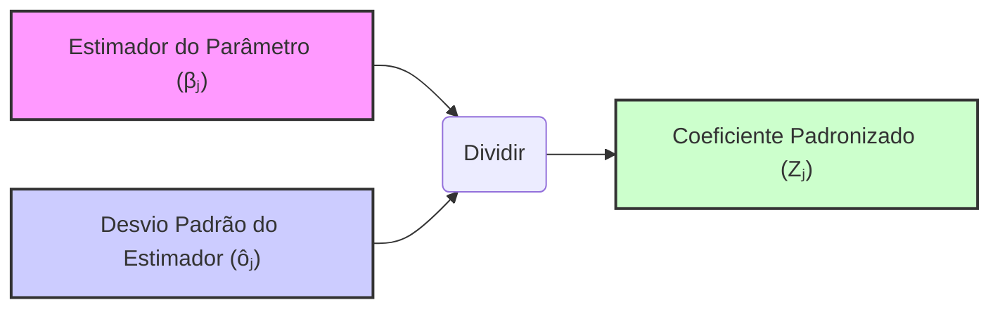
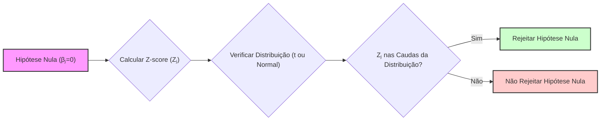
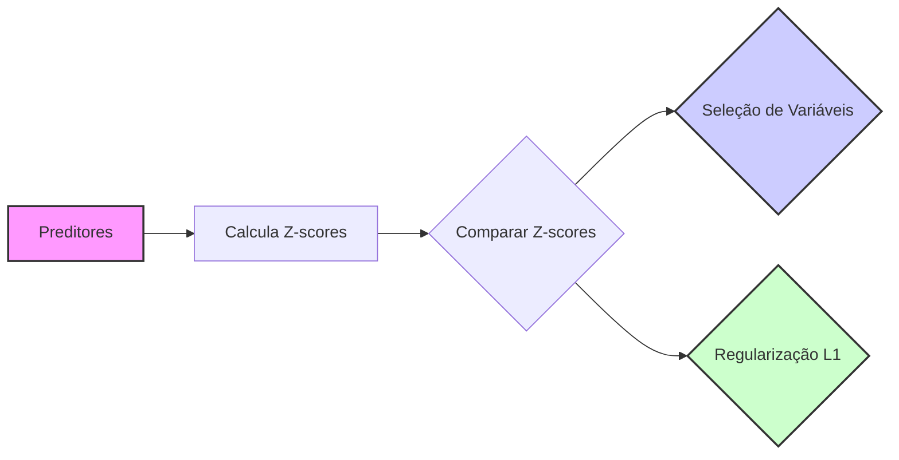

## Coeficiente Padronizado (Z-score): $Z_j = \beta_j/\hat{\sigma}_j$ na Regressão Linear

### Introdução

O **coeficiente padronizado**, também conhecido como *Z-score*, dado pela fórmula **$Z_j = \beta_j/\hat{\sigma}_j$**, é uma medida crucial na análise de modelos de regressão linear, utilizada para avaliar a significância estatística de um parâmetro individual ($\beta_j$) em relação à sua incerteza ou desvio padrão ($\hat{\sigma}_j$). Ao padronizar os coeficientes, é possível comparar a importância relativa dos preditores, mesmo quando eles estão em escalas diferentes. Esta seção explorará em detalhe a definição do coeficiente padronizado, sua interpretação estatística, e sua importância no contexto da regressão linear e análise de dados.

### Definição e Cálculo do Coeficiente Padronizado (Z-score)

Em modelos de regressão linear, o coeficiente padronizado (Z-score) é uma estatística que é utilizada para avaliar a significância de um preditor individual, e é definido como:

$$
Z_j = \frac{\hat{\beta}_j}{\hat{\sigma}_j}
$$
onde:
-   $Z_j$ é o Z-score associado ao j-ésimo parâmetro $\beta_j$.
-   $\hat{\beta}_j$ é a estimativa de mínimos quadrados do j-ésimo parâmetro.
-   $\hat{\sigma}_j$ é o erro padrão do estimador $\hat{\beta}_j$, ou seja, a raiz quadrada da variância do parâmetro.

O erro padrão $\hat{\sigma}_j$ é dado pela raiz quadrada do j-ésimo elemento da diagonal da matriz de variância-covariância dos parâmetros:
$$ Var(\hat{\beta}) = (X^T X)^{-1} \hat{\sigma}^2 $$
onde:
    -   $X$ é a matriz de design.
   - $\hat{\sigma}^2$ é a estimativa da variância do erro, dada por $\frac{1}{N-p-1} \sum_{i=1}^N (y_i - \hat{y}_i)^2$, e $N-p-1$ são os graus de liberdade do modelo.

O Z-score padroniza o parâmetro $\hat{\beta}_j$ em termos de unidades de desvio padrão. Isso permite comparar a significância de preditores que estão em escalas diferentes, e avaliar o quanto o valor do parâmetro se desvia de zero (a hipótese nula) em termos do seu erro padrão.

> 💡 **Exemplo Numérico:**
>
> Vamos considerar um modelo de regressão linear simples com dois preditores, $x_1$ e $x_2$, e uma variável resposta $y$.  Suponha que, após ajustar o modelo aos dados, obtivemos as seguintes estimativas dos parâmetros e seus erros padrão:
>
> -   $\hat{\beta}_1 = 2.5$, $\hat{\sigma}_1 = 0.8$ (para o preditor $x_1$)
> -   $\hat{\beta}_2 = -1.2$, $\hat{\sigma}_2 = 0.3$ (para o preditor $x_2$)
>
> Os Z-scores para cada preditor são calculados como:
>
> -   $Z_1 = \frac{2.5}{0.8} = 3.125$
> -   $Z_2 = \frac{-1.2}{0.3} = -4$
>
> O Z-score para $x_1$ é 3.125, o que indica que o coeficiente estimado $\hat{\beta}_1$ está 3.125 desvios padrão distante de zero. Da mesma forma, o Z-score para $x_2$ é -4, indicando que $\hat{\beta}_2$ está 4 desvios padrão abaixo de zero.  Comparando os valores absolutos dos Z-scores, podemos concluir que o preditor $x_2$ tem uma influência estatisticamente maior no modelo do que $x_1$, pois seu Z-score está mais distante de zero em termos de desvios padrão.

### Interpretação Estatística do Z-score

O Z-score tem uma interpretação estatística importante:
    1.  **Medida da Significância:** O Z-score mede o número de desvios padrão que o estimador $\hat{\beta}_j$ está distante de zero, assumindo que o parâmetro verdadeiro $\beta_j = 0$, que é a hipótese nula.
    2. **Distribuição sob a Hipótese Nula**: Sob a hipótese nula de que $\beta_j = 0$, e se o número de observações for grande, então a estatística $Z_j$ segue uma distribuição normal padrão, $\mathcal{N}(0, 1)$, ou em amostras pequenas, uma distribuição t-Student com graus de liberdade $N-p-1$ [^48].
   3. **Decisão**: Usamos os quantis da distribuição t-student, ou da normal para determinar se rejeitamos ou não a hipótese nula. Se o valor absoluto de $Z_j$ é grande, ou seja o valor está nas caudas da distribuição, e, portanto o p-valor é pequeno, então temos evidências estatísticas para rejeitar a hipótese nula, o que significa que o parâmetro $\beta_j$ é estatisticamente significativo. Em amostras pequenas, a distribuição t-student difere da distribuição normal, e os testes usando a distribuição t são mais apropriados.
   4.  **Comparação entre Preditores:**  Ao padronizar os coeficientes, podemos comparar a significância relativa de diferentes preditores. Preditores com Z-scores maiores indicam uma maior importância para a modelagem, já que seu coeficiente é mais distante de zero em relação à sua incerteza.

A interpretação do Z-score permite que os parâmetros sejam expressos em uma escala relativa, que é particularmente útil quando os preditores estão em escalas diferentes.

**Lemma 25:**  Relação entre o Z-score e a Distribuição t-Student

Quando os erros do modelo seguem uma distribuição normal, o Z-score para o teste de parâmetros individuais segue uma distribuição t-Student com $N-p-1$ graus de liberdade.  Para amostras grandes, a distribuição t-Student se aproxima da distribuição normal padrão.

**Prova do Lemma 25:**
Sob a hipótese nula de que o coeficiente $\beta_j = 0$, a estatística
$$
t_j = \frac{\hat{\beta}_j}{\hat{se}(\hat{\beta}_j)}
$$
segue uma distribuição t-Student com $N-p-1$ graus de liberdade. Em amostras grandes a distribuição t-Student converge para a normal padrão, ou seja  $t_j \sim N(0, 1)$.  O Z-score, definido como  $Z_j = \frac{\hat{\beta}_j}{\hat{\sigma}_j}$, é uma aproximação da estatística t onde a variância do erro é substituída por uma estimativa. Em grandes amostras, essa aproximação não é problemática já que a estimativa da variância converge para a sua esperança, e também a distribuição t-Student se aproxima da distribuição normal.
A distribuição t-Student surge porque o erro padrão do parâmetro estimado  $\hat{se}(\hat{\beta_j})$ é uma estimativa, que depende da estimativa da variância do erro, $ \hat{\sigma}^2$. $\blacksquare$

**Corolário 25:** Uso da Normal para Testes de Hipótese

Para amostras grandes, a distribuição t-Student se aproxima da distribuição normal, e neste caso, a distribuição do Z-score também se aproxima da distribuição normal padrão, $\mathcal{N}(0, 1)$. Em situações onde o número de observações é grande e, por exemplo,  se o valor absoluto do Z-score for maior que 1.96, então rejeitamos a hipótese nula com um nível de significância $\alpha = 0.05$.

> 💡 **Exemplo Numérico:**
>
> Continuando com o exemplo anterior, vamos supor que o número de observações no nosso dataset é $N=100$, e que temos $p=2$ preditores. Portanto, os graus de liberdade são $N-p-1 = 100 - 2 - 1 = 97$.  Como o número de graus de liberdade é grande, podemos aproximar a distribuição t-Student pela distribuição normal.
>
> Para um nível de significância $\alpha = 0.05$, o valor crítico para um teste bicaudal é aproximadamente 1.96.  Como $|Z_1| = 3.125 > 1.96$ e $|Z_2| = 4 > 1.96$, rejeitamos a hipótese nula para ambos os preditores. Isto significa que ambos os coeficientes são estatisticamente significativos e contribuem para o modelo.
>
> Se tivéssemos um Z-score de 1.5, não rejeitaríamos a hipótese nula, ou seja, o preditor não seria considerado estatisticamente significativo ao nível de 5%.

### A Importância do Z-score na Modelagem de Regressão Linear

O Z-score desempenha um papel fundamental na modelagem de regressão linear:

1.  **Avaliação da Significância:** O Z-score permite avaliar a significância estatística de cada preditor, ou seja, o quanto ele contribui para explicar a variação na resposta.
2.  **Base para Testes de Hipóteses:** A distribuição do Z-score permite realizar testes de hipóteses sobre a relevância de cada parâmetro, avaliando se o valor do parâmetro é compatível com a hipótese nula de que o parâmetro seja igual a zero.
3.  **Comparação de Preditores:**  O Z-score permite comparar a significância de preditores que estão em escalas diferentes.
4.  **Seleção de Variáveis:** Em métodos de seleção de variáveis, como *backward stepwise*, o Z-score é utilizado para remover os preditores com menor significância do modelo.
5.  **Regularização e Sparsity:**  A regularização, particularmente a L1 (Lasso), utiliza um parâmetro de regularização $\lambda$ para controlar o grau de esparsidade do modelo. Em modelos esparsos, os coeficientes associados a preditores irrelevantes tendem a ter Z-scores menores.

> 💡 **Exemplo Numérico:**
>
> Suponha que estamos comparando dois modelos de regressão. O primeiro modelo usa os preditores $x_1$ e $x_2$ (como no exemplo anterior), e o segundo modelo usa os preditores $x_3$ e $x_4$.  Após ajustar os modelos, obtemos os seguintes resultados:
>
> **Modelo 1:**
> -   $Z_1 = 3.125$
> -   $Z_2 = -4$
>
> **Modelo 2:**
> -   $Z_3 = 0.8$
> -   $Z_4 = 2.5$
>
> Comparando os Z-scores, observamos que os preditores $x_1$ e $x_2$ no modelo 1 têm Z-scores maiores em valor absoluto do que o preditor $x_3$ no modelo 2.  Isto sugere que $x_1$ e $x_2$ são mais importantes para explicar a variabilidade da variável resposta do que $x_3$.  O preditor $x_4$ tem um Z-score relativamente alto, indicando que também é importante no modelo 2.
>
> Se estivéssemos usando um método de seleção de variáveis, como o *backward stepwise*, removeríamos o preditor $x_3$ antes de remover os outros preditores, pois ele tem o menor Z-score (em valor absoluto) entre os 4 preditores.

A utilização do Z-score, juntamente com outros métodos e critérios, permite a construção de modelos mais precisos, robustos e interpretáveis.

> ⚠️ **Nota Importante**: O Z-score é calculado dividindo o coeficiente do modelo pelo seu erro padrão e avalia o quanto o estimador está distante de zero (a hipótese nula), em unidades de erro padrão.

> ❗ **Ponto de Atenção**: O Z-score, sob a hipótese nula, segue uma distribuição t-Student com N-p-1 graus de liberdade, que pode ser aproximada pela distribuição normal quando o número de observações é grande.
 
> ✔️ **Destaque**:  O Z-score auxilia na avaliação da significância individual dos parâmetros de um modelo de regressão linear, e permite comparar a importância relativa de preditores com escalas diferentes.

### Conclusão

O coeficiente padronizado (Z-score), expresso pela fórmula $Z_j = \frac{\hat{\beta}_j}{\hat{\sigma}_j}$, é uma ferramenta fundamental na modelagem de regressão linear, que permite avaliar a significância estatística dos parâmetros do modelo, testar hipóteses, comparar preditores e determinar a relevância das variáveis preditoras. Ao usar o Z-score, o modelador tem um guia sobre a influência dos preditores no modelo, e pode aplicar métodos de seleção e regularização para obter modelos precisos e interpretáveis.

### Referências
[^48]: "To test the hypothesis that a particular coefficient $\beta_j = 0$, we form the standardized coefficient or Z-score" *(Trecho de Linear Methods for Regression)*
[^10]: "The most popular estimation method is least squares, in which we pick the coefficients $\beta = (\beta_0, \beta_1, \ldots, \beta_p)^T$ to minimize the residual sum of squares" *(Trecho de Linear Methods for Regression)*
