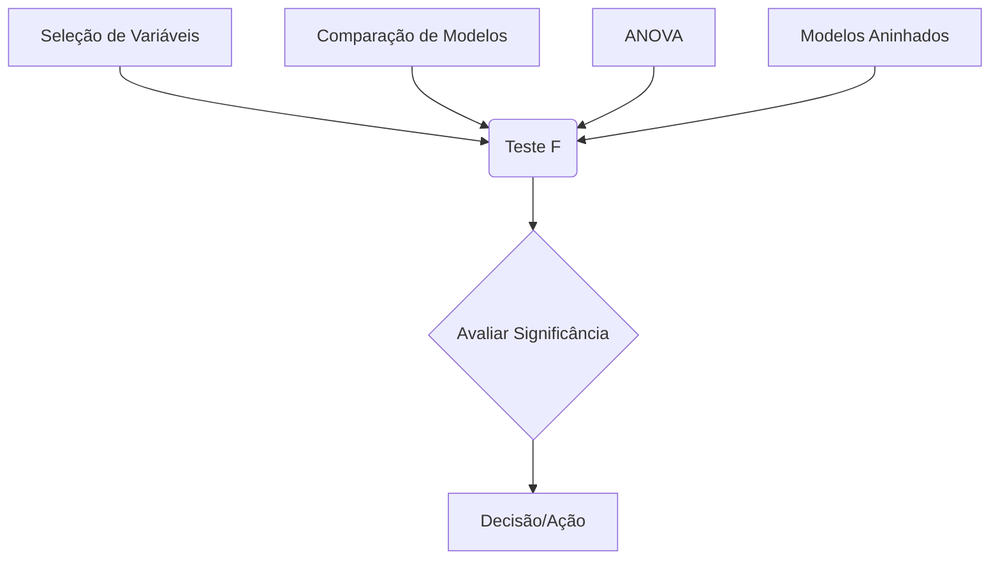

## Estatística F: $F = (RSS_0 - RSS_1) / (p_1 - p_0) / (RSS_1 / (N - p_1 - 1))$ em Modelos de Regressão Linear

```mermaid
flowchart TD
    A["Modelo Reduzido"] -->|RSS0| B(Calcular Diferença do RSS)
    C["Modelo Completo"] -->|RSS1| B
    B -->|RSS0 - RSS1| D{Normalizar}
    D --> |$(RSS_0 - RSS_1) / (p_1 - p_0)$| E[Numerador da Estatística F]
    C -->|RSS1| F{Normalizar}
    F -->|$RSS_1 / (N - p_1 - 1)$| G[Denominador da Estatística F]
    E --> H[Estatística F = Numerador / Denominador]
    G --> H
    H --> I{Comparar com Distribuição F}
    I --> J[Avaliação da Significância]
```

### Introdução

A **estatística F**, definida pela fórmula **$F = (RSS_0 - RSS_1) / (p_1 - p_0) / (RSS_1 / (N - p_1 - 1))$**, é uma ferramenta essencial na análise de modelos de regressão linear, utilizada para avaliar a significância estatística de um grupo de preditores [^48]. Ao comparar o ajuste de um modelo completo com um modelo reduzido (que exclui um grupo de preditores), o teste F determina se a inclusão desse grupo de preditores é estatisticamente significativa para o modelo, quantificando a mudança na soma dos quadrados dos resíduos devido à adição ou remoção de preditores. Nesta seção, vamos explorar a formulação matemática da estatística F, sua interpretação, e suas aplicações na seleção de modelos e na avaliação da importância de grupos de preditores em modelos de regressão linear.

### Formulação Matemática da Estatística F

A estatística F é utilizada para comparar o ajuste de dois modelos de regressão linear: um modelo completo e um modelo reduzido [^48]. O modelo completo inclui todos os preditores relevantes, e o modelo reduzido exclui um subconjunto dos preditores. A estatística F é definida como:

$$
F = \frac{(RSS_0 - RSS_1)/(p_1 - p_0)}{RSS_1/(N - p_1 - 1)}
$$

onde:

-   $RSS_0$ é a soma dos quadrados dos resíduos para o modelo reduzido.
-   $RSS_1$ é a soma dos quadrados dos resíduos para o modelo completo.
-   $p_1$ é o número de parâmetros do modelo completo, incluindo o *intercept*.
-   $p_0$ é o número de parâmetros do modelo reduzido, incluindo o *intercept*.
-   $N$ é o número de observações.
-   $N - p_1 - 1$ são os graus de liberdade do modelo completo.
-  $p_1 - p_0$ é a diferença de graus de liberdade entre o modelo completo e o reduzido.

O numerador da estatística $F$, $(RSS_0 - RSS_1)/(p_1 - p_0)$, representa a variação no RSS devido à inclusão ou remoção do grupo de preditores que está sendo testado, normalizado pelo número de parâmetros adicionais. O denominador, $RSS_1/(N - p_1 - 1)$, representa uma estimativa não viesada da variância do erro do modelo completo, que é usado como um termo de normalização.
Se o grupo de preditores adicionados (ou removidos) tem pouca influência no modelo, então a diferença $RSS_0 - RSS_1$ será pequena, e a estatística $F$ também será pequena.

> 💡 **Exemplo Numérico:**
>
> Vamos considerar um exemplo com dados simulados para ilustrar o cálculo da estatística F. Suponha que temos um conjunto de dados com $N = 100$ observações. O modelo completo inclui três preditores (incluindo o intercepto, $p_1 = 4$) e o modelo reduzido inclui apenas um preditor (o intercepto, $p_0 = 2$).
>
> Após ajustar os modelos aos dados, obtemos os seguintes resultados:
>
> - $RSS_0$ (modelo reduzido) = 150
> - $RSS_1$ (modelo completo) = 100
>
> Usando a fórmula da estatística F:
>
> $F = \frac{(150 - 100)/(4 - 2)}{100/(100 - 4 - 1)} = \frac{50/2}{100/95} = \frac{25}{1.053} \approx 23.74$
>
> Este valor de F = 23.74 será comparado com a distribuição F para determinar o p-valor.
>
> ```python
> import numpy as np
> from scipy.stats import f
>
> # Dados do exemplo
> rss_0 = 150
> rss_1 = 100
> p1 = 4
> p0 = 2
> N = 100
>
> # Cálculo da estatística F
> F = ((rss_0 - rss_1) / (p1 - p0)) / (rss_1 / (N - p1 - 1))
> print(f"Estatística F: {F:.2f}")
>
> # Cálculo do p-valor
> df1 = p1 - p0  # Graus de liberdade do numerador
> df2 = N - p1 - 1 # Graus de liberdade do denominador
> p_valor = 1 - f.cdf(F, df1, df2)
> print(f"P-valor: {p_valor:.4f}")
>
> ```
>
> Neste caso, o p-valor é muito baixo, indicando que o modelo completo é significativamente melhor que o modelo reduzido.

### Interpretação Estatística da Estatística F

A estatística F quantifica a melhoria relativa no ajuste de um modelo ao incluir ou excluir um grupo de preditores. Ela tem as seguintes interpretações estatísticas:
    1. **Comparação de Ajuste:**  A estatística $F$ compara o ajuste de dois modelos, onde $RSS_0$ e $RSS_1$ quantificam o erro nos modelos reduzido e completo, respectivamente.
   2. **Distribuição F:** Se a hipótese nula, ou seja, que o grupo de preditores não contribui para o modelo, é verdadeira, então a estatística $F$ segue uma distribuição $F$ com $p_1 - p_0$ e $N - p_1 - 1$ graus de liberdade. A distribuição F descreve o comportamento de uma razão entre duas distribuições qui-quadrado.
   3. **Teste de Hipóteses:** A estatística $F$ é utilizada para realizar testes de hipóteses sobre a significância de grupos de preditores. O p-valor, calculado a partir da distribuição F, quantifica a probabilidade de observar um valor da estatística $F$ tão ou mais extremo que o valor obtido, assumindo que a hipótese nula é verdadeira.
   4. **Rejeição da Hipótese Nula:** Se o p-valor for menor que um determinado nível de significância $\alpha$, por exemplo 0.05, então a hipótese nula é rejeitada e conclui-se que o grupo de preditores tem efeito na resposta. Um valor alto da estatística F, e um valor baixo do p-valor, indicam que o modelo com todos os preditores ajusta significativamente melhor os dados do que o modelo que exclui o grupo de preditores em teste.

> 💡 **Exemplo Numérico:**
>
> Continuando com o exemplo anterior, onde calculamos F = 23.74, e temos $p_1 - p_0 = 2$ e $N - p_1 - 1 = 95$ graus de liberdade. Usando a distribuição F, podemos calcular o p-valor para este teste.
>
>  O p-valor obtido (usando scipy.stats.f.cdf) é muito próximo de zero, o que nos leva a rejeitar a hipótese nula de que os preditores adicionais não contribuem para o modelo.
>
> ```python
> import numpy as np
> from scipy.stats import f
>
> # Estatística F calculada
> F = 23.74
>
> # Graus de liberdade
> df1 = 2  # p1 - p0
> df2 = 95 # N - p1 - 1
>
> # Cálculo do p-valor
> p_valor = 1 - f.cdf(F, df1, df2)
>
> print(f"P-valor: {p_valor:.4f}")
>
> # Interpretação
> alpha = 0.05
> if p_valor < alpha:
>     print("Rejeitamos a hipótese nula. Os preditores adicionais são significativos.")
> else:
>     print("Não rejeitamos a hipótese nula. Os preditores adicionais não são significativos.")
> ```
>
> Este exemplo mostra como a estatística F e o p-valor são usados para tomar decisões sobre a inclusão de preditores em um modelo de regressão.

###  A Distribuição F e seu Significado

A distribuição *F* é uma distribuição de probabilidade contínua, definida por dois graus de liberdade, $d_1$ e $d_2$, e dada pela expressão:

$$
f(x; d_1, d_2) = \frac{\Gamma\left(\frac{d_1+d_2}{2}\right)}{\Gamma\left(\frac{d_1}{2}\right)\Gamma\left(\frac{d_2}{2}\right)}\left(\frac{d_1}{d_2}\right)^{\frac{d_1}{2}}\frac{x^{\frac{d_1}{2}-1}}{(1+\frac{d_1 x}{d_2})^{\frac{d_1+d_2}{2}}}
$$
onde:
    - $\Gamma$ denota a função gama.
    - $d_1$ corresponde ao grau de liberdade do numerador e $d_2$ ao grau de liberdade do denominador da estatística $F$.

A distribuição *F* surge naturalmente ao analisar razões de distribuições qui-quadrado, e as suas propriedades são utilizadas para avaliar a significância de grupos de preditores.
A distribuição *F* é não negativa e tem uma forma assimétrica à direita. Os graus de liberdade $d_1$ e $d_2$ controlam a forma e dispersão da distribuição, e valores maiores de graus de liberdade levam a distribuições mais simétricas. A estatística $F$ compara a variabilidade explicada pelo modelo completo com o modelo reduzido, e a distribuição *F* permite concluir se essa diferença é estatisticamente significativa.

**Lemma 29:** A Distribuição da Estatística F

A estatística F, sob a hipótese nula de que o grupo de preditores não contribui para o modelo, segue uma distribuição *$F$* com $p_1-p_0$ e $N-p_1-1$ graus de liberdade.
A ligação da estatística $F$ com a distribuição *$F$* é uma consequência direta das suposições do modelo linear e das propriedades das distribuições qui-quadrado.

**Prova do Lemma 29:**
Se as suposições do modelo linear são válidas, a soma dos quadrados dos resíduos em cada modelo segue uma distribuição proporcional a uma qui-quadrado. A estatística F é a razão de duas variáveis aleatórias que seguem distribuições qui-quadrado, e onde a estatística é normalizada pelos graus de liberdade. Pela definição da distribuição F como a razão de duas qui-quadrados, a estatística F segue uma distribuição F com graus de liberdade dados por $(p_1-p_0)$ e $(N-p_1-1)$.
A distribuição do numerador é a diferença dos RSS, que é proporcional a uma distribuição qui-quadrado com $p_1 - p_0$ graus de liberdade e o denominador é a soma dos quadrados dos resíduos do modelo completo, dividida pelo seu grau de liberdade, o que resulta em uma distribuição qui-quadrado com $N - p_1 -1$ graus de liberdade. $\blacksquare$

**Corolário 29:** Teste F como Comparador de Modelos

A distribuição F permite que a significância dos grupos de preditores seja avaliada, comparando a diferença no ajuste dos modelos com a sua complexidade. O teste F é uma generalização do teste t, já que o teste t pode ser visto como um teste F com um único preditor. O valor do p-valor permite que se decida se rejeitamos ou não a hipótese nula, de que o grupo de parâmetros seja igual a zero.

### Aplicações Práticas da Estatística F


A estatística F e o teste F têm diversas aplicações práticas na modelagem de regressão linear:

1.  **Seleção de Variáveis:**  O teste F é utilizado na seleção de variáveis para avaliar a significância de grupos de preditores. O teste é usado para remover os preditores que não contribuem significativamente para o modelo, e que podem estar relacionados com *overfitting*.
2. **Comparação de Modelos:**  O teste F é útil para comparar dois modelos com diferentes conjuntos de preditores. O teste permite decidir se um modelo com mais preditores captura mais informação dos dados, e se essa melhoria do ajuste justifica o aumento na complexidade do modelo.
3.  **Análise de Variância (ANOVA):**  O teste F é a base da ANOVA, que avalia a significância de variáveis categóricas (que se transformam em grupos de variáveis *dummy*), e permite determinar se grupos de variáveis tem um efeito na variável resposta.
4. **Modelos Aninhados:** O teste F é usado para comparar modelos aninhados, ou seja, modelos onde um modelo reduzido é um caso particular de um modelo mais completo. Nesse caso, o teste F avalia se a adição de preditores no modelo completo leva a uma melhoria estatisticamente significativa no ajuste do modelo.

> 💡 **Exemplo Numérico: Seleção de Variáveis**
>
> Suponha que estamos modelando o preço de casas ($y$) com base em várias características, como área ($x_1$), número de quartos ($x_2$) e distância do centro da cidade ($x_3$). Inicialmente, incluímos todos os preditores em um modelo completo. Em seguida, queremos testar se podemos remover $x_3$ (distância do centro) sem perda significativa de ajuste.
>
> Modelo Completo: $y = \beta_0 + \beta_1 x_1 + \beta_2 x_2 + \beta_3 x_3 + \epsilon$
> Modelo Reduzido: $y = \beta_0 + \beta_1 x_1 + \beta_2 x_2 + \epsilon$
>
> Após ajustar os modelos aos dados (simulados), obtemos os seguintes resultados:
>
> - $RSS_0$ (modelo reduzido, sem $x_3$) = 1200
> - $RSS_1$ (modelo completo, com $x_3$) = 1000
> - $N$ = 150 observações
> - $p_1$ (modelo completo) = 4
> - $p_0$ (modelo reduzido) = 3
>
> Calculamos a estatística F:
>
> $F = \frac{(1200 - 1000)/(4 - 3)}{1000/(150 - 4 - 1)} = \frac{200/1}{1000/145} = \frac{200}{6.896} \approx 28.99$
>
> O p-valor é calculado usando a distribuição F com graus de liberdade 1 e 145. Se o p-valor for inferior a 0.05, rejeitamos a hipótese nula, indicando que $x_3$ é um preditor significativo e deve ser mantido no modelo.
>
> ```python
> import numpy as np
> from scipy.stats import f
>
> # Dados do exemplo
> rss_0 = 1200
> rss_1 = 1000
> N = 150
> p1 = 4
> p0 = 3
>
> # Cálculo da estatística F
> F = ((rss_0 - rss_1) / (p1 - p0)) / (rss_1 / (N - p1 - 1))
> print(f"Estatística F: {F:.2f}")
>
> # Cálculo do p-valor
> df1 = p1 - p0
> df2 = N - p1 - 1
> p_valor = 1 - f.cdf(F, df1, df2)
> print(f"P-valor: {p_valor:.4f}")
>
> # Interpretação
> alpha = 0.05
> if p_valor < alpha:
>     print("Rejeitamos a hipótese nula. A distância do centro (x3) é um preditor significativo.")
> else:
>     print("Não rejeitamos a hipótese nula. A distância do centro (x3) não é um preditor significativo.")
> ```
>
> Este exemplo ilustra como o teste F pode ser usado para decidir se um preditor deve ser incluído ou excluído de um modelo.

A utilização da estatística F e do teste F é um passo crucial na construção e validação de modelos de regressão linear. A capacidade de comparar e selecionar modelos através de um teste estatístico é uma ferramenta valiosa no processo de modelagem.

> ⚠️ **Nota Importante**: A estatística F compara o ajuste de dois modelos de regressão linear, usando a diferença nos resíduos e os seus graus de liberdade.
> ❗ **Ponto de Atenção**: A estatística F segue uma distribuição F sob a hipótese nula, permitindo o cálculo do p-valor e a tomada de decisões.

> ✔️ **Destaque**: O teste F, quando usado corretamente, avalia a significância de grupos de preditores e permite decidir quando modelos mais complexos são necessários.

### Conclusão
A estatística F, definida como $F = \frac{(RSS_0 - RSS_1)/(p_1 - p_0)}{RSS_1/(N - p_1 - 1)}$, é uma ferramenta fundamental na modelagem de regressão linear, usada para avaliar a significância de grupos de preditores. Através da comparação do ajuste de diferentes modelos, o teste F auxilia a selecionar os melhores preditores e a construir modelos mais precisos e interpretáveis. O entendimento da derivação, da interpretação e das propriedades da estatística F é essencial para utilizar a regressão linear de forma eficaz, e para construir modelos que combinem ajuste aos dados com generalização para novos dados.

### Referências
[^48]: "Often we need to test for the significance of groups of coefficients simultaneously. For example, to test if a categorical variable with k levels can be excluded from a model, we need to test whether the coefficients of the dummy variables used to represent the levels can all be set to zero. Here we use the F statistic" *(Trecho de Linear Methods for Regression)*
[^1]:  "A linear regression model assumes that the regression function E(Y|X) is linear in the inputs X1,..., Xp." *(Trecho de Linear Methods for Regression)*
