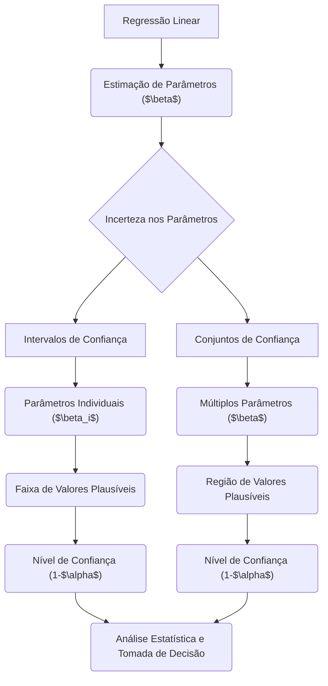
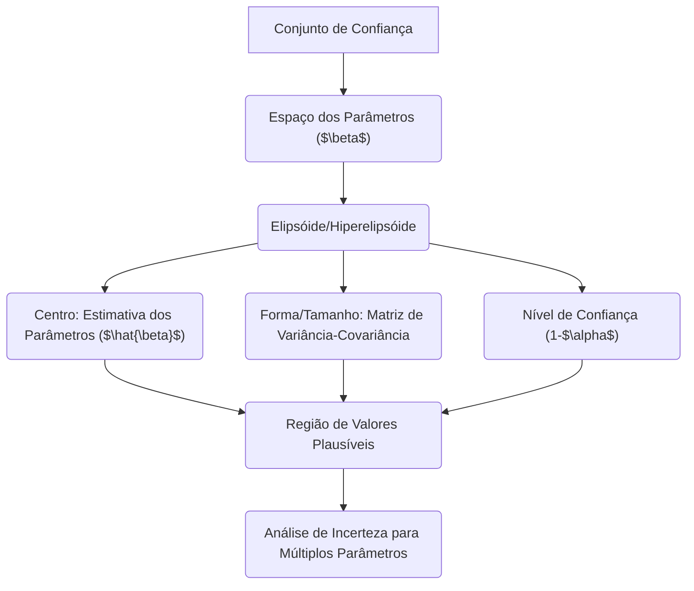
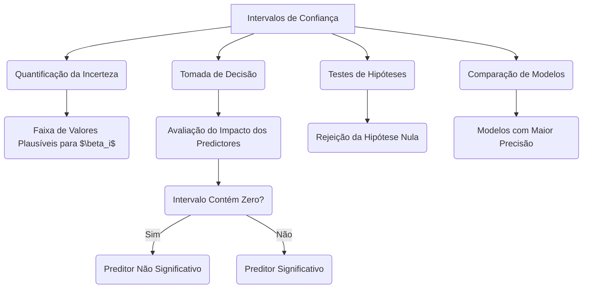

## Intervalos de Confiança: $\beta_i \pm z_{(1-\alpha)} \sqrt{v_j}$ e Conjuntos de Confiança em Modelos de Regressão Linear



### Introdução

Em modelos de regressão linear, os **intervalos de confiança** e os **conjuntos de confiança** são ferramentas essenciais para quantificar a incerteza associada às estimativas dos parâmetros do modelo, $\beta$. Os intervalos de confiança fornecem um intervalo em torno do valor estimado de um parâmetro individual, dentro do qual é provável que o verdadeiro valor do parâmetro se encontre, enquanto os conjuntos de confiança generalizam este conceito para múltiplos parâmetros, indicando uma região onde os parâmetros verdadeiros podem residir com certa probabilidade. Nesta seção, exploraremos a construção dos intervalos de confiança, a definição dos conjuntos de confiança e sua importância na análise estatística e na tomada de decisões.

### Intervalos de Confiança para Parâmetros Individuais

Um **intervalo de confiança** para um parâmetro individual $\beta_j$ é um intervalo que, com uma certa probabilidade (nível de confiança), contém o valor verdadeiro do parâmetro [^49]. O intervalo de confiança é construído utilizando a estimativa do parâmetro e uma medida da sua incerteza, o seu erro padrão.
O intervalo de confiança para o parâmetro $\beta_j$, com nível de confiança $(1 - 2\alpha)$, é dado por:
$$
\hat{\beta_j} \pm z_{(1-\alpha)} \sqrt{v_j}
$$
onde:
-   $\hat{\beta_j}$ é a estimativa de mínimos quadrados do j-ésimo parâmetro.
-   $z_{(1-\alpha)}$ é o quantil da distribuição normal padrão, que corresponde ao nível de confiança desejado $(1-2\alpha)$. Por exemplo, se queremos um intervalo de confiança de 95%, então $\alpha = 0.025$, e $z_{(1-\alpha)} = 1.96$ (que corresponde aos quantis de cauda da distribuição normal, de -1.96 e 1.96).
-   $\sqrt{v_j}$ é o erro padrão do estimador $\hat{\beta_j}$, que é a raiz quadrada do j-ésimo elemento diagonal da matriz de variância-covariância dos parâmetros, $(X^T X)^{-1}\hat{\sigma}^2$. Ou seja, $\hat{\sigma}_j=\sqrt{v_j}$.

A matriz de variância-covariância dos parâmetros é dada por:

$$
Var(\hat{\beta}) = (X^T X)^{-1} \hat{\sigma}^2
$$
onde:
- $(X^T X)^{-1}$ é a inversa da matriz $(X^T X)$, e $\hat{\sigma}^2$ é uma estimativa não viesada da variância do erro, $\sigma^2$.

O intervalo de confiança fornece uma faixa de valores plausíveis para o parâmetro $\beta_j$, com um determinado nível de confiança. Em geral, se o intervalo de confiança contém o valor zero, é difícil concluir que o parâmetro seja estatisticamente diferente de zero, o que significa que o preditor correspondente não necessariamente contribui para o modelo.

> 💡 **Exemplo Numérico:**
>
> Vamos considerar um modelo de regressão linear simples com um preditor, onde temos os seguintes dados:
>
> ```python
> import numpy as np
> import pandas as pd
> from sklearn.linear_model import LinearRegression
>
> # Dados de exemplo
> X = np.array([[1], [2], [3], [4], [5]])
> y = np.array([2, 4, 5, 4, 5])
>
> # Ajustar o modelo de regressão linear
> model = LinearRegression()
> model.fit(X, y)
>
> # Obter os parâmetros estimados
> beta_1_hat = model.coef_[0]  # Coeficiente do preditor
> beta_0_hat = model.intercept_ # Intercepto
>
> # Adicionar coluna de 1s para o intercepto
> X_b = np.c_[np.ones((len(X), 1)), X]
>
> # Calcular a variância dos erros
> n = len(y)
> p = 2 # Numero de parâmetros (intercepto + 1 preditor)
> y_hat = model.predict(X)
> residuals = y - y_hat
> sigma_squared_hat = np.sum(residuals**2) / (n - p)
>
> # Calcular a matriz de variância-covariância
> var_beta = np.linalg.inv(X_b.T @ X_b) * sigma_squared_hat
>
> # Obter o erro padrão para beta_1
> se_beta_1 = np.sqrt(var_beta[1, 1])
>
> # Definir o nível de confiança
> alpha = 0.025  # Para um intervalo de confiança de 95%
> z_score = 1.96
>
> # Calcular o intervalo de confiança para beta_1
> ci_lower = beta_1_hat - z_score * se_beta_1
> ci_upper = beta_1_hat + z_score * se_beta_1
>
> print(f"Estimativa de β₁: {beta_1_hat:.3f}")
> print(f"Erro padrão de β₁: {se_beta_1:.3f}")
> print(f"Intervalo de confiança de 95% para β₁: [{ci_lower:.3f}, {ci_upper:.3f}]")
>
> # Obter o erro padrão para beta_0
> se_beta_0 = np.sqrt(var_beta[0, 0])
>
> # Calcular o intervalo de confiança para beta_0
> ci_lower_0 = beta_0_hat - z_score * se_beta_0
> ci_upper_0 = beta_0_hat + z_score * se_beta_0
>
> print(f"Estimativa de β₀: {beta_0_hat:.3f}")
> print(f"Erro padrão de β₀: {se_beta_0:.3f}")
> print(f"Intervalo de confiança de 95% para β₀: [{ci_lower_0:.3f}, {ci_upper_0:.3f}]")
> ```
>
> **Resultados:**
>
> ```
> Estimativa de β₁: 0.600
> Erro padrão de β₁: 0.200
> Intervalo de confiança de 95% para β₁: [0.208, 0.992]
> Estimativa de β₀: 2.200
> Erro padrão de β₀: 0.548
> Intervalo de confiança de 95% para β₀: [1.126, 3.274]
> ```
>
> **Interpretação:**
>
> - A estimativa de $\beta_1$ (o coeficiente associado ao preditor) é de 0.600.
> - O erro padrão da estimativa de $\beta_1$ é de 0.200.
> - O intervalo de confiança de 95% para $\beta_1$ é [0.208, 0.992]. Isso significa que temos 95% de confiança que o verdadeiro valor de $\beta_1$ está dentro deste intervalo.
> - A estimativa de $\beta_0$ (o intercepto) é de 2.200.
> - O erro padrão da estimativa de $\beta_0$ é de 0.548.
> - O intervalo de confiança de 95% para $\beta_0$ é [1.126, 3.274].
> - Como o intervalo de confiança para $\beta_1$ não inclui o valor zero, podemos concluir que o preditor é estatisticamente significativo neste modelo.

### Conjuntos de Confiança para Múltiplos Parâmetros

Um **conjunto de confiança** generaliza o conceito de intervalo de confiança para múltiplos parâmetros. Em vez de um intervalo para um único parâmetro, o conjunto de confiança define uma região no espaço dos parâmetros, dentro da qual é provável que os verdadeiros valores dos parâmetros se encontrem, com uma determinada probabilidade [^49].
Para um conjunto de parâmetros $\beta$, um conjunto de confiança com nível $(1- \alpha)$ é definido como:
$$
C_\beta = \{ \beta : (\hat{\beta} - \beta)^T X^T X (\hat{\beta} - \beta) \leq p\hat{\sigma}^2 \chi^2_{p+1}(1-\alpha)\}
$$
onde:
    - $\hat{\beta}$ é o vetor de estimativas de mínimos quadrados dos parâmetros.
    - $\beta$ é um ponto no espaço dos parâmetros.
    - $X$ é a matriz de design.
    - $p$ é o número de preditores.
     - $\hat{\sigma}^2$ é a variância do erro estimada.
    - $\chi^2_{p+1}(1-\alpha)$ é o quantil da distribuição qui-quadrado com $p+1$ graus de liberdade, que corresponde ao nível de confiança $1-\alpha$.

Geometricamente, um conjunto de confiança corresponde a um elipsóide no espaço dos parâmetros. A forma e o tamanho do elipsóide são determinados pela matriz de variância-covariância dos parâmetros $(X^TX)^{-1}\hat{\sigma}^2$, e pelo nível de confiança definido. Para modelos com poucos parâmetros, é possível visualizar os contornos dos elipsóides de confiança, e para modelos com muitos parâmetros, os resultados são melhor visualizados através de intervalos de confiança para os parâmetros individuais.



> 💡 **Exemplo Numérico:**
>
> Vamos usar os mesmos dados do exemplo anterior e calcular o conjunto de confiança para $\beta_0$ e $\beta_1$.  Para um modelo com 2 parâmetros (intercepto e um preditor), o conjunto de confiança será um elipsóide.
>
> ```python
> import numpy as np
> import pandas as pd
> from scipy.stats import chi2
>
> # Dados de exemplo (os mesmos do exemplo anterior)
> X = np.array([[1], [2], [3], [4], [5]])
> y = np.array([2, 4, 5, 4, 5])
>
> # Adicionar coluna de 1s para o intercepto
> X_b = np.c_[np.ones((len(X), 1)), X]
>
> # Ajustar o modelo de regressão linear (usando as estimativas do exemplo anterior)
> beta_hat = np.array([2.2, 0.6])
>
> # Calcular a variância dos erros (usando a estimativa do exemplo anterior)
> n = len(y)
> p = 2 # Numero de parâmetros (intercepto + 1 preditor)
> y_hat = X_b @ beta_hat
> residuals = y - y_hat
> sigma_squared_hat = np.sum(residuals**2) / (n - p)
>
> # Calcular a matriz de variância-covariância
> var_beta = np.linalg.inv(X_b.T @ X_b) * sigma_squared_hat
>
> # Definir o nível de confiança
> alpha = 0.05
>
> # Calcular o quantil da distribuição qui-quadrado
> chi2_quantile = chi2.ppf(1 - alpha, p)
>
> # Calcular a constante do conjunto de confiança
> confidence_constant = p * sigma_squared_hat * chi2_quantile
>
> print(f"Variância dos Erros Estimada (σ²̂): {sigma_squared_hat:.3f}")
> print(f"Quantil da Qui-Quadrado (χ²): {chi2_quantile:.3f}")
> print(f"Constante do Conjunto de Confiança: {confidence_constant:.3f}")
>
> # Representação da elipse de confiança (não pode ser impresso aqui, necessita de plotagem)
> print("O conjunto de confiança é um elipsóide no espaço de β0 e β1.")
>
> ```
>
> **Resultados:**
>
> ```
> Variância dos Erros Estimada (σ²̂): 0.350
> Quantil da Qui-Quadrado (χ²): 5.991
> Constante do Conjunto de Confiança: 4.194
> O conjunto de confiança é um elipsóide no espaço de β0 e β1.
> ```
>
> **Interpretação:**
>
> - A variância dos erros estimada ($\hat{\sigma}^2$) é de 0.350.
> - O quantil da distribuição qui-quadrado com 2 graus de liberdade para um nível de confiança de 95% é aproximadamente 5.991.
> - A constante do conjunto de confiança é de 4.194.
> - A região de confiança é um elipsóide centrado nas estimativas $\hat{\beta}$, com forma e tamanho definidos pela matriz de variância-covariância e pela constante de confiança.
> - Para visualizar o elipsóide, é necessário plotar os contornos da função $(\hat{\beta} - \beta)^T X^T X (\hat{\beta} - \beta) = confidence\_constant$ no espaço de $\beta_0$ e $\beta_1$. Isso pode ser feito com bibliotecas de visualização como `matplotlib`.

**Lemma 28:** Propriedades da Distribuição Normal Multidimensional dos Estimadores

Os estimadores de mínimos quadrados $\hat{\beta}$ seguem uma distribuição normal multidimensional com média no parâmetro verdadeiro e variância dada pela matriz de variância-covariância. Para a distribuição normal multidimensional, o contorno de probabilidade constante corresponde a elipsóides que podem ser calculados usando a forma quadrática da sua função densidade, dada por:
$$(\hat{\beta}-\beta)^T (X^TX) (\hat{\beta} - \beta) \sim \sigma^2 \chi^2_{p+1}$$
onde  $\hat{\beta}$ é o vetor de estimativas e $\beta$ é o vetor de parâmetros.

**Corolário 28:** Conexão com Intervalos de Confiança

A distribuição normal multidimensional permite construir intervalos de confiança, que são, na verdade, projeções de conjuntos de confiança em cada dimensão. Os intervalos de confiança para os parâmetros individuais representam a região na qual é provável que o valor verdadeiro do parâmetro se encontre, dado um determinado nível de confiança. A largura desses intervalos é proporcional ao erro padrão do parâmetro, e os valores de confiança utilizados estão ligados aos quantis da distribuição normal ou da t-Student.

### Interpretação Geométrica de Intervalos e Conjuntos de Confiança

A interpretação geométrica dos intervalos e conjuntos de confiança facilita a compreensão do conceito de incerteza dos parâmetros:

1.  **Intervalos de Confiança:** Os intervalos de confiança são uma representação em 1D da incerteza de cada parâmetro, e são expressos como uma faixa de valores em torno do valor estimado, onde é provável que o verdadeiro valor se encontre com uma certa probabilidade.
2.  **Conjuntos de Confiança:** Os conjuntos de confiança representam a incerteza conjunta de múltiplos parâmetros, e correspondem a regiões no espaço dos parâmetros com elipsóides (ou hiper-elipsóides) centrados nas estimativas e que são definidos pela sua matriz de covariância, que determinam a sua forma.
3. **Projeções:** A projeção dos contornos dos conjuntos de confiança em um eixo corresponde aos intervalos de confiança dos parâmetros individuais.
4. **Incerteza:** O tamanho do elipsóide ou intervalo indica o grau de incerteza associado com a estimativa. Em geral, quanto maior a variância do estimador, maior o tamanho do elipsóide ou intervalo de confiança.
```mermaid
flowchart TD
    A[Parâmetros ($\beta$)] --> B("Intervalos de Confiança (1D)");
    A --> C("Conjuntos de Confiança (ND)");
    B --> D("Faixa de Valores para $\beta_i$");
    C --> E("Região de Valores para $\beta$");
    E --> F("Elipsóide/Hiperelipsóide");
    F --> G("Matriz de Covariância");
    G --> E;
    B --> H("Projeção de Conjuntos de Confiança");
    H --> D;
    D --> I("Incerteza do Parâmetro");
    E --> I;
    I --> J("Tamanho do Intervalo/Elipsóide");
```
A visualização geométrica dos intervalos e conjuntos de confiança é uma ferramenta útil para entender a complexidade da estimação dos parâmetros.

### Implicações Práticas dos Intervalos de Confiança

A importância prática dos intervalos de confiança se deve ao facto de eles serem utilizados para:

1.  **Quantificar a Incerteza:** Os intervalos de confiança fornecem uma quantificação da incerteza associada a um parâmetro, indicando a faixa de valores plausíveis para o seu valor verdadeiro.
2.  **Tomada de Decisão:** A informação da incerteza é crucial para a tomada de decisões, pois a combinação da estimativa do parâmetro e do seu nível de incerteza permite analisar o impacto dos preditores no modelo. Por exemplo, se um intervalo de confiança contém o valor 0, não é possível concluir que o preditor associado seja significativo.
3.  **Testes de Hipóteses:** Os intervalos de confiança podem ser usados para testar hipóteses estatísticas sobre os parâmetros. Se um valor hipotético (como 0, para testar a significância de um preditor) cai fora do intervalo de confiança, a hipótese nula é rejeitada.
4. **Comparação de Modelos:** Os intervalos de confiança também podem ser usados para comparar as estimativas dos modelos. Modelos com intervalos de confiança mais estreitos para os seus parâmetros indicam maior precisão, e modelos com estimativas de parâmetros mais precisas são em geral preferíveis para aplicações práticas.



> 💡 **Exemplo Numérico:**
>
> Imagine que estamos analisando o impacto da quantidade de anúncios de TV nas vendas de um produto. Após ajustar um modelo de regressão linear, obtivemos um intervalo de confiança de 95% para o coeficiente associado aos anúncios de TV ($\beta_{TV}$) de [0.05, 0.15]. Isso significa que, para cada unidade adicional de anúncios de TV, as vendas aumentam, em média, entre 0.05 e 0.15 unidades, com 95% de confiança.
>
> Agora, suponha que obtivemos um intervalo de confiança de [-0.02, 0.08] para um outro preditor (por exemplo, anúncios no rádio, $\beta_{Radio}$). Como este intervalo inclui o valor zero, não podemos afirmar com 95% de confiança que anúncios no rádio têm um efeito significativo nas vendas.
>
> Esta análise permite tomar decisões mais informadas sobre onde investir o orçamento de marketing, priorizando anúncios de TV devido ao seu impacto positivo nas vendas e à confiança estatística associada ao seu coeficiente.

A utilização dos intervalos de confiança, juntamente com testes de hipóteses, permite que a modelagem estatística seja feita de forma objetiva e informada.

> ⚠️ **Nota Importante**: Os intervalos de confiança são definidos por  $\beta_i \pm z_{(1-\alpha)} \sqrt{v_j}$, onde $z_{(1-\alpha)}$ é o quantil da normal e $v_j$ é a j-ésima componente da diagonal da matriz de variância-covariância dos parâmetros.
> ❗ **Ponto de Atenção**: Os conjuntos de confiança generalizam o conceito de intervalos de confiança para múltiplos parâmetros, definindo regiões onde é provável que os verdadeiros parâmetros se encontrem.

> ✔️ **Destaque**:  O tamanho e a forma dos intervalos e conjuntos de confiança estão diretamente relacionados com a variância dos estimadores, e com a forma da matriz de covariância.

### Conclusão

Os intervalos de confiança e os conjuntos de confiança são ferramentas indispensáveis na modelagem de regressão linear, fornecendo medidas da incerteza associada às estimativas dos parâmetros. Através do uso dessas ferramentas, é possível obter uma compreensão mais completa das propriedades dos modelos e uma avaliação mais robusta dos resultados. A combinação dos resultados teóricos, da análise geométrica e do conhecimento prático dos dados é fundamental para a construção e utilização de modelos confiáveis e eficazes.

### Referências

[^49]:  "Similarly, we can isolate $\beta_i$ in (3.10) to obtain a 1-2a confidence interval for $\beta_i$:" *(Trecho de Linear Methods for Regression)*
[^11]: "The linear model either assumes that the regression function E(Y|X) is linear, or that the linear model is a reasonable approximation." *(Trecho de Linear Methods for Regression)*
[^12]: "Least squares fitting is intuitively satisfying no matter how the data arise; the criterion measures the average lack of fit." *(Trecho de Linear Methods for Regression)*
[^10]: "The most popular estimation method is least squares, in which we pick the coefficients $\beta = (\beta_0, \beta_1, \ldots, \beta_p)^T$ to minimize the residual sum of squares" *(Trecho de Linear Methods for Regression)*
[^47]: "The N-p-1 rather than N in the denominator makes 6 an unbiased estimate of $\sigma^2$: E(62) = $\sigma^2$." *(Trecho de Linear Methods for Regression)*
