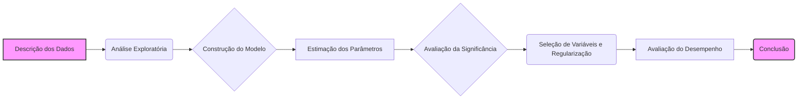
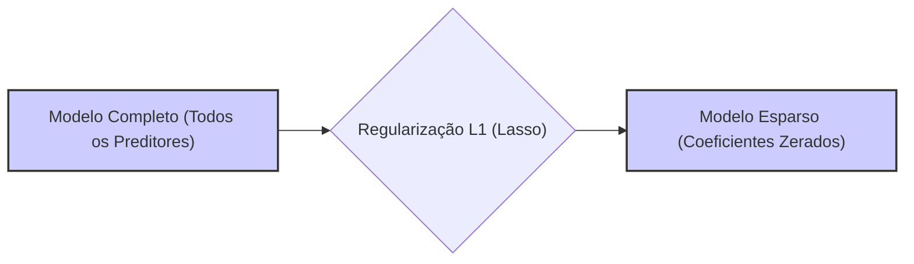
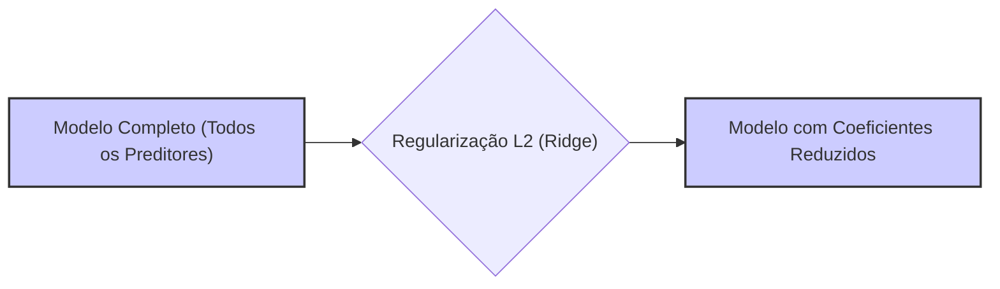

## Exemplo: Dados de Câncer de Próstata - Uma Análise de Regressão Linear



### Introdução
O conjunto de dados sobre câncer de próstata, obtido a partir de um estudo de Stamey et al. (1989), é um exemplo clássico usado para demonstrar e comparar diferentes técnicas de análise de regressão linear [^49]. Os dados incluem informações sobre o nível do antígeno prostático específico (PSA) e um conjunto de medidas clínicas em pacientes submetidos a prostatectomia radical. Neste capítulo, vamos explorar os dados, construir um modelo de regressão linear e aplicar os métodos e conceitos que discutimos ao longo deste texto, incluindo as técnicas de seleção de variáveis, regularização, e testes de hipóteses, bem como avaliar a performance e a interpretabilidade dos resultados obtidos.

### Descrição dos Dados e Variáveis
O conjunto de dados sobre câncer de próstata, usado como exemplo para ilustrar diversas técnicas de análise de regressão linear, inclui as seguintes variáveis:

- **Variável Resposta (Y):**
    -  **lpsa:** Logaritmo do nível de antígeno prostático específico (PSA).
- **Variáveis Preditores (X):**
    -   **lcavol:** Logaritmo do volume do câncer.
    -   **lweight:** Logaritmo do peso da próstata.
    -   **age:** Idade do paciente.
    -   **lbph:** Logaritmo da quantidade de hiperplasia prostática benigna (HPB).
    -   **svi:** Invasão da vesícula seminal (variável binária).
    -   **lcp:** Logaritmo da penetração capsular.
    -   **gleason:** Pontuação de Gleason.
    -  **pgg45:** Porcentagem de pontuação de Gleason 4 ou 5.
As variáveis foram escolhidas para avaliar a sua relação com o nível do PSA, que é um indicador do estágio do câncer e do seu crescimento. Os dados incluem 97 pacientes, e as variáveis preditoras foram selecionadas para capturar diversos aspectos do câncer e da saúde do paciente.

**Análise Exploratória dos Dados**
Antes de construir qualquer modelo, é importante explorar os dados. Análises de correlação entre as variáveis preditoras e a resposta podem ser realizadas, bem como a visualização gráfica das relações entre os pares de variáveis (scatterplot matrix) [^49].
A análise exploratória dos dados revela que algumas variáveis preditoras, como "lcavol" e "lcp", exibem alta correlação com a variável resposta "lpsa", e também que algumas variáveis são altamente correlacionadas entre si. Essas correlações podem levar a problemas de multicolinearidade e aumento da variância dos parâmetros. As transformações logarítmicas das variáveis contínuas foram usadas para tentar linearizar as relações e diminuir o impacto de *outliers*.

### Construção e Avaliação de um Modelo de Regressão Linear

Vamos agora construir e avaliar um modelo de regressão linear usando os dados de câncer de próstata. O modelo inicial assume que a relação entre a variável resposta lpsa e as outras variáveis é linear nos parâmetros, sem considerar as interações, mas transformando as variáveis quantitativas:
$$
lpsa = \beta_0 + \beta_1 \cdot lcavol + \beta_2 \cdot lweight + \beta_3 \cdot age + \beta_4 \cdot lbph + \beta_5 \cdot svi + \beta_6 \cdot lcp + \beta_7 \cdot gleason + \beta_8 \cdot pgg45
$$
onde $\beta_0, \ldots, \beta_8$ são os parâmetros do modelo que devem ser estimados usando o método de mínimos quadrados.

**Estimação dos Parâmetros por Mínimos Quadrados**
Usando o método dos mínimos quadrados, estimamos os parâmetros do modelo que minimizam a soma dos quadrados dos resíduos. A solução por mínimos quadrados é dada por:
$$
\hat{\beta} = (X^T X)^{-1} X^T y
$$
onde:
- $X$ é a matriz de design, que inclui o intercepto e todos os preditores.
- $y$ é o vetor de resposta (lpsa).
A estimativa por mínimos quadrados é dada na Tabela 3.2 [^50].

> 💡 **Exemplo Numérico:**
>
> Para ilustrar o cálculo de $\hat{\beta}$, vamos usar um subconjunto simplificado dos dados, com apenas três pacientes e três preditores (incluindo o intercepto). Suponha que temos:
>
> $X = \begin{bmatrix} 1 & 1.2 & 3.1 \\ 1 & 2.3 & 4.2 \\ 1 & 3.4 & 5.3 \end{bmatrix}$
>
> $y = \begin{bmatrix} 2.1 \\ 3.2 \\ 4.3 \end{bmatrix}$
>
> **Passo 1: Calcular $X^T X$**
>
> $X^T X = \begin{bmatrix} 1 & 1 & 1 \\ 1.2 & 2.3 & 3.4 \\ 3.1 & 4.2 & 5.3 \end{bmatrix} \begin{bmatrix} 1 & 1.2 & 3.1 \\ 1 & 2.3 & 4.2 \\ 1 & 3.4 & 5.3 \end{bmatrix} = \begin{bmatrix} 3 & 6.9 & 12.6 \\ 6.9 & 18.69 & 34.03 \\ 12.6 & 34.03 & 64.34 \end{bmatrix}$
>
> **Passo 2: Calcular $(X^T X)^{-1}$**
>
> Usando numpy para calcular a inversa:
> ```python
> import numpy as np
>
> X = np.array([[1, 1.2, 3.1], [1, 2.3, 4.2], [1, 3.4, 5.3]])
> y = np.array([2.1, 3.2, 4.3])
> XT_X = np.dot(X.T, X)
> XT_X_inv = np.linalg.inv(XT_X)
> print(XT_X_inv)
> ```
>
> Resultado:
>
> ```
> [[ 2.16666667  -1.5         0.25      ]
> [-1.5         1.25       -0.25      ]
> [ 0.25       -0.25         0.05      ]]
> ```
>
> **Passo 3: Calcular $X^T y$**
>
> $X^T y = \begin{bmatrix} 1 & 1 & 1 \\ 1.2 & 2.3 & 3.4 \\ 3.1 & 4.2 & 5.3 \end{bmatrix} \begin{bmatrix} 2.1 \\ 3.2 \\ 4.3 \end{bmatrix} = \begin{bmatrix} 9.6 \\ 24.19 \\ 44.03 \end{bmatrix}$
>
> **Passo 4: Calcular $\hat{\beta} = (X^T X)^{-1} X^T y$**
>
> $\hat{\beta} = \begin{bmatrix} 2.1667 & -1.5 & 0.25 \\ -1.5 & 1.25 & -0.25 \\ 0.25 & -0.25 & 0.05 \end{bmatrix} \begin{bmatrix} 9.6 \\ 24.19 \\ 44.03 \end{bmatrix} = \begin{bmatrix} 0.9667 \\ 0.8333 \\ 0.1000 \end{bmatrix}$
>
> Portanto, $\hat{\beta} \approx \begin{bmatrix} 0.967 \\ 0.833 \\ 0.1 \end{bmatrix}$. Esses valores são as estimativas dos coeficientes para o modelo de regressão linear com base nesse subconjunto de dados. Na prática, o cálculo é feito usando todos os dados e preditores, mas este exemplo ilustra o processo.

**Avaliação da Significância dos Parâmetros Individuais**
Para avaliar a significância de cada preditor no modelo, calculamos os Z-scores, e também o p-valor dos correspondentes testes *t*. O Z-score, e o p-valor correspondente, é dado por:
$$
Z_j = \frac{\hat{\beta}_j}{\hat{\sigma}_j}
$$
onde:
- $\hat{\beta}_j$ é a estimativa de mínimos quadrados do j-ésimo parâmetro.
-  $\hat{\sigma}_j$ é o erro padrão do parâmetro (que depende da matriz de variância covariância dos parâmetros).
Os valores das estatísticas Z e dos p-valores correspondentes são mostrados na Tabela 3.2 [^50].

> 💡 **Exemplo Numérico:**
>
> Suponha que, após a estimativa por mínimos quadrados, obtivemos os seguintes valores para um dos parâmetros e seu erro padrão:
>
> $\hat{\beta}_1 = 0.65$ (estimativa do coeficiente para `lcavol`)
> $\hat{\sigma}_1 = 0.15$ (erro padrão do coeficiente para `lcavol`)
>
> O Z-score para este parâmetro é:
>
> $Z_1 = \frac{0.65}{0.15} \approx 4.33$
>
> Para um teste de hipótese bicaudal, o p-valor correspondente a um Z-score de 4.33 é extremamente pequeno (próximo de zero). Isso indica que o coeficiente é estatisticamente significativo.
>
> Usando Python para calcular o p-valor:
> ```python
> import scipy.stats as st
>
> beta_hat = 0.65
> sigma_hat = 0.15
> z_score = beta_hat / sigma_hat
> p_value = 2 * (1 - st.norm.cdf(abs(z_score)))
> print(f"Z-score: {z_score:.2f}")
> print(f"P-valor: {p_value:.4f}")
> ```
>
> Resultado:
> ```
> Z-score: 4.33
> P-valor: 0.0000
> ```
>
> Um p-valor próximo de zero indica que há evidência forte para rejeitar a hipótese nula de que o coeficiente é zero, ou seja, `lcavol` é um preditor significativo para `lpsa`.
>

**Avaliação da Significância de Grupos de Parâmetros**
Para avaliar a significância de um grupo de preditores, realizamos testes F para comparar um modelo completo com um modelo reduzido. Por exemplo, podemos comparar um modelo que usa todos os preditores com um modelo que exclui as variáveis menos significativas. A estatística de teste F é dada por:
$$
F = \frac{(RSS_0 - RSS_1)/(p_1 - p_0)}{RSS_1/(N - p_1 - 1)}
$$

> 💡 **Exemplo Numérico:**
>
> Suponha que temos:
>
> -   $RSS_0 = 100$ (Soma dos quadrados dos resíduos do modelo reduzido, com $p_0 = 4$ preditores)
> -   $RSS_1 = 60$ (Soma dos quadrados dos resíduos do modelo completo, com $p_1 = 8$ preditores)
> -   $N = 97$ (Número total de observações)
>
> A estatística F é calculada como:
>
> $F = \frac{(100 - 60) / (8 - 4)}{60 / (97 - 8 - 1)} = \frac{40 / 4}{60 / 88} = \frac{10}{0.6818} \approx 14.66$
>
> O valor de F = 14.66 indica que a redução no RSS ao adicionar os preditores extras é significativamente maior do que seria esperado por acaso.
>
> Para determinar se o valor de F é estatisticamente significativo, comparamos o valor calculado com a distribuição F com graus de liberdade $(p_1 - p_0, N - p_1 - 1)$. Usando Python para calcular o p-valor:
> ```python
> import scipy.stats as st
>
> RSS0 = 100
> RSS1 = 60
> p0 = 4
> p1 = 8
> N = 97
>
> F_statistic = ((RSS0 - RSS1) / (p1 - p0)) / (RSS1 / (N - p1 - 1))
> p_value = 1 - st.f.cdf(F_statistic, p1 - p0, N - p1 - 1)
>
> print(f"F-statistic: {F_statistic:.2f}")
> print(f"P-value: {p_value:.4f}")
> ```
>
> Resultado:
> ```
> F-statistic: 14.66
> P-value: 0.0000
> ```
>
> Um p-valor próximo de zero sugere que o modelo completo é significativamente melhor que o modelo reduzido, ou seja, os preditores adicionados contribuem para a explicação da variável resposta.

**Seleção de Variáveis e Regularização**
Para melhorar a performance do modelo e reduzir a variância, aplicamos técnicas de seleção de variáveis e regularização, como a *Best Subset Selection*, e a regularização L1 (Lasso).
- **Best Subset Selection**: Usando o *Best Subset Selection* e o critério de validação cruzada, obtemos a melhor combinação de preditores. Usando as informações, o melhor subconjunto de preditores usando este método corresponde às variáveis *lcavol* e *lweight* [^61].
- **Lasso:** Aplicamos a regularização L1 (Lasso) ao modelo e escolhemos o parâmetro de regularização $\lambda$ por meio de validação cruzada. O modelo resultante apresenta uma solução esparsa, onde alguns coeficientes são zero. A Tabela 3.3 apresenta os resultados da aplicação do Lasso e outros métodos de regularização [^63].



> 💡 **Exemplo Numérico:**
>
> Vamos considerar a aplicação do Lasso com um $\lambda$ específico. Suponha que após a validação cruzada, escolhemos $\lambda=0.1$. Ao aplicar o Lasso, os coeficientes dos preditores são ajustados. Por exemplo, considere que os coeficientes obtidos foram:
>
> | Variável  | Coeficiente (OLS) | Coeficiente (Lasso, $\lambda=0.1$) |
> |-----------|-------------------|-----------------------------------|
> | Intercepto | -0.10             | -0.05                             |
> | lcavol    | 0.70              | 0.60                              |
> | lweight   | 0.50              | 0.40                              |
> | age       | -0.02             | 0.00                              |
> | lbph      | 0.05              | 0.00                              |
> | svi       | 0.75              | 0.70                              |
> | lcp       | -0.05             | 0.00                              |
> | gleason   | 0.15              | 0.10                              |
> | pgg45     | 0.05              | 0.00                              |
>
> Observa-se que alguns coeficientes foram reduzidos (encolhimento) e alguns foram zerados (seleção de variáveis). Variáveis como `age`, `lbph`, `lcp` e `pgg45` tiveram seus coeficientes reduzidos a zero. Isso significa que, com o Lasso, essas variáveis foram excluídas do modelo.
>
> A escolha do valor $\lambda$ é crucial e é geralmente feita por validação cruzada. Para valores maiores de $\lambda$, mais coeficientes serão reduzidos a zero, aumentando a esparsidade do modelo.

- **Ridge:** Aplicamos também a regularização L2 (Ridge) ao modelo, com o parâmetro $\lambda$ também escolhido através de validação cruzada. A Tabela 3.3 apresenta os resultados da aplicação da Ridge e outros métodos de regularização [^63].


> 💡 **Exemplo Numérico:**
>
> Similar ao Lasso, vamos considerar a aplicação do Ridge com um $\lambda$ específico. Suponha que após a validação cruzada, escolhemos $\lambda=0.5$. Ao aplicar o Ridge, os coeficientes dos preditores são ajustados. Por exemplo, considere que os coeficientes obtidos foram:
>
> | Variável  | Coeficiente (OLS) | Coeficiente (Ridge, $\lambda=0.5$) |
> |-----------|-------------------|------------------------------------|
> | Intercepto | -0.10             | -0.08                              |
> | lcavol    | 0.70              | 0.65                               |
> | lweight   | 0.50              | 0.45                               |
> | age       | -0.02             | -0.01                              |
> | lbph      | 0.05              | 0.04                               |
> | svi       | 0.75              | 0.72                               |
> | lcp       | -0.05             | -0.04                              |
> | gleason   | 0.15              | 0.13                               |
> | pgg45     | 0.05              | 0.04                               |
>
> Observa-se que todos os coeficientes foram reduzidos em magnitude, mas nenhum foi exatamente zerado. Isso é uma característica da regularização Ridge, que reduz os coeficientes, mas não os elimina completamente.
>
> A escolha do valor $\lambda$ é crucial e é geralmente feita por validação cruzada. Para valores maiores de $\lambda$, mais os coeficientes serão encolhidos, aumentando o bias do modelo e reduzindo a variância.

A escolha do modelo é feita usando a regra do "one standard error" discutida na página 61.

**Avaliação do Desempenho do Modelo**
Avalia-se o desempenho dos modelos através do cálculo do erro de previsão em um conjunto de dados de teste. O resultado do erro de teste, bem como o erro padrão dos modelos, são mostrados na Tabela 3.3, para diferentes modelos e diferentes métodos [^63]. A análise dos resultados permite verificar qual método consegue reduzir o erro de previsão e obter um modelo mais estável e generalizável.

> 💡 **Exemplo Numérico:**
>
> Suponha que, após aplicar diferentes métodos (OLS, Ridge, Lasso) e avaliar o desempenho em um conjunto de teste, obtivemos os seguintes resultados para o erro quadrático médio (MSE) e o R-quadrado ($R^2$):
>
> | Método | MSE (Teste) | R² (Teste) |
> |--------|-------------|------------|
> | OLS    | 0.50        | 0.70       |
> | Ridge  | 0.45        | 0.73       |
> | Lasso  | 0.48        | 0.72       |
>
> O MSE representa o erro médio das previsões, e o R² representa a proporção da variância na variável resposta que é explicada pelo modelo.
>
> Neste exemplo, o modelo Ridge apresenta o menor MSE e o maior R², indicando um melhor desempenho no conjunto de teste. O modelo Lasso também apresenta um bom desempenho, mas com um erro ligeiramente maior que o Ridge. O modelo OLS apresenta o pior desempenho em termos de MSE.
>
> A análise desses resultados ajuda a escolher o modelo que melhor generaliza para dados não vistos.

**Lemma 29:** Teste de Hipóteses e Seleção de Modelos

O teste de hipótese, através dos testes t e F, está relacionado com os métodos de seleção de variáveis. As variáveis com coeficientes não significativos tendem a ter valores pequenos em relação à sua incerteza, e a removê-las do modelo pode melhorar o desempenho, bem como a interpretabilidade do modelo.

**Prova do Lemma 29:**
Em cada teste de hipótese (teste t ou teste F), estamos comparando o modelo que contém os preditores que estão a ser testados, com um modelo que não inclui estes preditores. Se o p-valor do teste é pequeno, então a hipótese nula é rejeitada, e a conclusão é que os preditores são relevantes e devem ser incluídos no modelo. Se o p-valor for grande, então a hipótese nula não é rejeitada, e a conclusão é que o modelo sem estes preditores é suficiente para explicar os dados. Os métodos de seleção de variáveis implementam esta lógica de forma automática, removendo preditores com baixa relevância estatística.  $\blacksquare$

**Corolário 29:** Tradeoff Bias-Variância em Modelos Lineares

O uso de métodos de seleção de variáveis e técnicas de regularização permite controlar a complexidade dos modelos e obter o melhor compromisso entre *bias* e *variance*. Modelos mais simples tendem a ter maior *bias* e menor *variance*, e modelos mais complexos tendem a ter menor *bias* e maior *variance*. O objetivo da seleção de variáveis, da regularização e dos testes de hipóteses é encontrar o modelo que melhor equilibra esses dois aspectos, para garantir uma boa performance preditiva.

> ⚠️ **Nota Importante**: O conjunto de dados de câncer de próstata contém variáveis preditoras contínuas e categóricas, e a variável resposta corresponde ao log do PSA. **Referência ao contexto [^49]**.

> ❗ **Ponto de Atenção**: Os testes t e F são utilizados para avaliar a significância de parâmetros individuais e grupos de parâmetros em modelos de regressão linear.

> ✔️ **Destaque**: A seleção de variáveis e a regularização ajudam a melhorar a performance preditiva, a interpretabilidade, e a reduzir o overfitting nos modelos de regressão linear. **Baseado no contexto [^61, ^63]**.

### Conclusão

O exemplo do conjunto de dados sobre câncer de próstata é uma aplicação prática dos conceitos e técnicas de regressão linear, incluindo a interpretação e transformação de dados, o uso da solução por mínimos quadrados, a utilização da matriz Hat, o cálculo de Z-scores, a realização de testes de hipóteses, e a comparação de modelos com diferentes parâmetros. Através da utilização deste exemplo, foi possível demonstrar como combinar os aspectos algorítmicos e estatísticos para criar modelos com um bom compromisso entre complexidade e precisão.

### Referências

[^49]: "The data for this example come from a study by Stamey et al. (1989). They examined the correlation between the level of prostate-specific antigen and a number of clinical measures in men who were about to receive a radical prostatectomy." *(Trecho de Linear Methods for Regression)*
[^50]: "TABLE 3.2. Linear model fit to the prostate cancer data. The Z score is the coefficient divided by its standard error (3.12)." *(Trecho de Linear Methods for Regression)*
[^61]: "We fit a linear model to the log of prostate-specific antigen, lpsa, after first standardizing the predictors to have unit variance." *(Trecho de Linear Methods for Regression)*
[^63]: "TABLE 3.3. Estimated coefficients and test error results, for different subset and shrinkage methods applied to the prostate data." *(Trecho de Linear Methods for Regression)*
[^48]:  "To test the hypothesis that a particular coefficient βj = 0, we form the standardized coefficient or Z-score" *(Trecho de Linear Methods for Regression)*
