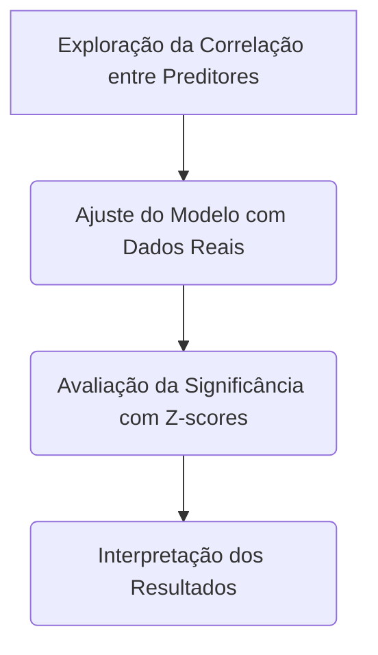
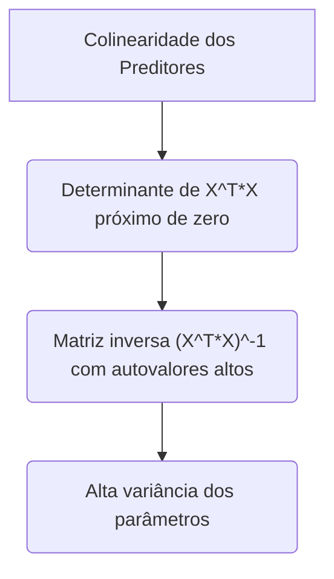
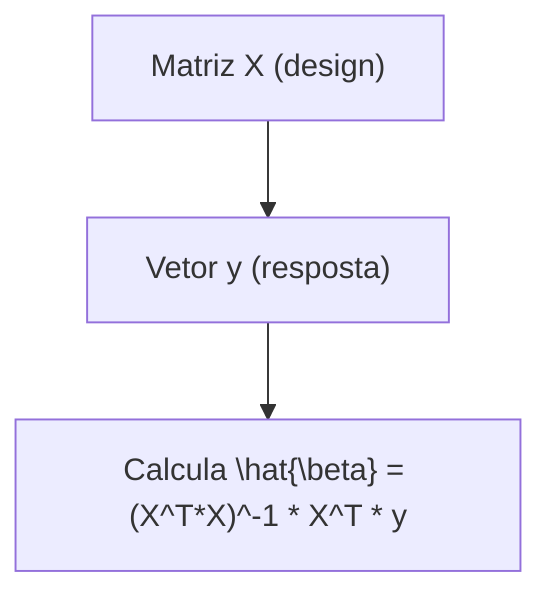
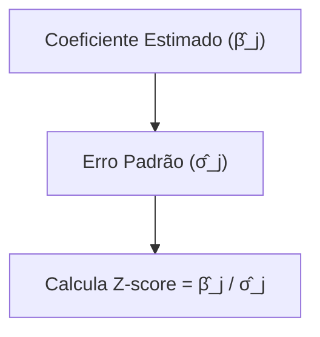
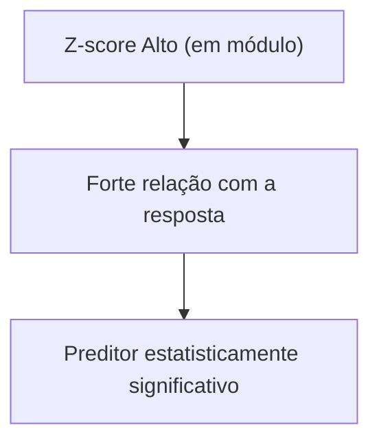

## Exploração da Correlação entre Preditores, Ajuste do Modelo com Dados Reais, e Avaliação da Significância via Z-scores



### Introdução
A modelagem de regressão linear envolve uma série de etapas, começando com a análise e exploração dos dados, o ajuste do modelo, e a avaliação da significância dos preditores. Um passo crucial no processo de modelagem é a exploração da correlação entre os preditores, de forma a identificar possíveis problemas como a multicolinearidade. O ajuste do modelo é seguido pela análise das propriedades dos parâmetros estimados através do cálculo dos seus erros padrão e dos seus coeficientes padronizados (Z-scores). Nesta seção, vamos explorar detalhadamente esses passos, com foco na interpretação das correlações, no ajuste do modelo com dados reais, e no uso do Z-score para avaliação da significância dos preditores.

### Exploração da Correlação entre Preditores
Antes de iniciar o ajuste do modelo de regressão linear, é fundamental explorar a correlação entre os preditores [^49]. O objetivo da análise de correlação é identificar possíveis relacionamentos lineares entre os preditores, e, em particular, a multicolinearidade, que é a presença de correlações elevadas entre duas ou mais variáveis preditoras.
Em modelos de regressão linear, a multicolinearidade pode ter consequências negativas:

    1. **Inflação da Variância dos Parâmetros**: A presença de multicolinearidade leva a estimativas instáveis dos parâmetros, e a matriz de variância-covariância dos parâmetros, dada por $(X^TX)^{-1}\sigma^2$, tem autovalores muito grandes, o que aumenta o erro padrão dos estimadores e causa a instabilidade nos seus valores estimados.
    2. **Interpretação dos Parâmetros:** A multicolinearidade dificulta a interpretação do efeito de cada preditor individual sobre a resposta, dado que os efeitos das variáveis estão "emaranhados", e não é possível separar o efeito de um preditor do efeito de outros.
   3. **Instabilidade dos Modelos**: Em situações de alta multicolinearidade, os modelos de regressão linear são muito sensíveis às flutuações dos dados, tornando-os menos robustos e com menor capacidade de generalização.

A correlação entre duas variáveis pode ser medida pelo coeficiente de correlação de Pearson, que assume valores entre -1 e 1, e que quantifica o grau de relação linear entre duas variáveis.  O coeficiente de correlação de Pearson entre duas variáveis $X_1$ e $X_2$ pode ser definido por:
$$
r_{X_1X_2} = \frac{\text{cov}(X_1, X_2)}{\sigma_{X_1}\sigma_{X_2}}
$$
onde $cov(X_1, X_2)$ é a covariância entre $X_1$ e $X_2$, e $\sigma_{X_1}$ e $\sigma_{X_2}$ são os desvios padrões de $X_1$ e $X_2$, respectivamente. A interpretação do coeficiente de correlação é que valores próximos de 1 representam correlação positiva, valores próximos a -1 representam correlação negativa, e valores próximos a zero indicam ausência de correlação linear.

O estudo das correlações entre preditores deve, sempre, ser acompanhado com análises gráficas (scatterplot matrix) para identificar outro tipo de relações entre os preditores.
Em cenários de alta multicolinearidade, métodos como a regularização, podem auxiliar a construir modelos mais estáveis.

> 💡 **Exemplo Numérico:**
>
> Vamos considerar um conjunto de dados simples com três preditores ($X_1$, $X_2$, e $X_3$) e uma variável resposta ($y$). Os dados são:
>
> ```python
> import numpy as np
> import pandas as pd
>
> data = {
>     'X1': [1, 2, 3, 4, 5, 6, 7, 8, 9, 10],
>     'X2': [2, 4, 5, 4, 5, 7, 9, 8, 9, 11],
>     'X3': [3, 6, 8, 7, 8, 10, 12, 11, 13, 15],
>     'y': [5, 8, 10, 9, 11, 14, 17, 16, 18, 20]
> }
> df = pd.DataFrame(data)
> X = df[['X1', 'X2', 'X3']].values
> y = df['y'].values
>
> print(df)
> ```
>
> Calculando a matriz de correlação de Pearson:
>
> ```python
> corr_matrix = df[['X1', 'X2', 'X3']].corr()
> print("\nMatriz de Correlação:")
> print(corr_matrix)
> ```
>
> A matriz de correlação nos mostra que $X_1$ e $X_2$ têm uma correlação de aproximadamente 0.93, $X_1$ e $X_3$ de 0.97 e $X_2$ e $X_3$ de 0.98, indicando alta multicolinearidade entre os preditores.
>
> Visualizando a matriz de correlação usando um mapa de calor:
>
> ```python
> import matplotlib.pyplot as plt
> import seaborn as sns
>
> plt.figure(figsize=(8, 6))
> sns.heatmap(corr_matrix, annot=True, cmap='coolwarm', fmt=".2f")
> plt.title("Matriz de Correlação entre Preditores")
> plt.show()
> ```
>
> O mapa de calor confirma visualmente a alta correlação entre as variáveis preditoras.
>
> Essa alta correlação sugere que alguns preditores podem estar fornecendo informações redundantes, e que pode haver problemas de instabilidade nos parâmetros do modelo de regressão.

**Lemma 24:**  A Relação entre Colinearidade e Variância

A colinearidade dos preditores, que implica em alta correlação, causa o aumento da variância dos parâmetros do modelo [^25]. Se duas variáveis tem uma correlação muito elevada, por exemplo uma correlação próxima a 1 ou -1, então a estimativa dos parâmetros associados com essas variáveis será imprecisa e com alta variância. Geometricamente, isso corresponde a que o espaço gerado pelas colunas da matriz $X$ se torna muito fino, e pequenas alterações no vetor de respostas podem levar a mudanças consideráveis na projeção nesse espaço, e consequentemente nas estimativas dos parâmetros.

**Prova do Lemma 24:**
A variância dos coeficientes em modelos de regressão linear é dada por $Var(\hat{\beta}) = \sigma^2(X^TX)^{-1}$, onde $\sigma^2$ é a variância do erro e $(X^TX)^{-1}$ é a matriz inversa de $X^TX$. Se algumas colunas de X são colineares, o determinante de $X^TX$ será próximo a zero, resultando em uma matriz inversa com autovalores muito altos e, consequentemente, alta variância dos parâmetros. A colinearidade aumenta a variância dos parâmetros, fazendo que seja difícil isolar o efeito de cada preditor, e diminuindo a interpretabilidade do modelo.

A relação entre colinearidade e variância pode ser explicada através da decomposição em valores singulares (SVD) de $X=UDV^T$. Ao usar a SVD, podemos demonstrar que autovalores menores em $X^TX$ (equivalente aos valores singulares menores de $X$) levam a autovalores maiores em $(X^TX)^{-1}$ e a uma matriz de covariância com autovalores muito grandes, resultando em um aumento da variância e instabilidade da solução por mínimos quadrados.
$\blacksquare$

> 💡 **Exemplo Numérico:**
>
> Continuando com os dados anteriores, vamos calcular a matriz $X^TX$ e sua inversa.
>
> ```python
> X_transpose_X = np.dot(X.T, X)
> print("X^T * X:\n", X_transpose_X)
>
> X_transpose_X_inv = np.linalg.inv(X_transpose_X)
> print("\n(X^T * X)^-1:\n", X_transpose_X_inv)
> ```
>
> Note que os valores na matriz $(X^TX)^{-1}$ são relativamente grandes, o que indica uma alta variância para os coeficientes. Isto é uma consequência da alta correlação entre os preditores.
>
> Para demonstrar o efeito da colinearidade na variância dos parâmetros, vamos calcular os erros padrão dos coeficientes. Primeiro, precisamos estimar $\sigma^2$. Para simplificar, vamos assumir que $\sigma^2 = 1$. Os erros padrão dos coeficientes são obtidos pela raiz quadrada dos elementos diagonais da matriz $\sigma^2 (X^TX)^{-1}$.
>
> ```python
> sigma_squared = 1
> variance_beta = sigma_squared * X_transpose_X_inv
> std_err_beta = np.sqrt(np.diag(variance_beta))
> print("\nErros Padrão dos Coeficientes:\n", std_err_beta)
> ```
>
> Como esperado, os erros padrão dos coeficientes são relativamente grandes, devido à multicolinearidade. Isso significa que as estimativas dos coeficientes são imprecisas e podem variar muito entre diferentes amostras, confirmando o Lemma 24.

**Corolário 24:** Uso de técnicas para lidar com multicolinearidade

O Lemma 24 implica que a multicolinearidade leva a parâmetros imprecisos, e portanto a métodos para lidar com a multicolinearidade são importantes para obter modelos mais estáveis. Técnicas como a remoção de preditores redundantes e a regularização (Ridge e Elastic Net) são importantes para estabilizar os coeficientes e obter modelos com melhor capacidade de generalização.

### Ajuste do Modelo com Dados Reais

Após a exploração da correlação entre preditores, ajustamos o modelo de regressão linear usando dados reais [^49]. O modelo de regressão linear é dado pela equação:

$$
\hat{y} = \beta_0 + \sum_{j=1}^p X_j \beta_j
$$
Para obter os parâmetros do modelo $\beta_j$, usamos o método de mínimos quadrados, que busca minimizar a soma dos quadrados dos resíduos.
A estimativa por mínimos quadrados é dada por:
$$
\hat{\beta} = (X^T X)^{-1} X^T y
$$
onde:
-   $X$ é a matriz de design.
-   $y$ é o vetor de resposta.
-   $\hat{\beta}$ é o vetor de coeficientes estimados.


Em aplicações com dados reais, as variáveis preditoras podem ter escalas e unidades diferentes, e portanto, é usual padronizar os preditores antes de aplicar o método de mínimos quadrados. Padronizar significa remover a média e dividir pelo desvio padrão de cada preditor, com o objetivo de garantir que todos os preditores tem a mesma escala e, portanto, que seus coeficientes sejam comparáveis entre si.

> 💡 **Exemplo Numérico:**
>
> Vamos ajustar o modelo de regressão linear aos dados do exemplo anterior.
>
> Primeiro, vamos adicionar uma coluna de 1s à matriz X para representar o intercepto do modelo:
>
> ```python
> X_with_intercept = np.concatenate((np.ones((X.shape[0], 1)), X), axis=1)
> print("Matriz X com intercepto:\n", X_with_intercept)
> ```
>
> Agora, vamos calcular os coeficientes de regressão usando a fórmula de mínimos quadrados:
>
> ```python
> beta_hat = np.dot(np.dot(np.linalg.inv(np.dot(X_with_intercept.T, X_with_intercept)), X_with_intercept.T), y)
> print("\nCoeficientes de Regressão (beta_hat):\n", beta_hat)
> ```
>
> Os coeficientes obtidos representam o efeito de cada preditor sobre a variável resposta. O primeiro elemento do vetor beta_hat é o intercepto ($\beta_0$), e os demais são os coeficientes associados a $X_1$, $X_2$ e $X_3$ ($\beta_1$, $\beta_2$ e $\beta_3$, respectivamente).
>
> Para comparar com uma implementação pronta, vamos usar a biblioteca `scikit-learn`:
>
> ```python
> from sklearn.linear_model import LinearRegression
>
> model = LinearRegression(fit_intercept=True)
> model.fit(X, y)
>
> print("\nCoeficientes de Regressão (scikit-learn):")
> print("Intercepto:", model.intercept_)
> print("Coeficientes:", model.coef_)
> ```
>
> Podemos ver que os coeficientes obtidos diretamente e os obtidos com scikit-learn são (aproximadamente) os mesmos. No entanto, os coeficientes de regressão obtidos diretamente são para a matriz X com o intercepto incluído, enquanto os coeficientes obtidos com scikit-learn são para a matriz X sem o intercepto, e o intercepto é dado separadamente.
>
> Para padronizar os preditores, podemos usar o `StandardScaler` do scikit-learn:
>
> ```python
> from sklearn.preprocessing import StandardScaler
>
> scaler = StandardScaler()
> X_scaled = scaler.fit_transform(X)
>
> model_scaled = LinearRegression(fit_intercept=True)
> model_scaled.fit(X_scaled, y)
>
> print("\nCoeficientes de Regressão com Preditores Padronizados:")
> print("Intercepto:", model_scaled.intercept_)
> print("Coeficientes:", model_scaled.coef_)
> ```
>
> Observe que os coeficientes obtidos com os preditores padronizados são diferentes dos coeficientes obtidos com os preditores não padronizados. Isso acontece porque a escala dos preditores foi alterada. Os coeficientes com preditores padronizados podem ser comparados diretamente entre si, pois eles representam o efeito de cada preditor em termos de desvios padrão.

### Avaliação da Significância com Z-scores

Para avaliar a significância de cada preditor individualmente, usamos os coeficientes padronizados, ou *Z-scores* [^48]. Os Z-scores, ao padronizarem os parâmetros, permitem comparar a magnitude dos seus efeitos em termos do seu erro padrão, e também realizar testes de hipótese, indicando quais preditores são estatisticamente significantes. O Z-score de um parâmetro $\beta_j$ é dado por:
$$
Z_j = \frac{\hat{\beta_j}}{\hat{\sigma}_j}
$$
onde:
-  $\hat{\beta_j}$ é o estimador de mínimos quadrados do j-ésimo parâmetro.
- $\hat{\sigma}_j$ é o erro padrão do estimador $\hat{\beta}_j$.
O erro padrão do parâmetro pode ser obtido através da matriz de variância covariância dos parâmetros.


A interpretação do Z-score como uma distância entre o parâmetro e o seu valor sob a hipótese nula (geralmente zero), em termos de desvios padrão, permite avaliar a importância de cada preditor de forma relativa, independentemente da escala.
Os p-valores, que também podem ser obtidos usando os Z-scores e distribuições teóricas como a t-Student, também permitem avaliar se a hipótese nula deve ser rejeitada ou não para cada preditor.

> 💡 **Exemplo Numérico:**
>
> Vamos calcular os Z-scores para os coeficientes do modelo de regressão linear ajustado com os dados padronizados. Usando os dados do exemplo anterior:
>
> ```python
> # Usando o modelo com preditores padronizados
> beta_hat_scaled = np.insert(model_scaled.coef_, 0, model_scaled.intercept_)
>
> # Matriz X com intercepto
> X_scaled_with_intercept = np.concatenate((np.ones((X_scaled.shape[0], 1)), X_scaled), axis=1)
>
> # Estimativa da variância do erro
> y_hat = np.dot(X_scaled_with_intercept, beta_hat_scaled)
> residuals = y - y_hat
> n = len(y)
> p = X_scaled_with_intercept.shape[1] - 1
> sigma_squared_hat = np.sum(residuals**2) / (n - p - 1)
>
> # Matriz de variância-covariância dos parâmetros
> variance_beta_hat_scaled = sigma_squared_hat * np.linalg.inv(np.dot(X_scaled_with_intercept.T, X_scaled_with_intercept))
> std_err_beta_hat_scaled = np.sqrt(np.diag(variance_beta_hat_scaled))
>
> # Calcula os Z-scores
> z_scores = beta_hat_scaled / std_err_beta_hat_scaled
>
> print("\nZ-scores dos Coeficientes:\n", z_scores)
> ```
>
> Os Z-scores indicam a significância de cada preditor. Um Z-score grande em módulo (geralmente maior que 2 ou menor que -2) sugere que o preditor é estatisticamente significativo.
>
> Para obter os p-valores, podemos usar a distribuição normal padrão:
>
> ```python
> from scipy.stats import norm
>
> p_values = 2 * (1 - norm.cdf(np.abs(z_scores)))
> print("\nP-valores dos Coeficientes:\n", p_values)
> ```
>
> Os p-valores menores que um nível de significância (por exemplo, 0.05) indicam que a hipótese nula de que o coeficiente é zero deve ser rejeitada.

**Lemma 25:** Relação entre o Z-score e o Teste T

O Z-score é uma aproximação da estatística t utilizada nos testes de hipóteses para parâmetros individuais [^48]. Se a amostra for grande, e as premissas do modelo linear forem satisfeitas, a estatística do teste t converge para a distribuição normal padrão, e o Z-score pode ser usado diretamente para avaliar a significância.

**Prova do Lemma 25:**
A estatística do teste t é dada por:
$$
t_j = \frac{\hat{\beta}_j}{\hat{se}(\hat{\beta_j})}
$$
onde $\hat{se}(\hat{\beta_j})$ é o erro padrão de $\hat{\beta}_j$. Se a distribuição dos erros é normal, a estatística t segue uma distribuição t-Student com $N-p-1$ graus de liberdade. Para amostras grandes a distribuição t-Student converge para a normal padrão. A estatística $Z$ é calculada usando uma estimativa do desvio padrão, enquanto a estatística $t$ usa o seu valor verdadeiro. Para valores grandes de N, os dois valores são muito semelhantes. $\blacksquare$

**Corolário 25:** Interpretação Prática do Z-score

O Corolário 25 permite que o Z-score seja utilizado para avaliar a significância dos preditores usando as propriedades da distribuição normal. Se o Z-score de um preditor for alto (em módulo), então o preditor tem uma forte relação com a resposta, dado o erro padrão, e é estatisticamente significativo.


> ⚠️ **Nota Importante**: A exploração das correlações entre preditores é fundamental para identificar potenciais problemas de multicolinearidade, que podem inflacionar a variância dos parâmetros.

> ❗ **Ponto de Atenção**: Os coeficientes padronizados, ou Z-scores, avaliam a significância dos preditores em termos da sua distância da hipótese nula, medida em unidades de desvio padrão.

> ✔️ **Destaque**: A padronização dos coeficientes e a utilização dos Z-scores permite comparar a significância relativa de preditores em diferentes escalas.

### Conclusão

A exploração das correlações entre preditores, o ajuste do modelo aos dados reais, e a avaliação da significância usando Z-scores são etapas essenciais da modelagem de regressão linear. Uma análise cuidadosa da multicolinearidade permite entender as limitações do modelo e escolher técnicas que sejam apropriadas para os dados, enquanto a avaliação dos Z-scores permite construir modelos mais interpretáveis e estáveis. A combinação dessas técnicas auxilia o modelador na construção de modelos com capacidade preditiva e que também sejam interpretáveis e úteis para a tomada de decisões.

### Referências
[^49]: "The data for this example come from a study by Stamey et al. (1989). They examined the correlation between the level of prostate-specific antigen and a number of clinical measures in men who were about to receive a radical prostatectomy." *(Trecho de Linear Methods for Regression)*
[^25]: "When there are many correlated variables in a linear regression model, their coefficients can become poorly determined and exhibit high variance. A wildly large positive coefficient on one variable can be canceled by a similarly large negative coefficient on its correlated cousin." *(Trecho de Linear Methods for Regression)*
[^48]:  "To test the hypothesis that a particular coefficient βj = 0, we form the standardized coefficient or Z-score" *(Trecho de Linear Methods for Regression)*
