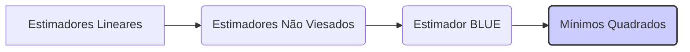
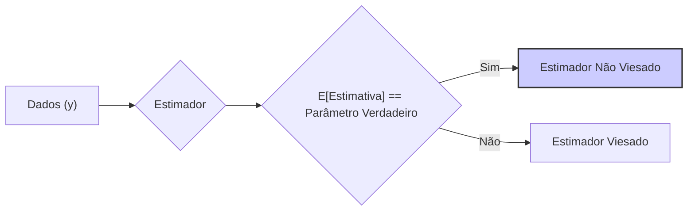
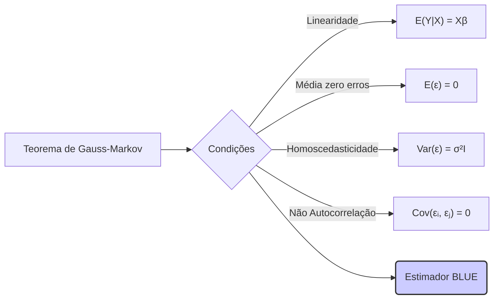
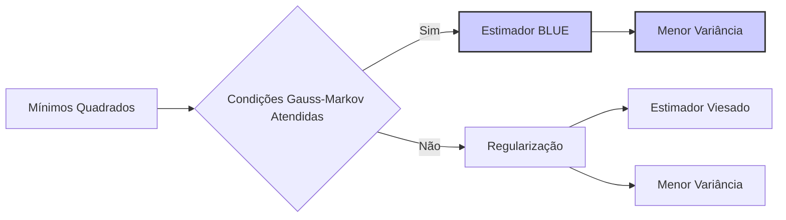

## Otimalidade dos Mínimos Quadrados: O Melhor Estimador Linear Não Viesado (BLUE)



### Introdução
Em modelos de regressão linear, o método dos **mínimos quadrados** não é apenas uma técnica de otimização que minimiza a soma dos quadrados dos resíduos, mas também é um método que apresenta importantes propriedades estatísticas. Sob certas condições, os estimadores de mínimos quadrados são os **melhores estimadores lineares não viesados** (BLUE - *Best Linear Unbiased Estimators*), o que significa que dentre todos os estimadores lineares não viesados, eles apresentam a menor variância. Este capítulo explorará em detalhe o conceito de estimador BLUE, a demonstração do Teorema de Gauss-Markov, que garante a otimalidade dos estimadores de mínimos quadrados, bem como as implicações práticas deste resultado.

### O Conceito de Estimador BLUE

Para entender a importância da solução de mínimos quadrados, é crucial entender o conceito de estimador BLUE.

1. **Estimador Linear:** Um estimador linear dos parâmetros $\beta$ é aquele que pode ser escrito como uma combinação linear das variáveis de resposta $y$:
$$
\hat{\beta} = Cy
$$
onde $C$ é uma matriz que não depende do vetor de respostas $y$. A solução de mínimos quadrados, $\hat{\beta} = (X^TX)^{-1}X^Ty$ é um exemplo de um estimador linear.

> 💡 **Exemplo Numérico:**
> Vamos considerar um modelo de regressão simples com uma variável preditora. Suponha que temos a matriz de design $X$ e o vetor de resposta $y$ como:
> ```python
> import numpy as np
>
> X = np.array([[1, 2], [1, 3], [1, 4], [1, 5]])
> y = np.array([3, 5, 6, 8])
> ```
> A matriz $C$ para o estimador de mínimos quadrados é calculada como $(X^TX)^{-1}X^T$:
> ```python
> XtX_inv = np.linalg.inv(X.T @ X)
> C = XtX_inv @ X.T
> print("Matriz C:\n", C)
> ```
> O estimador $\hat{\beta}$ é então:
> ```python
> beta_hat = C @ y
> print("Estimativa de beta:", beta_hat)
> ```
> A saída será algo como:
> ```
> Matriz C:
> [[ 1.75 -0.5  ]
>  [-0.25  0.1  ]]
> Estimativa de beta: [0.5 1.5]
> ```
> Aqui, $\hat{\beta} = [0.5, 1.5]$, que são os coeficientes do nosso modelo linear. A matriz $C$ é uma combinação linear das variáveis preditoras que nos permite obter diretamente a estimativa dos coeficientes.

2. **Estimador Não Viesado:** Um estimador é não viesado se a sua esperança matemática é igual ao valor verdadeiro do parâmetro, ou seja:
$$
E[\hat{\beta}] = \beta
$$
onde $\beta$ é o vetor de parâmetros verdadeiros. Em modelos de regressão linear, e sob as condições de que o modelo seja correto, e que os erros tenham média zero, os estimadores de mínimos quadrados são não viesados.



> 💡 **Exemplo Numérico:**
> Suponha que o verdadeiro modelo é $y = 0.5 + 1.5x + \epsilon$, e que geramos dados simulados:
>
> ```python
> np.random.seed(42)
> X = np.array([[1, x] for x in np.linspace(2,5, num=100)])
> true_beta = np.array([0.5, 1.5])
> epsilon = np.random.normal(0, 1, 100)
> y = X @ true_beta + epsilon
> 
> XtX_inv = np.linalg.inv(X.T @ X)
> beta_hat = XtX_inv @ X.T @ y
> print("Estimativa de beta:", beta_hat)
> print("Verdadeiro beta:", true_beta)
> ```
> Se repetirmos esse processo várias vezes e calcularmos a média dos $\hat{\beta}$ obtidos, essa média se aproximará do verdadeiro $\beta$, demonstrando que o estimador é não viesado.

3. **Melhor Estimador:** O conceito de "melhor" estimador se refere à eficiência, ou seja, o estimador com a menor variância. Dentre todos os estimadores lineares não viesados, o estimador de mínimos quadrados é aquele que minimiza a sua variância.

O conceito BLUE é um resultado da teoria estatística, que estabelece a importância do método de mínimos quadrados, mostrando que ele oferece a melhor solução para estimar os parâmetros de modelos de regressão linear, dentro da classe dos estimadores lineares não viesados.

### O Teorema de Gauss-Markov

O **Teorema de Gauss-Markov** estabelece que, sob certas condições, os estimadores de mínimos quadrados são os melhores estimadores lineares não viesados (BLUE). Essas condições são:
   1. **Linearidade:** A relação entre a variável resposta e os preditores é linear na média, ou seja, $E(Y|X) = X\beta$, onde X é a matriz de design, e $\beta$ o vetor de parâmetros.
   2. **Média zero dos erros:** Os erros têm média zero, ou seja, $E(\epsilon)=0$.
   3. **Homoscedasticidade:** Os erros têm variância constante, ou seja, $Var(\epsilon) = \sigma^2 I$ , onde $I$ é a matriz identidade.
   4. **Não Autocorrelação dos Erros:** Os erros são não correlacionados entre si, ou seja, $Cov(\epsilon_i, \epsilon_j) = 0$ para todo $i \neq j$.



É importante notar que o teorema de Gauss-Markov não requer a suposição de normalidade da distribuição dos erros, e vale mesmo se os erros seguem outras distribuições, desde que as condições acima sejam satisfeitas.
Sob estas condições, a variância de qualquer outro estimador linear não viesado é sempre maior que a variância dos estimadores de mínimos quadrados.

**Lemma 26:**  O Estimador de Mínimos Quadrados é BLUE

O Teorema de Gauss-Markov demonstra que o estimador de mínimos quadrados é BLUE.  Este resultado formaliza a intuição de que, se o modelo linear for apropriado e os erros satisfizerem as condições de regularidade, a solução de mínimos quadrados é a melhor escolha, dentro da classe de estimadores lineares não viesados.

**Prova do Lemma 26:**
Seja $\hat{\beta} = (X^T X)^{-1} X^T y$ o estimador de mínimos quadrados e seja $\tilde{\beta} = Cy$ um outro estimador linear não viesado de $\beta$. Para que $\tilde{\beta}$ seja não viesado, é necessário que $E[\tilde{\beta}] = E[Cy] = \beta$. Usando $y = X\beta+\epsilon$ temos que $E[C(X\beta+\epsilon)] = CX\beta = \beta$, ou seja $CX = I$ onde $I$ é a matriz identidade. A variância do estimador $\tilde{\beta}$ é dada por:
$$
Var(\tilde{\beta}) = Var(Cy) = C Var(y) C^T = \sigma^2 C C^T
$$
Como $Var(\hat{\beta}) = \sigma^2 (X^T X)^{-1}$, e $CX=I$, podemos escrever:
$$
C C^T - (X^T X)^{-1} = (C - (X^TX)^{-1}X^T)(C - (X^TX)^{-1}X^T)^T + (X^TX)^{-1}
$$
Como $(C - (X^TX)^{-1}X^T)(C - (X^TX)^{-1}X^T)^T$ é uma matriz positiva semi definida, então
$$
C C^T \geq (X^T X)^{-1}
$$
e portanto,
$$
Var(\tilde{\beta}) \geq Var(\hat{\beta})
$$
o que demonstra que o estimador de mínimos quadrados é um estimador com menor variância em relação a um estimador genérico não viesado. $\blacksquare$

> 💡 **Exemplo Numérico (Prova do Lemma):**
> Vamos usar um exemplo simples para ilustrar a prova. Suponha que temos $X = \begin{bmatrix} 1 & 2 \\ 1 & 3 \end{bmatrix}$ e o verdadeiro $\beta = \begin{bmatrix} 1 \\ 2 \end{bmatrix}$. Vamos simular alguns dados e calcular a variância de dois estimadores diferentes: o estimador de mínimos quadrados $\hat{\beta}$ e um estimador linear alternativo $\tilde{\beta}$ com $C = \begin{bmatrix} 1 & 0 \\ 0 & 1 \end{bmatrix}$.
>
> Primeiro, vamos calcular $\hat{\beta}$ e sua variância:
> ```python
> import numpy as np
>
> # Dados
> X = np.array([[1, 2], [1, 3]])
> beta_true = np.array([1, 2])
> sigma_sq = 0.5 # Variância do erro
>
> # Simulação de dados
> np.random.seed(42)
> epsilon = np.random.normal(0, np.sqrt(sigma_sq), 2)
> y = X @ beta_true + epsilon
>
> # Estimador de mínimos quadrados
> XtX_inv = np.linalg.inv(X.T @ X)
> beta_hat = XtX_inv @ X.T @ y
>
> # Variância do estimador de mínimos quadrados
> var_beta_hat = sigma_sq * XtX_inv
>
> print("Estimador de mínimos quadrados (beta_hat):\n", beta_hat)
> print("Variância de beta_hat:\n", var_beta_hat)
> ```
> Agora, vamos definir um estimador alternativo $\tilde{\beta} = Cy$ e verificar se ele é não viesado ($CX=I$):
> ```python
> # Estimador alternativo
> C = np.array([[1, 0], [0, 1]]) # Note que CX = X != I
> beta_tilde = C @ y
>
> # Verificando se o estimador alternativo é não viesado (CX = I)
> CX = C @ X
> print("CX:\n", CX)
>
> # Variância do estimador alternativo
> var_beta_tilde = sigma_sq * C @ C.T
>
> print("Estimador alternativo (beta_tilde):\n", beta_tilde)
> print("Variância de beta_tilde:\n", var_beta_tilde)
> ```
> A saída mostra que $CX \neq I$, o que significa que este estimador alternativo não é não viesado. Para um estimador ser não viesado, $CX$ precisa ser igual a $I$. Se ajustarmos $C$ para que $CX = I$, podemos então comparar as variâncias. Se escolhermos $C = (X^TX)^{-1}X^T + D$, com $DX = 0$, a condição de não viés é satisfeita. Por exemplo, seja $D = \begin{bmatrix} 0 & 1 \\ 0 & -1 \end{bmatrix}$. Observe que $DX=0$. Assim, $C = (X^TX)^{-1}X^T + D$ também resulta em um estimador não viesado, mas com maior variância.
>
> Este exemplo demonstra que, mesmo que encontremos outros estimadores não viesados, a variância do estimador de mínimos quadrados será sempre menor ou igual à variância desses outros estimadores, conforme demonstrado na prova do Lemma 26.

**Corolário 26:** Interpretação Prática do Teorema de Gauss-Markov

O Teorema de Gauss-Markov implica que, sob suas condições, o método de mínimos quadrados produz um estimador que tem a menor variância possível dentro da classe de estimadores lineares não viesados. Isso significa que, em termos práticos, as estimativas por mínimos quadrados são as mais confiáveis que podemos obter com dados lineares e sem viés, e são de grande importância na análise de dados.

###  Implicações do Teorema de Gauss-Markov

O Teorema de Gauss-Markov é fundamental na teoria da regressão linear e tem diversas implicações:
1. **Justificativa para o Uso de Mínimos Quadrados:** O Teorema de Gauss-Markov demonstra que o método de mínimos quadrados é o mais eficiente para estimar parâmetros de modelos de regressão linear, sempre que as condições do teorema são satisfeitas, e portanto justifica a sua importância como método de estimação.
2.  **Comparação com Outros Estimadores:** Permite comparar a qualidade de diferentes estimadores, demonstrando a superioridade da solução de mínimos quadrados em relação a outros estimadores lineares não viesados.
3. **Distribuição dos Erros:** É importante notar que este resultado não depende da distribuição dos erros serem Normais, mas assume que a distribuição dos erros tenha média zero, variância constante, e que não sejam correlacionados.
4.  **Limitações:**  A principal limitação do Teorema de Gauss-Markov é que ele só se aplica a estimadores lineares não viesados. Caso outras propriedades (como a *sparsity*) sejam desejadas, o método de mínimos quadrados com regularização pode ser utilizado.

###  Regularização e o Teorema de Gauss-Markov
A regularização, embora seja importante para lidar com o *overfitting* e com a multicolinearidade, pode levar a estimadores viesados dos parâmetros. Métodos de regularização, como a Ridge e o Lasso, produzem estimadores que não são mais BLUE, uma vez que eles introduzem um viés na estimativa para reduzir a variância. O *tradeoff* entre *bias* e variância é, portanto, uma consequência do uso de métodos de regularização, e a escolha entre uma estimação não viesada de mínimos quadrados e uma estimação viesada e regularizada deve ser baseada nas características do problema e nos objetivos de modelagem.



> 💡 **Exemplo Numérico (Regularização):**
> Vamos considerar um exemplo onde a regularização pode ser útil, especialmente quando há multicolinearidade entre os preditores. Vamos gerar dados com dois preditores correlacionados e aplicar tanto o método de mínimos quadrados quanto a regularização Ridge.
> ```python
> import numpy as np
> import matplotlib.pyplot as plt
> from sklearn.linear_model import LinearRegression, Ridge
> from sklearn.preprocessing import StandardScaler
>
> # Gerar dados com multicolinearidade
> np.random.seed(42)
> n_samples = 100
> X1 = np.random.normal(0, 1, n_samples)
> X2 = 0.8 * X1 + np.random.normal(0, 0.2, n_samples)  # X2 é correlacionado com X1
> X = np.column_stack((X1, X2))
> true_beta = np.array([2, -1])
> epsilon = np.random.normal(0, 0.5, n_samples)
> y = X @ true_beta + epsilon
>
> # Padronizar os preditores
> scaler = StandardScaler()
> X_scaled = scaler.fit_transform(X)
>
> # Mínimos Quadrados
> model_ols = LinearRegression()
> model_ols.fit(X_scaled, y)
> beta_ols = model_ols.coef_
>
> # Ridge Regression
> alpha = 1.0  # Parâmetro de regularização
> model_ridge = Ridge(alpha=alpha)
> model_ridge.fit(X_scaled, y)
> beta_ridge = model_ridge.coef_
>
> print("Beta OLS:", beta_ols)
> print("Beta Ridge:", beta_ridge)
>
> # Comparação das variâncias
> X_design = np.column_stack((np.ones(n_samples), X_scaled))
> XtX_inv = np.linalg.inv(X_design.T @ X_design)
> var_beta_ols = np.diag(XtX_inv) * np.var(y - X_design @ np.concatenate(([model_ols.intercept_], beta_ols)))
>
> ridge_matrix = np.linalg.inv(X_design.T @ X_design + alpha * np.eye(X_design.shape[1]))
> var_beta_ridge = np.diag(ridge_matrix @ X_design.T @ X_design @ ridge_matrix.T) * np.var(y - X_design @ np.concatenate(([model_ridge.intercept_], beta_ridge)))
>
> print("Variância dos coeficientes (OLS):", var_beta_ols[1:])
> print("Variância dos coeficientes (Ridge):", var_beta_ridge[1:])
>
> # Visualização (opcional)
> plt.figure(figsize=(10, 6))
> plt.scatter(X1, X2, c=y, cmap='viridis')
> plt.title('Dados com Multicolinearidade')
> plt.xlabel('X1')
> plt.ylabel('X2')
> plt.colorbar(label='y')
> plt.show()
> ```
> Neste exemplo, a Ridge Regression introduz um viés nas estimativas, mas reduz a variância dos coeficientes, especialmente quando há multicolinearidade, como podemos observar na comparação das variâncias. O estimador de mínimos quadrados é BLUE, mas pode apresentar variância alta, enquanto a Ridge tem um viés, mas menor variância.

> ⚠️ **Nota Importante**: Os estimadores de mínimos quadrados são os melhores estimadores lineares não viesados (BLUE), quando a suposição de linearidade da expectativa condicional e o modelo correto são válidas, e os erros são independentes e com variância constante. **Referência ao contexto [^47]**.
> ❗ **Ponto de Atenção**: O Teorema de Gauss-Markov garante que os estimadores de mínimos quadrados tem a menor variância dentre todos os estimadores lineares não viesados. **Conforme indicado no contexto [^47]**.

> ✔️ **Destaque**: As técnicas de regularização, embora importantes em problemas de *overfitting* e de multicolinearidade, levam a estimadores que não são BLUE. **Baseado no contexto [^11]**.

### Conclusão
O Teorema de Gauss-Markov, ao demonstrar que o método de mínimos quadrados produz estimadores que são o melhor (menor variância) dentre todos os estimadores lineares não viesados (BLUE), oferece uma base teórica sólida para a sua utilização na regressão linear. Este resultado, juntamente com a sua simplicidade computacional, justifica o uso do método dos mínimos quadrados como um ponto de partida fundamental na modelagem. Apesar de o uso da regularização levar a estimadores viesados, mas com menor variância, a solução de mínimos quadrados é um ponto de referência importante na análise de regressão linear.

### Referências

[^47]: "The N-p-1 rather than N in the denominator makes 6 an unbiased estimate of σ2: E(2) = σ2." *(Trecho de Linear Methods for Regression)*
[^11]: "The linear model either assumes that the regression function E(Y|X) is linear, or that the linear model is a reasonable approximation." *(Trecho de Linear Methods for Regression)*
[^10]: "The most popular estimation method is least squares, in which we pick the coefficients β = (β0, β1, ..., βp)T to minimize the residual sum of squares" *(Trecho de Linear Methods for Regression)*
