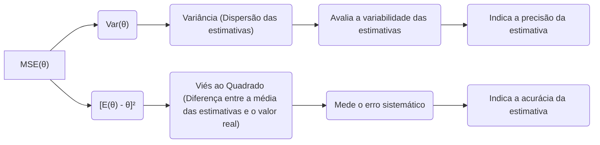
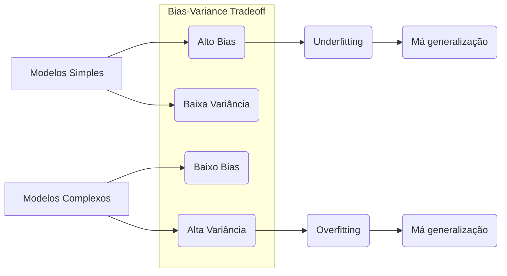
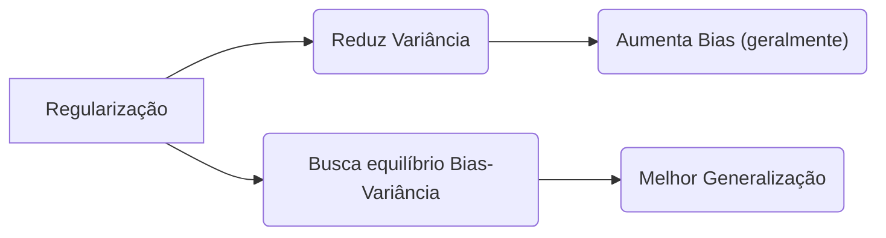

## Decomposição do Erro Quadrático Médio (MSE): Var(θ) + [E(θ) - θ]²

### Introdução
A decomposição do **Erro Quadrático Médio (MSE)** em **Variância** e **Viés ao quadrado** é um resultado fundamental na teoria da estimação estatística, e é essencial para entender as propriedades dos estimadores e o *tradeoff* entre *bias* e *variance*. O MSE quantifica a acurácia de um estimador em relação ao valor real do parâmetro que se deseja estimar. Esta seção explorará em detalhe a formulação matemática da decomposição do MSE, a interpretação de cada um dos componentes, e o seu papel na modelagem estatística.

### Definição do Erro Quadrático Médio (MSE)
O **Erro Quadrático Médio (MSE)** é uma métrica utilizada para avaliar a qualidade de um estimador $\hat{\theta}$ de um parâmetro desconhecido $\theta$. O MSE quantifica a diferença média quadrática entre a estimativa e o verdadeiro valor do parâmetro [^2]. Matematicamente, o MSE é definido como:
$$
MSE(\hat{\theta}) = E[(\hat{\theta} - \theta)^2]
$$
onde:
    -   $\hat{\theta}$ é o estimador do parâmetro $\theta$,
    -   $\theta$ é o valor real do parâmetro, que é, em geral, desconhecido,
    - $E$ denota o valor esperado da expressão.
O MSE representa um valor que quantifica o erro médio quadrado das estimativas do parâmetro, e uma métrica que penaliza valores longe do valor verdadeiro com maior peso.

### A Decomposição do MSE em Viés e Variância

A decomposição do MSE é um resultado importante que divide o erro total em duas componentes: viés e variância, e é dada por:

$$
MSE(\hat{\theta}) = Var(\hat{\theta}) + [E(\hat{\theta}) - \theta]^2
$$
onde:

-   $Var(\hat{\theta})$ é a **variância** do estimador $\hat{\theta}$, que mede a dispersão das estimativas em torno da sua média:
$$
Var(\hat{\theta}) = E[(\hat{\theta} - E[\hat{\theta}])^2]
$$
-  $[E(\hat{\theta}) - \theta]^2$ é o quadrado do **viés** do estimador, que mede a diferença entre o valor esperado do estimador e o valor verdadeiro do parâmetro $\theta$:
$$
Bias^2(\hat{\theta}) = [E(\hat{\theta}) - \theta]^2
$$

O primeiro termo, a variância, quantifica o quanto as estimativas do parâmetro variam entre diferentes amostras, e o segundo termo, o quadrado do viés, quantifica o quanto a média da estimativa difere do valor verdadeiro do parâmetro.

### Derivação da Decomposição do MSE
A decomposição do MSE pode ser obtida a partir da sua definição original e da adição e remoção de $E[\hat{\theta}]$ na expressão.
Partindo da definição do MSE:
$$
MSE(\hat{\theta}) = E[(\hat{\theta} - \theta)^2]
$$
Podemos adicionar e subtrair $E[\hat{\theta}]$ no termo do quadrado:
$$
MSE(\hat{\theta}) = E[(\hat{\theta} - E[\hat{\theta}] + E[\hat{\theta}] - \theta)^2]
$$
Expandindo o termo do quadrado:
$$
MSE(\hat{\theta}) = E[(\hat{\theta} - E[\hat{\theta}])^2 + 2(\hat{\theta} - E[\hat{\theta}])(E[\hat{\theta}] - \theta) + (E[\hat{\theta}] - \theta)^2]
$$
Como a esperança da soma é a soma das esperanças, podemos escrever:
$$
MSE(\hat{\theta}) = E[(\hat{\theta} - E[\hat{\theta}])^2] + 2E[(\hat{\theta} - E[\hat{\theta}])(E[\hat{\theta}] - \theta)] + E[(E[\hat{\theta}] - \theta)^2]
$$
O segundo termo da soma é zero, já que $E[\hat{\theta} - E[\hat{\theta}]] = 0$ e $E[\hat{\theta}] - \theta$ é uma constante e podemos escrevê-lo fora da esperança, e portanto:
$$
MSE(\hat{\theta}) = E[(\hat{\theta} - E[\hat{\theta}])^2] + [E(\hat{\theta}) - \theta]^2
$$
Reconhecendo os termos de variância e viés, obtemos a fórmula da decomposição:
$$
MSE(\hat{\theta}) = Var(\hat{\theta}) + [E(\hat{\theta}) - \theta]^2
$$
Esta expressão demonstra como o erro quadrático médio pode ser decomposto em termos do viés e da variância.

> 💡 **Exemplo Numérico:**
> Vamos considerar um exemplo simples para ilustrar a decomposição do MSE. Suponha que queremos estimar a média $\theta$ de uma população usando a média amostral $\hat{\theta}$ de uma amostra de tamanho $n$. Sabemos que $E[\hat{\theta}] = \theta$ (o estimador é não viesado) e $Var(\hat{\theta}) = \frac{\sigma^2}{n}$, onde $\sigma^2$ é a variância da população.
>
> Vamos assumir que $\theta = 5$, $\sigma^2 = 4$ e $n=10$.
>
> 1.  **Viés:** Como $E[\hat{\theta}] = \theta$, o viés é $E[\hat{\theta}] - \theta = 5 - 5 = 0$. Portanto, o viés ao quadrado é $0^2 = 0$.
> 2.  **Variância:** $Var(\hat{\theta}) = \frac{\sigma^2}{n} = \frac{4}{10} = 0.4$.
> 3.  **MSE:** $MSE(\hat{\theta}) = Var(\hat{\theta}) + [E(\hat{\theta}) - \theta]^2 = 0.4 + 0 = 0.4$
>
> Agora, suponha que temos um estimador viesado $\hat{\theta}'$ tal que $E[\hat{\theta}'] = 5.2$ e $Var(\hat{\theta}') = 0.1$.
>
> 1.  **Viés:** $E[\hat{\theta}'] - \theta = 5.2 - 5 = 0.2$. O viés ao quadrado é $0.2^2 = 0.04$.
> 2.  **Variância:** $Var(\hat{\theta}') = 0.1$.
> 3.  **MSE:** $MSE(\hat{\theta}') = Var(\hat{\theta}') + [E(\hat{\theta}') - \theta]^2 = 0.1 + 0.04 = 0.14$.
>
> Neste exemplo, embora o segundo estimador tenha um viés, seu MSE é menor porque sua variância é muito menor, ilustrando o *tradeoff* entre viés e variância.

**Lemma 28:** A Relação entre MSE, Bias, e Variance
A decomposição do MSE formaliza o conceito do *Bias-Variance Tradeoff* que indica que a minimização do MSE exige um compromisso entre o viés e a variância. Em geral, modelos mais simples tem alto bias e baixa variância, e modelos mais complexos tem baixo bias e alta variância. Encontrar o equilíbrio ideal entre bias e variância é fundamental no desenvolvimento de modelos de aprendizado de máquina que generalizam bem para dados não vistos.

**Prova do Lemma 28:**
Modelos com alto bias tendem a subestimar ou superestimar o valor verdadeiro do parâmetro, levando a um erro sistemático, enquanto modelos com alta variância tem estimativas muito sensíveis a flutuações dos dados de treinamento, levando a um erro aleatório. O termo de bias ao quadrado $ [E(\hat{\theta}) - \theta]^2$ quantifica o erro sistemático, enquanto a variância $Var(\hat{\theta}) = E[(\hat{\theta} - E[\hat{\theta}])^2]$ quantifica o erro aleatório. Minimizar o MSE implica buscar um equilíbrio entre os dois, já que tentar diminuir um, muitas vezes aumenta o outro. $\blacksquare$

> 💡 **Exemplo Numérico:**
> Imagine que estamos tentando ajustar um modelo de regressão a um conjunto de dados.
>
> *   **Modelo 1 (Simples):** Um modelo linear simples (ex: $y = ax + b$) pode ter um alto viés porque ele não consegue capturar a complexidade dos dados. No entanto, a variância será baixa, pois o modelo é pouco sensível a variações nos dados de treinamento.
> *   **Modelo 2 (Complexo):** Um modelo polinomial de alta ordem (ex: $y = ax^5 + bx^4 + cx^3 + dx^2 + ex + f$) pode ter baixo viés porque consegue ajustar os dados de treinamento muito bem, mas terá alta variância pois ele se adapta muito às particularidades dos dados, incluindo ruído, e pode não generalizar bem.
>
> Suponha que, após um experimento, obtemos os seguintes valores de MSE, viés ao quadrado e variância para os dois modelos:
>
> | Modelo   | MSE   | Viés² | Variância |
> |----------|-------|-------|-----------|
> | Modelo 1 | 0.8   | 0.7   | 0.1       |
> | Modelo 2 | 0.5   | 0.05  | 0.45      |
>
> O Modelo 1 tem um alto viés, indicando um *underfitting*, enquanto o Modelo 2 tem uma alta variância, indicando *overfitting*. O modelo 2 tem um MSE menor, embora a sua variância seja alta. O ideal seria encontrar um modelo intermediário que equilibre o viés e a variância.

**Corolário 28:**  O Objetivo da Regularização
O Corolário 28 demonstra que as técnicas de regularização e de seleção de modelos buscam o equilíbrio entre o viés e a variância. Em geral, a regularização reduz a variância, ao custo de aumentar o bias. A escolha do tipo e intensidade da regularização depende do problema em questão, dos seus objetivos e das preferências do modelador.

> 💡 **Exemplo Numérico:**
> Vamos considerar a aplicação de regularização Ridge em um modelo de regressão linear. Suponha que temos um conjunto de dados e ajustamos um modelo linear com e sem regularização.
>
> **Modelo sem Regularização (OLS):**
> *   Obtemos um MSE de 0.6, uma variância de 0.5 e um viés ao quadrado de 0.1.
>
> **Modelo com Regularização Ridge (λ=0.1):**
> *   Obtemos um MSE de 0.4, uma variância de 0.3 e um viés ao quadrado de 0.1.
>
> **Modelo com Regularização Ridge (λ=1):**
> *   Obtemos um MSE de 0.5, uma variância de 0.2 e um viés ao quadrado de 0.3.
>
> Podemos observar que, à medida que aumentamos o parâmetro de regularização λ, a variância diminui, mas o viés aumenta. No caso de λ=0.1, obtivemos um MSE menor do que o modelo sem regularização. O valor ótimo de λ depende do problema e deve ser determinado através de validação cruzada.

###  Interpretação Prática da Decomposição do MSE
A decomposição do MSE tem várias implicações na prática da modelagem estatística:
    1.  **A Importância da Validação Cruzada**: A decomposição do MSE explica o uso da validação cruzada na seleção de modelos, já que a validação cruzada avalia a performance do modelo em dados não vistos, que é o objetivo principal de se criar um modelo. Ao usar a validação cruzada, avaliamos indiretamente a soma do viés e da variância, na esperança de encontrar um valor que equilibre ambos.
    2. **O Uso da Regularização**: A regularização, através da adição de uma penalidade, promove um aumento do viés, em troca da redução da variância, e o parâmetro de regularização controla este *tradeoff*.
    3. **Seleção de Modelos**: A escolha entre diferentes modelos é feita de forma a equilibrar o *bias* e a *variance*, escolhendo modelos que são simples o suficiente para ter boa capacidade de generalização, mas que também tenham um baixo *bias*. Modelos com baixa complexidade podem sofrer de *underfitting*, levando a um alto *bias*. Modelos complexos, por outro lado, sofrem de *overfitting*, com alta *variance* e má capacidade de generalizar.
    4. **Base para Escolha de Métricas:**  Modelos com alto *bias* e modelos com alta *variance* podem levar a diferentes métricas de desempenho, e o entendimento do *Bias-Variance Tradeoff* auxilia a entender quais métricas devem ser consideradas na escolha do modelo.
    5.  **A Importância do Nível de Ruído dos Dados:** Em cenários onde a variância do erro é muito alta (alto nível de ruído nos dados), é mais importante reduzir o *overfitting* através da regularização. Em cenários com baixo ruído, modelos mais complexos (e com baixo *bias*) podem ser apropriados.

> 💡 **Exemplo Numérico:**
> Vamos supor que estamos modelando dados com muito ruído. Usamos um modelo muito complexo (alta variância, baixo viés) e um modelo mais simples (baixa variância, alto viés).
>
> **Modelo Complexo (Overfitting):**
> *   O modelo se ajusta muito bem aos dados de treinamento, mas não generaliza bem para novos dados. O MSE nos dados de treinamento é baixo, mas o MSE em dados de validação é alto.
> *   A variância é alta, pois o modelo é muito sensível ao ruído nos dados.
>
> **Modelo Simples (Underfitting):**
> *   O modelo não consegue capturar a complexidade dos dados de treinamento. O MSE nos dados de treinamento é alto, e o MSE em dados de validação também é alto.
> *   O viés é alto, pois o modelo subestima ou superestima o valor verdadeiro.
>
> Num cenário de alto ruído, o modelo simples, apesar de não ser perfeito, pode ter um desempenho melhor em dados de validação porque a sua variância é menor. A regularização é uma técnica que pode ser usada para melhorar o desempenho do modelo complexo, diminuindo a variância.

> ⚠️ **Nota Importante**: O Erro Quadrático Médio (MSE) é decomposto em Variância e Viés ao Quadrado: $MSE(\hat{\theta}) = Var(\hat{\theta}) + [E(\hat{\theta}) - \theta]^2$. **Referência ao contexto [^3]**.

> ❗ **Ponto de Atenção**:  O *Bias-Variance Tradeoff* implica que é necessário um compromisso entre o viés (erro sistemático) e a variância (erro aleatório) para minimizar o erro total. **Conforme indicado no contexto [^2]**.

> ✔️ **Destaque**: A decomposição do MSE fornece uma base teórica para avaliar a qualidade dos estimadores, e para a escolha das técnicas de regularização e seleção de modelos. **Baseado no contexto [^3]**.

### Conclusão
A decomposição do Erro Quadrático Médio (MSE) em variância e bias ao quadrado oferece uma compreensão profunda das propriedades dos estimadores e do *tradeoff* fundamental entre *bias* e *variance*. O conhecimento das componentes do erro é fundamental para a escolha dos métodos de estimação e da complexidade dos modelos, garantindo a obtenção de modelos com boa performance e capacidade de generalização.

### Referências
[^3]: "From a statistical point of view, this criterion is reasonable if the training observations (xi, Yi) represent independent random draws from their population." *(Trecho de Linear Methods for Regression)*
[^2]: "For prediction purposes they can sometimes outperform fancier nonlinear models, especially in situations with small numbers of training cases, low signal-to-noise ratio or sparse data." *(Trecho de Linear Methods for Regression)*
[^47]: "The N-p-1 rather than N in the denominator makes 6 an unbiased estimate of σ2: E(2) = σ2." *(Trecho de Linear Methods for Regression)*
