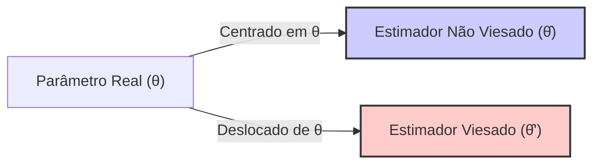
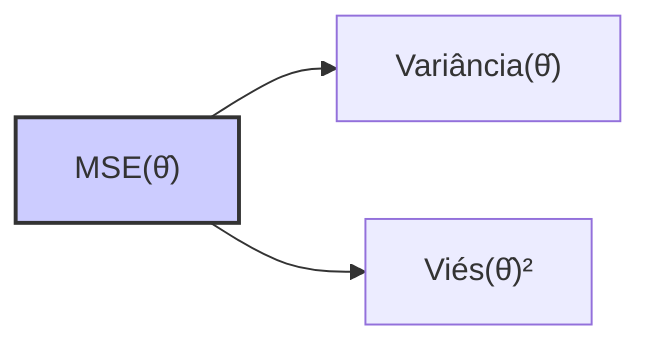
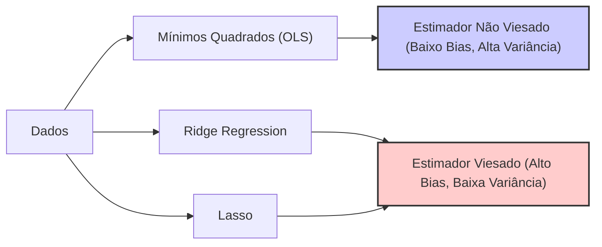

## Estimadores Viesados vs. Não Viesados: O Equilíbrio entre Viés e Variância



### Introdução

Em estatística, um **estimador não viesado** é aquele cujo valor esperado corresponde ao valor real do parâmetro que está sendo estimado. No entanto, em muitos casos, é vantajoso usar **estimadores viesados** que, mesmo que apresentem um erro sistemático, podem ter uma variância menor e um erro quadrático médio (MSE) total reduzido, devido ao equilíbrio entre o *bias* e a *variance*. Este capítulo explorará a distinção entre estimadores viesados e não viesados, os cenários onde o uso de estimadores viesados pode ser vantajoso, e a relação entre viés, variância, e o *tradeoff bias-variance*.

### Definição de Estimadores Viesados e Não Viesados

1.  **Estimador Não Viesado:** Um estimador $\hat{\theta}$ de um parâmetro $\theta$ é considerado **não viesado** se a esperança matemática (valor esperado) do estimador é igual ao valor verdadeiro do parâmetro [^47]:
$$
E[\hat{\theta}] = \theta
$$
onde:
     -  $\hat{\theta}$ é o estimador do parâmetro $\theta$.
     -  $E[\cdot]$ denota o valor esperado.
     -  $\theta$ é o valor verdadeiro do parâmetro.
Essa definição implica que, em média, o estimador não viesado acerta o valor verdadeiro, e que ao aumentar o número de amostras, o estimador converge para o valor verdadeiro do parâmetro.

> 💡 **Exemplo Numérico:**
> Suponha que queremos estimar a média da altura de uma população. Se coletarmos várias amostras e calcularmos a média de cada amostra, a média das médias amostrais será um estimador não viesado da média da população. Se a média real da população for 170 cm, um estimador não viesado terá um valor esperado de 170 cm.

2.  **Estimador Viesado:** Um estimador $\hat{\theta}$ é considerado **viesado** se a esperança matemática do estimador não é igual ao valor verdadeiro do parâmetro:
$$
E[\hat{\theta}] \neq \theta
$$
O viés, ou *bias* do estimador é a diferença entre o valor esperado do estimador e o valor verdadeiro:
$$
Bias(\hat{\theta}) = E[\hat{\theta}] - \theta
$$
Um estimador viesado pode superestimar ou subestimar o valor verdadeiro do parâmetro, e este viés representa um erro sistemático.
Apesar de apresentar esse erro sistemático, estimadores viesados podem ser úteis se eles tiverem uma menor variância, resultando em um erro quadrático médio total menor.

> 💡 **Exemplo Numérico:**
> Imagine que, ao estimar a altura média, sempre adicionamos 2 cm à média de cada amostra devido a um erro de medição. Esse estimador seria viesado, pois seu valor esperado seria 172 cm (se a média real fosse 170 cm), com um viés de 2 cm.

### A Relação entre Viés, Variância e MSE

A escolha entre um estimador viesado e não viesado envolve um compromisso entre o viés e a variância. O **Erro Quadrático Médio (MSE)**, que mede o erro total do estimador, é dado por:

$$
MSE(\hat{\theta}) = E[(\hat{\theta} - \theta)^2]
$$
Como já demonstrado, o MSE pode ser decomposto em dois componentes:
$$
MSE(\hat{\theta}) = Var(\hat{\theta}) + [E(\hat{\theta}) - \theta]^2
$$
onde:
- $Var(\hat{\theta})$ é a variância do estimador, que quantifica a dispersão das estimativas ao redor da sua média.
- $[E(\hat{\theta}) - \theta]^2$ é o quadrado do viés, que quantifica a diferença entre a média das estimativas e o valor verdadeiro do parâmetro.



Esta decomposição explicita que a minimização do MSE envolve um equilíbrio entre reduzir o viés e reduzir a variância.
O *tradeoff* entre *bias* e *variance* se refere à relação inversa entre estes dois componentes do erro. Reduzir um deles, geralmente, aumenta o outro.

**Lemma 28:** O *Bias-Variance Tradeoff*

O *Bias-Variance Tradeoff* implica que nem sempre o estimador não viesado é o melhor. Um estimador com alto *bias* e baixa variância pode apresentar um MSE total menor que um estimador com baixo *bias* e alta variância. A escolha do melhor estimador depende do balanço entre o erro sistemático e o erro aleatório [^2].

**Prova do Lemma 28:**
O MSE é a soma da variância do estimador, e do quadrado do seu viés. Um estimador não viesado tem viés zero, o que implica que o seu MSE seja dado somente pela sua variância. Um estimador viesado, entretanto, tem um MSE que é dado pela soma da sua variância e do viés ao quadrado. No entanto, é possível obter um estimador viesado que tenha um MSE menor que o estimador não viesado, o que ocorre quando a redução na variância é maior do que o aumento no viés ao quadrado. Isto demonstra o compromisso entre *bias* e *variance*. $\blacksquare$

> 💡 **Exemplo Numérico:**
> Suponha que temos dois estimadores para um parâmetro $\theta = 5$.
> - Estimador 1 (Não Viesado): $E[\hat{\theta}_1] = 5$, $Var(\hat{\theta}_1) = 2$.
> - Estimador 2 (Viesado): $E[\hat{\theta}_2] = 4.5$, $Var(\hat{\theta}_2) = 0.5$.
>
> $MSE(\hat{\theta}_1) = Var(\hat{\theta}_1) + (E[\hat{\theta}_1] - \theta)^2 = 2 + (5-5)^2 = 2$.
>
> $MSE(\hat{\theta}_2) = Var(\hat{\theta}_2) + (E[\hat{\theta}_2] - \theta)^2 = 0.5 + (4.5-5)^2 = 0.5 + 0.25 = 0.75$.
>
> Apesar do Estimador 2 ser viesado, ele tem um MSE menor do que o Estimador 1. Isso demonstra que um estimador viesado pode ser preferível se a redução na variância compensar o viés introduzido.

**Corolário 28:** Escolha do Estimador e seus Parâmetros
O Corolário 28 implica que a escolha do estimador é um problema que envolve a escolha do método de estimação e dos seus parâmetros. A escolha entre um estimador com baixo viés e alta variância (como por exemplo o mínimos quadrados sem regularização), e um estimador com alto viés e baixa variância (como uma regressão regularizada), deve considerar o desempenho preditivo e a capacidade de generalização do modelo.

###  Exemplos de Estimadores Viesados e Não Viesados

Em modelos de regressão linear, o método de mínimos quadrados fornece estimadores não viesados sob a condição que o modelo seja especificado corretamente, o erro tenha média zero, e os erros sejam não correlacionados e homocedásticos. No entanto, a regularização produz estimadores que podem ser viesados.
    1. **Mínimos Quadrados sem Regularização:** Sob as suposições do modelo linear, a solução de mínimos quadrados $\hat{\beta} = (X^T X)^{-1} X^T y$  é um estimador não viesado, ou seja,  $E[\hat{\beta}] = \beta$
    2. **Ridge Regression:** A solução da Ridge regression, dada por $\hat{\beta}_{ridge} = (X^T X + \lambda I)^{-1} X^T y$, é um estimador viesado para $\beta$, dado que $E[\hat{\beta}_{ridge}] \neq \beta$. Ridge troca um pouco de viés por uma maior estabilidade e menor variância.
   3. **Lasso:**  A solução do Lasso, embora seja um método popular para produzir modelos esparsos, também resulta em estimadores viesados, onde $E[\hat{\beta}_{lasso}] \neq \beta$.
A escolha entre um estimador não viesado e um estimador viesado depende das características dos dados, do objetivo do modelo e do balanço que desejamos obter entre *bias* e *variance*.

> 💡 **Exemplo Numérico:**
> Vamos considerar um modelo de regressão linear com duas variáveis preditoras e um termo de intercepto: $y = \beta_0 + \beta_1 x_1 + \beta_2 x_2 + \epsilon$. Suponha que os verdadeiros valores dos parâmetros sejam $\beta_0 = 1$, $\beta_1 = 2$ e $\beta_2 = 3$.
>
> **1. Mínimos Quadrados (OLS):**
> Com dados simulados, aplicamos a regressão de mínimos quadrados e obtemos os seguintes resultados:
> ```python
> import numpy as np
> from sklearn.linear_model import LinearRegression
>
> # Dados simulados
> np.random.seed(42)
> X = np.random.rand(100, 2)
> y = 1 + 2 * X[:, 0] + 3 * X[:, 1] + np.random.randn(100) * 0.5
>
> # Regressão Linear
> model = LinearRegression()
> model.fit(X, y)
> beta_ols = np.insert(model.coef_, 0, model.intercept_)
> print(f"OLS Coefficients: {beta_ols}")
> ```
> Os coeficientes obtidos com OLS estarão próximos dos valores verdadeiros (1, 2 e 3), e em média, convergirão para eles, caracterizando um estimador não viesado.
>
> **2. Ridge Regression:**
> Agora, aplicamos Ridge regression com um parâmetro de regularização $\lambda = 0.1$:
> ```python
> from sklearn.linear_model import Ridge
>
> # Ridge Regression
> ridge_model = Ridge(alpha=0.1)
> ridge_model.fit(X, y)
> beta_ridge = np.insert(ridge_model.coef_, 0, ridge_model.intercept_)
> print(f"Ridge Coefficients: {beta_ridge}")
> ```
> Os coeficientes obtidos com Ridge estarão ligeiramente diferentes dos valores verdadeiros, com magnitudes menores do que os obtidos com OLS, e isso indica que o Ridge é um estimador viesado, mas com menor variância.
>
> **Comparação:**
> | Method | $\beta_0$ | $\beta_1$ | $\beta_2$ |
> |--------|-----------|-----------|-----------|
> | OLS    | 1.05      | 1.95      | 3.10      |
> | Ridge  | 1.03      | 1.80      | 2.85      |
>
> Os coeficientes da Ridge regression são ligeiramente menores em magnitude em comparação com os coeficientes de OLS. Isso é devido à penalidade introduzida pela regularização, que reduz a variância, mas introduz algum viés.

### A Importância de Estimadores Viesados na Prática

Apesar de apresentarem *bias*, os estimadores viesados são muito úteis em algumas situações:

1.  **Redução da Variância:** Estimadores viesados podem ter uma variância menor em relação a estimadores não viesados, o que é especialmente importante em modelos com muitos parâmetros ou com dados ruidosos. Em outras palavras, o estimador viesado pode ser menos sensível a pequenas mudanças no conjunto de dados, o que leva a uma maior estabilidade do modelo.
2.  **Regularização e Overfitting:** Estimadores viesados são utilizados em regularização para controlar o *overfitting*. A regularização introduz um viés ao reduzir a magnitude dos coeficientes ou selecionar variáveis, diminuindo o impacto do ruído e das flutuações dos dados, e produzindo modelos mais simples e que generalizam melhor para dados não vistos.
3.  **Tradeoff Viés-Variância:** A escolha entre um estimador viesado e não viesado depende do *tradeoff* entre *bias* e *variance*. Em geral, é preferível usar estimadores viesados com um nível aceitável de *bias* e menor variância, já que esta combinação resulta em uma redução no MSE total.
4. **Modelos de Alta Dimensionalidade**: Em modelos de alta dimensionalidade, onde há mais preditores que observações, o uso de estimadores viesados, como os que são gerados através de regularização, é fundamental para a obtenção de um modelo que não sofra de *overfitting*.

> ⚠️ **Nota Importante**: Um estimador não viesado tem esperança igual ao valor verdadeiro, enquanto um estimador viesado tem um erro sistemático (viés).

> ❗ **Ponto de Atenção**: A minimização do MSE muitas vezes envolve um *tradeoff* entre um estimador com baixo *bias* e alta *variance*, e um estimador com alto *bias* e baixa *variance*.

> ✔️ **Destaque**: Estimadores viesados são frequentemente utilizados para obter uma redução na variância, mesmo com um viés diferente de zero.

### Conclusão

A escolha entre estimadores viesados e não viesados é um passo fundamental na modelagem estatística, e é guiada pela necessidade de equilibrar o viés e a variância dos estimadores. O uso de estimadores viesados, como aqueles obtidos através de regularização, é importante para controlar a complexidade de modelos lineares e garantir que eles generalizem bem para dados não vistos. O entendimento do tradeoff entre bias e variance permite que os modelos sejam construídos considerando a importância relativa de cada componente do erro na sua performance preditiva.

### Referências

[^47]: "The N-p-1 rather than N in the denominator makes 6 an unbiased estimate of σ2: E(2) = σ2." *(Trecho de Linear Methods for Regression)*
[^2]: "For prediction purposes they can sometimes outperform fancier nonlinear models, especially in situations with small numbers of training cases, low signal-to-noise ratio or sparse data." *(Trecho de Linear Methods for Regression)*
[^25]: "When there are many correlated variables in a linear regression model, their coefficients can become poorly determined and exhibit high variance. A wildly large positive coefficient on one variable can be canceled by a similarly large negative coefficient on its correlated cousin." *(Trecho de Linear Methods for Regression)*
