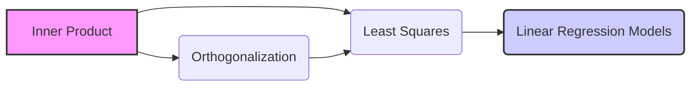
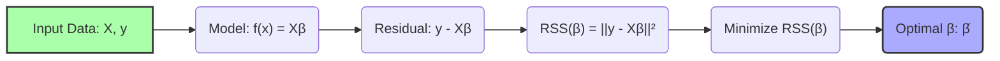
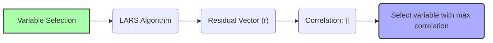
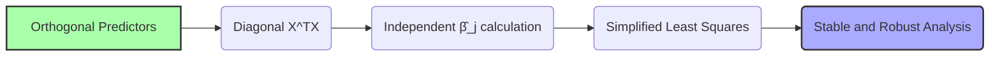

## Inner Product Notation and its Relationship to Multiple Regression

### Introdução

A **notação de produto interno** oferece uma maneira concisa e poderosa de expressar relações geométricas e algébricas em modelos de regressão linear [^1]. A compreensão de como essa notação se conecta com os conceitos de **ortogonalização** e **mínimos quadrados** é fundamental para uma análise aprofundada e para derivar intuições valiosas sobre o comportamento dos modelos de regressão [^2]. Este capítulo explora essa conexão de maneira detalhada.

### Conceitos Fundamentais

Antes de mergulharmos nas aplicações específicas da notação de produto interno, revisaremos alguns conceitos fundamentais [^4]:

**Conceito 1: Produto Interno**

O **produto interno (inner product)**, também conhecido como produto escalar, é uma função que associa dois vetores a um escalar. Para dois vetores $x = (x_1, x_2, \ldots, x_n)$ e $y = (y_1, y_2, \ldots, y_n)$, o produto interno é definido como [^5]:

$$<x,y> = x^Ty = \sum_{i=1}^{n} x_i y_i$$

Em termos geométricos, o produto interno está relacionado ao cosseno do ângulo entre dois vetores e seus comprimentos [^6]. Um produto interno nulo significa que os vetores são ortogonais (perpendiculares) [^7].

> 💡 **Exemplo Numérico:**
> Considere dois vetores $x = (1, 2, 3)$ e $y = (4, 5, 6)$. O produto interno é calculado como:
>
> $<x, y> = (1 \times 4) + (2 \times 5) + (3 \times 6) = 4 + 10 + 18 = 32$
>
> Se tivéssemos $z = (-2, 1, 0)$, então:
>
> $<x, z> = (1 \times -2) + (2 \times 1) + (3 \times 0) = -2 + 2 + 0 = 0$. Isso significa que os vetores $x$ e $z$ são ortogonais.

**Lemma 1:** *A propriedade distributiva do produto interno afirma que para vetores $x$, $y$, e $z$, e um escalar $a$, temos: $<x, ay+z> = a<x,y> + <x,z>$* [^8]. Esta propriedade é essencial nas derivações matemáticas em regressão linear [^9].

> 💡 **Exemplo Numérico:**
> Sejam $x = (1, 2)$, $y = (3, 4)$, $z = (5, 6)$ e $a = 2$.
>
> Primeiro, calculamos $ay + z = 2 \times (3, 4) + (5, 6) = (6, 8) + (5, 6) = (11, 14)$.
>
> Então, $<x, ay+z> = <(1, 2), (11, 14)> = (1 \times 11) + (2 \times 14) = 11 + 28 = 39$.
>
> Agora, calculamos $a<x, y> + <x, z> = 2 \times <(1, 2), (3, 4)> + <(1, 2), (5, 6)> = 2 \times (1 \times 3 + 2 \times 4) + (1 \times 5 + 2 \times 6) = 2 \times (3 + 8) + (5 + 12) = 2 \times 11 + 17 = 22 + 17 = 39$.
>
> Assim, $<x, ay+z> = a<x,y> + <x,z>$, confirmando a propriedade distributiva.

**Conceito 2: Ortogonalidade**

Dois vetores são considerados **ortogonais** se seu produto interno é zero [^10]. Essa condição de ortogonalidade desempenha um papel crucial em várias decomposições matriciais e na construção de bases para espaços vetoriais [^11].

**Corolário 1:** *Se um conjunto de vetores é ortogonal, ou seja, todos os pares de vetores nesse conjunto são ortogonais, então esses vetores são linearmente independentes, exceto se algum deles for o vetor nulo* [^12]. Esta propriedade é crucial para a construção de bases ortogonais [^13].

> 💡 **Exemplo Numérico:**
> Considere os vetores $v_1 = (1, 0, 0)$, $v_2 = (0, 2, 0)$, e $v_3 = (0, 0, 3)$.  
>
> $<v_1, v_2> = (1 \times 0) + (0 \times 2) + (0 \times 0) = 0$
> $<v_1, v_3> = (1 \times 0) + (0 \times 0) + (0 \times 3) = 0$
> $<v_2, v_3> = (0 \times 0) + (2 \times 0) + (0 \times 3) = 0$
>
> Como todos os pares de vetores têm produto interno igual a zero, eles são ortogonais e, portanto, linearmente independentes.

**Conceito 3: Mínimos Quadrados**

O método dos **mínimos quadrados** busca encontrar os parâmetros de um modelo que minimizem a soma dos quadrados dos resíduos (RSS - Residual Sum of Squares) [^14]. Em regressão linear, este objetivo é expresso como [^15]:

$$ RSS(\beta) = \sum_{i=1}^{N} (y_i - f(x_i))^2 $$

onde $y_i$ é a resposta observada e $f(x_i)$ é a resposta predita pelo modelo linear [^16].

### Regressão Linear e Mínimos Quadrados com Produto Interno

A notação de produto interno é uma ferramenta poderosa para simplificar a formulação e análise dos modelos de regressão linear [^17]. Considere um modelo de regressão linear na forma:

$$ f(x) = \beta_0 + \sum_{j=1}^{p} x_j \beta_j $$

Onde $x$ é o vetor de preditores e $\beta$ é o vetor de coeficientes. O objetivo dos mínimos quadrados é encontrar o vetor $\beta$ que minimize o RSS [^18]. Usando a notação de produto interno, o RSS pode ser escrito como:

$$ RSS(\beta) = ||y - X\beta||^2 = <y - X\beta, y - X\beta> $$

Onde $y$ é o vetor de respostas observadas, $X$ é a matriz de preditores e $X\beta$ é o vetor de respostas preditas [^19].

**Lemma 2:** *A solução de mínimos quadrados $\hat{\beta}$ é obtida quando o vetor residual $y-X\hat{\beta}$ é ortogonal a cada coluna da matriz de preditores $X$* [^20]. Isso é expresso matematicamente como:

$$ X^T(y - X\hat{\beta}) = 0 $$

**Prova do Lemma 2:** O RSS é dado por $ RSS(\beta) = ||y-X\beta||^2 = (y-X\beta)^T(y-X\beta)$. Para minimizar o RSS, derivamos em relação a $\beta$ e igualamos a zero.
$$ \frac{\partial RSS(\beta)}{\partial \beta} = \frac{\partial}{\partial \beta} [(y-X\beta)^T(y-X\beta)] = -2X^T(y-X\beta) = 0 $$
Isso implica $ X^T(y-X\hat{\beta}) = 0 $. $\blacksquare$

A equação acima pode ser reescrita como:

$$ X^TX\hat{\beta} = X^Ty $$

Se a matriz $X^TX$ é invertível, a solução para $\hat{\beta}$ é dada por [^21]:

$$ \hat{\beta} = (X^TX)^{-1}X^Ty $$

> 💡 **Exemplo Numérico:**
> Vamos considerar um exemplo simples com 3 observações e um preditor (além do intercepto). Suponha que temos:
>
> $X = \begin{bmatrix} 1 & 2 \\ 1 & 3 \\ 1 & 4 \end{bmatrix}$ e $y = \begin{bmatrix} 5 \\ 6 \\ 8 \end{bmatrix}$
>
> **Step 1: Calculate $X^T$**
>
> $X^T = \begin{bmatrix} 1 & 1 & 1 \\ 2 & 3 & 4 \end{bmatrix}$
>
> **Step 2: Calculate $X^TX$**
>
> $X^TX = \begin{bmatrix} 1 & 1 & 1 \\ 2 & 3 & 4 \end{bmatrix} \begin{bmatrix} 1 & 2 \\ 1 & 3 \\ 1 & 4 \end{bmatrix} = \begin{bmatrix} 3 & 9 \\ 9 & 29 \end{bmatrix}$
>
> **Step 3: Calculate $(X^TX)^{-1}$**
>
> The inverse of a 2x2 matrix $\begin{bmatrix} a & b \\ c & d \end{bmatrix}$ is $\frac{1}{ad-bc}\begin{bmatrix} d & -b \\ -c & a \end{bmatrix}$.
>
> $(X^TX)^{-1} = \frac{1}{(3 \times 29) - (9 \times 9)} \begin{bmatrix} 29 & -9 \\ -9 & 3 \end{bmatrix} = \frac{1}{87 - 81} \begin{bmatrix} 29 & -9 \\ -9 & 3 \end{bmatrix} = \frac{1}{6}\begin{bmatrix} 29 & -9 \\ -9 & 3 \end{bmatrix} = \begin{bmatrix} 29/6 & -3/2 \\ -3/2 & 1/2 \end{bmatrix}$
>
> **Step 4: Calculate $X^Ty$**
>
> $X^Ty = \begin{bmatrix} 1 & 1 & 1 \\ 2 & 3 & 4 \end{bmatrix} \begin{bmatrix} 5 \\ 6 \\ 8 \end{bmatrix} = \begin{bmatrix} 19 \\ 55 \end{bmatrix}$
>
> **Step 5: Calculate $\hat{\beta} = (X^TX)^{-1}X^Ty$**
>
> $\hat{\beta} = \begin{bmatrix} 29/6 & -3/2 \\ -3/2 & 1/2 \end{bmatrix} \begin{bmatrix} 19 \\ 55 \end{bmatrix} = \begin{bmatrix} (29/6) \times 19 + (-3/2) \times 55 \\ (-3/2) \times 19 + (1/2) \times 55 \end{bmatrix} = \begin{bmatrix} 551/6 - 165/2 \\ -57/2 + 55/2 \end{bmatrix} = \begin{bmatrix} 551/6 - 495/6 \\ -2/2 \end{bmatrix} = \begin{bmatrix} 56/6 \\ -1 \end{bmatrix} = \begin{bmatrix} 28/3 \\ -1 \end{bmatrix} \approx \begin{bmatrix} 9.33 \\ -1 \end{bmatrix}$
>
> Portanto, $\hat{\beta}_0 \approx 9.33$ e $\hat{\beta}_1 = -1$. O modelo de regressão linear ajustado é então: $\hat{y} = 9.33 - 1x$

**Corolário 2:** *Quando as colunas de $X$ são ortogonais, isto é, $<x_i, x_j> = 0$ para $i \neq j$, então a matriz $X^TX$ é diagonal, simplificando o cálculo da solução de mínimos quadrados* [^22]. Neste caso, os coeficientes $\hat{\beta_j}$ podem ser calculados independentemente como:

$$ \hat{\beta_j} = \frac{<x_j,y>}{<x_j,x_j>} $$

> 💡 **Exemplo Numérico:**
> Suponha que temos uma matriz $X$ com colunas ortogonais:
>
> $X = \begin{bmatrix} 1 & 1 & 1 \\ 1 & -1 & 0 \\ 0 & 0 & 1 \end{bmatrix}$ e $y = \begin{bmatrix} 2 \\ 1 \\ 3 \end{bmatrix}$
>
> As colunas de X são ortogonais pois:
>
> $<x_1, x_2> = (1 \times 1) + (1 \times -1) + (0 \times 0) = 0$
> $<x_1, x_3> = (1 \times 1) + (1 \times 0) + (0 \times 1) = 0$
> $<x_2, x_3> = (1 \times 1) + (-1 \times 0) + (0 \times 1) = 0$
>
> **Step 1: Calculate $\hat{\beta}_0$**
>
> $\hat{\beta}_0 = \frac{<x_0, y>}{<x_0, x_0>} = \frac{(1 \times 2) + (1 \times 1) + (1 \times 3)}{(1 \times 1) + (1 \times 1) + (1 \times 1)} = \frac{2 + 1 + 3}{1 + 1 + 1} = \frac{6}{3} = 2$
>
> **Step 2: Calculate $\hat{\beta}_1$**
>
> $\hat{\beta}_1 = \frac{<x_1, y>}{<x_1, x_1>} = \frac{(1 \times 2) + (-1 \times 1) + (0 \times 3)}{(1 \times 1) + (-1 \times -1) + (0 \times 0)} = \frac{2 - 1 + 0}{1 + 1 + 0} = \frac{1}{2} = 0.5$
>
> **Step 3: Calculate $\hat{\beta}_2$**
>
> $\hat{\beta}_2 = \frac{<x_2, y>}{<x_2, x_2>} = \frac{(1 \times 2) + (0 \times 1) + (1 \times 3)}{(1 \times 1) + (0 \times 0) + (1 \times 1)} = \frac{2 + 0 + 3}{1 + 0 + 1} = \frac{5}{2} = 2.5$
>
> Portanto, $\hat{\beta} = \begin{bmatrix} 2 \\ 0.5 \\ 2.5 \end{bmatrix}$
>
> Observe como o cálculo se torna direto quando as colunas de $X$ são ortogonais.

Isso mostra a importância da ortogonalidade na simplificação da análise em regressão linear.

### Métodos de Seleção de Variáveis e Produto Interno

A notação de produto interno também é relevante na seleção de variáveis e em algoritmos como o LARS (Least Angle Regression) [^23]. No LARS, os coeficientes são atualizados de forma que o vetor residual seja sempre igualmente correlacionado com as variáveis ativas [^24]. A correlação pode ser expressa através do produto interno, e a lógica do LARS é construir o caminho de soluções ajustando os coeficientes de acordo com essas relações [^25].

**Lemma 3:** *No algoritmo LARS, em cada passo, a variável que entra no conjunto ativo é aquela que possui maior correlação (em valor absoluto) com o vetor residual corrente* [^26]. Isso é definido matematicamente como:

$$ j = \text{argmax}_i  |<x_i, r>| $$

onde $x_i$ são as variáveis candidatas e $r$ é o vetor residual [^27].

**Prova do Lemma 3:** No algoritmo LARS, as variáveis ativas são atualizadas de forma que os coeficientes sigam um caminho que mantenha a mesma correlação (em módulo) com o resíduo, ou seja, mantendo  $|<x_j, r>|$ constante para as variáveis no conjunto ativo. A variável que entra no modelo é aquela que está mais correlacionada, o que leva à equação acima. $\blacksquare$

**Corolário 3:** *As etapas do LARS podem ser interpretadas como uma busca iterativa por um conjunto de variáveis que maximiza a correlação com o resíduo, através da manipulação inteligente dos produtos internos* [^28]. Isso demonstra como o produto interno e a correlação são instrumentais no entendimento do funcionamento de algoritmos de seleção de variáveis [^29].

> 💡 **Exemplo Numérico:**
> Vamos supor que temos um resíduo $r = (1, 2, -1)$ e duas variáveis candidatas $x_1 = (0.5, 1, 0.5)$ e $x_2 = (1, 0, -1)$. Queremos determinar qual variável entra primeiro no modelo LARS.
>
> **Step 1: Calculate $|<x_1, r>|$**
>
> $|<x_1, r>| = |(0.5 \times 1) + (1 \times 2) + (0.5 \times -1)| = |0.5 + 2 - 0.5| = |2| = 2$
>
> **Step 2: Calculate $|<x_2, r>|$**
>
> $|<x_2, r>| = |(1 \times 1) + (0 \times 2) + (-1 \times -1)| = |1 + 0 + 1| = |2| = 2$
>
> Neste caso, as duas variáveis têm a mesma correlação com o resíduo. Em um cenário real, o LARS escolheria uma delas (por exemplo, a primeira) e continuaria o processo. Se $x_2 = (1, 0, 0)$, então $|<x_2, r>| = |(1 \times 1) + (0 \times 2) + (0 \times -1)| = |1| = 1$. Neste caso, $x_1$ entraria primeiro.

### Regularização e Produto Interno

Na **regularização**, a notação de produto interno também se mostra valiosa. Na **Ridge Regression**, por exemplo, o objetivo é minimizar:

$$ \underset{\beta}{\text{min}} ||y - X\beta||^2 + \lambda ||\beta||^2 $$

Este termo de penalidade pode ser reescrito como $\lambda <\beta, \beta>$ [^30].

**Lemma 4:** *A penalidade na Ridge Regression, expressa por $ \lambda ||\beta||^2 = \lambda <\beta,\beta>$ , impõe um limite no comprimento (norma 2) do vetor de coeficientes, levando a coeficientes menores e mais estáveis* [^31].

**Prova do Lemma 4:**
A penalidade $\lambda <\beta,\beta>$ adiciona um termo à função objetivo que é proporcional à soma dos quadrados dos coeficientes. Quando minimizamos o novo objetivo, o termo quadrático força os coeficientes a diminuírem de valor, evitando que a solução do mínimos quadrados cresça muito.
$\blacksquare$

> 💡 **Exemplo Numérico:**
> Suponha que, sem regularização, obtivemos o vetor de coeficientes $\beta_{OLS} = (3, -2)$. Vamos aplicar Ridge Regression com $\lambda = 1$.
>
> **Step 1: Calculate the penalty term**
>
> $\lambda ||\beta||^2 = \lambda <\beta, \beta> = 1 \times (3^2 + (-2)^2) = 1 \times (9 + 4) = 13$
>
> O objetivo agora é minimizar $||y - X\beta||^2 + 13$. A solução para Ridge Regression, $\beta_{ridge}$, será diferente de $\beta_{OLS}$ e terá uma norma (comprimento) menor.
>
> Se obtivermos $\beta_{ridge} = (1.5, -1)$, então a penalidade será:
>
> $1 * (1.5^2 + (-1)^2) = 1 * (2.25 + 1) = 3.25$.  Note que a norma de $\beta_{ridge}$ é menor que a norma de $\beta_{OLS}$.

**Corolário 4:** *A penalidade Lasso, dada por $ \lambda ||\beta||_1 =  \lambda \sum_{j=1}^p |\beta_j| $,  que não usa o produto interno diretamente, promove sparsity ao tender a zerar coeficientes menos relevantes, também impactando a solução do mínimos quadrados* [^32].

> 💡 **Exemplo Numérico:**
> Comparando Ridge e Lasso, vamos supor que temos $\beta_{OLS} = (3, -2)$.
>
> **Ridge Regression with $\lambda = 1$:**
>
>  Como visto anteriormente, a penalidade é $ \lambda ||\beta||^2 = 13$.
>
> **Lasso Regression with $\lambda = 1$:**
>
>  A penalidade é $\lambda ||\beta||_1 = 1 \times (|3| + |-2|) = 1 \times (3 + 2) = 5$.
>
>  Lasso tende a zerar coeficientes. Se após a regularização Lasso tivermos $\beta_{lasso} = (2, 0)$, a penalidade será $\lambda ||\beta||_1 = 1 \times (|2| + |0|) = 2$, o que é menor que a penalidade original, e um dos coeficientes é zero, promovendo sparsity.

### Pergunta Teórica Avançada: Como a Orthogonalização dos Preditores Simplifica a Análise e Interpretação de Modelos de Regressão Linear?

**Resposta:**

A ortogonalização dos preditores, frequentemente obtida através de métodos como Gram-Schmidt ou decomposição QR, simplifica significativamente a análise e interpretação de modelos de regressão linear [^33]. Quando os preditores são ortogonais, o produto interno entre qualquer par deles é zero, o que leva a várias simplificações na solução de mínimos quadrados e na análise de seus coeficientes [^34].
*Com preditores ortogonais, a matriz $X^TX$ se torna uma matriz diagonal*. Isso permite que os coeficientes $\hat{\beta}_j$ sejam calculados de forma independente, como $<x_j,y> / <x_j,x_j>$, facilitando a interpretação da influência de cada preditor na resposta [^35]. A solução de mínimos quadrados pode ser obtida diretamente, sem a necessidade de inversão matricial, reduzindo o custo computacional e evitando problemas de instabilidade numérica [^36].

Além disso, a ortogonalidade descomplica a análise de variância e o cálculo das estatísticas de teste, uma vez que os preditores não são correlacionados [^37]. *Em modelos com preditores colineares, as estimativas de $\beta$ podem ser instáveis e difíceis de interpretar devido à multicolinearidade*. A ortogonalização remove essa multicolinearidade, proporcionando uma base para a análise mais estável e robusta [^38]. Em resumo, ao eliminar a interdependência entre os preditores, a ortogonalização torna os modelos de regressão linear mais transparentes e confiáveis, permitindo uma avaliação mais precisa do impacto de cada variável na resposta [^39].

> 💡 **Exemplo Numérico:**
> Vamos usar o exemplo anterior com preditores ortogonais:
>
> $X = \begin{bmatrix} 1 & 1 & 1 \\ 1 & -1 & 0 \\ 0 & 0 & 1 \end{bmatrix}$ e $y = \begin{bmatrix} 2 \\ 1 \\ 3 \end{bmatrix}$
>
>  Como vimos,  $X^TX = \begin{bmatrix} 3 & 0 & 0 \\ 0 & 2 & 0 \\ 0 & 0 & 2 \end{bmatrix}$. Esta matriz é diagonal.
>
>  A solução para $\hat{\beta}$ é:
>
>  $\hat{\beta} = (X^TX)^{-1} X^Ty =  \begin{bmatrix} 1/3 & 0 & 0 \\ 0 & 1/2 & 0 \\ 0 & 0 & 1/2 \end{bmatrix} \begin{bmatrix} 6 \\ 1 \\ 5 \end{bmatrix} = \begin{bmatrix} 2 \\ 0.5 \\ 2.5 \end{bmatrix}$
>
>  Note que cada $\hat{\beta}_j$ pode ser calculado independentemente, sem a necessidade de cálculos matriciais complexos, devido à ortogonalidade dos preditores.

### Conclusão

A notação de produto interno oferece uma maneira poderosa e elegante de expressar conceitos matemáticos em modelos de regressão linear [^40]. Ela simplifica tanto a formulação da função objetivo dos mínimos quadrados quanto o entendimento dos algoritmos de seleção de variáveis, além de apresentar uma forma concisa para a expressão de conceitos relacionados à regularização e a outras técnicas [^41]. A compreensão aprofundada da conexão entre produto interno, ortogonalidade e métodos de regressão é fundamental para o desenvolvimento e análise de modelos estatísticos robustos e interpretáveis em finanças quantitativas e áreas relacionadas [^42].

### Referências

[^1]: "A linear regression model assumes that the regression function E(Y|X) is linear in the inputs X1,..., Xp." *(Trecho de Linear Methods for Regression)*
[^2]: "Linear models were largely developed in the precomputer age of statistics, but even in today's computer era there are still good reasons to study and use them." *(Trecho de Linear Methods for Regression)*
[^3]: "In this chapter we describe linear methods for regression..." *(Trecho de Linear Methods for Regression)*
[^4]: "The linear model either assumes that the regression function E(Y|X) is linear, or that the linear model is a reasonable approximation." *(Trecho de Linear Methods for Regression)*
[^5]: "The most popular estimation method is least squares, in which we pick the coefficients β = (β0, β1, ..., βp)T to minimize the residual sum of squares" *(Trecho de Linear Regression Models and Least Squares)*
[^6]: "The linear model has the form f(x) = β0 + Σj=1 pXjβj." *(Trecho de Linear Regression Models and Least Squares)*
[^7]: "From a statistical point of view, this criterion is reasonable if the training observations (xi, Yi) represent independent random draws from their population." *(Trecho de Linear Regression Models and Least Squares)*
[^8]: "Even if the xi's were not drawn randomly, the criterion is still valid if the yi's are conditionally independent given the inputs xi." *(Trecho de Linear Regression Models and Least Squares)*
[^9]: "Figure 3.1 illustrates the geometry of least-squares fitting in the IRp+1-dimensional space occupied by the pairs (X, Y)." *(Trecho de Linear Regression Models and Least Squares)*
[^10]: "Note that (3.2) makes no assumptions about the validity of model (3.1); it simply finds the best linear fit to the data." *(Trecho de Linear Regression Models and Least Squares)*
[^11]: "Least squares fitting is intuitively satisfying no matter how the data arise; the criterion measures the average lack of fit." *(Trecho de Linear Regression Models and Least Squares)*
[^12]: "How do we minimize (3.2)? Denote by X the N x (p + 1) matrix with each row an input vector (with a 1 in the first position), and similarly let y be the N-vector of outputs in the training set." *(Trecho de Linear Regression Models and Least Squares)*
[^13]: "Then we can write the residual sum-of-squares as RSS(β) = (y - Xβ)T(y - Xβ)." *(Trecho de Linear Regression Models and Least Squares)*
[^14]: "This is a quadratic function in the p + 1 parameters. Differentiating with respect to β we obtain" *(Trecho de Linear Regression Models and Least Squares)*
[^15]: "Assuming (for the moment) that X has full column rank, and hence XTX is positive definite, we set the first derivative to zero XTY - XTXβ = 0." *(Trecho de Linear Regression Models and Least Squares)*
[^16]: "To obtain the unique solution β = (XTX)-1XTY." *(Trecho de Linear Regression Models and Least Squares)*
[^17]: "The predicted values at an input vector x0 are given by f(x0) = (1 x0)Tβ; the fitted values at the training inputs are ŷ = Xβ = X(XTX)-1XTY." *(Trecho de Linear Regression Models and Least Squares)*
[^18]: "The matrix H = X(XTX)-1XT appearing in equation (3.7) is sometimes called the “hat” matrix because it puts the hat on y." *(Trecho de Linear Regression Models and Least Squares)*
[^19]: "Figure 3.2 shows a different geometrical representation of the least squares estimate, this time in IRN." *(Trecho de Linear Regression Models and Least Squares)*
[^20]: "We denote the column vectors of X by x0, x1,..., xp, with x0 = 1. For much of what follows, this first column is treated like any other. These vectors span a subspace of IRN, also referred to as the column space of X." *(Trecho de Linear Regression Models and Least Squares)*
[^21]: "We minimize RSS(β) = ||y - Xβ||2 by choosing β so that the residual vector y - ŷ is orthogonal to this subspace." *(Trecho de Linear Regression Models and Least Squares)*
[^22]: "This orthogonality is expressed in (3.5), and the resulting estimate ŷ is hence the orthogonal pro- jection of y onto this subspace." *(Trecho de Linear Regression Models and Least Squares)*
[^23]: "The hat matrix H computes the orthogonal projection, and hence it is also known as a projection matrix." *(Trecho de Linear Regression Models and Least Squares)*
[^24]: "The non-full-rank case occurs most often when one or more qualitative inputs are coded in a redundant fashion." *(Trecho de Linear Regression Models and Least Squares)*
[^25]: "There is usually a natural way to resolve the non-unique representation, by recoding and/or dropping redundant columns in X." *(Trecho de Linear Regression Models and Least Squares)*
[^26]: "Up to now we have made minimal assumptions about the true distribution of the data." *(Trecho de Linear Regression Models and Least Squares)*
[^27]: "In order to pin down the sampling properties of β, we now assume that the observations yi are uncorrelated and have constant variance σ², and that the xi are fixed (non random)." *(Trecho de Linear Regression Models and Least Squares)*
[^28]: "The variance-covariance matrix of the least squares parameter estimates is easily derived from (3.6) and is given by Var(β) = (XTX)-1σ2." *(Trecho de Linear Regression Models and Least Squares)*
[^29]: "Typically one estimates the variance σ² by ô² = (1/(N-p-1)) Σi(Yi-Ŷi)²." *(Trecho de Linear Regression Models and Least Squares)*
[^30]: "To test the hypothesis that a particular coefficient βj = 0, we form the standardized coefficient or Z-score Zj = βj /ô√vj, where vj is the jth diagonal element of (XTX)-1." *(Trecho de Linear Regression Models and Least Squares)*
[^31]: "Under the null hypothesis that βj = 0, zj is distributed as tN-p-1 (a t distribution with N – p – 1 degrees of freedom)" *(Trecho de Linear Regression Models and Least Squares)*
[^32]: "Often we need to test for the significance of groups of coefficients simultaneously." *(Trecho de Linear Regression Models and Least Squares)*
[^33]: "For example, to test if a categorical variable with k levels can be excluded from a model, we need to test whether the coefficients of the dummy variables used to represent the levels can all be set to zero." *(Trecho de Linear Regression Models and Least Squares)*
[^34]: "Here we use the F statistic, F = ((RSS0 - RSS1)/(p1 - p0))/(RSS1/(N-p1 - 1))" *(Trecho de Linear Regression Models and Least Squares)*
[^35]: "where RSS1 is the residual sum-of-squares for the least squares fit of the bigger model with p1 + 1 parameters, and RSS0 the same for the nested smaller model with p0 + 1 parameters, having p1 - p0 parameters constrained to be zero." *(Trecho de Linear Regression Models and Least Squares)*
[^36]: "The F statistic measures the change in residual sum-of-squares per additional parameter in the bigger model, and it is normalized by an estimate of σ²." *(Trecho de Linear Regression Models and Least Squares)*
[^37]: "Under the Gaussian assumptions, and the null hypothesis that the smaller model is correct, the F statistic will have a Fp