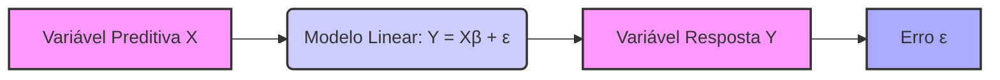
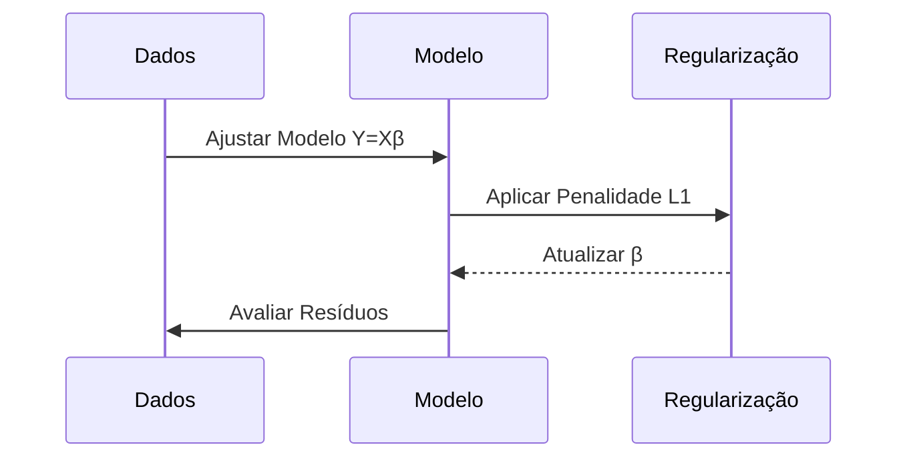

## Caso Univariado Sem Intercepto: Y = Xβ + ε em Regressão Linear



### Introdução

Em modelos de regressão linear, a inclusão do *intercepto* permite que a reta de regressão tenha uma ordenada na origem diferente de zero. No entanto, em alguns casos, pode ser apropriado utilizar um modelo de regressão linear sem *intercepto*. O modelo univariado de regressão sem intercepto é expresso pela fórmula **Y = Xβ + ε**, onde a variável resposta $Y$ é modelada como um produto da variável preditora $X$ por um parâmetro $\beta$ mais um erro aleatório $\epsilon$. Este capítulo explorará a formulação matemática do modelo, sua interpretação geométrica, os métodos para a sua resolução por mínimos quadrados, e as implicações práticas dessa simplificação.

### Formulação Matemática do Modelo Univariado sem Intercepto
Um modelo de regressão linear univariado sem *intercepto* assume que a variável dependente $Y$ é uma função linear de uma única variável preditora $X$,  e que essa relação passa pela origem, com o termo constante (o *intercepto*) sendo igual a zero. Este modelo é definido por:

$$
Y = X \beta + \epsilon
$$

onde:

-   $Y \in \mathbb{R}^{N}$ é o vetor de respostas, contendo os valores observados da variável dependente para cada observação.
-   $X \in \mathbb{R}^{N}$ é o vetor de preditores, com um único preditor para cada observação.
-  $\beta$ é o parâmetro (coeficiente) do modelo a ser estimado.
- $\epsilon \in \mathbb{R}^N$ é o vetor de erros aleatórios, que representam a diferença entre os valores observados e os valores preditos pelo modelo.

O modelo não tem intercepto, e, portanto, a reta de regressão passa pela origem. Este tipo de modelo pode ser útil em situações onde é razoável supor que, quando o preditor for igual a zero, a variável resposta também seja igual a zero, como por exemplo, na modelagem da resposta de um sistema a um estímulo, ou na modelagem da relação entre duas medidas que tenham uma origem em comum.

> 💡 **Exemplo Numérico:**
> Imagine que estamos modelando a relação entre a quantidade de fertilizante utilizada ($X$) e o crescimento de uma planta ($Y$). Em teoria, se não usarmos fertilizante, não haverá crescimento adicional. Portanto, um modelo sem intercepto pode ser apropriado. Suponha que temos os seguintes dados:
>
> | Observação | Fertilizante ($x_i$) | Crescimento ($y_i$) |
> |------------|-----------------------|--------------------|
> | 1          | 1                    | 2.1                |
> | 2          | 2                    | 3.9                |
> | 3          | 3                    | 6.1                |
> | 4          | 4                    | 7.8                |
> | 5          | 5                    | 10.2               |
>
> Aqui, $X = [1, 2, 3, 4, 5]$ e $Y = [2.1, 3.9, 6.1, 7.8, 10.2]$.
> O modelo é $Y = X\beta + \epsilon$.

###  Interpretação Geométrica do Modelo Univariado sem Intercepto

A interpretação geométrica do modelo de regressão linear univariado sem intercepto é mais simples que o caso geral, onde um intercepto é incluído.

1.  **Espaço dos Dados:** Tanto o vetor de respostas $y$ como o vetor de preditores $x$ residem no espaço dos dados, $\mathbb{R}^N$, onde cada componente corresponde a uma observação.
2.  **Reta de Regressão:** O modelo linear, que relaciona $y$ e $x$, é uma reta que passa pela origem.
3.  **Projeção Ortogonal:** O objetivo da regressão é encontrar o valor de $\beta$ tal que a projeção ortogonal do vetor resposta $y$ sobre o subespaço gerado pelo preditor $x$ seja o mais próxima possível de y. Este subespaço é uma linha que passa pela origem.
4.  **Resíduos:** O vetor de resíduos $r=y-x\beta$ representa a diferença entre o valor observado e o valor predito para cada observação, e é perpendicular à linha de regressão.

Neste modelo, a ausência do *intercepto* implica que o espaço gerado pelo preditor $x$ seja uma linha que passa pela origem.

> 💡 **Exemplo Numérico (Continuação):**
> Geometricamente, estamos procurando a reta que passa pela origem que melhor se ajusta aos pontos $(x_i, y_i)$. Os resíduos são as distâncias verticais entre os pontos e a reta.
>
> ```mermaid
>  graph LR
>      A(0,0) -- Reta de Regressão --> B(5,10)
>      C(1,2.1) -- Resíduo 1 --> D
>      E(2,3.9) -- Resíduo 2 --> F
>      G(3,6.1) -- Resíduo 3 --> H
>      I(4,7.8) -- Resíduo 4 --> J
>      K(5,10.2) -- Resíduo 5 --> L
>      style A fill:#f9f,stroke:#333,stroke-width:2px
>      style B fill:#f9f,stroke:#333,stroke-width:2px
> ```
> Os pontos C, E, G, I e K representam os dados observados, e a reta A-B representa a reta de regressão que minimiza a soma dos quadrados dos resíduos (Resíduo 1, Resíduo 2, etc.).

### Estimação de Mínimos Quadrados no Modelo Sem Intercepto

O método de mínimos quadrados busca encontrar o valor de $\beta$ que minimize a soma dos quadrados dos resíduos (RSS):

$$
RSS(\beta) = ||y - x\beta||^2 = \sum_{i=1}^N (y_i - x_i\beta)^2
$$
onde:
    -   $y_i$ é o valor observado da resposta na i-ésima observação, e $x_i$ é o valor do preditor na i-ésima observação.

Para encontrar o valor de $\beta$ que minimiza o RSS, derivamos a função RSS com relação a $\beta$ e igualamos a zero:

$$
\frac{\partial RSS}{\partial \beta} = -2 \sum_{i=1}^N x_i (y_i - x_i\beta) = 0
$$
Resolvendo para $\beta$:

$$
\sum_{i=1}^N x_i y_i - \sum_{i=1}^N x_i^2\beta = 0
$$
$$
\beta \sum_{i=1}^N x_i^2 =  \sum_{i=1}^N x_i y_i
$$
$$
\hat{\beta} = \frac{\sum_{i=1}^N x_i y_i}{\sum_{i=1}^N x_i^2} = \frac{x^Ty}{x^Tx}
$$

Em notação matricial, a solução por mínimos quadrados para o modelo linear sem intercepto é dada por:

$$
\hat{\beta} = (x^T x)^{-1} x^T y = \frac{x^T y}{x^T x}
$$

Esta fórmula expressa a estimativa do parâmetro $\beta$ em função do produto interno dos vetores $x$ e $y$, normalizado pelo produto interno do vetor $x$ com si mesmo.

> 💡 **Exemplo Numérico (Continuação):**
> Vamos calcular $\hat{\beta}$ usando os dados do exemplo anterior:
>
> $x = [1, 2, 3, 4, 5]$
> $y = [2.1, 3.9, 6.1, 7.8, 10.2]$
>
> **Step 1:** Calcular $x^Ty = \sum_{i=1}^N x_i y_i$
>
> $x^Ty = (1*2.1) + (2*3.9) + (3*6.1) + (4*7.8) + (5*10.2) = 2.1 + 7.8 + 18.3 + 31.2 + 51 = 110.4$
>
> **Step 2:** Calcular $x^Tx = \sum_{i=1}^N x_i^2$
>
> $x^Tx = (1^2) + (2^2) + (3^2) + (4^2) + (5^2) = 1 + 4 + 9 + 16 + 25 = 55$
>
> **Step 3:** Calcular $\hat{\beta}$
>
> $\hat{\beta} = \frac{x^Ty}{x^Tx} = \frac{110.4}{55} = 2.00727$
>
> Portanto, o modelo estimado é $Y = 2.00727X$. Isso significa que, para cada unidade de fertilizante adicional, esperamos um aumento de aproximadamente 2.007 unidades no crescimento da planta.

**Lemma 20:**  Unicidade da Solução do Modelo Sem Intercepto
A solução de mínimos quadrados para o modelo univariado sem intercepto é única, desde que o vetor de preditores $x$ não seja o vetor zero.

**Prova do Lemma 20:**

O denominador da solução,  $\frac{x^T y}{x^T x}$, é uma soma de quadrados, e portanto é zero somente quando todos os seus componentes são zero, o que implica que o vetor $x$ é zero. Se o vetor $x$ for zero, o modelo não tem um preditor, e o problema de regressão linear não tem sentido. Se o vetor $x$ é diferente de zero, o denominador é diferente de zero, e a solução $\hat{\beta}$ é única. $\blacksquare$

**Corolário 20:**  Interpretação do Coeficiente

O coeficiente estimado $\hat{\beta}$ representa a inclinação da reta que passa pela origem. É importante notar que, nesse caso, não existe um *intercept* e a reta de regressão é forçada a passar pela origem.

> 💡 **Exemplo Numérico (Continuação):**
> O coeficiente $\hat{\beta} = 2.00727$  indica que, para cada unidade de aumento no fertilizante, o crescimento da planta aumenta em aproximadamente 2.007 unidades, assumindo que a relação é linear e passa pela origem.

### Implicações da Ausência do Intercepto

A ausência do *intercept* no modelo linear implica em:
1. **Reta de Regressão:** A reta de regressão passa pela origem, ou seja, a predição do modelo é zero quando o preditor é igual a zero, o que pode ser apropriado em alguns casos.
2. **Interpretação do Parâmetro:** O parâmetro $\beta$ quantifica a relação linear entre o preditor e a resposta, dado que a reta de regressão passa pela origem, e portanto o parâmetro $\beta$ representa a taxa de variação da resposta a um aumento unitário do preditor.
3. **Interpretação dos Resíduos:** Os resíduos são a distância do ponto em relação a reta de regressão. Em modelos sem intercepto, os resíduos são ortogonais ao preditor.
4. **Perda de Flexibilidade:** Ao remover o *intercepto*, o modelo se torna menos flexível, e pode apresentar maior viés se a verdadeira relação não passa pela origem.
5. **Restrições do Modelo:** O modelo de regressão sem intercepto é uma boa escolha quando há razões teóricas para crer que a resposta é zero quando o preditor é zero, ou também quando desejamos um modelo com menos parâmetros e menos complexo.

> 💡 **Exemplo Numérico (Continuação):**
> Vamos calcular os resíduos para o nosso exemplo:
>
> | Observação | Fertilizante ($x_i$) | Crescimento ($y_i$) | Predito ($\hat{y_i} = \hat{\beta}x_i$) | Resíduo ($r_i = y_i - \hat{y_i}$) |
> |------------|-----------------------|--------------------|-------------------------------------|-----------------------------------|
> | 1          | 1                    | 2.1                | 2.00727                              | 0.09273                            |
> | 2          | 2                    | 3.9                | 4.01454                              | -0.11454                           |
> | 3          | 3                    | 6.1                | 6.02181                              | 0.07819                            |
> | 4          | 4                    | 7.8                | 8.02908                              | -0.22908                           |
> | 5          | 5                    | 10.2               | 10.03635                             | 0.16365                            |
>
> A soma dos quadrados dos resíduos (RSS) é:
>
> $RSS = (0.09273^2) + (-0.11454^2) + (0.07819^2) + (-0.22908^2) + (0.16365^2) = 0.0992$
>
> Os resíduos são as diferenças entre os valores observados e os valores preditos pelo modelo, e o RSS é a medida da qualidade do ajuste do modelo.

### Regularização e a Ausência do Intercepto
É importante notar que em modelos regulares, a penalização é aplicada aos coeficientes dos preditores, e o *intercept* não é penalizado, e portanto o *intercept* pode ser entendido como um parâmetro que não deve ter a sua estimativa reduzida a zero.
Em modelos sem intercepto, o parâmetro $\beta$ é penalizado como qualquer outro, e portanto pode ser levado a zero por penalizações como a L1, o que leva a um modelo onde o preditor é completamente ignorado.

> 💡 **Exemplo Numérico (Regularização):**
> Se aplicarmos uma regularização L1 (Lasso) a este modelo, a estimativa de $\beta$ será afetada pela penalidade.  Se a penalidade for suficientemente alta, o valor de $\beta$ pode ser reduzido a zero, efetivamente eliminando o preditor do modelo.  
>
> Por exemplo, se a função de custo for $RSS(\beta) + \lambda |\beta|$, um valor grande de $\lambda$ levará a um $\hat{\beta}$ menor. No caso extremo, se $\lambda$ for grande o suficiente, $\hat{\beta}$ irá a zero.


> ⚠️ **Nota Importante**: O modelo de regressão linear univariado sem intercepto é expresso por Y = Xβ + ε, onde a reta de regressão é forçada a passar pela origem.

> ❗ **Ponto de Atenção**: A estimativa do parâmetro β é dada por $\hat{\beta} = \frac{\sum_{i=1}^N x_i y_i}{\sum_{i=1}^N x_i^2} = \frac{x^T y}{x^T x}$, que corresponde ao mínimo da soma do quadrado dos resíduos.
 
> ✔️ **Destaque**: Em modelos sem intercepto, o parâmetro $\beta$ quantifica a relação linear entre o preditor e a resposta, dado que a reta de regressão passa pela origem.

### Conclusão

O modelo de regressão linear univariado sem intercepto, definido por $Y = X\beta + \epsilon$, representa uma simplificação do modelo geral, onde a reta de regressão passa obrigatoriamente pela origem. Este modelo é útil em cenários onde o conhecimento prévio ou características dos dados justificam sua utilização. A sua interpretação geométrica, bem como o seu método de resolução, fornecem uma visão clara da estimação do parâmetro $\beta$ através do método dos mínimos quadrados.

### Referências
[^11]: "The linear model either assumes that the regression function E(Y|X) is linear, or that the linear model is a reasonable approximation." *(Trecho de Linear Methods for Regression)*
[^10]: "The most popular estimation method is least squares, in which we pick the coefficients β = (β0, β1, ..., βp)T to minimize the residual sum of squares" *(Trecho de Linear Methods for Regression)*
