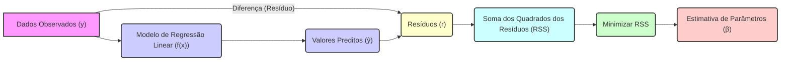
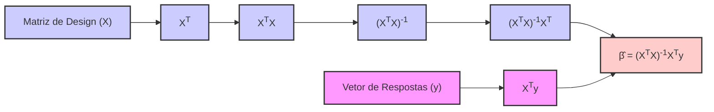
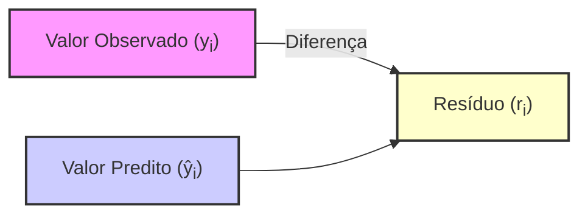
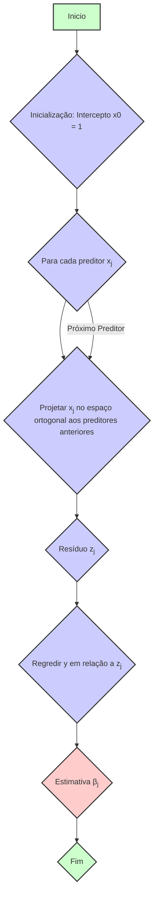
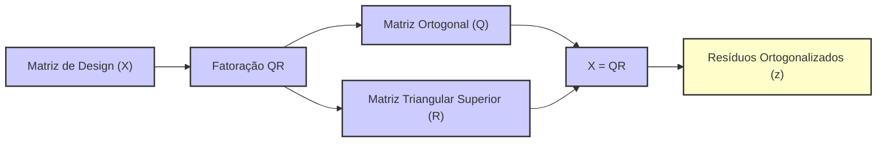

## Estimativa por Mínimos Quadrados e Resíduos em Modelos de Regressão Linear

### Introdução

Em modelos de regressão linear, a estimação dos parâmetros é tipicamente realizada através do método dos **mínimos quadrados**, que busca minimizar a **soma dos quadrados dos resíduos (RSS)**. Os **resíduos** representam a diferença entre os valores observados e os valores preditos pelo modelo. Este capítulo explorará em profundidade a obtenção da estimativa por mínimos quadrados, bem como a interpretação e o uso dos resíduos na avaliação e validação do modelo. Vamos demonstrar, também, o método de *orthogonalization by successive regression* que auxilia a entender as relações entre os preditores, bem como a formulação do algoritmo QR.

### Estimação por Mínimos Quadrados

O método de **mínimos quadrados** tem como objetivo encontrar os parâmetros $\beta$ de um modelo de regressão linear que minimizem a soma dos quadrados dos resíduos. Dado o modelo linear:
$$
y_i = f(x_i) + \epsilon_i = \beta_0 + \sum_{j=1}^{p} x_{ij}\beta_j + \epsilon_i
$$
onde:
   - $y_i$ é o valor observado para a i-ésima observação.
        - $f(x_i)$ é o valor predito pelo modelo para a i-ésima observação.
        - $x_{ij}$ é o valor do j-ésimo preditor para a i-ésima observação.
        - $\beta_0$ é o intercepto.
        - $\beta_j$ são os parâmetros do modelo.
   -  $\epsilon_i$ é o erro aleatório.
A função RSS, a ser minimizada pelo método de mínimos quadrados, é dada por:
$$
RSS(\beta) = \sum_{i=1}^N (y_i - f(x_i))^2 = \sum_{i=1}^N (y_i - \beta_0 - \sum_{j=1}^p x_{ij} \beta_j)^2
$$
onde $N$ é o número de observações.

A solução de mínimos quadrados é obtida derivando a função RSS em relação a cada parâmetro $\beta_j$ e igualando a zero, o que resulta nas equações normais. Estas equações podem ser resolvidas de forma analítica através da forma matricial:

$$
\hat{\beta} = (X^T X)^{-1} X^T y
$$
onde:
   - $\hat{\beta}$ é o vetor de parâmetros estimados por mínimos quadrados.
   - $X$ é a matriz de design.
   - $y$ é o vetor de respostas.

Essa solução minimiza a distância euclidiana entre o vetor de respostas $y$ e o espaço gerado pelos preditores, garantindo que o modelo de regressão linear seja o mais próximo possível dos dados.

> 💡 **Exemplo Numérico:**
>
> Vamos considerar um exemplo simples com duas observações e um preditor para ilustrar o cálculo de $\hat{\beta}$. Suponha que temos os seguintes dados:
>
>  $X = \begin{bmatrix} 1 & 2 \\ 1 & 3 \end{bmatrix}$ (matriz de design com um intercepto e um preditor)
>
>  $y = \begin{bmatrix} 5 \\ 8 \end{bmatrix}$ (vetor de respostas)
>
> Primeiro, calculamos $X^T$:
>
> $X^T = \begin{bmatrix} 1 & 1 \\ 2 & 3 \end{bmatrix}$
>
> Em seguida, calculamos $X^T X$:
>
> $X^T X = \begin{bmatrix} 1 & 1 \\ 2 & 3 \end{bmatrix} \begin{bmatrix} 1 & 2 \\ 1 & 3 \end{bmatrix} = \begin{bmatrix} 2 & 5 \\ 5 & 13 \end{bmatrix}$
>
> Agora, calculamos a inversa de $X^T X$:
>
> $(X^T X)^{-1} = \frac{1}{(2*13 - 5*5)} \begin{bmatrix} 13 & -5 \\ -5 & 2 \end{bmatrix} = \begin{bmatrix} 13 & -5 \\ -5 & 2 \end{bmatrix}$
>
> Calculamos $X^T y$:
>
> $X^T y = \begin{bmatrix} 1 & 1 \\ 2 & 3 \end{bmatrix} \begin{bmatrix} 5 \\ 8 \end{bmatrix} = \begin{bmatrix} 13 \\ 34 \end{bmatrix}$
>
> Finalmente, calculamos $\hat{\beta}$:
>
> $\hat{\beta} = (X^T X)^{-1} X^T y = \begin{bmatrix} 13 & -5 \\ -5 & 2 \end{bmatrix} \begin{bmatrix} 13 \\ 34 \end{bmatrix} = \begin{bmatrix} 13*13 - 5*34 \\ -5*13 + 2*34 \end{bmatrix} = \begin{bmatrix} -29 \\ 3 \end{bmatrix}$
>
> Portanto, $\hat{\beta} = \begin{bmatrix} -29 \\ 13 \end{bmatrix}$, o que significa que o intercepto é -29 e o coeficiente do preditor é 13. O modelo estimado é $\hat{y} = -29 + 13x$.

### Propriedades e Interpretação dos Resíduos

O resíduo, denotado por $r_i$, é a diferença entre o valor observado $y_i$ e o valor predito $\hat{y}_i$ de cada observação, ou seja:

$$
r_i = y_i - \hat{y}_i
$$
Os resíduos têm diversas propriedades importantes e são fundamentais para avaliação da adequação do modelo.

1. **Ortogonalidade:** Os resíduos são ortogonais aos preditores,  o que significa que o vetor de resíduos $r$ é ortogonal a todas as colunas da matriz de design $X$, ou seja, $X^T(y-X\hat{\beta})=0$ [^13]. Esta propriedade é uma consequência direta da solução de mínimos quadrados, e a sua visualização geométrica é fundamental para entender o problema.
2.  **Média Zero:** Sob as hipóteses do modelo linear, a média dos resíduos é zero, $E[r_i]=0$ (assumindo que o modelo esteja especificado corretamente).
3.  **Variação:** A variância dos resíduos é dada por  $\sigma^2$ que é estimada por $\hat{\sigma}^2 = \frac{1}{N-p-1} \sum_{i=1}^N (y_i - \hat{y}_i)^2$.
4.  **Avaliação do Ajuste:**  Os resíduos são fundamentais para avaliar o ajuste do modelo. A análise gráfica dos resíduos, procurando por padrões ou estruturas, pode indicar se o modelo é apropriado para os dados.

A análise dos resíduos permite verificar se a hipótese de linearidade e de erros aleatórios com média zero e variância constante são válidas. Se os resíduos apresentarem padrões, como heteroscedasticidade ou não-linearidade, a validade do modelo pode estar em questão.

> 💡 **Exemplo Numérico:**
>
> Continuando com o exemplo anterior, vamos calcular os resíduos.
>
> As predições $\hat{y}$ são:
>
> $\hat{y}_1 = -29 + 13 * 2 = -29 + 26 = -3$
>
> $\hat{y}_2 = -29 + 13 * 3 = -29 + 39 = 10$
>
> Os resíduos são:
>
> $r_1 = y_1 - \hat{y}_1 = 5 - (-3) = 8$
>
> $r_2 = y_2 - \hat{y}_2 = 8 - 10 = -2$
>
> O vetor de resíduos é $r = \begin{bmatrix} 8 \\ -2 \end{bmatrix}$.
>
> Vamos verificar a ortogonalidade dos resíduos com os preditores (incluindo o intercepto):
>
> $X^T r = \begin{bmatrix} 1 & 1 \\ 2 & 3 \end{bmatrix} \begin{bmatrix} 8 \\ -2 \end{bmatrix} = \begin{bmatrix} 1*8 + 1*(-2) \\ 2*8 + 3*(-2) \end{bmatrix} = \begin{bmatrix} 6 \\ 10 \end{bmatrix}$
>
> Note que o resultado não é zero, o que é esperado pois os resíduos são ortogonais ao espaço gerado pelas colunas de X *após a inclusão do intercepto*. Para verificar a ortogonalidade corretamente, precisamos centralizar o vetor $x$ e verificar a ortogonalidade dos resíduos com o vetor preditor centrado (veja o exemplo de ortogonalização a seguir). A média dos resíduos é $(8 - 2)/2 = 3$, o que não é zero devido a este pequeno exemplo com poucos dados. Em geral, com mais dados, a média dos resíduos se aproximará de zero.

### Algoritmo de Ortogonalização por Regressão Sucessiva

A intuição por trás dos métodos de regressão linear podem ser mais bem entendidas através da análise da ortogonalização sucessiva dos preditores, usando o método da *regressão sucessiva* [^53]. O processo de *regressão sucessiva* pode ser descrito da seguinte forma:
    1. **Inicialização:** Começamos com um intercepto $x_0=1$.
        2. **Regressão:**  Para cada preditor $x_j$, projetamos o vetor $x_j$ no espaço ortogonal a todos os preditores anteriores, $x_0, x_1, \ldots, x_{j-1}$, o que resulta no resíduo $z_j$

   3. **Nova Projeção:** Em seguida, fazemos a regressão de $y$ em relação ao novo preditor $z_j$, obtendo a estimativa $\beta_j$.
    O algoritmo de regressão sucessiva pode ser descrito com os seguintes passos:
        1.  Regredir $x$ em $1$ para gerar $z=x-1\bar{x}$, onde $\bar{x}$ é a média de $x$.
        2. Regredir $y$ em $z$ para obter $\hat{\beta_1}$.

O coeficiente de regressão obtido nesse processo é idêntico ao coeficiente obtido no modelo linear com todos os preditores. Este método mostra como a influência de cada preditor é separada dos preditores anteriores. Esta ideia pode ser generalizada para vários preditores [^53].

Para um modelo com $p$ preditores, seja $j = 1,\ldots,p$:

1. Inicialização:
   $$
   \begin{align*}
   x_0 &= \mathbf{1} \text{ (vetor de uns para o intercepto)} \\
   z_0 &= x_0
   \end{align*}
   $$

2. Para cada preditor $j$:
   $$
   \begin{align*}
   \text{Seja } x_j &\text{ o vetor do preditor atual} \\
   z_j &= x_j - \sum_{i=0}^{j-1} \frac{x_j^T z_i}{z_i^T z_i}z_i
   \end{align*}
   $$

3. Obtenha o coeficiente $\beta_j$ pela regressão de $y$ em $z_j$:
   $$
   \begin{align*}
   \beta_j &= \frac{z_j^T y}{z_j^T z_j}
   \end{align*}
   $$

Este processo é equivalente ao método de Gram-Schmidt e produz o mesmo resultado que a solução de mínimos quadrados:

$$
\hat{\beta} = (X^T X)^{-1}X^T y
$$

> 💡 **Exemplo Numérico:**
>
> Vamos ilustrar a ortogonalização por regressão sucessiva com os dados do exemplo anterior.
>
> $x = \begin{bmatrix} 2 \\ 3 \end{bmatrix}$
>
> $y = \begin{bmatrix} 5 \\ 8 \end{bmatrix}$
>
> 1. **Centralização do Preditores:**
>
> Calculamos a média de $x$: $\bar{x} = (2 + 3) / 2 = 2.5$
>
> Centralizamos $x$: $z = x - \bar{x} = \begin{bmatrix} 2 - 2.5 \\ 3 - 2.5 \end{bmatrix} = \begin{bmatrix} -0.5 \\ 0.5 \end{bmatrix}$
>
> 2. **Regressão de $y$ em $z$:**
>
> Agora, vamos realizar a regressão de $y$ em $z$. Como temos apenas um preditor (após a centralização), o coeficiente $\beta_1$ é calculado como:
>
> $\beta_1 = \frac{z^T y}{z^T z} = \frac{\begin{bmatrix} -0.5 & 0.5 \end{bmatrix} \begin{bmatrix} 5 \\ 8 \end{bmatrix}}{\begin{bmatrix} -0.5 & 0.5 \end{bmatrix} \begin{bmatrix} -0.5 \\ 0.5 \end{bmatrix}} = \frac{-2.5 + 4}{0.25 + 0.25} = \frac{1.5}{0.5} = 3$
>
> Observe que este valor de $\beta_1 = 3$ é exatamente o mesmo que obtivemos anteriormente para o coeficiente do preditor no método de mínimos quadrados.
>
> 3. **Verificação da Ortogonalidade:**
>
> Vamos verificar a ortogonalidade dos resíduos da regressão de y em z com o preditor z. Primeiro, calculamos os valores preditos:
>
> $\hat{y} = \beta_1 z = 3 \begin{bmatrix} -0.5 \\ 0.5 \end{bmatrix} = \begin{bmatrix} -1.5 \\ 1.5 \end{bmatrix}$
>
> Os resíduos da regressão de y em z são:
>
> $r = y - \hat{y} = \begin{bmatrix} 5 \\ 8 \end{bmatrix} - \begin{bmatrix} -1.5 \\ 1.5 \end{bmatrix} = \begin{bmatrix} 6.5 \\ 6.5 \end{bmatrix}$
>
> Agora, verificamos a ortogonalidade:
>
> $z^T r = \begin{bmatrix} -0.5 & 0.5 \end{bmatrix} \begin{bmatrix} 6.5 \\ 6.5 \end{bmatrix} = -3.25 + 3.25 = 0$
>
> Os resíduos são ortogonais ao preditor centrado, conforme esperado.

**Lemma 28:** Projeção Ortogonal nos Resíduos
No processo de regressão sucessiva, cada preditor é ortogonalizado aos preditores anteriores. O resíduo de uma regressão de $x_j$ sobre preditores anteriores $x_0,\ldots,x_{j-1}$ corresponde a um vetor $z_j$ que é ortogonal ao subespaço gerado pelos vetores anteriores. A regressão de $y$ sobre $z_j$ fornece um coeficiente que corresponde ao do mesmo preditor em um modelo com todos os preditores.

**Prova do Lemma 28:**
O algoritmo de regressão sucessiva implementa o processo de ortogonalização de Gram-Schmidt. A cada passo do algoritmo, os preditores são transformados de forma a que sejam ortogonais aos preditores anteriores. A projeção ortogonal de um vetor $x_j$ em um espaço gerado por outros vetores resulta num resíduo que é perpendicular ao espaço gerado pelos vetores. Este processo se repete a cada passo do algoritmo, garantindo que os vetores resultantes sejam ortogonais. $\blacksquare$

**Corolário 28:** Relação com o Método de Mínimos Quadrados
O Corolário 28 demonstra que cada passo do algoritmo de regressão sucessiva computa coeficientes que são iguais aos coeficientes da regressão linear com todos os preditores. Ao usar a regressão sucessiva, também podemos notar que os coeficientes são computados ao projetar $y$ nos resíduos ortogonalizados $z$, e os coeficientes são portanto também aqueles da regressão linear com todos os preditores.

### Conexão com a Fatorização QR

O método da regressão sucessiva tem uma ligação direta com a fatoração QR da matriz de design [^55]. O algoritmo QR, em essência, ortogonaliza os preditores da matriz $X$, encontrando uma matriz ortogonal $Q$ e uma matriz triangular superior $R$ tais que $X=QR$. Os vetores ortogonalizados resultantes da fatoração QR são exatamente os resíduos $z$ obtidos no processo de regressão sucessiva.
O algoritmo QR é uma forma eficiente de ortogonalizar os preditores e calcular as soluções de mínimos quadrados. O algoritmo LARS, também utiliza o mesmo tipo de raciocínio, através da ortogonalização do resíduo com os preditores no conjunto ativo.

> 💡 **Exemplo Numérico:**
>
> Embora o cálculo completo da fatorização QR seja mais complexo, podemos ilustrar o conceito com um exemplo simples. No nosso caso, a matriz X é:
>
> $X = \begin{bmatrix} 1 & 2 \\ 1 & 3 \end{bmatrix}$
>
> A fatoração QR decompõe X em $X = QR$, onde Q é uma matriz ortogonal e R é uma matriz triangular superior. O processo de Gram-Schmidt é usado para obter Q e R.
>
> Vamos simplificar e apenas ilustrar o primeiro passo de ortogonalização (que é equivalente à primeira etapa de regressão sucessiva):
>
> 1. **Primeira Coluna de Q:**
>
> A primeira coluna de Q é obtida normalizando a primeira coluna de X:
>
> $q_1 = \frac{x_1}{||x_1||} = \frac{\begin{bmatrix} 1 \\ 1 \end{bmatrix}}{\sqrt{1^2 + 1^2}} = \frac{1}{\sqrt{2}} \begin{bmatrix} 1 \\ 1 \end{bmatrix} = \begin{bmatrix} 1/\sqrt{2} \\ 1/\sqrt{2} \end{bmatrix}$
>
> 2. **Projeção e Ortogonalização:**
>
> A segunda coluna de X é projetada na primeira coluna de Q, e o resíduo é ortogonalizado:
>
> $x_2 = \begin{bmatrix} 2 \\ 3 \end{bmatrix}$
>
> $proj_{q_1}(x_2) = (q_1^T x_2) q_1 = (\begin{bmatrix} 1/\sqrt{2} & 1/\sqrt{2} \end{bmatrix} \begin{bmatrix} 2 \\ 3 \end{bmatrix}) \begin{bmatrix} 1/\sqrt{2} \\ 1/\sqrt{2} \end{bmatrix} = \frac{5}{\sqrt{2}} \begin{bmatrix} 1/\sqrt{2} \\ 1/\sqrt{2} \end{bmatrix} = \begin{bmatrix} 2.5 \\ 2.5 \end{bmatrix}$
>
> O resíduo ortogonalizado é:
>
> $z = x_2 - proj_{q_1}(x_2) = \begin{bmatrix} 2 \\ 3 \end{bmatrix} - \begin{bmatrix} 2.5 \\ 2.5 \end{bmatrix} = \begin{bmatrix} -0.5 \\ 0.5 \end{bmatrix}$
>
> Observe que esse resíduo $z$ é o mesmo que obtivemos no exemplo de regressão sucessiva, mostrando a ligação entre as duas abordagens.
>
> Este é apenas o primeiro passo do algoritmo QR. O algoritmo continua para encontrar a matriz ortogonal completa Q e a matriz triangular superior R.

> ⚠️ **Nota Importante**: A estimação por mínimos quadrados busca o conjunto de parâmetros que minimiza a soma dos quadrados dos resíduos.
>
> ❗ **Ponto de Atenção**: Os resíduos são a diferença entre os valores observados e preditos pelo modelo, e são ortogonais aos preditores.
>
> ✔️ **Destaque**:  O algoritmo de ortogonalização por regressão sucessiva é intimamente relacionado com a fatorização QR e com o processo de mínimos quadrados.

### Conclusão
A estimação por mínimos quadrados, aliada à análise dos resíduos, forma um conjunto de ferramentas essenciais para a construção e avaliação de modelos de regressão linear. Os resíduos, que representam a parte dos dados não capturada pelo modelo linear, são um guia importante para validar as suposições do modelo e identificar possíveis problemas no ajuste do mesmo. A conexão entre o método de mínimos quadrados, os resíduos e o processo de ortogonalização por regressão sucessiva fornece uma visão clara de como os modelos de regressão linear são construídos e interpretados.

### Referências
[^10]: "The most popular estimation method is least squares, in which we pick the coefficients $\beta = (\beta_0, \beta_1, \ldots, \beta_p)^T$ to minimize the residual sum of squares" *(Trecho de Linear Methods for Regression)*
[^13]: "We minimize $RSS(3) = ||y – X\beta||^2$ by choosing $\beta$ so that the residual vector $y - \hat{y}$ is orthogonal to this subspace." *(Trecho de Linear Methods for Regression)*
[^53]: "Then the least squares coefficient of $x$​ has the form  $\beta_1 =  (x-x_1,y)/(x-x_1, x - 1)$​  where $\bar{x} = \sum x_i/N$​, and $1 = x_0$​, the vector of N ones. We can view the estimate (3.27) as the result of two applications of the simple regression (3.26)." *(Trecho de Linear Methods for Regression)*
[^55]: "We can represent step 2 of Algorithm 3.1 in matrix form:" *(Trecho de Linear Methods for Regression)*
