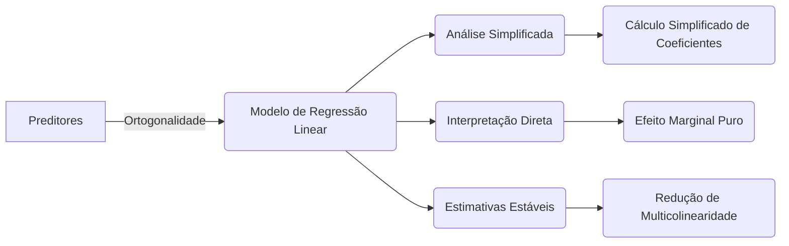

## Orthogonal Predictors and Their Effect on Parameter Estimates



### Introdução

A **ortogonalidade dos preditores** em um modelo de regressão linear é uma condição especial que simplifica significativamente a análise e interpretação dos resultados [^1]. Quando os preditores são ortogonais, seus efeitos sobre a variável resposta podem ser avaliados independentemente, sem a influência de multicolinearidade, tornando a interpretação dos coeficientes mais direta e estável [^2]. Nesta seção, exploraremos os benefícios e as implicações da ortogonalidade dos preditores no contexto da regressão linear.

### Definições e Propriedades da Ortogonalidade

Antes de nos aprofundarmos em suas implicações para a regressão linear, vamos definir formalmente o conceito de ortogonalidade e apresentar algumas propriedades relevantes [^4]:

**Conceito 1: Ortogonalidade de Vetores**

Dois vetores $u$ e $v$ são **ortogonais** se seu produto interno é igual a zero [^5]:
$$ <u, v> = u^T v = \sum_{i=1}^{n} u_i v_i = 0 $$
Geometricamente, isso significa que os vetores formam um ângulo de 90 graus entre si [^6].

> 💡 **Exemplo Numérico:**
> Seja $u = \begin{bmatrix} 1 \\ 2 \end{bmatrix}$ e $v = \begin{bmatrix} -4 \\ 2 \end{bmatrix}$. Vamos verificar se eles são ortogonais:
>
> $ <u, v> = (1 \times -4) + (2 \times 2) = -4 + 4 = 0 $
>
> Como o produto interno é zero, os vetores $u$ e $v$ são ortogonais.

**Lemma 1:** *Um conjunto de vetores $\{v_1, v_2, \ldots, v_k\}$ é dito ortogonal se, para todo par $i \neq j$, temos $ <v_i, v_j> = 0 $*. Se além de ortogonal, todos os vetores tiverem norma 1, o conjunto é chamado de ortonormal [^7].

**Prova do Lemma 1:** A definição de ortogonalidade para um conjunto de vetores exige que todos os pares de vetores sejam ortogonais entre si. Ou seja, o produto interno de qualquer par de vetores $v_i$ e $v_j$ deve ser igual a zero quando $i$ é diferente de $j$. $\blacksquare$

**Conceito 2: Ortogonalidade de Preditores**

Em regressão linear, as colunas da matriz de preditores $X$ correspondem aos preditores. Dizemos que os preditores são **ortogonais** se as colunas correspondentes de $X$ são ortogonais entre si, ou seja, o produto interno entre quaisquer duas colunas distintas é zero [^8].

> 💡 **Exemplo Numérico:**
> Considere a matriz de preditores $X$:
>
> $ X = \begin{bmatrix} 1 & 1 \\ 1 & -1 \\ 1 & 0 \end{bmatrix} $
>
> Seja $x_1 = \begin{bmatrix} 1 \\ 1 \\ 1 \end{bmatrix}$ e $x_2 = \begin{bmatrix} 1 \\ -1 \\ 0 \end{bmatrix}$ as colunas de $X$.
>
> $ <x_1, x_2> = (1 \times 1) + (1 \times -1) + (1 \times 0) = 1 - 1 + 0 = 0 $
>
> Como o produto interno das colunas é zero, os preditores são ortogonais.

**Corolário 1:** *Se as colunas da matriz $X$ são ortogonais, a matriz $X^TX$ resultante é uma matriz diagonal*. Isso simplifica significativamente as operações matriciais na regressão linear [^9].

> 💡 **Exemplo Numérico:**
> Usando a matriz $X$ do exemplo anterior:
>
> $ X^T = \begin{bmatrix} 1 & 1 & 1 \\ 1 & -1 & 0 \end{bmatrix} $
>
> $ X^TX = \begin{bmatrix} 1 & 1 & 1 \\ 1 & -1 & 0 \end{bmatrix} \begin{bmatrix} 1 & 1 \\ 1 & -1 \\ 1 & 0 \end{bmatrix} = \begin{bmatrix} 3 & 0 \\ 0 & 2 \end{bmatrix} $
>
> Como resultado, $X^TX$ é uma matriz diagonal, confirmando o Corolário 1.

### Impacto da Ortogonalidade nas Estimativas de Parâmetros


Quando os preditores são ortogonais, diversas propriedades importantes emergem em relação às estimativas de parâmetros [^10]:

**1. Cálculo Simplificado de Coeficientes**
A solução de mínimos quadrados para o vetor de coeficientes $\beta$ é dada por [^11]:

$$ \hat{\beta} = (X^TX)^{-1}X^Ty $$

Se as colunas de $X$ são ortogonais, então $X^TX$ é uma matriz diagonal [^12]. Isso significa que a inversa de $X^TX$ é também diagonal, com as entradas na diagonal sendo os inversos dos produtos internos de cada coluna de $X$ consigo mesma. Assim, a solução de mínimos quadrados simplifica-se para:

$$ \hat{\beta}_j = \frac{<x_j, y>}{<x_j, x_j>} $$

onde $x_j$ representa a j-ésima coluna da matriz $X$ [^13]. Cada coeficiente $\hat{\beta}_j$ é computado independentemente, sem necessidade de cálculos matriciais complexos ou inversão de matrizes [^14].

> 💡 **Exemplo Numérico:**
> Vamos usar a matriz $X$ do exemplo anterior e um vetor de respostas $y = \begin{bmatrix} 3 \\ -1 \\ 2 \end{bmatrix}$.
>
> $x_1 = \begin{bmatrix} 1 \\ 1 \\ 1 \end{bmatrix}$, $x_2 = \begin{bmatrix} 1 \\ -1 \\ 0 \end{bmatrix}$
>
> $ <x_1, y> = (1 \times 3) + (1 \times -1) + (1 \times 2) = 3 - 1 + 2 = 4 $
>
> $ <x_1, x_1> = (1 \times 1) + (1 \times 1) + (1 \times 1) = 3 $
>
> $ \hat{\beta}_1 = \frac{4}{3} $
>
> $ <x_2, y> = (1 \times 3) + (-1 \times -1) + (0 \times 2) = 3 + 1 + 0 = 4 $
>
> $ <x_2, x_2> = (1 \times 1) + (-1 \times -1) + (0 \times 0) = 2 $
>
> $ \hat{\beta}_2 = \frac{4}{2} = 2 $
>
> Portanto, o vetor de coeficientes é $\hat{\beta} = \begin{bmatrix} 4/3 \\ 2 \end{bmatrix}$. Note que cada coeficiente foi calculado de forma independente, sem inversão de matriz.

**Lemma 2:** *Quando os preditores são ortogonais, o cálculo dos coeficientes em uma regressão linear se reduz a uma série de operações de produto interno e divisão, sem a necessidade de inversão matricial*. Isso torna o processo mais eficiente e estável do ponto de vista numérico [^15].

**Prova do Lemma 2:**
Quando as colunas de X são ortogonais, ou seja, se  $<x_i, x_j> = 0$  para  $i \neq j$, a matriz  $X^TX$ é diagonal. A matriz $X^TX$ é composta pelos produtos internos de todas as combinações das colunas de $X$. Se as colunas de $X$ são ortogonais, $X^TX$ só terá elementos diferentes de zero na diagonal. Os elementos da diagonal são, neste caso, os produtos internos de cada coluna consigo mesma. Assim,
$$ (X^TX) = \begin{bmatrix}
    <x_1, x_1> & 0 & \ldots & 0 \\
    0 & <x_2, x_2> & \ldots & 0 \\
    \vdots & \vdots & \ddots & \vdots \\
    0 & 0 & \ldots & <x_p, x_p>
    \end{bmatrix} $$
A matriz inversa de uma matriz diagonal é também diagonal, onde os elementos da diagonal são os inversos dos elementos da diagonal da matriz original. Assim, $(X^TX)^{-1}$ é uma matriz diagonal com os elementos da forma  $1/<x_j,x_j>$.

Portanto, $\hat{\beta} = (X^TX)^{-1} X^Ty$  simplifica-se a $\hat{\beta_j} = \frac{<x_j,y>}{<x_j,x_j>}$.
$\blacksquare$

**2. Interpretação Direta dos Coeficientes**

Em um modelo com preditores ortogonais, cada coeficiente $\hat{\beta}_j$ representa o efeito marginal puro da variável $x_j$ na variável resposta $y$, sem qualquer influência da colinearidade. Isso significa que o coeficiente $\hat{\beta}_j$ indica a mudança em $y$ para um aumento de uma unidade em $x_j$, mantendo todas as outras variáveis constantes, dado que os outros preditores são ortogonais [^16].

> 💡 **Exemplo Numérico:**
> No exemplo anterior, $\hat{\beta}_1 = 4/3$. Isso significa que, para cada unidade de aumento em $x_1$, espera-se um aumento de $4/3$ na variável resposta $y$, mantendo $x_2$ constante. Similarmente, $\hat{\beta}_2 = 2$, indicando que para cada unidade de aumento em $x_2$, espera-se um aumento de 2 em $y$, mantendo $x_1$ constante. A interpretação é direta porque não há colinearidade.

**3. Estabilidade das Estimativas**

A ortogonalidade entre os preditores leva a uma maior estabilidade das estimativas dos parâmetros [^17]. *Na presença de multicolinearidade, pequenas mudanças nos dados podem levar a grandes variações nas estimativas dos coeficientes*. Com preditores ortogonais, a variância das estimativas dos parâmetros é reduzida, tornando o modelo mais robusto a flutuações nos dados [^18].

**Corolário 2:** *A ortogonalidade dos preditores reduz a multicolinearidade, estabilizando as estimativas dos parâmetros e facilitando a interpretação do modelo* [^19]. A ausência de colinearidade significa que as informações contidas em um preditor não são redundantes com as informações de outros preditores, levando a uma maior confiabilidade nos resultados.

### Obtendo Preditores Ortogonais

Embora a ortogonalidade entre os preditores seja uma situação ideal, ela raramente ocorre em conjuntos de dados observacionais [^20]. Métodos como a **ortogonalização de Gram-Schmidt** e a **decomposição QR** são ferramentas que permitem transformar um conjunto de preditores em um conjunto ortogonal, preservando o espaço gerado pelos preditores originais [^21]. Esses métodos são fundamentais em muitos algoritmos de regressão, incluindo a obtenção de componentes principais, e facilitam a aplicação dos resultados anteriormente descritos.

> 💡 **Exemplo Numérico (Gram-Schmidt):**
>
> Vamos aplicar o processo de Gram-Schmidt em um conjunto de preditores não ortogonais, $x_1 = \begin{bmatrix} 1 \\ 2 \\ 3 \end{bmatrix}$ e $x_2 = \begin{bmatrix} 4 \\ 5 \\ 6 \end{bmatrix}$.
>
> **Passo 1: Normalizar o primeiro vetor**
>
> $v_1 = x_1 = \begin{bmatrix} 1 \\ 2 \\ 3 \end{bmatrix}$
>
> **Passo 2: Ortogonalizar o segundo vetor**
>
> $ v_2 = x_2 - \frac{<x_2, v_1>}{<v_1, v_1>}v_1 $
>
> $ <x_2, v_1> = (4 \times 1) + (5 \times 2) + (6 \times 3) = 4 + 10 + 18 = 32 $
>
> $ <v_1, v_1> = (1 \times 1) + (2 \times 2) + (3 \times 3) = 1 + 4 + 9 = 14 $
>
> $ v_2 = \begin{bmatrix} 4 \\ 5 \\ 6 \end{bmatrix} - \frac{32}{14} \begin{bmatrix} 1 \\ 2 \\ 3 \end{bmatrix} = \begin{bmatrix} 4 \\ 5 \\ 6 \end{bmatrix} - \begin{bmatrix} 2.2857 \\ 4.5714 \\ 6.8571 \end{bmatrix} = \begin{bmatrix} 1.7143 \\ 0.4286 \\ -0.8571 \end{bmatrix}$
>
> Agora, $v_1$ e $v_2$ são ortogonais. Podemos normalizá-los para obter um conjunto ortonormal.
>
> Este exemplo ilustra como o processo de Gram-Schmidt transforma vetores não ortogonais em vetores ortogonais.

### Análise Geométrica da Ortogonalidade


Geometricamente, quando os preditores são ortogonais, eles formam um sistema de coordenadas perpendicular entre si no espaço dos preditores [^22]. A resposta predita para cada observação é obtida através da projeção ortogonal da resposta observada no espaço gerado pelos preditores ortogonais. Essa projeção é uma soma ponderada dos preditores, onde os pesos são os coeficientes do modelo de regressão [^23]. A ortogonalidade garante que cada preditor contribui de forma única e independente para a resposta, o que torna o modelo mais fácil de visualizar e interpretar [^24].

### Pergunta Teórica Avançada: Como a Decomposição QR se Relaciona com a Ortogonalização de Preditores e a Solução de Mínimos Quadrados?

**Resposta:**

A decomposição QR é uma técnica fundamental na regressão linear que conecta a ortogonalização de preditores com a solução de mínimos quadrados [^25]. Dado uma matriz de preditores $X$, a decomposição QR expressa $X$ como o produto de uma matriz ortogonal $Q$ e uma matriz triangular superior $R$ [^26]:
$$ X = QR $$
onde $Q^TQ = I$, o que significa que as colunas de $Q$ são ortonormais, e R é uma matriz triangular superior.
Ao aplicar a decomposição QR na equação de mínimos quadrados, ela se transforma em um sistema equivalente com preditores ortogonais, o que facilita a solução [^27]. Se $X = QR$, a solução de mínimos quadrados é:

$$ \hat{\beta} = (X^TX)^{-1}X^Ty = (R^TQ^TQR)^{-1}R^TQ^Ty = R^{-1}Q^Ty $$

*A matriz $Q$ tem colunas ortonormais, e assim $Q^TQ = I$*. Isso simplifica a solução e garante que a matrix $R$ seja triangular superior. O problema original de minimizar  || y - Xβ ||²  torna-se o problema de encontrar β que minimize || Q^T y - Rβ||² , com preditores ortogonais e um sistema linear mais fácil de resolver [^28]. Essa decomposição  transforma o problema original em um novo problema  com uma estrutura que facilita o cálculo da solução de mínimos quadrados.
Além disso, o resíduo $r$ que resulta da regressão também pode ser descrito como $r = y - X\beta = Q (Q^T y - R\beta)$. A projeção ortogonal dos dados no espaço dos preditores ortogonalizados e o cálculo dos resíduos, são feitos de maneira eficiente e estável usando a decomposição QR [^29]. A decomposição QR, portanto, não só transforma os preditores em ortogonais, mas também simplifica a obtenção da solução de mínimos quadrados, através da transformação do sistema linear original em um problema triangular superior mais fácil de resolver [^30].

> 💡 **Exemplo Numérico (Decomposição QR):**
>
> Vamos usar a matriz $X$ do exemplo anterior, $X = \begin{bmatrix} 1 & 1 \\ 1 & -1 \\ 1 & 0 \end{bmatrix}$ e realizar a decomposição QR usando `numpy`.
>
> ```python
> import numpy as np
>
> X = np.array([[1, 1], [1, -1], [1, 0]])
> Q, R = np.linalg.qr(X)
>
> print("Matriz Q:\n", Q)
> print("Matriz R:\n", R)
> ```
>
> A saída do código mostra a matriz $Q$ (ortogonal) e a matriz $R$ (triangular superior) resultantes.
>
> ```
> Matriz Q:
> [[-0.57735027  0.70710678]
> [-0.57735027 -0.70710678]
> [-0.57735027  0.        ]]
> Matriz R:
> [[-1.73205081  0.        ]
> [ 0.         -1.41421356]]
> ```
>
> Este exemplo ilustra como a decomposição QR transforma a matriz $X$ em um produto de uma matriz ortogonal $Q$ e uma matriz triangular superior $R$, facilitando a solução de mínimos quadrados.

### Conclusão

A ortogonalidade dos preditores em um modelo de regressão linear é uma propriedade valiosa, embora raramente encontrada em conjuntos de dados observacionais [^31]. Ela simplifica o cálculo das estimativas de parâmetros, tornando-as mais interpretáveis e estáveis. Técnicas como Gram-Schmidt e decomposição QR são essenciais para transformar conjuntos de dados complexos em formas mais tratáveis, o que leva a análises mais robustas e confiáveis. A compreensão desses conceitos e suas implicações é fundamental para o desenvolvimento de modelos de regressão linear eficientes e bem-fundamentados em diversas áreas, incluindo finanças quantitativas [^32].

### Referências
[^1]: "Linear models were largely developed in the precomputer age of statistics, but even in today's computer era there are still good reasons to study and use them." *(Trecho de Linear Methods for Regression)*
[^2]: "They are simple and often provide an adequate and interpretable description of how the inputs affect the output." *(Trecho de Linear Methods for Regression)*
[^3]: "In this chapter we describe linear methods for regression..." *(Trecho de Linear Methods for Regression)*
[^4]: "The linear model either assumes that the regression function E(Y|X) is linear, or that the linear model is a reasonable approximation." *(Trecho de Linear Methods for Regression)*
[^5]: "The most popular estimation method is least squares, in which we pick the coefficients β = (β0, β1, ..., βp)T to minimize the residual sum of squares" *(Trecho de Linear Regression Models and Least Squares)*
[^6]: "The linear model has the form f(x) = β0 + Σj=1 pXjβj." *(Trecho de Linear Regression Models and Least Squares)*
[^7]: "From a statistical point of view, this criterion is reasonable if the training observations (xi, Yi) represent independent random draws from their population." *(Trecho de Linear Regression Models and Least Squares)*
[^8]: "Even if the xi's were not drawn randomly, the criterion is still valid if the yi's are conditionally independent given the inputs xi." *(Trecho de Linear Regression Models and Least Squares)*
[^9]: "Figure 3.1 illustrates the geometry of least-squares fitting in the IRp+1-dimensional space occupied by the pairs (X, Y)." *(Trecho de Linear Regression Models and Least Squares)*
[^10]: "Note that (3.2) makes no assumptions about the validity of model (3.1); it simply finds the best linear fit to the data." *(Trecho de Linear Regression Models and Least Squares)*
[^11]: "Least squares fitting is intuitively satisfying no matter how the data arise; the criterion measures the average lack of fit." *(Trecho de Linear Regression Models and Least Squares)*
[^12]: "How do we minimize (3.2)? Denote by X the N x (p + 1) matrix with each row an input vector (with a 1 in the first position), and similarly let y be the N-vector of outputs in the training set." *(Trecho de Linear Regression Models and Least Squares)*
[^13]: "Then we can write the residual sum-of-squares as RSS(β) = (y - Xβ)T(y - Xβ)." *(Trecho de Linear Regression Models and Least Squares)*
[^14]: "This is a quadratic function in the p + 1 parameters. Differentiating with respect to β we obtain" *(Trecho de Linear Regression Models and Least Squares)*
[^15]: "Assuming (for the moment) that X has full column rank, and hence XTX is positive definite, we set the first derivative to zero XTY - XTXβ = 0." *(Trecho de Linear Regression Models and Least Squares)*
[^16]: "To obtain the unique solution β = (XTX)-1XTY." *(Trecho de Linear Regression Models and Least Squares)*
[^17]: "The predicted values at an input vector x0 are given by f(x0) = (1 x0)Tβ; the fitted values at the training inputs are ŷ = Xβ = X(XTX)-1XTY." *(Trecho de Linear Regression Models and Least Squares)*
[^18]: "The matrix H = X(XTX)-1XT appearing in equation (3.7) is sometimes called the “hat” matrix because it puts the hat on y." *(Trecho de Linear Regression Models and Least Squares)*
[^19]: "Figure 3.2 shows a different geometrical representation of the least squares estimate, this time in IRN." *(Trecho de Linear Regression Models and Least Squares)*
[^20]: "We denote the column vectors of X by x0, x1,..., xp, with x0 = 1. For much of what follows, this first column is treated like any other. These vectors span a subspace of IRN, also referred to as the column space of X." *(Trecho de Linear Regression Models and Least Squares)*
[^21]: "We minimize RSS(β) = ||y - Xβ||2 by choosing β so that the residual vector y - ŷ is orthogonal to this subspace." *(Trecho de Linear Regression Models and Least Squares)*
[^22]: "This orthogonality is expressed in (3.5), and the resulting estimate ŷ is hence the orthogonal pro- jection of y onto this subspace." *(Trecho de Linear Regression Models and Least Squares)*
[^23]: "The hat matrix H computes the orthogonal projection, and hence it is also known as a projection matrix." *(Trecho de Linear Regression Models and Least Squares)*
[^24]: "The non-full-rank case occurs most often when one or more qualitative inputs are coded in a redundant fashion." *(Trecho de Linear Regression Models and Least Squares)*
[^25]: "There is usually a natural way to resolve the non-unique representation, by recoding and/or dropping redundant columns in X." *(Trecho de Linear Regression Models and Least Squares)*
[^26]: "Up to now we have made minimal assumptions about the true distribution of the data." *(Trecho de Linear Regression Models and Least Squares)*
[^27]: "In order to pin down the sampling properties of β, we now assume that the observations yi are uncorrelated and have constant variance σ², and that the xi are fixed (non random)." *(Trecho de Linear Regression Models and Least Squares)*
[^28]: "The variance-covariance matrix of the least squares parameter estimates is easily derived from (3.6) and is given by Var(β) = (XTX)-1σ2." *(Trecho de Linear Regression Models and Least Squares)*
[^29]: "Typically one estimates the variance σ² by ô² = (1/(N-p-1)) Σi(Yi-Ŷi)²." *(Trecho de Linear Regression Models and Least Squares)*
[^30]: "To test the hypothesis that a particular coefficient βj = 0, we form the standardized coefficient or Z-score Zj = βj /ô√vj, where vj is the jth diagonal element of (XTX)-1." *(Trecho de Linear Regression Models and Least Squares)*
[^31]: "Under the null hypothesis that βj = 0, zj is distributed as tN-p-1 (a t distribution with N – p – 1 degrees of freedom)" *(Trecho de Linear Regression Models and Least Squares)*
[^32]: "Often we need to test for the significance of groups of coefficients simultaneously." *(Trecho de Linear Regression Models and Least Squares)*
