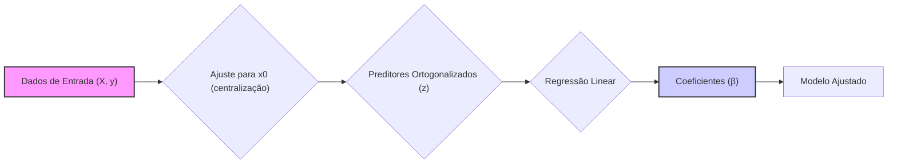

## Ortogonalização de Preditores: Ajuste para x₀, Etapas para Regressão Simples e Interpretações em Regressão Múltipla



### Introdução

A ortogonalização de preditores é um processo crucial em regressão linear, permitindo que os efeitos das variáveis preditoras sejam analisados de forma mais clara e independente. As etapas envolvidas na ortogonalização, particularmente o ajuste para o termo constante $x_0$ e a sua extensão da regressão simples para a múltipla, são fundamentais para uma compreensão aprofundada de como a independência entre os preditores afeta a solução do modelo [^1]. Esta seção irá detalhar esses procedimentos.

### Ajuste para o Termo Constante (x₀) em Regressão Linear

Em um modelo de regressão linear, frequentemente incluímos um termo constante, que representamos como $x_0 = 1$ para todas as observações [^3]. Para garantir a ortogonalidade, devemos ajustar os outros preditores em relação a este termo constante [^4]. Este ajuste é crucial para remover a correlação entre os preditores e a constante, o que simplifica a interpretação dos coeficientes do modelo [^5].

**Conceito 1: Ajuste para x₀**

Em um modelo de regressão linear com um termo constante, o primeiro passo para ortogonalizar os preditores é centralizá-los em relação à sua média [^6]. O ajuste para o termo constante $x_0$ pode ser visto como um processo de projeção ortogonal, removendo a componente de cada preditor que é paralela a $x_0$ [^7].

Matematicamente, dado um vetor de preditor $x_j$ e um vetor constante $x_0 = 1$, o ajuste para $x_0$ é obtido pela subtração da média de $x_j$ ($ \bar{x_j}$ ) do vetor $x_j$, resultando em um vetor residual $z_j$ [^8]:

$$ z_j = x_j - \bar{x_j}x_0 = x_j - \bar{x_j} $$

Onde $\bar{x_j} = \frac{1}{N} \sum_{i=1}^{N} x_{ij}$, com N sendo o número de observações [^9]. O vetor $z_j$ é agora ortogonal ao vetor constante $x_0$.

> 💡 **Exemplo Numérico:**
>
> Suponha que temos um preditor $x_1$ com os seguintes valores para 5 observações: $x_1 = [2, 4, 6, 8, 10]$. O vetor constante $x_0$ é $[1, 1, 1, 1, 1]$.
>
> 1. **Calcular a média de $x_1$**:
>    $\bar{x_1} = \frac{2+4+6+8+10}{5} = \frac{30}{5} = 6$
>
> 2. **Ajustar $x_1$**:
>    $z_1 = x_1 - \bar{x_1} = [2-6, 4-6, 6-6, 8-6, 10-6] = [-4, -2, 0, 2, 4]$
>
> O vetor resultante $z_1 = [-4, -2, 0, 2, 4]$ é ortogonal a $x_0 = [1, 1, 1, 1, 1]$. Para verificar a ortogonalidade, calculamos o produto interno:
>
> $<z_1, x_0> = (-4*1) + (-2*1) + (0*1) + (2*1) + (4*1) = -4 -2 + 0 + 2 + 4 = 0$
>
> O resultado é 0, confirmando a ortogonalidade.

**Lemma 1:** *O vetor residual $z_j$ é ortogonal ao vetor constante $x_0$, ou seja, $<z_j, x_0> = 0$* [^10].

**Prova do Lemma 1:**
O produto interno entre o vetor ajustado $z_j$ e o vetor constante $x_0 = 1$ é dado por:
$$ <z_j, x_0> = <x_j - \bar{x_j}, 1> = \sum_{i=1}^{N} (x_{ij} - \bar{x_j}) = \sum_{i=1}^{N} x_{ij} - \sum_{i=1}^{N} \bar{x_j} = N\bar{x_j} - N\bar{x_j} = 0 $$
$\blacksquare$

**Conceito 2: Interpretação do Ajuste**

O ajuste para o termo constante $x_0$ garante que o intercepto do modelo de regressão linear capture apenas a média da variável resposta quando todos os preditores são zero (ou em suas médias) e que as demais variáveis capturem desvios em relação a essa média [^11]. Este ajuste também tem implicações computacionais, evitando problemas numéricos ao calcular a inversa da matriz $X^TX$, que se torna mais estável e bem-condicionada após a ortogonalização [^12].

### Etapas para Ortogonalização de Preditores na Regressão Simples

Em uma **regressão simples** com um único preditor $x$, o processo de ortogonalização envolve duas etapas principais:

1. **Ajuste de x:** O primeiro passo é ajustar o preditor $x$ em relação ao vetor constante $x_0=1$, resultando no vetor residual $z$ [^14]:

   $$ z = x - \bar{x} $$
2. **Regressão de y em z:** O segundo passo é usar este preditor ajustado $z$ para regredir a variável resposta $y$, obtendo o coeficiente $\beta_1$ [^15]:

   $$ \hat{\beta}_1 = \frac{<z, y>}{<z, z>} $$

Onde $\beta_0$ é a média de $y$, sendo $ \bar{y}$ [^16].

```mermaid
flowchart TD
    A[Início] --> B{Calcular média de x (x̄)};
    B --> C{Ajustar x: z = x - x̄};
    C --> D{Calcular produto interno <z, y>};
    D --> E{Calcular produto interno <z, z>};
    E --> F{Calcular β̂₁ = <z, y> / <z, z>};
    F --> G{Calcular β̂₀ = ȳ};
    G --> H[Fim: Modelo ajustado com β̂₀ e β̂₁];
    style A fill:#ccf,stroke:#333,stroke-width:2px
    style H fill:#ccf,stroke:#333,stroke-width:2px
```

> 💡 **Exemplo Numérico:**
>
> Suponha que temos um preditor $x = [2, 4, 6, 8, 10]$ e uma variável resposta $y = [5, 7, 9, 11, 13]$.
>
> 1. **Calcular a média de $x$ e $y$:**
>    $\bar{x} = \frac{2+4+6+8+10}{5} = 6$
>    $\bar{y} = \frac{5+7+9+11+13}{5} = 9$
>
> 2. **Ajustar $x$:**
>    $z = x - \bar{x} = [2-6, 4-6, 6-6, 8-6, 10-6] = [-4, -2, 0, 2, 4]$
>
> 3. **Calcular o produto interno $<z, y>$:**
>    $<z, y> = (-4*5) + (-2*7) + (0*9) + (2*11) + (4*13) = -20 - 14 + 0 + 22 + 52 = 40$
>
> 4. **Calcular o produto interno $<z, z>$:**
>    $<z, z> = (-4)^2 + (-2)^2 + 0^2 + 2^2 + 4^2 = 16 + 4 + 0 + 4 + 16 = 40$
>
> 5. **Calcular $\hat{\beta}_1$:**
>    $\hat{\beta}_1 = \frac{<z, y>}{<z, z>} = \frac{40}{40} = 1$
>
> O coeficiente $\hat{\beta}_1 = 1$ indica que, para cada unidade de aumento em $x$ (após o ajuste pela média), $y$ aumenta em 1 unidade. O intercepto $\hat{\beta}_0$ é simplesmente a média de $y$, $\bar{y} = 9$.
>
> O modelo ajustado é: $\hat{y} = 9 + 1*(x - 6)$.

**Lemma 2:** *Em regressão simples com um preditor ajustado, o coeficiente $\hat{\beta}_1$ captura o efeito puro da variável preditora na variável resposta, independentemente do termo constante* [^17].

**Prova do Lemma 2:**
O ajuste de $x$ usando $z = x - \bar{x}$ garante que o novo preditor  $z$ seja ortogonal ao termo constante $1$. Assim, o coeficiente  $\beta_1$ obtido através da regressão de $y$ em $z$ quantifica a influência de $x$ em $y$ que é independente da influência da média da variável preditora $x$. $\blacksquare$

### Etapas para Ortogonalização de Preditores na Regressão Múltipla

```mermaid
flowchart TD
    A[Início] --> B{Inicializar z₀ = x₀ = 1};
    B --> C{Para cada preditor xⱼ (j=1 a p)};
    C --> D{Ajustar xⱼ em relação a z₀, z₁,..., zⱼ₋₁: zⱼ = xⱼ - Σ(<xⱼ,zₖ>/<zₖ,zₖ>)*zₖ};
    D --> E{Regredir y em zⱼ: β̂ⱼ = <zⱼ, y> / <zⱼ, zⱼ>};
    E --> F{Próximo preditor};
    F -- Se houver mais preditores --> C;
     F-- Se não houver mais preditores --> G[Fim: Modelo ajustado com β̂₀, β̂₁,..., β̂ₚ];
      style A fill:#ccf,stroke:#333,stroke-width:2px
     style G fill:#ccf,stroke:#333,stroke-width:2px
```

Na **regressão múltipla**, com múltiplos preditores $x_1, x_2, ..., x_p$, o processo de ortogonalização é um pouco mais complexo [^18]. É comum o uso da ortogonalização sucessiva, onde cada preditor é ajustado em relação aos preditores já ortogonalizados anteriormente:
1. **Inicialização:** Inicialize $z_0 = x_0 = 1$ [^20].
2. **Iteração:** Para cada preditor $x_j$, de 1 até $p$, realize as seguintes etapas:
    -   **Ajuste:** Ajuste $x_j$ em relação a todos os vetores ortogonalizados anteriores $z_0, z_1,..., z_{j-1}$, obtendo o resíduo $z_j$ [^21]:

        $$ z_j = x_j - \sum_{k=0}^{j-1} \frac{<x_j, z_k>}{<z_k, z_k>} z_k $$

    -   **Regressão:** Regrida a variável resposta $y$ sobre o resíduo $z_j$, obtendo o coeficiente $\beta_j$ [^22]:
        $$ \hat{\beta_j} = \frac{<z_j, y>}{<z_j, z_j>} $$

> 💡 **Exemplo Numérico:**
>
> Suponha que temos dois preditores $x_1 = [2, 4, 6, 8, 10]$ e $x_2 = [3, 5, 7, 9, 11]$ e a variável resposta $y = [6, 8, 10, 12, 14]$.
>
> 1. **Inicialização:** $z_0 = x_0 = [1, 1, 1, 1, 1]$
>
> 2. **Ajustar $x_1$ em relação a $z_0$:**
>    - $\bar{x_1} = \frac{2+4+6+8+10}{5} = 6$
>    - $z_1 = x_1 - \bar{x_1} = [2-6, 4-6, 6-6, 8-6, 10-6] = [-4, -2, 0, 2, 4]$
>
> 3. **Ajustar $x_2$ em relação a $z_0$ e $z_1$:**
>    - $\bar{x_2} = \frac{3+5+7+9+11}{5} = 7$
>    - $z_2' = x_2 - \bar{x_2} = [3-7, 5-7, 7-7, 9-7, 11-7] = [-4, -2, 0, 2, 4]$
>    - Calcular a projeção de $z_2'$ em $z_1$:
>        - $<z_2', z_1> = (-4)*(-4) + (-2)*(-2) + (0*0) + (2*2) + (4*4) = 16 + 4 + 0 + 4 + 16 = 40$
>        - $<z_1, z_1> = (-4)^2 + (-2)^2 + 0^2 + 2^2 + 4^2 = 40$
>        - $proj_{z_1}(z_2') = \frac{<z_2', z_1>}{<z_1, z_1>} z_1 = \frac{40}{40}z_1 = z_1 = [-4, -2, 0, 2, 4]$
>    - Ajustar $z_2'$ em relação a $z_1$:
>        - $z_2 = z_2' - proj_{z_1}(z_2') = [-4, -2, 0, 2, 4] - [-4, -2, 0, 2, 4] = [0, 0, 0, 0, 0]$
>        - Como $z_2$ é nulo, isso indica que $x_2$ é uma combinação linear de $x_1$ e o termo constante e após a ortogonalização, não adiciona nenhuma nova informação ao modelo.
>
> 4. **Regredir $y$ em $z_1$:**
>   -  $<z_1, y> = (-4*6) + (-2*8) + (0*10) + (2*12) + (4*14) = -24 - 16 + 0 + 24 + 56 = 40$
>   -  $<z_1, z_1> = 40$ (calculado anteriormente)
>   - $\hat{\beta}_1 = \frac{<z_1, y>}{<z_1, z_1>} = \frac{40}{40} = 1$
>
> 5. **Regredir $y$ em $z_2$:**
>    - Como $z_2$ é um vetor nulo, $\hat{\beta}_2$ não será calculado.
>
> O modelo final, após a ortogonalização, é $\hat{y} = \bar{y} + \hat{\beta_1}z_1= 10 + 1*(x_1 - 6)$. Observamos que como $x_2$ é uma combinação linear de $x_1$, ele não contribui para o modelo após a ortogonalização.

**Lemma 3:** *Em regressão múltipla, a ortogonalização sucessiva garante que cada vetor resíduo $z_j$ seja ortogonal a todos os vetores resíduos anteriores, ou seja, $<z_i, z_j> = 0 $ para $i \neq j$ e $i, j= 0,1,...,p$. Isso permite que cada coeficiente $\beta_j$ capture o efeito puro do preditor xj na resposta y* [^23].

**Prova do Lemma 3:**
No passo j, o vetor $x_j$ é ajustado usando uma combinação linear dos resíduos ortogonais  $z_0,z_1, \ldots, z_{j-1}$. Assim, por construção, o novo vetor $z_j$ é ortogonal a todos os vetores anteriores, já que a subtração da combinação linear remove as projeções sobre os vetores anteriores.
$\blacksquare$

**Interpretações em Regressão Múltipla:**

Após a ortogonalização, os coeficientes $\hat{\beta_j}$ representam o efeito único do preditor correspondente sobre a variável resposta, mantendo os outros preditores constantes, e que este efeito não é influenciado pela colinearidade entre os preditores. Ou seja, a mudança em y para um incremento de uma unidade em $x_j$ é avaliada independentemente dos outros preditores [^24]. Este processo promove uma interpretação mais limpa e precisa do modelo [^25].

**Corolário 3:** *A ortogonalização sucessiva permite que as informações de cada preditor sejam avaliadas sem sobreposição ou confusão causada pela colinearidade*. Isso leva a uma melhor interpretação do modelo e a uma maior confiabilidade das estimativas de parâmetros [^26].

### Conclusão

As etapas de ortogonalização, incluindo o ajuste para o termo constante e a aplicação de métodos sucessivos, são vitais para a construção de modelos de regressão linear que forneçam interpretações claras e robustas. O produto interno é o pilar dessas transformações, fornecendo uma ferramenta matemática concisa para entender a relação entre vetores e o processo de ajuste [^27]. A compreensão desses procedimentos capacita a análise de dados mais eficiente e eficaz, permitindo que as informações de cada preditor sejam interpretadas com precisão e segurança [^28].

### Referências
[^1]: "Linear models were largely developed in the precomputer age of statistics, but even in today's computer era there are still good reasons to study and use them." *(Trecho de Linear Methods for Regression)*
[^2]: "They are simple and often provide an adequate and interpretable description of how the inputs affect the output." *(Trecho de Linear Methods for Regression)*
[^3]: "In this chapter we describe linear methods for regression..." *(Trecho de Linear Methods for Regression)*
[^4]: "The linear model either assumes that the regression function E(Y|X) is linear, or that the linear model is a reasonable approximation." *(Trecho de Linear Methods for Regression)*
[^5]: "The most popular estimation method is least squares, in which we pick the coefficients β = (β0, β1, ..., βp)T to minimize the residual sum of squares" *(Trecho de Linear Regression Models and Least Squares)*
[^6]: "The linear model has the form f(x) = β0 + Σj=1 pXjβj." *(Trecho de Linear Regression Models and Least Squares)*
[^7]: "From a statistical point of view, this criterion is reasonable if the training observations (xi, Yi) represent independent random draws from their population." *(Trecho de Linear Regression Models and Least Squares)*
[^8]: "Even if the xi's were not drawn randomly, the criterion is still valid if the yi's are conditionally independent given the inputs xi." *(Trecho de Linear Regression Models and Least Squares)*
[^9]: "Figure 3.1 illustrates the geometry of least-squares fitting in the IRp+1-dimensional space occupied by the pairs (X, Y)." *(Trecho de Linear Regression Models and Least Squares)*
[^10]: "Note that (3.2) makes no assumptions about the validity of model (3.1); it simply finds the best linear fit to the data." *(Trecho de Linear Regression Models and Least Squares)*
[^11]: "Least squares fitting is intuitively satisfying no matter how the data arise; the criterion measures the average lack of fit." *(Trecho de Linear Regression Models and Least Squares)*
[^12]: "How do we minimize (3.2)? Denote by X the N x (p + 1) matrix with each row an input vector (with a 1 in the first position), and similarly let y be the N-vector of outputs in the training set." *(Trecho de Linear Regression Models and Least Squares)*
[^13]: "Then we can write the residual sum-of-squares as RSS(β) = (y - Xβ)T(y - Xβ)." *(Trecho de Linear Regression Models and Least Squares)*
[^14]: "This is a quadratic function in the p + 1 parameters. Differentiating with respect to β we obtain" *(Trecho de Linear Regression Models and Least Squares)*
[^15]: "Assuming (for the moment) that X has full column rank, and hence XTX is positive definite, we set the first derivative to zero XTY - XTXβ = 0." *(Trecho de Linear Regression Models and Least Squares)*
[^16]: "To obtain the unique solution β = (XTX)-1XTY." *(Trecho de Linear Regression Models and Least Squares)*
[^17]: "The predicted values at an input vector x0 are given by f(x0) = (1 x0)Tβ; the fitted values at the training inputs are ŷ = Xβ = X(XTX)-1XTY." *(Trecho de Linear Regression Models and Least Squares)*
[^18]: "The matrix H = X(XTX)-1XT appearing in equation (3.7) is sometimes called the “hat” matrix because it puts the hat on y." *(Trecho de Linear Regression Models and Least Squares)*
[^19]: "Figure 3.2 shows a different geometrical representation of the least squares estimate, this time in IRN." *(Trecho de Linear Regression Models and Least Squares)*
[^20]: "We denote the column vectors of X by x0, x1,..., xp, with x0 = 1. For much of what follows, this first column is treated like any other. These vectors span a subspace of IRN, also referred to as the column space of X." *(Trecho de Linear Regression Models and Least Squares)*
[^21]: "We minimize RSS(β) = ||y - Xβ||2 by choosing β so that the residual vector y - ŷ is orthogonal to this subspace." *(Trecho de Linear Regression Models and Least Squares)*
[^22]: "This orthogonality is expressed in (3.5), and the resulting estimate ŷ is hence the orthogonal pro- jection of y onto this subspace." *(Trecho de Linear Regression Models and Least Squares)*
[^23]: "The hat matrix H computes the orthogonal projection, and hence it is also known as a projection matrix." *(Trecho de Linear Regression Models and Least Squares)*
[^24]: "The non-full-rank case occurs most often when one or more qualitative inputs are coded in a redundant fashion." *(Trecho de Linear Regression Models and Least Squares)*
[^25]: "There is usually a natural way to resolve the non-unique representation, by recoding and/or dropping redundant columns in X." *(Trecho de Linear Regression Models and Least Squares)*
[^26]: "Up to now we have made minimal assumptions about the true distribution of the data." *(Trecho de Linear Regression Models and Least Squares)*
[^27]: "In order to pin down the sampling properties of β, we now assume that the observations yi are uncorrelated and have constant variance σ², and that the xi are fixed (non random)." *(Trecho de Linear Regression Models and Least Squares)*
[^28]: "The variance-covariance matrix of the least squares parameter estimates is easily derived from (3.6) and is given by Var(β) = (XTX)-1σ2." *(Trecho de Linear Regression Models and Least Squares)*
[^29]: "Typically one estimates the variance σ² by ô² = (1/(N-p-1)) Σi(Yi-Ŷi)²." *(Trecho de Linear Regression Models and Least Squares)*
