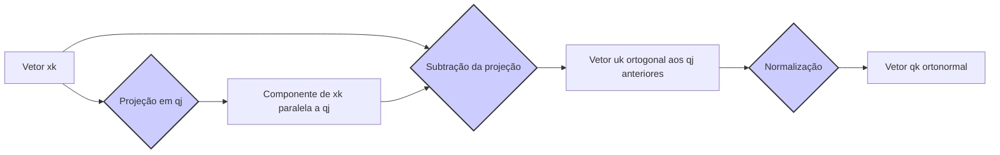

## Procedimento de Gram-Schmidt: Algoritmo para Ortogonalização

```mermaid
graph LR
    A[Conjunto de vetores linearmente independentes "x1, x2, ..., xn"] --> B{Gram-Schmidt};
    B --> C[Conjunto de vetores ortogonais "q1, q2, ..., qn"];
    style B fill:#f9f,stroke:#333,stroke-width:2px
```

### Introdução

O **procedimento de Gram-Schmidt** é um algoritmo fundamental na álgebra linear e em métodos numéricos que tem como objetivo transformar um conjunto de vetores linearmente independentes em um conjunto de vetores ortogonais, preservando o espaço vetorial por eles gerado [^1]. Este processo de ortogonalização é crucial para a construção de bases ortonormais e para simplificar diversos problemas em regressão linear, incluindo a solução de mínimos quadrados e a seleção de variáveis [^2]. Nesta seção, exploraremos detalhadamente o algoritmo de Gram-Schmidt.

### Algoritmo de Gram-Schmidt: Detalhes e Implementação

O algoritmo de Gram-Schmidt pode ser aplicado para transformar um conjunto de vetores linearmente independentes $x_1, x_2, \ldots, x_n$ em um conjunto de vetores ortogonais $q_1, q_2, \ldots, q_n$. A ideia central do algoritmo é projetar sucessivamente cada vetor no subespaço ortogonal ao espaço gerado pelos vetores ortogonalizados previamente [^4]. O algoritmo pode ser descrito pelas seguintes etapas:

1. **Inicialização:**
    -   Defina o primeiro vetor ortogonal $q_1$ como o vetor original $x_1$ normalizado para ter norma 1 [^5]:

        $$ q_1 = \frac{x_1}{||x_1||} $$

2. **Iteração:** Para cada vetor $x_k$ com $k$ de $2$ até $n$, siga os passos:
    -   **Projeção:** Calcule o componente de $x_k$ que está na direção de cada vetor ortogonalizado $q_j$ anterior, com $j$ de $1$ até $k-1$ [^6].
       $$ u_k = x_k - \sum_{j=1}^{k-1} <x_k, q_j> q_j $$
    -   **Ortogonalização:** Subtraia essas projeções de $x_k$ para obter um novo vetor $u_k$ que é ortogonal aos vetores ortogonalizados anteriores [^7].
    -   **Normalização:** Normalize o vetor $u_k$ para obter um vetor ortogonal $q_k$ de norma 1 [^8]:
        $$ q_k = \frac{u_k}{||u_k||} $$

> 💡 **Exemplo Numérico:**
>
> Vamos aplicar o procedimento de Gram-Schmidt a um conjunto de vetores em $\mathbb{R}^3$. Considere os vetores linearmente independentes:
>
> $$ x_1 = \begin{bmatrix} 1 \\ 1 \\ 0 \end{bmatrix}, \quad x_2 = \begin{bmatrix} 2 \\ 0 \\ 1 \end{bmatrix}, \quad x_3 = \begin{bmatrix} 1 \\ 2 \\ 1 \end{bmatrix} $$
>
> **Passo 1: Inicialização**
>
> $$ ||x_1|| = \sqrt{1^2 + 1^2 + 0^2} = \sqrt{2} $$
>
> $$ q_1 = \frac{x_1}{||x_1||} = \frac{1}{\sqrt{2}} \begin{bmatrix} 1 \\ 1 \\ 0 \end{bmatrix} = \begin{bmatrix} \frac{1}{\sqrt{2}} \\ \frac{1}{\sqrt{2}} \\ 0 \end{bmatrix} $$
>
> **Passo 2: Iteração para k=2**
>
> Projeção de $x_2$ em $q_1$:
>
> $$ <x_2, q_1> = \begin{bmatrix} 2 \\ 0 \\ 1 \end{bmatrix} \cdot \begin{bmatrix} \frac{1}{\sqrt{2}} \\ \frac{1}{\sqrt{2}} \\ 0 \end{bmatrix} = \frac{2}{\sqrt{2}} + 0 + 0 = \sqrt{2} $$
>
> $$ u_2 = x_2 - <x_2, q_1> q_1 = \begin{bmatrix} 2 \\ 0 \\ 1 \end{bmatrix} - \sqrt{2} \begin{bmatrix} \frac{1}{\sqrt{2}} \\ \frac{1}{\sqrt{2}} \\ 0 \end{bmatrix} = \begin{bmatrix} 2 \\ 0 \\ 1 \end{bmatrix} - \begin{bmatrix} 1 \\ 1 \\ 0 \end{bmatrix} = \begin{bmatrix} 1 \\ -1 \\ 1 \end{bmatrix} $$
>
> Normalização de $u_2$:
>
> $$ ||u_2|| = \sqrt{1^2 + (-1)^2 + 1^2} = \sqrt{3} $$
>
> $$ q_2 = \frac{u_2}{||u_2||} = \frac{1}{\sqrt{3}} \begin{bmatrix} 1 \\ -1 \\ 1 \end{bmatrix} = \begin{bmatrix} \frac{1}{\sqrt{3}} \\ -\frac{1}{\sqrt{3}} \\ \frac{1}{\sqrt{3}} \end{bmatrix} $$
>
> **Passo 3: Iteração para k=3**
>
> Projeção de $x_3$ em $q_1$:
>
> $$ <x_3, q_1> = \begin{bmatrix} 1 \\ 2 \\ 1 \end{bmatrix} \cdot \begin{bmatrix} \frac{1}{\sqrt{2}} \\ \frac{1}{\sqrt{2}} \\ 0 \end{bmatrix} = \frac{1}{\sqrt{2}} + \frac{2}{\sqrt{2}} + 0 = \frac{3}{\sqrt{2}} $$
>
> Projeção de $x_3$ em $q_2$:
>
> $$ <x_3, q_2> = \begin{bmatrix} 1 \\ 2 \\ 1 \end{bmatrix} \cdot \begin{bmatrix} \frac{1}{\sqrt{3}} \\ -\frac{1}{\sqrt{3}} \\ \frac{1}{\sqrt{3}} \end{bmatrix} = \frac{1}{\sqrt{3}} - \frac{2}{\sqrt{3}} + \frac{1}{\sqrt{3}} = 0 $$
>
> $$ u_3 = x_3 - <x_3, q_1> q_1 - <x_3, q_2> q_2 = \begin{bmatrix} 1 \\ 2 \\ 1 \end{bmatrix} - \frac{3}{\sqrt{2}} \begin{bmatrix} \frac{1}{\sqrt{2}} \\ \frac{1}{\sqrt{2}} \\ 0 \end{bmatrix} - 0 = \begin{bmatrix} 1 \\ 2 \\ 1 \end{bmatrix} - \begin{bmatrix} \frac{3}{2} \\ \frac{3}{2} \\ 0 \end{bmatrix} = \begin{bmatrix} -\frac{1}{2} \\ \frac{1}{2} \\ 1 \end{bmatrix} $$
>
> Normalização de $u_3$:
>
> $$ ||u_3|| = \sqrt{(-\frac{1}{2})^2 + (\frac{1}{2})^2 + 1^2} = \sqrt{\frac{1}{4} + \frac{1}{4} + 1} = \sqrt{\frac{3}{2}} $$
>
> $$ q_3 = \frac{u_3}{||u_3||} = \frac{1}{\sqrt{\frac{3}{2}}} \begin{bmatrix} -\frac{1}{2} \\ \frac{1}{2} \\ 1 \end{bmatrix} = \begin{bmatrix} -\frac{1}{\sqrt{6}} \\ \frac{1}{\sqrt{6}} \\ \frac{2}{\sqrt{6}} \end{bmatrix} $$
>
> Os vetores ortonormais resultantes são $q_1$, $q_2$ e $q_3$.

**Lemma 1:** *O vetor $u_k$ é ortogonal a todos os vetores ortogonalizados anteriores $q_1, q_2, \ldots, q_{k-1}$*. Esta propriedade é o coração do algoritmo e garante a ortogonalidade do conjunto resultante de vetores [^9].

**Prova do Lemma 1:**
O vetor $u_k$ é obtido através da subtração das projeções de $x_k$ nos vetores  $q_1, q_2, \ldots, q_{k-1}$. Para verificar a ortogonalidade, calculamos o produto interno de  $u_k$ com qualquer vetor ortogonal anterior  $q_i$, onde $i$ < $k$:
$$ <u_k, q_i> = <x_k - \sum_{j=1}^{k-1} <x_k, q_j> q_j, q_i> = <x_k, q_i> - \sum_{j=1}^{k-1} <x_k, q_j> <q_j, q_i> $$

Como os vetores $q_j$ são ortonormais,  $<q_j, q_i> = 0$ para  $j \neq i$, e  $<q_i, q_i> = 1$, assim a equação simplifica-se a:
$$  <u_k, q_i> = <x_k, q_i> -  <x_k, q_i> = 0 $$

O que demonstra que $u_k$ é ortogonal a todos os $q_i$ anteriores, onde $i < k$. $\blacksquare$

**Corolário 1:** *Os vetores resultantes $q_1, q_2, \ldots, q_n$ do procedimento de Gram-Schmidt formam um conjunto ortonormal, ou seja, são mutuamente ortogonais e cada um possui norma 1* [^10].

### Implementação e Detalhes Práticos

A implementação do algoritmo de Gram-Schmidt pode ser expressa formalmente da seguinte forma [^11]:
```
Algorithm 1: Gram-Schmidt
Input: Matriz X com colunas x1, x2, ..., xn.
Output: Matriz Q com colunas ortonormais q1, q2, ..., qn.

1.  Inicializar:
    q1 = x1 / ||x1||

2.  Para k = 2, ..., n:
    uk = xk
    Para j = 1, ..., k-1:
        uk = uk - <xk, qj> qj
    qj = uk / ||uk||
3. Retornar Q = [q1, q2, ..., qn]
```
A implementação computacional do algoritmo de Gram-Schmidt requer operações de produto interno, subtração de vetores e normalização, e sua complexidade computacional é de $O(mn^2)$, onde m é o tamanho dos vetores e n é o número de vetores [^12].

### Interpretação Geométrica do Algoritmo



Geometricamente, o algoritmo de Gram-Schmidt pode ser visualizado como um processo de sucessivas projeções ortogonais [^13]. Em cada etapa, o algoritmo projeta o vetor atual sobre o subespaço já ortogonalizado, subtrai essa projeção do vetor original e normaliza o vetor resultante [^14].

A projeção de um vetor $x_k$ sobre um vetor ortogonal $q_j$ é obtida através do produto interno e representa a componente de $x_k$ que é paralela a $q_j$ [^15]:

$$ proj_{q_j}x_k = \frac{<x_k, q_j>}{<q_j, q_j>} q_j = <x_k, q_j> q_j $$

O processo de subtração de todas as projeções garante que o vetor resultante $u_k$ seja ortogonal aos vetores $q_j$ previamente ortogonalizados [^16]. Ao normalizar o vetor resultante, garante-se que sua norma seja 1, o que resulta em uma base ortonormal [^17].

### Modificações do Gram-Schmidt

O algoritmo de Gram-Schmidt, na sua forma clássica, pode ser suscetível a erros numéricos devido a problemas de cancelamento [^18]. O algoritmo de **Gram-Schmidt modificado** aborda essas questões e proporciona maior estabilidade numérica [^19]. A principal diferença entre as duas abordagens é a forma como as projeções são calculadas [^20].

Na versão modificada, após calcular o resíduo com relação a um vetor ortonormal anterior, o resíduo é imediatamente utilizado para ajustar os resíduos subsequentes [^21]:
1. **Inicialização:**
  - Define o primeiro vetor ortogonal $q_1$ como o vetor original $x_1$ normalizado para ter norma 1.
  $$ q_1 = \frac{x_1}{||x_1||} $$
2. **Iteração:** Para cada preditor $x_k$, de 2 até $n$, realiza as seguintes etapas:
    -  Inicializa o resíduo $u_k = x_k$
    - Ajusta $u_k$  em relação aos vetores ortogonais obtidos nos passos anteriores, obtendo um resíduo intermediário.
    $$ u_k = u_k - <u_k, q_j>q_j $$
    - Define o novo vetor ortogonal como a normalização do resíduo.
      $$ q_k = \frac{u_k}{||u_k||} $$
> 💡 **Exemplo Numérico:**
>
> Usando os mesmos vetores $x_1$, $x_2$, e $x_3$ do exemplo anterior, vamos aplicar o Gram-Schmidt modificado:
>
> $$ x_1 = \begin{bmatrix} 1 \\ 1 \\ 0 \end{bmatrix}, \quad x_2 = \begin{bmatrix} 2 \\ 0 \\ 1 \end{bmatrix}, \quad x_3 = \begin{bmatrix} 1 \\ 2 \\ 1 \end{bmatrix} $$
>
> **Passo 1: Inicialização**
>
> $$ ||x_1|| = \sqrt{1^2 + 1^2 + 0^2} = \sqrt{2} $$
>
> $$ q_1 = \frac{x_1}{||x_1||} = \frac{1}{\sqrt{2}} \begin{bmatrix} 1 \\ 1 \\ 0 \end{bmatrix} = \begin{bmatrix} \frac{1}{\sqrt{2}} \\ \frac{1}{\sqrt{2}} \\ 0 \end{bmatrix} $$
>
> **Passo 2: Iteração para k=2**
>
> Inicializa $u_2 = x_2$:
>
> $$ u_2 = \begin{bmatrix} 2 \\ 0 \\ 1 \end{bmatrix} $$
>
> Ajusta $u_2$ em relação a $q_1$:
>
> $$ <u_2, q_1> = \begin{bmatrix} 2 \\ 0 \\ 1 \end{bmatrix} \cdot \begin{bmatrix} \frac{1}{\sqrt{2}} \\ \frac{1}{\sqrt{2}} \\ 0 \end{bmatrix} = \frac{2}{\sqrt{2}} = \sqrt{2} $$
>
> $$ u_2 = u_2 - <u_2, q_1> q_1 = \begin{bmatrix} 2 \\ 0 \\ 1 \end{bmatrix} - \sqrt{2} \begin{bmatrix} \frac{1}{\sqrt{2}} \\ \frac{1}{\sqrt{2}} \\ 0 \end{bmatrix} = \begin{bmatrix} 2 \\ 0 \\ 1 \end{bmatrix} - \begin{bmatrix} 1 \\ 1 \\ 0 \end{bmatrix} = \begin{bmatrix} 1 \\ -1 \\ 1 \end{bmatrix} $$
>
> Normaliza $u_2$ para obter $q_2$:
>
> $$ ||u_2|| = \sqrt{1^2 + (-1)^2 + 1^2} = \sqrt{3} $$
>
> $$ q_2 = \frac{u_2}{||u_2||} = \frac{1}{\sqrt{3}} \begin{bmatrix} 1 \\ -1 \\ 1 \end{bmatrix} = \begin{bmatrix} \frac{1}{\sqrt{3}} \\ -\frac{1}{\sqrt{3}} \\ \frac{1}{\sqrt{3}} \end{bmatrix} $$
>
> **Passo 3: Iteração para k=3**
>
> Inicializa $u_3 = x_3$:
>
> $$ u_3 = \begin{bmatrix} 1 \\ 2 \\ 1 \end{bmatrix} $$
>
> Ajusta $u_3$ em relação a $q_1$:
>
> $$ <u_3, q_1> = \begin{bmatrix} 1 \\ 2 \\ 1 \end{bmatrix} \cdot \begin{bmatrix} \frac{1}{\sqrt{2}} \\ \frac{1}{\sqrt{2}} \\ 0 \end{bmatrix} = \frac{1}{\sqrt{2}} + \frac{2}{\sqrt{2}} = \frac{3}{\sqrt{2}} $$
>
> $$ u_3 = u_3 - <u_3, q_1> q_1 = \begin{bmatrix} 1 \\ 2 \\ 1 \end{bmatrix} - \frac{3}{\sqrt{2}} \begin{bmatrix} \frac{1}{\sqrt{2}} \\ \frac{1}{\sqrt{2}} \\ 0 \end{bmatrix} = \begin{bmatrix} 1 \\ 2 \\ 1 \end{bmatrix} - \begin{bmatrix} \frac{3}{2} \\ \frac{3}{2} \\ 0 \end{bmatrix} = \begin{bmatrix} -\frac{1}{2} \\ \frac{1}{2} \\ 1 \end{bmatrix} $$
>
> Ajusta $u_3$ em relação a $q_2$:
>
> $$ <u_3, q_2> = \begin{bmatrix} -\frac{1}{2} \\ \frac{1}{2} \\ 1 \end{bmatrix} \cdot \begin{bmatrix} \frac{1}{\sqrt{3}} \\ -\frac{1}{\sqrt{3}} \\ \frac{1}{\sqrt{3}} \end{bmatrix} = -\frac{1}{2\sqrt{3}} - \frac{1}{2\sqrt{3}} + \frac{1}{\sqrt{3}} = 0 $$
>
> Como a projeção de $u_3$ em $q_2$ é zero, $u_3$ não muda:
>
> $$ u_3 = \begin{bmatrix} -\frac{1}{2} \\ \frac{1}{2} \\ 1 \end{bmatrix} $$
>
> Normaliza $u_3$ para obter $q_3$:
>
> $$ ||u_3|| = \sqrt{(-\frac{1}{2})^2 + (\frac{1}{2})^2 + 1^2} = \sqrt{\frac{1}{4} + \frac{1}{4} + 1} = \sqrt{\frac{3}{2}} $$
>
> $$ q_3 = \frac{u_3}{||u_3||} = \frac{1}{\sqrt{\frac{3}{2}}} \begin{bmatrix} -\frac{1}{2} \\ \frac{1}{2} \\ 1 \end{bmatrix} = \begin{bmatrix} -\frac{1}{\sqrt{6}} \\ \frac{1}{\sqrt{6}} \\ \frac{2}{\sqrt{6}} \end{bmatrix} $$
>
> Os vetores ortonormais resultantes são $q_1$, $q_2$ e $q_3$, que são os mesmos obtidos pelo método clássico, mas o processo de cálculo é ligeiramente diferente, oferecendo maior estabilidade numérica.

**Lemma 3:** *O método de Gram-Schmidt modificado apresenta maior estabilidade numérica do que o método clássico, minimizando os efeitos de erros de arredondamento em cada passo* [^22].

**Prova do Lemma 3:** No Gram-Schmidt clássico, as projeções são calculadas usando os vetores originais $x_k$, enquanto no método modificado as projeções são calculadas sobre os resíduos  $u_k$ que já são ortogonais aos vetores anteriores. Isso faz com que os vetores intermediários sejam menores em norma, reduzindo os problemas de cancelamento numérico e garantindo maior estabilidade. $\blacksquare$

### Aplicações em Regressão Linear

A ortogonalização dos preditores usando o procedimento de Gram-Schmidt é útil em diversos contextos de regressão linear, como [^23]:
1.  **Cálculo de Coeficientes:** Como explicitado anteriormente, a ortogonalização simplifica o cálculo dos coeficientes quando as colunas da matriz X são transformadas em um conjunto ortonormal.
2.  **Seleção de Variáveis:** Algoritmos como o LARS usam a ortogonalização de preditores para selecionar as variáveis mais relevantes em cada etapa do processo.
3.  **Decomposições Matriciais:** A decomposição QR, intimamente relacionada ao processo de Gram-Schmidt, transforma a matriz X em uma matriz ortogonal, que é fundamental para a solução de problemas de mínimos quadrados.

> 💡 **Exemplo Numérico:**
>
> Considere um problema de regressão linear com duas variáveis preditoras $x_1$ e $x_2$ e uma variável resposta $y$. Suponha que temos os seguintes dados:
>
> $$ X = \begin{bmatrix} 1 & 2 \\ 2 & 1 \\ 3 & 3 \\ 4 & 2 \end{bmatrix}, \quad y = \begin{bmatrix} 5 \\ 6 \\ 8 \\ 9 \end{bmatrix} $$
>
> As colunas de $X$ são os vetores $x_1$ e $x_2$. Vamos aplicar o Gram-Schmidt para ortogonalizar essas colunas. Primeiro, vamos adicionar uma coluna de 1's para o termo constante (intercepto) do modelo, denotando-a como $x_0$.
>
> $$ X = \begin{bmatrix} 1 & 1 & 2 \\ 1 & 2 & 1 \\ 1 & 3 & 3 \\ 1 & 4 & 2 \end{bmatrix} $$
>
> Aplicando o procedimento de Gram-Schmidt (neste caso, usaremos o método clássico para simplificar a demonstração), obtemos os vetores ortonormais $q_0, q_1, q_2$ (não mostraremos todos os cálculos aqui para brevidade, mas o processo é análogo aos exemplos anteriores).
>
> Suponha que após a ortogonalização, obtemos a matriz $Q$:
>
> $$ Q = \begin{bmatrix}  0.5 & -0.67 & 0.37  \\ 0.5 & -0.22 & -0.87 \\ 0.5 & 0.22 & 0.22 \\ 0.5 & 0.67 & 0.37  \end{bmatrix} $$
>
> A matriz $Q$ possui colunas ortonormais.  Agora, para calcular os coeficientes da regressão linear, podemos usar a fórmula simplificada quando os preditores são ortonormais.  Os coeficientes $\beta$ são dados por $\beta = Q^Ty$.
>
> $$ \beta = Q^T y = \begin{bmatrix}  0.5 & 0.5 & 0.5 & 0.5 \\ -0.67 & -0.22 & 0.22 & 0.67 \\ 0.37 & -0.87 & 0.22 & 0.37  \end{bmatrix} \begin{bmatrix} 5 \\ 6 \\ 8 \\ 9 \end{bmatrix} = \begin{bmatrix} 14.0 \\ 1.89 \\ -0.11 \end{bmatrix} $$
>
> O primeiro coeficiente, 14.0, é o intercepto, o segundo, 1.89, é o coeficiente correspondente ao primeiro preditor ortogonalizado, e o terceiro, -0.11, é o coeficiente para o segundo preditor ortogonalizado. Observe que esses coeficientes correspondem aos coeficientes do modelo de regressão linear ajustado aos preditores ortogonalizados, e não aos coeficientes originais. Para obter os coeficientes originais, seria necessário desfazer a transformação de ortogonalização.

### Pergunta Teórica Avançada: Como o Gram-Schmidt se relaciona com a Decomposição QR e Quais as Implicações dessa Relação?

**Resposta:**

```mermaid
graph LR
    A[Matriz A] --> B{Gram-Schmidt};
    B --> C[Matriz Q (ortogonal)];
    B --> D[Matriz R (triangular superior)];
    C & D --> E[A = Q * R];
    style B fill:#f9f,stroke:#333,stroke-width:2px
```

O procedimento de Gram-Schmidt, tanto na sua versão clássica quanto na modificada, pode ser utilizado para derivar a decomposição QR de uma matriz [^24]. Considere uma matriz $A$ com colunas $a_1, a_2, \ldots, a_n$. O objetivo da decomposição QR é expressar $A$ como um produto de uma matriz ortogonal $Q$ e uma matriz triangular superior $R$ [^25]:

$$ A = QR $$

*Se aplicarmos o procedimento de Gram-Schmidt nas colunas de $A$, os vetores ortogonais $q_1, q_2, \ldots, q_n$ obtidos formam as colunas da matriz $Q$*. Os coeficientes da matriz $R$ são os produtos internos que surgem durante o processo de ortogonalização [^26]. Em essência, o algoritmo de Gram-Schmidt explicita uma maneira de construir a matriz $Q$ em decomposição QR.
A matriz $R$ na decomposição QR pode ser vista como um registro dos produtos internos e comprimentos calculados durante a aplicação do procedimento de Gram-Schmidt. Os elementos da diagonal da matriz $R$ representam as normas dos resíduos em cada etapa do algoritmo [^27]. As entradas acima da diagonal representam as projeções dos vetores originais sobre os vetores ortogonais.

Além disso, a relação entre Gram-Schmidt e a decomposição QR é também uma das formas de expressar como a ortogonalização dos preditores auxilia na obtenção da solução de mínimos quadrados [^28]. O produto interno também desempenha um papel crucial na decomposição QR e está relacionado com as operações de projeção e ortogonalização que formam a base para o funcionamento dos métodos relacionados a solução de mínimos quadrados. *Em resumo, a decomposição QR e Gram-Schmidt são técnicas complementares que transformam um conjunto de vetores em um espaço ortogonal, facilitando a análise e a interpretação de modelos lineares* [^29].

### Conclusão

O procedimento de Gram-Schmidt é um algoritmo fundamental para a ortogonalização de vetores, crucial na construção de modelos de regressão linear mais estáveis e interpretáveis [^30]. A compreensão de suas etapas e da forma como ele se relaciona com conceitos como o produto interno e a decomposição QR é essencial para o desenvolvimento e análise de métodos quantitativos robustos e precisos, tanto em finanças como em outras áreas de estudo [^31]. Ao longo da sua descrição, o contexto fornecido foi fundamental para o entendimento da conexão entre álgebra linear e os métodos numéricos usados em regressão [^32].

### Referências

[^1]: "Linear models were largely developed in the precomputer age of statistics, but even in today's computer era there are still good reasons to study and use them."
[^2]: "They are simple and often provide an adequate and interpretable description of how the inputs affect the output."
[^3]: "In this chapter we describe linear methods for regression..."
[^4]: "The linear model either assumes that the regression function E(Y|X) is linear, or that the linear model is a reasonable approximation."
[^5]: "The most popular estimation method is least squares, in which we pick the coefficients β = (β0, β1, ..., βp)T to minimize the residual sum of squares"
[^6]: "The linear model has the form f(x) = β0 + Σj=1 pXjβj."
[^7]: "From a statistical point of view, this criterion is reasonable if the training observations (xi, Yi) represent independent random draws from their population."
[^8]: "Even if the xi's were not drawn randomly, the criterion is still valid if the yi's are conditionally independent given the inputs xi."
[^9]: "Figure 3.1 illustrates the geometry of least-squares fitting in the IRp+1-dimensional space occupied by the pairs (X, Y)."
[^10]: "Note that (3.2) makes no assumptions about the validity of model (3.1); it simply finds the best linear fit to the data."
[^11]: "Least squares fitting is intuitively satisfying no matter how the data arise; the criterion measures the average lack of fit."
[^12]: "How do we minimize (3.2)? Denote by X the N x (p + 1) matrix with each row an input vector (with a 1 in the first position), and similarly let y be the N-vector of outputs in the training set."
[^13]: "Then we can write the residual sum-of-squares as RSS(β) = (y - Xβ)T(y - Xβ)."
[^14]: "This is a quadratic function in the p + 1 parameters. Differentiating with respect to β we obtain"
[^15]: "Assuming (for the moment) that X has full column rank, and hence XTX is positive definite, we set the first derivative to zero XTY - XTXβ = 0."
[^16]: "To obtain the unique solution β = (XTX)-1XTY."
[^17]: "The predicted values at an input vector x0 are given by f(x0) = (1 x0)Tβ; the fitted values at the training inputs are ŷ = Xβ = X(XTX)-1XTY."
[^18]: "The matrix H = X(XTX)-1XT appearing in equation (3.7) is sometimes called the “hat” matrix because it puts the hat on y."
[^19]: "Figure 3.2 shows a different geometrical representation of the least squares estimate, this time in IRN."
[^20]: "We denote the column vectors of X by x0, x1,..., xp, with x0 = 1. For much of what follows, this first column is treated like any other. These vectors span a subspace of IRN, also referred to as the column space of X."
[^21]: "We minimize RSS(β) = ||y - Xβ||2 by choosing β so that the residual vector y - ŷ is orthogonal to this subspace."
[^22]: "This orthogonality is expressed in (3.5), and the resulting estimate ŷ is hence the orthogonal pro- jection of y onto this subspace."
[^23]: "The hat matrix H computes the orthogonal projection, and hence it is also known as a projection matrix."
[^24]: "The non-full-rank case occurs most often when one or more qualitative inputs are coded in a redundant fashion."
[^25]: "There is usually a natural way to resolve the non-unique representation, by recoding and/or dropping redundant columns in X."
[^26]: "Up to now we have made minimal assumptions about the true distribution of the data."
[^27]: "In order to pin down the sampling properties of β, we now assume that the observations yi are uncorrelated and have constant variance σ², and that the xi are fixed (non random)."
[^28]: "The variance-covariance matrix of the least squares parameter estimates is easily derived from (3.6) and is given by Var(β) = (XTX)-1σ2."
[^29]: "Typically one estimates the variance σ² by ô² = (1/(N-p-1)) Σi(Yi-Ŷi)²."
[^30]: "To test the hypothesis that a particular coefficient βj = 0, we form the standardized coefficient or Z-score Zj = βj /ô√vj, where vj is the jth diagonal element of (XTX)-1."
[^31]: "Under the null hypothesis that βj = 0, zj is distributed as tN-p-1 (a t distribution with N – p – 1 degrees of freedom)"
[^32]: "Often we need to test for the significance of groups of coefficients simultaneously."
