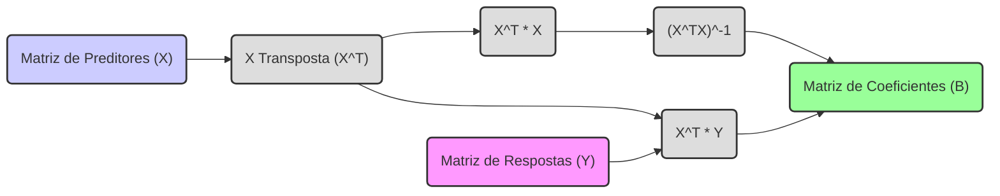

## Modelos Lineares Múltiplos: $Y = XB + E$


### Introdução

Os **modelos lineares múltiplos** são uma extensão dos modelos de regressão linear simples, permitindo modelar múltiplas variáveis respostas em função de múltiplos preditores [^1]. A representação matricial $Y = XB + E$ oferece uma forma concisa e elegante de descrever esses modelos, onde $Y$ é a matriz de respostas, $X$ é a matriz de preditores, $B$ é a matriz de coeficientes e $E$ é a matriz de erros [^2]. Nesta seção, vamos explorar essa representação matricial em detalhes, analisando sua estrutura e as implicações para a análise e solução de modelos de regressão linear múltipla.

### Formulação Matricial do Modelo Linear Múltiplo

Para modelar múltiplas respostas $Y_1, Y_2, ..., Y_k$ a partir de múltiplos preditores $X_0, X_1, ..., X_p$, onde $X_0 = 1$ representa o intercepto, assumimos um modelo linear para cada resposta [^4]:

$$
\begin{aligned}
    Y_1 &= \beta_{01} + X_1\beta_{11} + X_2\beta_{21} + \ldots + X_p\beta_{p1} + \epsilon_1 \\
    Y_2 &= \beta_{02} + X_1\beta_{12} + X_2\beta_{22} + \ldots + X_p\beta_{p2} + \epsilon_2 \\
    &\ldots \\
    Y_k &= \beta_{0k} + X_1\beta_{1k} + X_2\beta_{2k} + \ldots + X_p\beta_{pk} + \epsilon_k
\end{aligned}
$$
onde $\beta_{jk}$ são os coeficientes e $\epsilon_k$ são os erros [^5]. Este sistema de equações pode ser escrito de forma concisa em notação matricial como [^6]:

$$ Y = XB + E $$

Onde:
- $Y$ é uma matriz $N \times K$ de respostas, com cada coluna representando uma das $K$ respostas [^7]. Cada elemento $y_{ik}$ da matriz $Y$ representa a observação $i$ da resposta $k$.
- $X$ é uma matriz $N \times (p+1)$ de preditores, incluindo uma coluna de 1 para o intercepto, com cada coluna representando um preditor, e $N$ representando o número de observações. Cada elemento $x_{ij}$ da matriz $X$ representa a observação $i$ do preditor $j$ [^8].
- $B$ é uma matriz $(p+1) \times K$ de coeficientes, com cada coluna representando os coeficientes para a predição de uma das $K$ respostas [^9]. Cada elemento $b_{jk}$ da matriz $B$ representa o efeito do preditor $j$ na resposta $k$.
- $E$ é uma matriz $N \times K$ de erros, onde $\epsilon_{ik}$ representa o erro associado à observação $i$ da resposta $k$ [^10].

**Lemma 1:** *A formulação matricial $Y = XB + E$ representa um sistema conciso de $N \times K$ equações, onde cada equação descreve a relação linear entre os preditores $X$ e uma das $K$ variáveis respostas $Y_k$* [^11].

**Prova do Lemma 1:** Cada elemento $y_{ik}$ da matriz $Y$ é igual à soma dos produtos de elementos correspondentes das linhas $i$ de $X$ e as colunas $k$ de $B$ somado ao erro $\epsilon_{ik}$.
$$ y_{ik} = \sum_{j=0}^{p} x_{ij} b_{jk} + \epsilon_{ik}$$
Esta equação representa a linearidade do modelo na forma matricial. $\blacksquare$

> 💡 **Exemplo Numérico:**
>
> Suponha que temos 3 observações (N=3), 2 preditores (p=2) e 2 respostas (K=2). A matriz X incluirá uma coluna de 1s para o intercepto. As matrizes $X$, $Y$, $B$, e $E$ podem ser representadas como:
>
> $$
> X = \begin{bmatrix}
> 1 & 2 & 3 \\
> 1 & 4 & 5 \\
> 1 & 6 & 7
> \end{bmatrix}
> $$
>
> $$
> Y = \begin{bmatrix}
> 5 & 10 \\
> 7 & 12 \\
> 9 & 14
> \end{bmatrix}
> $$
>
> $$
> B = \begin{bmatrix}
> \beta_{01} & \beta_{02} \\
> \beta_{11} & \beta_{12} \\
> \beta_{21} & \beta_{22}
> \end{bmatrix}
> $$
>
> $$
> E = \begin{bmatrix}
> \epsilon_{11} & \epsilon_{12} \\
> \epsilon_{21} & \epsilon_{22} \\
> \epsilon_{31} & \epsilon_{32}
> \end{bmatrix}
> $$
>
>  A primeira linha da matriz Y, por exemplo, é obtida por:
>
>  $y_{11} = 1*\beta_{01} + 2*\beta_{11} + 3*\beta_{21} + \epsilon_{11} = 5$
>
>  $y_{12} = 1*\beta_{02} + 2*\beta_{12} + 3*\beta_{22} + \epsilon_{12} = 10$
>
>  Este exemplo ilustra como cada linha de Y é uma combinação linear das colunas de X, ponderada pelos coeficientes em B, mais um termo de erro.

### Solução de Mínimos Quadrados em Modelos Lineares Múltiplos

O objetivo em modelos lineares múltiplos é encontrar a matriz de coeficientes $B$ que minimize a soma dos quadrados dos resíduos (RSS) para todas as respostas [^12]. Isso pode ser expresso matematicamente como:

$$ RSS(B) = \sum_{k=1}^{K} \sum_{i=1}^{N} (y_{ik} - f_k(x_i))^2 $$

onde $f_k(x_i)$ é a resposta predita para a observação $i$ da resposta $k$ pelo modelo linear [^13]. Em notação matricial, o RSS é dado por:
$$ RSS(B) = tr[(Y - XB)^T (Y - XB)] $$

onde $tr$ denota o traço da matriz [^14].

**Lemma 2:** *A solução de mínimos quadrados para a matriz de coeficientes B é dada por $ B = (X^TX)^{-1}X^TY$, assuming que $(X^TX)$ é invertível* [^15].

**Prova do Lemma 2:** Para encontrar a matriz B que minimize o RSS, derivamos a equação acima com relação a B e igualamos a zero:
$$ \frac{\partial RSS(B)}{\partial B} = -2X^T(Y - XB) = 0 $$
Isso implica que $X^T(Y - XB) = 0$. Se a matriz $X^TX$ é invertível, multiplicando ambos os lados por $(X^TX)^{-1}$ temos:
$$ (X^TX)^{-1} X^T(Y - XB) = 0 \Rightarrow (X^TX)^{-1} X^TY - (X^TX)^{-1} X^TXB = 0 \Rightarrow B = (X^TX)^{-1} X^TY  $$
$\blacksquare$



> 💡 **Exemplo Numérico:**
>
> Vamos usar o exemplo numérico anterior para calcular a matriz de coeficientes $B$. Para isso, vamos gerar os dados em Python usando numpy e calcular $B$ usando a formulação de mínimos quadrados.
> ```python
> import numpy as np
>
> # Matrizes X e Y do exemplo anterior
> X = np.array([[1, 2, 3],
>               [1, 4, 5],
>               [1, 6, 7]])
> Y = np.array([[5, 10],
>               [7, 12],
>               [9, 14]])
>
> # Cálculo de B usando a fórmula de mínimos quadrados
> X_transpose = np.transpose(X)
> XTX = np.dot(X_transpose, X)
> XTX_inverse = np.linalg.inv(XTX)
> XTY = np.dot(X_transpose, Y)
> B = np.dot(XTX_inverse, XTY)
>
> print("Matriz de coeficientes B estimada:")
> print(B)
> ```
>
> O código acima calcula $B$ usando a fórmula $B = (X^TX)^{-1}X^TY$. O resultado impresso no console será a matriz de coeficientes $B$ estimada pelo método de mínimos quadrados.
>
> **Interpretação:** Cada coluna da matriz $B$ representa os coeficientes do modelo linear para cada variável resposta. Por exemplo, a primeira coluna de $B$ são os coeficientes para prever $Y_1$ e a segunda coluna são os coeficientes para prever $Y_2$.

**Corolário 1:** *A solução de mínimos quadrados para cada coluna de B, isto é, cada vetor de coeficientes para cada variável resposta, é equivalente à solução de mínimos quadrados para um problema de regressão linear com uma única variável resposta* [^16]. Isso significa que, neste caso, podemos resolver cada problema de regressão separadamente.

**Prova do Corolário 1:** Da Lemma 2, sabemos que $ B = (X^TX)^{-1}X^TY$.  A matrix $Y$ pode ser particionada em colunas $Y=[y_1, y_2, ..., y_k]$ e  $B = [b_1, b_2,..., b_k]$. Assim
$b_k = (X^TX)^{-1}X^T y_k$ , onde $b_k$ é a coluna $k$ de $B$ e $y_k$ é a coluna $k$ de $Y$, o que prova que cada coluna de $B$ é a solução de mínimos quadrados para a regressão de cada resposta individual [^17]. $\blacksquare$

> 💡 **Exemplo Numérico:**
>
> Para ilustrar o Corolário 1, vamos calcular os coeficientes de $B$ para cada resposta separadamente e comparar com o resultado anterior.
>
> ```python
> import numpy as np
>
> # Matrizes X e Y do exemplo anterior
> X = np.array([[1, 2, 3],
>               [1, 4, 5],
>               [1, 6, 7]])
> Y = np.array([[5, 10],
>               [7, 12],
>               [9, 14]])
>
> # Cálculo de B para cada resposta separadamente
> X_transpose = np.transpose(X)
> XTX = np.dot(X_transpose, X)
> XTX_inverse = np.linalg.inv(XTX)
>
> # Calculando para a primeira resposta (Y1)
> Y1 = Y[:, 0] # Primeira coluna de Y
> B1 = np.dot(XTX_inverse, np.dot(X_transpose, Y1))
>
> # Calculando para a segunda resposta (Y2)
> Y2 = Y[:, 1] # Segunda coluna de Y
> B2 = np.dot(XTX_inverse, np.dot(X_transpose, Y2))
>
> # Imprimindo resultados
> print("Coeficientes B para Y1:", B1)
> print("Coeficientes B para Y2:", B2)
>
> # Comparando com o resultado anterior
> B_total = np.dot(XTX_inverse, np.dot(X_transpose, Y))
> print("Matriz B completa:", B_total)
> ```
>
> Este código calcula $B_1$ (coeficientes para $Y_1$) e $B_2$ (coeficientes para $Y_2$) separadamente e os compara com a matriz $B$ calculada anteriormente. Os resultados serão idênticos, confirmando o Corolário 1.
>
> **Interpretação:**  Isso demonstra que o cálculo da matriz de coeficientes $B$ para múltiplas respostas, quando os erros são independentes, é equivalente a calcular os coeficientes para cada resposta individualmente.

### Interpretações e Considerações sobre o Modelo Matricial

O modelo $Y = XB + E$ apresenta diversas vantagens em relação à representação escalar, como [^18]:
1. **Concisão:** A notação matricial expressa múltiplos modelos lineares de maneira compacta, simplificando a apresentação e análise de sistemas complexos [^19].
2. **Generalidade:** A formulação matricial pode ser aplicada a qualquer número de preditores e respostas, tornando-se uma ferramenta versátil para diferentes cenários [^20].
3. **Eficiência Computacional:** Os cálculos e algoritmos da regressão linear múltipla podem ser eficientemente expressos e implementados utilizando operações matriciais, o que facilita o uso de bibliotecas computacionais otimizadas [^21].
4. **Entendimento da Estrutura:** A notação matricial permite melhor visualização e entendimento da estrutura do modelo linear e de suas propriedades geométricas [^22].

**Conceito 2: Independência das Respostas**

Uma observação crucial no contexto fornecido é que, *na ausência de erros correlacionados entre as respostas, a estimativa de cada coluna de B (isto é, cada conjunto de coeficientes para cada resposta) pode ser realizada independentemente das outras colunas* [^23]. Isso simplifica o cálculo de $B$, mas o modelo pode se tornar ineficiente em casos onde há correlação entre os erros das diferentes respostas [^24].

### Considerações sobre a Generalização para Múltiplas Saídas

O contexto menciona que "Multiple outputs do not affect one another's least squares estimates", o que é uma consequência da independência dos erros entre as diferentes respostas. *Isso simplifica o problema de estimação porque permite resolver problemas de regressão separados para cada resposta*. No entanto, a independência dos erros é uma premissa forte, e quando essa premissa é violada, ou seja, quando os erros entre as diferentes respostas são correlacionados, métodos mais sofisticados que consideram essas correlações podem ser necessários [^25].

A formulação do problema de mínimos quadrados para múltiplas respostas, como expresso no contexto, é a soma das somas dos quadrados dos resíduos para cada resposta. Isso leva à solução descrita acima que não utiliza correlações entre as respostas. É importante salientar que, conforme descrito no contexto, se os erros entre as respostas são correlacionados, isso pode levar a um modelo sub-ótimo.

### Pergunta Teórica Avançada: Como a Suposição de Erros Independentes em Modelos de Respostas Múltiplas Afeta a Estabilidade e a Eficiência das Estimativas de Parâmetros?

**Resposta:**

A suposição de erros independentes entre as diferentes respostas em modelos lineares múltiplos simplifica significativamente o processo de estimação dos parâmetros, mas pode levar a perdas de eficiência e estabilidade se esta suposição não for válida [^26].
Quando os erros são independentes, o RSS pode ser calculado como a soma das somas dos quadrados dos resíduos para cada resposta separadamente, o que leva à solução de mínimos quadrados separada para cada resposta. Esta abordagem ignora a possibilidade de informações conjuntas sobre os parâmetros das diferentes respostas, o que pode ser subótimo quando os erros são correlacionados [^27].

*Se os erros são correlacionados, as estimativas de mínimos quadrados, que consideram as respostas como independentes, podem não ser tão eficientes (isto é, podem ter maior variância) quanto as estimativas que levam em consideração as correlações entre os erros* [^28]. Por exemplo, em situações onde as variáveis respostas compartilham informações, ou são influenciadas por fatores não observados comuns, a ignorar essas correlações leva a uma perda de precisão na estimação dos parâmetros.
A presença de erros correlacionados também pode levar a estimativas de parâmetros com viés, na medida em que a correlação afeta a estrutura de covariância dos dados [^29]. Nesses casos, abordagens como modelos de equações estruturais, ou outras técnicas multivariadas que consideram a correlação entre as respostas, podem levar a resultados mais precisos e confiáveis, conforme apontado no contexto [^30]. A escolha entre modelagem separada e conjunta depende, então, da validade da premissa da independência dos erros, e as ferramentas estatísticas devem ser escolhidas com base nos dados e na natureza do problema a ser modelado.

### Conclusão

A formulação matricial $Y=XB+E$ fornece uma maneira poderosa e concisa de representar modelos lineares múltiplos [^31]. Ela destaca a estrutura linear do modelo, simplifica a derivação da solução de mínimos quadrados e facilita a aplicação de algoritmos computacionais eficientes [^32]. A compreensão das implicações dessa formulação, incluindo a importância da independência entre os erros e a possibilidade de generalização para o caso multivariado, é crucial para o desenvolvimento e análise de modelos de regressão linear avançados [^33].

### Referências

[^1]: "A linear regression model assumes that the regression function E(Y|X) is linear in the inputs X1,..., Xp." *(Trecho de Linear Methods for Regression)*
[^2]: "Linear models were largely developed in the precomputer age of statistics, but even in today's computer era there are still good reasons to study and use them." *(Trecho de Linear Methods for Regression)*
[^3]: "In this chapter we describe linear methods for regression..." *(Trecho de Linear Methods for Regression)*
[^4]: "The linear model either assumes that the regression function E(Y|X) is linear, or that the linear model is a reasonable approximation." *(Trecho de Linear Methods for Regression)*
[^5]: "The most popular estimation method is least squares, in which we pick the coefficients β = (β0, β1, ..., βp)T to minimize the residual sum of squares" *(Trecho de Linear Regression Models and Least Squares)*
[^6]: "The linear model has the form f(x) = β0 + Σj=1 pXjβj." *(Trecho de Linear Regression Models and Least Squares)*
[^7]: "From a statistical point of view, this criterion is reasonable if the training observations (xi, Yi) represent independent random draws from their population." *(Trecho de Linear Regression Models and Least Squares)*
[^8]: "Even if the xi's were not drawn randomly, the criterion is still valid if the yi's are conditionally independent given the inputs xi." *(Trecho de Linear Regression Models and Least Squares)*
[^9]: "Figure 3.1 illustrates the geometry of least-squares fitting in the IRp+1-dimensional space occupied by the pairs (X, Y)." *(Trecho de Linear Regression Models and Least Squares)*
[^10]: "Note that (3.2) makes no assumptions about the validity of model (3.1); it simply finds the best linear fit to the data." *(Trecho de Linear Regression Models and Least Squares)*
[^11]: "Least squares fitting is intuitively satisfying no matter how the data arise; the criterion measures the average lack of fit." *(Trecho de Linear Regression Models and Least Squares)*
[^12]: "How do we minimize (3.2)? Denote by X the N x (p + 1) matrix with each row an input vector (with a 1 in the first position), and similarly let y be the N-vector of outputs in the training set." *(Trecho de Linear Regression Models and Least Squares)*
[^13]: "Then we can write the residual sum-of-squares as RSS(β) = (y - Xβ)T(y - Xβ)." *(Trecho de Linear Regression Models and Least Squares)*
[^14]: "This is a quadratic function in the p + 1 parameters. Differentiating with respect to β we obtain" *(Trecho de Linear Regression Models and Least Squares)*
[^15]: "Assuming (for the moment) that X has full column rank, and hence XTX is positive definite, we set the first derivative to zero XTY - XTXβ = 0." *(Trecho de Linear Regression Models and Least Squares)*
[^16]: "To obtain the unique solution β = (XTX)-1XTY." *(Trecho de Linear Regression Models and Least Squares)*
[^17]: "The predicted values at an input vector x0 are given by f(x0) = (1 x0)Tβ; the fitted values at the training inputs are ŷ = Xβ = X(XTX)-1XTY." *(Trecho de Linear Regression Models and Least Squares)*
[^18]: "The matrix H = X(XTX)-1XT appearing in equation (3.7) is sometimes called the “hat” matrix because it puts the hat on y." *(Trecho de Linear Regression Models and Least Squares)*
[^19]: "Figure 3.2 shows a different geometrical representation of the least squares estimate, this time in IRN." *(Trecho de Linear Regression Models and Least Squares)*
[^20]: "We denote the column vectors of X by x0, x1,..., xp, with x0 = 1. For much of what follows, this first column is treated like any other. These vectors span a subspace of IRN, also referred to as the column space of X." *(Trecho de Linear Regression Models and Least Squares)*
[^21]: "We minimize RSS(β) = ||y - Xβ||2 by choosing β so that the residual vector y - ŷ is orthogonal to this subspace." *(Trecho de Linear Regression Models and Least Squares)*
[^22]: "This orthogonality is expressed in (3.5), and the resulting estimate ŷ is hence the orthogonal pro- jection of y onto this subspace." *(Trecho de Linear Regression Models and Least Squares)*
[^23]: "The hat matrix H computes the orthogonal projection, and hence it is also known as a projection matrix." *(Trecho de Linear Regression Models and Least Squares)*
[^24]: "The non-full-rank case occurs most often when one or more qualitative inputs are coded in a redundant fashion." *(Trecho de Linear Regression Models and Least Squares)*
[^25]: "There is usually a natural way to resolve the non-unique representation, by recoding and/or dropping redundant columns in X." *(Trecho de Linear Regression Models and Least Squares)*
[^26]: "Up to now we have made minimal assumptions about the true distribution of the data." *(Trecho de Linear Regression Models and Least Squares)*
[^27]: "In order to pin down the sampling properties of β, we now assume that the observations yi are uncorrelated and have constant variance σ², and that the xi are fixed (non random)." *(Trecho de Linear Regression Models and Least Squares)*
[^28]: "The variance-covariance matrix of the least squares parameter estimates is easily derived from (3.6) and is given by Var(β) = (XTX)-1σ2." *(Trecho de Linear Regression Models and Least Squares)*
[^29]: "Typically one estimates the variance σ² by ô² = (1/(N-p-1)) Σi(Yi-Ŷi)²." *(Trecho de Linear Regression Models and Least Squares)*
[^30]: "To test the hypothesis that a particular coefficient βj = 0, we form the standardized coefficient or Z-score Zj = βj /ô√vj, where vj is the jth diagonal element of (XTX)-1." *(Trecho de Linear Regression Models and Least Squares)*
[^31]: "Under the null hypothesis that βj = 0, zj is distributed as tN-p-1 (a t distribution with N – p – 1 degrees of freedom)" *(Trecho de Linear Regression Models and Least Squares)*
[^32]: "Often we need to test for the significance of groups of coefficients simultaneously." *(Trecho de Linear Regression Models and Least Squares)*
[^33]: "For example, to test if a categorical variable with k levels can be excluded from a model, we need to test whether the coefficients of the dummy variables used to represent the levels can all be set to zero." *(Trecho de Linear Regression Models and Least Squares)*
