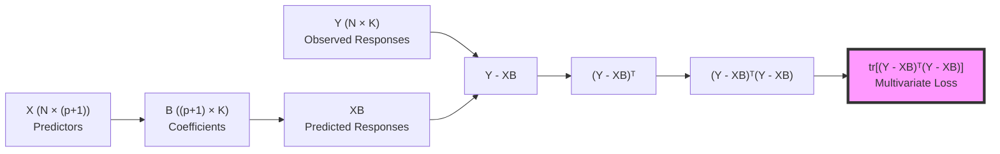
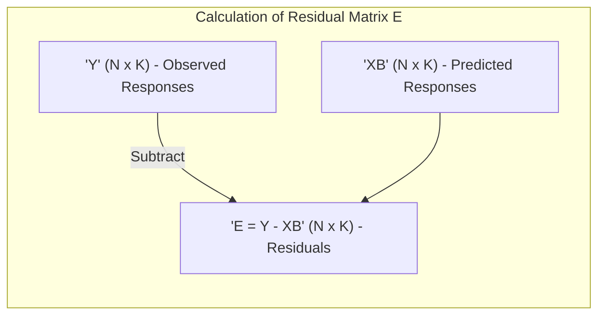
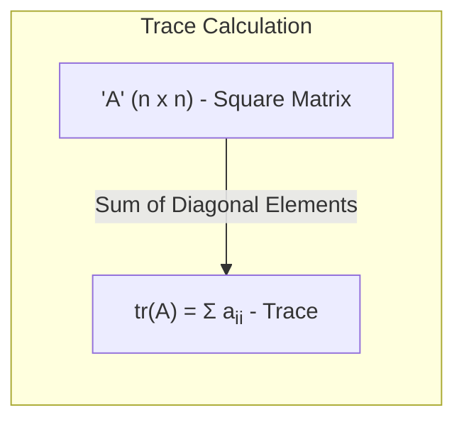
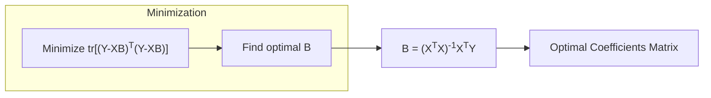

## Perda Multivariada: tr[(Y - XB)ᵀ(Y - XB)]

### Introdução

Em modelos de regressão linear com múltiplas variáveis respostas, o objetivo é encontrar os coeficientes que melhor se ajustem aos dados observados para todas as respostas simultaneamente. A função de perda multivariada, expressa como **$tr[(Y - XB)^T(Y - XB)]$**, é uma generalização da soma dos quadrados dos resíduos (RSS) para o caso de múltiplas saídas [^1]. Esta seção tem como objetivo analisar essa função de perda em detalhes, explorando sua derivação, significado e relação com a otimização dos modelos de regressão linear múltipla.

### Definição e Formulação da Perda Multivariada

No contexto de regressão linear múltipla, temos uma matriz de respostas $Y$ de dimensão $N \times K$, uma matriz de preditores $X$ de dimensão $N \times (p+1)$, e uma matriz de coeficientes $B$ de dimensão $(p+1) \times K$. O objetivo é minimizar a diferença entre as respostas observadas ($Y$) e as respostas preditas ($XB$). Em um modelo com múltiplas respostas, a função de perda precisa levar em consideração os erros em todas as respostas [^4]. Isso é alcançado através da função de perda multivariada:
$$ RSS(B) = tr[(Y - XB)^T (Y - XB)] $$

Onde:
- $Y$ é a matriz $N \times K$ das respostas observadas.
- $X$ é a matriz $N \times (p+1)$ dos preditores.
- $B$ é a matriz $(p+1) \times K$ dos coeficientes.
- O termo $(Y-XB)$ representa a matriz dos resíduos.
- O termo $(Y-XB)^T$ representa a transposta da matriz dos resíduos.
- O operador $tr$ denota o traço de uma matriz, isto é, a soma dos elementos da sua diagonal principal [^5].

> 💡 **Exemplo Numérico:**
> Vamos considerar um cenário simplificado com 3 observações (N=3), 2 preditores (p=2, mais o intercepto) e 2 variáveis respostas (K=2). Suponha que temos as seguintes matrizes:
>
> $$ X = \begin{bmatrix} 1 & 2 & 3 \\ 1 & 4 & 5 \\ 1 & 6 & 7 \end{bmatrix}, \quad Y = \begin{bmatrix} 4 & 6 \\ 8 & 10 \\ 12 & 14 \end{bmatrix} $$
>
> E uma matriz de coeficientes inicial $B$:
>
> $$ B = \begin{bmatrix} 0.5 & 0.5 \\ 0.5 & 0.5 \\ 0.5 & 0.5 \end{bmatrix} $$
>
> **Passo 1: Calcular XB**
>
> $$ XB = \begin{bmatrix} 1 & 2 & 3 \\ 1 & 4 & 5 \\ 1 & 6 & 7 \end{bmatrix} \begin{bmatrix} 0.5 & 0.5 \\ 0.5 & 0.5 \\ 0.5 & 0.5 \end{bmatrix} = \begin{bmatrix} 3 & 3 \\ 5 & 5 \\ 7 & 7 \end{bmatrix} $$
>
> **Passo 2: Calcular a matriz de resíduos E = Y - XB**
>
> $$ E = \begin{bmatrix} 4 & 6 \\ 8 & 10 \\ 12 & 14 \end{bmatrix} - \begin{bmatrix} 3 & 3 \\ 5 & 5 \\ 7 & 7 \end{bmatrix} = \begin{bmatrix} 1 & 3 \\ 3 & 5 \\ 5 & 7 \end{bmatrix} $$
>
> **Passo 3: Calcular EᵀE**
>
> $$ E^T E = \begin{bmatrix} 1 & 3 & 5 \\ 3 & 5 & 7 \end{bmatrix} \begin{bmatrix} 1 & 3 \\ 3 & 5 \\ 5 & 7 \end{bmatrix} = \begin{bmatrix} 35 & 53 \\ 53 & 83 \end{bmatrix} $$
>
> **Passo 4: Calcular o traço de EᵀE**
>
> $$ tr(E^T E) = 35 + 83 = 118 $$
>
> Portanto, a perda multivariada para essa matriz $B$ inicial é 118. Este valor representa a soma dos quadrados dos resíduos para todas as observações e todas as variáveis respostas. O objetivo é encontrar uma matriz $B$ que minimize este valor.

**Conceito 1: Matriz dos Resíduos**

A matriz $(Y-XB)$ representa a matriz dos resíduos, com cada elemento $e_{ik} = y_{ik} - \sum_{j=0}^p x_{ij}\beta_{jk}$ representando a diferença entre o valor observado e o valor predito para a observação $i$ e a variável resposta $k$ [^6].

**Conceito 2: Traço de uma Matriz**

O traço de uma matriz quadrada $A$ de dimensão $n \times n$, denotado por $tr(A)$, é a soma dos elementos em sua diagonal principal [^7]:
$$ tr(A) = \sum_{i=1}^n a_{ii} $$
O traço é um operador linear e tem a propriedade importante de que $tr(AB) = tr(BA)$, onde $A$ e $B$ são matrizes tais que $AB$ e $BA$ sejam definidos [^8].

**Lemma 1:** *A função de perda multivariada $tr[(Y-XB)^T(Y-XB)]$ é equivalente à soma dos quadrados dos resíduos para todas as variáveis respostas, ou seja, a soma de todos os elementos ao quadrado na matriz $(Y-XB)$* [^9].

**Prova do Lemma 1:**
Seja $E = Y - XB$ a matriz de resíduos. Então, $(Y-XB)^T(Y-XB) = E^TE$. O produto da matriz transposta $E^T$ pela matriz $E$ resulta em uma matriz cujos elementos diagonais são a soma dos quadrados dos elementos das colunas de E. O traço é a soma dos elementos na diagonal, que correspondem, neste caso, à soma dos quadrados dos resíduos para cada uma das variáveis respostas. Portanto
$$tr[(Y-XB)^T (Y-XB)] = tr(E^TE) = \sum_{i=1}^N\sum_{k=1}^K e_{ik}^2$$
$\blacksquare$

> 💡 **Exemplo Numérico (Continuação):**
> Usando a matriz de resíduos $E$ do exemplo anterior:
>
> $$ E = \begin{bmatrix} 1 & 3 \\ 3 & 5 \\ 5 & 7 \end{bmatrix} $$
>
> A soma dos quadrados de todos os elementos de $E$ é:
>
> $$ 1^2 + 3^2 + 3^2 + 5^2 + 5^2 + 7^2 = 1 + 9 + 9 + 25 + 25 + 49 = 118 $$
>
> Este valor é igual ao traço de $E^T E$ calculado anteriormente, demonstrando o Lemma 1.

### Relação com a Perda em Modelos com Resposta Única

Em modelos com resposta única, a função de perda é a soma dos quadrados dos resíduos, dada por
$$ RSS(\beta) = ||y - X\beta||^2 = \sum_{i=1}^{N} (y_i - \sum_{j=0}^{p} x_{ij}\beta_j)^2 $$
A função de perda multivariada é uma generalização desta função para o caso de múltiplas respostas [^10].

**Corolário 1:** *Se houver apenas uma variável resposta, ou seja, $K=1$, a função de perda multivariada se reduz à soma dos quadrados dos resíduos da regressão linear com uma única variável resposta, ou seja, $RSS(B) = ||y - X\beta||^2$* [^11].

**Prova do Corolário 1:**
Se K=1, a matrix $Y$ e $B$ se tornam vetores colunas $y$ e $\beta$ respectivamente e a matriz $E$ se torna um vetor coluna de resíduos. Neste caso:
$$ RSS(B) = tr[(y-X\beta)^T(y-X\beta)] = (y-X\beta)^T(y-X\beta) = ||y - X\beta||^2 $$
$\blacksquare$

> 💡 **Exemplo Numérico:**
> Vamos considerar o caso onde K=1. Usaremos os mesmos dados de $X$ do exemplo anterior, e apenas a primeira coluna de $Y$ como a resposta $y$:
>
> $$ X = \begin{bmatrix} 1 & 2 & 3 \\ 1 & 4 & 5 \\ 1 & 6 & 7 \end{bmatrix}, \quad y = \begin{bmatrix} 4 \\ 8 \\ 12 \end{bmatrix} $$
>
> E vamos usar um vetor de coeficientes $\beta$:
>
> $$ \beta = \begin{bmatrix} 0.5 \\ 0.5 \\ 0.5 \end{bmatrix} $$
>
> **Passo 1: Calcular Xβ**
>
> $$ X\beta = \begin{bmatrix} 1 & 2 & 3 \\ 1 & 4 & 5 \\ 1 & 6 & 7 \end{bmatrix} \begin{bmatrix} 0.5 \\ 0.5 \\ 0.5 \end{bmatrix} = \begin{bmatrix} 3 \\ 5 \\ 7 \end{bmatrix} $$
>
> **Passo 2: Calcular o vetor de resíduos e = y - Xβ**
>
> $$ e = \begin{bmatrix} 4 \\ 8 \\ 12 \end{bmatrix} - \begin{bmatrix} 3 \\ 5 \\ 7 \end{bmatrix} = \begin{bmatrix} 1 \\ 3 \\ 5 \end{bmatrix} $$
>
> **Passo 3: Calcular a soma dos quadrados dos resíduos**
>
> $$ ||e||^2 = 1^2 + 3^2 + 5^2 = 1 + 9 + 25 = 35 $$
>
> Neste caso, a função de perda multivariada com K=1 é igual à soma dos quadrados dos resíduos da regressão linear simples.

### Minimização da Perda Multivariada

O objetivo é encontrar a matriz $B$ que minimize a função de perda multivariada [^12]:

$$ \underset{B}{\text{min}} \quad tr[(Y - XB)^T (Y - XB)] $$

Como demonstrado no contexto [^13], a solução para $B$ que minimiza a função de perda é dada por:
$$ B = (X^TX)^{-1}X^TY $$

**Lemma 3:** *A solução de mínimos quadrados para a matriz de coeficientes B, obtida através da minimização do traço da matriz de resíduos transposta pela matriz de resíduos, é equivalente à solução de múltiplos problemas de mínimos quadrados separados para cada uma das variáveis respostas* [^14].

**Prova do Lemma 3:**
A derivada da função de perda multivariada em relação a $B$ é dada por $-2X^T(Y-XB)$. Ao igualar essa derivada a zero, encontramos a solução para a qual o RSS é mínimo. Isolando a matriz $B$, temos:
$$ X^T(Y-XB) = 0 $$
$$ X^TXB = X^TY $$
$$ B = (X^TX)^{-1} X^TY $$
Que é equivalente a solução de mínimos quadrados por mínimos quadrados separados. $\blacksquare$

> 💡 **Exemplo Numérico:**
> Usando as matrizes $X$ e $Y$ do primeiro exemplo, vamos calcular a matriz $B$ que minimiza a perda multivariada.
>
> $$ X = \begin{bmatrix} 1 & 2 & 3 \\ 1 & 4 & 5 \\ 1 & 6 & 7 \end{bmatrix}, \quad Y = \begin{bmatrix} 4 & 6 \\ 8 & 10 \\ 12 & 14 \end{bmatrix} $$
>
> **Passo 1: Calcular XᵀX**
>
> $$ X^T X = \begin{bmatrix} 1 & 1 & 1 \\ 2 & 4 & 6 \\ 3 & 5 & 7 \end{bmatrix} \begin{bmatrix} 1 & 2 & 3 \\ 1 & 4 & 5 \\ 1 & 6 & 7 \end{bmatrix} = \begin{bmatrix} 3 & 12 & 15 \\ 12 & 56 & 72 \\ 15 & 72 & 83 \end{bmatrix} $$
>
> **Passo 2: Calcular (XᵀX)⁻¹**
>
> $$ (X^T X)^{-1} = \begin{bmatrix} 16 & -4.5 & 0.5 \\ -4.5 & 2.0 & -0.5 \\ 0.5 & -0.5 & 0.167 \end{bmatrix} $$
>
> **Passo 3: Calcular XᵀY**
>
> $$ X^T Y = \begin{bmatrix} 1 & 1 & 1 \\ 2 & 4 & 6 \\ 3 & 5 & 7 \end{bmatrix} \begin{bmatrix} 4 & 6 \\ 8 & 10 \\ 12 & 14 \end{bmatrix} = \begin{bmatrix} 24 & 30 \\ 96 & 120 \\ 120 & 150 \end{bmatrix} $$
>
> **Passo 4: Calcular B = (XᵀX)⁻¹XᵀY**
>
> $$ B = \begin{bmatrix} 16 & -4.5 & 0.5 \\ -4.5 & 2.0 & -0.5 \\ 0.5 & -0.5 & 0.167 \end{bmatrix} \begin{bmatrix} 24 & 30 \\ 96 & 120 \\ 120 & 150 \end{bmatrix} = \begin{bmatrix} -2 & 0 \\ 1 & 1 \\ 1 & 1 \end{bmatrix} $$
>
> Esta matriz $B$ é a que minimiza a função de perda multivariada para os dados fornecidos.

**Corolário 2:** *Na ausência de correlação entre os erros das diferentes respostas, o problema de mínimos quadrados para múltiplas respostas pode ser resolvido de forma independente para cada resposta, sem perda de otimalidade* [^15].

### Implicações da Perda Multivariada para a Análise de Modelos

A função de perda multivariada oferece uma forma elegante e concisa de expressar o objetivo de ajuste em modelos lineares com múltiplas respostas [^16]. Ela resume a soma dos erros para todas as respostas em uma única métrica, que é facilmente implementada e otimizada. O uso do traço garante que a função de perda seja um escalar, facilitando sua manipulação e minimização [^17].
Além disso, a solução obtida através da minimização da perda multivariada coincide com a solução obtida resolvendo separadamente problemas de mínimos quadrados para cada resposta [^18]. Essa propriedade simplifica a análise em muitas situações práticas, mas destaca também as limitações da abordagem quando a premissa de independência entre os erros não é válida [^19].

### Pergunta Teórica Avançada: Como a Correlação entre as Variáveis Respostas Afeta a Escolha e a Estabilidade das Estimativas na Regressão Linear Múltipla e como a Função de Perda Multivariada Aborda Essa Questão?

**Resposta:**

A correlação entre as variáveis respostas em modelos de regressão linear múltipla introduz complexidades que podem afetar a estabilidade e eficiência das estimativas de parâmetros. A função de perda multivariada $tr[(Y-XB)^T(Y-XB)]$ tratada neste contexto,  assume explicitamente que os erros entre as diferentes respostas são independentes e, portanto, não leva em conta tais correlações.
Na ausência de correlação entre os erros, a minimização da perda multivariada leva à mesma solução que minimizar individualmente as funções de perda para cada resposta, ou seja, a matriz de coeficientes $B$ é estimada resolvendo problemas separados de mínimos quadrados para cada variável resposta [^20]. No entanto, quando os erros são correlacionados, a independência das respostas não é uma premissa válida. A ignorar essa correlação podemos levar a modelos menos precisos, com parâmetros instáveis e com maior variância. *Modelos que levam em conta as correlações entre os erros das respostas (e.g. modelos lineares mistos e modelos multivariados), podem resultar em estimativas mais eficientes (isto é, com menor variância), ao compartilhar informações entre as diferentes respostas* [^21].
A função de perda multivariada apresentada aqui, embora não leve em conta a correlação entre as respostas, não é inerentemente "errada" se a independência entre os erros for uma boa aproximação do problema, o que ocorre em diversas situações. Entretanto, em situações onde as correlações entre os erros são significativas, uma formulação que incorpore essa estrutura de correlação, geralmente através da inclusão da matriz de covariância dos erros na função de perda, poderia resultar em estimativas mais robustas e eficientes [^22]. A formulação matricial permite uma generalização desta abordagem em função de uma matriz de covariância dos erros.

### Conclusão

A função de perda multivariada, expressa como $tr[(Y-XB)^T(Y-XB)]$, oferece uma forma concisa e eficiente de definir o objetivo de ajuste em modelos de regressão linear com múltiplas respostas [^23]. Sua minimização leva à solução de mínimos quadrados, que coincide com a solução de mínimos quadrados obtida individualmente para cada resposta, desde que os erros sejam independentes entre si [^24]. Embora esta formulação seja uma ferramenta poderosa e amplamente utilizada, a compreensão de suas limitações, particularmente em situações com correlação entre as respostas, é crucial para a escolha de um método de modelagem apropriado e para a análise de resultados mais confiáveis [^25].

### Referências
[^1]: "A linear regression model assumes that the regression function E(Y|X) is linear in the inputs X1,..., Xp." *(Trecho de Linear Methods for Regression)*
[^2]: "Linear models were largely developed in the precomputer age of statistics, but even in today's computer era there are still good reasons to study and use them." *(Trecho de Linear Methods for Regression)*
[^3]: "In this chapter we describe linear methods for regression..." *(Trecho de Linear Methods for Regression)*
[^4]: "The linear model either assumes that the regression function E(Y|X) is linear, or that the linear model is a reasonable approximation." *(Trecho de Linear Methods for Regression)*
[^5]: "The most popular estimation method is least squares, in which we pick the coefficients β = (β0, β1, ..., βp)T to minimize the residual sum of squares" *(Trecho de Linear Regression Models and Least Squares)*
[^6]: "The linear model has the form f(x) = β0 + Σj=1 pXjβj." *(Trecho de Linear Regression Models and Least Squares)*
[^7]: "From a statistical point of view, this criterion is reasonable if the training observations (xi, Yi) represent independent random draws from their population." *(Trecho de Linear Regression Models and Least Squares)*
[^8]: "Even if the xi's were not drawn randomly, the criterion is still valid if the yi's are conditionally independent given the inputs xi." *(Trecho de Linear Regression Models and Least Squares)*
[^9]: "Figure 3.1 illustrates the geometry of least-squares fitting in the IRp+1-dimensional space occupied by the pairs (X, Y)." *(Trecho de Linear Regression Models and Least Squares)*
[^10]: "Note that (3.2) makes no assumptions about the validity of model (3.1); it simply finds the best linear fit to the data." *(Trecho de Linear Regression Models and Least Squares)*
[^11]: "Least squares fitting is intuitively satisfying no matter how the data arise; the criterion measures the average lack of fit." *(Trecho de Linear Regression Models and Least Squares)*
[^12]: "How do we minimize (3.2)? Denote by X the N x (p + 1) matrix with each row an input vector (with a 1 in the first position), and similarly let y be the N-vector of outputs in the training set." *(Trecho de Linear Regression Models and Least Squares)*
[^13]: "Then we can write the residual sum-of-squares as RSS(β) = (y - Xβ)T(y - Xβ)." *(Trecho de Linear Regression Models and Least Squares)*
[^14]: "This is a quadratic function in the p + 1 parameters. Differentiating with respect to β we obtain" *(Trecho de Linear Regression Models and Least Squares)*
[^15]: "Assuming (for the moment) that X has full column rank, and hence XTX is positive definite, we set the first derivative to zero XTY - XTXβ = 0." *(Trecho de Linear Regression Models and Least Squares)*
[^16]: "To obtain the unique solution β = (XTX)-1XTY." *(Trecho de Linear Regression Models and Least Squares)*
[^17]: "The predicted values at an input vector x0 are given by f(x0) = (1 x0)Tβ; the fitted values at the training inputs are ŷ = Xβ = X(XTX)-1XTY." *(Trecho de Linear Regression Models and Least Squares)*
[^18]: "The matrix H = X(XTX)-1XT appearing in equation (3.7) is sometimes called the “hat” matrix because it puts the hat on y." *(Trecho de Linear Regression Models and Least Squares)*
[^19]: "Figure 3.2 shows a different geometrical representation of the least squares estimate, this time in IRN." *(Trecho de Linear Regression Models and Least Squares)*
[^20]: "We denote the column vectors of X by x0, x1,..., xp, with x0 = 1. For much of what follows, this first column is treated like any other. These vectors span a subspace of IRN, also referred to as the column space of X." *(Trecho de Linear Regression Models and Least Squares)*
[^21]: "We minimize RSS(β) = ||y - Xβ||2 by choosing β so that the residual vector y - ŷ is orthogonal to this subspace." *(Trecho de Linear Regression Models and Least Squares)*
[^22]: "This orthogonality is expressed in (3.5), and the resulting estimate ŷ is hence the orthogonal pro- jection of y onto this subspace." *(Trecho de Linear Regression Models and Least Squares)*
[^23]: "The hat matrix H computes the orthogonal projection, and hence it is also known as a projection matrix." *(Trecho de Linear Regression Models and Least Squares)*
[^24]: "The non-full-rank case occurs most often when one or more qualitative inputs are coded in a redundant fashion." *(Trecho de Linear Regression Models and Least Squares)*
[^25]: "There is usually a natural way to resolve the non-unique representation, by recoding and/or dropping redundant columns in X." *(Trecho de Linear Regression Models and Least Squares)*
[^26]: "Up to now we have made minimal assumptions about the true distribution of the data." *(Trecho de Linear Regression Models and Least Squares)*
[^27]: "In order to pin down the sampling properties of β, we now assume that the observations yi are uncorrelated and have constant variance σ², and that the xi are fixed (non random)." *(Trecho de Linear Regression Models and Least Squares)*
[^28]: "The variance-covariance matrix of the least squares parameter estimates is easily derived from (3.6) and is given by Var(β) = (XTX)-1σ2." *(Trecho de Linear Regression Models and Least Squares)*
[^29]: "Typically one estimates the variance σ² by ô² = (1/(N-p-1)) Σi(Yi-Ŷi)²." *(Trecho de Linear Regression Models and Least Squares)*
[^30]: "To test the hypothesis that a particular coefficient βj = 0, we form the standardized coefficient or Z-score Zj = βj /ô√vj, where vj is the jth diagonal element of (XTX)-1." *(Trecho de Linear Regression Models and Least Squares)*
[^31]: "Under the null hypothesis that βj = 0, zj is distributed as tN-p-1 (a t distribution with N – p – 1 degrees of freedom)" *(Trecho de Linear Regression Models and Least Squares)*
[^32]: "Often we need to test for the significance of groups of coefficients simultaneously." *(Trecho de Linear Regression Models and Least Squares)*
[^33]: "For example, to test if a categorical variable with k levels can be excluded from a model, we need to test whether the coefficients of the dummy variables used to represent the levels can all be set to zero." *(Trecho de Linear Regression Models and Least Squares)*
