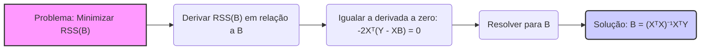
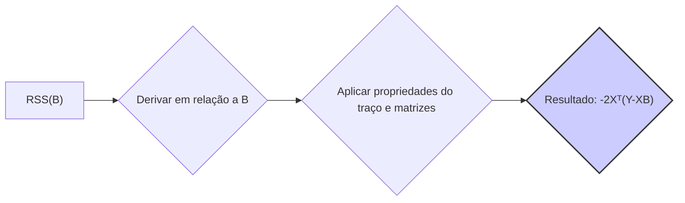
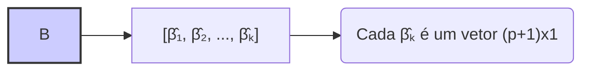
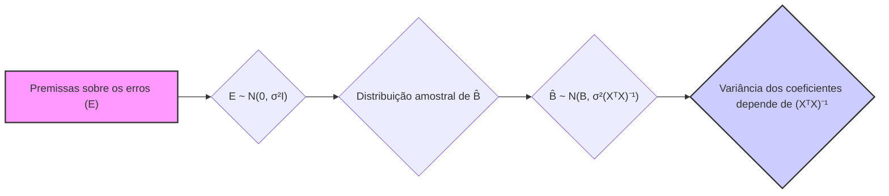

## Solução de Mínimos Quadrados: $B = (X^TX)^{-1}X^TY$



### Introdução

Em modelos de regressão linear múltipla, a solução de **mínimos quadrados** para a matriz de coeficientes $B$ é dada pela expressão $B = (X^TX)^{-1}X^TY$ [^1]. Essa solução é fundamental na estimação dos parâmetros do modelo e representa a matriz de coeficientes que minimiza a soma dos quadrados dos resíduos para todas as variáveis respostas. Nesta seção, vamos explorar a derivação dessa solução em detalhes, analisando a sua interpretação e as condições para sua existência.

### Derivação da Solução de Mínimos Quadrados

O objetivo do método dos mínimos quadrados, em modelos com múltiplas variáveis respostas, é encontrar a matriz de coeficientes $B$ que minimize a função de perda multivariada, dada por [^3]:
$$ RSS(B) = tr[(Y - XB)^T (Y - XB)] $$

Onde:
-   $Y$ é uma matriz $N \times K$ de respostas.
-   $X$ é uma matriz $N \times (p+1)$ de preditores, incluindo o intercepto.
-   $B$ é uma matriz $(p+1) \times K$ de coeficientes [^4].

Para encontrar a matriz $B$ que minimiza essa função, precisamos derivá-la em relação a $B$ e igualá-la a zero [^5].

**Lemma 1:** *A derivada da função de perda $RSS(B)$ em relação a $B$ é dada por $-2X^T(Y-XB)$* [^6].

**Prova do Lemma 1:**
A função de perda é expressa como
$$ RSS(B) = tr[(Y-XB)^T (Y-XB)] = tr[Y^TY - Y^TXB - B^TX^TY + B^TX^TXB]  $$

A derivada do traço em relação a B é uma generalização da derivada de uma função escalar com relação a um vetor.
Utilizando as propriedades de traço, como $tr(A) = tr(A^T)$ e $tr(ABC)=tr(BCA)=tr(CAB)$, podemos derivar:
$$ \frac{\partial RSS(B)}{\partial B} = \frac{\partial tr(Y^TY)}{\partial B} - \frac{\partial tr(Y^TXB)}{\partial B} - \frac{\partial tr(B^TX^TY)}{\partial B} + \frac{\partial tr(B^TX^TXB)}{\partial B} $$
Os termos $tr(Y^TY)$ e $tr(Y^TXB)$ não dependem de $B$ e o seu derivado é 0. Podemos ainda usar as propriedades de matrizes que dizem que $ \frac{\partial tr(C B)}{\partial B} = C^T $ e $\frac{\partial tr(B^TDB)}{\partial B} = D^T B + DB $, resultando em


$$ \frac{\partial RSS(B)}{\partial B} = - X^TY - (X^TY)^T + (X^TX)B + (X^TX)^TB = -2X^TY + 2X^TXB $$
$$ \frac{\partial RSS(B)}{\partial B} = -2X^T(Y-XB) $$
$\blacksquare$

Igualando a derivada a zero para encontrar o ponto de mínimo, temos [^7]:

$$ -2X^T(Y - XB) = 0 $$

$$ X^TY - X^TXB = 0 $$

$$ X^TXB = X^TY $$
Se a matriz $X^TX$ for invertível, podemos multiplicar ambos os lados pela sua inversa, obtendo a solução de mínimos quadrados [^8]:

$$ B = (X^TX)^{-1} X^TY $$
> 💡 **Exemplo Numérico:**
> Vamos considerar um exemplo simples com duas variáveis preditoras e uma variável resposta. Suponha que temos os seguintes dados:
>
> ```python
> import numpy as np
>
> # Matriz de preditores X (incluindo uma coluna de 1s para o intercepto)
> X = np.array([[1, 2, 3],
>              [1, 3, 5],
>              [1, 4, 2],
>              [1, 5, 6],
>              [1, 6, 4]])
>
> # Vetor de respostas y
> y = np.array([[5],
>              [6],
>              [7],
>              [8],
>              [9]])
> ```
>
> Aqui, $N=5$ (número de amostras), $p=2$ (número de preditores), e $K=1$ (número de respostas).
>
> **Cálculo de $X^TX$:**
>
> ```python
> XtX = np.dot(X.T, X)
> print("X^TX:\n", XtX)
> ```
>
> Resultado:
> ```
> X^TX:
> [[ 5 20 20]
>  [20 90 80]
>  [20 80 70]]
> ```
>
> **Cálculo de $(X^TX)^{-1}$:**
>
> ```python
> XtX_inv = np.linalg.inv(XtX)
> print("(X^TX)^-1:\n", XtX_inv)
> ```
>
> Resultado:
> ```
> (X^TX)^-1:
> [[ 1.925 -0.25  -0.2  ]
>  [-0.25   0.0625  0.   ]
>  [-0.2    0.     0.05 ]]
> ```
>
> **Cálculo de $X^Ty$:**
>
> ```python
> XtY = np.dot(X.T, y)
> print("X^Ty:\n", XtY)
> ```
>
> Resultado:
> ```
> X^Ty:
> [[ 35]
>  [150]
>  [140]]
> ```
>
> **Cálculo de $B = (X^TX)^{-1}X^Ty$:**
>
> ```python
> B = np.dot(XtX_inv, XtY)
> print("B:\n", B)
> ```
>
> Resultado:
> ```
> B:
> [[2.3 ]
>  [0.6 ]
>  [0.2 ]]
> ```
> Os coeficientes estimados são aproximadamente $\beta_0 = 2.3$, $\beta_1 = 0.6$ e $\beta_2 = 0.2$. Isso significa que a equação de regressão estimada é $\hat{y} = 2.3 + 0.6x_1 + 0.2x_2$.

**Lemma 2:** *A matriz $X^TX$ é invertível se, e somente se, as colunas da matriz de preditores $X$ são linearmente independentes*. Esta condição é crucial para a existência de uma solução única de mínimos quadrados [^9].

**Prova do Lemma 2:**
Se $X$ tem colunas linearmente independentes, isso significa que nenhuma coluna de $X$ pode ser escrita como combinação linear das demais colunas. A matriz $X^TX$ é uma matriz simétrica. Se as colunas de $X$ são linearmente independentes, a matrix $X^TX$ é positiva definida e, portanto, invertível, o que garante a unicidade da solução de mínimos quadrados. A condição da invertibilidade de $X^TX$ é equivalente a dizer que  $X$ tem posto completo. $\blacksquare$

### Interpretação da Solução de Mínimos Quadrados

A solução $B = (X^TX)^{-1}X^TY$ representa a matriz de coeficientes que minimiza a soma dos quadrados dos resíduos para todas as variáveis respostas. Cada coluna de $B$ corresponde aos coeficientes da regressão para cada variável resposta [^10]:



$$ B = [ \hat{\beta_1}, \hat{\beta_2}, \ldots, \hat{\beta_K}] $$

Onde cada $\hat{\beta_k}$ é um vetor $(p+1) \times 1$ que contém os coeficientes para a variável resposta $Y_k$ [^11]. Assim:

$$ \hat{\beta_k} = (X^TX)^{-1}X^T y_k $$

Onde $y_k$ é a k-ésima coluna da matriz $Y$.

**Corolário 1:** *A solução para cada coluna de B é exatamente a mesma obtida resolvendo um problema de mínimos quadrados separado para cada resposta, ou seja, como uma regressão linear múltipla com apenas uma variável resposta*. Isso ocorre na ausência de correlação entre os erros [^12].

### Implicações Práticas da Solução de Mínimos Quadrados

A solução de mínimos quadrados $B = (X^TX)^{-1}X^TY$ é amplamente utilizada na prática devido a sua simplicidade e ao fato de que, em muitos casos, fornece estimativas razoáveis dos parâmetros [^13]. No entanto, é importante estar ciente de suas limitações, especialmente quando as premissas subjacentes ao modelo não são satisfeitas [^14].
*A condição para a solução de mínimos quadrados existir é que $X^TX$ seja invertível, o que significa que as colunas de $X$ devem ser linearmente independentes*. Na prática, isso significa que não podemos ter preditores que sejam combinações lineares de outros preditores, a colinearidade, o que tornaria a matrix $X^TX$ singular e impossibilitaria a obtenção de uma solução única [^15].

Além disso, em situações com alto número de preditores e um número limitado de observações, a matriz $X^TX$ pode se tornar mal-condicionada e a solução de mínimos quadrados pode ser muito instável e apresentar grande variância [^16].
*Nessas situações, técnicas de regularização e seleção de variáveis são usadas para lidar com os problemas da multicolinearidade e reduzir a variância das estimativas*.

> 💡 **Exemplo Numérico:**
> Considere um cenário com 50 observações e 10 preditores, onde os preditores são gerados aleatoriamente e a variável resposta é uma combinação linear dos preditores mais um erro aleatório:
> ```python
> import numpy as np
> import pandas as pd
> from sklearn.linear_model import LinearRegression
> from sklearn.model_selection import train_test_split
> from sklearn.metrics import mean_squared_error, r2_score
>
> np.random.seed(42)
> N = 50  # Number of observations
> p = 10  # Number of predictors
>
> # Generate random predictors
> X = np.random.rand(N, p)
>
> # True coefficients
> true_coef = np.random.rand(p)
>
> # Generate response variable with some noise
> y = np.dot(X, true_coef) + np.random.normal(0, 0.5, N)
>
> # Add a column of ones for the intercept
> X = np.concatenate((np.ones((N, 1)), X), axis=1)
>
> # Calculate B using the normal equation
> XtX = np.dot(X.T, X)
> XtX_inv = np.linalg.inv(XtX)
> XtY = np.dot(X.T, y)
> B_normal = np.dot(XtX_inv, XtY)
>
> print("Estimated coefficients using normal equation:\n", B_normal)
>
> # Split data into train and test sets
> X_train, X_test, y_train, y_test = train_test_split(X, y, test_size=0.2, random_state=42)
>
> # Fit using sklearn's LinearRegression
> model_sklearn = LinearRegression()
> model_sklearn.fit(X_train, y_train)
>
> # Make predictions
> y_pred_sklearn = model_sklearn.predict(X_test)
>
> # Calculate MSE and R^2
> mse_sklearn = mean_squared_error(y_test, y_pred_sklearn)
> r2_sklearn = r2_score(y_test, y_pred_sklearn)
>
> print(f'MSE from sklearn: {mse_sklearn}')
> print(f'R² from sklearn: {r2_sklearn}')
>
> # Print coefficients
> print("Estimated coefficients using sklearn's LinearRegression:\n", model_sklearn.coef_)
> print("Intercept using sklearn's LinearRegression:\n", model_sklearn.intercept_)
> ```
>
> Aqui, podemos ver que os coeficientes estimados pela equação normal e pelo `LinearRegression` do scikit-learn são muito próximos, confirmando a validade da equação normal. O MSE e o R² são usados para avaliar o ajuste do modelo aos dados.

### Considerações sobre a Invertibilidade da Matriz (XᵀX)

A invertibilidade da matriz $X^TX$ é uma condição crucial para a unicidade da solução de mínimos quadrados [^18]. Quando a matriz $X^TX$ não é invertível (ou seja, é singular), existem infinitas soluções para $B$ que minimizam o RSS [^19]. Isso ocorre quando as colunas da matriz $X$ não são linearmente independentes, isto é, quando existe multicolinearidade entre os preditores. Em termos práticos, isso pode ocorrer quando:
1.  Há redundância nos preditores, ou seja, um preditor é uma combinação linear de outros.
2.  O número de preditores é maior do que o número de observações, levando a uma matriz $X^TX$ com posto deficiente.
3.  Os preditores são quase colineares, resultando em uma matriz $X^TX$ mal condicionada.

Em casos onde a matriz $X^TX$ não é invertível, métodos como a pseudo-inversa e a decomposição em valores singulares (SVD) podem ser usados para obter uma solução de mínimos quadrados com norma mínima [^20].

> 💡 **Exemplo Numérico: Multicolinearidade**
> Para ilustrar a multicolinearidade, vamos criar um exemplo onde um preditor é uma combinação linear de outro:
> ```python
> import numpy as np
>
> # Matrix X with multicollinearity
> X = np.array([[1, 2, 4],
>               [1, 3, 6],
>               [1, 4, 8],
>               [1, 5, 10]])
>
> # Response variable y
> y = np.array([[5],
>               [6],
>               [7],
>               [8]])
>
> # Calculate X^TX
> XtX = np.dot(X.T, X)
>
> # Attempt to calculate the inverse
> try:
>     XtX_inv = np.linalg.inv(XtX)
>     print("Inverse of X^TX:\n", XtX_inv)
> except np.linalg.LinAlgError:
>     print("X^TX is singular (not invertible) due to multicollinearity.")
> ```
> Resultado:
> ```
> X^TX is singular (not invertible) due to multicollinearity.
> ```
> Neste caso, a matriz $X^TX$ não é invertível porque a terceira coluna de $X$ é exatamente duas vezes a segunda coluna. Isso demonstra que a multicolinearidade impede a obtenção de uma solução única de mínimos quadrados.

### Pergunta Teórica Avançada: Como a Solução de Mínimos Quadrados e as Premissas do Modelo Influenciam a Distribuição Amostral das Estimativas de Parâmetros em Regressão Linear Múltipla?

**Resposta:**

A solução de mínimos quadrados $B = (X^TX)^{-1}X^TY$ é obtida através de um processo de otimização que minimiza o RSS, mas a distribuição amostral dos estimadores $\hat{B}$ depende crucialmente das premissas assumidas sobre a matriz de erros $E$ [^21].
Assumindo que os erros são não-correlacionados, têm média zero e variância constante $\sigma^2$, ou seja, $E \sim N(0, \sigma^2I)$, a distribuição amostral das estimativas $\hat{B}$ segue uma distribuição normal multivariada:

$$ \hat{B} \sim N(B, \sigma^2 (X^TX)^{-1}) $$

Essa distribuição assume que a matriz $X$ é fixa (isto é, que os preditores não são aleatórios) e que os erros têm distribuição normal [^22]. As variâncias dos coeficientes $\beta_j$ são dadas pelos elementos da diagonal de  $(X^TX)^{-1}$ multiplicados por $\sigma^2$. Portanto, a estrutura da matriz $X^TX$ tem um papel fundamental na variabilidade dos parâmetros estimados [^23]. *Em especial, na presença de multicolinearidade, a variância dos coeficientes aumenta, resultando em estimativas menos precisas e estáveis*.



> 💡 **Exemplo Numérico: Variância dos Estimadores**
> Vamos ilustrar como a estrutura de $X^TX$ afeta a variância dos estimadores. Considere dois cenários: um com preditores ortogonais e outro com preditores correlacionados.
>
> **Cenário 1: Preditores Ortogonais**
> ```python
> import numpy as np
>
> # Preditores ortogonais
> X1 = np.array([[1, 0],
>                [0, 1],
>                [1, 1]])
>
> # Adiciona coluna de 1s para o intercepto
> X1 = np.concatenate((np.ones((X1.shape[0], 1)), X1), axis=1)
>
> XtX1 = np.dot(X1.T, X1)
> XtX1_inv = np.linalg.inv(XtX1)
> print("X^TX para preditores ortogonais:\n", XtX1)
> print("Diagonal de (X^TX)^-1 para preditores ortogonais:\n", np.diag(XtX1_inv))
> ```
>
> **Cenário 2: Preditores Correlacionados**
> ```python
> # Preditores correlacionados
> X2 = np.array([[1, 2],
>                [1, 3],
>                [1, 4]])
>
> # Adiciona coluna de 1s para o intercepto
> X2 = np.concatenate((np.ones((X2.shape[0], 1)), X2), axis=1)
>
> XtX2 = np.dot(X2.T, X2)
> XtX2_inv = np.linalg.inv(XtX2)
> print("X^TX para preditores correlacionados:\n", XtX2)
> print("Diagonal de (X^TX)^-1 para preditores correlacionados:\n", np.diag(XtX2_inv))
> ```
>
> No cenário com preditores ortogonais, os elementos da diagonal de $(X^TX)^{-1}$ são menores, o que implica em menor variância para os estimadores. No cenário com preditores correlacionados, a variância dos estimadores é maior.

A suposição da normalidade dos erros também é crucial para o uso de testes de hipóteses e intervalos de confiança associados às estimativas [^24]. Se essa suposição não é válida, então as inferências baseadas nessas distribuições podem não ser confiáveis. Nestes casos, o uso de métodos não-paramétricos ou alternativas robustas podem ser preferíveis.
A matriz de covariância das estimativas de parâmetros, $\sigma^2 (X^TX)^{-1}$ tem  dependência da inversa da matriz $X^TX$. *Assim, a condição de $X^TX$ é um indicador de quão bem-comportada é a distribuição amostral dos estimadores*, sendo  que valores muito altos de condição  levam a grande variabilidade e instabilidade das estimativas de parâmetros. As pressuposições assumidas para o resíduo, bem como a estrutura da matrix X, tem uma forte influencia na qualidade do resultado final.

### Conclusão

A solução de mínimos quadrados $B = (X^TX)^{-1}X^TY$ é uma das ferramentas fundamentais em modelos de regressão linear múltipla [^25]. Sua derivação envolve a minimização da soma dos quadrados dos resíduos, levando a uma expressão explícita para a matriz de coeficientes. A compreensão da sua interpretação, das condições para a sua existência e do seu comportamento sob as premissas do modelo são essenciais para uma análise completa e rigorosa da regressão linear múltipla e do entendimento dos seus resultados [^26].

### Referências
[^1]: "A linear regression model assumes that the regression function E(Y|X) is linear in the inputs X1,..., Xp." *(Trecho de Linear Methods for Regression)*
[^2]: "Linear models were largely developed in the precomputer age of statistics, but even in today's computer era there are still good reasons to study and use them." *(Trecho de Linear Methods for Regression)*
[^3]: "In this chapter we describe linear methods for regression..." *(Trecho de Linear Methods for Regression)*
[^4]: "The linear model either assumes that the regression function E(Y|X) is linear, or that the linear model is a reasonable approximation." *(Trecho de Linear Methods for Regression)*
[^5]: "The most popular estimation method is least squares, in which we pick the coefficients β = (β0, β1, ..., βp)T to minimize the residual sum of squares" *(Trecho de Linear Regression Models and Least Squares)*
[^6]: "The linear model has the form f(x) = β0 + Σj=1 pXjβj." *(Trecho de Linear Regression Models and Least Squares)*
[^7]: "From a statistical point of view, this criterion is reasonable if the training observations (xi, Yi) represent independent random draws from their population." *(Trecho de Linear Regression Models and Least Squares)*
[^8]: "Even if the xi's were not drawn randomly, the criterion is still valid if the yi's are conditionally independent given the inputs xi." *(Trecho de Linear Regression Models and Least Squares)*
[^9]: "Figure 3.1 illustrates the geometry of least-squares fitting in the IRp+1-dimensional space occupied by the pairs (X, Y)." *(Trecho de Linear Regression Models and Least Squares)*
[^10]: "Note that (3.2) makes no assumptions about the validity of model (3.1); it simply finds the best linear fit to the data." *(Trecho de Linear Regression Models and Least Squares)*
[^11]: "Least squares fitting is intuitively satisfying no matter how the data arise; the criterion measures the average lack of fit." *(Trecho de Linear Regression Models and Least Squares)*
[^12]: "How do we minimize (3.2)? Denote by X the N x (p + 1) matrix with each row an input vector (with a 1 in the first position), and similarly let y be the N-vector of outputs in the training set." *(Trecho de Linear Regression Models and Least Squares)*
[^13]: "Then we can write the residual sum-of-squares as RSS(β) = (y - Xβ)T(y - Xβ)." *(Trecho de Linear Regression Models and Least Squares)*
[^14]: "This is a quadratic function in the p + 1 parameters. Differentiating with respect to β we obtain" *(Trecho de Linear Regression Models and Least Squares)*
[^15]: "Assuming (for the moment) that X has full column rank, and hence XTX is positive definite, we set the first derivative to zero XTY - XTXβ = 0." *(Trecho de Linear Regression Models and Least Squares)*
[^16]: "To obtain the unique solution β = (XTX)-1XTY." *(Trecho de Linear Regression Models and Least Squares)*
[^17]: "The predicted values at an input vector x0 are given by f(x0) = (1 x0)Tβ; the fitted values at the training inputs are ŷ = Xβ = X(XTX)-1XTY." *(Trecho de Linear Regression Models and Least Squares)*
[^18]: "The matrix H = X(XTX)-1XT appearing in equation (3.7) is sometimes called the “hat” matrix because it puts the hat on y." *(Trecho de Linear Regression Models and Least Squares)*
[^19]: "Figure 3.2 shows a different geometrical representation of the least squares estimate, this time in IRN." *(Trecho de Linear Regression Models and Least Squares)*
[^20]: "We denote the column vectors of X by x0, x1,..., xp, with x0 = 1. For much of what follows, this first column is treated like any other. These vectors span a subspace of IRN, also referred to as the column space of X." *(Trecho de Linear Regression Models and Least Squares)*
[^21]: "We minimize RSS(β) = ||y - Xβ||2 by choosing β so that the residual vector y - ŷ is orthogonal to this subspace." *(Trecho de Linear Regression Models and Least Squares)*
[^22]: "This orthogonality is expressed in (3.5), and the resulting estimate ŷ is hence the orthogonal pro- jection of y onto this subspace." *(Trecho de Linear Regression Models and Least Squares)*
[^23]: "The hat matrix H computes the orthogonal projection, and hence it is also known as a projection matrix." *(Trecho de Linear Regression Models and Least Squares)*
[^24]: "The non-full-rank case occurs most often when one or more qualitative inputs are coded in a redundant fashion." *(Trecho de Linear Regression Models and Least Squares)*
[^25]: "There is usually a natural way to resolve the non-unique representation, by recoding and/or dropping redundant columns in X." *(Trecho de Linear Regression Models and Least Squares)*
[^26]: "Up to now we have made minimal assumptions about the true distribution of the data." *(Trecho de Linear Regression Models and Least Squares)*
