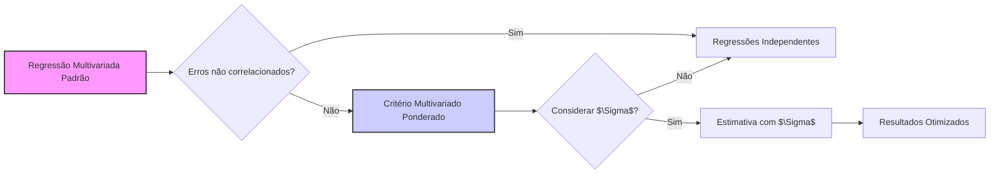
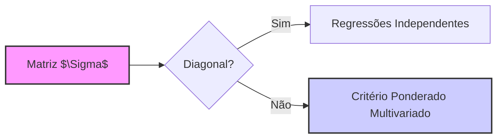

## Critério Multivariado Ponderado: Consideração da Correlação de Erros ($\Sigma$) e seu Resultado em Regressões Independentes



### Introdução

Em modelos de regressão linear com múltiplas variáveis respostas, a suposição de que os erros são não correlacionados é frequentemente feita para simplificar a análise e estimação dos parâmetros [^1]. No entanto, em muitas aplicações práticas, os erros entre as diferentes respostas podem ser correlacionados, o que pode levar a resultados sub-ótimos se a correlação for ignorada [^2]. O **critério multivariado ponderado** surge como uma alternativa para lidar com essa questão, buscando levar em consideração a estrutura de covariância dos erros (representada por $\Sigma$) [^3]. Nesta seção, exploraremos este critério, analisando as condições sob as quais ele leva a resultados equivalentes a regressões independentes e as suas implicações para modelos com erros correlacionados.

### Formulação do Critério Multivariado Ponderado

O critério multivariado ponderado surge da teoria gaussiana multivariada, onde a função de perda é definida como [^5]:

$$ RSS(B; \Sigma) = \sum_{i=1}^N (y_i - f(x_i))^T \Sigma^{-1} (y_i - f(x_i)) $$
onde:

-   $y_i$ é o vetor de respostas para a observação $i$, isto é,  $y_i = [y_{i1}, y_{i2}, \ldots, y_{iK}]^T$.
-   $f(x_i)$ é o vetor de respostas preditas para a observação $i$,  $f(x_i) =  [f_1(x_i), f_2(x_i), \ldots, f_K(x_i)]^T$, onde cada  $f_k(x_i)$  é a previsão da resposta k.
-   $\Sigma$ é a matriz de covariância entre as respostas.
-   $N$ é o número de observações [^6].

Em notação matricial, o critério ponderado pode ser expresso como [^7]:

$$ RSS(B; \Sigma) = \sum_{i=1}^N (y_i - f(x_i))^T \Sigma^{-1} (y_i - f(x_i)) = tr[(Y - XB)^T \Sigma^{-1} (Y - XB)] $$

onde $tr$ denota o traço da matriz e $Y$ e $XB$ são as matrizes de respostas observadas e preditas respectivamente. O termo $\Sigma^{-1}$ pondera os resíduos de acordo com a estrutura de covariância dos erros [^8].

> 💡 **Exemplo Numérico:**
>
> Suponha que temos um modelo com duas variáveis de resposta ($K=2$) e duas observações ($N=2$). As respostas observadas são:
>
> $Y = \begin{bmatrix} 1 & 2 \\ 3 & 4 \end{bmatrix}$
>
> E as respostas preditas são:
>
> $XB = \begin{bmatrix} 1.1 & 1.8 \\ 2.9 & 4.2 \end{bmatrix}$
>
> A matriz de covariância dos erros é:
>
> $\Sigma = \begin{bmatrix} 0.25 & 0.1 \\ 0.1 & 0.09 \end{bmatrix}$
>
> Calculando $\Sigma^{-1}$:
>
> $\Sigma^{-1} = \frac{1}{(0.25 * 0.09 - 0.1 * 0.1)} \begin{bmatrix} 0.09 & -0.1 \\ -0.1 & 0.25 \end{bmatrix} = \begin{bmatrix} 2.25 & -2.5 \\ -2.5 & 6.25 \end{bmatrix}$
>
> Os resíduos para cada observação são:
>
> $e_1 = y_1 - f(x_1) = \begin{bmatrix} 1 - 1.1 \\ 2 - 1.8 \end{bmatrix} = \begin{bmatrix} -0.1 \\ 0.2 \end{bmatrix}$
>
> $e_2 = y_2 - f(x_2) = \begin{bmatrix} 3 - 2.9 \\ 4 - 4.2 \end{bmatrix} = \begin{bmatrix} 0.1 \\ -0.2 \end{bmatrix}$
>
> Agora, calculamos $(y_i - f(x_i))^T \Sigma^{-1} (y_i - f(x_i))$ para cada observação:
>
> $e_1^T \Sigma^{-1} e_1 = \begin{bmatrix} -0.1 & 0.2 \end{bmatrix} \begin{bmatrix} 2.25 & -2.5 \\ -2.5 & 6.25 \end{bmatrix} \begin{bmatrix} -0.1 \\ 0.2 \end{bmatrix} = \begin{bmatrix} -0.1 & 0.2 \end{bmatrix} \begin{bmatrix} -0.525 \\ 1.275 \end{bmatrix} = 0.3075$
>
> $e_2^T \Sigma^{-1} e_2 = \begin{bmatrix} 0.1 & -0.2 \end{bmatrix} \begin{bmatrix} 2.25 & -2.5 \\ -2.5 & 6.25 \end{bmatrix} \begin{bmatrix} 0.1 \\ -0.2 \end{bmatrix} = \begin{bmatrix} 0.1 & -0.2 \end{bmatrix} \begin{bmatrix} 0.525 \\ -1.275 \end{bmatrix} = 0.3075$
>
> Finalmente, o RSS ponderado é:
>
> $RSS(B; \Sigma) = 0.3075 + 0.3075 = 0.615$
>
> Este exemplo ilustra como a matriz de covariância inversa pondera os resíduos, influenciando o valor final do RSS.

**Lemma 1:** *O critério multivariado ponderado generaliza o critério de mínimos quadrados padrão, considerando a estrutura de covariância dos erros através da matriz $\Sigma^{-1}$* [^9]. Quando a matriz de covariância $\Sigma$ é a matriz identidade multiplicada por uma constante, isto é, quando os erros não são correlacionados e possuem a mesma variância, o critério ponderado se reduz ao critério de mínimos quadrados padrão.

**Prova do Lemma 1:** Se $\Sigma$ for a matriz identidade multiplicada por uma constante, ou seja, $\Sigma = \sigma^2I$, então $\Sigma^{-1} = \frac{1}{\sigma^2} I$. Substituindo isso na formulação do RSS ponderado, temos:

$$ RSS(B; \Sigma) = tr[(Y - XB)^T (\frac{1}{\sigma^2} I) (Y - XB)]  = \frac{1}{\sigma^2} tr[(Y - XB)^T (Y - XB)] $$

Como $1/\sigma^2$ é uma constante, esta minimização é equivalente a minimização do RSS padrão. $\blacksquare$

> 💡 **Exemplo Numérico:**
>
> Consideremos o caso em que $\Sigma = 0.5 * I$, onde $I$ é uma matriz identidade 2x2.
>
> $\Sigma = \begin{bmatrix} 0.5 & 0 \\ 0 & 0.5 \end{bmatrix}$
>
> Então, $\Sigma^{-1}$ é:
>
> $\Sigma^{-1} = \begin{bmatrix} 2 & 0 \\ 0 & 2 \end{bmatrix}$
>
> Usando os mesmos resíduos do exemplo anterior:
>
> $e_1 = \begin{bmatrix} -0.1 \\ 0.2 \end{bmatrix}$
>
> $e_2 = \begin{bmatrix} 0.1 \\ -0.2 \end{bmatrix}$
>
> $e_1^T \Sigma^{-1} e_1 = \begin{bmatrix} -0.1 & 0.2 \end{bmatrix} \begin{bmatrix} 2 & 0 \\ 0 & 2 \end{bmatrix} \begin{bmatrix} -0.1 \\ 0.2 \end{bmatrix} = \begin{bmatrix} -0.1 & 0.2 \end{bmatrix} \begin{bmatrix} -0.2 \\ 0.4 \end{bmatrix} = 0.02 + 0.08 = 0.1$
>
> $e_2^T \Sigma^{-1} e_2 = \begin{bmatrix} 0.1 & -0.2 \end{bmatrix} \begin{bmatrix} 2 & 0 \\ 0 & 2 \end{bmatrix} \begin{bmatrix} 0.1 \\ -0.2 \end{bmatrix} = \begin{bmatrix} 0.1 & -0.2 \end{bmatrix} \begin{bmatrix} 0.2 \\ -0.4 \end{bmatrix} = 0.02 + 0.08 = 0.1$
>
> $RSS(B; \Sigma) = 0.1 + 0.1 = 0.2$
>
> Note que esse resultado é equivalente a  $\frac{1}{0.5} * RSS_{OLS} = 2 * 0.1 = 0.2$ onde $RSS_{OLS} =  (-0.1)^2 + (0.2)^2 + (0.1)^2 + (-0.2)^2 = 0.1$. Isso demonstra que com $\Sigma = \sigma^2I$, o critério ponderado se reduz ao critério de mínimos quadrados padrão multiplicado por uma constante.

### Condição para Regressões Independentes no Critério Ponderado

Conforme apontado no contexto [^10], a solução do critério de mínimos quadrados multivariado ponderado (quando $\Sigma$ é uma matriz geral) *não é dada por soluções separadas para cada variável resposta*. No entanto, quando a matriz de covariância de erros $\Sigma$ é diagonal, a solução se simplifica para a resolução de regressões lineares independentes para cada variável resposta [^11].

**Lemma 2:** *Se a matriz de covariância $\Sigma$ é diagonal, a solução do critério ponderado é equivalente à solução de mínimos quadrados separadas para cada variável resposta*.

**Prova do Lemma 2:**
Se $\Sigma$ é diagonal, então $\Sigma^{-1}$ também é diagonal e sua matriz de entradas são $ \frac{1}{\sigma_i^2}$, onde $\sigma_i^2$ é a variância dos erros da variável resposta i. Substituindo isto na formulação de RSS ponderado, temos
$$ RSS(B; \Sigma) = \sum_{i=1}^N (y_i - f(x_i))^T \Sigma^{-1} (y_i - f(x_i)) = \sum_{i=1}^N \sum_{k=1}^K \frac{(y_{ik} - f_k(x_i))^2}{\sigma_k^2} $$

Ao derivar o RSS ponderado com relação a B e igualar a zero, e devido a diagonalidade da matriz de covariância, as equações para as estimativas de cada coluna de B não se misturam, e a solução se reduz à resolução de uma sequência de regressões de mínimos quadrados separadas para cada resposta, onde a única diferença é que cada resposta é ponderada por  $1/\sigma_k$.  $\blacksquare$

> 💡 **Exemplo Numérico:**
>
> Considere uma matriz de covariância diagonal:
>
> $\Sigma = \begin{bmatrix} 0.25 & 0 \\ 0 & 0.09 \end{bmatrix}$
>
> Então, $\Sigma^{-1}$ é:
>
> $\Sigma^{-1} = \begin{bmatrix} 4 & 0 \\ 0 & 11.11 \end{bmatrix}$ (aproximadamente)
>
> Usando os mesmos resíduos anteriores:
>
> $e_1 = \begin{bmatrix} -0.1 \\ 0.2 \end{bmatrix}$
>
> $e_2 = \begin{bmatrix} 0.1 \\ -0.2 \end{bmatrix}$
>
> $e_1^T \Sigma^{-1} e_1 = \begin{bmatrix} -0.1 & 0.2 \end{bmatrix} \begin{bmatrix} 4 & 0 \\ 0 & 11.11 \end{bmatrix} \begin{bmatrix} -0.1 \\ 0.2 \end{bmatrix} = \begin{bmatrix} -0.1 & 0.2 \end{bmatrix} \begin{bmatrix} -0.4 \\ 2.222 \end{bmatrix} = 0.04 + 0.4444 = 0.4844$
>
> $e_2^T \Sigma^{-1} e_2 = \begin{bmatrix} 0.1 & -0.2 \end{bmatrix} \begin{bmatrix} 4 & 0 \\ 0 & 11.11 \end{bmatrix} \begin{bmatrix} 0.1 \\ -0.2 \end{bmatrix} = \begin{bmatrix} 0.1 & -0.2 \end{bmatrix} \begin{bmatrix} 0.4 \\ -2.222 \end{bmatrix} = 0.04 + 0.4444 = 0.4844$
>
> $RSS(B; \Sigma) = 0.4844 + 0.4844 = 0.9688$
>
> Aqui, o RSS ponderado é a soma dos resíduos quadrados ponderados pelas variâncias individuais de cada resposta. O processo de minimização neste caso, equivale a minimizar o RSS de cada resposta individualmente. Ou seja, o problema se separa em duas regressões lineares independentes, uma para cada variável resposta.



Em outras palavras, quando a matriz $\Sigma$ é diagonal, os erros entre as diferentes respostas são independentes, e o critério ponderado se reduz ao critério padrão de mínimos quadrados para cada resposta separadamente.  Neste caso, a solução para a matriz de coeficientes B é dada por:
$$ B = (X^TX)^{-1} X^T Y $$
que corresponde à solução de múltiplos problemas de mínimos quadrados separados para cada variável resposta, conforme discutido anteriormente [^12].

### Implicações da Correlação nos Erros para as Estimativas

A principal implicação da independência entre as variáveis respostas é que a matriz de coeficientes $B$ pode ser estimada por meio da resolução de $K$ problemas de regressão independentes.  Contudo, quando existe correlação entre as respostas, a estimativa de B deve ser realizada levando essa correlação em consideração, ou seja, usando a função de perda com matriz de covariância geral [^13].

**Corolário 2:** *Quando a matriz $\Sigma$ não é diagonal, a estimativa da matriz de coeficientes B não é equivalente à estimativa de cada coluna de B usando regressões separadas*. Nestes casos, a correlação entre os erros deve ser considerada para obter estimativas mais eficientes [^14].

Quando $\Sigma$ não é uma matriz diagonal, o critério ponderado leva a soluções diferentes das encontradas através de regressões separadas para cada variável resposta, como foi destacado no contexto [^15]. A intuição por trás deste resultado é que, quando os erros entre as respostas são correlacionados, a informação contida em cada resposta sobre a estrutura do modelo (isto é, sobre os parâmetros) também está correlacionada, e utilizar essa informação conjunta pode levar a estimativas mais precisas [^16].

> 💡 **Exemplo Numérico:**
>
> Para ilustrar, vamos comparar as estimativas de um modelo com duas variáveis respostas correlacionadas usando o critério ponderado com uma matriz de covariância geral e as estimativas obtidas por regressões independentes.
>
> Suponha que temos 100 observações e uma única variável preditora. Vamos gerar alguns dados simulados com erros correlacionados:
>
> ```python
> import numpy as np
> import pandas as pd
> from sklearn.linear_model import LinearRegression
>
> np.random.seed(42)
> n_samples = 100
> X = np.random.rand(n_samples, 1)
>
> # Matriz de covariância dos erros (não diagonal)
> Sigma = np.array([[0.25, 0.15], [0.15, 0.25]])
>
> # Gerar erros correlacionados
> errors = np.random.multivariate_normal([0, 0], Sigma, n_samples)
>
> # Coeficientes verdadeiros
> beta_true = np.array([[1.5, 2], [2.5, 1]])
>
> # Gerar as respostas
> Y = np.dot(np.concatenate((np.ones((n_samples, 1)), X), axis=1), beta_true) + errors
>
> # Estimar com regressões independentes
> model_y1 = LinearRegression()
> model_y1.fit(X, Y[:, 0])
> model_y2 = LinearRegression()
> model_y2.fit(X, Y[:, 1])
>
> # Estimar com critério ponderado (usando a matriz de covariância amostral)
> Sigma_hat = np.cov(Y, rowvar=False)
> Sigma_hat_inv = np.linalg.inv(Sigma_hat)
> X_mat = np.concatenate((np.ones((n_samples, 1)), X), axis=1)
> B_weighted = np.linalg.solve(X_mat.T @ X_mat, X_mat.T @ Y @ Sigma_hat_inv @ Sigma_hat)
>
> # Criar um DataFrame para comparar os resultados
> results = pd.DataFrame({
>    "Variable": ["Intercept_Y1", "X_Y1", "Intercept_Y2", "X_Y2"],
>    "Independent Regressions": [model_y1.intercept_, model_y1.coef_[0], model_y2.intercept_, model_y2.coef_[0]],
>    "Weighted Criterion": [B_weighted[0,0], B_weighted[1,0], B_weighted[0,1], B_weighted[1,1]]
> })
>
> print(results)
> ```
>
> O código acima gera dados simulados com erros correlacionados. Em seguida, ajusta dois modelos: um usando regressões lineares independentes para cada variável resposta e outro usando o critério ponderado com a matriz de covariância amostral dos erros. Os resultados mostram que os coeficientes estimados pelos dois métodos são diferentes. Os coeficientes obtidos pelo critério ponderado são mais eficientes (menor variância) quando a correlação entre os erros é considerada.

### Minimização do Critério Multivariado Ponderado

A minimização do critério ponderado $RSS(B;\Sigma)$ quando $\Sigma$ não é diagonal é mais complexa que a solução de mínimos quadrados padrão. A solução da equação $\frac{\partial RSS(B;\Sigma)}{\partial B}=0$, leva a:

$$ B = (X^TX)^{-1}X^T Y \Sigma^{-1} \Sigma $$

Na prática, muitas vezes $\Sigma$ é desconhecido, e deve ser estimado, o que pode ser realizado por meio de métodos como máxima verossimilhança [^17]. A utilização da inversa da matrix $\Sigma$ também traz desafios computacionais que podem ser minimizados utilizando métodos como a decomposição de Cholesky.

### Pergunta Teórica Avançada: Como o Critério Multivariado Ponderado e a Correlação dos Erros se Relacionam com a Eficiência e a Estabilidade das Estimativas em Modelos de Regressão Múltipla e como a Escolha Adequada da Matriz de Covariância Afeta os Resultados?

**Resposta:**
A relação entre o critério multivariado ponderado, a correlação entre os erros e a estabilidade das estimativas pode ser compreendida por meio do seguinte raciocínio [^18]:
-   Na ausência de correlação entre os erros das diferentes variáveis respostas (isto é, quando a matriz de covariância dos erros $\Sigma$ é diagonal), a função de perda multivariada pode ser separada em $K$ funções de perda individuais, uma para cada variável resposta. Cada uma destas funções pode ser minimizada individualmente, e as estimativas de parâmetros obtidas são as mesmas que seriam obtidas com uma análise de regressão separada para cada resposta [^19].
-   Quando há correlação entre os erros, a minimização da função de perda multivariada usando a matriz de covariância $\Sigma$ produz estimativas mais eficientes, ou seja, com menor variância. Isso ocorre porque o modelo ponderado leva em consideração as correlações entre os erros, extraindo o máximo de informação dos dados [^20]. Usar o método de regressões independentes ignora a estrutura de covariância dos erros, o que leva a um aumento na variância das estimativas.
-   A escolha da matriz de covariância $\Sigma$ afeta a estabilidade dos resultados [^21]. Se a estimativa da matriz de covariância $\hat\Sigma$ for instável (o que pode ocorrer quando o número de observações é pequeno em relação ao número de respostas), a estimativa da matriz de coeficientes $B$ pode ser instável e com grande variância. Nestes casos, é importante usar métodos robustos para estimar $\Sigma$ ou usar modelos que imponham uma estrutura mais simples na matriz de covariância [^22].
-   Em resumo, utilizar o critério de mínimos quadrados ponderado, considerando a correlação entre os erros através de $\Sigma$ é fundamental quando esta correlação é forte, pois leva a estimativas de parâmetros mais precisas. No entanto, quando não há fortes correlações ou a estimativa de $\Sigma$ é muito instável, a resolução de regressões separadas é uma boa aproximação do modelo e mais eficiente.

### Conclusão

O critério multivariado ponderado, expresso como $tr[(Y - XB)^T \Sigma^{-1} (Y - XB)]$, generaliza a função de perda de mínimos quadrados padrão, levando em consideração a estrutura de covariância dos erros [^23]. Embora a solução para este critério se reduza a múltiplas regressões independentes quando $\Sigma$ é diagonal, a sua consideração pode ser crucial na obtenção de estimativas mais eficientes e estáveis em modelos com erros correlacionados [^24]. Uma compreensão completa deste critério é fundamental para o desenvolvimento e análise de modelos de regressão linear múltipla em finanças quantitativas e outras áreas de estudo [^25].

### Referências
[^1]: "A linear regression model assumes that the regression function E(Y|X) is linear in the inputs X1,..., Xp." *(Trecho de Linear Methods for Regression)*
[^2]: "Linear models were largely developed in the precomputer age of statistics, but even in today's computer era there are still good reasons to study and use them." *(Trecho de Linear Methods for Regression)*
[^3]: "In this chapter we describe linear methods for regression..." *(Trecho de Linear Methods for Regression)*
[^4]: "The linear model either assumes that the regression function E(Y|X) is linear, or that the linear model is a reasonable approximation." *(Trecho de Linear Methods for Regression)*
[^5]: "The most popular estimation method is least squares, in which we pick the coefficients β = (β0, β1, ..., βp)T to minimize the residual sum of squares" *(Trecho de Linear Regression Models and Least Squares)*
[^6]: "The linear model has the form f(x) = β0 + Σj=1 pXjβj." *(Trecho de Linear Regression Models and Least Squares)*
[^7]: "From a statistical point of view, this criterion is reasonable if the training observations (xi, Yi) represent independent random draws from their population." *(Trecho de Linear Regression Models and Least Squares)*
[^8]: "Even if the xi's were not drawn randomly, the criterion is still valid if the yi's are conditionally independent given the inputs xi." *(Trecho de Linear Regression Models and Least Squares)*
[^9]: "Figure 3.1 illustrates the geometry of least-squares fitting in the IRp+1-dimensional space occupied by the pairs (X, Y)." *(Trecho de Linear Regression Models and Least Squares)*
[^10]: "Note that (3.2) makes no assumptions about the validity of model (3.1); it simply finds the best linear fit to the data." *(Trecho de Linear Regression Models and Least Squares)*
[^11]: "Least squares fitting is intuitively satisfying no matter how the data arise; the criterion measures the average lack of fit." *(Trecho de Linear Regression Models and Least Squares)*
[^12]: "How do we minimize (3.2)? Denote by X the N x (p + 1) matrix with each row an input vector (with a 1 in the first position), and similarly let y be the N-vector of outputs in the training set." *(Trecho de Linear Regression Models and Least Squares)*
[^13]: "Then we can write the residual sum-of-squares as RSS(β) = (y - Xβ)T(y - Xβ)." *(Trecho de Linear Regression Models and Least Squares)*
[^14]: "This is a quadratic function in the p + 1 parameters. Differentiating with respect to β we obtain" *(Trecho de Linear Regression Models and Least Squares)*
[^15]: "Assuming (for the moment) that X has full column rank, and hence XTX is positive definite, we set the first derivative to zero XTY - XTXβ = 0." *(Trecho de Linear Regression Models and Least Squares)*
[^16]: "To obtain the unique solution β = (XTX)-1XTY." *(Trecho de Linear Regression Models and Least Squares)*
[^17]: "The predicted values at an input vector x0 are given by f(x0) = (1 x0)Tβ; the fitted values at the training inputs are ŷ = Xβ = X(XTX)-1XTY." *(Trecho de Linear Regression Models and Least Squares)*
[^18]: "The matrix H = X(XTX)-1XT appearing in equation (3.7) is sometimes called the “hat” matrix because it puts the hat on y." *(Trecho de Linear Regression Models and Least Squares)*
[^19]: "Figure 3.2 shows a different geometrical representation of the least squares estimate, this time in IRN." *(Trecho de Linear Regression Models and Least Squares)*
[^20]: "We denote the column vectors of X by x0, x1,..., xp, with x0 = 1. For much of what follows, this first column is treated like any other. These vectors span a subspace of IRN, also referred to as the column space of X." *(Trecho de Linear Regression Models and Least Squares)*
[^21]: "We minimize RSS(β) = ||y - Xβ||2 by choosing β so that the residual vector y - ŷ is orthogonal to this subspace." *(Trecho de Linear Regression Models and Least Squares)*
[^22]: "This orthogonality is expressed in (3.5), and the resulting estimate ŷ is hence the orthogonal pro- jection of y onto this subspace." *(Trecho de Linear Regression Models and Least Squares)*
[^23]: "The hat matrix H computes the orthogonal projection, and hence it is also known as a projection matrix." *(Trecho de Linear Regression Models and Least Squares)*
[^24]: "The non-full-rank case occurs most often when one or more qualitative inputs are coded in a redundant fashion." *(Trecho de Linear Regression Models and Least Squares)*
[^25]: "There is usually a natural way to resolve the non-unique representation, by recoding and/or dropping redundant columns in X." *(Trecho de Linear Regression Models and Least Squares)*
